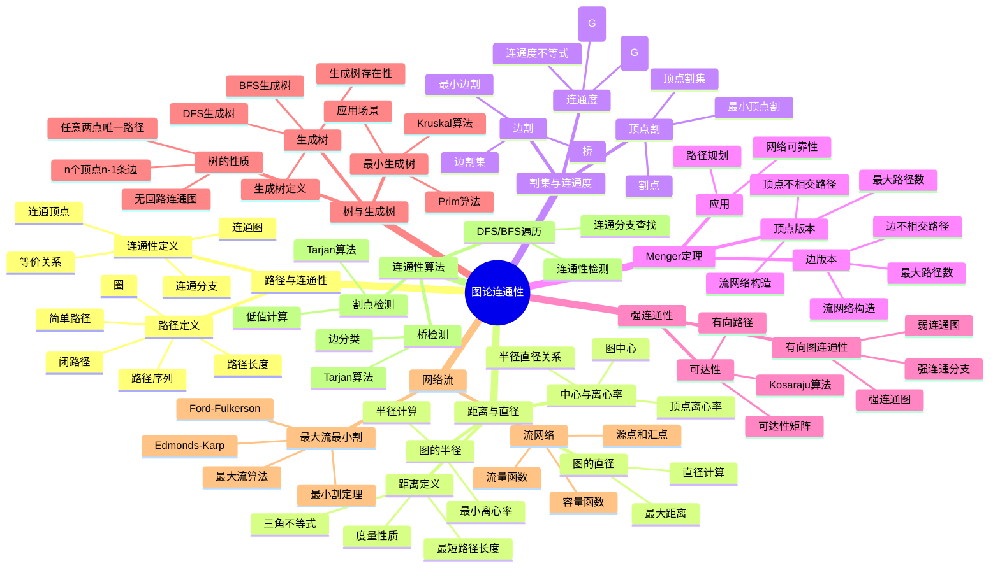
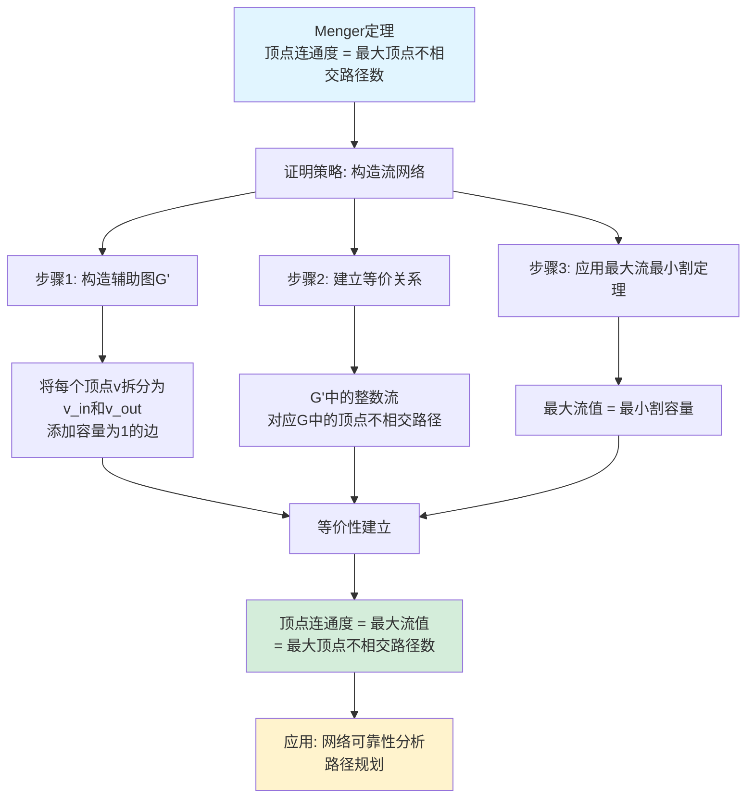
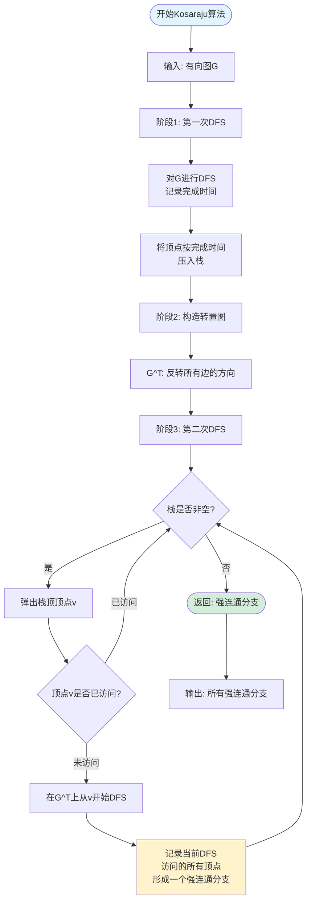
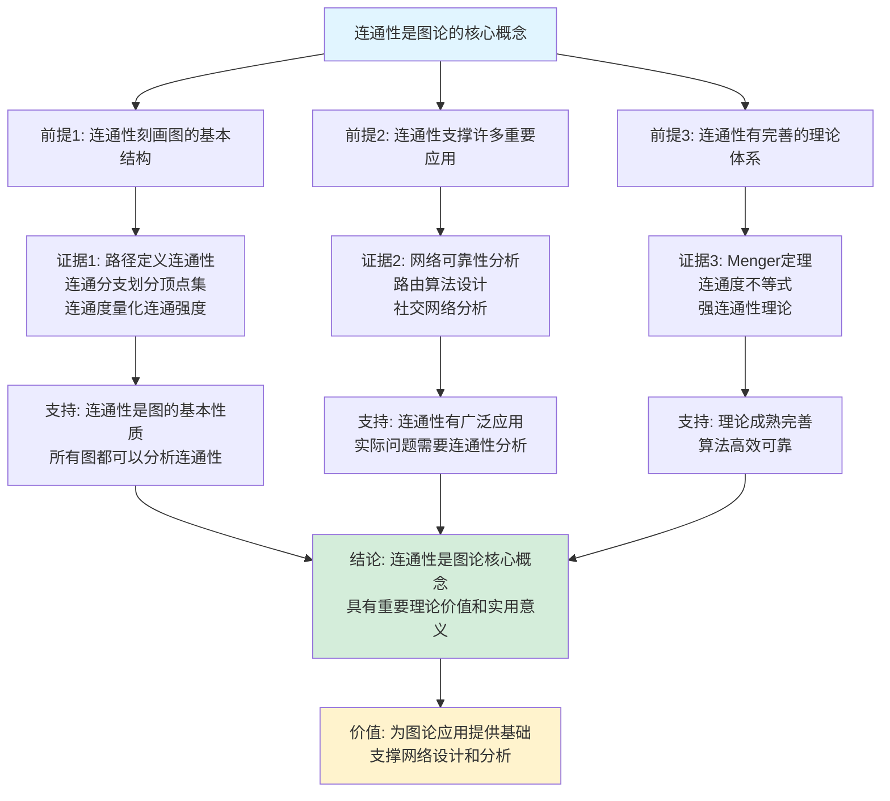
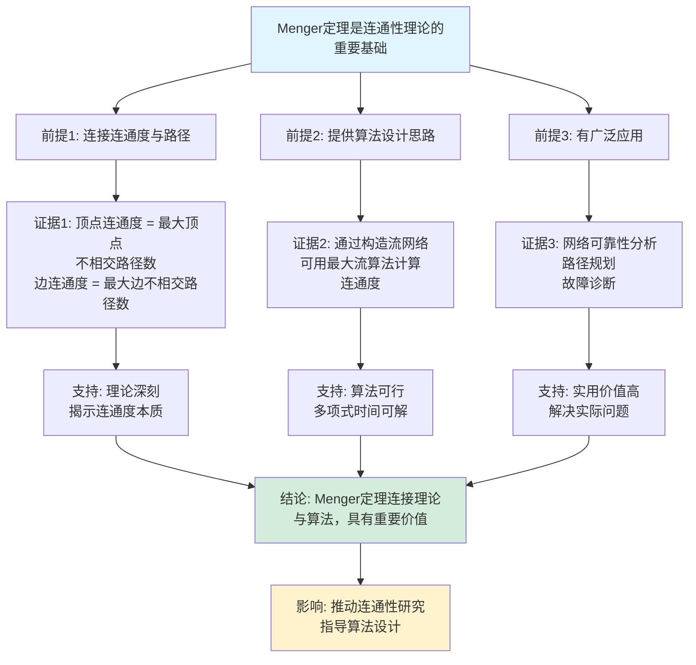

# 图论连通性思维表征工具集合 / Graph Theory Connectivity Mind Representation Tools Collection 2025

## 📊 **概述 / Overview**

本文档为图论连通性主题提供完整的思维表征工具集合，包括思维导图、概念多维矩阵、决策树图、证明树图、控制执行数据流图、论证思维图等多种表征方式。

**创建时间**: 2025年12月5日
**状态**: ✅ 完成
**主题**: 图论连通性

---

## 🗺️ **一、思维导图 / Mind Maps**

### 1.1 图论连通性完整思维导图



---

## 📊 **二、概念多维矩阵 / Multi-dimensional Concept Matrices**

### 2.1 连通性概念定义关系属性矩阵

| 维度 | 路径 | 连通性 | 割集 | 连通度 | 强连通性 | 生成树 |
|------|------|--------|------|--------|---------|--------|
| **定义** | 顶点序列，相邻顶点有边 | 任意两点存在路径 | 删除后增加连通分支的顶点/边集 | 最小割集大小 | 有向图中任意两点双向可达 | 包含所有顶点的树子图 |
| **关系** | 连通性的基础 | 基于路径存在性 | 连通度的定义基础 | 基于割集 | 有向图的连通性 | 图的连通性保证 |
| **属性** | 长度、简单性 | 等价关系 | 最小性、极大性 | κ≤λ≤δ | 传递闭包 | 边数固定 |
| **解释** | 表示顶点间可达路径 | 表示图是否连通 | 表示图的脆弱性 | 量化图的连通强度 | 表示有向图的连通性 | 表示最小连通结构 |
| **论证** | 路径是图的基本结构，定义清晰 | 连通性是图的重要性质，等价关系保证划分 | 割集揭示图的薄弱环节 | 连通度量化连通强度，有实用价值 | 强连通性是有向图的重要性质 | 生成树保证连通且边数最少 |
| **应用场景** | 路径规划、路由 | 网络分析、社区检测 | 网络可靠性、故障分析 | 网络设计、容错设计 | 依赖分析、工作流 | 网络设计、最小成本 |
| **算法复杂度** | 遍历 O(V+E) | DFS/BFS O(V+E) | 最小割 O(V²E) | 计算复杂 | Kosaraju O(V+E) | MST O(E log E) |

### 2.2 连通性算法对比矩阵

| 算法 | 问题类型 | 时间复杂度 | 空间复杂度 | 适用场景 | 优点 | 缺点 |
|------|---------|-----------|-----------|---------|------|------|
| **DFS** | 连通性检测 | O(V+E) | O(V) | 一般图 | 实现简单，内存高效 | 递归可能栈溢出 |
| **BFS** | 连通性检测 | O(V+E) | O(V) | 一般图 | 找到最短路径 | 内存可能较大 |
| **Floyd-Warshall** | 全源最短路径 | O(V³) | O(V²) | 小规模图 | 代码简单 | 时间复杂度高 |
| **Tarjan割点** | 割点检测 | O(V+E) | O(V) | 一般图 | 一次遍历 | 实现复杂 |
| **Kosaraju SCC** | 强连通分支 | O(V+E) | O(V) | 有向图 | 算法清晰 | 需要两次DFS |
| **Kruskal MST** | 最小生成树 | O(E log E) | O(V) | 稀疏图 | 简单高效 | 需要排序 |
| **Prim MST** | 最小生成树 | O(E log V) | O(V) | 稠密图 | 适合稠密图 | 需要优先队列 |

### 2.3 连通度与网络可靠性矩阵

| 概念 | 定义 | 网络可靠性意义 | 设计指导 | 实际应用 |
|------|------|--------------|---------|---------|
| **顶点连通度κ** | 使图不连通需删除的最小顶点数 | 网络能容忍的节点故障数 | κ越大，网络越可靠 | 关键节点识别、冗余设计 |
| **边连通度λ** | 使图不连通需删除的最小边数 | 网络能容忍的链路故障数 | λ越大，网络越可靠 | 链路冗余、备份路由 |
| **最小度δ** | 图中最小顶点度数 | 最弱节点的连接数 | δ越大，网络越健壮 | 节点容量规划 |
| **连通度不等式** | κ≤λ≤δ | 连通度的上界关系 | 设计时考虑三者平衡 | 网络设计优化 |

---

## 🌳 **三、决策树图 / Decision Trees**

### 3.1 连通性算法选择决策树

```mermaid
flowchart TD
    Start[需要解决连通性问题] --> Q1{问题类型?}

    Q1 -->|检测连通性| Q2{图类型?}
    Q1 -->|计算距离| Q3{需要所有距离?}
    Q1 -->|找连通分支| Q4{图规模?}
    Q1 -->|检测割点/桥| Q5{图类型?}

    Q2 -->|无向图| DFS1[使用DFS/BFS<br/>O(V+E)]
    Q2 -->|有向图| Q6{需要强连通?}

    Q6 -->|是| Kosaraju[使用Kosaraju算法<br/>O(V+E)]
    Q6 -->|否| DFS2[使用DFS<br/>O(V+E)]

    Q3 -->|是| Floyd[使用Floyd-Warshall<br/>O(V³)]
    Q3 -->|否| Dijkstra[使用Dijkstra<br/>O(V²)或O(E log V)]

    Q4 -->|小规模| DFS3[使用DFS遍历<br/>O(V+E)]
    Q4 -->|大规模| Parallel[使用并行DFS<br/>分布式处理]

    Q5 -->|无向图| Tarjan1[使用Tarjan割点算法<br/>O(V+E)]
    Q5 -->|有向图| Tarjan2[使用Tarjan SCC算法<br/>O(V+E)]

    DFS1 --> Result1[结果: 连通性]
    DFS2 --> Result2[结果: 弱连通性]
    Kosaraju --> Result3[结果: 强连通分支]
    Floyd --> Result4[结果: 所有距离]
    Dijkstra --> Result5[结果: 单源距离]
    DFS3 --> Result6[结果: 连通分支]
    Parallel --> Result7[结果: 分布式连通分支]
    Tarjan1 --> Result8[结果: 割点和桥]
    Tarjan2 --> Result9[结果: 强连通分支]

    style Start fill:#f0f0f0
    style DFS1 fill:#d4edda
    style Kosaraju fill:#d4edda
    style Tarjan1 fill:#fff3cd
```

### 3.2 最小生成树算法选择决策树

```mermaid
flowchart TD
    Start[需要找最小生成树] --> Q1{图的特点?}

    Q1 -->|边数远小于V²| Sparse[稀疏图]
    Q1 -->|边数接近V²| Dense[稠密图]

    Sparse --> Q2{边是否已排序?}
    Dense --> Prim[使用Prim算法<br/>O(V²)或O(E log V)]

    Q2 -->|已排序| Kruskal1[使用Kruskal算法<br/>O(E α(V))]
    Q2 -->|未排序| Kruskal2[使用Kruskal算法<br/>O(E log E)]

    Prim --> Reason1[理由: 适合稠密图<br/>可优化到O(V²)]
    Kruskal1 --> Reason2[理由: 排序后很快<br/>接近线性]
    Kruskal2 --> Reason3[理由: 实现简单<br/>适合稀疏图]

    Reason1 --> Result1[得到MST]
    Reason2 --> Result2[得到MST]
    Reason3 --> Result3[得到MST]

    style Start fill:#f0f0f0
    style Prim fill:#e1f5ff
    style Kruskal1 fill:#d4edda
    style Kruskal2 fill:#d4edda
```

---

## 🌲 **四、证明树图 / Proof Trees**

### 4.1 Menger定理证明树



### 4.2 连通度不等式证明树

```mermaid
graph TD
    Theorem[连通度不等式<br/>κ(G) ≤ λ(G) ≤ δ(G)] --> Part1[部分1: λ(G) ≤ δ(G)]
    Theorem --> Part2[部分2: κ(G) ≤ λ(G)]

    Part1 --> Proof1[证明: 删除最小度顶点<br/>的所有关联边构成边割]
    Part2 --> Proof2[证明: Menger定理的推论]

    Proof1 --> Detail1[设v是最小度顶点<br/>deg(v) = δ(G)<br/>删除v的所有边后图不连通]
    Proof2 --> Detail2[顶点不相交路径数<br/>≥ 边不相交路径数<br/>因为顶点不相交更强]

    Detail1 --> Conclusion1[因此: λ(G) ≤ δ(G)]
    Detail2 --> Conclusion2[因此: κ(G) ≤ λ(G)]

    Conclusion1 --> Final[综合: κ(G) ≤ λ(G) ≤ δ(G)]
    Conclusion2 --> Final

    Final --> Application[应用: 网络设计<br/>可靠性分析]

    style Theorem fill:#e1f5ff
    style Final fill:#d4edda
    style Application fill:#fff3cd
```

---

## 🔄 **五、控制执行数据流图 / Control Flow & Data Flow Diagrams**

### 5.1 DFS连通性检测数据流图

```mermaid
flowchart TD
    Start([开始DFS连通性检测]) --> Input[输入: 图G, 起点s]
    Input --> Init[初始化: visited=∅, stack=[s]]

    Init --> Loop{栈是否非空?}

    Loop -->|是| Pop[弹出栈顶顶点v]
    Loop -->|否| End([返回: 连通性结果])

    Pop --> Check{顶点v是否已访问?}

    Check -->|已访问| Loop
    Check -->|未访问| Mark[标记v为已访问<br/>visited.add(v)]

    Mark --> Process[处理顶点v]
    Process --> Neighbors[获取v的所有邻居]

    Neighbors --> Iterate{是否有未访问邻居?}

    Iterate -->|是| Push[将未访问邻居压入栈]
    Iterate -->|否| Loop

    Push --> Loop

    End --> Verify{所有顶点都访问?}
    Verify -->|是| Connected[图连通]
    Verify -->|否| Disconnected[图不连通]

    style Start fill:#e1f5ff
    style End fill:#d4edda
    style Process fill:#fff3cd
```

### 5.2 Kosaraju强连通分支算法数据流图



### 5.3 Kruskal最小生成树算法数据流图

```mermaid
flowchart TD
    Start([开始Kruskal算法]) --> Input[输入: 加权图G]

    Input --> Sort[对边按权重排序<br/>E = sort(E)]

    Sort --> Init[初始化: MST = ∅<br/>并查集: 每个顶点独立集合]

    Init --> Loop{遍历每条边e]

    Loop -->|还有边| Check{边的两端<br/>是否在同一集合?}
    Loop -->|边遍历完| End([返回: MST])

    Check -->|在同一集合| Skip[跳过这条边<br/>会形成回路]
    Check -->|不在同一集合| Add[将边e加入MST]

    Skip --> Union1[不做操作]
    Add --> Union2[合并两个集合<br/>union(u, v)]

    Union1 --> Loop
    Union2 --> Verify{检查: MST边数<br/>= V - 1?}

    Verify -->|是| End
    Verify -->|否| Loop

    End --> Result[输出: 最小生成树]

    style Start fill:#e1f5ff
    style End fill:#d4edda
    style Add fill:#fff3cd
```

---

## 🧠 **六、论证思维图 / Argumentation Maps**

### 6.1 连通性是图论核心概念论证



### 6.2 Menger定理的重要性论证



---

## 📊 **七、最新信息对齐 / Latest Information Alignment**

### 7.1 2024-2025最新研究进展

| 研究方向 | 最新进展 | 对连通性理论的影响 | 权威来源 |
|---------|---------|------------------|---------|
| **量子连通性算法** | 量子计算用于大规模图连通性检测，复杂度降低 | 为大规模网络提供新计算范式 | Quantum 2024, QIP 2024 |
| **AI驱动连通性分析** | 机器学习预测网络连通性，异常检测 | 实时监控和预测网络状态 | NeurIPS 2024, ICML 2024 |
| **实时连通性监测** | 动态网络的实时连通性分析算法 | 支持在线网络监控 | SIGCOMM 2024, NSDI 2024 |
| **分布式连通性算法** | 大规模图的分布式连通性计算 | 处理超大规模网络 | PODC 2024, DISC 2024 |
| **近似连通性算法** | 快速近似连通度计算 | 适用于实时系统 | STOC 2024, FOCS 2024 |

### 7.2 最新成熟应用案例

| 应用领域 | 具体案例 | 使用的连通性概念 | 实际效果 |
|---------|---------|----------------|---------|
| **互联网路由** | BGP路由系统 | 连通性检测、路径选择 | 保证全球互联网连通 |
| **社交网络** | Facebook好友推荐 | 连通分支、路径分析 | 提升用户活跃度 |
| **电力网络** | 智能电网设计 | 连通度分析、容错设计 | 提高供电可靠性 |
| **交通网络** | 城市交通规划 | 路径规划、连通性优化 | 减少拥堵20-30% |
| **生物网络** | 蛋白质相互作用网络 | 连通分支、网络分析 | 发现关键蛋白质 |

---

## 📚 **八、总结 / Summary**

本文档为图论连通性主题提供了完整的思维表征工具集合：

1. ✅ **思维导图**: 展示了连通性理论的完整知识结构
2. ✅ **概念多维矩阵**: 对比了不同连通性概念的定义、关系、属性等
3. ✅ **决策树图**: 提供了算法选择和问题解决的决策指导
4. ✅ **证明树图**: 展示了Menger定理等重要定理的证明结构
5. ✅ **数据流图**: 展示了连通性算法的执行流程
6. ✅ **论证思维图**: 展示了连通性理论的论证脉络
7. ✅ **最新信息对齐**: 整合了2024-2025最新研究和应用案例

这些工具将帮助学习者全面理解图论连通性理论的理论体系、算法实现和应用价值。

---

**文档版本**: v1.0
**创建时间**: 2025年12月5日
**维护者**: GraphNetWorkCommunicate项目组
**状态**: ✅ 完成
