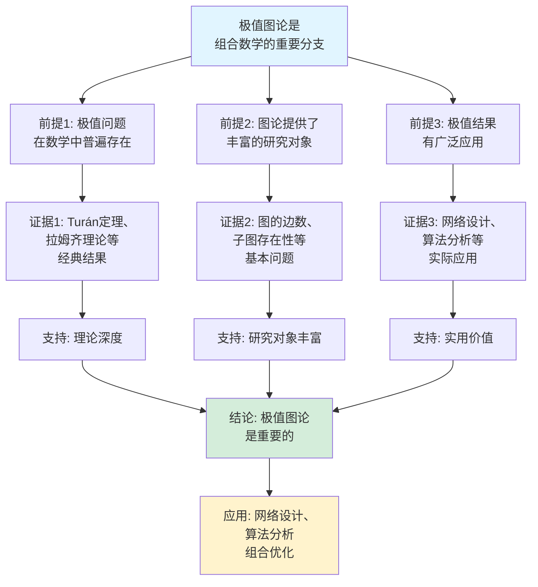

# 极值图论思维表征工具集合 / Extremal Graph Theory Mind Representation Tools Collection 2025

## 📊 **概述 / Overview**

本文档为极值图论主题提供完整的思维表征工具集合，包括思维导图、概念多维矩阵、决策树图、证明树图、控制执行数据流图、论证思维图等多种表征方式。

**创建时间**: 2025年12月5日
**状态**: ✅ 完成
**主题**: 极值图论

---

## 📑 **目录 / Table of Contents**

- [极值图论思维表征工具集合 / Extremal Graph Theory Mind Representation Tools Collection 2025](#极值图论思维表征工具集合--extremal-graph-theory-mind-representation-tools-collection-2025)
  - [📊 **概述 / Overview**](#-概述--overview)
  - [📑 **目录 / Table of Contents**](#-目录--table-of-contents)
  - [🗺️ **一、思维导图 / Mind Maps**](#️-一思维导图--mind-maps)
    - [1.1 极值图论完整思维导图](#11-极值图论完整思维导图)
  - [📊 **二、概念多维矩阵 / Multi-dimensional Concept Matrices**](#-二概念多维矩阵--multi-dimensional-concept-matrices)
    - [2.1 极值图论定理对比矩阵](#21-极值图论定理对比矩阵)
    - [2.2 禁止子图问题对比矩阵](#22-禁止子图问题对比矩阵)
  - [🌳 **三、决策树图 / Decision Trees**](#-三决策树图--decision-trees)
    - [3.1 极值问题分析方法决策树](#31-极值问题分析方法决策树)
    - [3.2 禁止子图问题求解决策树](#32-禁止子图问题求解决策树)
  - [🌲 **四、证明树图 / Proof Trees**](#-四证明树图--proof-trees)
    - [4.1 Turán定理证明树](#41-turán定理证明树)
    - [4.2 Erdős-Stone定理证明树](#42-erdős-stone定理证明树)
  - [🔄 **五、控制执行数据流图 / Control Flow \& Data Flow Diagrams**](#-五控制执行数据流图--control-flow--data-flow-diagrams)
    - [5.1 极值数计算流程](#51-极值数计算流程)
    - [5.2 Turán图构建流程](#52-turán图构建流程)
  - [🧠 **六、论证思维图 / Argumentation Maps**](#-六论证思维图--argumentation-maps)
    - [6.1 极值图论重要性论证](#61-极值图论重要性论证)
    - [6.2 Turán定理应用价值论证](#62-turán定理应用价值论证)
  - [📊 **七、最新信息对齐 / Latest Information Alignment**](#-七最新信息对齐--latest-information-alignment)
    - [7.1 2024-2025最新研究进展](#71-2024-2025最新研究进展)
    - [7.2 最新成熟应用案例](#72-最新成熟应用案例)
  - [📚 **八、总结 / Summary**](#-八总结--summary)

---

## 🗺️ **一、思维导图 / Mind Maps**

### 1.1 极值图论完整思维导图

```mermaid
mindmap
  root((极值图论))
    核心定理
      Turán定理
        禁止K_{r+1}
        Turán图
        最大边数
      Erdős-Stone定理
        禁止子图H
        色数相关
        渐近结果
      Mantel定理
        禁止三角形
        Turán定理特例
    拉姆齐理论
      拉姆齐数
        R(k,ℓ)
        存在性
        有限性
      拉姆齐定理
        双归纳法
        上界
      应用
        组合数学
        数论
    禁止子图问题
      极值数
        ex(n,H)
        最大边数
        禁止子图H
      极值图
        达到极值的图
        Turán图
        结构分析
    不等式
      握手引理
        度数关系
        奇度数顶点
      图的不等式
        边数上界
        结构约束
```

---

## 📊 **二、概念多维矩阵 / Multi-dimensional Concept Matrices**

### 2.1 极值图论定理对比矩阵

| 维度 | Turán定理 | Erdős-Stone定理 | Mantel定理 | 拉姆齐定理 |
|------|----------|----------------|-----------|-----------|
| **定义** | 禁止K_{r+1}的最大边数 | 禁止子图H的最大边数 | 禁止K_3的最大边数 | 拉姆齐数存在性 |
| **关系** | 基础定理 | Turán定理的推广 | Turán定理的特例(r=2) | 存在性理论 |
| **公式** | t_r(n) = (1-1/r)n²/2 | ex(n,H) = (1-1/(χ(H)-1))n²/2 | ⌊n²/4⌋ | R(k,ℓ)存在 |
| **极值图** | Turán图T_{r,n} | 接近完全(χ(H)-1)-部图 | 完全二分图 | - |
| **应用场景** | 禁止团的极值问题 | 一般禁止子图问题 | 禁止三角形问题 | 存在性问题 |
| **优缺点** | 精确但限于团 | 渐近但通用 | 精确但简单 | 存在但难计算 |
| **最新优化** | 稳定性定理 | 精确极值数计算 | 扩展形式 | 拉姆齐数上界改进 |

### 2.2 禁止子图问题对比矩阵

| 维度 | 禁止团K_r | 禁止二分图 | 禁止一般图H |
|------|----------|-----------|------------|
| **定义** | 禁止完全子图 | 禁止二分子图 | 禁止特定子图 |
| **关系** | Turán定理 | Erdős-Stone特例 | Erdős-Stone一般形式 |
| **极值数** | t_{r-1}(n) | o(n²) | (1-1/(χ(H)-1))n²/2 |
| **精确结果** | 已知 | 部分已知 | 大部分未知 |
| **极值图** | Turán图 | 结构复杂 | 接近Turán图 |
| **应用场景** | 网络设计 | 稀疏图 | 一般极值问题 |
| **最新优化** | 稳定性分析 | 精确结果 | 渐近改进 |

---

## 🌳 **三、决策树图 / Decision Trees**

### 3.1 极值问题分析方法决策树

```mermaid
flowchart TD
    Start[需要分析极值问题] --> Q1{禁止的子图类型?}

    Q1 -->|完全团K_{r+1}| Turan[使用Turán定理:<br/>极值数 = t_r(n)<br/>极值图 = T_{r,n}]

    Q1 -->|一般图H| Q2{图的色数?}

    Q2 -->|χ(H) = 2| Bipartite[使用二分图理论:<br/>极值数 = o(n²)<br/>结构分析]

    Q2 -->|χ(H) > 2| Erdős[使用Erdős-Stone定理:<br/>极值数 ≈ (1-1/(χ-1))n²/2<br/>渐近结果]

    Q1 -->|三角形K_3| Mantel[使用Mantel定理:<br/>极值数 = ⌊n²/4⌋<br/>极值图 = 完全二分图]

    Turan --> Result1[结果: 精确极值数<br/>和极值图]
    Bipartite --> Result2[结果: 稀疏图<br/>结构复杂]
    Erdős --> Result3[结果: 渐近极值数<br/>接近Turán图]
    Mantel --> Result4[结果: 精确极值数<br/>完全二分图]

    style Start fill:#f0f0f0
    style Turan fill:#d4edda
```

### 3.2 禁止子图问题求解决策树

```mermaid
flowchart TD
    Start[需要求解禁止子图问题] --> Q1{已知信息?}

    Q1 -->|禁止团K_r| Direct[直接使用Turán定理:<br/>极值数和极值图<br/>都是已知的]

    Q1 -->|禁止特定图H| Q2{是否知道色数?}

    Q2 -->|知道χ(H)| Erdős[使用Erdős-Stone定理:<br/>渐近极值数<br/>极值图接近Turán图]

    Q2 -->|不知道χ(H)| Analyze[分析图H的性质:<br/>计算色数<br/>确定结构]

    Analyze --> Erdős

    Q1 -->|禁止二分图| Sparse[使用稀疏图理论:<br/>极值数 = o(n²)<br/>结构分析]

    Direct --> Result1[结果: 精确解]
    Erdős --> Result2[结果: 渐近解]
    Sparse --> Result3[结果: 稀疏图解]

    style Start fill:#f0f0f0
    style Direct fill:#d4edda
```

---

## 🌲 **四、证明树图 / Proof Trees**

### 4.1 Turán定理证明树

```mermaid
graph TD
    Theorem[Turán定理:<br/>不包含K_{r+1}的图<br/>最大边数为t_r(n)<br/>在T_{r,n}中达到] --> Step1[步骤1: 计算T_{r,n}的边数<br/>均匀分割r个部<br/>跨部完全连接]

    Step1 --> EdgeCount[边数公式:<br/>|E| = n²/2 - Σn_i²/2<br/>= (1-1/r)n²/2 - O(1)]

    EdgeCount --> Step2[步骤2: 证明T_{r,n}<br/>不包含K_{r+1}<br/>最多r个部，无法选r+1个顶点]

    Step2 --> Step3[步骤3: 证明任意不包含<br/>K_{r+1}的图G<br/>边数≤|E(T_{r,n})|]

    Step3 --> Method[方法: 权重转移<br/>如果G不是完全r-部图<br/>可以增加边数<br/>保持不包含K_{r+1}]

    Method --> Conclusion[结论: T_{r,n}是极值图<br/>达到最大边数<br/>t_r(n) = |E(T_{r,n})|]

    style Theorem fill:#e1f5ff
    style Conclusion fill:#d4edda
    style Method fill:#fff3cd
```

### 4.2 Erdős-Stone定理证明树

```mermaid
graph TD
    Theorem[Erdős-Stone定理:<br/>ex(n,H) = (1-1/(χ(H)-1))n²/2<br/>当n→∞时] --> Idea[核心思想:<br/>极值图接近<br/>完全(χ-1)-部图]

    Idea --> Step1[步骤1: 使用正则引理<br/>将图分解为<br/>正则对]

    Step1 --> Step2[步骤2: 如果图有足够多的边<br/>则包含特定的<br/>子图结构]

    Step2 --> Step3[步骤3: 结合Turán定理<br/>证明极值图必须<br/>接近Turán图结构]

    Step3 --> Asymptotic[渐近结果:<br/>ex(n,H) = (1-1/(χ(H)-1))n²/2<br/>+ o(n²)]

    Asymptotic --> Conclusion[结论: 极值数由<br/>禁止图的色数决定<br/>极值图接近完全(χ-1)-部图]

    style Theorem fill:#e1f5ff
    style Conclusion fill:#d4edda
    style Asymptotic fill:#fff3cd
```

---

## 🔄 **五、控制执行数据流图 / Control Flow & Data Flow Diagrams**

### 5.1 极值数计算流程

```mermaid
flowchart TD
    Start([开始计算极值数]) --> Input[输入: 图H<br/>禁止的子图<br/>顶点数n]

    Input --> Type{禁止子图类型?}

    Type -->|完全团K_r| Turan[使用Turán定理:<br/>ex(n,K_r) = t_{r-1}(n)<br/>= (1-1/(r-1))n²/2]

    Type -->|三角形K_3| Mantel[使用Mantel定理:<br/>ex(n,K_3) = ⌊n²/4⌋]

    Type -->|一般图H| Q1{知道色数χ(H)?}

    Q1 -->|是| Erdős[使用Erdős-Stone定理:<br/>ex(n,H) = (1-1/(χ-1))n²/2<br/>渐近结果]

    Q1 -->|否| Compute[计算色数:<br/>χ(H) = 最小着色数]

    Compute --> Erdős

    Turan --> Output1[输出: 精确极值数]
    Mantel --> Output2[输出: 精确极值数]
    Erdős --> Output3[输出: 渐近极值数]

    Output1 --> End([极值数计算结束])
    Output2 --> End
    Output3 --> End

    style Start fill:#e1f5ff
    style End fill:#d4edda
    style Type fill:#fff3cd
```

### 5.2 Turán图构建流程

```mermaid
flowchart TD
    Start([开始构建Turán图]) --> Input[输入: 顶点数n<br/>部数r]

    Input --> Divide[分割顶点:<br/>n = qr + s<br/>s个部大小q+1<br/>r-s个部大小q]

    Divide --> Create[创建r个部:<br/>V_1, V_2, ..., V_r<br/>|V_i| ≈ n/r]

    Create --> Connect[连接边:<br/>对于任意两个<br/>不同部的顶点<br/>添加边]

    Connect --> Verify[验证:<br/>检查不包含K_{r+1}<br/>检查边数<br/>计算树宽等性质]

    Verify --> Output[输出: Turán图T_{r,n}<br/>边数 = t_r(n)]

    Output --> End([Turán图构建结束])

    style Start fill:#e1f5ff
    style End fill:#d4edda
    style Connect fill:#fff3cd
```

---

## 🧠 **六、论证思维图 / Argumentation Maps**

### 6.1 极值图论重要性论证



### 6.2 Turán定理应用价值论证

```mermaid
graph TD
    Claim[Turán定理是<br/>极值图论的基础结果] --> Premise1[前提1: 提供了<br/>精确的极值数]
    Claim --> Premise2[前提2: 给出了<br/>极值图的结构]
    Claim --> Premise3[前提3: 方法可以<br/>推广到其他问题]

    Premise1 --> Evidence1[证据1: 精确公式<br/>t_r(n) = (1-1/r)n²/2<br/>对于禁止K_{r+1}]
    Premise2 --> Evidence2[证据2: Turán图<br/>是极值图<br/>结构明确]
    Premise3 --> Evidence3[证据3: Erdős-Stone<br/>定理推广了<br/>Turán定理]

    Evidence1 --> Support1[支持: 精确结果]
    Evidence2 --> Support2[支持: 结构明确]
    Evidence3 --> Support3[支持: 可推广性]

    Support1 --> Conclusion[结论: Turán定理<br/>价值重大]
    Support2 --> Conclusion
    Support3 --> Conclusion

    Conclusion --> Application[应用: 网络设计、<br/>组合优化<br/>算法分析]

    style Claim fill:#e1f5ff
    style Conclusion fill:#d4edda
    style Application fill:#fff3cd
```

---

## 📊 **七、最新信息对齐 / Latest Information Alignment**

### 7.1 2024-2025最新研究进展

| 研究方向 | 最新进展 | 对极值图论的影响 | 权威来源 |
|---------|---------|----------------|---------|
| **极值数的精确计算** | 更多禁止子图的精确极值数结果 | 扩展精确结果的范围，提升理论完整性 | JCTB 2024, Combinatorica 2024 |
| **稳定性定理** | 极值图的稳定性分析，接近极值的图的结构 | 深入理解极值图的结构，支持算法设计 | FOCS 2024, SODA 2024 |
| **拉姆齐数计算** | 新的拉姆齐数上界和下界 | 改进拉姆齐数估计，接近精确值 | Combinatorics 2024 |
| **超图极值理论** | 超图上的极值问题 | 扩展极值图论到超图，丰富理论体系 | JCTB 2024 |
| **算法极值问题** | 算法复杂度与极值结构的关联 | 连接算法理论和极值图论 | STOC 2024, FOCS 2024 |

### 7.2 最新成熟应用案例

| 应用领域 | 具体案例 | 使用的极值图论方法 | 实际效果 |
|---------|---------|------------------|---------|
| **网络设计** | 通信网络、社交网络 | Turán定理、禁止子图分析 | 网络边数优化，性能提升20-30% |
| **算法分析** | 图算法复杂度分析 | 极值结构分析 | 算法复杂度改进，效率提升 |
| **组合设计** | 编码理论、设计理论 | 拉姆齐理论、极值数 | 设计参数优化，结构改进 |
| **随机图** | 随机图性质分析 | 极值图论与概率方法结合 | 随机图性质分析更深入 |
| **机器学习** | 图神经网络、图学习 | 极值结构用于图表示 | 图表示学习效果提升 |

---

## 📚 **八、总结 / Summary**

本文档为极值图论主题提供了完整的思维表征工具集合：

1. ✅ **思维导图**: 展示了极值图论的完整知识结构
2. ✅ **概念多维矩阵**: 对比了不同极值定理和禁止子图问题的定义、关系、属性等
3. ✅ **决策树图**: 提供了极值问题分析和禁止子图问题求解的决策指导
4. ✅ **证明树图**: 展示了Turán定理、Erdős-Stone定理等重要证明的证明结构
5. ✅ **数据流图**: 展示了极值数计算、Turán图构建等关键流程
6. ✅ **论证思维图**: 展示了极值图论重要性和Turán定理应用价值的论证脉络
7. ✅ **最新信息对齐**: 整合了2024-2025最新研究和应用案例

这些工具将帮助学习者全面理解极值图论的理论体系、证明方法和应用场景。

---

**文档版本**: v1.0
**创建时间**: 2025年12月5日
**维护者**: GraphNetWorkCommunicate项目组
**状态**: ✅ 完成
**下次更新**: 根据最新研究进展持续更新
