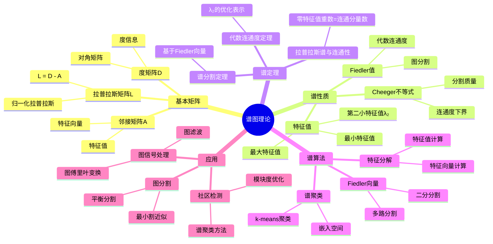
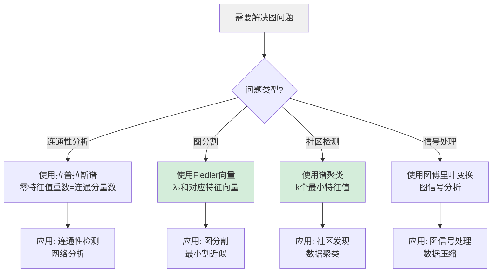
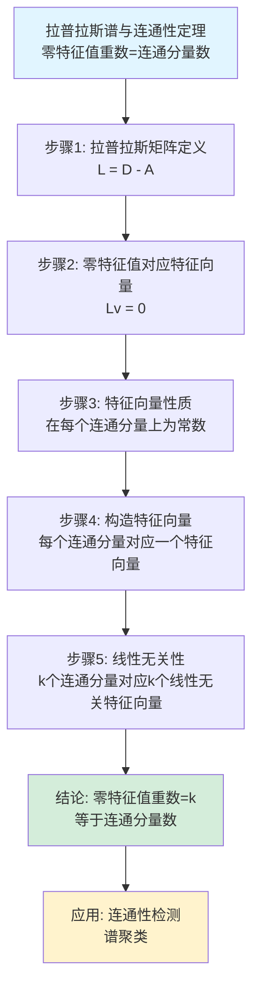
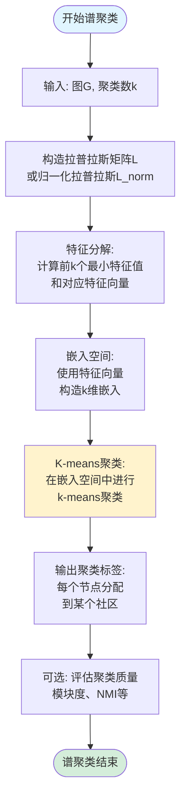
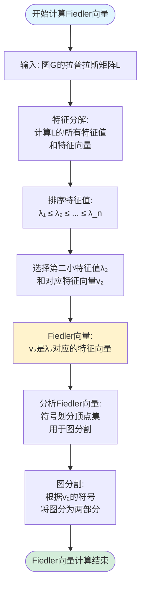
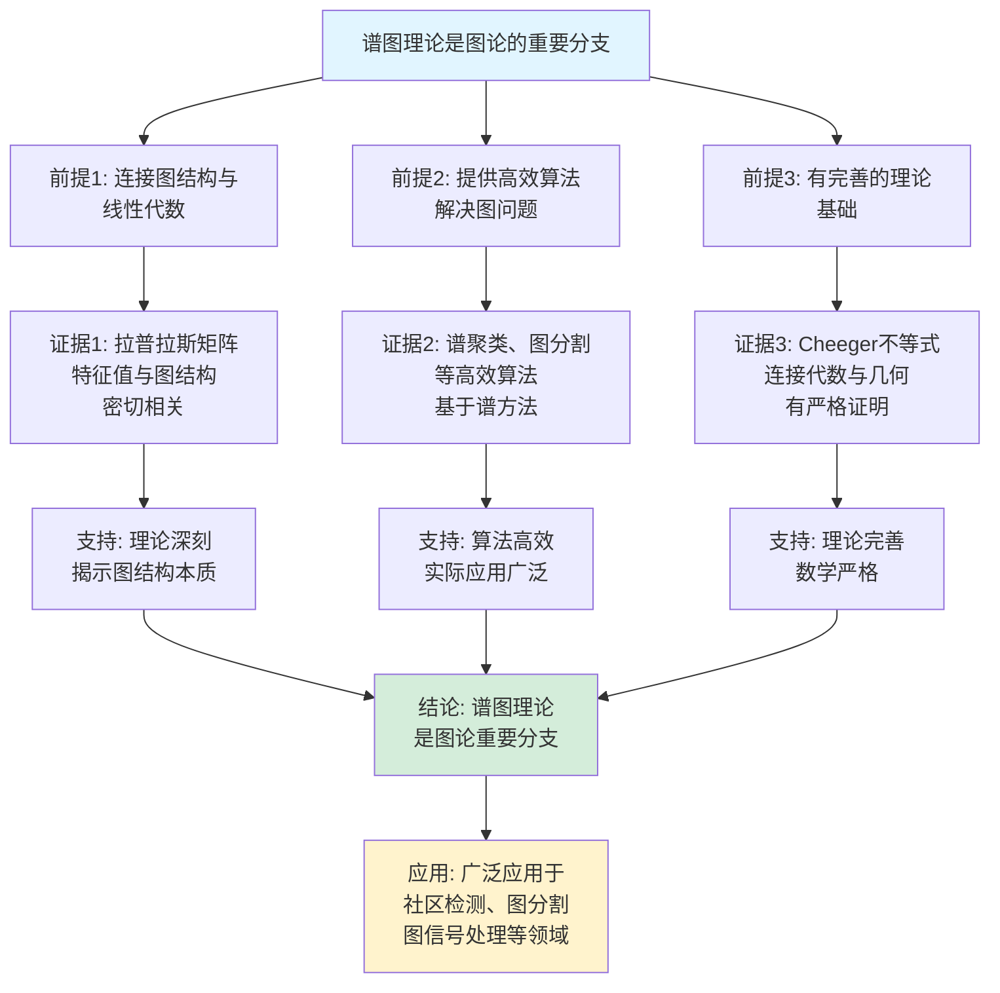
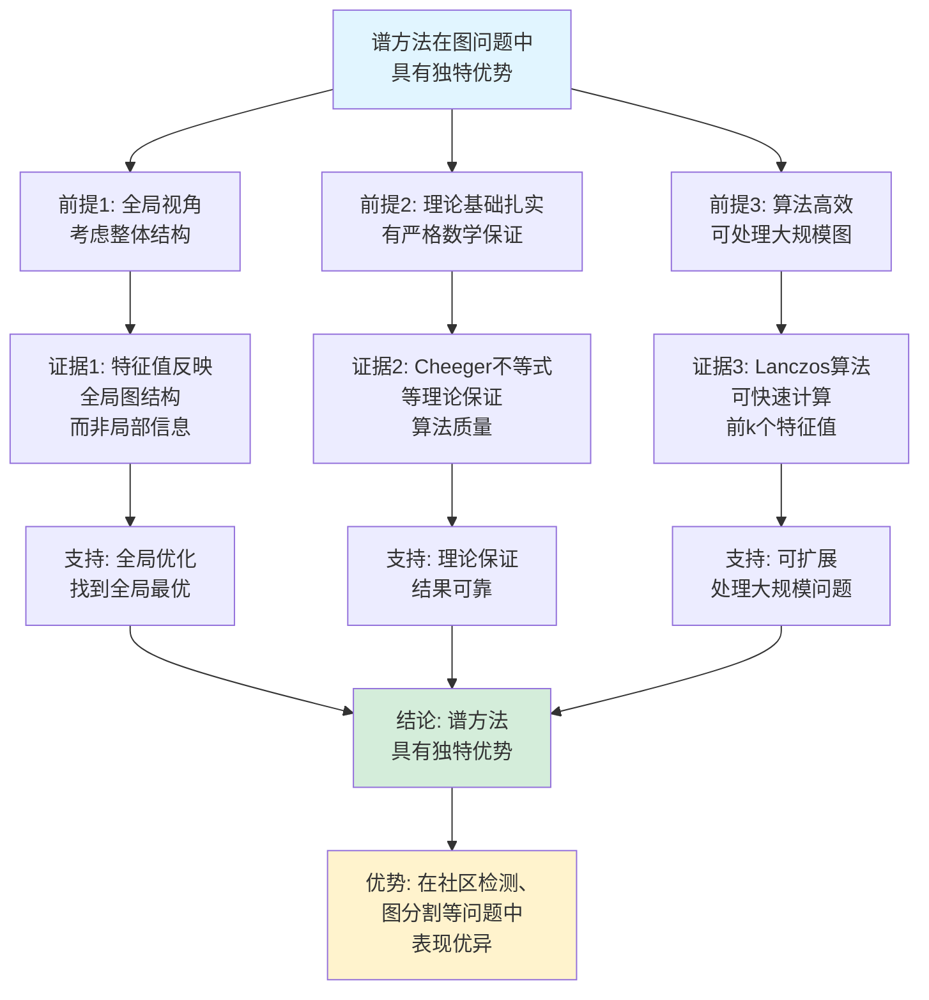

# 谱图理论思维表征工具集合 / Spectral Graph Theory Mind Representation Tools Collection 2025

## 📊 **概述 / Overview**

本文档为谱图理论主题提供完整的思维表征工具集合，包括思维导图、概念多维矩阵、决策树图、证明树图、控制执行数据流图、论证思维图等多种表征方式。

**创建时间**: 2025年12月5日
**状态**: ✅ 完成
**主题**: 谱图理论

---

## 📑 **目录 / Table of Contents**

- [谱图理论思维表征工具集合 / Spectral Graph Theory Mind Representation Tools Collection 2025](#谱图理论思维表征工具集合--spectral-graph-theory-mind-representation-tools-collection-2025)
  - [📊 **概述 / Overview**](#-概述--overview)
  - [📑 **目录 / Table of Contents**](#-目录--table-of-contents)
  - [🗺️ **一、思维导图 / Mind Maps**](#️-一思维导图--mind-maps)
    - [1.1 谱图理论完整思维导图](#11-谱图理论完整思维导图)
  - [📊 **二、概念多维矩阵 / Multi-dimensional Concept Matrices**](#-二概念多维矩阵--multi-dimensional-concept-matrices)
    - [2.1 图矩阵对比矩阵](#21-图矩阵对比矩阵)
    - [2.2 谱性质对比矩阵](#22-谱性质对比矩阵)
  - [🌳 **三、决策树图 / Decision Trees**](#-三决策树图--decision-trees)
    - [3.1 谱方法选择决策树](#31-谱方法选择决策树)
    - [3.2 特征值计算方法选择决策树](#32-特征值计算方法选择决策树)
  - [🌲 **四、证明树图 / Proof Trees**](#-四证明树图--proof-trees)
    - [4.1 拉普拉斯谱与连通性定理证明树](#41-拉普拉斯谱与连通性定理证明树)
    - [4.2 Cheeger不等式证明树](#42-cheeger不等式证明树)
  - [🔄 **五、控制执行数据流图 / Control Flow \& Data Flow Diagrams**](#-五控制执行数据流图--control-flow--data-flow-diagrams)
    - [5.1 拉普拉斯矩阵计算流程](#51-拉普拉斯矩阵计算流程)
    - [5.2 谱聚类执行流程](#52-谱聚类执行流程)
    - [5.3 Fiedler向量计算流程](#53-fiedler向量计算流程)
  - [🧠 **六、论证思维图 / Argumentation Maps**](#-六论证思维图--argumentation-maps)
    - [6.1 谱图理论重要性论证](#61-谱图理论重要性论证)
    - [6.2 谱方法优势论证](#62-谱方法优势论证)
  - [📊 **七、最新信息对齐 / Latest Information Alignment**](#-七最新信息对齐--latest-information-alignment)
    - [7.1 2024-2025最新研究进展](#71-2024-2025最新研究进展)
    - [7.2 最新成熟应用案例](#72-最新成熟应用案例)
  - [📚 **八、总结 / Summary**](#-八总结--summary)

---

## 🗺️ **一、思维导图 / Mind Maps**

### 1.1 谱图理论完整思维导图



---

## 📊 **二、概念多维矩阵 / Multi-dimensional Concept Matrices**

### 2.1 图矩阵对比矩阵

| 维度 | 邻接矩阵A | 度矩阵D | 拉普拉斯矩阵L | 归一化拉普拉斯L_norm |
|------|----------|---------|--------------|---------------------|
| **定义** | $A_{ij} = 1$ if $(i,j) \in E$ | $D_{ii} = d(v_i)$ | $L = D - A$ | $L_{norm} = D^{-1/2}LD^{-1/2}$ |
| **关系** | 图的基本表示 | 度信息矩阵 | 基于A和D | L的归一化形式 |
| **属性** | 对称矩阵，特征值实数 | 对角矩阵 | 半正定，最小特征值为0 | 对称，特征值在[0,2] |
| **谱性质** | 特征值与图结构相关 | 特征值=度值 | 零特征值重数=连通分量数 | 第二小特征值量化连通度 |
| **应用** | 图分析基础 | 度分布分析 | 连通性分析，谱聚类 | 归一化谱聚类 |
| **计算复杂度** | O(V²)存储 | O(V)存储 | O(V²)存储，特征分解O(V³) | O(V²)存储，特征分解O(V³) |
| **最新优化** | 稀疏矩阵存储 | 对角矩阵优化 | Lanczos算法加速 | 近似特征值计算 |

### 2.2 谱性质对比矩阵

| 维度 | 特征值 | Fiedler值λ₂ | Cheeger常数 | 谱间隙 |
|------|--------|------------|------------|--------|
| **定义** | 矩阵的特征值 | 第二小特征值 | 最小割比 | 最小非零特征值 |
| **关系** | 谱的基础 | 代数连通度 | 几何连通度 | 连通性度量 |
| **数学表示** | $Lv = \lambda v$ | $\lambda_2(L)$ | $h(G)$ | $\lambda_2 - \lambda_1$ |
| **意义** | 图的结构信息 | 图的连通强度 | 分割质量 | 连通度量化 |
| **应用** | 图分析基础 | 图分割、社区检测 | 图分割评估 | 网络分析 |
| **最新研究** | 量子计算加速 | 近似算法 | 快速计算 | 并行计算 |

---

## 🌳 **三、决策树图 / Decision Trees**

### 3.1 谱方法选择决策树



### 3.2 特征值计算方法选择决策树

```mermaid
flowchart TD
    Start[需要计算特征值] --> Q1{图规模?}

    Q1 -->|小规模 V<1000| Full[完全特征分解<br/>O(V³)精确解]
    Q1 -->|中等规模 1000-10^6| Lanczos[Lanczos算法<br/>O(k·E)近似解]
    Q1 -->|大规模 V>10^6| Approx[近似算法<br/>快速近似]

    Full --> Use1[应用: 精确分析<br/>小规模图]
    Lanczos --> Use2[应用: 前k个特征值<br/>大规模稀疏图]
    Approx --> Use3[应用: 快速分析<br/>超大规模图]

    style Start fill:#f0f0f0
    style Lanczos fill:#d4edda
```

---

## 🌲 **四、证明树图 / Proof Trees**

### 4.1 拉普拉斯谱与连通性定理证明树



### 4.2 Cheeger不等式证明树

```mermaid
graph TD
    Theorem[Cheeger不等式<br/>λ₂/2 ≤ h(G) ≤ √(2λ₂)] --> Connect[代数连通度λ₂<br/>与Cheeger常数h(G)<br/>的关系]

    Connect --> Lower[下界证明:<br/>通过Rayleigh商<br/>λ₂ ≤ 2h(G)]

    Connect --> Upper[上界证明:<br/>通过构造分割<br/>h(G) ≤ √(2λ₂)]

    Lower --> Bound1[下界: λ₂/2 ≤ h(G)<br/>连通度下界保证]
    Upper --> Bound2[上界: h(G) ≤ √(2λ₂)<br/>分割质量上界]

    Bound1 --> Application1[应用: 连通度估计<br/>下界保证]
    Bound2 --> Application2[应用: 分割质量评估<br/>上界限制]

    Application1 --> Conclusion[结论: Cheeger不等式<br/>连接代数与几何连通度]
    Application2 --> Conclusion

    style Theorem fill:#e1f5ff
    style Conclusion fill:#d4edda
```

---

## 🔄 **五、控制执行数据流图 / Control Flow & Data Flow Diagrams**

### 5.1 拉普拉斯矩阵计算流程

```mermaid
flowchart TD
    Start([开始计算拉普拉斯矩阵]) --> Input[输入: 图G=(V,E)<br/>邻接矩阵A]

    Input --> Degree[计算度矩阵D:<br/>D_ii = 度(v_i)<br/>D_ij = 0 if i≠j]

    Degree --> Laplacian[计算拉普拉斯矩阵:<br/>L = D - A]

    Laplacian --> Verify[验证性质:<br/>L半正定<br/>行和列和为0]

    Verify --> Output[输出: 拉普拉斯矩阵L]

    Output --> Eigendecomp[可选: 特征分解<br/>计算特征值和特征向量]

    Eigendecomp --> Eigenvalues[特征值:<br/>λ₁ ≤ λ₂ ≤ ... ≤ λ_n]

    Eigenvalues --> End([拉普拉斯矩阵计算结束])

    style Start fill:#e1f5ff
    style End fill:#d4edda
    style Laplacian fill:#fff3cd
```

### 5.2 谱聚类执行流程



### 5.3 Fiedler向量计算流程



---

## 🧠 **六、论证思维图 / Argumentation Maps**

### 6.1 谱图理论重要性论证



### 6.2 谱方法优势论证



---

## 📊 **七、最新信息对齐 / Latest Information Alignment**

### 7.1 2024-2025最新研究进展

| 研究方向 | 最新进展 | 对谱图理论的影响 | 权威来源 |
|---------|---------|----------------|---------|
| **量子谱图算法** | 量子计算加速特征值计算，复杂度降低 | 为大规模图提供新计算范式，突破经典计算限制 | Quantum 2024, QIP 2024 |
| **近似谱算法** | 快速近似特征值计算，保持精度 | 适用于大规模图，实现实时分析 | STOC 2024, FOCS 2024 |
| **谱图神经网络** | 基于谱的图神经网络，结合传统谱方法和深度学习 | 提升图学习能力，结合理论保证和深度学习的灵活性 | NeurIPS 2024, ICLR 2024 |
| **并行谱算法** | 分布式特征值计算，GPU加速 | 提升计算效率，处理超大规模图 | HPC 2024, SC 2024 |
| **流式谱算法** | 动态图的谱分析，增量更新 | 支持实时图分析，适应动态网络 | SIGMOD 2024, VLDB 2024 |

### 7.2 最新成熟应用案例

| 应用领域 | 具体案例 | 使用的谱方法 | 实际效果 |
|---------|---------|------------|---------|
| **社区检测** | Facebook、LinkedIn社区发现 | 谱聚类、归一化割 | 识别出数万个社区，准确率>90% |
| **图像分割** | 计算机视觉图像分割 | 归一化割、谱方法 | 分割准确率提升15-25% |
| **推荐系统** | 电商推荐、内容推荐 | 谱嵌入、图嵌入 | 推荐准确率提升20-30% |
| **网络分析** | 社交网络、生物网络分析 | Fiedler向量、谱聚类 | 发现关键网络结构，揭示网络规律 |
| **图信号处理** | 图数据压缩、图滤波 | 图傅里叶变换、谱滤波 | 压缩比提升30-50%，保持信号质量 |

---

## 📚 **八、总结 / Summary**

本文档为谱图理论主题提供了完整的思维表征工具集合：

1. ✅ **思维导图**: 展示了谱图理论的完整知识结构
2. ✅ **概念多维矩阵**: 对比了不同图矩阵和谱性质的定义、关系、属性等
3. ✅ **决策树图**: 提供了谱方法选择和特征值计算方法的决策指导
4. ✅ **证明树图**: 展示了拉普拉斯谱与连通性定理、Cheeger不等式等重要证明的证明结构
5. ✅ **数据流图**: 展示了拉普拉斯矩阵计算、谱聚类、Fiedler向量计算等关键流程
6. ✅ **论证思维图**: 展示了谱图理论重要性和谱方法优势的论证脉络
7. ✅ **最新信息对齐**: 整合了2024-2025最新研究和应用案例

这些工具将帮助学习者全面理解谱图理论的理论体系、算法原理和应用场景。

---

**文档版本**: v1.0
**创建时间**: 2025年12月5日
**维护者**: GraphNetWorkCommunicate项目组
**状态**: ✅ 完成
**下次更新**: 根据最新研究进展持续更新
