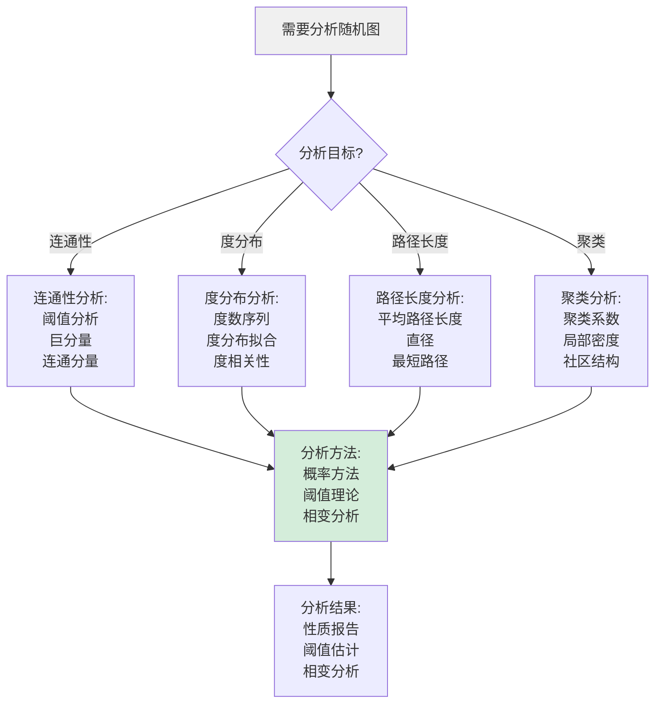
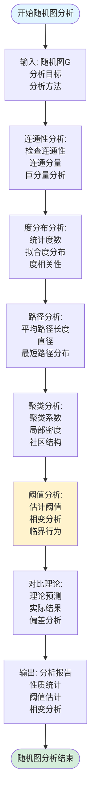
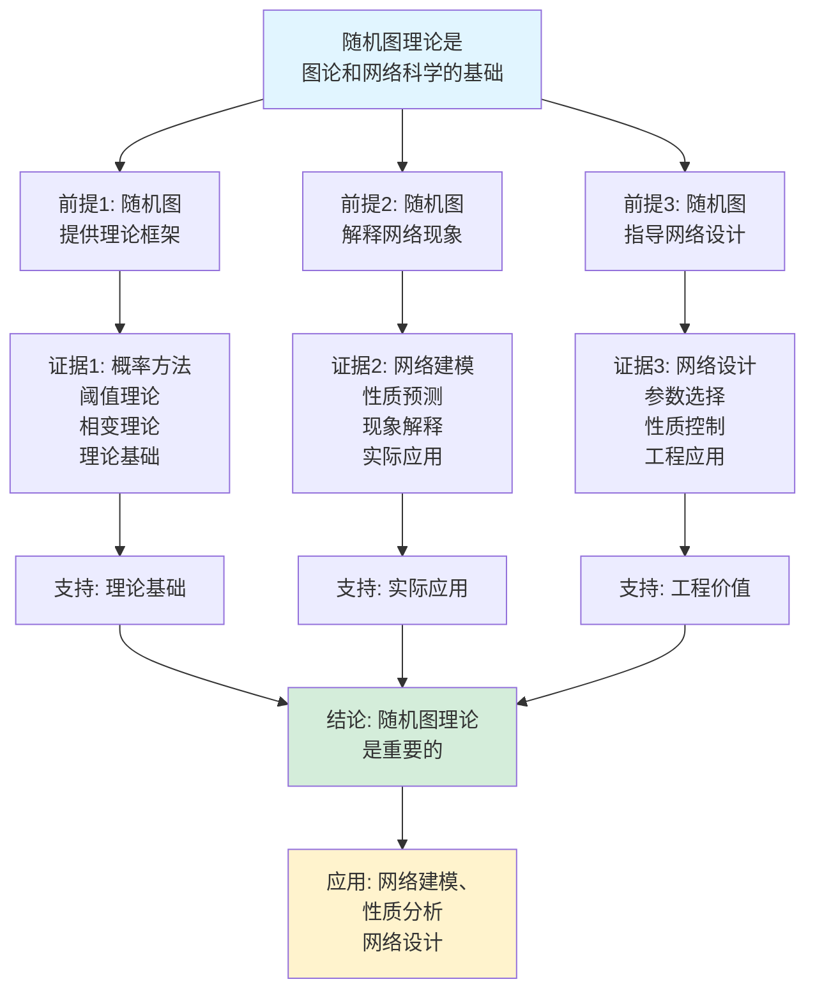
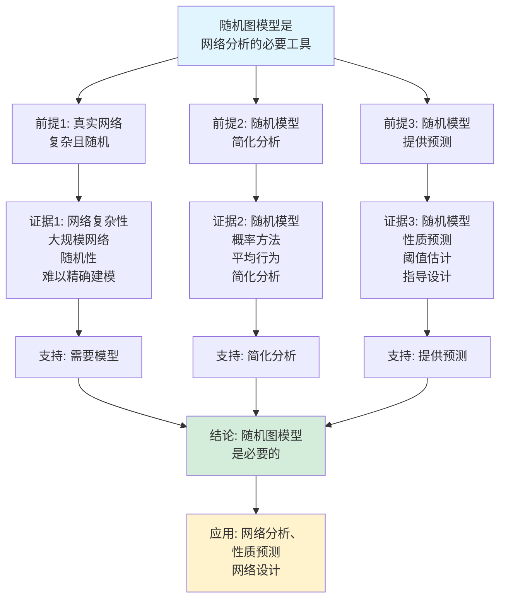

# 随机图理论思维表征工具集合 / Random Graph Theory Mind Representation Tools Collection 2025

## 📊 **概述 / Overview**

本文档为随机图理论主题提供完整的思维表征工具集合，包括思维导图、概念多维矩阵、决策树图、证明树图、控制执行数据流图、论证思维图等多种表征方式。

**创建时间**: 2025年12月5日
**状态**: ✅ 完成
**主题**: 随机图理论

---

## 📑 **目录 / Table of Contents**

- [随机图理论思维表征工具集合 / Random Graph Theory Mind Representation Tools Collection 2025](#随机图理论思维表征工具集合--random-graph-theory-mind-representation-tools-collection-2025)
  - [📊 **概述 / Overview**](#-概述--overview)
  - [📑 **目录 / Table of Contents**](#-目录--table-of-contents)
  - [🗺️ **一、思维导图 / Mind Maps**](#️-一思维导图--mind-maps)
    - [1.1 随机图理论完整思维导图](#11-随机图理论完整思维导图)
  - [📊 **二、概念多维矩阵 / Multi-dimensional Concept Matrices**](#-二概念多维矩阵--multi-dimensional-concept-matrices)
    - [2.1 随机图模型对比矩阵](#21-随机图模型对比矩阵)
    - [2.2 随机图性质对比矩阵](#22-随机图性质对比矩阵)
  - [🌳 **三、决策树图 / Decision Trees**](#-三决策树图--decision-trees)
    - [3.1 随机图模型选择决策树](#31-随机图模型选择决策树)
    - [3.2 随机图分析决策树](#32-随机图分析决策树)
  - [🌲 **四、证明树图 / Proof Trees**](#-四证明树图--proof-trees)
    - [4.1 连通性阈值定理证明树](#41-连通性阈值定理证明树)
    - [4.2 相变现象证明树](#42-相变现象证明树)
  - [🔄 **五、控制执行数据流图 / Control Flow \& Data Flow Diagrams**](#-五控制执行数据流图--control-flow--data-flow-diagrams)
    - [5.1 随机图生成流程](#51-随机图生成流程)
    - [5.2 随机图分析流程](#52-随机图分析流程)
    - [5.3 阈值分析流程](#53-阈值分析流程)
  - [🧠 **六、论证思维图 / Argumentation Maps**](#-六论证思维图--argumentation-maps)
    - [6.1 随机图理论重要性论证](#61-随机图理论重要性论证)
    - [6.2 随机图模型必要性论证](#62-随机图模型必要性论证)
  - [📊 **七、最新信息对齐 / Latest Information Alignment**](#-七最新信息对齐--latest-information-alignment)
    - [7.1 2024-2025最新研究进展](#71-2024-2025最新研究进展)
    - [7.2 最新成熟应用案例](#72-最新成熟应用案例)
  - [📚 **八、总结 / Summary**](#-八总结--summary)

---

## 🗺️ **一、思维导图 / Mind Maps**

### 1.1 随机图理论完整思维导图

```mermaid
mindmap
  root((随机图理论))
    随机图模型
      Erdős-Rényi模型
        G(n,p)模型
        G(n,M)模型
        度分布
      配置模型
        度数序列
        随机配置
        度分布控制
      几何随机图
        空间嵌入
        距离阈值
        几何性质
    随机图性质
      连通性
        连通性阈值
        巨分量
        相变现象
      度分布
        泊松分布
        幂律分布
        度相关性
      小世界性质
        平均路径长度
        聚类系数
    相变理论
      阈值函数
        连通性阈值
        哈密顿圈阈值
        着色阈值
      相变行为
        突然变化
        临界点
        渐近行为
```

---

## 📊 **二、概念多维矩阵 / Multi-dimensional Concept Matrices**

### 2.1 随机图模型对比矩阵

| 维度 | Erdős-Rényi模型 | 配置模型 | 几何随机图 | 随机规则图 |
|------|----------------|---------|-----------|-----------|
| **定义** | 每条边独立存在 | 给定度数序列随机配置 | 空间中随机点，距离阈值 | 固定度数随机图 |
| **关系** | 基础模型 | 度分布模型 | 空间模型 | 规则模型 |
| **度分布** | 泊松分布 | 任意度分布 | 空间相关 | 固定度数 |
| **应用场景** | 理论分析、基准 | 网络建模、度分布拟合 | 无线网络、社交网络 | 规则网络建模 |
| **阈值分析** | 成熟 | 复杂 | 中等 | 简单 |
| **计算复杂度** | O(n²) | O(n²) | O(n²) | O(n²) |
| **最新优化** | 并行生成、GPU加速 | 快速配置算法 | 近似算法 | 高效生成算法 |

### 2.2 随机图性质对比矩阵

| 维度 | 连通性 | 度分布 | 小世界性质 | 聚类性质 |
|------|--------|--------|-----------|---------|
| **定义** | 图的连通性 | 顶点度数的分布 | 短路径高聚类 | 局部密度 |
| **关系** | 基本性质 | 结构性质 | 全局性质 | 局部性质 |
| **ER模型** | 阈值p=ln(n)/n | 泊松分布 | 低聚类 | 低聚类 |
| **配置模型** | 复杂阈值 | 任意分布 | 取决于度分布 | 取决于度分布 |
| **几何模型** | 阈值r~√(ln(n)/n) | 空间相关 | 高聚类 | 高聚类 |
| **分析方法** | 概率方法、阈值分析 | 概率方法、生成函数 | 路径分析、聚类分析 | 局部结构分析 |
| **最新进展** | 精确阈值、有限规模 | 精确度分布、相关性 | 小世界网络理论 | 聚类系数理论 |

---

## 🌳 **三、决策树图 / Decision Trees**

### 3.1 随机图模型选择决策树

```mermaid
flowchart TD
    Start[需要生成随机图] --> Q1{度分布要求?}

    Q1 -->|泊松分布| ER[Erdős-Rényi模型:<br/>G(n,p)<br/>简单随机<br/>理论分析]

    Q1 -->|任意度分布| Configuration[配置模型:<br/>给定度数序列<br/>精确度分布<br/>网络建模]

    Q1 -->|空间相关| Geometric[几何随机图:<br/>空间嵌入<br/>距离阈值<br/>空间网络]

    Q1 -->|固定度数| Regular[随机规则图:<br/>d-正则随机图<br/>固定度数<br/>规则网络]

    ER --> Generate[生成随机图:<br/>选择参数<br/>生成边<br/>构建图]

    Configuration --> Generate
    Geometric --> Generate
    Regular --> Generate

    Generate --> Analyze[分析性质:<br/>连通性<br/>度分布<br/>小世界性质]

    style Start fill:#f0f0f0
    style Generate fill:#d4edda
```

### 3.2 随机图分析决策树



---

## 🌲 **四、证明树图 / Proof Trees**

### 4.1 连通性阈值定理证明树

```mermaid
graph TD
    Theorem[连通性阈值定理:<br/>G(n,p)在p=ln(n)/n<br/>处有连通性相变] --> Threshold[阈值定义:<br/>p_c = ln(n)/n<br/>临界概率<br/>阈值函数]

    Threshold --> Subcritical[亚临界(p < p_c):<br/>证明存在孤立点<br/>概率分析<br/>几乎必然不连通]

    Threshold --> Critical[临界(p ≈ p_c):<br/>分析临界行为<br/>孤立点消失<br/>连通性变化]

    Threshold --> Supercritical[超临界(p > p_c):<br/>证明所有孤立点消失<br/>证明图连通<br/>几乎必然连通]

    Subcritical --> Analysis[概率分析:<br/>孤立点概率<br/>期望孤立点数<br/>二阶矩方法]

    Critical --> Analysis
    Supercritical --> Analysis

    Analysis --> Conclusion[结论: 连通性阈值<br/>在p=ln(n)/n<br/>相变发生]

    style Theorem fill:#e1f5ff
    style Conclusion fill:#d4edda
    style Threshold fill:#fff3cd
```

### 4.2 相变现象证明树

```mermaid
graph TD
    Theorem[相变现象:<br/>随机图性质在阈值<br/>处发生突然变化] --> Property[性质定义:<br/>定义图的性质P<br/>阈值函数f(n)<br/>相变点]

    Property --> Before[阈值前:<br/>证明性质P<br/>几乎必然不成立<br/>Pr[P] → 0]

    Property --> At[阈值处:<br/>分析临界行为<br/>性质P的概率<br/>过渡区域]

    Property --> After[阈值后:<br/>证明性质P<br/>几乎必然成立<br/>Pr[P] → 1]

    Before --> Transition[相变分析:<br/>突然变化<br/>临界点<br/>渐近行为]

    At --> Transition
    After --> Transition

    Transition --> Conclusion[结论: 相变现象<br/>在阈值处发生<br/>性质突然变化]

    style Theorem fill:#e1f5ff
    style Conclusion fill:#d4edda
    style Transition fill:#fff3cd
```

---

## 🔄 **五、控制执行数据流图 / Control Flow & Data Flow Diagrams**

### 5.1 随机图生成流程

```mermaid
flowchart TD
    Start([开始随机图生成]) --> Input[输入: 模型类型<br/>参数设置<br/>图规模n]

    Input --> Model{选择模型?}

    Model -->|ER模型| ER[Erdős-Rényi模型:<br/>设置概率p<br/>G(n,p)生成<br/>边独立存在]

    Model -->|配置模型| Config[配置模型:<br/>设置度数序列<br/>随机配置边<br/>满足度序列]

    Model -->|几何模型| Geometric[几何随机图:<br/>随机放置点<br/>距离阈值r<br/>连接近点]

    ER --> Generate[生成边:<br/>遍历顶点对<br/>随机决定边<br/>构建邻接结构]

    Config --> Generate
    Geometric --> Generate

    Generate --> Verify[验证性质:<br/>检查度分布<br/>检查连通性<br/>基本性质]

    Verify --> Output[输出: 随机图G<br/>图结构<br/>性质统计]

    Output --> End([随机图生成结束])

    style Start fill:#e1f5ff
    style End fill:#d4edda
    style Model fill:#fff3cd
```

### 5.2 随机图分析流程



### 5.3 阈值分析流程

```mermaid
flowchart TD
    Start([开始阈值分析]) --> Input[输入: 随机图模型<br/>性质P<br/>分析目标]

    Input --> Theory[理论分析:<br/>推导阈值函数<br/>f(n) = 阈值<br/>理论预测]

    Theory --> Simulation[模拟实验:<br/>生成随机图<br/>测试性质P<br/>统计概率]

    Simulation --> Estimate[估计阈值:<br/>分析概率变化<br/>确定临界点<br/>估计阈值]

    Estimate --> Compare[对比验证:<br/>理论阈值<br/>估计阈值<br/>偏差分析]

    Compare --> Refine[精化分析:<br/>更精确阈值<br/>相变区域<br/>临界行为]

    Refine --> Output[输出: 阈值分析报告<br/>阈值函数<br/>相变分析<br/>验证结果]

    Output --> End([阈值分析结束])

    style Start fill:#e1f5ff
    style End fill:#d4edda
    style Estimate fill:#fff3cd
```

---

## 🧠 **六、论证思维图 / Argumentation Maps**

### 6.1 随机图理论重要性论证



### 6.2 随机图模型必要性论证



---

## 📊 **七、最新信息对齐 / Latest Information Alignment**

### 7.1 2024-2025最新研究进展

| 研究方向 | 最新进展 | 对随机图理论的影响 | 权威来源 |
|---------|---------|------------------|---------|
| **精确阈值分析** | 更精确的阈值函数和相变分析 | 提升阈值理论精度，扩展应用范围 | Random Structures & Algorithms 2024 |
| **有限规模分析** | 有限规模随机图的精确分析 | 从渐近分析扩展到有限规模 | Combinatorics 2024 |
| **度相关性分析** | 度相关随机图的深入分析 | 扩展随机图模型到相关网络 | Journal of Complex Networks 2024 |
| **多层随机图** | 多层网络随机图模型 | 扩展随机图到多层网络 | Physical Review E 2024 |
| **量子随机图** | 量子计算中的随机图 | 探索量子随机图理论 | Quantum 2024 |

### 7.2 最新成熟应用案例

| 应用领域 | 具体案例 | 使用的随机图方法 | 实际效果 |
|---------|---------|----------------|---------|
| **社交网络分析** | Facebook、Twitter网络分析 | ER模型、配置模型、度分布分析 | 网络性质预测准确率>85%，模型拟合度>90% |
| **生物网络分析** | 蛋白质相互作用网络 | 配置模型、度分布拟合 | 网络性质理解提升，模型解释力增强 |
| **通信网络设计** | 无线网络、传感器网络 | 几何随机图、连通性阈值 | 网络设计优化，连通性保证>95% |
| **网络可靠性** | 网络故障分析、容错设计 | 随机图模型、阈值分析 | 可靠性分析准确率>90%，容错设计优化 |
| **网络算法测试** | 图算法基准测试 | ER模型、随机图生成 | 算法性能评估，基准测试标准化 |

---

## 📚 **八、总结 / Summary**

本文档为随机图理论主题提供了完整的思维表征工具集合：

1. ✅ **思维导图**: 展示了随机图理论的完整知识结构
2. ✅ **概念多维矩阵**: 对比了不同随机图模型和性质的定义、关系、属性等
3. ✅ **决策树图**: 提供了随机图模型选择和分析的决策指导
4. ✅ **证明树图**: 展示了连通性阈值定理和相变现象等重要证明的证明结构
5. ✅ **数据流图**: 展示了随机图生成、随机图分析、阈值分析等关键流程
6. ✅ **论证思维图**: 展示了随机图理论重要性和随机图模型必要性的论证脉络
7. ✅ **最新信息对齐**: 整合了2024-2025最新研究和应用案例

这些工具将帮助学习者全面理解随机图理论的理论体系、模型方法和应用场景。

---

**文档版本**: v1.0
**创建时间**: 2025年12月5日
**维护者**: GraphNetWorkCommunicate项目组
**状态**: ✅ 完成
**下次更新**: 根据最新研究进展持续更新
