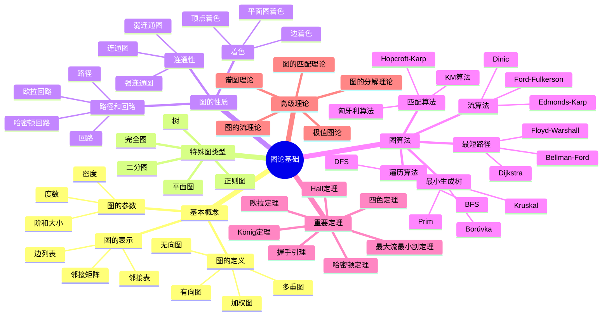
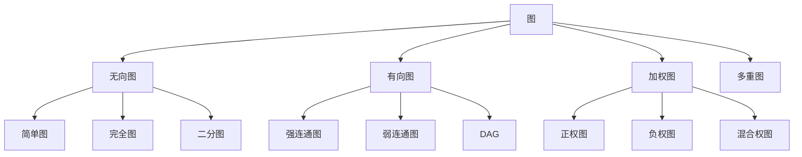
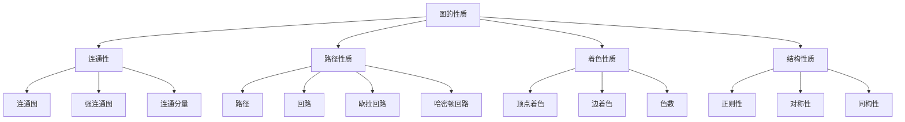
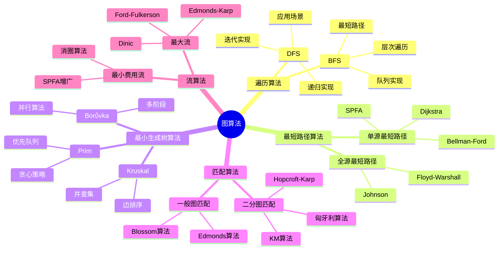
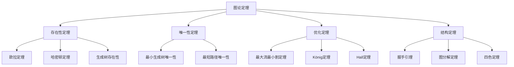
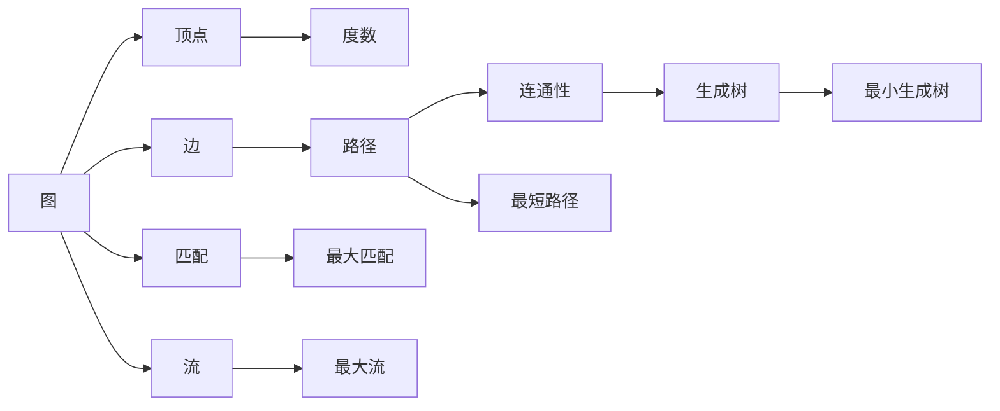
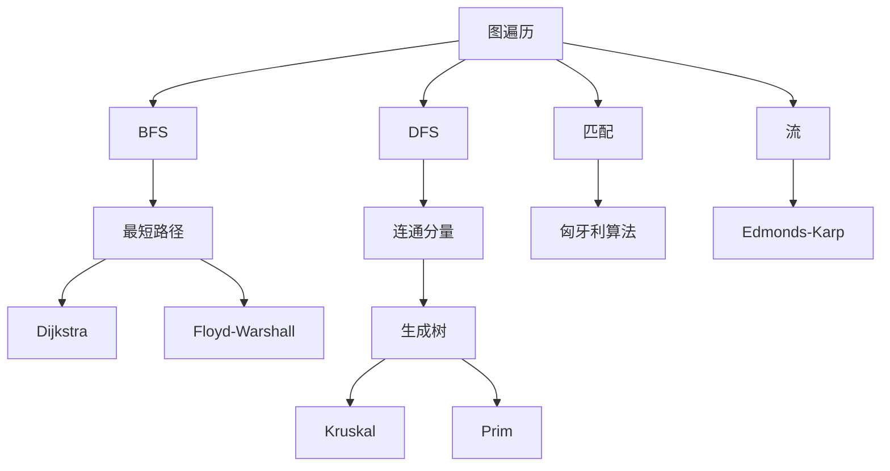
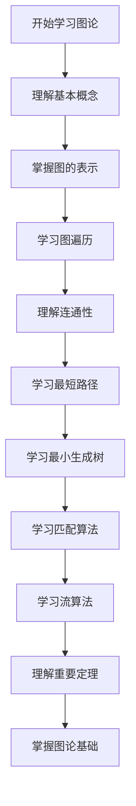
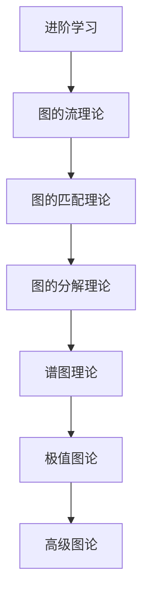

# 图论基础模块知识结构思维导图 / Graph Theory Fundamentals Module Knowledge Structure Mind Map

## 📚 **概述 / Overview**

本文档提供图论基础模块的完整知识结构思维导图，帮助理解图论知识的层次结构和相互关系。

**创建时间**: 2025年1月
**模块**: 图论基础
**状态**: 🚀 持续更新中

---

## 🗺️ **一、整体知识结构 / Overall Knowledge Structure**

---

## 📊 **二、核心概念层次结构 / Core Concept Hierarchy**

### 2.1 图的定义层次

### 2.2 图的性质层次

---

## 🔬 **三、算法分类结构 / Algorithm Classification Structure**

### 3.1 算法按功能分类

### 3.2 算法按复杂度分类

| 复杂度类别 | 算法 | 时间复杂度 | 空间复杂度 |
|-----------|------|-----------|-----------|
| **线性** | DFS, BFS | $O(V+E)$ | $O(V)$ |
| **对数线性** | Kruskal, Dijkstra | $O(E \log E)$ | $O(V+E)$ |
| **平方** | Prim(矩阵), Floyd | $O(V^2)$ | $O(V^2)$ |
| **立方** | Floyd-Warshall | $O(V^3)$ | $O(V^2)$ |
| **多项式** | 最大流算法 | $O(VE^2)$ | $O(V+E)$ |

---

## 📐 **四、定理证明结构 / Theorem Proof Structure**

### 4.1 定理分类

### 4.2 证明方法分类

| 证明方法 | 适用定理 | 特点 |
|---------|---------|------|
| **构造性证明** | 欧拉定理、生成树 | 提供构造方法 |
| **反证法** | 唯一性定理 | 假设矛盾 |
| **归纳法** | 递归结构定理 | 数学归纳 |
| **交换论证** | 贪心算法正确性 | 交换元素 |
| **对偶性** | 最大流最小割 | 对偶关系 |

---

## 🔗 **五、知识关联网络 / Knowledge Association Network**

### 5.1 概念关联图

### 5.2 算法关联图

---

## 📚 **六、学习路径 / Learning Path**

### 6.1 基础学习路径

### 6.2 进阶学习路径

---

## 🎯 **七、应用领域映射 / Application Domain Mapping**

### 7.1 应用领域

| 图论概念 | 应用领域 | 具体应用 |
|---------|---------|---------|
| **最短路径** | 网络路由 | 路由算法、GPS导航 |
| **最小生成树** | 网络设计 | 通信网络、电力网络 |
| **匹配** | 资源分配 | 任务分配、推荐系统 |
| **流** | 网络优化 | 网络流量、资源调度 |
| **着色** | 调度问题 | 时间表安排、寄存器分配 |
| **连通性** | 可靠性分析 | 网络可靠性、系统容错 |

---

## 📋 **八、知识检查清单 / Knowledge Checklist**

### 8.1 基础概念

- [ ] 理解图的定义和基本术语
- [ ] 掌握图的表示方法（邻接矩阵、邻接表）
- [ ] 理解图的基本参数（阶、大小、度数）
- [ ] 掌握特殊图类型（完全图、二分图、树）

### 8.2 图的性质

- [ ] 理解连通性的概念
- [ ] 掌握路径和回路的定义
- [ ] 理解欧拉回路和哈密顿回路
- [ ] 了解图着色的基本概念

### 8.3 图算法

- [ ] 掌握DFS和BFS算法
- [ ] 理解最短路径算法（Dijkstra、Floyd-Warshall）
- [ ] 掌握最小生成树算法（Kruskal、Prim）
- [ ] 了解匹配算法和流算法

### 8.4 重要定理

- [ ] 理解握手引理
- [ ] 掌握欧拉定理
- [ ] 了解最大流最小割定理
- [ ] 理解König定理和Hall定理

---

## 🔗 **相关链接 / Related Links**

- [图论基础README](README.md)
- [基本概念](01-基本概念.md)
- [图的算法](03-图的算法.md)
- [严格证明与形式化验证](02-严格证明与形式化验证.md)
- [思维表征工具](思维表征工具-图论基础.md)

---

**文档版本**: v1.0
**创建时间**: 2025年1月
**最后更新**: 2025年1月
**维护者**: GraphNetWorkCommunicate项目组
