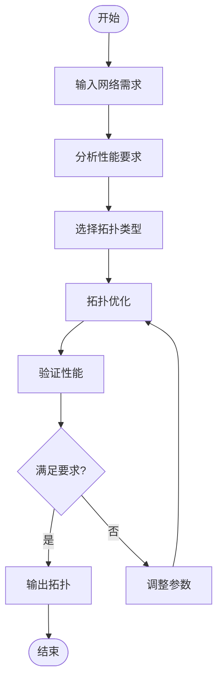

# 网络拓扑 - 拓扑结构

## 1. 网络拓扑基础

### 1.1 网络拓扑定义

**定义 1.1** (网络拓扑 - Network Topology)
**网络拓扑**是网络中节点和连接的结构模式，可以形式化为图 $G = (V, E, \mathcal{A})$，其中：

- $V$ 表示网络节点集 (node set)
- $E$ 表示网络连接集 (edge set)
- $\mathcal{A}$ 表示属性集 (attribute set)，包括带宽、延迟、可靠性等

**形式化语义**：

- 集合论语义：$V \neq \emptyset, E \subseteq V \times V, \mathcal{A}: V \cup E \to \mathbb{R}^n$
- 范畴论语义：网络拓扑作为范畴中的对象，拓扑变换作为态射

**定义 1.2** (拓扑性质 - Topological Properties)
网络拓扑的关键性质包括：

- **连通性** (Connectivity)：任意两个节点间是否存在路径
- **冗余性** (Redundancy)：网络对节点或连接故障的容错能力
- **可扩展性** (Scalability)：添加新节点的难易程度
- **效率性** (Efficiency)：信息传输的平均路径长度

### 1.2 拓扑分类

**定义 1.3** (物理拓扑 - Physical Topology)
**物理拓扑**描述网络中设备的实际物理连接方式。

**定义 1.4** (逻辑拓扑 - Logical Topology)
**逻辑拓扑**描述网络中数据流的逻辑路径，可能与物理拓扑不同。

**定义 1.5** (虚拟拓扑 - Virtual Topology)
**虚拟拓扑**是在物理拓扑基础上建立的抽象连接结构。

## 2. 基本拓扑结构

### 2.1 总线拓扑

**定义 2.1** (总线拓扑 - Bus Topology)
**总线拓扑**是线性拓扑结构，其中所有节点共享一条公共通信线路。

**形式化表示**：
$$G_{bus} = (V, E) \text{ 其中 } E = \{(v_i, v_{i+1}) : i = 1, 2, \ldots, n-1\}$$

**性质 2.1** (总线拓扑性质)

- 节点数：$n$
- 边数：$n-1$
- 直径：$n-1$
- 连通度：1（单点故障会导致网络分裂）
- 平均路径长度：$\frac{n+1}{3}$

**定理 2.1** (总线拓扑极值性质)
$n$ 节点总线拓扑的平均路径长度达到线性拓扑的最大值。

**证明**：
对于线性拓扑，平均路径长度为：
$$\frac{1}{n^2} \sum_{i=1}^n \sum_{j=1}^n |i-j| = \frac{n+1}{3}$$

**优点**：

- 简单易实现
- 成本低
- 适合小型网络

**缺点**：

- 单点故障影响整个网络
- 扩展性差
- 性能随节点数增加而下降

### 2.2 星形拓扑

**定义 2.2** (星形拓扑 - Star Topology)
**星形拓扑**是中心化结构，其中所有节点都连接到中央集线器。

**形式化表示**：
$$G_{star} = (V, E) \text{ 其中 } V = \{h, v_1, v_2, \ldots, v_n\}, E = \{(h, v_i) : i = 1, 2, \ldots, n\}$$

其中 $h$ 是集线器节点 (hub node)。

**性质 2.2** (星形拓扑性质)

- 节点数：$n+1$
- 边数：$n$
- 直径：2
- 连通度：1（集线器故障导致网络分裂）
- 平均路径长度：$\frac{2n}{n+1}$

**定理 2.2** (星形拓扑最优性)
在固定节点数的所有拓扑中，星形拓扑的平均路径长度最小。

**证明**：
对于任意 $n+1$ 节点连通图，至少需要 $n$ 条边。星形拓扑使用最少的边数达到最小的平均路径长度。

**优点**：

- 易于管理和故障定位
- 高可靠性（除集线器外）
- 易于扩展

**缺点**：

- 集线器成为单点故障
- 集线器负载集中

### 2.3 环形拓扑

**定义 2.3** (环形拓扑 - Ring Topology)
**环形拓扑**是循环结构，其中每个节点连接到两个相邻节点。

**形式化表示**：
$$G_{ring} = (V, E) \text{ 其中 } E = \{(v_i, v_{i+1}) : i = 1, 2, \ldots, n-1\} \cup \{(v_n, v_1)\}$$

**性质 2.3** (环形拓扑性质)

- 节点数：$n$
- 边数：$n$
- 直径：$\lfloor n/2 \rfloor$
- 连通度：2（双环结构）
- 平均路径长度：$\frac{n+1}{4}$（$n$ 为奇数时）

**定理 2.3** (环形拓扑对称性)
环形拓扑是2-正则图，具有最大的对称性。

**证明**：
每个节点的度都是2，图是2-正则的。对于任意节点，都存在自同构将其映射到其他节点。

**优点**：

- 无单点故障
- 数据传输方向确定
- 适合令牌环网络

**缺点**：

- 单点故障影响整个环
- 扩展性差

### 2.4 网状拓扑

**定义 2.4** (网状拓扑 - Mesh Topology)
**网状拓扑**是高度互联的结构，其中每个节点都连接到多个其他节点。

**形式化表示**：
$$G_{mesh} = (V, E) \text{ 其中 } E \subseteq V \times V - \{(v, v) : v \in V\}$$

**性质 2.4** (网状拓扑性质)

- 节点数：$n$
- 边数：$O(n^2)$
- 直径：$O(\log n)$
- 连通度：$O(n)$

**定义 2.5** (完全网状拓扑 - Full Mesh Topology)
**完全网状拓扑**是每个节点都与其他所有节点直接连接的网络。

**形式化表示**：
$$G_{full-mesh} = (V, E) \text{ 其中 } E = \{(u, v) : u, v \in V, u \neq v\}$$

**性质 2.5** (完全网状拓扑性质)

- 节点数：$n$
- 边数：$\frac{n(n-1)}{2}$
- 直径：1
- 连通度：$n-1$

**优点**：

- 高可靠性
- 多条路径选择
- 高带宽

**缺点**：

- 成本高
- 管理复杂
- 布线困难

## 3. 高级拓扑结构

### 3.1 树形拓扑

**定义 3.1** (树形拓扑 - Tree Topology)
**树形拓扑**是层次化结构，形成树形图。

**形式化表示**：
$$G_{tree} = (V, E) \text{ 其中 } |E| = |V| - 1 \text{ 且 } G_{tree} \text{ 连通无圈}$$

**性质 3.1** (树形拓扑性质)

- 节点数：$n$
- 边数：$n-1$
- 直径：$O(\log n)$（平衡树）
- 连通度：1

**定义 3.2** (平衡树 - Balanced Tree)
**平衡树**是每个内部节点的子节点数大致相等的树。

**定理 3.1** (平衡树直径)
$n$ 节点平衡树的直径为 $O(\log n)$。

**证明**：
对于高度为 $h$ 的平衡树，节点数 $n \leq 2^h$，因此 $h \geq \log_2 n$。直径最大为 $2h = O(\log n)$。

**优点**：

- 层次化管理
- 易于扩展
- 故障隔离

**缺点**：

- 根节点成为瓶颈
- 单点故障影响子树

### 3.2 超立方体拓扑

**定义 3.2** (超立方体拓扑 - Hypercube Topology)
**$n$维超立方体**是 $2^n$ 个节点的图，每个节点用 $n$ 位二进制数表示，相邻节点仅有一位不同。

**形式化表示**：
$$G_{hypercube} = (V, E) \text{ 其中 } V = \{0, 1\}^n, E = \{(u, v) : H(u, v) = 1\}$$

其中 $H(u, v)$ 是汉明距离 (Hamming distance)。

**性质 3.2** (超立方体拓扑性质)

- 节点数：$2^n$
- 边数：$n \cdot 2^{n-1}$
- 直径：$n$
- 连通度：$n$

**定理 3.2** (超立方体路由)
超立方体中任意两点间的最短路径可以通过位运算计算。

**证明**：
设源节点为 $s$，目标节点为 $t$，则最短路径长度为 $H(s, t)$，路径可以通过逐位修正 $s$ 得到 $t$。

**算法 3.1** (超立方体路由算法)

```python
def hypercube_routing(source, target, n):
    path = [source]
    current = source
    
    for i in range(n):
        if (current >> i) & 1 != (target >> i) & 1:
            current ^= (1 << i)  # 翻转第i位
            path.append(current)
    
    return path
```

**优点**：

- 高连通度
- 对称性好
- 路由简单

**缺点**：

- 节点数必须是2的幂
- 扩展性受限

### 3.3 蝴蝶网络

**定义 3.3** (蝴蝶网络 - Butterfly Network)
**$n$级蝴蝶网络**是 $n \cdot 2^n$ 个节点的多级网络。

**形式化表示**：
$$G_{butterfly} = (V, E) \text{ 其中 } V = \{(i, j) : 0 \leq i < n, 0 \leq j < 2^n\}$$

**性质 3.3** (蝴蝶网络性质)

- 节点数：$n \cdot 2^n$
- 边数：$O(n \cdot 2^n)$
- 直径：$O(\log n)$
- 连通度：$O(1)$

### 3.4 小世界网络

**定义 3.4** (小世界网络 - Small World Network)
**小世界网络**是具有短平均路径长度和高聚类系数的网络。

**形式化定义**：
网络 $G$ 是小世界网络，如果：

1. 平均路径长度 $L \sim \log N$
2. 聚类系数 $C \gg \frac{\langle k \rangle}{N}$

其中 $N$ 是节点数，$\langle k \rangle$ 是平均度。

**算法 3.2** (Watts-Strogatz模型)

```python
import networkx as nx
import random
import numpy as np

def watts_strogatz(n, k, p):
    # 构造环形网络
    G = nx.cycle_graph(n)
    
    # 添加长距离连接
    for i in range(n):
        for j in range(i+1, min(i+k//2+1, n)):
            if random.random() < p:
                G.add_edge(i, j)
    
    return G
```

**定理 3.3** (小世界网络性质)
Watts-Strogatz小世界网络在重连概率 $p \sim \frac{1}{N}$ 时，同时具有短平均路径长度和高聚类系数。

### 3.5 无标度网络

**定义 3.5** (无标度网络 - Scale-Free Network)
**无标度网络**是度分布遵循幂律的网络。

**形式化定义**：
网络 $G$ 是无标度网络，如果度分布 $P(k) \sim k^{-\gamma}$，其中 $\gamma$ 是幂律指数。

**算法 3.3** (Barabási-Albert模型)

```python
import networkx as nx
import random
import numpy as np

def barabasi_albert(n, m):
    G = nx.complete_graph(m+1)
    
    for i in range(m+1, n):
        # 优先连接
        degrees = dict(G.degree())
        total_degree = sum(degrees.values())
        
        # 选择m个邻居
        neighbors = []
        for _ in range(m):
            p = [degrees[j]/total_degree for j in G.nodes()]
            neighbor = np.random.choice(list(G.nodes()), p=p)
            neighbors.append(neighbor)
            degrees[neighbor] += 1
            total_degree += 1
        
        # 添加新节点
        for neighbor in neighbors:
            G.add_edge(i, neighbor)
    
    return G
```

## 4. 动态拓扑

### 4.1 自适应拓扑

**定义 4.1** (自适应拓扑 - Adaptive Topology)
**自适应拓扑**是根据网络状态动态调整连接的网络结构。

**形式化表示**：
$$G(t) = (V, E(t)) \text{ 其中 } E(t) \text{ 是时间 } t \text{ 的边集}$$

**算法 4.1** (自适应拓扑调整)

```python
import networkx as nx
import random
import numpy as np

def adaptive_topology(G, performance_metric, threshold):
    current_performance = performance_metric(G)
    
    # 识别瓶颈
    bottlenecks = identify_bottlenecks(G)
    
    # 生成候选拓扑
    candidates = generate_candidates(G, bottlenecks)
    
    # 选择最优拓扑
    best_topology = G
    best_performance = current_performance
    
    for candidate in candidates:
        candidate_performance = performance_metric(candidate)
        if candidate_performance > best_performance + threshold:
            best_topology = candidate
            best_performance = candidate_performance
    
    return best_topology
```

### 4.2 移动自组织网络

**定义 4.2** (移动自组织网络 - Mobile Ad Hoc Network)
**移动自组织网络**是节点位置和连接关系都动态变化的网络。

**形式化表示**：
$$G(t) = (V(t), E(t)) \text{ 其中 } V(t) \text{ 和 } E(t) \text{ 都是时间函数}$$

**性质 4.1** (移动网络特性)

- 节点移动性
- 连接动态性
- 拓扑不确定性
- 路由复杂性

**算法 4.2** (动态拓扑维护)

```python
import networkx as nx
import random
import numpy as np

def maintain_topology(G, positions, communication_range):
    # 更新连接
    new_edges = set()
    for i, pos_i in enumerate(positions):
        for j, pos_j in enumerate(positions):
            if i != j:
                distance = np.linalg.norm(pos_i - pos_j)
                if distance <= communication_range:
                    new_edges.add((i, j))
    
    # 更新图
    G.clear_edges()
    G.add_edges_from(new_edges)
    
    return G
```

## 5. 拓扑优化

### 5.1 性能指标

**定义 5.1** (网络性能指标 - Network Performance Metrics)
网络拓扑的性能指标包括：

- **延迟** (Delay)：$D(G) = \frac{1}{|V|^2} \sum_{u,v \in V} d(u,v)$
- **吞吐量** (Throughput)：$T(G) = \min_{S} c(S)$
- **可靠性** (Reliability)：$R(G) = \prod_{e \in E} (1-p_e)$
- **成本** (Cost)：$C(G) = \sum_{e \in E} c_e$

**定义 5.2** (网络效率 - Network Efficiency)
**网络效率**是：
$$E(G) = \frac{1}{|V|(|V|-1)} \sum_{u \neq v} \frac{1}{d(u,v)}$$

### 5.2 优化问题

**问题 5.1** (最小成本连通网络 - Minimum Cost Connected Network)
给定节点集 $V$ 和连接成本 $c: V \times V \to \mathbb{R}^+$，找到最小成本的连通网络。

**形式化**：
$$\min_{E \subseteq V \times V} \sum_{e \in E} c(e) \text{ s.t. } G = (V, E) \text{ 连通}$$

**算法 5.1** (最小生成树算法)

```python
import networkx as nx
import random
import numpy as np

def minimum_spanning_tree(V, cost_matrix):
    # Kruskal算法
    edges = []
    for i in range(len(V)):
        for j in range(i+1, len(V)):
            edges.append((i, j, cost_matrix[i][j]))
    
    edges.sort(key=lambda x: x[2])
    
    # 并查集
    parent = list(range(len(V)))
    
    def find(x):
        if parent[x] != x:
            parent[x] = find(parent[x])
        return parent[x]
    
    def union(x, y):
        parent[find(x)] = find(y)
    
    mst_edges = []
    for u, v, cost in edges:
        if find(u) != find(v):
            union(u, v)
            mst_edges.append((u, v))
    
    return mst_edges
```

**问题 5.2** (最小直径网络 - Minimum Diameter Network)
给定节点集 $V$ 和边数限制 $k$，找到直径最小的网络。

**形式化**：
$$\min_{E \subseteq V \times V, |E| \leq k} \text{diam}(G) \text{ s.t. } G = (V, E) \text{ 连通}$$

**算法 5.2** (最小直径网络算法)

```python
import networkx as nx
import random
import numpy as np

def minimum_diameter_network(V, k):
    # 贪心算法
    G = nx.Graph()
    G.add_nodes_from(V)
    
    # 添加最小生成树
    mst_edges = minimum_spanning_tree(V, cost_matrix)
    G.add_edges_from(mst_edges)
    
    # 添加剩余边以减少直径
    remaining_edges = k - len(mst_edges)
    
    for _ in range(remaining_edges):
        best_edge = None
        best_diameter = float('inf')
        
        for u in V:
            for v in V:
                if u != v and not G.has_edge(u, v):
                    G.add_edge(u, v)
                    diameter = nx.diameter(G)
                    if diameter < best_diameter:
                        best_diameter = diameter
                        best_edge = (u, v)
                    G.remove_edge(u, v)
        
        if best_edge:
            G.add_edge(*best_edge)
    
    return G
```

## 6. 拓扑分析

### 6.1 中心性分析

**定义 6.1** (度中心性 - Degree Centrality)
节点 $v$ 的**度中心性**是：
$$C_D(v) = \frac{d(v)}{|V| - 1}$$

**定义 6.2** (接近中心性 - Closeness Centrality)
节点 $v$ 的**接近中心性**是：
$$C_C(v) = \frac{|V| - 1}{\sum_{u \in V} d(u, v)}$$

**定义 6.3** (介数中心性 - Betweenness Centrality)
节点 $v$ 的**介数中心性**是：
$$C_B(v) = \sum_{s \neq v \neq t} \frac{\sigma_{st}(v)}{\sigma_{st}}$$

其中 $\sigma_{st}$ 是 $s$ 到 $t$ 的最短路径数，$\sigma_{st}(v)$ 是经过 $v$ 的路径数。

**算法 6.1** (中心性计算)

```python
import networkx as nx

def calculate_centralities(G):
    # 度中心性
    degree_centrality = nx.degree_centrality(G)
    
    # 接近中心性
    closeness_centrality = nx.closeness_centrality(G)
    
    # 介数中心性
    betweenness_centrality = nx.betweenness_centrality(G)
    
    return {
        'degree': degree_centrality,
        'closeness': closeness_centrality,
        'betweenness': betweenness_centrality
    }
```

### 6.2 社区检测

**定义 6.4** (模块度 - Modularity)
网络划分的**模块度**是：
$$Q = \frac{1}{2m} \sum_{ij} \left[A_{ij} - \frac{k_i k_j}{2m}\right] \delta(c_i, c_j)$$

其中 $A_{ij}$ 是邻接矩阵，$k_i$ 是节点 $i$ 的度，$c_i$ 是节点 $i$ 的社区标签。

**算法 6.2** (Louvain算法)

```python
import networkx as nx
import random
import numpy as np

def louvain_community_detection(G):
    # 初始化：每个节点一个社区
    communities = {node: i for i, node in enumerate(G.nodes())}
    
    while True:
        changed = False
        
        # 第一阶段：节点移动
        for node in G.nodes():
            best_community = communities[node]
            best_gain = 0
            
            for neighbor in G.neighbors(node):
                neighbor_community = communities[neighbor]
                if neighbor_community != communities[node]:
                    # 计算模块度增益
                    gain = calculate_modularity_gain(G, node, communities[node], neighbor_community)
                    if gain > best_gain:
                        best_gain = gain
                        best_community = neighbor_community
            
            if best_community != communities[node]:
                communities[node] = best_community
                changed = True
        
        if not changed:
            break
        
        # 第二阶段：社区合并
        G = merge_communities(G, communities)
        communities = {node: i for i, node in enumerate(G.nodes())}
    
    return communities
```

## 7. 拓扑保持性定理

### 7.1 结构保持性

**定理 7.1** (拓扑嵌入保持性)
设 $h: G_1 \to G_2$ 是拓扑嵌入，则：

1. $G_1$ 的连通性在 $G_2$ 中保持
2. $G_1$ 的直径在 $G_2$ 中不增加
3. $G_1$ 的聚类系数在 $G_2$ 中保持

**证明**：

1. 连通性：嵌入保持路径结构
2. 直径：嵌入不增加路径长度
3. 聚类系数：嵌入保持局部结构

### 7.2 极值保持性

**定理 7.2** (极值拓扑保持性)
极值拓扑（如最小直径、最大连通度）在结构保持映射下性质不减弱。

**证明**：
如果存在更优的拓扑，则原拓扑不是极值，矛盾。

## 多模态表达与可视化

### 7.3 拓扑可视化

**NetworkX示例**：

```python
import networkx as nx
import matplotlib.pyplot as plt

# 创建不同拓扑
star = nx.star_graph(5)
ring = nx.cycle_graph(6)
tree = nx.balanced_tree(2, 3)

# 可视化
fig, axes = plt.subplots(1, 3, figsize=(15, 5))

nx.draw(star, ax=axes[0], with_labels=True, node_color='lightblue')
axes[0].set_title('Star Topology')

nx.draw(ring, ax=axes[1], with_labels=True, node_color='lightgreen')
axes[1].set_title('Ring Topology')

nx.draw(tree, ax=axes[2], with_labels=True, node_color='lightcoral')
axes[2].set_title('Tree Topology')

plt.tight_layout()
plt.show()
```

### 7.4 算法流程图

**Mermaid示例**：



### 7.5 自动化脚本建议

**脚本功能**：

- `scripts/topology_generator.py`：生成各种拓扑结构
- `scripts/topology_analyzer.py`：分析拓扑性能指标
- `scripts/topology_optimizer.py`：优化拓扑设计
- `scripts/topology_visualizer.py`：可视化拓扑结构

---

*本文档详细介绍了各种网络拓扑结构的形式化定义和性质，对标国际标准，为网络通信系统的设计提供了理论基础。*
