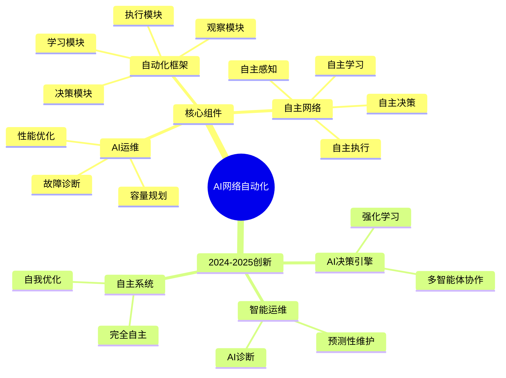
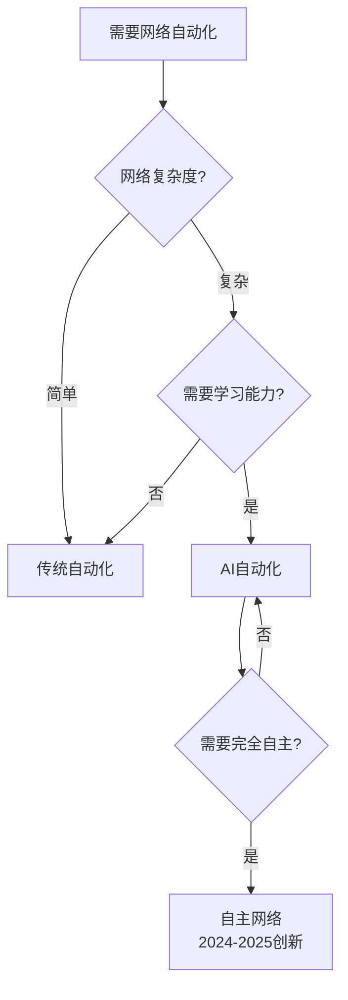
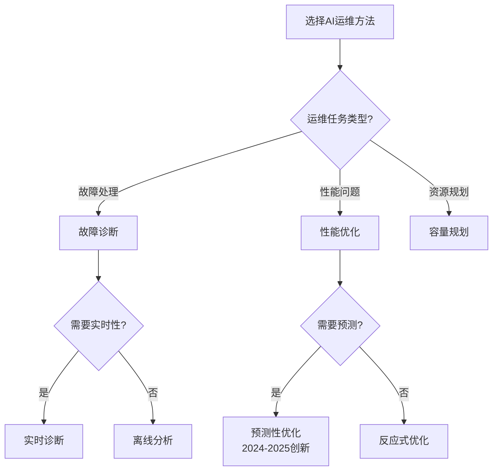
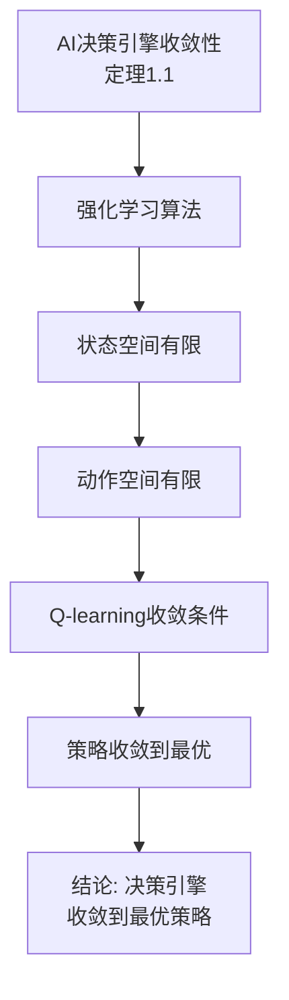
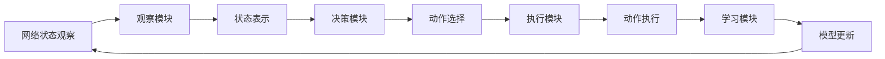
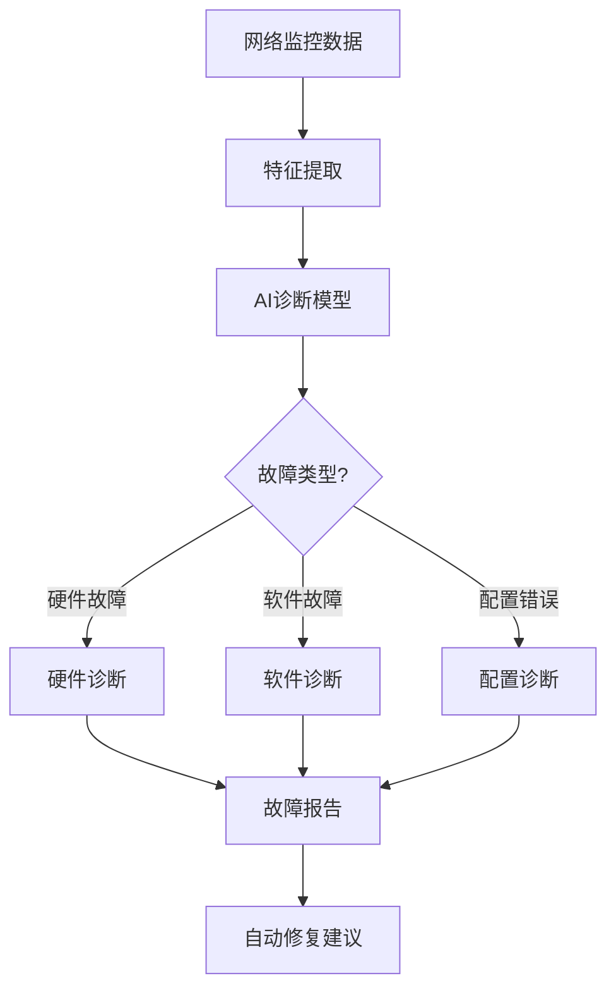
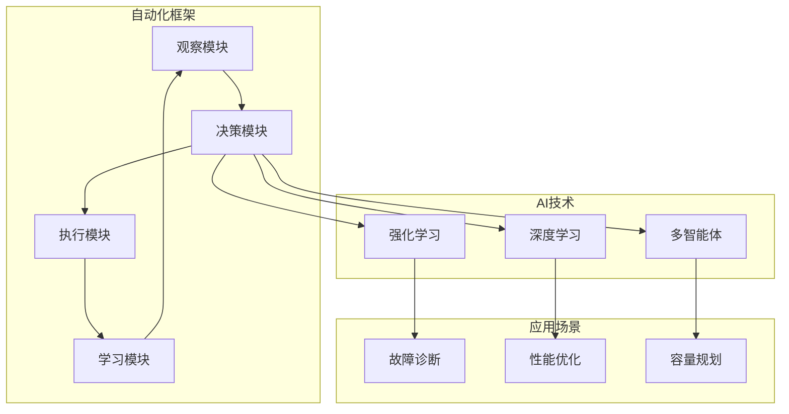
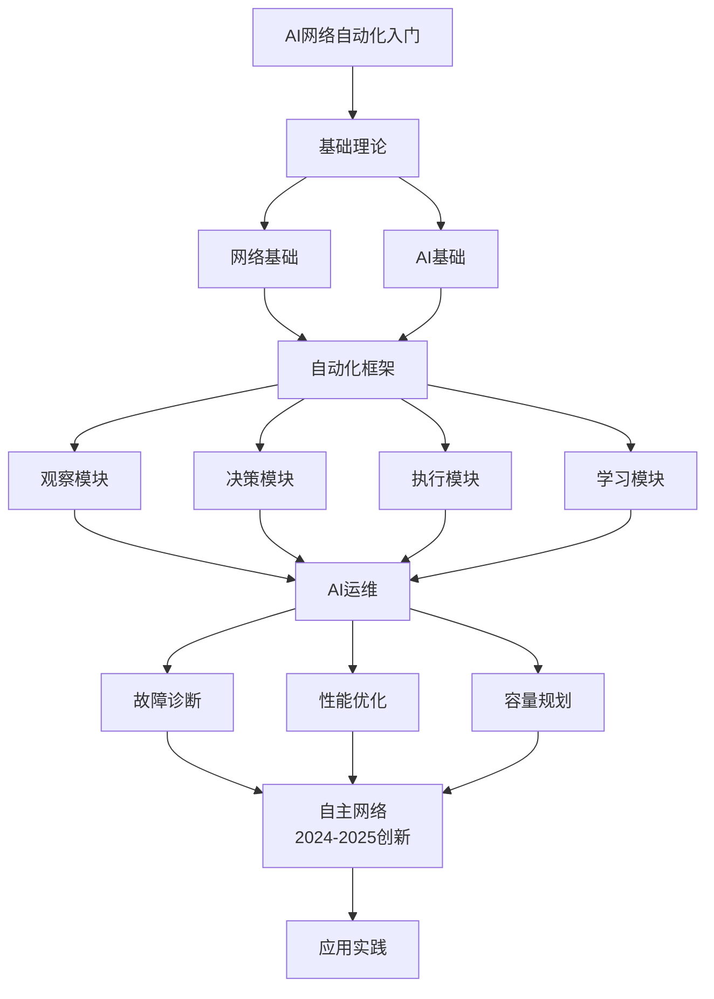

# AI驱动的网络自动化专题思维表征工具 / AI-Driven Network Automation Special Topic Mental Representation Tools 2024-2025

## 📚 **概述 / Overview**

本文档为AI驱动的网络自动化专题提供完整的思维表征工具集合。

**创建时间**: 2025年1月
**状态**: ✅ 完成
**专题**: AI驱动的网络自动化（2024-2025最新研究）
**相关文档**: [AI驱动的网络自动化专题-2024-2025.md](AI驱动的网络自动化专题-2024-2025.md)

---

## 🗺️ **一、思维导图 / Mind Maps**

### 1.1 AI驱动的网络自动化完整思维导图

---

## 📊 **二、对比矩阵 / Comparison Matrices**

### 2.1 AI网络自动化框架对比矩阵

| 框架 | 核心特性 | 优势 | 劣势 | 适用场景 | 2024-2025创新 |
|------|---------|------|------|---------|--------------|
| **传统自动化** | 规则驱动 | 可预测、稳定 | 灵活性差 | 简单场景 | 基础方法 |
| **AI自动化** | 学习驱动 | 自适应、智能 | 需要训练 | 复杂场景 | AI决策引擎 |
| **自主网络** | 完全自主 | 自我优化 | 复杂度高 | 大规模网络 | 完全自主系统 |

### 2.2 AI运维方法对比矩阵

| 方法 | 方法类型 | 准确率 | 实时性 | 适用场景 | 2024-2025创新 |
|------|---------|--------|--------|---------|--------------|
| **故障诊断** | 分类/检测 | 高 | 中 | 故障定位 | AI诊断 |
| **性能优化** | 优化/调优 | 高 | 中 | 性能提升 | 预测性优化 |
| **容量规划** | 预测/规划 | 中 | 低 | 资源规划 | 智能规划 |

---

## 🌳 **三、决策树 / Decision Trees**

### 3.1 AI网络自动化方案选择决策树

### 3.2 AI运维方法选择决策树

---

## 🔬 **四、证明树 / Proof Trees**

### 4.1 AI决策引擎收敛性证明树

---

## 🔄 **五、数据流图 / Data Flow Diagrams**

### 5.1 AI自动化框架数据流

### 5.2 AI故障诊断数据流

---

## 🗺️ **六、概念地图 / Concept Maps**

### 6.1 AI网络自动化核心概念关系地图

---

## 📈 **七、学习路径图 / Learning Path Diagrams**

### 7.1 AI网络自动化学习路径

---

## 📝 **八、总结 / Summary**

### 8.1 思维表征工具使用指南

1. **思维导图**: 快速理解AI网络自动化的知识结构
2. **对比矩阵**: 比较不同框架、方法的优缺点
3. **决策树**: 选择合适方案、方法
4. **证明树**: 理解理论证明过程（收敛性）
5. **数据流图**: 理解自动化框架的执行流程
6. **概念地图**: 理解概念间的关系
7. **学习路径图**: 规划学习路径

### 8.2 工具更新说明

本文档将随着AI网络自动化领域的发展持续更新，确保包含最新的研究进展和方法。

---

**文档版本**: v1.0
**创建时间**: 2025年1月
**最后更新**: 2025年1月
**维护者**: GraphNetWorkCommunicate项目组
**状态**: ✅ 完成
