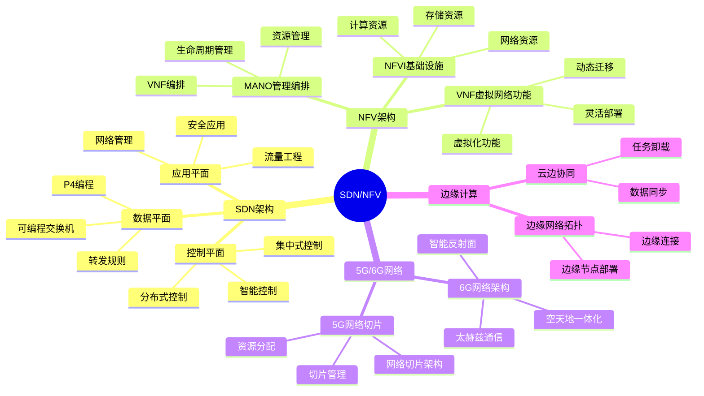
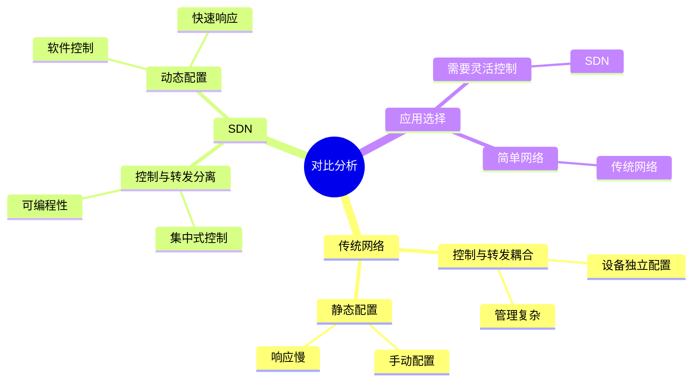
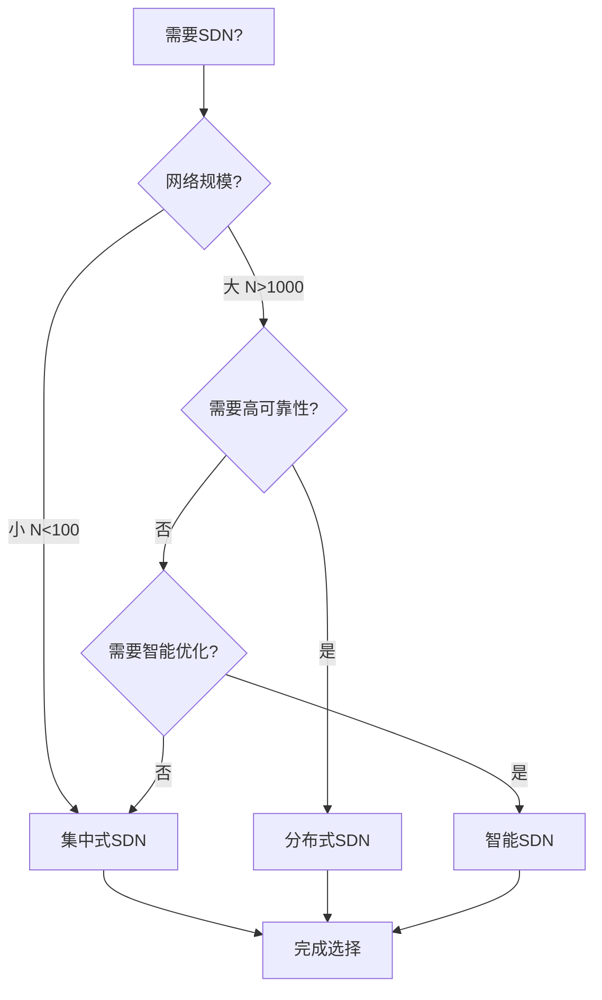
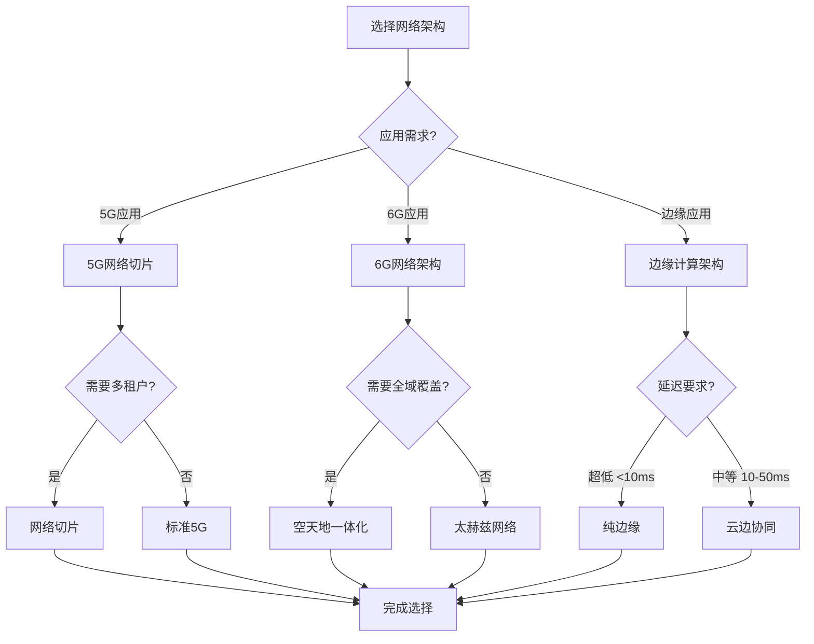
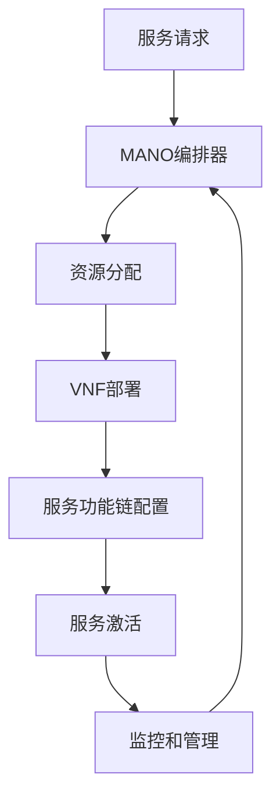
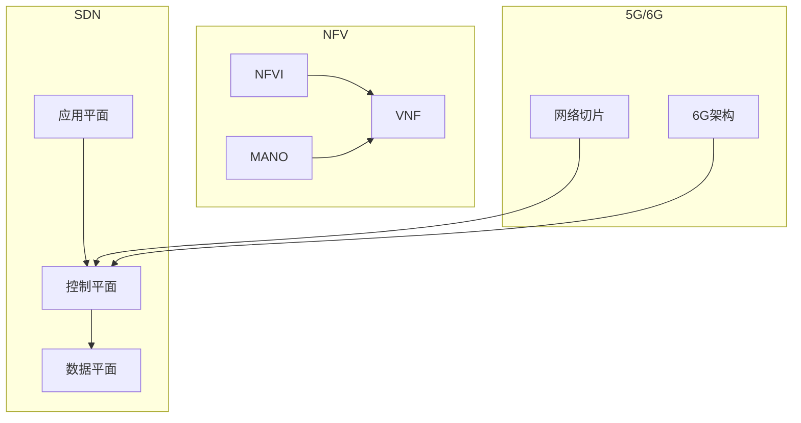

# SDN与NFV专题思维表征工具 / SDN and NFV Special Topic Mental Representation Tools 2024-2025

## 📚 **概述 / Overview**

本文档为SDN与NFV专题提供完整的思维表征工具集合，包括思维导图、对比矩阵、决策树、数据流图等多种表征方式。

**创建时间**: 2025年1月
**状态**: ✅ 完成
**专题**: SDN与NFV（2024-2025最新研究）
**相关文档**: [SDN与NFV专题-2024-2025.md](SDN与NFV专题-2024-2025.md)

---

## 🗺️ **一、思维导图 / Mind Maps**

### 1.1 SDN/NFV完整思维导图

### 1.2 SDN vs 传统网络思维导图

---

## 📊 **二、对比矩阵 / Comparison Matrices**

### 2.1 SDN控制器架构对比矩阵

| 架构类型 | 控制器数量 | 可靠性 | 可扩展性 | 适用场景 | 2024-2025创新 |
|---------|-----------|--------|---------|---------|--------------|
| **集中式SDN** | 1个 | 低 | 低 | 小规模网络 | 基础架构 |
| **分布式SDN** | 多个 | 高 | 高 | 大规模网络 | 控制器协调 |
| **智能SDN** | 1个+AI | 中等 | 中等 | 需要智能优化 | AI驱动控制 |

### 2.2 5G vs 6G网络架构对比矩阵

| 特性 | 5G | 6G | 主要差异 |
|------|----|----|---------|
| **频段** | Sub-6GHz, mmWave | 太赫兹 | 6G使用更高频段 |
| **架构** | 网络切片 | 空天地一体化 | 6G整合卫星网络 |
| **技术** | MIMO, 波束赋形 | IRS, 太赫兹 | 6G新增智能反射面 |
| **应用** | eMBB, uRLLC, mMTC | 全息通信, 数字孪生 | 6G支持更高级应用 |

### 2.3 边缘计算部署方案对比矩阵

| 部署方案 | 延迟 | 成本 | 可扩展性 | 适用场景 |
|---------|------|------|---------|---------|
| **纯云部署** | 高 | 低 | 高 | 非实时应用 |
| **纯边缘部署** | 低 | 高 | 低 | 超低延迟应用 |
| **云边协同** | 中等 | 中等 | 高 | 平衡场景 |

---

## 🌳 **三、决策树 / Decision Trees**

### 3.1 SDN部署选择决策树

### 3.2 网络架构选择决策树

---

## 🔄 **四、数据流图 / Data Flow Diagrams**

### 4.1 SDN控制流程数据流

### 4.2 NFV编排流程数据流

---

## 🗺️ **五、概念地图 / Concept Maps**

### 5.1 SDN/NFV核心概念关系

---

## 📈 **六、学习路径 / Learning Paths**

### 6.1 SDN/NFV学习逻辑路径

---

**文档版本**: v1.0
**创建时间**: 2025年1月
**最后更新**: 2025年1月
**维护者**: GraphNetWorkCommunicate项目组
**状态**: ✅ 完成
