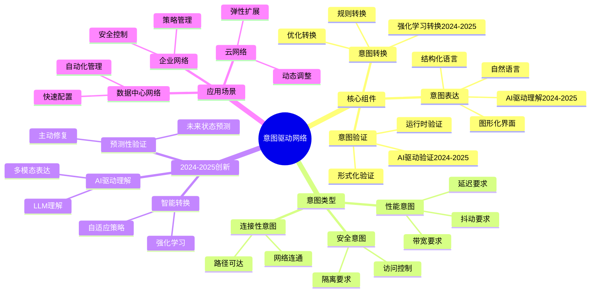
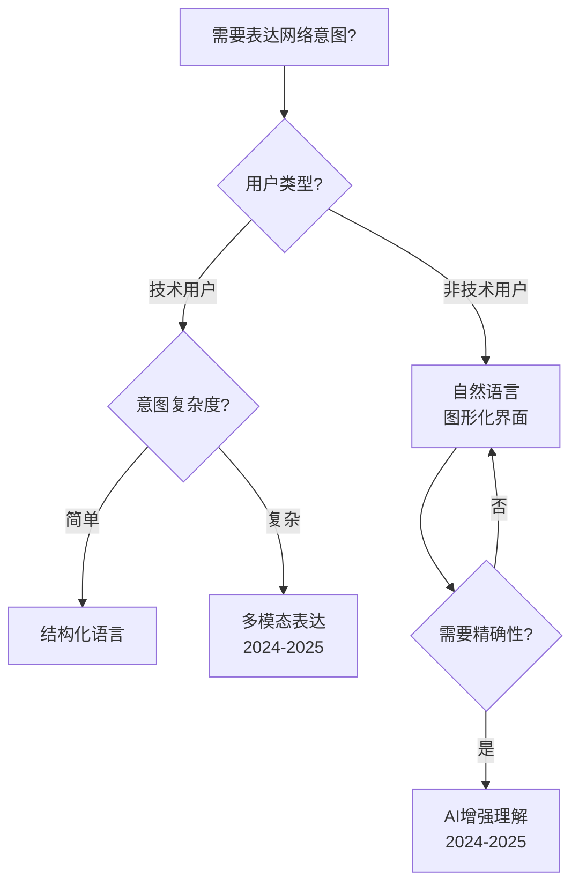
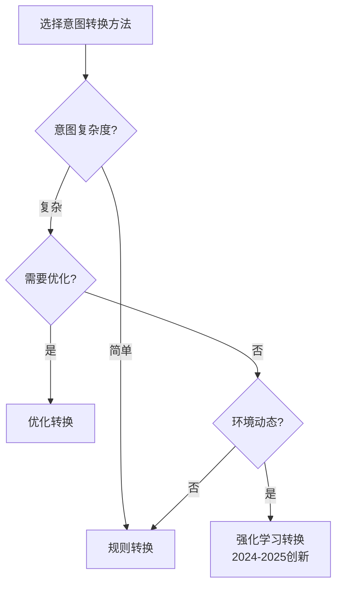
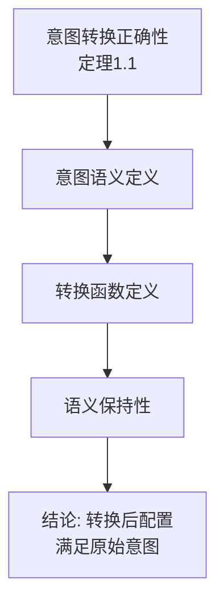
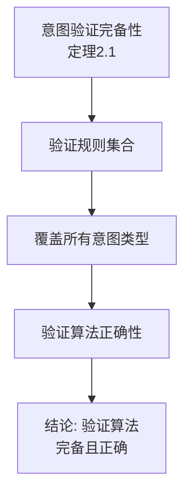
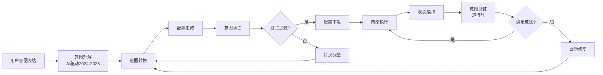
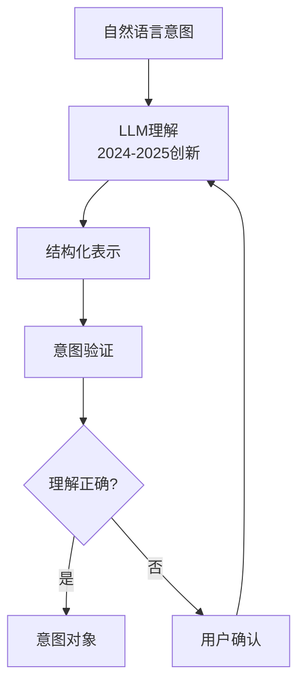
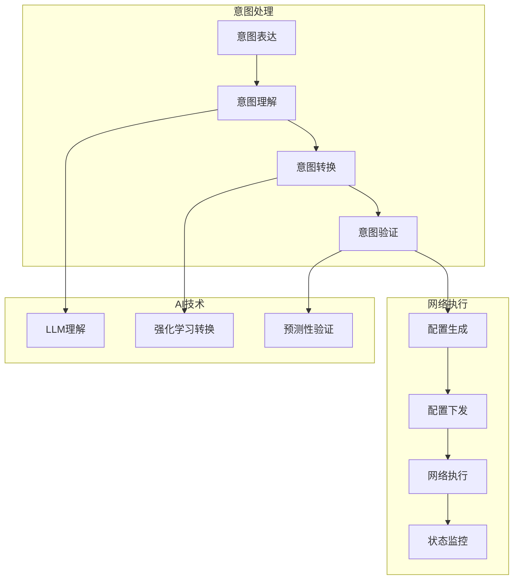
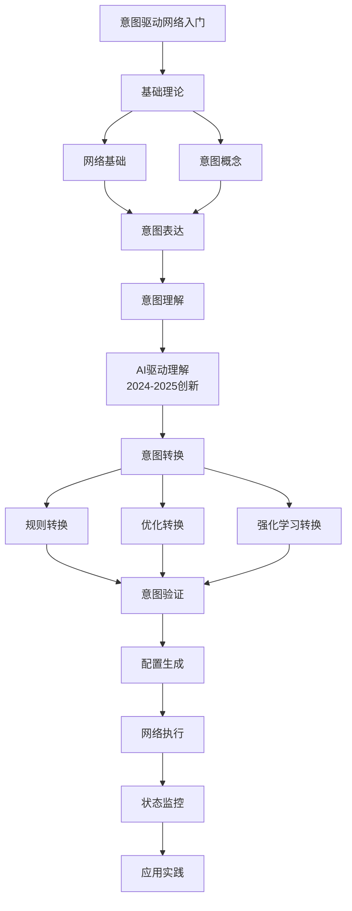

# 意图驱动网络专题思维表征工具 / Intent-Based Networking Special Topic Mental Representation Tools 2024-2025

## 📚 **概述 / Overview**

本文档为意图驱动网络专题提供完整的思维表征工具集合，包括思维导图、对比矩阵、决策树、证明树、数据流图、概念地图等多种表征方式。

**创建时间**: 2025年1月
**状态**: ✅ 完成
**专题**: 意图驱动网络（2024-2025最新研究）
**相关文档**: [意图驱动网络专题-2024-2025.md](意图驱动网络专题-2024-2025.md)

---

## 🗺️ **一、思维导图 / Mind Maps**

### 1.1 意图驱动网络完整思维导图

---

## 📊 **二、对比矩阵 / Comparison Matrices**

### 2.1 意图表达方式对比矩阵

| 表达方式 | 易用性 | 精确性 | 表达能力 | 适用场景 | 2024-2025改进 |
|---------|--------|--------|---------|---------|--------------|
| **自然语言** | 高 | 低 | 中 | 简单意图 | AI理解提升 |
| **结构化语言** | 中 | 高 | 高 | 复杂意图 | 标准化改进 |
| **图形化界面** | 高 | 中 | 中 | 可视化需求 | 交互优化 |
| **多模态** | 高 | 高 | 很高 | 综合需求 | 统一框架 |

### 2.2 意图转换方法对比矩阵

| 转换方法 | 复杂度 | 正确性 | 效率 | 适用场景 | 2024-2025改进 |
|---------|--------|--------|------|---------|--------------|
| **规则转换** | 低 | 高 | 高 | 简单意图 | 规则优化 |
| **优化转换** | 高 | 高 | 中 | 复杂意图 | 算法改进 |
| **强化学习** | 很高 | 中 | 低 | 动态环境 | 训练优化 |

---

## 🌳 **三、决策树 / Decision Trees**

### 3.1 意图表达方式选择决策树

### 3.2 意图转换方法选择决策树

---

## 🔬 **四、证明树 / Proof Trees**

### 4.1 意图转换正确性证明树

### 4.2 意图验证完备性证明树

---

## 🔄 **五、数据流图 / Data Flow Diagrams**

### 5.1 意图驱动网络完整数据流

### 5.2 AI驱动意图理解数据流

---

## 🗺️ **六、概念地图 / Concept Maps**

### 6.1 意图驱动网络核心概念关系地图

---

## 📈 **七、学习路径图 / Learning Path Diagrams**

### 7.1 意图驱动网络学习路径

---

## 📝 **八、总结 / Summary**

### 8.1 思维表征工具使用指南

1. **思维导图**: 快速理解意图驱动网络的知识结构
2. **对比矩阵**: 比较不同表达方式、转换方法的优缺点
3. **决策树**: 选择合适表达方式、转换方法
4. **证明树**: 理解理论证明过程（正确性、完备性）
5. **数据流图**: 理解意图处理的执行流程
6. **概念地图**: 理解概念间的关系
7. **学习路径图**: 规划学习路径

### 8.2 工具更新说明

本文档将随着意图驱动网络领域的发展持续更新，确保包含最新的研究进展和方法。

---

**文档版本**: v1.0
**创建时间**: 2025年1月
**最后更新**: 2025年1月
**维护者**: GraphNetWorkCommunicate项目组
**状态**: ✅ 完成
