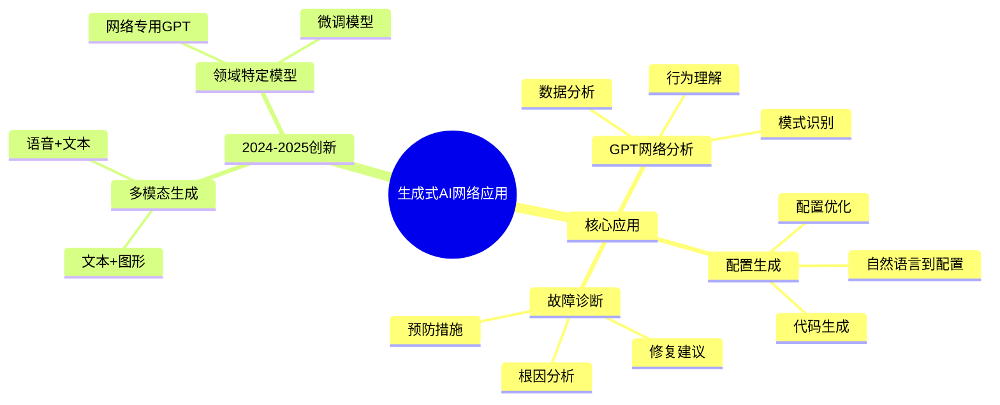
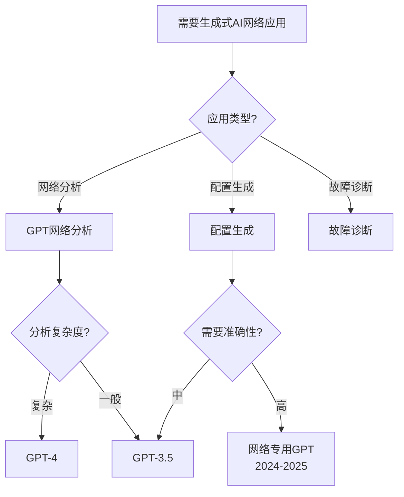
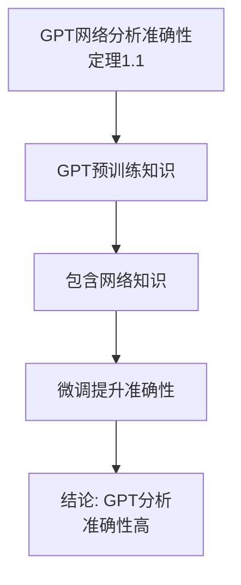
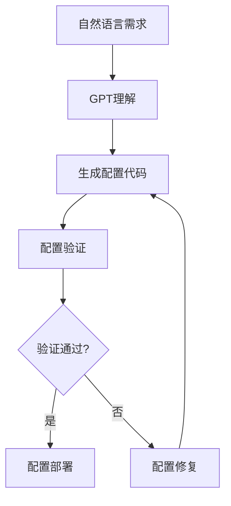
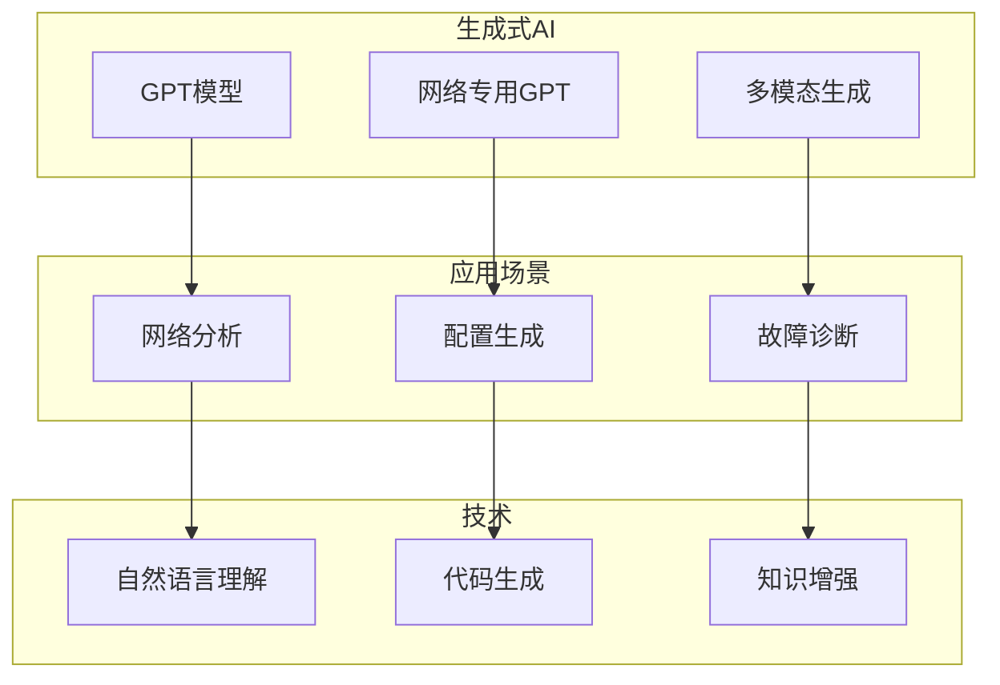
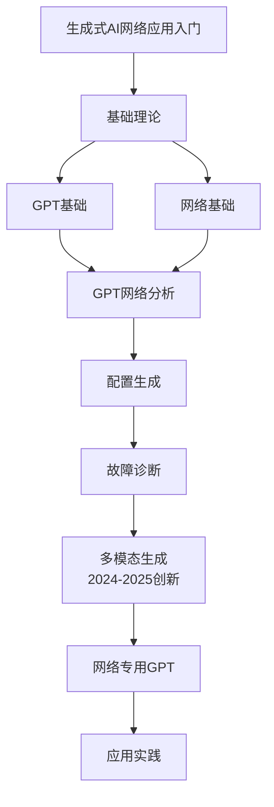

# 生成式AI网络应用专题思维表征工具 / Generative AI Network Applications Special Topic Mental Representation Tools 2024-2025

## 📚 **概述 / Overview**

本文档为生成式AI网络应用专题提供完整的思维表征工具集合。

**创建时间**: 2025年1月
**状态**: ✅ 完成
**专题**: 生成式AI网络应用（2024-2025最新研究）
**相关文档**: [生成式AI网络应用专题-2024-2025.md](生成式AI网络应用专题-2024-2025.md)

---

## 🗺️ **一、思维导图 / Mind Maps**

### 1.1 生成式AI网络应用完整思维导图

---

## 📊 **二、对比矩阵 / Comparison Matrices**

### 2.1 生成式AI网络应用对比矩阵

| 应用类型 | 输入 | 输出 | 优势 | 劣势 | 适用场景 | 2024-2025创新 |
|---------|------|------|------|------|---------|--------------|
| **GPT网络分析** | 网络数据 | 分析报告 | 自然语言理解 | 需要训练 | 数据分析 | 多模态分析 |
| **配置生成** | 自然语言需求 | 网络配置 | 快速配置 | 准确性 | 配置管理 | 代码生成优化 |
| **故障诊断** | 故障现象 | 诊断报告 | 智能诊断 | 需要数据 | 故障处理 | 根因分析增强 |

### 2.2 GPT模型选择对比矩阵

| GPT模型 | 参数量 | 网络理解能力 | 成本 | 适用场景 |
|---------|--------|------------|------|---------|
| **GPT-4** | 1.7T | 强 | 高 | 复杂网络分析 |
| **GPT-3.5** | 175B | 中等 | 中 | 一般网络分析 |
| **网络专用GPT** | 7B-70B | 很强 | 中 | 网络领域应用 |

---

## 🌳 **三、决策树 / Decision Trees**

### 3.1 生成式AI应用选择决策树

---

## 🔬 **四、证明树 / Proof Trees**

### 4.1 GPT网络分析准确性证明树

---

## 🔄 **五、数据流图 / Data Flow Diagrams**

### 5.1 GPT网络分析数据流

### 5.2 配置生成数据流

---

## 🗺️ **六、概念地图 / Concept Maps**

### 6.1 生成式AI网络应用核心概念关系地图

---

## 📈 **七、学习路径图 / Learning Path Diagrams**

### 7.1 生成式AI网络应用学习路径

---

## 📝 **八、总结 / Summary**

### 8.1 思维表征工具使用指南

1. **思维导图**: 快速理解生成式AI网络应用的知识结构
2. **对比矩阵**: 比较不同应用类型、GPT模型的优缺点
3. **决策树**: 选择合适应用类型、GPT模型
4. **证明树**: 理解理论证明过程（准确性）
5. **数据流图**: 理解应用的执行流程
6. **概念地图**: 理解概念间的关系
7. **学习路径图**: 规划学习路径

### 8.2 工具更新说明

本文档将随着生成式AI网络应用领域的发展持续更新，确保包含最新的研究进展和方法。

---

**文档版本**: v1.0
**创建时间**: 2025年1月
**最后更新**: 2025年1月
**维护者**: GraphNetWorkCommunicate项目组
**状态**: ✅ 完成
