# 网络切片专题思维表征工具 / Network Slicing Special Topic Mental Representation Tools 2024-2025

## 📚 **概述 / Overview**

本文档为网络切片专题提供完整的思维表征工具集合，包括思维导图、对比矩阵、决策树、证明树、数据流图、概念地图等多种表征方式。

**创建时间**: 2025年1月
**状态**: ✅ 完成
**专题**: 网络切片（2024-2025最新研究）
**相关文档**: [网络切片专题-2024-2025.md](网络切片专题-2024-2025.md)

---

## 🗺️ **一、思维导图 / Mind Maps**

### 1.1 网络切片完整思维导图

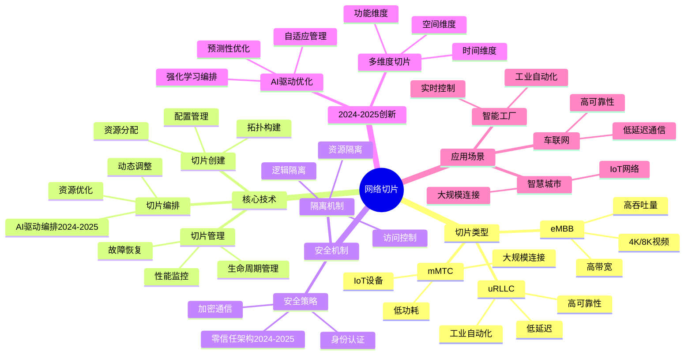

---

## 📊 **二、对比矩阵 / Comparison Matrices**

### 2.1 5G切片类型对比矩阵

| 切片类型 | 带宽需求 | 延迟需求 | 可靠性需求 | 连接密度 | 主要应用 | 2024-2025优化 |
|---------|---------|---------|-----------|---------|---------|--------------|
| **eMBB** | 高 >10Gbps | 中 <10ms | 中 >99% | 低 | 4K/8K视频、VR/AR | 带宽优化、QoS保证 |
| **uRLLC** | 中 1-10Gbps | 极低 <1ms | 极高 >99.999% | 低 | 工业自动化、自动驾驶 | 延迟优化、可靠性提升 |
| **mMTC** | 低 <1Gbps | 中 <100ms | 中 >99% | 极高 >10^6/km² | IoT、传感器网络 | 连接优化、功耗降低 |

### 2.2 切片编排算法对比矩阵

| 算法 | 复杂度 | 最优性 | 适用规模 | 2024-2025改进 |
|------|--------|--------|---------|--------------|
| **贪心算法** | O(n·m) | 近似 | 中小规模 | 智能贪心策略 |
| **整数线性规划** | 指数 | 最优 | 小规模 | 高效求解器 |
| **强化学习** | 训练高 | 近似最优 | 大规模 | 深度强化学习 |
| **启发式算法** | O(n²) | 近似 | 中等规模 | 混合启发式 |

---

## 🌳 **三、决策树 / Decision Trees**

### 3.1 切片类型选择决策树

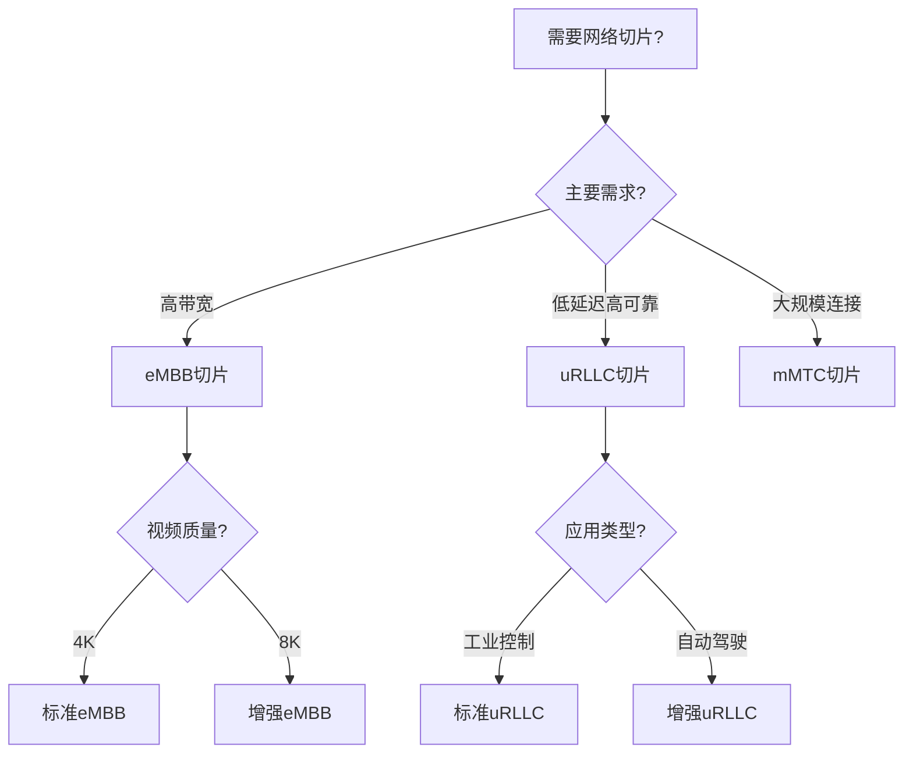

### 3.2 切片编排算法选择决策树

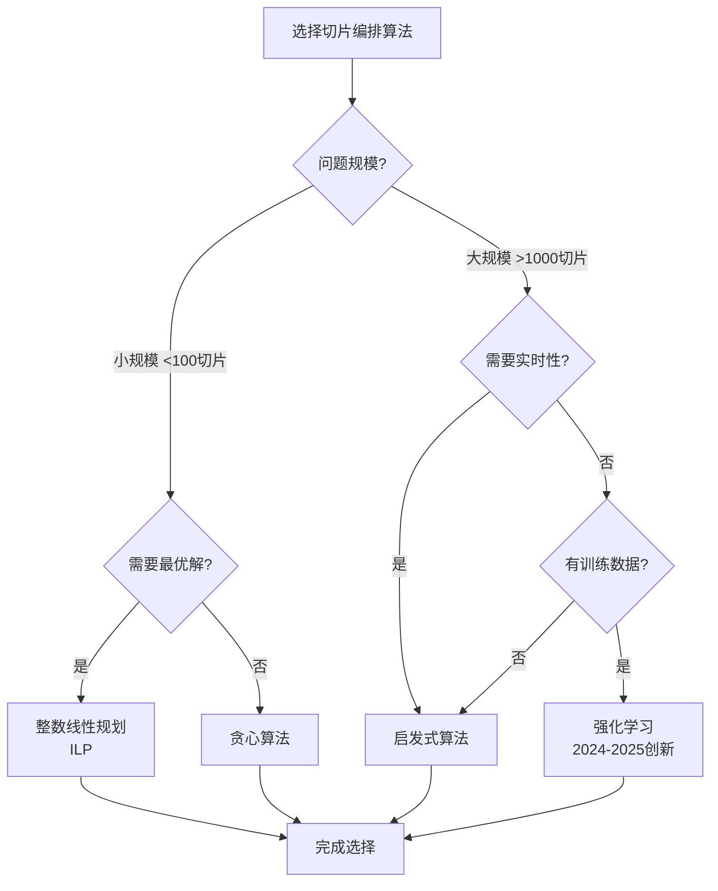

### 3.3 切片资源分配决策树

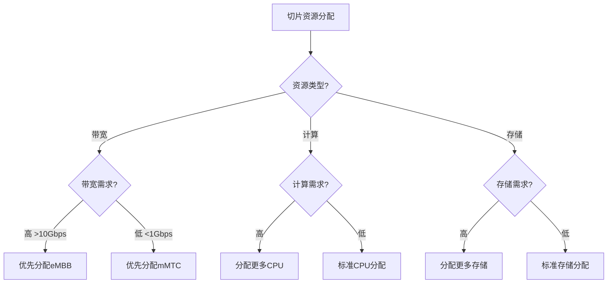

---

## 🔬 **四、证明树 / Proof Trees**

### 4.1 切片资源分配最优性证明树

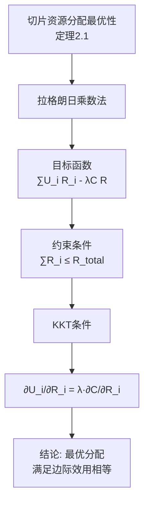

### 4.2 切片隔离安全性证明树

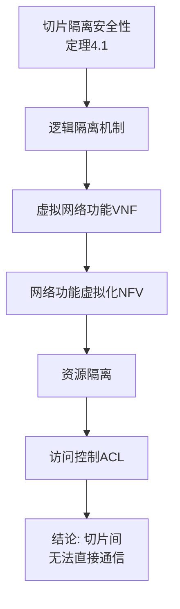

### 4.3 AI驱动编排收敛性证明树

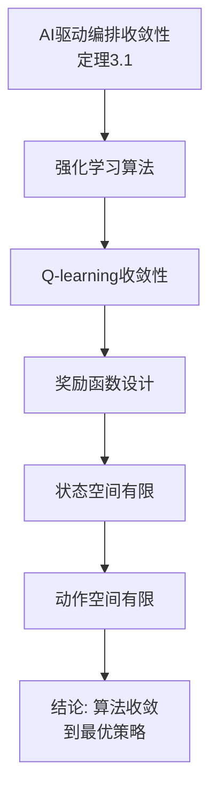

---

## 🔄 **五、数据流图 / Data Flow Diagrams**

### 5.1 网络切片创建数据流

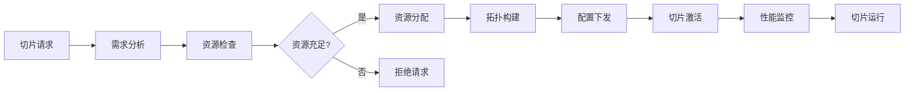

### 5.2 切片编排优化数据流

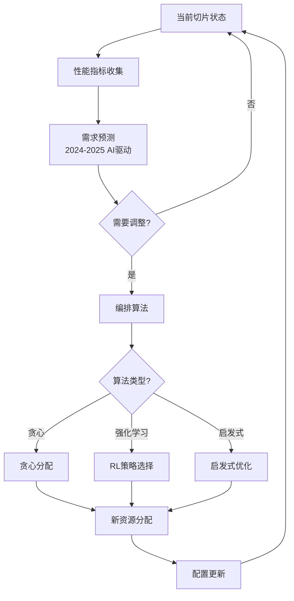

### 5.3 切片生命周期管理数据流

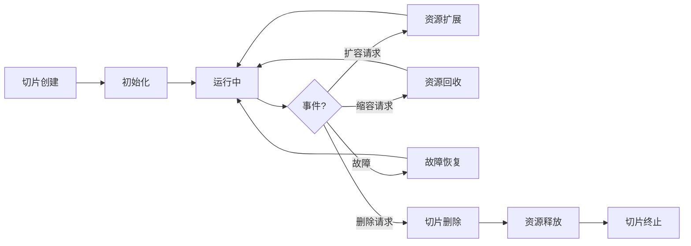

---

## 🗺️ **六、概念地图 / Concept Maps**

### 6.1 网络切片核心概念关系地图

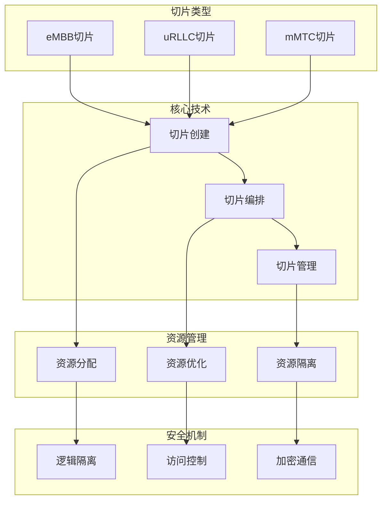

### 6.2 网络切片编排架构概念地图

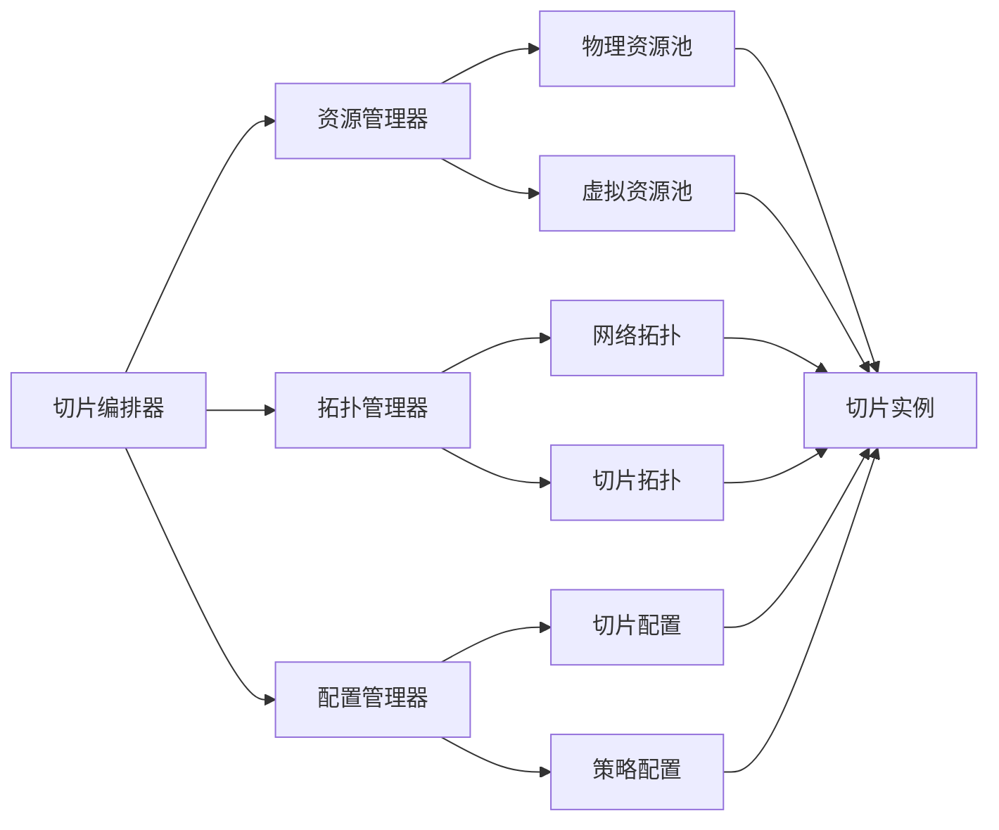

---

## 📈 **七、学习路径图 / Learning Path Diagrams**

### 7.1 网络切片学习路径

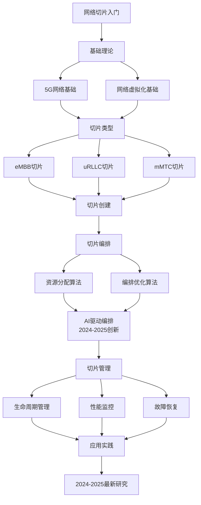

---

## 📝 **八、总结 / Summary**

### 8.1 思维表征工具使用指南

1. **思维导图**: 快速理解网络切片的知识结构
2. **对比矩阵**: 比较不同切片类型、编排算法的优缺点
3. **决策树**: 选择合适切片类型、编排算法、资源分配策略
4. **证明树**: 理解理论证明过程（最优性、安全性、收敛性）
5. **数据流图**: 理解切片创建、编排、管理的执行流程
6. **概念地图**: 理解概念间的关系和架构
7. **学习路径图**: 规划学习路径

### 8.2 工具更新说明

本文档将随着网络切片领域的发展持续更新，确保包含最新的研究进展和方法。

---

**文档版本**: v1.0
**创建时间**: 2025年1月
**最后更新**: 2025年1月
**维护者**: GraphNetWorkCommunicate项目组
**状态**: ✅ 完成
