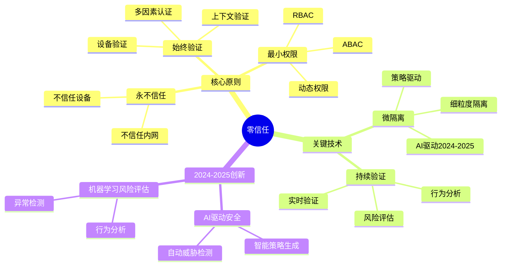
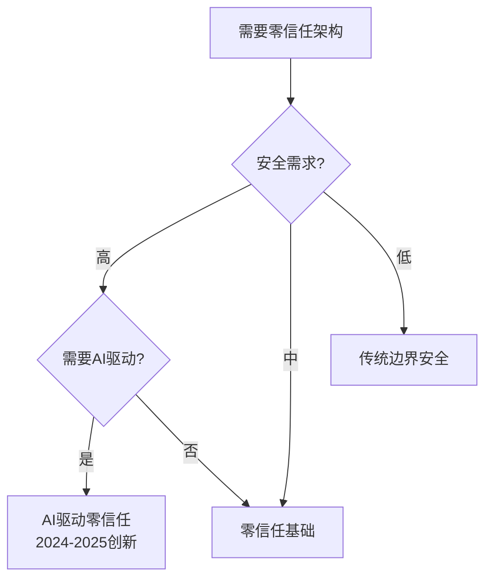
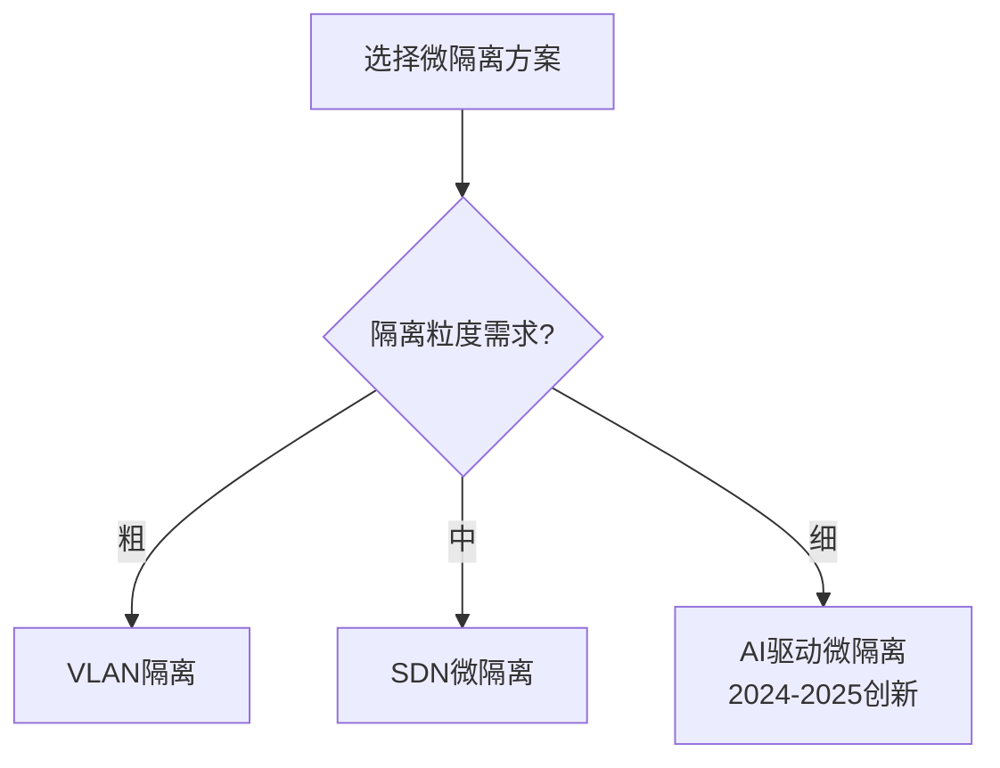
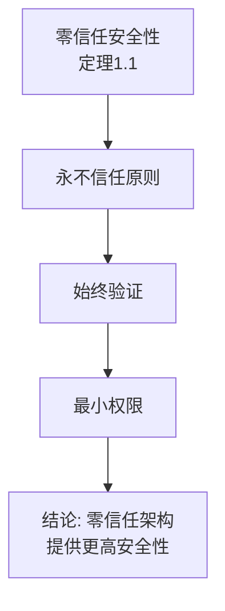
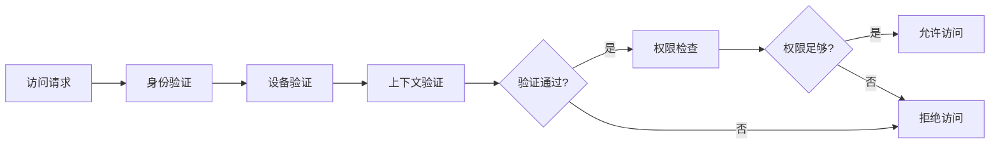
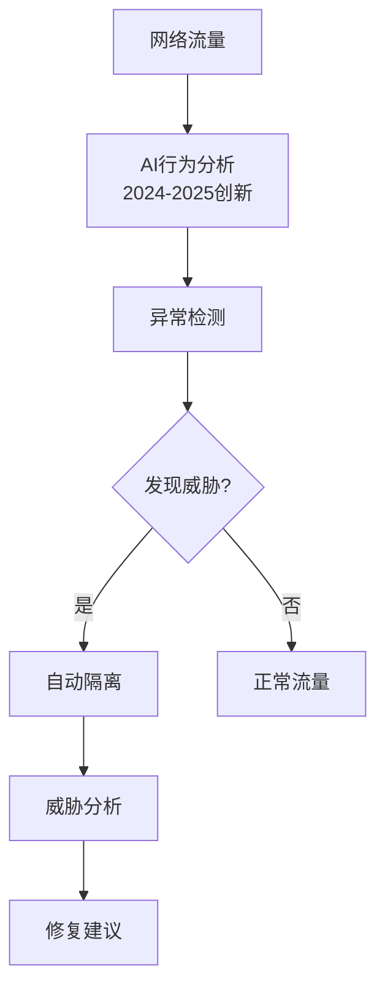
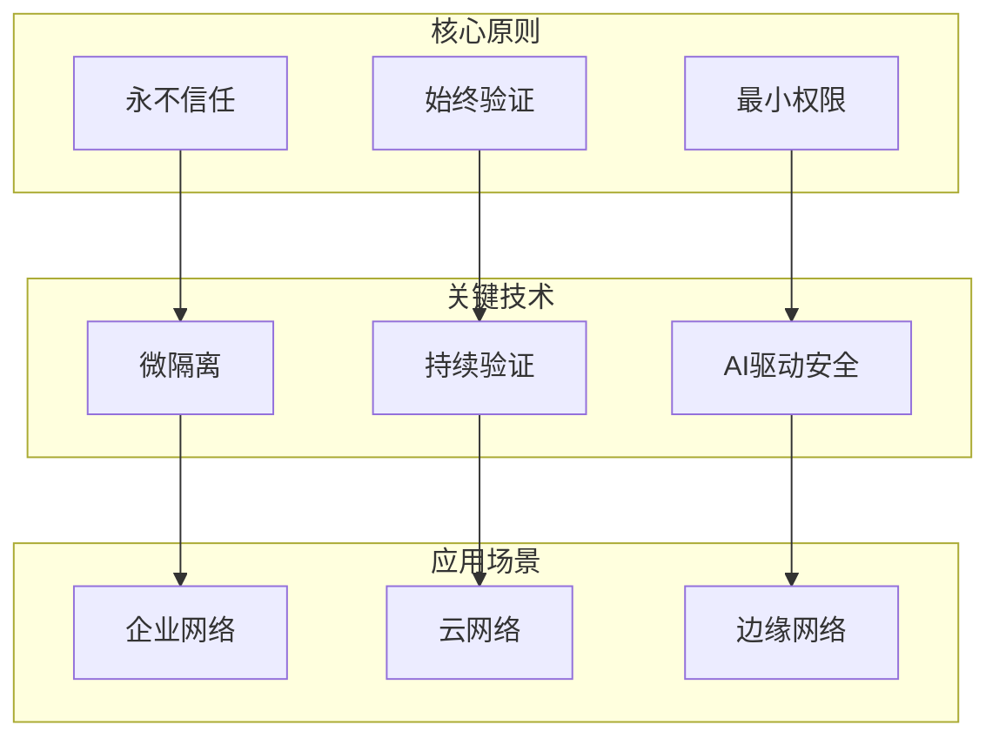
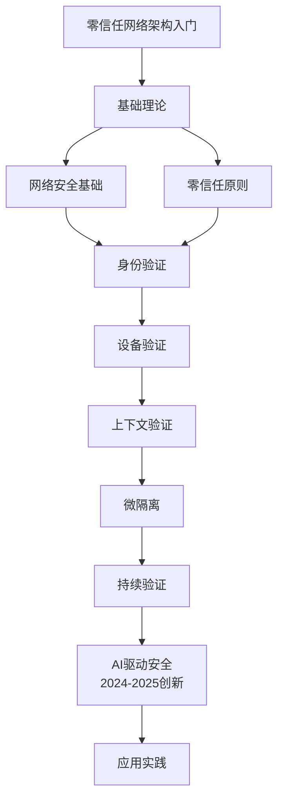

# 零信任网络架构专题思维表征工具 / Zero Trust Network Architecture Special Topic Mental Representation Tools 2024-2025

## 📚 **概述 / Overview**

本文档为零信任网络架构专题提供完整的思维表征工具集合。

**创建时间**: 2025年1月
**状态**: ✅ 完成
**专题**: 零信任网络架构（2024-2025最新研究）
**相关文档**: [零信任网络架构专题-2024-2025.md](零信任网络架构专题-2024-2025.md)

---

## 🗺️ **一、思维导图 / Mind Maps**

### 1.1 零信任网络架构完整思维导图

---

## 📊 **二、对比矩阵 / Comparison Matrices**

### 2.1 零信任架构对比矩阵

| 架构类型 | 验证频率 | 隔离粒度 | 安全性 | 复杂度 | 适用场景 | 2024-2025创新 |
|---------|---------|---------|--------|--------|---------|--------------|
| **传统边界安全** | 低 | 粗 | 低 | 低 | 简单网络 | 基础方法 |
| **零信任基础** | 中 | 中 | 高 | 中 | 一般网络 | 基础架构 |
| **AI驱动零信任** | 高 | 细 | 很高 | 高 | 复杂网络 | AI驱动安全 |

### 2.2 微隔离技术对比矩阵

| 技术 | 隔离粒度 | 管理复杂度 | 性能影响 | 适用场景 |
|------|---------|-----------|---------|---------|
| **VLAN隔离** | 粗 | 低 | 低 | 简单场景 |
| **SDN微隔离** | 中 | 中 | 中 | 中等场景 |
| **AI驱动微隔离** | 细 | 高 | 中 | 复杂场景 |

---

## 🌳 **三、决策树 / Decision Trees**

### 3.1 零信任架构选择决策树

### 3.2 微隔离方案选择决策树

---

## 🔬 **四、证明树 / Proof Trees**

### 4.1 零信任安全性证明树

---

## 🔄 **五、数据流图 / Data Flow Diagrams**

### 5.1 零信任访问控制数据流

### 5.2 AI驱动安全检测数据流

---

## 🗺️ **六、概念地图 / Concept Maps**

### 6.1 零信任网络架构核心概念关系地图

---

## 📈 **七、学习路径图 / Learning Path Diagrams**

### 7.1 零信任网络架构学习路径

---

## 📝 **八、总结 / Summary**

### 8.1 思维表征工具使用指南

1. **思维导图**: 快速理解零信任网络架构的知识结构
2. **对比矩阵**: 比较不同架构类型、技术的优缺点
3. **决策树**: 选择合适架构、隔离方案
4. **证明树**: 理解理论证明过程（安全性）
5. **数据流图**: 理解访问控制、安全检测的执行流程
6. **概念地图**: 理解概念间的关系
7. **学习路径图**: 规划学习路径

### 8.2 工具更新说明

本文档将随着零信任网络架构领域的发展持续更新，确保包含最新的研究进展和方法。

---

**文档版本**: v1.0
**创建时间**: 2025年1月
**最后更新**: 2025年1月
**维护者**: GraphNetWorkCommunicate项目组
**状态**: ✅ 完成
