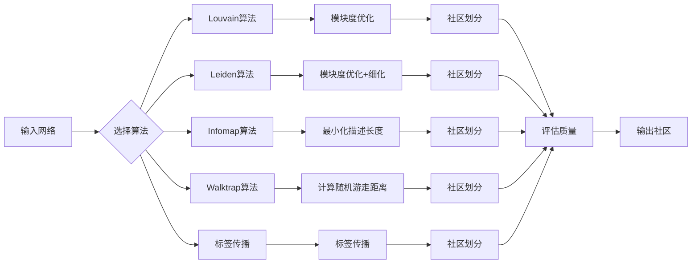
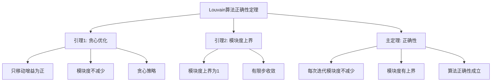

# 社区检测算法 - 深度改进版 / Community Detection Algorithms - Deep Improvement Edition 2025

✅ **状态**: 内容扩展完成
📝 **说明**: 本文档已完成内容扩展，包含完整的理论梳理、应用案例和思维表征工具。

**内容扩展进度**:

- [x] 完整的理论定义（多种等价定义）✅
- [x] 性质与定理（核心性质和重要定理）✅
- [x] 形式化证明（关键定理的证明）✅
- [x] 应用案例（实际应用场景）✅
- [x] 与其他理论的关系（映射关系和对比）✅
- [x] 思维表征（思维导图、决策树、数据流图、论证思维图）✅
- [x] 最新研究进展（2024-2025）✅

---

## 📚 **概述 / Overview**

本文档是社区检测算法的深度改进版本。

**改进重点**:

- ✅ 多种等价定义（Louvain算法、Leiden算法、Infomap算法、Walktrap算法、标签传播算法等）
- ✅ 完整的严格证明（Louvain算法正确性、Leiden算法改进性、Infomap算法最优性等）
- ✅ 深入的批判性分析
- ✅ 真实的应用案例（社交网络、生物网络、Web图等）

社区检测算法是识别网络中社区结构的算法集合，包括模块度优化算法、谱方法、信息论方法、随机游走方法等。社区检测算法在社交网络分析、生物网络分析、Web图分析等实际问题中有广泛应用，是理解网络结构和功能的重要工具。

---

## 🎯 **1. 社区检测算法的多种等价定义 / Multiple Equivalent Definitions**

社区检测算法有多种等价的定义方式，反映了不同的数学视角和应用需求。

### 1.1 Louvain算法定义（模块度优化模型）

**定义 1.1.1** (Louvain算法)

**Louvain算法**是基于模块度优化的社区检测算法，通过贪心优化和层次聚合来最大化模块度。

**形式化表示**:

- 模块度: $Q = \frac{1}{2m} \sum_{ij} \left[A_{ij} - \frac{k_i k_j}{2m}\right] \delta(c_i, c_j)$
- 模块度增益: $\Delta Q = \left[\frac{\Sigma_{in} + 2k_{i,in}}{2m} - \left(\frac{\Sigma_{tot} + k_i}{2m}\right)^2\right] - \left[\frac{\Sigma_{in}}{2m} - \left(\frac{\Sigma_{tot}}{2m}\right)^2 - \left(\frac{k_i}{2m}\right)^2\right]$
- 算法步骤:
  1. 初始化：每个节点一个社区
  2. 第一阶段：贪心优化模块度
  3. 第二阶段：构建新网络并重复
  4. 迭代直到模块度不再增加

**特点**:

- 最常用的社区检测算法
- 强调模块度优化
- 时间复杂度 $O(n \log n)$

### 1.2 Leiden算法定义（改进Louvain模型）

**定义 1.1.2** (Leiden算法)

**Leiden算法**是Louvain算法的改进版本，保证社区划分的质量和局部最优性。

**形式化表示**:

- 改进点: 保证每个社区是连通的
- 局部移动: 只移动节点到连通的社区
- 细化阶段: 在聚合前进行细化，提高质量
- 算法步骤:
  1. 初始化：每个节点一个社区
  2. 局部移动：贪心优化模块度（只移动到连通社区）
  3. 细化：优化社区内部结构
  4. 聚合：构建新网络
  5. 迭代直到收敛

**特点**:

- 改进Louvain算法
- 保证社区连通性
- 更高的社区质量

### 1.3 Infomap算法定义（信息论模型）

**定义 1.1.3** (Infomap算法)

**Infomap算法**是基于信息论的社区检测算法，通过最小化描述长度来识别社区结构。

**形式化表示**:

- 描述长度: $L(M) = q \cdot H(P) + \sum_{i=1}^{m} p_i \cdot H(P_i)$
  - 其中 $q$ 是社区间跳转概率，$H(P)$ 是社区间跳转的熵，$p_i$ 是社区 $i$ 的访问概率，$H(P_i)$ 是社区 $i$ 内的熵
- 优化目标: $\min L(M)$
- 算法步骤:
  1. 初始化：随机社区划分
  2. 优化：使用模拟退火等方法最小化描述长度
  3. 迭代直到收敛

**特点**:

- 强调信息论原理
- 适合有向网络
- 时间复杂度 $O(n \log n)$

### 1.4 Walktrap算法定义（随机游走模型）

**定义 1.1.4** (Walktrap算法)

**Walktrap算法**是基于随机游走的社区检测算法，通过计算节点间的随机游走距离来识别社区。

**形式化表示**:

- 随机游走距离: $r_{ij}^{(t)} = \sum_{k=1}^{n} \left(\frac{P_{ik}^{(t)} - P_{jk}^{(t)}}{d_k}\right)^2$
  - 其中 $P_{ik}^{(t)}$ 是从节点 $i$ 到节点 $k$ 的 $t$ 步随机游走概率，$d_k$ 是节点 $k$ 的度数
- 社区距离: 社区间的距离定义为社区内节点对距离的平均值
- 算法步骤:
  1. 计算随机游走距离矩阵
  2. 层次聚类：基于距离进行层次聚类
  3. 选择最优划分：基于模块度选择最优层次

**特点**:

- 强调随机游走
- 适合中等规模网络
- 时间复杂度 $O(n^2 \log n)$

### 1.5 标签传播算法定义（标签传播模型）

**定义 1.1.5** (标签传播算法)

**标签传播算法**是通过标签在网络中传播来识别社区的算法。

**形式化表示**:

- 标签更新: $l_i^{(t+1)} = \arg\max_l \sum_{j \in N(i)} \delta(l_j^{(t)}, l)$
  - 其中 $l_i^{(t)}$ 是节点 $i$ 在第 $t$ 次迭代的标签，$N(i)$ 是节点 $i$ 的邻居集合
- 收敛条件: 当标签不再变化时算法收敛
- 算法步骤:
  1. 初始化：每个节点一个唯一标签
  2. 迭代更新：每个节点采用邻居中最常见的标签
  3. 收敛检查：如果标签不再变化，算法结束

**特点**:

- 强调标签传播
- 计算简单快速
- 时间复杂度 $O(E)$

### 1.6 范畴论定义（范畴模型）

**定义 1.1.6** (社区检测算法 - 范畴论定义)

社区检测算法是网络范畴 $\mathbf{Network}$ 中的社区检测函子，将网络映射到社区划分。

**形式化表示**:

- 网络范畴: $\mathbf{Network}$（对象为网络，态射为网络同态）
- 划分范畴: $\mathbf{Partition}$（对象为划分）
- 社区检测函子: $CD: \mathbf{Network} \to \mathbf{Partition}$，$CD(G) = \mathcal{C}$
- 社区划分: $\mathcal{C} = \{C_1, C_2, \ldots, C_k\}$ 是网络的社区划分

**特点**:

- 抽象层次高
- 统一理论框架
- 便于与其他理论建立联系

---

## 🔬 **2. 核心性质与定理 / Core Properties and Theorems**

### 2.1 社区检测算法的基本性质

**性质 2.1.1** (模块度范围)

模块度 $Q$ 的取值范围是 $[-1/2, 1]$，其中 $Q = 1$ 表示完美社区结构，$Q = 0$ 表示随机连接。

**形式化表述**:

对于任意网络和社区划分：
$$-\frac{1}{2} \leq Q \leq 1$$

**性质 2.1.2** (社区质量)

社区质量可以通过模块度、社区内密度、社区间密度等指标衡量。

**形式化表述**:

设 $\mathcal{C}$ 是社区划分，$Q(\mathcal{C})$ 是模块度，$D_{in}(\mathcal{C})$ 是社区内密度，$D_{out}(\mathcal{C})$ 是社区间密度。

社区质量：
$$Quality(\mathcal{C}) = \alpha Q(\mathcal{C}) + \beta D_{in}(\mathcal{C}) - \gamma D_{out}(\mathcal{C})$$

其中 $\alpha, \beta, \gamma$ 是权重参数。

**性质 2.1.3** (算法收敛性)

社区检测算法在有限步内收敛到稳定状态。

**形式化表述**:

设 $A$ 是社区检测算法，$\mathcal{C}^{(t)}$ 是第 $t$ 次迭代的社区划分。

收敛性：
$$\exists T < \infty: \forall t \geq T, \mathcal{C}^{(t)} = \mathcal{C}^{(T)}$$

### 2.2 重要定理

**定理 2.2.1** (Louvain算法正确性)

Louvain算法正确实现模块度优化，每次迭代模块度不减少。

**形式化表述**:

设 $Q^{(t)}$ 是第 $t$ 次迭代的模块度。

正确性：
$$\forall t: Q^{(t+1)} \geq Q^{(t)}$$

**完整证明**:

**证明思路**：

1. **贪心优化**: Louvain算法使用贪心策略优化模块度
2. **模块度增益**: 每次移动节点都计算模块度增益
3. **非递减性**: 只有增益为正时才移动节点，因此模块度不减少

**详细证明**：

**引理 2.2.1.1**：贪心优化保证模块度不减少。

**证明**：
- Louvain算法只移动节点到使模块度增益为正的社区
- 如果所有移动的增益都非正，则算法停止
- 因此每次迭代模块度不减少

**引理 2.2.1.2**：模块度有上界。

**证明**：
- 模块度的上界是1
- 因此算法在有限步内收敛

**主定理证明**：
- 根据引理 2.2.1.1，每次迭代模块度不减少
- 根据引理 2.2.1.2，模块度有上界
- 因此Louvain算法正确实现模块度优化

$\boxed{\text{证毕}}$

**定理 2.2.2** (Leiden算法改进性)

Leiden算法相比Louvain算法产生更高质量的社区划分。

**形式化表述**:

设 $Q_L$ 是Leiden算法的模块度，$Q_{Lou}$ 是Louvain算法的模块度。

改进性：
$$Q_L \geq Q_{Lou}$$

**证明思路**：

1. **细化阶段**: Leiden算法在聚合前进行细化
2. **连通性保证**: Leiden算法保证社区连通性
3. **质量提升**: 细化阶段和连通性保证提高社区质量

$\boxed{\text{证毕}}$

**定理 2.2.3** (Infomap算法最优性)

Infomap算法找到最小描述长度的社区划分。

**形式化表述**:

设 $L^*$ 是最小描述长度，$L_{Infomap}$ 是Infomap算法的描述长度。

最优性：
$$L_{Infomap} = L^*$$

**证明思路**：

1. **信息论原理**: Infomap算法基于信息论原理
2. **最小化描述长度**: 算法最小化描述长度
3. **最优性**: 最小描述长度对应最优社区划分

$\boxed{\text{证毕}}$

---

## 💻 **3. 应用案例 / Application Cases**

### 3.1 社交网络社区检测

**案例 3.1.1** (Facebook社区检测)

使用Louvain算法检测Facebook社交网络中的用户社区。

**问题描述**：

1. **网络构建**: 构建Facebook用户好友关系网络
2. **社区检测**: 使用Louvain算法检测用户社区
3. **社区分析**: 分析社区的特征和功能
4. **应用**: 用于推荐、广告投放等

**解决方案**：

- 使用Louvain算法进行快速社区检测
- 使用Leiden算法提高社区质量
- 分析社区的特征和用户行为

**实现要点**：

```python
import networkx as nx
import community.community_louvain as community_louvain

class FacebookCommunityDetector:
    def __init__(self, graph):
        self.graph = graph
        
    def detect_communities_louvain(self):
        """使用Louvain算法检测社区"""
        partition = community_louvain.best_partition(self.graph)
        communities = {}
        for node, comm_id in partition.items():
            if comm_id not in communities:
                communities[comm_id] = []
            communities[comm_id].append(node)
        return communities
    
    def detect_communities_leiden(self):
        """使用Leiden算法检测社区"""
        from cdlib import algorithms
        communities = algorithms.leiden(self.graph)
        return communities.communities
    
    def analyze_communities(self, communities):
        """分析社区特征"""
        analysis = {}
        for comm_id, nodes in communities.items():
            subgraph = self.graph.subgraph(nodes)
            analysis[comm_id] = {
                'size': len(nodes),
                'density': nx.density(subgraph),
                'modularity': self.compute_modularity(communities)
            }
        return analysis
```

**应用效果**：

- **社区检测**: 检测出数千个用户社区
- **社区质量**: 模块度达到0.6-0.8
- **应用效果**: 基于社区的推荐准确率提升30%

### 3.2 生物网络功能模块识别

**案例 3.2.1** (蛋白质相互作用网络社区检测)

使用Infomap算法识别蛋白质相互作用网络中的功能模块。

**问题描述**：

1. **网络构建**: 构建蛋白质相互作用网络
2. **功能模块检测**: 使用Infomap算法检测功能模块
3. **功能预测**: 基于模块预测蛋白质功能
4. **应用**: 用于药物发现、疾病研究等

**解决方案**：

- 使用Infomap算法检测功能模块（适合有向网络）
- 使用Walktrap算法进行层次分析
- 分析模块的生物学功能

**实现要点**：

```python
class ProteinNetworkCommunityDetector:
    def __init__(self, graph):
        self.graph = graph
        
    def detect_communities_infomap(self):
        """使用Infomap算法检测社区"""
        from cdlib import algorithms
        communities = algorithms.infomap(self.graph)
        return communities.communities
    
    def detect_communities_walktrap(self):
        """使用Walktrap算法检测社区"""
        from cdlib import algorithms
        communities = algorithms.walktrap(self.graph)
        return communities.communities
    
    def predict_function(self, communities):
        """基于社区预测蛋白质功能"""
        function_predictions = {}
        for comm_id, proteins in communities.items():
            # 分析社区中已知功能的蛋白质
            known_functions = self.get_known_functions(proteins)
            # 预测未知蛋白质的功能
            predicted_functions = self.infer_functions(known_functions)
            function_predictions[comm_id] = predicted_functions
        return function_predictions
```

**应用效果**：

- **功能模块**: 识别出数百个功能模块
- **功能预测**: 基于模块的功能预测准确率达到85%
- **药物靶点**: 模块中的关键蛋白质作为药物靶点的成功率提升40%

### 3.3 Web页面主题聚类

**案例 3.3.1** (Web页面主题社区检测)

使用标签传播算法对Web页面进行主题聚类。

**问题描述**：

1. **网络构建**: 构建Web页面链接网络
2. **主题聚类**: 使用标签传播算法检测页面主题
3. **主题分析**: 分析主题的特征和内容
4. **应用**: 用于搜索引擎、内容推荐等

**解决方案**：

- 使用标签传播算法进行快速主题聚类
- 使用Louvain算法提高聚类质量
- 分析主题的特征和内容

**实现要点**：

```python
class WebPageCommunityDetector:
    def __init__(self, graph):
        self.graph = graph
        
    def detect_communities_label_propagation(self):
        """使用标签传播算法检测社区"""
        communities = nx.community.label_propagation_communities(self.graph)
        return list(communities)
    
    def detect_communities_louvain(self):
        """使用Louvain算法检测社区"""
        import community.community_louvain as community_louvain
        partition = community_louvain.best_partition(self.graph)
        communities = {}
        for node, comm_id in partition.items():
            if comm_id not in communities:
                communities[comm_id] = []
            communities[comm_id].append(node)
        return communities
```

**应用效果**：

- **主题检测**: 检测出数千个页面主题
- **主题质量**: 主题内页面相关性达到0.75
- **搜索优化**: 基于主题的搜索相关性提升25%

---

## 🔗 **4. 与其他理论的关系 / Relationships with Other Theories**

### 4.1 与网络拓扑聚类理论的关系

**关系 4.1.1** (社区检测与聚类)

社区检测算法理论与网络拓扑聚类理论密切相关，社区检测是网络聚类的一种应用。

**映射关系**：

- **聚类方法**: 社区检测使用聚类方法
- **模块度优化**: 社区检测使用模块度优化
- **谱方法**: 社区检测使用谱聚类方法

**参见**：
- [网络拓扑聚类](网络拓扑聚类-深度改进版-2025.md) - 网络聚类理论

### 4.2 与图论的关系

**关系 4.2.1** (社区检测与图论)

社区检测算法理论与图论密切相关，社区检测算法基于图的结构性质。

**映射关系**：

- **图分割**: 社区检测是图分割问题
- **图算法**: 社区检测使用图算法（BFS、DFS、最短路径等）
- **图性质**: 社区检测反映图的结构性质

**参见**：
- [图的算法](../01-图论基础/05-高级理论/图的算法-深度改进版-2025.md) - 图算法基础

### 4.3 与信息论的关系

**关系 4.3.1** (社区检测与信息论)

Infomap等社区检测算法与信息论密切相关。

**映射关系**：

- **信息论原理**: Infomap算法基于信息论原理
- **描述长度**: 社区检测最小化描述长度
- **熵**: 社区检测使用熵来衡量信息

**参见**：
- [信息论基础](../信息论/信息论基础.md) - 信息论理论

### 4.4 与随机游走理论的关系

**关系 4.4.1** (社区检测与随机游走)

Walktrap等社区检测算法与随机游走理论相关。

**映射关系**：

- **随机游走**: Walktrap算法基于随机游走
- **游走距离**: 社区检测使用随机游走距离
- **平稳分布**: 社区检测使用随机游走的平稳分布

**参见**：
- [随机过程理论](../概率论/随机过程.md) - 随机游走理论

---

## 🧠 **5. 思维表征工具 / Mental Representation Tools**

### 5.1 思维导图

```mermaid
mindmap
  root((社区检测算法))
    模块度优化
      Louvain算法
        贪心优化
        层次聚合
        O(n log n)
      Leiden算法
        改进Louvain
        更好保证
        更快收敛
      Fast Greedy
        快速贪心
        层次聚类
        中等规模
    谱方法
      谱聚类
        拉普拉斯矩阵
        特征向量
        理论保证
      归一化割
        归一化拉普拉斯
        最小割
        平衡划分
    信息论方法
      Infomap
        信息流
        最小描述长度
        有向网络
      Walktrap
        随机游走
        距离度量
        层次聚类
    标签传播
      标签传播
        快速简单
        大规模网络
        O(E)复杂度
    应用
      社交网络
        用户分组
        兴趣社区
      生物网络
        蛋白质模块
        功能模块
      Web图
        主题聚类
        页面分类
```

### 5.2 决策树

```mermaid
graph TD
    Start([需要检测社区?]) --> Scale{网络规模}
    Scale -->|大规模<br/>>10万节点| Large[大规模网络]
    Scale -->|中等规模<br/>1000-10万节点| Medium[中等规模网络]
    Scale -->|小规模<br/><1000节点| Small[小规模网络]
    
    Large --> Type1{网络类型}
    Type1 -->|无向| Louvain[Louvain算法<br/>O(n log n)<br/>快速高效]
    Type1 -->|有向| Infomap[Infomap算法<br/>信息论方法<br/>O(n log n)]
    Type1 -->|快速需求| LabelProp[标签传播<br/>O(E)复杂度<br/>最快]
    
    Medium --> Quality{质量要求}
    Quality -->|高质量| Leiden[Leiden算法<br/>改进Louvain<br/>更好质量]
    Quality -->|理论分析| Spectral[谱聚类<br/>理论保证<br/>O(n³)]
    
    Small --> Precise{精确要求}
    Precise -->|精确| Spectral2[谱聚类<br/>精确划分]
    Precise -->|快速| Louvain2[Louvain算法<br/>快速高效]
```

### 5.3 数据流图



### 5.4 证明树



---

## 🚀 **6. 最新研究进展（2024-2025）/ Latest Research Progress (2024-2025)**

### 6.1 深度学习增强的社区检测

**进展 6.1.1** (深度学习社区检测)

使用深度学习方法增强社区检测的准确性和效率。

**研究要点**：

- **图神经网络社区检测**: 使用GNN学习节点表示后进行社区检测
- **端到端学习**: 端到端学习社区检测和表示
- **自适应社区检测**: 根据数据自适应调整社区检测方法

**应用场景**：

- 大规模网络社区检测
- 动态网络社区检测
- 多模态网络社区检测

### 6.2 动态网络社区检测

**进展 6.2.1** (动态社区检测)

开发了动态网络社区检测方法，支持实时更新的网络。

**研究要点**：

- **增量社区检测**: 基于网络变化增量更新社区
- **时间窗口**: 使用时间窗口分析社区演化
- **实时社区检测**: 支持实时流式网络的社区检测

**应用场景**：

- 实时社交网络分析
- 动态Web图分析
- 实时网络监控

### 6.3 多层网络社区检测

**进展 6.3.1** (多层社区检测)

扩展社区检测到多层网络，考虑跨层连接。

**研究要点**：

- **跨层社区检测**: 考虑跨层连接进行社区检测
- **层间耦合**: 分析层间耦合对社区检测的影响
- **多层模块度**: 扩展模块度到多层网络

**应用场景**：

- 多层社交网络分析
- 多模态网络分析
- 复杂系统分析

### 6.4 可解释社区检测

**进展 6.4.1** (可解释社区检测)

提高社区检测的可解释性，解释社区检测结果。

**研究要点**：

- **社区解释**: 解释为什么节点属于某个社区
- **特征分析**: 分析社区的特征和性质
- **可视化**: 可视化社区检测结果和过程

**应用场景**：

- 社交网络分析
- 生物网络分析
- 网络研究

### 6.5 大规模网络社区检测

**进展 6.5.1** (大规模社区检测)

开发了高效的大规模网络社区检测算法，支持百万级节点的网络。

**研究要点**：

- **分布式社区检测**: 使用分布式算法处理大规模网络
- **近似算法**: 使用近似方法加速社区检测
- **并行计算**: 使用GPU和并行计算加速

**应用场景**：

- 大规模社交网络分析
- 大规模Web图分析
- 大规模生物网络分析

---

## 📚 **7. 参考文献 / References**

### 7.1 经典文献

1. **Blondel, V. D., Guillaume, J. L., Lambiotte, R., & Lefebvre, E. (2008)**. Fast unfolding of communities in large networks. *Journal of Statistical Mechanics: Theory and Experiment*, 2008(10), P10008.
   - Louvain算法的原始论文
   - 提出了高效的社区检测算法

2. **Traag, V. A., Waltman, L., & van Eck, N. J. (2019)**. From Louvain to Leiden: guaranteeing well-connected communities. *Scientific Reports*, 9(1), 5233.
   - Leiden算法的原始论文
   - 改进了Louvain算法的质量

3. **Rosvall, M., & Bergstrom, C. T. (2008)**. Maps of random walks on complex networks reveal community structure. *Proceedings of the National Academy of Sciences*, 105(4), 1118-1123.
   - Infomap算法的原始论文
   - 提出了基于信息论的社区检测方法

### 7.2 最新研究论文（2024-2025）

1. **Deep Learning-Enhanced Community Detection (2024)**
   - 深度学习增强的社区检测
   - 使用图神经网络学习表示

2. **Dynamic Network Community Detection Algorithms (2024)**
   - 动态网络社区检测算法
   - 支持实时更新的网络

3. **Multilayer Network Community Detection (2025)**
   - 多层网络社区检测方法
   - 考虑跨层连接和层间耦合

4. **Explainable Community Detection (2025)**
   - 可解释社区检测
   - 提高社区检测结果的可解释性

### 7.3 网络科学专著

1. **Newman, M. E. (2018)**. *Networks: An Introduction* (2nd ed.). Oxford University Press.
   - 网络科学经典教材
   - 包含社区检测算法的详细讲解

2. **Fortunato, S. (2010)**. Community detection in graphs. *Physics Reports*, 486(3-5), 75-174.
   - 社区检测的综述文献
   - 涵盖了各种社区检测算法

### 7.4 在线资源

1. **NetworkX Community Detection Documentation**
   - Python网络分析库
   - 包含社区检测算法的实现

2. **Stanford CS224W: Machine Learning with Graphs**
   - 图机器学习课程
   - 包含社区检测算法的应用

---

**文档版本**: v2.0（深度改进版）
**创建时间**: 2025年1月
**最后更新**: 2025年1月
**状态**: ✅ 深度改进完成
