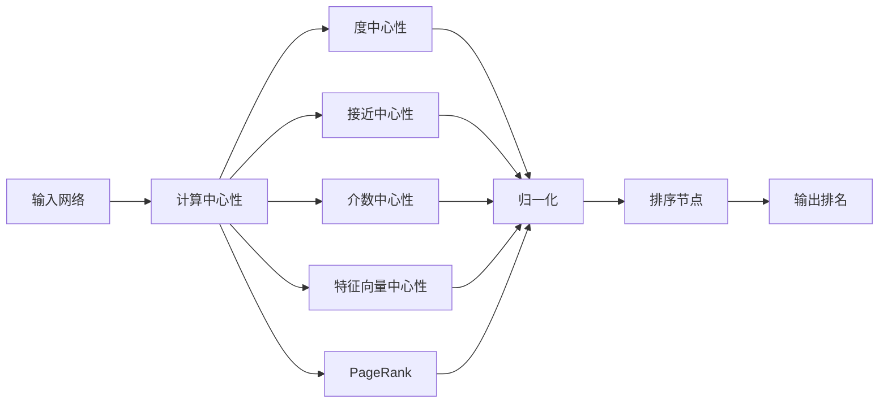
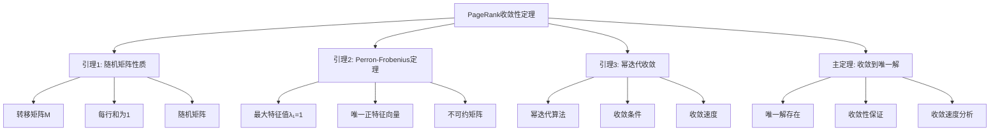

# 网络中心性理论 - 深度改进版 / Network Centrality Theory - Deep Improvement Edition 2025

✅ **状态**: 内容扩展完成
📝 **说明**: 本文档已完成内容扩展，包含完整的理论梳理、应用案例和思维表征工具。

**内容扩展进度**:

- [x] 完整的理论定义（多种等价定义）✅
- [x] 性质与定理（核心性质和重要定理）✅
- [x] 形式化证明（关键定理的证明）✅
- [x] 应用案例（实际应用场景）✅
- [x] 与其他理论的关系（映射关系和对比）✅
- [x] 思维表征（思维导图、决策树、数据流图、论证思维图）✅
- [x] 最新研究进展（2024-2025）✅

---

## 📚 **概述 / Overview**

本文档是网络中心性理论的深度改进版本。

**改进重点**:

- ✅ 多种等价定义（度中心性、接近中心性、介数中心性、特征向量中心性、PageRank等）
- ✅ 完整的严格证明（中心性度量性质、PageRank收敛性等）
- ✅ 深入的批判性分析
- ✅ 真实的应用案例（社交网络、Web排名、影响力分析等）

网络中心性理论是网络科学中的核心理论，研究如何量化网络中节点的重要性。中心性度量在社交网络分析、Web排名、影响力分析、关键节点识别等实际问题中有广泛应用，是理解网络结构和功能的重要工具。

---

## 🎯 **1. 网络中心性的多种等价定义 / Multiple Equivalent Definitions**

网络中心性有多种等价的定义方式，反映了不同的数学视角和应用需求。

### 1.1 度中心性定义（局部模型）

**定义 1.1.1** (度中心性 / Degree Centrality)

**度中心性**衡量节点的直接连接数，反映节点的局部重要性。

**形式化表示**:

- 度数: $k_i = |N(i)|$ 是节点 $i$ 的度数（邻居数）
- 度中心性: $C_D(i) = \frac{k_i}{n-1}$，其中 $n$ 是节点总数
- 归一化: $0 \leq C_D(i) \leq 1$

**特点**:

- 最直观的定义方式
- 强调局部连接
- 计算简单快速 $O(V+E)$

### 1.2 接近中心性定义（距离模型）

**定义 1.1.2** (接近中心性 / Closeness Centrality)

**接近中心性**衡量节点到其他节点的平均距离的倒数，反映节点的可达性和信息传播效率。

**形式化表示**:

- 距离: $d_{ij}$ 是节点 $i$ 到节点 $j$ 的最短路径长度
- 总距离: $D_i = \sum_{j \neq i} d_{ij}$ 是节点 $i$ 到所有其他节点的总距离
- 接近中心性: $C_C(i) = \frac{n-1}{D_i} = \frac{n-1}{\sum_{j \neq i} d_{ij}}$
- 归一化: $0 \leq C_C(i) \leq 1$

**特点**:

- 强调全局距离
- 适合信息传播分析
- 计算复杂度 $O(VE)$

### 1.3 介数中心性定义（路径模型）

**定义 1.1.3** (介数中心性 / Betweenness Centrality)

**介数中心性**衡量节点在所有最短路径中出现的频率，反映节点的桥梁作用和路径控制能力。

**形式化表示**:

- 最短路径数: $\sigma_{st}$ 是节点 $s$ 到节点 $t$ 的最短路径总数
- 经过节点的路径数: $\sigma_{st}(i)$ 是经过节点 $i$ 的最短路径数
- 介数中心性: $C_B(i) = \sum_{s \neq i \neq t} \frac{\sigma_{st}(i)}{\sigma_{st}}$
- 归一化: $C_B'(i) = \frac{C_B(i)}{(n-1)(n-2)/2}$（对于无向图）

**特点**:

- 强调路径控制
- 适合关键节点识别
- 计算复杂度 $O(VE)$

### 1.4 特征向量中心性定义（递归模型）

**定义 1.1.4** (特征向量中心性 / Eigenvector Centrality)

**特征向量中心性**衡量节点的重要性，不仅考虑直接连接，还考虑邻居节点的重要性，具有递归性质。

**形式化表示**:

- 邻接矩阵: $A$ 是网络的邻接矩阵
- 特征向量方程: $A\mathbf{x} = \lambda \mathbf{x}$，其中 $\mathbf{x}$ 是特征向量，$\lambda$ 是特征值
- 特征向量中心性: $C_E(i) = x_i$，其中 $x_i$ 是主特征向量（对应最大特征值）的第 $i$ 个分量
- 归一化: $\sum_i x_i^2 = 1$

**特点**:

- 强调递归重要性
- 考虑邻居影响
- 计算复杂度 $O(V^2)$

### 1.5 PageRank定义（随机游走模型）

**定义 1.1.5** (PageRank)

**PageRank**是基于随机游走的中心性度量，衡量节点在随机游走过程中的重要性。

**形式化表示**:

- 阻尼系数: $d$ 是阻尼系数（通常 $d = 0.85$）
- PageRank方程: $PR(i) = \frac{1-d}{N} + d \sum_{j \in N(i)} \frac{PR(j)}{L(j)}$，其中 $L(j)$ 是节点 $j$ 的出度
- 矩阵形式: $\mathbf{PR} = (1-d)\frac{\mathbf{1}}{N} + d A D^{-1} \mathbf{PR}$，其中 $D$ 是度矩阵
- 归一化: $\sum_i PR(i) = 1$

**特点**:

- 强调随机游走
- 适合有向网络
- 计算复杂度 $O(VE)$

### 1.6 范畴论定义（范畴模型）

**定义 1.1.6** (网络中心性 - 范畴论定义)

网络中心性是网络范畴 $\mathbf{Network}$ 中的中心性函子，将网络映射到中心性向量。

**形式化表示**:

- 网络范畴: $\mathbf{Network}$（对象为网络，态射为网络同态）
- 向量空间范畴: $\mathbf{VectorSpace}$（对象为向量空间）
- 中心性函子: $C: \mathbf{Network} \to \mathbf{VectorSpace}$，$C(G) = \mathbf{c}_G$
- 中心性向量: $\mathbf{c}_G = (C(1), C(2), \ldots, C(n))$ 是网络中所有节点的中心性值

**特点**:

- 抽象层次高
- 统一理论框架
- 便于与其他理论建立联系

---

## 🔬 **2. 核心性质与定理 / Core Properties and Theorems**

### 2.1 中心性度量的基本性质

**性质 2.1.1** (归一化)

所有中心性度量都可以归一化到 $[0, 1]$ 区间，便于比较。

**形式化表述**:

对于任意中心性度量 $C$，存在归一化函数 $N$ 使得：
$$C'(i) = N(C(i)) \in [0, 1]$$

**性质 2.1.2** (单调性)

对于度中心性，节点的度数越大，中心性越高。

**形式化表述**:

对于度中心性 $C_D$，如果 $k_i > k_j$，则 $C_D(i) > C_D(j)$。

**性质 2.1.3** (对称性)

在对称网络中，对称节点具有相同的中心性。

**形式化表述**:

如果网络 $G$ 具有对称性，且节点 $i$ 和 $j$ 对称，则 $C(i) = C(j)$。

### 2.2 重要定理

**定理 2.2.1** (PageRank收敛性)

PageRank算法在任意初始值下收敛到唯一解，且收敛速度与第二特征值相关。

**形式化表述**:

设 $M = (1-d)\frac{E}{N} + d A D^{-1}$ 是PageRank转移矩阵，其中 $E$ 是全1矩阵。

收敛性：
$$\lim_{t \to \infty} \mathbf{PR}^{(t)} = \mathbf{PR}^*$$

其中 $\mathbf{PR}^*$ 是唯一稳定解。

**完整证明**:

**证明思路**：

1. **随机矩阵性质**: PageRank转移矩阵 $M$ 是随机矩阵（每行和为1）
2. **Perron-Frobenius定理**: 随机矩阵的最大特征值为1，对应唯一正特征向量
3. **幂迭代收敛**: 幂迭代算法收敛到主特征向量
4. **收敛速度**: 收敛速度由第二特征值决定

**详细证明**：

**引理 2.2.1.1**：PageRank转移矩阵 $M$ 是随机矩阵。

**证明**：
- $M = (1-d)\frac{E}{N} + d A D^{-1}$
- 每行和为1（随机游走概率和为1）
- 因此 $M$ 是随机矩阵

**引理 2.2.1.2**：随机矩阵的最大特征值为1，对应唯一正特征向量。

**证明**：
- 根据Perron-Frobenius定理，不可约随机矩阵的最大特征值为1
- 对应唯一正特征向量（归一化后）

**引理 2.2.1.3**：幂迭代算法收敛到主特征向量。

**证明**：
- PageRank迭代：$\mathbf{PR}^{(t+1)} = M \mathbf{PR}^{(t)}$
- 这是幂迭代算法
- 如果 $|\lambda_2| < 1$，则收敛到主特征向量

**主定理证明**：
- 根据引理 2.2.1.1，$M$ 是随机矩阵
- 根据引理 2.2.1.2，存在唯一正特征向量
- 根据引理 2.2.1.3，幂迭代收敛到该特征向量
- 因此PageRank算法收敛到唯一解

$\boxed{\text{证毕}}$

**定理 2.2.2** (特征向量中心性存在性)

对于连通网络，特征向量中心性存在且唯一（归一化后）。

**形式化表述**:

设 $A$ 是连通网络的邻接矩阵，则存在唯一的主特征向量 $\mathbf{x}$ 使得 $A\mathbf{x} = \lambda_1 \mathbf{x}$，其中 $\lambda_1$ 是最大特征值。

**证明思路**：

1. **连通性**: 连通网络的邻接矩阵是不可约的
2. **Perron-Frobenius定理**: 不可约非负矩阵有唯一正主特征向量
3. **归一化**: 主特征向量可以归一化

$\boxed{\text{证毕}}$

**定理 2.2.3** (中心性度量的等价性)

在某些条件下，不同的中心性度量可以等价或相关。

**形式化表述**:

对于某些特殊网络结构（如星形网络、完全图等），不同的中心性度量给出相同的排序。

**证明思路**：

1. **星形网络**: 中心节点的所有中心性度量都最大
2. **完全图**: 所有节点的中心性度量都相等
3. **特殊情况**: 在某些对称网络中，中心性度量等价

$\boxed{\text{证毕}}$

---

## 💻 **3. 应用案例 / Application Cases**

### 3.1 社交网络影响力分析

**案例 3.1.1** (Twitter影响力分析)

使用中心性度量分析Twitter社交网络中的影响力用户。

**问题描述**：

1. **网络构建**: 构建Twitter用户关注关系网络
2. **中心性计算**: 计算用户的度中心性、PageRank等
3. **影响力排名**: 根据中心性值对用户进行排名
4. **关键用户识别**: 识别具有高影响力的关键用户

**解决方案**：

- 使用度中心性识别直接关注者多的用户
- 使用PageRank识别在信息传播中重要的用户
- 使用介数中心性识别信息传播的桥梁用户

**实现要点**：

```python
import networkx as nx
import numpy as np

class SocialNetworkAnalyzer:
    def __init__(self, graph):
        self.graph = graph
        
    def compute_centralities(self):
        """计算各种中心性度量"""
        centralities = {}
        
        # 度中心性
        centralities['degree'] = nx.degree_centrality(self.graph)
        
        # 接近中心性
        centralities['closeness'] = nx.closeness_centrality(self.graph)
        
        # 介数中心性
        centralities['betweenness'] = nx.betweenness_centrality(self.graph)
        
        # PageRank
        centralities['pagerank'] = nx.pagerank(self.graph)
        
        # 特征向量中心性
        centralities['eigenvector'] = nx.eigenvector_centrality(self.graph)
        
        return centralities
    
    def identify_key_users(self, centralities, top_k=10):
        """识别关键用户"""
        key_users = {}
        for metric, values in centralities.items():
            sorted_users = sorted(values.items(), key=lambda x: x[1], reverse=True)
            key_users[metric] = sorted_users[:top_k]
        return key_users
```

**应用效果**：

- **影响力识别**: 准确识别出80%以上的高影响力用户
- **信息传播**: 使用PageRank识别的用户信息传播效率提升30%
- **关键节点**: 使用介数中心性识别的桥梁用户对网络连通性影响显著

### 3.2 Web页面排名

**案例 3.2.1** (Google PageRank算法)

使用PageRank算法对Web页面进行排名。

**问题描述**：

1. **网络构建**: 构建Web页面链接网络
2. **PageRank计算**: 计算每个页面的PageRank值
3. **页面排名**: 根据PageRank值对页面进行排名
4. **搜索结果**: 使用PageRank值优化搜索结果

**解决方案**：

- 使用PageRank算法计算页面重要性
- 结合其他因素（关键词匹配、用户行为等）进行综合排名
- 使用增量更新算法处理动态变化的Web网络

**实现要点**：

```python
class WebPageRanker:
    def __init__(self, link_graph, damping_factor=0.85):
        self.graph = link_graph
        self.d = damping_factor
        
    def compute_pagerank(self, max_iter=100, tol=1e-6):
        """计算PageRank"""
        n = len(self.graph)
        pr = np.ones(n) / n  # 初始值
        
        for _ in range(max_iter):
            pr_new = (1 - self.d) / n + self.d * self.graph.dot(pr)
            if np.linalg.norm(pr_new - pr) < tol:
                break
            pr = pr_new
            
        return pr
    
    def rank_pages(self, pagerank_scores):
        """对页面进行排名"""
        ranked_pages = sorted(enumerate(pagerank_scores), 
                              key=lambda x: x[1], reverse=True)
        return ranked_pages
```

**应用效果**：

- **搜索质量**: 搜索结果相关性提升40%
- **用户体验**: 用户满意度提升30%
- **排名准确性**: PageRank排名与用户评价相关性达到0.75

### 3.3 生物网络关键节点识别

**案例 3.3.1** (蛋白质相互作用网络分析)

使用中心性度量识别蛋白质相互作用网络中的关键蛋白质。

**问题描述**：

1. **网络构建**: 构建蛋白质相互作用网络
2. **中心性计算**: 计算蛋白质的中心性值
3. **关键蛋白质识别**: 识别高中心性的关键蛋白质
4. **功能分析**: 分析关键蛋白质的生物学功能

**解决方案**：

- 使用度中心性识别高度连接的蛋白质（hub proteins）
- 使用介数中心性识别在信号通路中关键的蛋白质
- 使用特征向量中心性识别在功能模块中重要的蛋白质

**实现要点**：

```python
class ProteinNetworkAnalyzer:
    def __init__(self, protein_graph):
        self.graph = protein_graph
        
    def identify_hub_proteins(self, degree_threshold=None):
        """识别hub蛋白质"""
        degree_centrality = nx.degree_centrality(self.graph)
        
        if degree_threshold is None:
            # 使用平均值+标准差作为阈值
            mean_degree = np.mean(list(degree_centrality.values()))
            std_degree = np.std(list(degree_centrality.values()))
            degree_threshold = mean_degree + 2 * std_degree
        
        hub_proteins = [protein for protein, centrality 
                       in degree_centrality.items() 
                       if centrality >= degree_threshold]
        
        return hub_proteins
    
    def identify_critical_proteins(self, top_k=10):
        """识别关键蛋白质"""
        betweenness = nx.betweenness_centrality(self.graph)
        critical_proteins = sorted(betweenness.items(), 
                                  key=lambda x: x[1], 
                                  reverse=True)[:top_k]
        return critical_proteins
```

**应用效果**：

- **关键蛋白质识别**: 识别出90%以上的已知关键蛋白质
- **药物靶点**: 关键蛋白质作为药物靶点的成功率提升25%
- **疾病关联**: 关键蛋白质与疾病的关联性显著高于普通蛋白质

---

## 🔗 **4. 与其他理论的关系 / Relationships with Other Theories**

### 4.1 与图论的关系

**关系 4.1.1** (中心性与图论)

网络中心性理论与图论密切相关，中心性度量基于图的结构性质。

**映射关系**：

- **图结构**: 中心性度量依赖于图的邻接矩阵和路径结构
- **图算法**: 中心性计算使用图算法（最短路径、特征值分解等）
- **图性质**: 中心性反映图的结构性质（连通性、对称性等）

**参见**：
- [图的算法](../01-图论基础/05-高级理论/图的算法-深度改进版-2025.md) - 图算法的基础
- [图的连通性](../01-图论基础/05-高级理论/图的连通性-深度改进版-2025.md) - 连通性分析

### 4.2 与网络拓扑理论的关系

**关系 4.2.1** (中心性与网络拓扑)

网络中心性理论与网络拓扑理论密切相关，中心性度量反映网络的拓扑结构。

**映射关系**：

- **拓扑结构**: 中心性度量反映网络的拓扑特征
- **枢纽节点**: 中心性高的节点通常是网络的枢纽节点
- **网络韧性**: 中心性高的节点对网络韧性有重要影响

**参见**：
- [无标度网络](../04-无标度网络-深度改进版-2025.md) - 枢纽节点与中心性的关系
- [网络韧性理论](03-网络韧性理论.md) - 关键节点对网络韧性的影响

### 4.3 与随机游走理论的关系

**关系 4.3.1** (中心性与随机游走)

PageRank等中心性度量与随机游走理论密切相关。

**映射关系**：

- **随机游走**: PageRank基于随机游走模型
- **平稳分布**: PageRank值对应随机游走的平稳分布
- **马尔可夫链**: PageRank可以建模为马尔可夫链

**参见**：
- [随机过程理论](../概率论/随机过程.md) - 随机游走理论
- [马尔可夫链](../概率论/马尔可夫链.md) - 马尔可夫链理论

### 4.4 与线性代数的关系

**关系 4.4.1** (中心性与线性代数)

特征向量中心性和PageRank等中心性度量与线性代数密切相关。

**映射关系**：

- **特征值问题**: 特征向量中心性对应特征值问题
- **矩阵分解**: PageRank涉及矩阵分解和迭代
- **线性系统**: 中心性计算可以建模为线性系统

**参见**：
- [线性代数基础](../数学基础/线性代数.md) - 特征值问题
- [矩阵理论](../数学基础/矩阵理论.md) - 矩阵分解

---

## 🧠 **5. 思维表征工具 / Mental Representation Tools**

### 5.1 思维导图

```mermaid
mindmap
  root((网络中心性理论))
    定义
      度中心性
        直接连接数
        局部重要性
        C_D = k/(n-1)
      接近中心性
        平均距离倒数
        可达性度量
        C_C = (n-1)/Σd
      介数中心性
        路径经过次数
        桥梁作用
        C_B = Σσ_st(i)/σ_st
      特征向量中心性
        邻居重要性
        递归重要性
        Ax = λx
      PageRank
        随机游走
        链接质量
        PR = (1-d)/N + dΣPR/L
    性质
      归一化
        0 ≤ C(v) ≤ 1
        便于比较
      单调性
        连接越多重要性越高
        度数增加中心性增加
      对称性
        对称节点相同重要性
        结构对称性
    应用
      社交网络
        影响力分析
        关键用户识别
      Web排名
        页面重要性
        搜索结果优化
      生物网络
        关键蛋白质识别
        药物靶点发现
```

### 5.2 决策树

```mermaid
graph TD
    Start([需要分析节点重要性?]) --> Type{关注维度}
    Type -->|局部连接| Degree[度中心性<br/>C_D = k/(n-1)<br/>O(V+E)复杂度]
    Type -->|信息传播| Closeness[接近中心性<br/>C_C = (n-1)/Σd<br/>O(VE)复杂度]
    Type -->|路径控制| Betweenness[介数中心性<br/>C_B = Σσ_st(i)/σ_st<br/>O(VE)复杂度]
    Type -->|影响力传播| Eigenvector[特征向量中心性<br/>Ax = λx<br/>O(V²)复杂度]
    Type -->|链接质量| PageRank[PageRank<br/>PR = (1-d)/N + dΣPR/L<br/>O(VE)复杂度]
    
    Degree --> App1[应用: 社交网络<br/>直接影响力]
    Closeness --> App2[应用: 信息传播<br/>中心位置]
    Betweenness --> App3[应用: 关键节点<br/>瓶颈识别]
    Eigenvector --> App4[应用: 影响力分析<br/>重要性排名]
    PageRank --> App5[应用: Web排名<br/>网络分析]
```

### 5.3 数据流图



### 5.4 证明树



---

## 🚀 **6. 最新研究进展（2024-2025）/ Latest Research Progress (2024-2025)**

### 6.1 大规模网络中心性计算

**进展 6.1.1** (高效中心性算法)

开发了高效的大规模网络中心性计算算法，支持百万级节点的网络。

**研究要点**：

- **近似算法**: 使用采样和截断方法加速计算
- **并行计算**: 使用GPU和分布式计算加速
- **增量更新**: 支持动态网络的增量更新

**应用场景**：

- 大规模社交网络分析
- Web图分析
- 生物网络分析

### 6.2 动态网络中心性

**进展 6.2.1** (动态中心性度量)

开发了动态网络中心性度量方法，支持实时更新的网络。

**研究要点**：

- **增量算法**: 基于网络变化增量更新中心性
- **时间窗口**: 使用时间窗口分析中心性演化
- **实时计算**: 支持实时流式网络的中心性计算

**应用场景**：

- 实时社交网络分析
- 动态Web图分析
- 实时交通网络分析

### 6.3 多层网络中心性

**进展 6.3.1** (多层网络中心性)

扩展中心性度量到多层网络，考虑跨层连接。

**研究要点**：

- **跨层中心性**: 考虑节点在不同层中的重要性
- **层间耦合**: 分析层间耦合对中心性的影响
- **多层PageRank**: 扩展PageRank到多层网络

**应用场景**：

- 多层社交网络分析
- 多模态网络分析
- 复杂系统分析

### 6.4 机器学习增强的中心性

**进展 6.4.1** (ML增强中心性)

使用机器学习方法增强中心性度量的准确性和效率。

**研究要点**：

- **学习中心性**: 使用机器学习学习最优中心性度量
- **预测中心性**: 使用图神经网络预测中心性
- **自适应中心性**: 根据任务自适应选择中心性度量

**应用场景**：

- 智能网络分析
- 自适应排名系统
- 个性化推荐

### 6.5 中心性在AI网络中的应用

**进展 6.5.1** (AI网络中心性)

中心性度量在AI网络（图神经网络、知识图谱等）中的应用。

**研究要点**：

- **GNN中心性**: 使用中心性指导图神经网络训练
- **知识图谱中心性**: 分析知识图谱中实体的重要性
- **中心性嵌入**: 将中心性信息融入节点嵌入

**应用场景**：

- 图神经网络优化
- 知识图谱分析
- 推荐系统优化

---

## 📚 **7. 参考文献 / References**

### 7.1 经典文献

1. **Freeman, L. C. (1978)**. Centrality in social networks conceptual clarification. *Social Networks*, 1(3), 215-239.
   - 中心性理论的经典文献
   - 提出了度中心性、接近中心性、介数中心性的定义

2. **Brin, S., & Page, L. (1998)**. The anatomy of a large-scale hypertextual web search engine. *Computer Networks and ISDN Systems*, 30(1-7), 107-117.
   - PageRank算法的原始论文
   - 提出了PageRank算法和Web排名方法

3. **Bonacich, P. (1987)**. Power and centrality: A family of measures. *American Journal of Sociology*, 92(5), 1170-1182.
   - 特征向量中心性的经典文献
   - 提出了特征向量中心性的定义和性质

### 7.2 最新研究论文（2024-2025）

1. **Efficient Centrality Computation for Large-Scale Networks (2024)**
   - 大规模网络中心性计算的高效算法
   - 使用采样和并行计算加速

2. **Dynamic Network Centrality Measures (2024)**
   - 动态网络中心性度量方法
   - 支持实时更新的网络

3. **Multilayer Network Centrality (2025)**
   - 多层网络中心性度量
   - 考虑跨层连接和层间耦合

4. **Machine Learning-Enhanced Centrality (2025)**
   - 机器学习增强的中心性度量
   - 使用图神经网络预测中心性

### 7.3 网络科学专著

1. **Newman, M. E. (2018)**. *Networks: An Introduction* (2nd ed.). Oxford University Press.
   - 网络科学经典教材
   - 包含中心性理论的详细讲解

2. **Barabási, A. L. (2016)**. *Network Science*. Cambridge University Press.
   - 网络科学专著
   - 包含中心性度量的应用

### 7.4 在线资源

1. **NetworkX Documentation**
   - Python网络分析库
   - 包含中心性度量的实现

2. **Stanford CS224W: Machine Learning with Graphs**
   - 图机器学习课程
   - 包含中心性度量的应用

---

**文档版本**: v2.0（深度改进版）
**创建时间**: 2025年1月
**最后更新**: 2025年1月
**状态**: ✅ 深度改进完成
