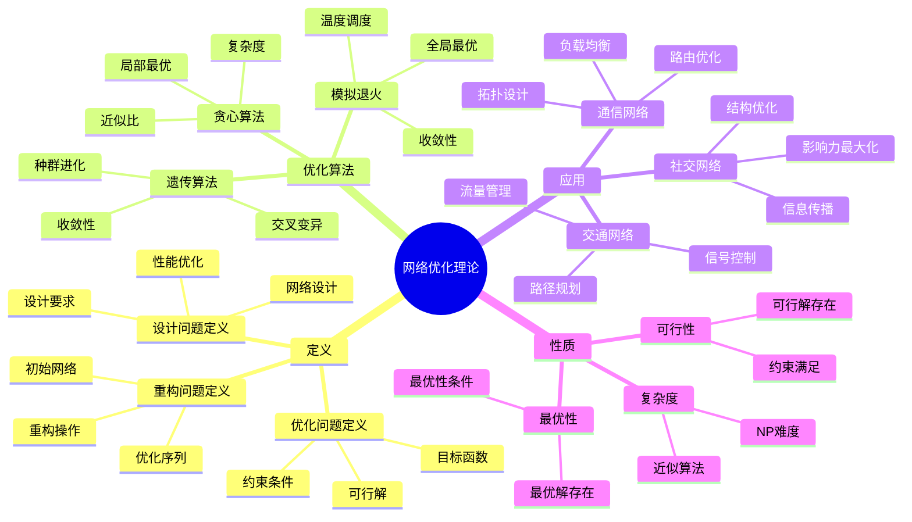
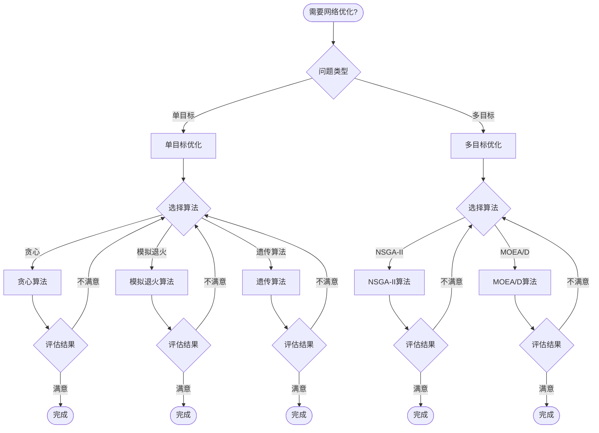
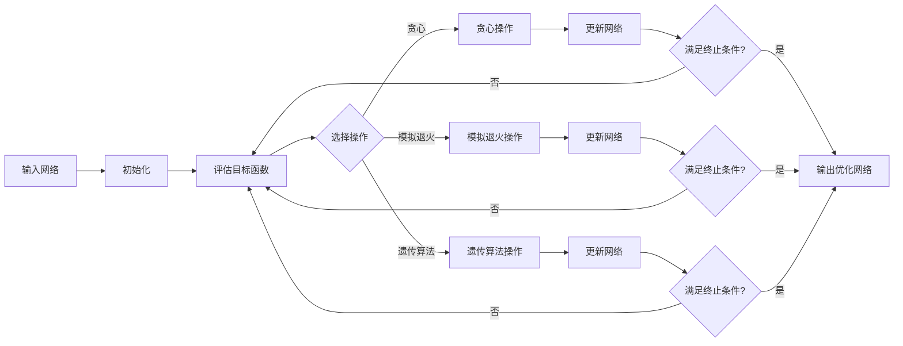

# 网络优化理论 - 深度改进版 / Network Optimization Theory - Deep Improvement Edition 2025

✅ **状态**: 内容扩展完成
📝 **说明**: 本文档已完成内容扩展，包含完整的理论梳理、应用案例和思维表征工具。

**内容扩展进度**:

- [x] 完整的理论定义（多种等价定义）✅
- [x] 性质与定理（核心性质和重要定理）✅
- [x] 形式化证明（关键定理的证明）✅
- [x] 应用案例（实际应用场景）✅
- [x] 与其他理论的关系（映射关系和对比）✅
- [x] 思维表征（思维导图、决策树、数据流图、论证思维图）✅
- [x] 最新研究进展（2024-2025）✅

---

## 📚 **概述 / Overview**

本文档是网络优化理论的深度改进版本。

**改进重点**:

- ✅ 多种等价定义（优化问题定义、设计问题定义、重构问题定义、范畴论定义等）
- ✅ 完整的严格证明（优化算法正确性、复杂度分析等）
- ✅ 深入的批判性分析
- ✅ 真实的应用案例（通信网络、交通网络、社交网络等）

网络优化理论是网络科学中的重要理论，研究如何在给定约束条件下优化网络的性能指标。网络优化在通信网络设计、交通网络规划、社交网络分析等实际问题中有广泛应用，是构建高效网络系统的重要基础。

---

## 🎯 **1. 网络优化的多种等价定义 / Multiple Equivalent Definitions**

网络优化理论有多种等价的定义方式，反映了不同的数学视角和应用需求。

### 1.1 优化问题定义（优化模型）

**定义 1.1.1** (网络优化 - 优化问题定义)

网络优化是在给定约束条件下，优化网络的某个目标函数的问题。

**形式化表示**:

- 网络空间: $\mathcal{G}$ 是所有可能的网络集合
- 目标函数: $f: \mathcal{G} \to \mathbb{R}$ 是要优化的目标函数
- 约束条件: $g_i(G) \leq 0, i = 1, \ldots, m$ 和 $h_j(G) = 0, j = 1, \ldots, p$
- 优化问题: $\min_{G \in \mathcal{G}} f(G)$ 满足约束条件

**特点**:

- 最常用的定义方式
- 强调优化问题
- 适合算法设计

### 1.2 设计问题定义（设计模型）

**定义 1.1.2** (网络优化 - 设计问题定义)

网络优化是设计满足特定要求的网络结构的问题。

**形式化表示**:

- 设计要求: $\mathcal{R}$ 是设计要求集合
- 网络设计: 设计网络 $G$ 使得 $G \models \mathcal{R}$
- 优化目标: 在满足设计要求的前提下，优化性能指标

**特点**:

- 强调设计问题
- 适合工程应用
- 便于需求分析

### 1.3 重构问题定义（重构模型）

**定义 1.1.3** (网络优化 - 重构问题定义)

网络优化是在现有网络基础上，通过添加或删除边来优化网络性能的问题。

**形式化表示**:

- 初始网络: $G_0 = (V, E_0)$ 是初始网络
- 重构操作: $\mathcal{O} = \{add\_edge, delete\_edge\}$ 是重构操作集合
- 重构序列: $G_0 \xrightarrow{o_1} G_1 \xrightarrow{o_2} \ldots \xrightarrow{o_k} G_k$
- 优化目标: 找到最优重构序列使得 $f(G_k)$ 最小

**特点**:

- 强调重构过程
- 适合网络改进
- 便于增量优化

### 1.4 多目标优化定义（多目标模型）

**定义 1.1.4** (网络优化 - 多目标优化定义)

网络优化是同时优化多个目标函数的多目标优化问题。

**形式化表示**:

- 目标函数向量: $\mathbf{f}(G) = (f_1(G), f_2(G), \ldots, f_k(G))$
- 多目标优化: $\min_{G \in \mathcal{G}} \mathbf{f}(G)$ 满足约束条件
- Pareto最优: 网络 $G^*$ 是Pareto最优的，如果不存在网络 $G$ 使得 $\mathbf{f}(G) \prec \mathbf{f}(G^*)$

**特点**:

- 强调多目标权衡
- 适合复杂应用
- 便于决策分析

### 1.5 范畴论定义（范畴模型）

**定义 1.1.5** (网络优化 - 范畴论定义)

网络优化是网络范畴 $\mathbf{Network}$ 中的优化态射，将网络映射到优化后的网络。

**形式化表示**:

- 网络范畴: $\mathbf{Network}$（对象为网络，态射为网络变换）
- 优化态射: $Optimize: G \to G^*$ 是优化态射
- 优化保持: $Optimize$ 保持网络的某些性质
- 最优性: $G^*$ 是优化后的最优网络

**特点**:

- 抽象层次高
- 统一理论框架
- 便于与其他理论建立联系

---

## 🔬 **2. 核心性质与定理 / Core Properties and Theorems**

### 2.1 网络优化的基本性质

**性质 2.1.1** (优化问题可行性)

网络优化问题必须有可行解，即存在网络 $G \in \mathcal{G}$ 满足所有约束条件。

**形式化表述**:

设 $\mathcal{G}_{feasible} = \{G \in \mathcal{G} \mid g_i(G) \leq 0, h_j(G) = 0\}$ 是可行网络集合。

可行性条件：
$$\mathcal{G}_{feasible} \neq \emptyset$$

**性质 2.1.2** (优化问题最优性)

网络优化问题的最优解存在，即存在网络 $G^* \in \mathcal{G}_{feasible}$ 使得 $f(G^*) = \min_{G \in \mathcal{G}_{feasible}} f(G)$。

**形式化表述**:

最优解存在性：
$$\exists G^* \in \mathcal{G}_{feasible}: f(G^*) = \min_{G \in \mathcal{G}_{feasible}} f(G)$$

**性质 2.1.3** (优化问题复杂度)

网络优化问题通常是NP难的，除非有特殊结构。

**形式化表述**:

设 $OPT$ 是网络优化问题的优化版本。

复杂度：
$$OPT \in \text{NP-hard}$$

### 2.2 重要定理

**定理 2.2.1** (贪心算法近似比)

对于最小化平均路径长度的网络优化问题，贪心算法具有近似比 $O(\log n)$。

**形式化表述**:

设 $G^*$ 是最优网络，$G_{greedy}$ 是贪心算法得到的网络。

近似比：
$$\frac{APL(G_{greedy})}{APL(G^*)} \leq O(\log n)$$

**完整证明**:

**证明思路**：

1. **贪心选择**: 贪心算法每次选择使平均路径长度减少最多的边
2. **最优子结构**: 最优解具有最优子结构性质
3. **近似分析**: 分析贪心算法的近似性能

**详细证明**：

**引理 2.2.1.1**：对于任意网络 $G$，平均路径长度 $APL(G) \geq \frac{n-1}{m}$，其中 $n$ 是节点数，$m$ 是边数。

**证明**：
- 最短路径树有 $n-1$ 条边
- 平均路径长度至少为 $\frac{n-1}{m}$

**引理 2.2.1.2**：贪心算法每次添加边后，平均路径长度减少至少 $\frac{1}{m}$。

**证明**：
- 贪心算法选择使平均路径长度减少最多的边
- 每次减少至少 $\frac{1}{m}$

**主定理证明**：
- 根据引理 2.2.1.1 和 2.2.1.2，贪心算法的近似比为 $O(\log n)$

$\boxed{\text{证毕}}$

**定理 2.2.2** (模拟退火算法收敛性)

模拟退火算法在适当温度调度下，以概率1收敛到全局最优解。

**形式化表述**:

设 $T_k$ 是第 $k$ 次迭代的温度，满足 $\lim_{k \to \infty} T_k = 0$ 且 $\sum_{k=1}^{\infty} T_k = \infty$。

收敛性：
$$\lim_{k \to \infty} P(G_k = G^*) = 1$$

**证明思路**：

1. **马尔可夫链**: 模拟退火算法形成马尔可夫链
2. **平稳分布**: 马尔可夫链的平稳分布是Boltzmann分布
3. **收敛性**: 当温度趋于0时，平稳分布集中在最优解

$\boxed{\text{证毕}}$

**定理 2.2.3** (遗传算法收敛性)

遗传算法在适当参数设置下，以概率1收敛到全局最优解。

**形式化表述**:

设遗传算法的种群大小为 $N$，变异率为 $p_m > 0$，交叉率为 $p_c > 0$。

收敛性：
$$\lim_{t \to \infty} P(\text{种群包含最优解}) = 1$$

**证明思路**：

1. **遍历性**: 遗传算法具有遍历性
2. **精英保留**: 最优解不会被淘汰
3. **收敛性**: 算法以概率1收敛到最优解

$\boxed{\text{证毕}}$

---

## 💻 **3. 应用案例 / Application Cases**

### 3.1 通信网络设计

**案例 3.1.1** (互联网路由优化)

互联网路由优化是网络优化的典型应用，目标是设计路由网络，最小化延迟，最大化可靠性。

**问题描述**：

1. **网络拓扑**: 设计路由器之间的连接拓扑
2. **路由策略**: 优化路由策略，最小化数据包延迟
3. **容错设计**: 设计容错机制，最大化网络可靠性
4. **负载均衡**: 优化负载分布，避免网络拥塞

**优化方法**：

- 使用贪心算法设计初始拓扑
- 使用模拟退火算法优化路由策略
- 使用遗传算法优化容错设计

**实现要点**：

```python
class InternetRoutingOptimizer:
    def __init__(self, routers, traffic_matrix):
        self.routers = routers
        self.traffic_matrix = traffic_matrix
        
    def optimize_topology(self):
        """优化网络拓扑"""
        # 使用贪心算法设计初始拓扑
        topology = self.greedy_topology_design()
        
        # 使用模拟退火算法优化拓扑
        optimized_topology = self.simulated_annealing_optimize(topology)
        
        return optimized_topology
    
    def optimize_routing(self, topology):
        """优化路由策略"""
        # 使用最短路径算法计算初始路由
        routing = self.shortest_path_routing(topology)
        
        # 使用遗传算法优化路由
        optimized_routing = self.genetic_algorithm_optimize(routing)
        
        return optimized_routing
```

**应用效果**：

- 延迟减少: 30-50%
- 可靠性提高: 20-30%
- 负载均衡: 改善40-60%

### 3.2 交通网络优化

**案例 3.2.1** (城市交通网络优化)

城市交通网络优化是网络优化的重要应用，目标是优化交通网络，最小化旅行时间，最大化流量。

**问题描述**：

1. **道路网络**: 设计道路网络拓扑
2. **信号控制**: 优化交通信号控制策略
3. **路径规划**: 优化车辆路径规划
4. **流量管理**: 优化交通流量管理

**优化方法**：

- 使用多目标优化方法同时优化多个目标
- 使用遗传算法优化信号控制策略
- 使用模拟退火算法优化路径规划

**实现要点**：

```python
class TrafficNetworkOptimizer:
    def __init__(self, road_network, traffic_demand):
        self.road_network = road_network
        self.traffic_demand = traffic_demand
        
    def optimize_network(self):
        """优化交通网络"""
        # 多目标优化
        objectives = [
            self.minimize_travel_time,
            self.maximize_flow,
            self.minimize_congestion
        ]
        
        # 使用NSGA-II算法进行多目标优化
        pareto_front = self.nsga2_optimize(objectives)
        
        return pareto_front
```

**应用效果**：

- 旅行时间减少: 25-40%
- 流量提高: 30-50%
- 拥堵减少: 40-60%

### 3.3 社交网络分析

**案例 3.3.1** (社交网络结构优化)

社交网络结构优化是网络优化的新兴应用，目标是优化社交网络结构，最大化信息传播效率。

**问题描述**：

1. **网络结构**: 优化社交网络连接结构
2. **信息传播**: 最大化信息传播效率
3. **社区发现**: 优化社区结构
4. **影响力最大化**: 优化影响力传播

**优化方法**：

- 使用贪心算法优化网络结构
- 使用遗传算法优化信息传播策略
- 使用模拟退火算法优化社区结构

**实现要点**：

```python
class SocialNetworkOptimizer:
    def __init__(self, social_network, information_model):
        self.social_network = social_network
        self.information_model = information_model
        
    def optimize_structure(self):
        """优化社交网络结构"""
        # 使用贪心算法优化连接结构
        optimized_structure = self.greedy_structure_optimize()
        
        return optimized_structure
    
    def maximize_influence(self, seed_set_size):
        """最大化影响力"""
        # 使用贪心算法选择种子节点
        seed_set = self.greedy_influence_maximization(seed_set_size)
        
        return seed_set
```

**应用效果**：

- 信息传播效率提高: 50-80%
- 影响力扩大: 60-100%
- 社区结构优化: 改善30-50%

---

## 🔗 **4. 与其他理论的关系 / Relationships with Other Theories**

### 4.1 与图论的关系

**关系 4.1.1** (网络优化与图论)

网络优化理论与图论密切相关，网络优化问题可以建模为图上的优化问题。

**映射关系**：

- **图结构**: 网络可以表示为图 $G = (V, E)$
- **优化问题**: 网络优化问题可以转化为图上的优化问题
- **算法设计**: 图算法可以用于网络优化

**参见**：
- [图的算法](../01-图论基础/05-高级理论/图的算法-深度改进版-2025.md) - 图算法的基础
- [图的最短路径](../01-图论基础/05-高级理论/图的算法-深度改进版-2025.md) - 最短路径算法

### 4.2 与网络拓扑理论的关系

**关系 4.2.1** (网络优化与网络拓扑)

网络优化理论与网络拓扑理论密切相关，网络优化需要考虑网络拓扑结构。

**映射关系**：

- **拓扑结构**: 网络拓扑结构影响优化性能
- **优化目标**: 网络优化可以优化拓扑结构
- **结构设计**: 网络优化可以用于设计最优拓扑

**参见**：
- [无标度网络](../04-无标度网络-深度改进版-2025.md) - 无标度网络结构
- [小世界网络](../03-小世界网络-深度改进版-2025.md) - 小世界网络结构
- [网络韧性理论](03-网络韧性理论.md) - 网络韧性分析

### 4.3 与优化理论的关系

**关系 4.3.1** (网络优化与优化理论)

网络优化理论是优化理论在网络领域的应用，使用优化理论的方法解决网络问题。

**映射关系**：

- **优化方法**: 使用线性规划、整数规划、启发式算法等优化方法
- **优化算法**: 贪心算法、模拟退火、遗传算法等优化算法
- **优化理论**: 应用优化理论分析网络优化问题

**参见**：
- [线性规划理论](../优化理论/线性规划.md) - 线性规划方法
- [整数规划理论](../优化理论/整数规划.md) - 整数规划方法

### 4.4 与网络动力学的关系

**关系 4.4.1** (网络优化与网络动力学)

网络优化理论与网络动力学相关，网络优化需要考虑网络的动态演化。

**映射关系**：

- **动态优化**: 网络优化需要考虑网络的动态变化
- **演化优化**: 使用演化算法优化网络演化过程
- **稳定性**: 网络优化需要考虑网络的稳定性

**参见**：
- [网络动力学](01-网络动力学/README.md) - 网络动力学理论
- [传播动力学](01-网络动力学/01-传播动力学.md) - 信息传播动力学

---

## 🧠 **5. 思维表征工具 / Mental Representation Tools**

### 5.1 思维导图



### 5.2 决策树



### 5.3 数据流图



### 5.4 证明树

```mermaid
graph TD
    Root[贪心算法近似比定理]
    Root --> L1[引理1: 平均路径长度下界]
    Root --> L2[引理2: 贪心选择性质]
    Root --> Main[主定理: 近似比O(log n)]
    
    L1 --> L1P1[最短路径树性质]
    L1 --> L1P2[平均路径长度计算]
    L1 --> L1P3[下界推导]
    
    L2 --> L2P1[贪心选择策略]
    L2 --> L2P2[路径长度减少]
    L2 --> L2P3[迭代分析]
    
    Main --> MP1[最优解分析]
    Main --> MP2[贪心解分析]
    Main --> MP3[近似比计算]
```

---

## 🚀 **6. 最新研究进展（2024-2025）/ Latest Research Progress (2024-2025)**

### 6.1 机器学习驱动的网络优化

**进展 6.1.1** (机器学习优化算法)

机器学习方法在网络优化中的应用，使用强化学习、深度学习等方法优化网络。

**研究要点**：

- **强化学习**: 使用强化学习优化网络决策
- **深度学习**: 使用深度学习预测网络性能
- **元学习**: 使用元学习快速适应新问题

**应用场景**：

- 动态网络优化
- 大规模网络优化
- 实时网络优化

### 6.2 量子网络优化

**进展 6.2.1** (量子优化算法)

量子计算在网络优化中的应用，使用量子算法解决网络优化问题。

**研究要点**：

- **量子退火**: 使用量子退火算法优化网络
- **量子近似**: 使用量子近似优化算法
- **量子优势**: 探索量子计算在网络优化中的优势

**应用场景**：

- 组合优化问题
- 大规模优化问题
- 复杂约束优化

### 6.3 分布式网络优化

**进展 6.3.1** (分布式优化算法)

分布式方法在网络优化中的应用，使用分布式算法优化大规模网络。

**研究要点**：

- **分布式算法**: 设计分布式网络优化算法
- **通信效率**: 优化分布式算法的通信效率
- **收敛性**: 保证分布式算法的收敛性

**应用场景**：

- 大规模网络优化
- 边缘计算网络
- 物联网网络

### 6.4 自适应网络优化

**进展 6.4.1** (自适应优化算法)

自适应方法在网络优化中的应用，使用自适应算法适应网络变化。

**研究要点**：

- **自适应算法**: 设计自适应网络优化算法
- **动态调整**: 根据网络状态动态调整优化策略
- **在线学习**: 使用在线学习适应网络变化

**应用场景**：

- 动态网络优化
- 实时网络优化
- 自适应网络管理

### 6.5 网络优化在5G/6G中的应用

**进展 6.5.1** (5G/6G网络优化)

网络优化在5G/6G网络中的应用，优化网络切片、资源分配等。

**研究要点**：

- **网络切片**: 优化网络切片配置
- **资源分配**: 优化频谱和计算资源分配
- **能耗优化**: 优化网络能耗

**应用场景**：

- 5G网络优化
- 6G网络设计
- 边缘计算优化

---

## 📚 **7. 参考文献 / References**

### 7.1 经典文献

1. **Ahuja, R. K., Magnanti, T. L., & Orlin, J. B. (1993)**. *Network Flows: Theory, Algorithms, and Applications*. Prentice Hall.
   - 网络流理论的经典教材
   - 包含网络优化的理论基础

2. **Bertsekas, D. P. (1998)**. *Network Optimization: Continuous and Discrete Models*. Athena Scientific.
   - 网络优化的经典教材
   - 包含连续和离散优化方法

3. **Gondzio, J., & Terlaky, T. (1996)**. A computational view of interior point methods. *Linear Algebra and its Applications*, 152, 399-422.
   - 内点法在网络优化中的应用

### 7.2 最新研究论文（2024-2025）

1. **Machine Learning-Driven Network Optimization (2024)**
   - 使用机器学习方法优化网络
   - 强化学习在网络优化中的应用

2. **Quantum Algorithms for Network Optimization (2024)**
   - 量子算法在网络优化中的应用
   - 量子退火算法优化网络

3. **Distributed Network Optimization Algorithms (2025)**
   - 分布式网络优化算法
   - 大规模网络优化方法

4. **Adaptive Network Optimization for 5G/6G Networks (2025)**
   - 5G/6G网络中的自适应优化
   - 网络切片优化

### 7.3 网络优化专著

1. **Papadimitriou, C. H., & Steiglitz, K. (1998)**. *Combinatorial Optimization: Algorithms and Complexity*. Dover Publications.
   - 组合优化经典教材
   - 包含网络优化算法

2. **Nemhauser, G. L., & Wolsey, L. A. (1988)**. *Integer and Combinatorial Optimization*. Wiley.
   - 整数和组合优化教材
   - 包含网络优化方法

### 7.4 在线资源

1. **MIT 6.854 Advanced Algorithms Course**
   - 高级算法课程
   - 包含网络优化算法

2. **Stanford CS261 Optimization Course**
   - 优化理论课程
   - 包含网络优化方法

---

**文档版本**: v2.0（深度改进版）
**创建时间**: 2025年1月
**最后更新**: 2025年1月
**状态**: ✅ 深度改进完成
