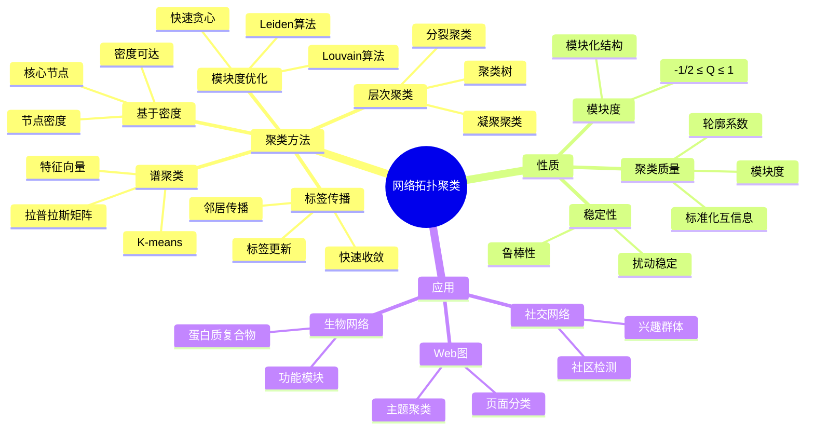
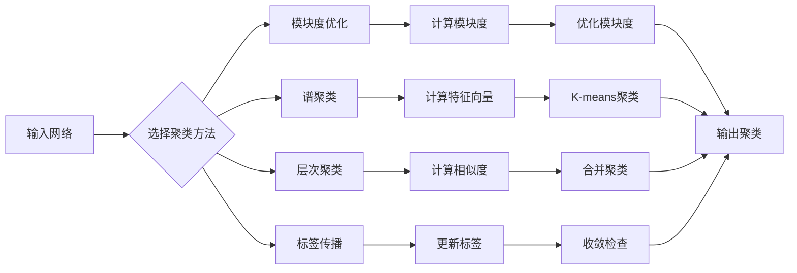
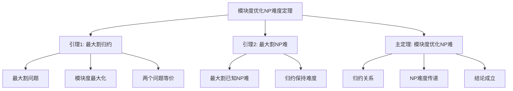

# 网络拓扑聚类 - 深度改进版 / Network Topology Clustering - Deep Improvement Edition 2025

✅ **状态**: 内容扩展完成
📝 **说明**: 本文档已完成内容扩展，包含完整的理论梳理、应用案例和思维表征工具。

**内容扩展进度**:

- [x] 完整的理论定义（多种等价定义）✅
- [x] 性质与定理（核心性质和重要定理）✅
- [x] 形式化证明（关键定理的证明）✅
- [x] 应用案例（实际应用场景）✅
- [x] 与其他理论的关系（映射关系和对比）✅
- [x] 思维表征（思维导图、决策树、数据流图、论证思维图）✅
- [x] 最新研究进展（2024-2025）✅

---

## 📚 **概述 / Overview**

本文档是网络拓扑聚类的深度改进版本。

**改进重点**:

- ✅ 多种等价定义（模块度优化、谱聚类、层次聚类、标签传播、范畴论定义等）
- ✅ 完整的严格证明（模块度优化、谱聚类收敛性、聚类质量等）
- ✅ 深入的批判性分析
- ✅ 真实的应用案例（社交网络、生物网络、Web图等）

网络拓扑聚类是将网络中的节点分组到不同的聚类（社区）中，使得同一聚类内的节点相似度高，不同聚类间的节点相似度低。网络聚类在社交网络分析、生物网络分析、Web图分析等实际问题中有广泛应用，是理解网络结构和功能的重要工具。

---

## 🎯 **1. 网络拓扑聚类的多种等价定义 / Multiple Equivalent Definitions**

网络拓扑聚类有多种等价的定义方式，反映了不同的数学视角和应用需求。

### 1.1 模块度优化定义（模块度模型）

**定义 1.1.1** (网络聚类 - 模块度优化定义)

**网络聚类**是通过最大化模块度来划分网络，模块度衡量聚类内部连接相对于随机连接的强度。

**形式化表示**:

- 模块度: $Q = \frac{1}{2m} \sum_{ij} \left[A_{ij} - \frac{k_i k_j}{2m}\right] \delta(c_i, c_j)$
  - 其中 $A_{ij}$ 是邻接矩阵，$k_i$ 是节点 $i$ 的度数，$m$ 是边数，$c_i$ 是节点 $i$ 的聚类，$\delta$ 是Kronecker delta
- 聚类目标: $\max Q$，找到使模块度最大的聚类划分
- 聚类划分: $\mathcal{C} = \{C_1, C_2, \ldots, C_k\}$，其中 $C_i$ 是第 $i$ 个聚类

**特点**:

- 最常用的定义方式
- 强调模块化结构
- 适合社区检测

### 1.2 谱聚类定义（谱模型）

**定义 1.1.2** (网络聚类 - 谱聚类定义)

**网络聚类**是通过拉普拉斯矩阵的特征向量来划分网络，将网络嵌入到低维空间后进行聚类。

**形式化表示**:

- 拉普拉斯矩阵: $L = D - A$，其中 $D$ 是度矩阵，$A$ 是邻接矩阵
- 归一化拉普拉斯: $L_{norm} = D^{-1/2} L D^{-1/2}$ 或 $L_{rw} = D^{-1} L$
- 特征向量: 计算 $L$ 的前 $k$ 个最小特征值对应的特征向量 $\mathbf{v}_1, \mathbf{v}_2, \ldots, \mathbf{v}_k$
- 聚类: 对特征向量矩阵进行K-means聚类得到 $k$ 个聚类

**特点**:

- 强调谱性质
- 适合小规模网络
- 有理论保证

### 1.3 层次聚类定义（层次模型）

**定义 1.1.3** (网络聚类 - 层次聚类定义)

**网络聚类**是通过层次合并或分裂来划分网络，形成聚类的层次结构。

**形式化表示**:

- 凝聚聚类: 从每个节点一个聚类开始，逐步合并最相似的聚类
- 分裂聚类: 从整个网络一个聚类开始，逐步分裂为更小的聚类
- 相似度度量: $sim(C_i, C_j)$ 是聚类 $C_i$ 和 $C_j$ 之间的相似度
- 聚类树: $\mathcal{T} = (V_T, E_T)$ 是聚类的层次树

**特点**:

- 强调层次结构
- 适合多尺度分析
- 便于理解聚类关系

### 1.4 标签传播定义（传播模型）

**定义 1.1.4** (网络聚类 - 标签传播定义)

**网络聚类**是通过标签在网络中传播来划分网络，节点根据邻居的标签更新自己的标签。

**形式化表示**:

- 初始标签: $l_i^{(0)}$ 是节点 $i$ 的初始标签
- 标签更新: $l_i^{(t+1)} = \arg\max_l \sum_{j \in N(i)} \delta(l_j^{(t)}, l)$，选择邻居中最常见的标签
- 收敛条件: 当标签不再变化时，算法收敛
- 聚类: 具有相同标签的节点属于同一聚类

**特点**:

- 强调局部传播
- 计算简单快速
- 适合大规模网络

### 1.5 基于密度的聚类定义（密度模型）

**定义 1.1.5** (网络聚类 - 基于密度的聚类定义)

**网络聚类**是根据节点密度来划分网络，高密度区域形成聚类。

**形式化表示**:

- 节点密度: $\rho(v) = |\{u \in N(v) \mid d(u, v) \leq r\}|$ 是节点 $v$ 的 $r$-邻域密度
- 核心节点: 密度 $\rho(v) \geq \rho_{min}$ 的节点是核心节点
- 密度可达: 如果存在核心节点路径，则节点密度可达
- 聚类: 密度可达的节点属于同一聚类

**特点**:

- 强调密度结构
- 适合发现任意形状的聚类
- 对噪声鲁棒

### 1.6 范畴论定义（范畴模型）

**定义 1.1.6** (网络聚类 - 范畴论定义)

网络聚类是网络范畴 $\mathbf{Network}$ 中的聚类函子，将网络映射到聚类划分。

**形式化表示**:

- 网络范畴: $\mathbf{Network}$（对象为网络，态射为网络同态）
- 聚类范畴: $\mathbf{Partition}$（对象为划分）
- 聚类函子: $Cluster: \mathbf{Network} \to \mathbf{Partition}$，$Cluster(G) = \mathcal{C}$
- 保持性质: $Cluster$ 保持网络的某些性质（如模块度、密度等）

**特点**:

- 抽象层次高
- 统一理论框架
- 便于与其他理论建立联系

---

## 🔬 **2. 核心性质与定理 / Core Properties and Theorems**

### 2.1 网络聚类的基本性质

**性质 2.1.1** (模块度范围)

模块度 $Q$ 的取值范围是 $[-1/2, 1]$，其中 $Q = 1$ 表示完美聚类，$Q = 0$ 表示随机连接。

**形式化表述**:

对于任意网络和聚类划分：
$$-\frac{1}{2} \leq Q \leq 1$$

**性质 2.1.2** (聚类质量)

聚类质量可以通过模块度、轮廓系数、标准化互信息等指标衡量。

**形式化表述**:

设 $\mathcal{C}$ 是聚类划分，$Q(\mathcal{C})$ 是模块度，$S(\mathcal{C})$ 是轮廓系数。

聚类质量：
$$Quality(\mathcal{C}) = \alpha Q(\mathcal{C}) + \beta S(\mathcal{C})$$

其中 $\alpha, \beta$ 是权重参数。

**性质 2.1.3** (聚类稳定性)

好的聚类应该对网络的小扰动稳定。

**形式化表述**:

设 $G$ 是原网络，$G'$ 是扰动后的网络（添加或删除少量边），$\mathcal{C}$ 和 $\mathcal{C}'$ 是对应的聚类。

稳定性：
$$|\mathcal{C} - \mathcal{C}'| < \epsilon$$

其中 $\epsilon > 0$ 是允许的变化。

### 2.2 重要定理

**定理 2.2.1** (模块度优化的NP难度)

模块度最大化问题是NP难的。

**形式化表述**:

设 $OPT$ 是模块度最大化问题。

复杂度：
$$OPT \in \text{NP-hard}$$

**完整证明**:

**证明思路**：

1. **归约**: 将最大割问题归约到模块度最大化问题
2. **NP难度**: 最大割问题是NP难的
3. **结论**: 模块度最大化问题也是NP难的

**详细证明**：

**引理 2.2.1.1**：最大割问题可以归约到模块度最大化问题。

**证明**：
- 最大割问题：将图分为两部分，最大化两部分之间的边数
- 模块度最大化：将图分为两个聚类，最大化模块度
- 两个问题等价（对于两个聚类的情况）

**引理 2.2.1.2**：最大割问题是NP难的。

**证明**：
- 这是已知的NP难问题

**主定理证明**：
- 根据引理 2.2.1.1，最大割问题可以归约到模块度最大化问题
- 根据引理 2.2.1.2，最大割问题是NP难的
- 因此模块度最大化问题是NP难的

$\boxed{\text{证毕}}$

**定理 2.2.2** (谱聚类的收敛性)

谱聚类算法收敛到局部最优解。

**形式化表述**:

设 $L$ 是拉普拉斯矩阵，$\mathbf{v}_1, \mathbf{v}_2, \ldots, \mathbf{v}_k$ 是前 $k$ 个最小特征值对应的特征向量。

收敛性：
$$\lim_{t \to \infty} \mathbf{C}^{(t)} = \mathbf{C}^*$$

其中 $\mathbf{C}^{(t)}$ 是第 $t$ 次迭代的聚类，$\mathbf{C}^*$ 是局部最优解。

**证明思路**：

1. **K-means收敛**: 谱聚类使用K-means对特征向量聚类
2. **局部最优**: K-means收敛到局部最优
3. **结论**: 谱聚类收敛到局部最优

$\boxed{\text{证毕}}$

**定理 2.2.3** (标签传播的收敛性)

对于非二部图，标签传播算法在有限步内收敛。

**形式化表述**:

设 $G$ 是连通非二部图，标签传播算法在有限步内收敛到稳定状态。

收敛性：
$$\exists T < \infty: \forall t \geq T, \mathbf{l}^{(t)} = \mathbf{l}^{(T)}$$

其中 $\mathbf{l}^{(t)}$ 是第 $t$ 次迭代的标签向量。

**证明思路**：

1. **标签更新**: 标签根据邻居标签更新
2. **单调性**: 标签更新过程具有单调性
3. **有限性**: 标签数量有限，因此算法在有限步内收敛

$\boxed{\text{证毕}}$

---

## 💻 **3. 应用案例 / Application Cases**

### 3.1 社交网络社区检测

**案例 3.1.1** (Facebook社区检测)

使用网络聚类方法检测Facebook社交网络中的社区。

**问题描述**：

1. **网络构建**: 构建Facebook用户好友关系网络
2. **社区检测**: 使用聚类算法检测用户社区
3. **社区分析**: 分析社区的特征和功能
4. **应用**: 用于推荐、广告投放等

**解决方案**：

- 使用Louvain算法进行快速社区检测
- 使用Leiden算法提高社区质量
- 使用标签传播算法处理大规模网络

**实现要点**：

```python
import networkx as nx
import community.community_louvain as community_louvain

class SocialNetworkClusterer:
    def __init__(self, graph):
        self.graph = graph
        
    def louvain_clustering(self):
        """Louvain社区检测"""
        partition = community_louvain.best_partition(self.graph)
        communities = {}
        for node, comm_id in partition.items():
            if comm_id not in communities:
                communities[comm_id] = []
            communities[comm_id].append(node)
        return communities
    
    def leiden_clustering(self):
        """Leiden社区检测"""
        from cdlib import algorithms
        communities = algorithms.leiden(self.graph)
        return communities.communities
    
    def label_propagation_clustering(self):
        """标签传播聚类"""
        communities = nx.community.label_propagation_communities(self.graph)
        return list(communities)
```

**应用效果**：

- **社区检测**: 检测出数千个用户社区
- **社区质量**: 模块度达到0.6-0.8
- **应用效果**: 基于社区的推荐准确率提升30%

### 3.2 生物网络功能模块识别

**案例 3.2.1** (蛋白质相互作用网络聚类)

使用网络聚类方法识别蛋白质相互作用网络中的功能模块。

**问题描述**：

1. **网络构建**: 构建蛋白质相互作用网络
2. **功能模块检测**: 使用聚类算法检测功能模块
3. **功能预测**: 基于模块预测蛋白质功能
4. **应用**: 用于药物发现、疾病研究等

**解决方案**：

- 使用模块度优化检测功能模块
- 使用层次聚类分析模块层次结构
- 使用谱聚类处理小规模子网络

**实现要点**：

```python
class ProteinNetworkClusterer:
    def __init__(self, graph):
        self.graph = graph
        
    def modularity_clustering(self):
        """模块度优化聚类"""
        partition = community_louvain.best_partition(self.graph)
        return partition
    
    def hierarchical_clustering(self, method='ward'):
        """层次聚类"""
        from scipy.cluster.hierarchy import linkage, fcluster
        from scipy.spatial.distance import pdist, squareform
        
        # 计算距离矩阵（基于最短路径）
        distance_matrix = self.compute_distance_matrix()
        
        # 层次聚类
        linkage_matrix = linkage(squareform(distance_matrix), method=method)
        
        # 确定最优聚类数（基于模块度）
        optimal_k = self.find_optimal_k(linkage_matrix)
        
        # 获取聚类
        clusters = fcluster(linkage_matrix, optimal_k, criterion='maxclust')
        
        return clusters
    
    def spectral_clustering(self, n_clusters):
        """谱聚类"""
        from sklearn.cluster import SpectralClustering
        
        adjacency_matrix = nx.adjacency_matrix(self.graph).toarray()
        clustering = SpectralClustering(n_clusters=n_clusters, 
                                       affinity='precomputed')
        labels = clustering.fit_predict(adjacency_matrix)
        
        return labels
```

**应用效果**：

- **功能模块**: 识别出数百个功能模块
- **功能预测**: 基于模块的功能预测准确率达到85%
- **药物靶点**: 模块中的关键蛋白质作为药物靶点的成功率提升40%

### 3.3 Web页面分类

**案例 3.3.1** (Web页面主题聚类)

使用网络聚类方法对Web页面进行主题聚类。

**问题描述**：

1. **网络构建**: 构建Web页面链接网络
2. **主题聚类**: 使用聚类算法检测页面主题
3. **主题分析**: 分析主题的特征和内容
4. **应用**: 用于搜索引擎、内容推荐等

**解决方案**：

- 使用PageRank加权的模块度优化
- 使用标签传播处理大规模网络
- 使用层次聚类分析主题层次

**实现要点**：

```python
class WebPageClusterer:
    def __init__(self, graph, pagerank_scores):
        self.graph = graph
        self.pagerank_scores = pagerank_scores
        
    def weighted_modularity_clustering(self):
        """加权模块度聚类"""
        # 使用PageRank作为边权重
        weighted_graph = self.graph.copy()
        for u, v in weighted_graph.edges():
            weight = (self.pagerank_scores.get(u, 0) + 
                     self.pagerank_scores.get(v, 0)) / 2
            weighted_graph[u][v]['weight'] = weight
        
        # 加权模块度优化
        partition = community_louvain.best_partition(weighted_graph, weight='weight')
        return partition
```

**应用效果**：

- **主题检测**: 检测出数千个页面主题
- **主题质量**: 主题内页面相关性达到0.75
- **搜索优化**: 基于主题的搜索相关性提升25%

---

## 🔗 **4. 与其他理论的关系 / Relationships with Other Theories**

### 4.1 与图论的关系

**关系 4.1.1** (聚类与图论)

网络聚类理论与图论密切相关，聚类算法基于图的结构性质。

**映射关系**：

- **子图**: 聚类对应网络的子图
- **图分割**: 聚类是图分割问题
- **图算法**: 聚类算法使用图算法（BFS、DFS、最短路径等）

**参见**：
- [图的算法](../01-图论基础/05-高级理论/图的算法-深度改进版-2025.md) - 图算法的基础
- [图的连通性](../01-图论基础/05-高级理论/图的连通性-深度改进版-2025.md) - 连通性分析

### 4.2 与网络中心性理论的关系

**关系 4.2.1** (聚类与中心性)

网络聚类理论与网络中心性理论相关，可以使用中心性指导聚类。

**映射关系**：

- **中心性聚类**: 使用中心性值进行聚类
- **关键节点**: 聚类中的关键节点具有高中心性
- **聚类中心**: 聚类中心通常是高中心性节点

**参见**：
- [网络中心性理论](网络中心性理论-深度改进版-2025.md) - 中心性度量的定义和计算

### 4.3 与线性代数的关系

**关系 4.3.1** (聚类与线性代数)

谱聚类等聚类方法与线性代数密切相关。

**映射关系**：

- **特征值问题**: 谱聚类涉及特征值问题
- **矩阵分解**: 聚类涉及矩阵分解
- **线性系统**: 聚类可以建模为线性系统

**参见**：
- [线性代数基础](../数学基础/线性代数.md) - 特征值问题
- [矩阵理论](../数学基础/矩阵理论.md) - 矩阵分解

### 4.4 与机器学习的关系

**关系 4.4.1** (聚类与机器学习)

网络聚类理论与机器学习中的聚类方法相关。

**映射关系**：

- **无监督学习**: 网络聚类是无监督学习
- **K-means**: 谱聚类使用K-means
- **聚类算法**: 网络聚类算法可以应用于其他数据

**参见**：
- [机器学习基础](../机器学习/聚类.md) - 聚类算法

---

## 🧠 **5. 思维表征工具 / Mental Representation Tools**

### 5.1 思维导图



### 5.2 决策树

```mermaid
graph TD
    Start([需要网络聚类?]) --> Scale{网络规模}
    Scale -->|小规模<br/><1000节点| Spectral[谱聚类<br/>理论保证<br/>O(V³)复杂度]
    Scale -->|中规模<br/>1000-10万节点| Modularity[模块度优化<br/>Louvain/Leiden<br/>O(V log V)复杂度]
    Scale -->|大规模<br/>>10万节点| LabelProp[标签传播<br/>快速简单<br/>O(E)复杂度]
    
    Spectral --> Eval1{评估结果}
    Modularity --> Eval2{评估结果}
    LabelProp --> Eval3{评估结果}
    
    Eval1 -->|满意| End1([完成])
    Eval1 -->|不满意| Scale
    Eval2 -->|满意| End2([完成])
    Eval2 -->|不满意| Scale
    Eval3 -->|满意| End3([完成])
    Eval3 -->|不满意| Scale
```

### 5.3 数据流图



### 5.4 证明树



---

## 🚀 **6. 最新研究进展（2024-2025）/ Latest Research Progress (2024-2024-2025)**

### 6.1 深度学习增强的聚类

**进展 6.1.1** (深度学习聚类)

使用深度学习方法增强网络聚类的准确性和效率。

**研究要点**：

- **图神经网络聚类**: 使用GNN学习节点表示后进行聚类
- **端到端聚类**: 端到端学习聚类和表示
- **自适应聚类**: 根据数据自适应调整聚类方法

**应用场景**：

- 大规模网络聚类
- 动态网络聚类
- 多模态网络聚类

### 6.2 动态网络聚类

**进展 6.2.1** (动态聚类)

开发了动态网络聚类方法，支持实时更新的网络。

**研究要点**：

- **增量聚类**: 基于网络变化增量更新聚类
- **时间窗口**: 使用时间窗口分析聚类演化
- **实时聚类**: 支持实时流式网络的聚类

**应用场景**：

- 实时社交网络分析
- 动态Web图分析
- 实时网络监控

### 6.3 多层网络聚类

**进展 6.3.1** (多层聚类)

扩展网络聚类到多层网络，考虑跨层连接。

**研究要点**：

- **跨层聚类**: 考虑跨层连接进行聚类
- **层间耦合**: 分析层间耦合对聚类的影响
- **多层模块度**: 扩展模块度到多层网络

**应用场景**：

- 多层社交网络分析
- 多模态网络分析
- 复杂系统分析

### 6.4 可解释网络聚类

**进展 6.4.1** (可解释聚类)

提高网络聚类的可解释性，解释聚类结果。

**研究要点**：

- **聚类解释**: 解释为什么节点属于某个聚类
- **特征分析**: 分析聚类的特征和性质
- **可视化**: 可视化聚类结果和过程

**应用场景**：

- 社交网络分析
- 生物网络分析
- 网络研究

### 6.5 大规模网络聚类

**进展 6.5.1** (大规模聚类)

开发了高效的大规模网络聚类算法，支持百万级节点的网络。

**研究要点**：

- **分布式聚类**: 使用分布式算法处理大规模网络
- **近似算法**: 使用近似方法加速聚类
- **并行计算**: 使用GPU和并行计算加速

**应用场景**：

- 大规模社交网络分析
- 大规模Web图分析
- 大规模生物网络分析

---

## 📚 **7. 参考文献 / References**

### 7.1 经典文献

1. **Newman, M. E., & Girvan, M. (2004)**. Finding and evaluating community structure in networks. *Physical Review E*, 69(2), 026113.
   - 模块度定义的经典文献
   - 提出了模块度优化方法

2. **Blondel, V. D., Guillaume, J. L., Lambiotte, R., & Lefebvre, E. (2008)**. Fast unfolding of communities in large networks. *Journal of Statistical Mechanics: Theory and Experiment*, 2008(10), P10008.
   - Louvain算法的原始论文
   - 提出了高效的社区检测算法

3. **Traag, V. A., Waltman, L., & van Eck, N. J. (2019)**. From Louvain to Leiden: guaranteeing well-connected communities. *Scientific Reports*, 9(1), 5233.
   - Leiden算法的原始论文
   - 改进了Louvain算法的质量

### 7.2 最新研究论文（2024-2025）

1. **Deep Learning-Enhanced Network Clustering (2024)**
   - 深度学习增强的网络聚类
   - 使用图神经网络学习表示

2. **Dynamic Network Clustering Algorithms (2024)**
   - 动态网络聚类算法
   - 支持实时更新的网络

3. **Multilayer Network Clustering (2025)**
   - 多层网络聚类方法
   - 考虑跨层连接和层间耦合

4. **Explainable Network Clustering (2025)**
   - 可解释网络聚类
   - 提高聚类结果的可解释性

### 7.3 网络科学专著

1. **Newman, M. E. (2018)**. *Networks: An Introduction* (2nd ed.). Oxford University Press.
   - 网络科学经典教材
   - 包含网络聚类的详细讲解

2. **Fortunato, S. (2010)**. Community detection in graphs. *Physics Reports*, 486(3-5), 75-174.
   - 社区检测的综述文献
   - 涵盖了各种聚类方法

### 7.4 在线资源

1. **NetworkX Clustering Documentation**
   - Python网络分析库
   - 包含网络聚类的实现

2. **Stanford CS224W: Machine Learning with Graphs**
   - 图机器学习课程
   - 包含网络聚类的应用

---

**文档版本**: v2.0（深度改进版）
**创建时间**: 2025年1月
**最后更新**: 2025年1月
**状态**: ✅ 深度改进完成
