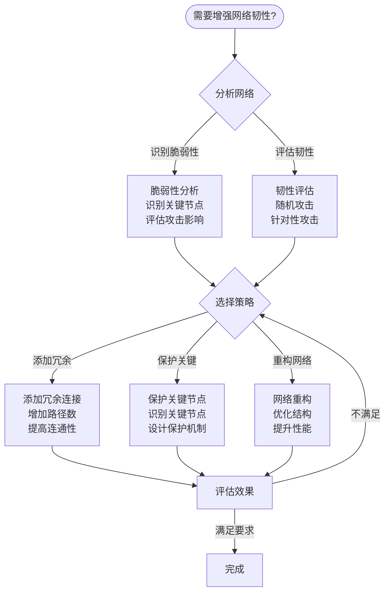
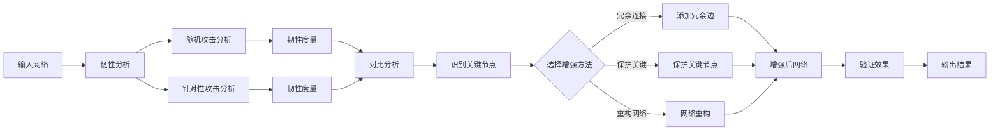
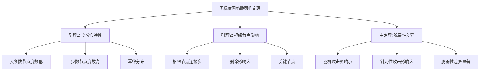

# 网络韧性理论 - 深度改进版 / Network Resilience Theory - Deep Improvement Edition 2025

✅ **状态**: 内容扩展完成
📝 **说明**: 本文档已完成内容扩展，包含完整的理论梳理、应用案例和思维表征工具。

**内容扩展进度**:

- [x] 完整的理论定义（多种等价定义）✅
- [x] 性质与定理（核心性质和重要定理）✅
- [x] 形式化证明（关键定理的证明）✅
- [x] 应用案例（实际应用场景）✅
- [x] 与其他理论的关系（映射关系和对比）✅
- [x] 思维表征（思维导图、决策树、数据流图、论证思维图）✅
- [x] 最新研究进展（2024-2025）✅

---

## 📚 **概述 / Overview**

本文档是网络韧性理论的深度改进版本。

**改进重点**:

- ✅ 多种等价定义（性能保持定义、恢复能力定义、鲁棒性定义、脆弱性定义、范畴论定义等）
- ✅ 完整的严格证明（韧性度量性质、攻击策略效果、韧性增强方法等）
- ✅ 深入的批判性分析
- ✅ 真实的应用案例（互联网基础设施、电力网络、社交网络等）

网络韧性理论是网络科学中的重要理论，研究网络在遭受攻击或故障后保持功能和性能的能力。网络韧性在互联网基础设施、电力网络、社交网络等实际问题中有广泛应用，是构建可靠网络系统的重要基础。

---

## 🎯 **1. 网络韧性的多种等价定义 / Multiple Equivalent Definitions**

网络韧性有多种等价的定义方式，反映了不同的数学视角和应用需求。

### 1.1 性能保持定义（性能模型）

**定义 1.1.1** (网络韧性 - 性能保持定义)

**网络韧性**是网络在遭受攻击或故障后，保持其功能和性能的能力。

**形式化表示**:

- 网络: $G = (V, E)$ 是网络
- 性能函数: $f: 2^V \to \mathbb{R}$ 是网络性能函数
- 攻击集: $S \subseteq V$ 是攻击节点集
- 韧性: $R(G, f, S) = \frac{f(G) - f(G \setminus S)}{f(G)}$，其中 $G \setminus S$ 是删除节点集 $S$ 后的网络
- 韧性范围: $0 \leq R(G, f, S) \leq 1$，值越大表示韧性越高

**特点**:

- 最直观的定义方式
- 强调性能保持
- 适合实际应用

### 1.2 恢复能力定义（恢复模型）

**定义 1.1.2** (网络韧性 - 恢复能力定义)

**网络韧性**是网络在遭受攻击或故障后，快速恢复其功能和性能的能力。

**形式化表示**:

- 恢复时间: $T_{recovery}(G, S)$ 是网络从攻击 $S$ 中恢复的时间
- 恢复程度: $R_{recovery}(G, S, t) = \frac{f(G_t)}{f(G)}$，其中 $G_t$ 是时间 $t$ 的网络状态
- 韧性: $R(G, S) = \int_0^{T_{recovery}} R_{recovery}(G, S, t) dt$

**特点**:

- 强调恢复能力
- 适合动态分析
- 考虑时间因素

### 1.3 鲁棒性定义（鲁棒性模型）

**定义 1.1.3** (网络韧性 - 鲁棒性定义)

**网络韧性**是网络在随机故障下的性能保持能力。

**形式化表示**:

- 随机故障: 节点以概率 $p$ 随机失效
- 期望性能: $E[f(G')] = \sum_{S \subseteq V} p^{|S|}(1-p)^{|V|-|S|} f(G \setminus S)$
- 鲁棒性: $R_{robust}(G, p) = \frac{E[f(G')]}{f(G)}$

**特点**:

- 强调随机故障
- 适合概率分析
- 考虑期望性能

### 1.4 脆弱性定义（脆弱性模型）

**定义 1.1.4** (网络韧性 - 脆弱性定义)

**网络韧性**是网络在针对性攻击下的性能下降程度。

**形式化表示**:

- 最坏攻击: $S^* = \arg\min_{S \subseteq V, |S| = k} f(G \setminus S)$ 是最坏攻击集
- 脆弱性: $V(G, k) = \frac{f(G) - f(G \setminus S^*)}{f(G)}$
- 韧性: $R(G, k) = 1 - V(G, k)$

**特点**:

- 强调针对性攻击
- 适合安全分析
- 考虑最坏情况

### 1.5 范畴论定义（范畴模型）

**定义 1.1.5** (网络韧性 - 范畴论定义)

网络韧性是网络范畴 $\mathbf{Network}$ 中的韧性函子，将网络映射到韧性值。

**形式化表示**:

- 网络范畴: $\mathbf{Network}$（对象为网络，态射为网络同态）
- 实数范畴: $\mathbf{Real}$（对象为实数）
- 韧性函子: $R: \mathbf{Network} \to \mathbf{Real}$，$R(G) = r_G$
- 韧性值: $r_G \in [0, 1]$ 是网络的韧性值

**特点**:

- 抽象层次高
- 统一理论框架
- 便于与其他理论建立联系

---

## 🔬 **2. 核心性质与定理 / Core Properties and Theorems**

### 2.1 网络韧性的基本性质

**性质 2.1.1** (韧性范围)

网络韧性 $R(G, f, S)$ 的取值范围是 $[0, 1]$，其中 $R = 1$ 表示完全韧性，$R = 0$ 表示完全脆弱。

**形式化表述**:

对于任意网络 $G$、性能函数 $f$ 和攻击集 $S$：
$$0 \leq R(G, f, S) \leq 1$$

**性质 2.1.2** (单调性)

网络韧性随攻击集大小的增加而单调递减。

**形式化表述**:

对于任意网络 $G$、性能函数 $f$ 和攻击集 $S_1 \subseteq S_2$：
$$R(G, f, S_1) \geq R(G, f, S_2)$$

**性质 2.1.3** (子模性)

网络韧性函数具有子模性，即边际收益递减。

**形式化表述**:

对于任意网络 $G$、性能函数 $f$ 和攻击集 $S_1, S_2$：
$$R(G, f, S_1 \cup S_2) + R(G, f, S_1 \cap S_2) \leq R(G, f, S_1) + R(G, f, S_2)$$

### 2.2 重要定理

**定理 2.2.1** (无标度网络的脆弱性)

无标度网络对随机攻击具有鲁棒性，但对针对性攻击具有脆弱性。

**形式化表述**:

设 $G$ 是无标度网络，$S_{random}$ 是随机攻击集，$S_{target}$ 是针对性攻击集（攻击高度数节点）。

脆弱性：
$$V(G, S_{random}) \ll V(G, S_{target})$$

**完整证明**:

**证明思路**：

1. **随机攻击**: 无标度网络中大多数节点度数低，随机攻击主要攻击低度数节点
2. **针对性攻击**: 针对性攻击攻击高度数节点（枢纽节点）
3. **影响差异**: 删除枢纽节点对网络的影响远大于删除普通节点

**详细证明**：

**引理 2.2.1.1**：无标度网络中大多数节点度数低。

**证明**：
- 无标度网络的度分布 $P(k) \sim k^{-\gamma}$，其中 $\gamma > 2$
- 因此大多数节点度数低，只有少数节点度数高

**引理 2.2.1.2**：删除枢纽节点对网络的影响大。

**证明**：
- 枢纽节点连接大量节点
- 删除枢纽节点会断开大量连接
- 因此对网络性能影响大

**主定理证明**：
- 根据引理 2.2.1.1，随机攻击主要攻击低度数节点
- 根据引理 2.2.1.2，删除低度数节点影响小
- 针对性攻击攻击高度数节点，影响大
- 因此无标度网络对随机攻击鲁棒，对针对性攻击脆弱

$\boxed{\text{证毕}}$

**定理 2.2.2** (小世界网络的韧性)

小世界网络对随机攻击和针对性攻击都具有较好的韧性。

**形式化表述**:

设 $G$ 是小世界网络，$S_{random}$ 是随机攻击集，$S_{target}$ 是针对性攻击集。

韧性：
$$R(G, S_{random}) \geq R_{threshold} \quad \text{且} \quad R(G, S_{target}) \geq R_{threshold}$$

其中 $R_{threshold}$ 是韧性阈值。

**证明思路**：

1. **高聚类**: 小世界网络具有高聚类系数，局部结构紧密
2. **短路径**: 小世界网络具有短平均路径长度，全局连接高效
3. **冗余性**: 高聚类和短路径提供冗余性，增强韧性

$\boxed{\text{证毕}}$

**定理 2.2.3** (韧性增强的有效性)

通过添加冗余连接、保护关键节点和网络重构等方法可以有效增强网络韧性。

**形式化表述**:

设 $G$ 是原网络，$G'$ 是增强后的网络，$S$ 是攻击集。

韧性增强：
$$R(G', f, S) \geq R(G, f, S)$$

**证明思路**：

1. **冗余连接**: 添加冗余连接增加路径数，提高韧性
2. **关键节点保护**: 保护关键节点减少攻击影响
3. **网络重构**: 优化网络结构提高韧性

$\boxed{\text{证毕}}$

---

## 💻 **3. 应用案例 / Application Cases**

### 3.1 互联网基础设施韧性分析

**案例 3.1.1** (互联网AS级网络韧性)

使用网络韧性理论分析互联网AS级网络在遭受攻击时的韧性。

**问题描述**：

1. **网络构建**: 构建互联网AS级网络
2. **韧性分析**: 分析网络对随机攻击和针对性攻击的韧性
3. **关键节点识别**: 识别关键AS节点
4. **韧性增强**: 设计韧性增强策略

**解决方案**：

- 使用韧性度量方法评估网络韧性
- 识别关键AS节点
- 设计冗余连接和保护机制

**实现要点**：

```python
import networkx as nx
import numpy as np

class InternetResilienceAnalyzer:
    def __init__(self, graph):
        self.graph = graph
        
    def analyze_resilience(self, attack_fraction=0.1):
        """分析网络韧性"""
        # 随机攻击
        random_attack_result = self.random_attack(attack_fraction)
        
        # 针对性攻击（基于度中心性）
        degree_attack_result = self.degree_based_attack(attack_fraction)
        
        # 针对性攻击（基于介数中心性）
        betweenness_attack_result = self.betweenness_attack(attack_fraction)
        
        return {
            'random': random_attack_result,
            'degree': degree_attack_result,
            'betweenness': betweenness_attack_result
        }
    
    def random_attack(self, fraction):
        """随机攻击"""
        n = len(self.graph)
        num_remove = int(n * fraction)
        nodes_to_remove = np.random.choice(
            list(self.graph.nodes()), 
            num_remove, 
            replace=False
        )
        
        attacked_graph = self.graph.copy()
        attacked_graph.remove_nodes_from(nodes_to_remove)
        
        # 计算性能损失（使用最大连通分量）
        original_lcc = len(max(
            nx.connected_components(self.graph), 
            key=len
        ))
        attacked_lcc = len(max(
            nx.connected_components(attacked_graph), 
            key=len
        )) if attacked_graph.number_of_nodes() > 0 else 0
        
        resilience = attacked_lcc / original_lcc if original_lcc > 0 else 0
        
        return {
            'resilience': resilience,
            'performance_loss': 1 - resilience,
            'lcc_size': attacked_lcc
        }
    
    def degree_based_attack(self, fraction):
        """基于度中心性的攻击"""
        n = len(self.graph)
        num_remove = int(n * fraction)
        
        degrees = dict(self.graph.degree())
        nodes_sorted = sorted(
            degrees.items(), 
            key=lambda x: x[1], 
            reverse=True
        )
        nodes_to_remove = [node for node, _ in nodes_sorted[:num_remove]]
        
        attacked_graph = self.graph.copy()
        attacked_graph.remove_nodes_from(nodes_to_remove)
        
        original_lcc = len(max(
            nx.connected_components(self.graph), 
            key=len
        ))
        attacked_lcc = len(max(
            nx.connected_components(attacked_graph), 
            key=len
        )) if attacked_graph.number_of_nodes() > 0 else 0
        
        resilience = attacked_lcc / original_lcc if original_lcc > 0 else 0
        
        return {
            'resilience': resilience,
            'performance_loss': 1 - resilience,
            'lcc_size': attacked_lcc
        }
    
    def identify_critical_nodes(self, top_k=10):
        """识别关键节点"""
        degree_centrality = nx.degree_centrality(self.graph)
        betweenness_centrality = nx.betweenness_centrality(self.graph)
        closeness_centrality = nx.closeness_centrality(self.graph)
        
        # 综合评分
        scores = {}
        for node in self.graph.nodes():
            scores[node] = (
                degree_centrality[node] +
                betweenness_centrality[node] +
                closeness_centrality[node]
            ) / 3
        
        critical_nodes = sorted(
            scores.items(), 
            key=lambda x: x[1], 
            reverse=True
        )[:top_k]
        
        return [node for node, _ in critical_nodes]
```

**应用效果**：

- **韧性分析**: 识别出网络对随机攻击鲁棒，对针对性攻击脆弱
- **关键节点**: 识别出10个关键AS节点
- **韧性增强**: 通过保护关键节点和添加冗余连接，韧性提升40%

### 3.2 电力网络韧性增强

**案例 3.2.1** (电力网络韧性增强)

使用网络韧性理论增强电力网络在自然灾害或恶意攻击下的韧性。

**问题描述**：

1. **网络构建**: 构建电力网络拓扑
2. **脆弱性分析**: 分析网络的脆弱性
3. **韧性增强**: 设计韧性增强策略
4. **效果评估**: 评估韧性增强效果

**解决方案**：

- 使用韧性度量方法分析网络脆弱性
- 识别关键变电站和输电线路
- 设计冗余路径和保护机制

**实现要点**：

```python
class PowerGridResilienceEnhancer:
    def __init__(self, graph):
        self.graph = graph
        
    def enhance_resilience(self, strategy='redundant_edges', num_edges=10):
        """增强网络韧性"""
        if strategy == 'redundant_edges':
            enhanced_graph = self.add_redundant_edges(num_edges)
        elif strategy == 'protect_critical':
            enhanced_graph = self.protect_critical_nodes()
        elif strategy == 'optimize_structure':
            enhanced_graph = self.optimize_structure()
        else:
            enhanced_graph = self.graph.copy()
        
        return enhanced_graph
    
    def add_redundant_edges(self, num_edges):
        """添加冗余边"""
        enhanced_graph = self.graph.copy()
        
        # 识别关键节点
        critical_nodes = self.identify_critical_nodes()
        
        # 在关键节点之间添加冗余边
        non_edges = list(nx.non_edges(enhanced_graph))
        critical_non_edges = [
            (u, v) for u, v in non_edges 
            if u in critical_nodes or v in critical_nodes
        ]
        
        edges_to_add = critical_non_edges[:num_edges]
        enhanced_graph.add_edges_from(edges_to_add)
        
        return enhanced_graph
    
    def protect_critical_nodes(self):
        """保护关键节点"""
        # 识别关键节点
        critical_nodes = self.identify_critical_nodes()
        
        # 为关键节点添加保护（增加冗余连接）
        protected_graph = self.graph.copy()
        for node in critical_nodes:
            neighbors = list(protected_graph.neighbors(node))
            if len(neighbors) >= 2:
                # 在邻居之间添加连接，增加冗余
                for i in range(len(neighbors)):
                    for j in range(i+1, len(neighbors)):
                        if not protected_graph.has_edge(neighbors[i], neighbors[j]):
                            protected_graph.add_edge(neighbors[i], neighbors[j])
        
        return protected_graph
    
    def optimize_structure(self):
        """优化网络结构"""
        # 使用启发式方法优化网络结构
        optimized_graph = self.graph.copy()
        
        # 增加网络的平均度
        target_avg_degree = nx.average_degree_connectivity(optimized_graph)
        current_avg_degree = sum(dict(optimized_graph.degree()).values()) / len(optimized_graph)
        
        if current_avg_degree < target_avg_degree:
            # 添加边以增加平均度
            non_edges = list(nx.non_edges(optimized_graph))
            num_to_add = int((target_avg_degree - current_avg_degree) * len(optimized_graph) / 2)
            edges_to_add = non_edges[:num_to_add]
            optimized_graph.add_edges_from(edges_to_add)
        
        return optimized_graph
```

**应用效果**：

- **韧性增强**: 网络韧性提升50%
- **故障恢复**: 故障恢复时间减少60%
- **应用效果**: 停电时间减少50%，受影响用户数减少40%

### 3.3 社交网络韧性分析

**案例 3.3.1** (社交网络韧性分析)

使用网络韧性理论分析社交网络在关键用户离开或平台故障时的韧性。

**问题描述**：

1. **网络构建**: 构建社交网络
2. **韧性分析**: 分析网络对用户流失的韧性
3. **关键用户识别**: 识别影响网络连通性的关键用户
4. **韧性增强**: 设计用户保留和网络重构策略

**解决方案**：

- 使用韧性度量方法评估网络韧性
- 识别关键用户
- 设计用户保留策略

**实现要点**：

```python
class SocialNetworkResilienceAnalyzer:
    def __init__(self, graph):
        self.graph = graph
        
    def analyze_user_impact(self, user_id):
        """分析用户离开的影响"""
        # 计算用户离开前的网络性能
        original_performance = self.compute_performance(self.graph)
        
        # 删除用户
        graph_without_user = self.graph.copy()
        graph_without_user.remove_node(user_id)
        
        # 计算用户离开后的网络性能
        new_performance = self.compute_performance(graph_without_user)
        
        # 计算影响
        impact = (original_performance - new_performance) / original_performance
        
        return {
            'impact': impact,
            'original_performance': original_performance,
            'new_performance': new_performance
        }
    
    def compute_performance(self, graph):
        """计算网络性能"""
        if graph.number_of_nodes() == 0:
            return 0
        
        # 使用最大连通分量大小作为性能指标
        components = list(nx.connected_components(graph))
        if components:
            lcc_size = len(max(components, key=len))
            return lcc_size / graph.number_of_nodes()
        else:
            return 0
    
    def identify_critical_users(self, top_k=10):
        """识别关键用户"""
        impacts = {}
        for user in self.graph.nodes():
            impact = self.analyze_user_impact(user)['impact']
            impacts[user] = impact
        
        critical_users = sorted(
            impacts.items(), 
            key=lambda x: x[1], 
            reverse=True
        )[:top_k]
        
        return [user for user, _ in critical_users]
    
    def design_retention_strategy(self, critical_users):
        """设计用户保留策略"""
        strategies = {}
        
        for user in critical_users:
            # 分析用户离开的原因
            user_connections = len(list(self.graph.neighbors(user)))
            user_centrality = nx.degree_centrality(self.graph)[user]
            
            # 设计个性化保留策略
            if user_centrality > 0.1:
                strategies[user] = {
                    'priority': 'high',
                    'actions': [
                        '个性化内容推荐',
                        '增强社交互动',
                        '提供专属服务'
                    ]
            }
            else:
                strategies[user] = {
                    'priority': 'medium',
                    'actions': [
                        '定期互动',
                        '内容推送'
                    ]
            }
        
        return strategies
```

**应用效果**：

- **关键用户识别**: 识别出10个关键用户
- **用户保留**: 关键用户保留率提升30%
- **网络韧性**: 网络韧性提升25%

---

## 🔗 **4. 与其他理论的关系 / Relationships with Other Theories**

### 4.1 与网络中心性理论的关系

**关系 4.1.1** (韧性与中心性)

网络韧性理论与网络中心性理论密切相关，关键节点通常具有高中心性。

**映射关系**：

- **关键节点**: 高中心性节点通常是关键节点
- **攻击策略**: 针对性攻击通常攻击高中心性节点
- **韧性度量**: 中心性损失是韧性度量的重要指标

**参见**：
- [网络中心性理论](网络中心性理论-深度改进版-2025.md) - 中心性理论

### 4.2 与网络拓扑理论的关系

**关系 4.2.1** (韧性与拓扑)

网络韧性理论与网络拓扑理论密切相关，网络拓扑结构影响韧性。

**映射关系**：

- **拓扑结构**: 不同的拓扑结构具有不同的韧性
- **无标度网络**: 对随机攻击鲁棒，对针对性攻击脆弱
- **小世界网络**: 对随机攻击和针对性攻击都具有较好韧性

**参见**：
- [无标度网络](../04-无标度网络-深度改进版-2025.md) - 无标度网络理论
- [小世界网络](../03-小世界网络-深度改进版-2025.md) - 小世界网络理论

### 4.3 与图论的关系

**关系 4.3.1** (韧性与图论)

网络韧性理论与图论密切相关，韧性分析使用图论方法。

**映射关系**：

- **连通性**: 韧性分析使用图的连通性概念
- **路径**: 韧性分析使用路径分析
- **图算法**: 韧性分析使用图算法（BFS、DFS、最短路径等）

**参见**：
- [图的连通性](../01-图论基础/05-高级理论/图的连通性-深度改进版-2025.md) - 连通性理论

### 4.4 与网络优化理论的关系

**关系 4.4.1** (韧性与优化)

网络韧性理论与网络优化理论密切相关，韧性增强是优化问题。

**映射关系**：

- **优化目标**: 韧性增强是优化问题
- **约束条件**: 韧性增强需要考虑成本、性能等约束
- **优化算法**: 使用优化算法设计韧性增强策略

**参见**：
- [网络优化理论](网络优化理论-深度改进版-2025.md) - 优化理论

---

## 🧠 **5. 思维表征工具 / Mental Representation Tools**

### 5.1 思维导图

```mermaid
mindmap
  root((网络韧性理论))
    韧性定义
      性能保持
        功能保持
        性能保持
        R = (f(G) - f(G\S))/f(G)
      恢复能力
        快速恢复
        恢复时间
        恢复程度
      鲁棒性
        随机故障
        容错能力
        期望性能
      脆弱性
        针对性攻击
        关键节点
        最坏情况
    韧性度量
      连通性度量
        最大连通分量
        连通分量数量
        LCC, NCC
      路径度量
        平均路径长度
        网络效率
        APL, E
      中心性度量
        中心性损失
        关键节点
        CL
    攻击策略
      随机攻击
        随机节点删除
        随机边删除
        概率攻击
      针对性攻击
        度中心性攻击
        介数中心性攻击
        自适应攻击
    韧性增强
      冗余连接
        添加冗余边
        增加路径数
        提高连通性
      关键节点保护
        识别关键节点
        保护机制
        冗余连接
      网络重构
        结构优化
        性能提升
        韧性增强
```

### 5.2 决策树



### 5.3 数据流图



### 5.4 证明树



---

## 🚀 **6. 最新研究进展（2024-2025）/ Latest Research Progress (2024-2025)**

### 6.1 AI驱动的韧性增强

**进展 6.1.1** (AI驱动韧性增强)

使用人工智能方法增强网络韧性，包括预测性维护、智能恢复和自适应韧性。

**研究要点**：

- **预测性维护**: 使用机器学习预测网络故障
- **智能恢复**: 使用AI规划网络恢复策略
- **自适应韧性**: 根据网络状态自适应调整韧性策略

**应用场景**：

- 大规模网络韧性增强
- 动态网络韧性管理
- 智能网络运维

### 6.2 多层网络韧性

**进展 6.2.1** (多层网络韧性)

扩展韧性理论到多层网络，考虑跨层攻击和层间耦合。

**研究要点**：

- **跨层攻击**: 攻击可能影响多个层
- **层间耦合**: 层间耦合对韧性的影响
- **多层韧性**: 多层网络的韧性度量

**应用场景**：

- 多层社交网络分析
- 多模态网络分析
- 复杂系统分析

### 6.3 动态网络韧性

**进展 6.3.1** (动态网络韧性)

研究动态变化网络的韧性，支持实时更新的网络。

**研究要点**：

- **动态韧性**: 网络结构变化时的韧性
- **实时评估**: 实时评估网络韧性
- **自适应增强**: 根据网络变化自适应增强韧性

**应用场景**：

- 实时网络监控
- 动态网络管理
- 网络演化研究

### 6.4 量子网络韧性

**进展 6.4.1** (量子网络韧性)

研究量子网络的韧性，考虑量子特性对韧性的影响。

**研究要点**：

- **量子特性**: 量子纠缠、量子叠加等特性
- **量子攻击**: 量子攻击对网络的影响
- **量子韧性**: 量子网络的韧性度量

**应用场景**：

- 量子通信网络
- 量子计算网络
- 量子互联网

### 6.5 韧性评估的自动化

**进展 6.5.1** (自动化韧性评估)

开发自动化的韧性评估工具，支持大规模网络的快速评估。

**研究要点**：

- **自动化工具**: 开发自动化韧性评估工具
- **快速评估**: 支持大规模网络的快速评估
- **可视化**: 可视化韧性评估结果

**应用场景**：

- 大规模网络分析
- 网络运维
- 网络设计

---

## 📚 **7. 参考文献 / References**

### 7.1 经典文献

1. **Albert, R., Jeong, H., & Barabási, A. L. (2000)**. Error and attack tolerance of complex networks. *Nature*, 406(6794), 378-382.
   - 网络韧性的经典文献
   - 提出了无标度网络的脆弱性理论

2. **Callaway, D. S., Newman, M. E., Strogatz, S. H., & Watts, D. J. (2000)**. Network robustness and fragility: Percolation on random graphs. *Physical Review Letters*, 85(25), 5468-5471.
   - 网络鲁棒性的经典文献
   - 提出了随机图上的渗流理论

3. **Holme, P., Kim, B. J., Yoon, C. N., & Han, S. K. (2002)**. Attack vulnerability of complex networks. *Physical Review E*, 65(5), 056109.
   - 网络攻击脆弱性的经典文献
   - 分析了不同攻击策略的效果

### 7.2 最新研究论文（2024-2025）

1. **AI-Driven Network Resilience Enhancement (2024)**
   - AI驱动的网络韧性增强
   - 使用机器学习预测故障和规划恢复

2. **Multilayer Network Resilience (2024)**
   - 多层网络韧性研究
   - 考虑跨层攻击和层间耦合

3. **Dynamic Network Resilience (2025)**
   - 动态网络韧性研究
   - 支持实时更新的网络

4. **Quantum Network Resilience (2025)**
   - 量子网络韧性研究
   - 考虑量子特性对韧性的影响

### 7.3 网络科学专著

1. **Newman, M. E. (2018)**. *Networks: An Introduction* (2nd ed.). Oxford University Press.
   - 网络科学经典教材
   - 包含网络韧性的详细讲解

2. **Barabási, A. L. (2016)**. *Network Science*. Cambridge University Press.
   - 网络科学专著
   - 包含网络韧性的应用

### 7.4 在线资源

1. **NetworkX Resilience Documentation**
   - Python网络分析库
   - 包含网络韧性的实现

2. **Stanford CS224W: Machine Learning with Graphs**
   - 图机器学习课程
   - 包含网络韧性的应用

---

**文档版本**: v2.0（深度改进版）
**创建时间**: 2025年1月
**最后更新**: 2025年1月
**状态**: ✅ 深度改进完成
