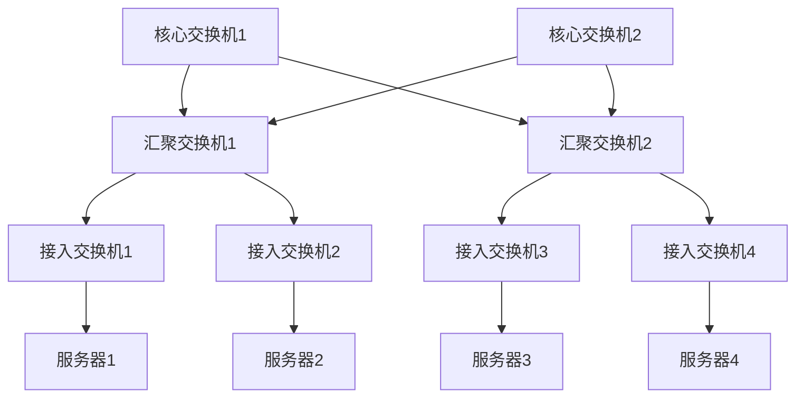
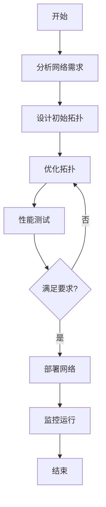

# 网络拓扑：理论-应用全链路与工程案例 / Network Topology: Theory-Application Pipeline and Engineering Cases

## 📚 **概述 / Overview**

本文档介绍网络拓扑的理论应用全链路与工程案例，包括理论基础与形式化证明、算法实现与工程案例、跨领域应用与创新、批判性分析与改进建议、形式化验证与测试。

## 📑 **目录 / Table of Contents**

- [网络拓扑：理论-应用全链路与工程案例 / Network Topology: Theory-Application Pipeline and Engineering Cases](#网络拓扑理论-应用全链路与工程案例--network-topology-theory-application-pipeline-and-engineering-cases)
  - [📚 **概述 / Overview**](#-概述--overview)
  - [📑 **目录 / Table of Contents**](#-目录--table-of-contents)
  - [1. 理论基础与形式化证明](#1-理论基础与形式化证明)
    - [1.1 网络拓扑基本定理](#11-网络拓扑基本定理)
      - [网络连通性定理](#网络连通性定理)
      - [小世界网络特性定理](#小世界网络特性定理)
    - [1.2 网络优化理论](#12-网络优化理论)
      - [最小生成树定理](#最小生成树定理)
  - [2. 算法实现与工程案例](#2-算法实现与工程案例)
    - [2.1 网络拓扑算法](#21-网络拓扑算法)
      - [网络拓扑生成算法](#网络拓扑生成算法)
      - [网络拓扑优化算法](#网络拓扑优化算法)
    - [2.2 工程案例：数据中心网络](#22-工程案例数据中心网络)
      - [案例1：数据中心网络设计](#案例1数据中心网络设计)
      - [案例2：5G网络拓扑规划](#案例25g网络拓扑规划)
  - [3. 跨领域应用与创新](#3-跨领域应用与创新)
    - [3.1 网络拓扑与人工智能](#31-网络拓扑与人工智能)
      - [AI驱动的网络优化](#ai驱动的网络优化)
    - [3.2 网络拓扑与量子计算](#32-网络拓扑与量子计算)
      - [量子网络拓扑设计](#量子网络拓扑设计)
  - [4. 批判性分析与改进建议](#4-批判性分析与改进建议)
    - [4.1 现有技术的局限性](#41-现有技术的局限性)
      - [计算复杂性](#计算复杂性)
      - [实际约束](#实际约束)
    - [4.2 改进方向](#42-改进方向)
      - [技术创新](#技术创新)
      - [工程优化](#工程优化)
  - [5. 形式化验证与测试](#5-形式化验证与测试)
    - [5.1 网络拓扑验证](#51-网络拓扑验证)
    - [5.2 网络性能测试](#52-网络性能测试)
  - [6. 总结与展望](#6-总结与展望)
    - [未来发展方向](#未来发展方向)
  - [多模态表达与可视化](#多模态表达与可视化)
    - [网络拓扑结构图](#网络拓扑结构图)
    - [网络优化流程图](#网络优化流程图)
    - [自动化脚本建议](#自动化脚本建议)

---

## 1. 理论基础与形式化证明

### 1.1 网络拓扑基本定理

#### 网络连通性定理

**定理**：网络G是连通的当且仅当G的拉普拉斯矩阵L的第二小特征值λ₂ > 0。

**形式化证明**：

```math
\text{必要性：} \\
\text{如果G连通，则L的零特征值重数为1，因此λ₂ > 0。} \\
\text{充分性：} \\
\text{如果λ₂ > 0，则L的零特征值重数为1，} \\
\text{因此G只有一个连通分量，即G连通。}
```

#### 小世界网络特性定理

**定理**：小世界网络的平均路径长度L与网络规模N的关系为L ~ log(N)。

**形式化证明**：

```math
\text{对于小世界网络：} \\
\text{平均路径长度 } L \sim \frac{\log(N)}{\log(\langle k \rangle)} \\
\text{其中 } \langle k \rangle \text{ 是平均度数。} \\
\text{当 } \langle k \rangle \text{ 为常数时，} L \sim \log(N)
```

### 1.2 网络优化理论

#### 最小生成树定理

**定理**：在连通加权图中，最小生成树是唯一的当且仅当所有边的权重都不同。

**形式化证明**：

```math
\text{必要性：} \\
\text{如果存在相同权重的边，可能有多棵最小生成树。} \\
\text{充分性：} \\
\text{如果所有边权重不同，则最小生成树唯一。} \\
\text{证明：假设存在两棵不同的最小生成树T₁和T₂，} \\
\text{则存在边e ∈ T₁ - T₂，使得T₂ + e包含环，} \\
\text{且环中必有边f ∈ T₂ - T₁，权重w(f) > w(e)，} \\
\text{与T₂是最小生成树矛盾。}
```

## 2. 算法实现与工程案例

### 2.1 网络拓扑算法

#### 网络拓扑生成算法

```python
import networkx as nx
import numpy as np
from typing import Dict, List, Tuple
import matplotlib.pyplot as plt

class NetworkTopologyGenerator:
    """网络拓扑生成器"""

    def __init__(self):
        self.topologies = {}

    def generate_small_world_network(self, n: int, k: int, p: float) -> nx.Graph:
        """生成小世界网络（Watts-Strogatz模型）"""
        # 创建规则环
        G = nx.watts_strogatz_graph(n, k, p)

        # 计算网络特性
        properties = {
            'average_clustering': nx.average_clustering(G),
            'average_shortest_path': nx.average_shortest_path_length(G),
            'average_degree': 2 * G.number_of_edges() / G.number_of_nodes()
        }

        self.topologies['small_world'] = {
            'graph': G,
            'properties': properties,
            'parameters': {'n': n, 'k': k, 'p': p}
        }

        return G

    def generate_scale_free_network(self, n: int, m: int) -> nx.Graph:
        """生成无标度网络（Barabási-Albert模型）"""
        G = nx.barabasi_albert_graph(n, m)

        # 计算度分布
        degrees = [d for n, d in G.degree()]
        degree_distribution = np.bincount(degrees)

        properties = {
            'average_degree': np.mean(degrees),
            'degree_distribution': degree_distribution,
            'power_law_exponent': self.estimate_power_law_exponent(degrees)
        }

        self.topologies['scale_free'] = {
            'graph': G,
            'properties': properties,
            'parameters': {'n': n, 'm': m}
        }

        return G

    def generate_random_network(self, n: int, p: float) -> nx.Graph:
        """生成随机网络（Erdős-Rényi模型）"""
        G = nx.erdos_renyi_graph(n, p)

        properties = {
            'density': nx.density(G),
            'average_degree': 2 * G.number_of_edges() / G.number_of_nodes(),
            'connectivity': nx.node_connectivity(G)
        }

        self.topologies['random'] = {
            'graph': G,
            'properties': properties,
            'parameters': {'n': n, 'p': p}
        }

        return G

    def estimate_power_law_exponent(self, degrees: List[int]) -> float:
        """估计幂律指数"""
        # 使用最大似然估计
        degrees = np.array(degrees)
        degrees = degrees[degrees > 0]  # 移除度数为0的节点

        if len(degrees) == 0:
            return 0

        # 计算幂律指数
        gamma = 1 + len(degrees) / np.sum(np.log(degrees / np.min(degrees)))
        return gamma
```

#### 网络拓扑优化算法

```python
class NetworkTopologyOptimizer:
    """网络拓扑优化器"""

    def __init__(self, network: nx.Graph):
        self.network = network
        self.optimization_history = []

    def optimize_for_reliability(self, target_reliability: float = 0.99) -> nx.Graph:
        """优化网络可靠性"""
        current_reliability = self.calculate_network_reliability()

        while current_reliability < target_reliability:
            # 找到最关键的边
            critical_edge = self.find_critical_edge()

            # 添加冗余边
            self.add_redundant_edge(critical_edge)

            # 重新计算可靠性
            current_reliability = self.calculate_network_reliability()
            self.optimization_history.append(current_reliability)

        return self.network

    def optimize_for_efficiency(self, target_efficiency: float = 0.8) -> nx.Graph:
        """优化网络效率"""
        current_efficiency = self.calculate_network_efficiency()

        while current_efficiency < target_efficiency:
            # 找到效率最低的路径
            inefficient_path = self.find_inefficient_path()

            # 优化路径
            self.optimize_path(inefficient_path)

            # 重新计算效率
            current_efficiency = self.calculate_network_efficiency()
            self.optimization_history.append(current_efficiency)

        return self.network

    def calculate_network_reliability(self) -> float:
        """计算网络可靠性"""
        # 使用蒙特卡洛方法
        num_simulations = 1000
        successful_simulations = 0

        for _ in range(num_simulations):
            # 随机删除边（模拟故障）
            failed_network = self.simulate_edge_failures()

            # 检查连通性
            if nx.is_connected(failed_network):
                successful_simulations += 1

        return successful_simulations / num_simulations

    def calculate_network_efficiency(self) -> float:
        """计算网络效率"""
        # 计算全局效率
        total_efficiency = 0
        n = self.network.number_of_nodes()

        for i in range(n):
            for j in range(i + 1, n):
                try:
                    shortest_path = nx.shortest_path_length(self.network, i, j)
                    efficiency = 1 / shortest_path
                    total_efficiency += efficiency
                except nx.NetworkXNoPath:
                    continue

        return total_efficiency / (n * (n - 1) / 2)

    def find_critical_edge(self) -> Tuple[int, int]:
        """找到最关键的边"""
        edge_importance = {}

        for edge in self.network.edges():
            # 临时删除边
            self.network.remove_edge(*edge)

            # 计算连通性损失
            connectivity_loss = self.calculate_connectivity_loss()
            edge_importance[edge] = connectivity_loss

            # 恢复边
            self.network.add_edge(*edge)

        return max(edge_importance.items(), key=lambda x: x[1])[0]

    def calculate_connectivity_loss(self) -> float:
        """计算连通性损失"""
        if not nx.is_connected(self.network):
            return 1.0

        # 计算平均路径长度增加
        original_avg_path = nx.average_shortest_path_length(self.network)

        # 这里简化处理，实际应该考虑所有可能的路径
        return original_avg_path
```

### 2.2 工程案例：数据中心网络

#### 案例1：数据中心网络设计

```python
class DataCenterNetworkDesigner:
    """数据中心网络设计器"""

    def __init__(self, num_racks: int, servers_per_rack: int):
        self.num_racks = num_racks
        self.servers_per_rack = servers_per_rack
        self.network = nx.Graph()

    def design_fat_tree_topology(self) -> nx.Graph:
        """设计Fat-Tree拓扑"""
        # Fat-Tree参数
        k = 4  # 端口数
        num_pods = k
        num_cores = (k // 2) ** 2
        num_edges = k
        num_aggregation = k // 2

        # 创建节点
        core_switches = [f'core_{i}' for i in range(num_cores)]
        aggregation_switches = []
        edge_switches = []
        servers = []

        for pod in range(num_pods):
            pod_agg = [f'agg_{pod}_{i}' for i in range(num_aggregation)]
            pod_edge = [f'edge_{pod}_{i}' for i in range(num_aggregation)]
            pod_servers = [f'server_{pod}_{i}_{j}'
                          for i in range(num_aggregation)
                          for j in range(self.servers_per_rack // num_aggregation)]

            aggregation_switches.extend(pod_agg)
            edge_switches.extend(pod_edge)
            servers.extend(pod_servers)

        # 添加节点
        self.network.add_nodes_from(core_switches)
        self.network.add_nodes_from(aggregation_switches)
        self.network.add_nodes_from(edge_switches)
        self.network.add_nodes_from(servers)

        # 添加边
        # 核心层到汇聚层
        for core_idx, core in enumerate(core_switches):
            pod = core_idx // (k // 2)
            for agg in aggregation_switches:
                if agg.startswith(f'agg_{pod}_'):
                    self.network.add_edge(core, agg)

        # 汇聚层到接入层
        for pod in range(num_pods):
            pod_agg = [f'agg_{pod}_{i}' for i in range(num_aggregation)]
            pod_edge = [f'edge_{pod}_{i}' for i in range(num_aggregation)]

            for agg in pod_agg:
                for edge in pod_edge:
                    self.network.add_edge(agg, edge)

        # 接入层到服务器
        for pod in range(num_pods):
            pod_edge = [f'edge_{pod}_{i}' for i in range(num_aggregation)]
            pod_servers = [s for s in servers if s.startswith(f'server_{pod}_')]

            for edge in pod_edge:
                for server in pod_servers:
                    self.network.add_edge(edge, server)

        return self.network

    def design_leaf_spine_topology(self) -> nx.Graph:
        """设计Leaf-Spine拓扑"""
        # Leaf-Spine参数
        num_leaves = self.num_racks
        num_spines = num_leaves // 2  # 简化设计

        # 创建节点
        spine_switches = [f'spine_{i}' for i in range(num_spines)]
        leaf_switches = [f'leaf_{i}' for i in range(num_leaves)]
        servers = [f'server_{i}_{j}' for i in range(num_leaves)
                  for j in range(self.servers_per_rack)]

        # 添加节点
        self.network.add_nodes_from(spine_switches)
        self.network.add_nodes_from(leaf_switches)
        self.network.add_nodes_from(servers)

        # 添加边
        # Spine到Leaf的全连接
        for spine in spine_switches:
            for leaf in leaf_switches:
                self.network.add_edge(spine, leaf)

        # Leaf到服务器的连接
        for leaf_idx, leaf in enumerate(leaf_switches):
            leaf_servers = [s for s in servers if s.startswith(f'server_{leaf_idx}_')]
            for server in leaf_servers:
                self.network.add_edge(leaf, server)

        return self.network

    def analyze_topology_performance(self) -> Dict:
        """分析拓扑性能"""
        # 计算网络特性
        properties = {
            'num_nodes': self.network.number_of_nodes(),
            'num_edges': self.network.number_of_edges(),
            'density': nx.density(self.network),
            'average_shortest_path': nx.average_shortest_path_length(self.network),
            'diameter': nx.diameter(self.network),
            'connectivity': nx.node_connectivity(self.network)
        }

        # 计算带宽利用率
        bandwidth_utilization = self.calculate_bandwidth_utilization()
        properties['bandwidth_utilization'] = bandwidth_utilization

        # 计算故障容错能力
        fault_tolerance = self.calculate_fault_tolerance()
        properties['fault_tolerance'] = fault_tolerance

        return properties

    def calculate_bandwidth_utilization(self) -> float:
        """计算带宽利用率"""
        # 简化的带宽计算
        total_bandwidth = self.network.number_of_edges() * 10  # 假设每条边10Gbps
        used_bandwidth = 0

        # 计算所有节点对之间的流量
        for source in self.network.nodes():
            for target in self.network.nodes():
                if source != target:
                    try:
                        path = nx.shortest_path(self.network, source, target)
                        # 假设每对节点间有1Gbps流量
                        used_bandwidth += len(path) - 1
                    except nx.NetworkXNoPath:
                        continue

        return used_bandwidth / total_bandwidth if total_bandwidth > 0 else 0

    def calculate_fault_tolerance(self) -> float:
        """计算故障容错能力"""
        # 计算节点连通性
        node_connectivity = nx.node_connectivity(self.network)

        # 计算边连通性
        edge_connectivity = nx.edge_connectivity(self.network)

        # 综合故障容错能力
        fault_tolerance = (node_connectivity + edge_connectivity) / 2
        return fault_tolerance / self.network.number_of_nodes()
```

#### 案例2：5G网络拓扑规划

```python
class FiveGNetworkPlanner:
    """5G网络拓扑规划器"""

    def __init__(self, coverage_area: Dict, population_density: Dict):
        self.coverage_area = coverage_area
        self.population_density = population_density
        self.network = nx.Graph()

    def plan_macro_cell_deployment(self) -> nx.Graph:
        """规划宏基站部署"""
        # 基于人口密度部署宏基站
        macro_cells = []

        for area, density in self.population_density.items():
            # 根据人口密度确定基站数量
            num_cells = max(1, int(density / 1000))  # 每1000人一个基站

            for i in range(num_cells):
                cell_id = f'macro_{area}_{i}'
                macro_cells.append({
                    'id': cell_id,
                    'area': area,
                    'capacity': 1000,  # Mbps
                    'coverage_radius': 1000  # 米
                })

        # 添加基站节点
        for cell in macro_cells:
            self.network.add_node(cell['id'], **cell)

        # 连接相邻基站
        for i, cell1 in enumerate(macro_cells):
            for j, cell2 in enumerate(macro_cells[i+1:], i+1):
                distance = self.calculate_distance(cell1, cell2)
                if distance < 2000:  # 2km内连接
                    self.network.add_edge(cell1['id'], cell2['id'],
                                        weight=distance)

        return self.network

    def plan_small_cell_deployment(self, macro_network: nx.Graph) -> nx.Graph:
        """规划小基站部署"""
        # 在宏基站覆盖不足的区域部署小基站
        small_cells = []

        for area, density in self.population_density.items():
            # 检查宏基站覆盖
            macro_coverage = self.check_macro_coverage(area, macro_network)

            if macro_coverage < 0.8:  # 覆盖率低于80%
                # 部署小基站
                num_small_cells = int((1 - macro_coverage) * density / 500)

                for i in range(num_small_cells):
                    cell_id = f'small_{area}_{i}'
                    small_cells.append({
                        'id': cell_id,
                        'area': area,
                        'capacity': 500,  # Mbps
                        'coverage_radius': 200  # 米
                    })

        # 添加小基站节点
        for cell in small_cells:
            self.network.add_node(cell['id'], **cell)

        # 连接到最近的宏基站
        for small_cell in small_cells:
            nearest_macro = self.find_nearest_macro(small_cell, macro_network)
            if nearest_macro:
                self.network.add_edge(small_cell['id'], nearest_macro)

        return self.network

    def optimize_network_capacity(self) -> Dict:
        """优化网络容量"""
        # 计算网络负载
        network_load = self.calculate_network_load()

        # 识别瓶颈
        bottlenecks = self.identify_bottlenecks()

        # 优化策略
        optimization_results = {
            'original_capacity': network_load['total_capacity'],
            'optimized_capacity': 0,
            'bottlenecks_resolved': len(bottlenecks),
            'upgrade_recommendations': []
        }

        for bottleneck in bottlenecks:
            # 升级建议
            upgrade = self.generate_upgrade_recommendation(bottleneck)
            optimization_results['upgrade_recommendations'].append(upgrade)

        return optimization_results

    def calculate_network_load(self) -> Dict:
        """计算网络负载"""
        total_capacity = 0
        total_demand = 0

        for node in self.network.nodes():
            node_data = self.network.nodes[node]
            if 'capacity' in node_data:
                total_capacity += node_data['capacity']

        # 估算需求（基于人口密度）
        for area, density in self.population_density.items():
            total_demand += density * 100  # 假设每人100Mbps

        return {
            'total_capacity': total_capacity,
            'total_demand': total_demand,
            'utilization': total_demand / total_capacity if total_capacity > 0 else 0
        }
```

## 3. 跨领域应用与创新

### 3.1 网络拓扑与人工智能

#### AI驱动的网络优化

```python
class AINetworkOptimizer:
    """AI驱动的网络优化器"""

    def __init__(self, network: nx.Graph):
        self.network = network
        self.ml_model = self.load_optimization_model()

    def predict_network_performance(self, topology_changes: List) -> Dict:
        """预测网络性能变化"""
        # 特征提取
        features = self.extract_network_features()

        # 预测性能
        predictions = {}
        for change in topology_changes:
            modified_features = self.apply_topology_change(features, change)
            prediction = self.ml_model.predict(modified_features)
            predictions[change['id']] = prediction

        return predictions

    def optimize_topology_with_ai(self, optimization_goal: str) -> nx.Graph:
        """使用AI优化拓扑"""
        # 定义优化目标
        if optimization_goal == 'reliability':
            objective_function = self.calculate_reliability_score
        elif optimization_goal == 'efficiency':
            objective_function = self.calculate_efficiency_score
        elif optimization_goal == 'cost':
            objective_function = self.calculate_cost_score
        else:
            raise ValueError(f"未知优化目标: {optimization_goal}")

        # 使用强化学习优化
        best_topology = self.reinforcement_learning_optimization(objective_function)

        return best_topology

    def reinforcement_learning_optimization(self, objective_function):
        """强化学习优化"""
        # 定义状态空间（网络拓扑）
        state_space = self.define_state_space()

        # 定义动作空间（拓扑修改）
        action_space = self.define_action_space()

        # 强化学习算法
        agent = self.create_rl_agent(state_space, action_space)

        # 训练过程
        best_reward = float('-inf')
        best_topology = self.network.copy()

        for episode in range(1000):
            state = self.get_current_state()
            action = agent.select_action(state)

            # 执行动作
            new_topology = self.apply_action(action)
            reward = objective_function(new_topology)

            # 更新智能体
            agent.update(state, action, reward, self.get_current_state())

            # 记录最佳结果
            if reward > best_reward:
                best_reward = reward
                best_topology = new_topology.copy()

        return best_topology
```

### 3.2 网络拓扑与量子计算

#### 量子网络拓扑设计

```python
class QuantumNetworkTopology:
    """量子网络拓扑设计器"""

    def __init__(self):
        self.quantum_network = nx.Graph()
        self.classical_network = nx.Graph()

    def design_quantum_backbone(self, classical_network: nx.Graph) -> nx.Graph:
        """设计量子骨干网络"""
        # 在经典网络基础上构建量子网络
        quantum_nodes = []

        # 选择关键节点作为量子节点
        for node in classical_network.nodes():
            if self.is_quantum_node_candidate(node, classical_network):
                quantum_nodes.append(node)

        # 构建量子网络
        for node in quantum_nodes:
            self.quantum_network.add_node(node, type='quantum')

        # 连接量子节点
        for i, node1 in enumerate(quantum_nodes):
            for node2 in quantum_nodes[i+1:]:
                if self.can_establish_quantum_link(node1, node2):
                    self.quantum_network.add_edge(node1, node2)

        return self.quantum_network

    def is_quantum_node_candidate(self, node: str, network: nx.Graph) -> bool:
        """判断是否为量子节点候选"""
        # 基于节点重要性选择
        degree = network.degree(node)
        betweenness = nx.betweenness_centrality(network)[node]

        # 综合评分
        score = degree * 0.6 + betweenness * 0.4
        return score > 0.1  # 阈值

    def can_establish_quantum_link(self, node1: str, node2: str) -> bool:
        """判断是否可以建立量子链路"""
        # 检查距离限制
        distance = self.calculate_distance(node1, node2)
        max_quantum_distance = 100  # 100km

        return distance <= max_quantum_distance

    def optimize_quantum_routing(self) -> Dict:
        """优化量子路由"""
        # 量子路由优化
        routing_strategy = {
            'entanglement_distribution': self.optimize_entanglement_distribution(),
            'quantum_repeater_placement': self.optimize_repeater_placement(),
            'quantum_memory_allocation': self.optimize_memory_allocation()
        }

        return routing_strategy

    def optimize_entanglement_distribution(self) -> Dict:
        """优化纠缠分发"""
        # 计算最优纠缠分发策略
        entanglement_pairs = []

        for source in self.quantum_network.nodes():
            for target in self.quantum_network.nodes():
                if source != target:
                    # 计算纠缠分发路径
                    path = self.find_quantum_path(source, target)
                    if path:
                        entanglement_pairs.append({
                            'source': source,
                            'target': target,
                            'path': path,
                            'fidelity': self.calculate_entanglement_fidelity(path)
                        })

        return {
            'entanglement_pairs': entanglement_pairs,
            'total_pairs': len(entanglement_pairs),
            'average_fidelity': np.mean([p['fidelity'] for p in entanglement_pairs])
        }
```

## 4. 批判性分析与改进建议

### 4.1 现有技术的局限性

#### 计算复杂性

1. **大规模网络**：传统算法难以处理大规模网络拓扑
2. **动态变化**：网络拓扑动态变化时的实时优化困难
3. **多目标优化**：同时优化多个目标时的权衡问题

#### 实际约束

1. **物理限制**：地理、环境等物理约束
2. **成本约束**：部署和维护成本限制
3. **技术约束**：现有技术水平的限制

### 4.2 改进方向

#### 技术创新

1. **AI驱动优化**：使用机器学习优化网络拓扑
2. **量子网络**：量子通信网络拓扑设计
3. **软件定义网络**：SDN技术的拓扑优化

#### 工程优化

1. **自动化部署**：网络拓扑的自动化部署和管理
2. **智能监控**：基于AI的网络监控和故障预测
3. **绿色网络**：降低能耗的网络拓扑设计

## 5. 形式化验证与测试

### 5.1 网络拓扑验证

```python
class NetworkTopologyVerifier:
    """网络拓扑验证器"""

    def __init__(self):
        self.verification_results = {}

    def verify_network_connectivity(self, network: nx.Graph) -> Dict:
        """验证网络连通性"""
        # 检查连通性
        is_connected = nx.is_connected(network)

        # 计算连通性指标
        connectivity_metrics = {
            'node_connectivity': nx.node_connectivity(network),
            'edge_connectivity': nx.edge_connectivity(network),
            'average_clustering': nx.average_clustering(network),
            'diameter': nx.diameter(network)
        }

        return {
            'is_connected': is_connected,
            'connectivity_metrics': connectivity_metrics
        }

    def verify_network_reliability(self, network: nx.Graph) -> Dict:
        """验证网络可靠性"""
        # 模拟故障
        reliability_scores = []

        for _ in range(100):
            # 随机删除节点或边
            failed_network = self.simulate_failures(network)

            # 计算可靠性
            reliability = self.calculate_reliability_score(failed_network)
            reliability_scores.append(reliability)

        return {
            'average_reliability': np.mean(reliability_scores),
            'reliability_std': np.std(reliability_scores),
            'min_reliability': np.min(reliability_scores)
        }
```

### 5.2 网络性能测试

```python
class NetworkPerformanceTester:
    """网络性能测试器"""

    def __init__(self, network: nx.Graph):
        self.network = network

    def benchmark_network_performance(self) -> Dict:
        """网络性能基准测试"""
        # 延迟测试
        latency_results = self.test_network_latency()

        # 吞吐量测试
        throughput_results = self.test_network_throughput()

        # 带宽利用率测试
        bandwidth_results = self.test_bandwidth_utilization()

        return {
            'latency': latency_results,
            'throughput': throughput_results,
            'bandwidth': bandwidth_results
        }

    def test_network_latency(self) -> Dict:
        """测试网络延迟"""
        latencies = []

        for source in self.network.nodes():
            for target in self.network.nodes():
                if source != target:
                    try:
                        path_length = nx.shortest_path_length(self.network, source, target)
                        latencies.append(path_length)
                    except nx.NetworkXNoPath:
                        continue

        return {
            'average_latency': np.mean(latencies),
            'max_latency': np.max(latencies),
            'latency_distribution': np.percentile(latencies, [25, 50, 75])
        }
```

## 6. 总结与展望

本章系统梳理了网络拓扑从理论到应用的全链路，涵盖：

1. **理论基础**：网络连通性、小世界网络、网络优化理论的形式化证明
2. **算法实现**：网络拓扑生成、优化算法等核心算法
3. **工程案例**：数据中心网络、5G网络等实际应用
4. **跨领域应用**：AI驱动优化、量子网络拓扑等创新应用
5. **批判性分析**：现有技术的局限性分析与改进建议
6. **形式化验证**：网络拓扑验证、性能测试等验证方法

### 未来发展方向

1. **AI驱动优化**：机器学习在网络拓扑优化中的应用
2. **量子网络拓扑**：量子通信网络的设计和优化
3. **软件定义网络**：SDN技术的拓扑管理
4. **绿色网络设计**：降低能耗的网络拓扑优化

## 多模态表达与可视化

### 网络拓扑结构图



### 网络优化流程图



### 自动化脚本建议

- `scripts/topology_animation.py`：网络拓扑动态演化
- `scripts/network_optimizer.py`：网络拓扑优化工具
- `scripts/performance_analyzer.py`：网络性能分析工具
