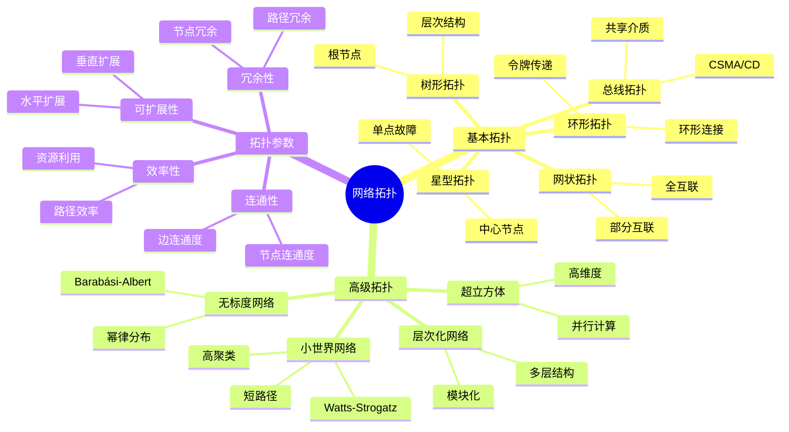
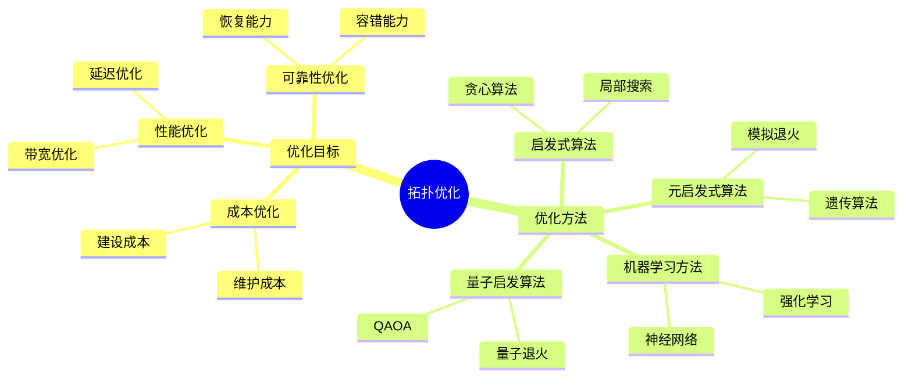
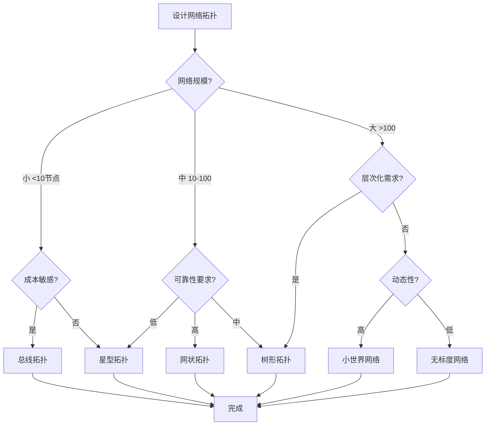
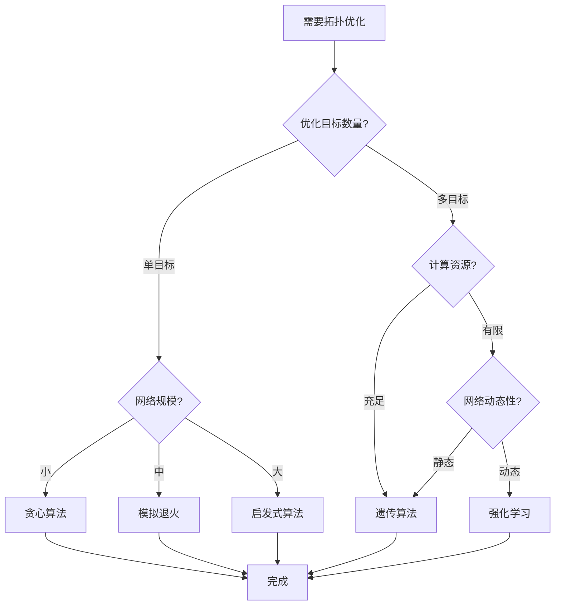
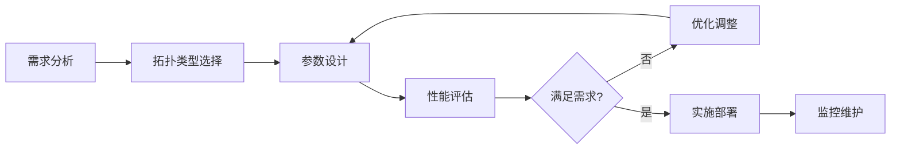
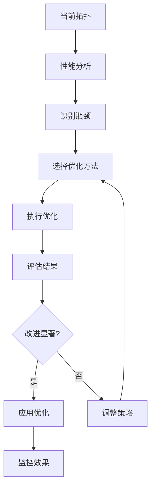
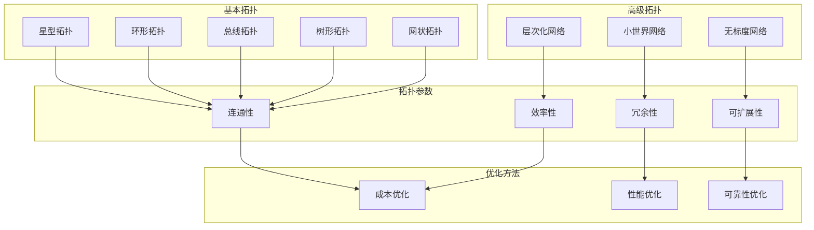

# 网络拓扑思维表征工具 / Network Topology Mental Representation Tools

## 📚 **概述 / Overview**

本文档提供网络拓扑模块的多种思维表征工具，包括思维导图、对比矩阵、决策树、逻辑路径和概念地图，帮助更好地理解和应用网络拓扑知识。

**创建时间**: 2025年1月
**模块**: 网络拓扑
**状态**: 🚀 持续更新中

---

## 🗺️ **一、思维导图 / Mind Maps**

### 1.1 网络拓扑核心概念思维导图

### 1.2 网络拓扑优化思维导图

---

## 📊 **二、对比矩阵 / Comparison Matrices**

### 2.1 基本拓扑结构对比矩阵

| 拓扑类型 | 节点数 | 边数 | 容错性 | 可扩展性 | 成本 | 适用场景 |
|---------|--------|------|--------|---------|------|---------|
| **星型** | n | n-1 | 低（中心节点） | 中等 | 低 | 小型网络、局域网 |
| **环形** | n | n | 中等 | 低 | 低 | 令牌环网络 |
| **总线** | n | n-1 | 低（单点故障） | 低 | 最低 | 早期以太网 |
| **树形** | n | n-1 | 中等 | 高 | 中等 | 层次化网络、企业网 |
| **网状（全互联）** | n | n(n-1)/2 | 最高 | 低 | 最高 | 关键节点、小规模 |
| **网状（部分）** | n | 可变 | 高 | 中等 | 中等 | 广域网、互联网 |

**选择指南**：

- **小型网络**：星型或总线
- **层次化网络**：树形
- **高可靠性需求**：网状
- **成本敏感**：总线或星型
- **大规模网络**：树形或部分网状

### 2.2 拓扑优化算法对比矩阵

| 算法 | 优化目标 | 时间复杂度 | 适用规模 | 特点 | 应用场景 |
|------|---------|-----------|---------|------|---------|
| **贪心算法** | 单目标 | O(n²) | 小-中 | 快速、局部最优 | 初始设计 |
| **遗传算法** | 多目标 | O(pop×gen×n²) | 中-大 | 全局搜索、多目标 | 复杂优化 |
| **模拟退火** | 单/多目标 | O(iter×n²) | 中 | 避免局部最优 | 中等规模 |
| **强化学习（DQN）** | 多目标 | 训练：高 | 大 | 学习优化策略 | 动态网络 |
| **量子退火** | 多目标 | 量子加速 | 中-大 | 量子计算优势 | 复杂优化 |

**选择指南**：

- **快速设计**：贪心算法
- **复杂优化**：遗传算法或强化学习
- **中等规模**：模拟退火
- **大规模动态**：强化学习
- **量子计算可用**：量子退火

### 2.3 小世界网络模型对比矩阵

| 模型 | 参数 | 聚类系数 | 平均路径长度 | 度分布 | 应用场景 |
|------|------|---------|------------|--------|---------|
| **Watts-Strogatz** | p（重连概率） | 高 | 短 | 近似均匀 | 社交网络、生物网络 |
| **Newman-Watts** | p（加边概率） | 高 | 短 | 近似均匀 | 网络演化 |
| **Kleinberg** | 维度、距离 | 高 | 短 | 幂律 | 空间网络 |
| **Barabási-Albert** | m（连接数） | 低 | 短 | 幂律 | 无标度网络 |

**选择指南**：

- **社交网络建模**：Watts-Strogatz
- **网络演化研究**：Newman-Watts
- **空间网络**：Kleinberg
- **无标度特性**：Barabási-Albert

---

## 🌳 **三、决策树 / Decision Trees**

### 3.1 网络拓扑选择决策树

### 3.2 拓扑优化方法选择决策树

---

## 🛤️ **四、逻辑路径 / Logical Paths**

### 4.1 网络拓扑设计逻辑路径

### 4.2 拓扑优化逻辑路径

---

## 🗺️ **五、概念地图 / Concept Maps**

### 5.1 网络拓扑概念关系地图

---

**各主题完整版思维表征**: 见 [README - 思维表征工具集合](README.md#思维表征工具集合)（含网络拓扑结构、拓扑优化、小世界/无标度、社区检测、中心性、优化理论、动力学、生成模型、韧性、采样、聚类、定义树与定理树，共 13 个完整版）。

**文档版本**: v1.0
**创建时间**: 2025年1月
**最后更新**: 2025年2月
**维护者**: GraphNetWorkCommunicate项目组
