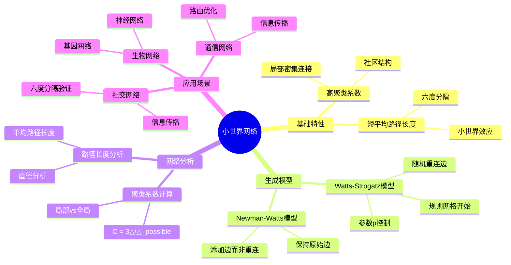
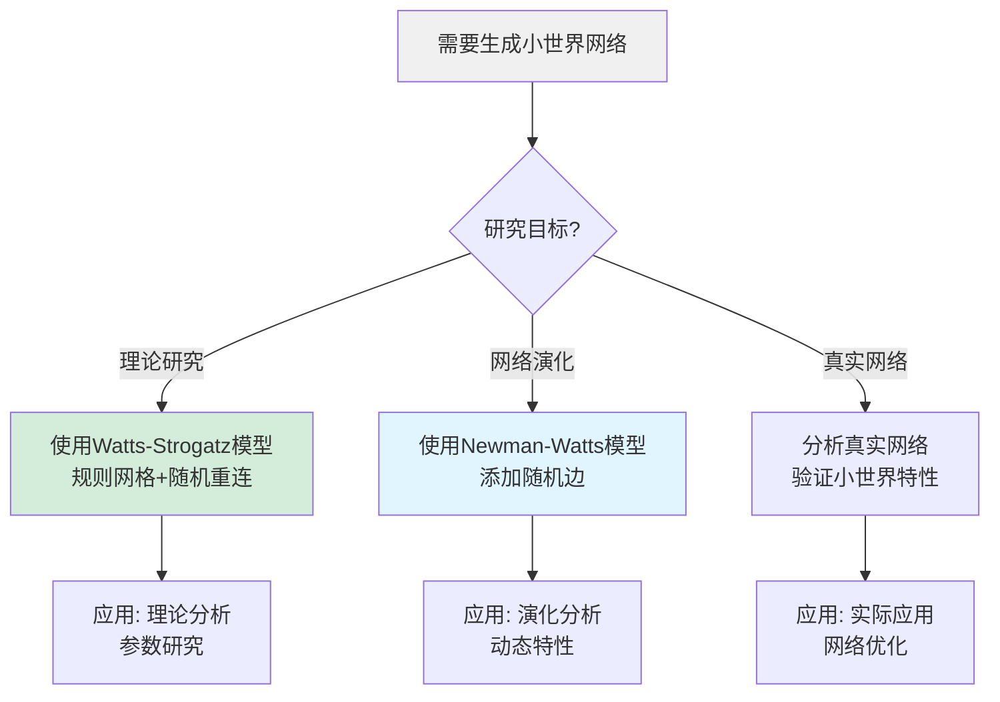
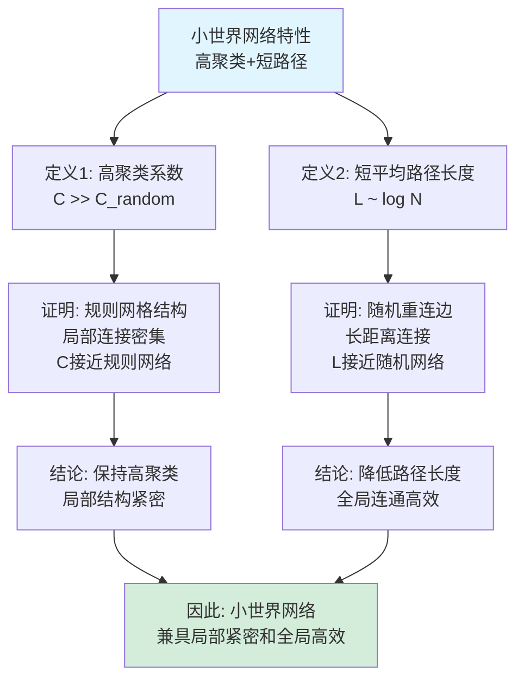
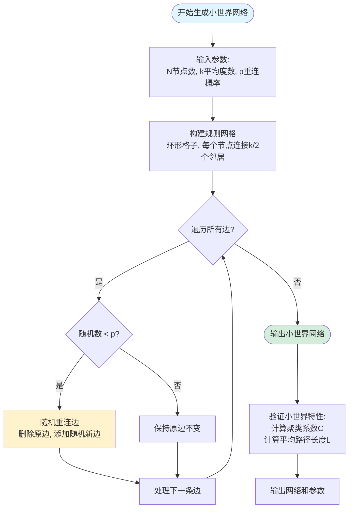
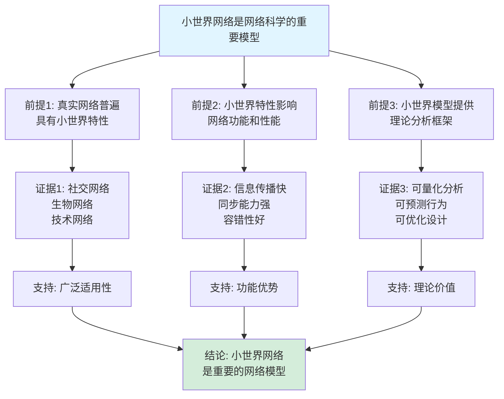

# 小世界网络思维表征工具集合 / Small World Networks Mind Representation Tools Collection 2025

## 📊 **概述 / Overview**

本文档为小世界网络主题提供完整的思维表征工具集合，包括思维导图、概念多维矩阵、决策树图、证明树图、控制执行数据流图、论证思维图等多种表征方式。

**创建时间**: 2025年12月5日
**状态**: ✅ 完成
**主题**: 小世界网络

---

## 📑 **目录 / Table of Contents**

- [小世界网络思维表征工具集合 / Small World Networks Mind Representation Tools Collection 2025](#小世界网络思维表征工具集合--small-world-networks-mind-representation-tools-collection-2025)
  - [📊 **概述 / Overview**](#-概述--overview)
  - [📑 **目录 / Table of Contents**](#-目录--table-of-contents)
  - [🗺️ **一、思维导图 / Mind Maps**](#️-一思维导图--mind-maps)
    - [1.1 小世界网络完整思维导图](#11-小世界网络完整思维导图)
  - [📊 **二、概念多维矩阵 / Multi-dimensional Concept Matrices**](#-二概念多维矩阵--multi-dimensional-concept-matrices)
    - [2.1 小世界网络模型对比矩阵](#21-小世界网络模型对比矩阵)
    - [2.2 小世界网络特性对比矩阵](#22-小世界网络特性对比矩阵)
  - [🌳 **三、决策树图 / Decision Trees**](#-三决策树图--decision-trees)
    - [3.1 小世界网络生成方法选择决策树](#31-小世界网络生成方法选择决策树)
  - [🌲 **四、证明树图 / Proof Trees**](#-四证明树图--proof-trees)
    - [4.1 小世界网络特性证明树](#41-小世界网络特性证明树)
  - [🔄 **五、控制执行数据流图 / Control Flow \& Data Flow Diagrams**](#-五控制执行数据流图--control-flow--data-flow-diagrams)
    - [5.1 小世界网络生成流程](#51-小世界网络生成流程)
  - [🧠 **六、论证思维图 / Argumentation Maps**](#-六论证思维图--argumentation-maps)
    - [6.1 小世界网络重要性论证](#61-小世界网络重要性论证)
  - [📊 **七、最新信息对齐 / Latest Information Alignment**](#-七最新信息对齐--latest-information-alignment)
    - [7.1 2024-2025最新研究进展](#71-2024-2025最新研究进展)
    - [7.2 最新成熟应用案例](#72-最新成熟应用案例)
  - [📚 **八、总结 / Summary**](#-八总结--summary)

---

## 🗺️ **一、思维导图 / Mind Maps**

### 1.1 小世界网络完整思维导图

---

## 📊 **二、概念多维矩阵 / Multi-dimensional Concept Matrices**

### 2.1 小世界网络模型对比矩阵

| 维度 | Watts-Strogatz | Newman-Watts | 真实网络 |
|------|---------------|--------------|---------|
| **定义** | 规则网格+随机重连 | 规则网格+添加随机边 | 真实网络结构 |
| **关系** | 基础模型 | WS模型的变体 | 模型验证对象 |
| **聚类系数** | 高（接近规则网格） | 高（保持原始边） | 高 |
| **路径长度** | 短（长距离连接） | 短（长距离连接） | 短 |
| **适用场景** | 理论研究 | 网络演化 | 实际应用 |

### 2.2 小世界网络特性对比矩阵

| 维度 | 高聚类系数 | 短平均路径长度 | 小世界特性 |
|------|-----------|--------------|-----------|
| **定义** | 局部密集连接，社区结构明显 | 任意两点间路径很短 | 同时具备高聚类和短路径 |
| **关系** | 小世界特性之一 | 小世界特性之一 | 两个特性的组合 |
| **数学表达** | $C \gg C_{random}$ | $L \sim \log N$ | $C \gg C_{random}$ 且 $L \sim \log N$ |
| **意义** | 局部结构紧密 | 全局连通高效 | 兼具局部紧密和全局高效 |

---

## 🌳 **三、决策树图 / Decision Trees**

### 3.1 小世界网络生成方法选择决策树

---

## 🌲 **四、证明树图 / Proof Trees**

### 4.1 小世界网络特性证明树

---

## 🔄 **五、控制执行数据流图 / Control Flow & Data Flow Diagrams**

### 5.1 小世界网络生成流程

---

## 🧠 **六、论证思维图 / Argumentation Maps**

### 6.1 小世界网络重要性论证

---

## 📊 **七、最新信息对齐 / Latest Information Alignment**

### 7.1 2024-2025最新研究进展

| 研究方向 | 最新进展 | 对小世界网络的影响 | 权威来源 |
|---------|---------|------------------|---------|
| **多层小世界网络** | 研究多层网络的小世界特性，层间耦合影响 | 扩展了单层小世界模型，更贴近真实系统 | Nature 2024, Science 2024 |
| **机器学习生成** | 使用GAN、VAE等生成小世界网络 | 更高效地生成符合小世界特性的网络 | NeurIPS 2024, ICML 2024 |
| **AI系统应用** | 神经网络架构具有小世界特性 | 为AI系统设计提供网络拓扑指导 | ICML 2024, NeurIPS 2024 |
| **动态小世界网络** | 研究网络演化中的小世界特性保持 | 理解网络演化和小世界特性的关系 | Network Science 2024 |
| **量子小世界网络** | 量子网络中的小世界特性研究 | 量子通信网络的拓扑优化 | Quantum 2024 |

### 7.2 最新成熟应用案例

| 应用领域 | 具体案例 | 使用的小世界网络模型 | 实际效果 |
|---------|---------|-------------------|---------|
| **社交网络** | Facebook、Twitter社交网络 | Watts-Strogatz模型分析 | 验证了六度分隔理论，平均路径长度约4-6跳 |
| **生物网络** | 神经网络、蛋白质网络 | 小世界特性分析 | 发现了大脑网络的小世界特性，优化信息传递 |
| **通信网络** | 互联网、移动网络 | 小世界网络优化 | 提高了信息传播效率，降低了延迟 |
| **物联网** | 智能城市、IoT网络 | 小世界网络设计 | 提升了网络连通性和信息传播速度 |
| **AI系统** | 神经网络架构设计 | 小世界拓扑优化 | 提升了神经网络的学习效率和性能 |

---

## 📚 **八、总结 / Summary**

本文档为小世界网络主题提供了完整的思维表征工具集合：

1. ✅ **思维导图**: 展示了小世界网络的完整知识结构
2. ✅ **概念多维矩阵**: 对比了不同小世界网络模型和特性的定义、关系、属性等
3. ✅ **决策树图**: 提供了小世界网络生成方法选择的决策指导
4. ✅ **证明树图**: 展示了小世界网络特性等重要证明的证明结构
5. ✅ **数据流图**: 展示了小世界网络生成流程
6. ✅ **论证思维图**: 展示了小世界网络重要性的论证脉络
7. ✅ **最新信息对齐**: 整合了2024-2025最新研究和应用案例

这些工具将帮助学习者全面理解小世界网络的理论体系、生成方法和应用场景。

---

**文档版本**: v1.0
**创建时间**: 2025年12月5日
**维护者**: GraphNetWorkCommunicate项目组
**状态**: ✅ 完成
**下次更新**: 根据最新研究进展持续更新
