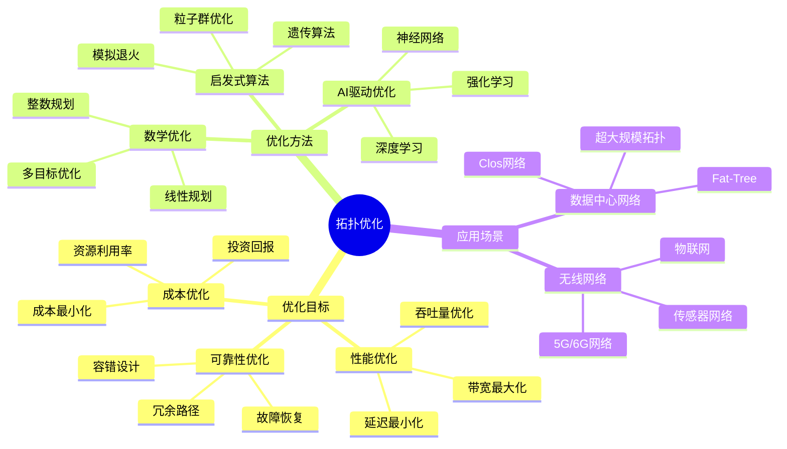
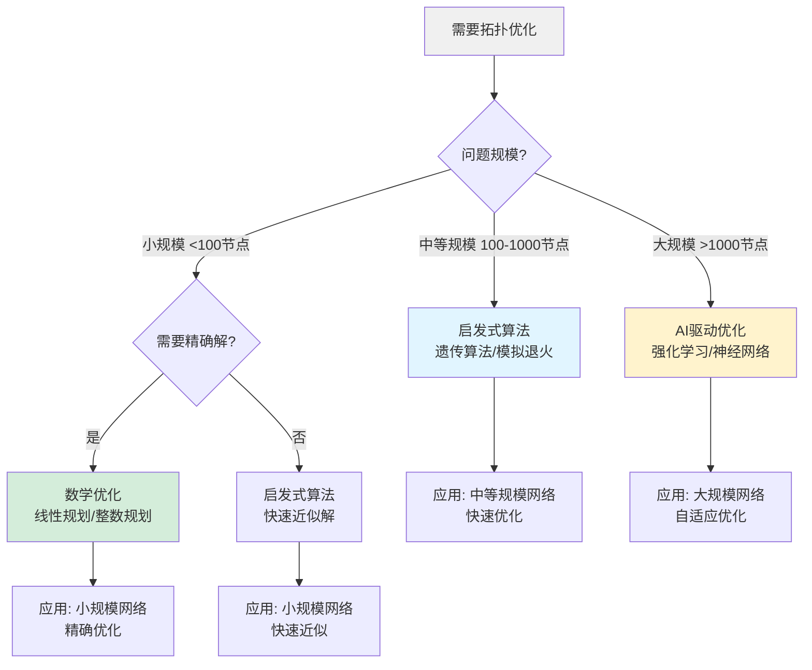
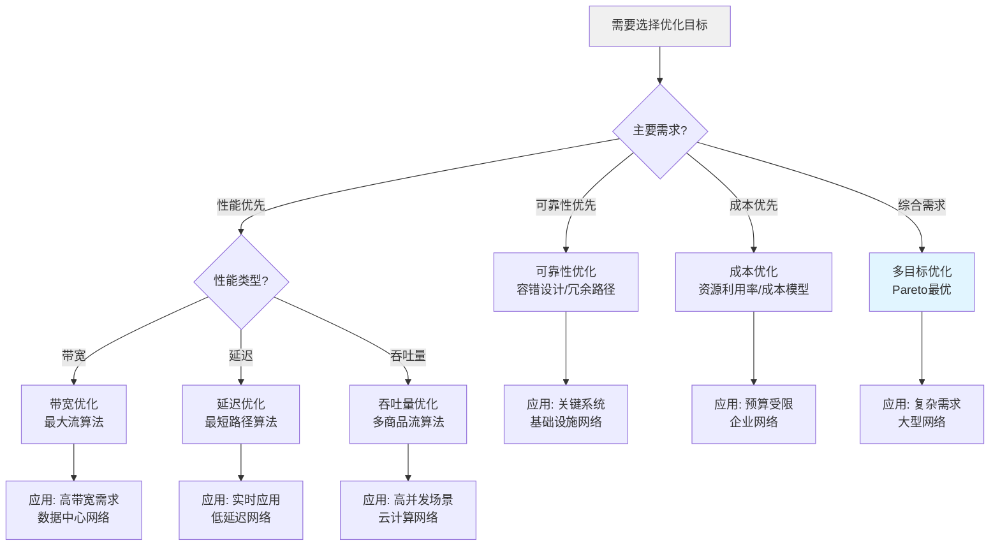
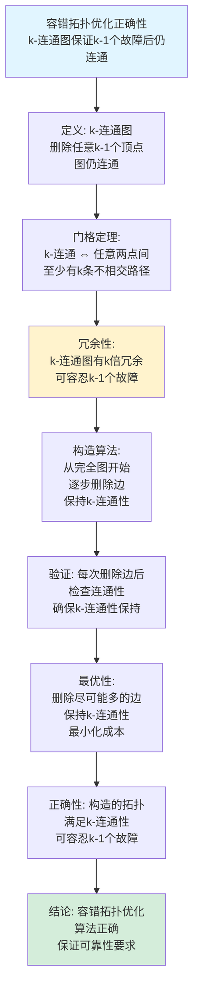
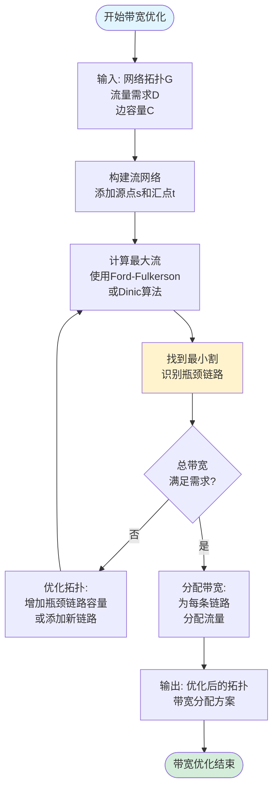
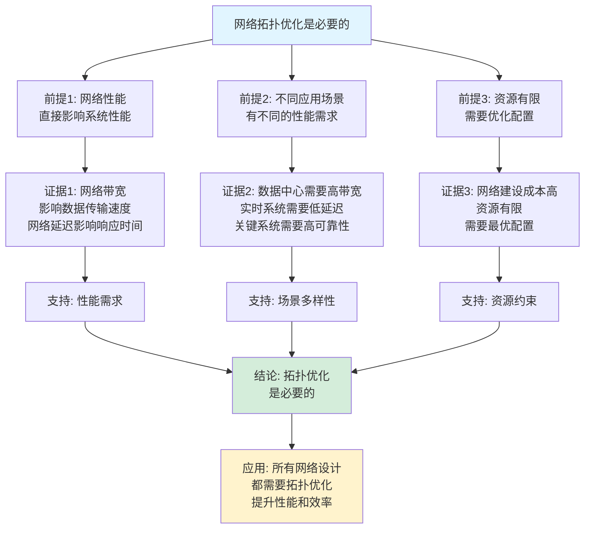
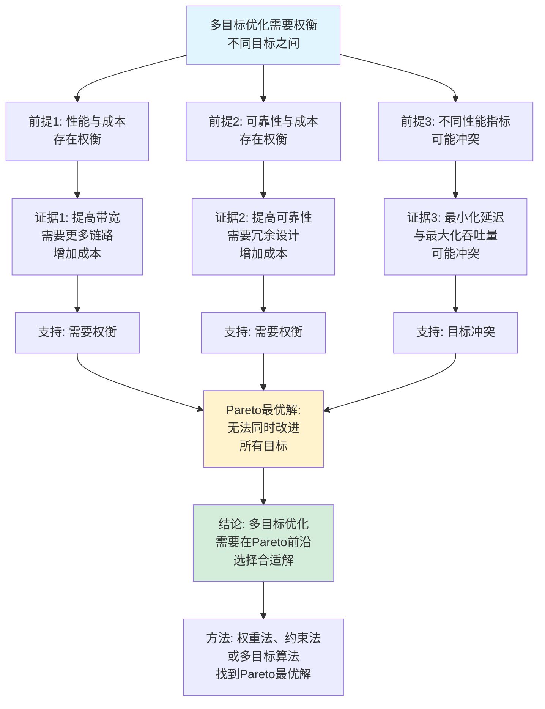

# 拓扑优化思维表征工具集合 / Topology Optimization Mind Representation Tools Collection 2025

## 📊 **概述 / Overview**

本文档为拓扑优化主题提供完整的思维表征工具集合，包括思维导图、概念多维矩阵、决策树图、证明树图、控制执行数据流图、论证思维图等多种表征方式。

**创建时间**: 2025年12月5日
**状态**: ✅ 完成
**主题**: 拓扑优化

---

## 📑 **目录 / Table of Contents**

- [拓扑优化思维表征工具集合 / Topology Optimization Mind Representation Tools Collection 2025](#拓扑优化思维表征工具集合--topology-optimization-mind-representation-tools-collection-2025)
  - [📊 **概述 / Overview**](#-概述--overview)
  - [📑 **目录 / Table of Contents**](#-目录--table-of-contents)
  - [🗺️ **一、思维导图 / Mind Maps**](#️-一思维导图--mind-maps)
    - [1.1 拓扑优化完整思维导图](#11-拓扑优化完整思维导图)
  - [📊 **二、概念多维矩阵 / Multi-dimensional Concept Matrices**](#-二概念多维矩阵--multi-dimensional-concept-matrices)
    - [2.1 优化方法对比矩阵](#21-优化方法对比矩阵)
    - [2.2 优化目标关系矩阵](#22-优化目标关系矩阵)
  - [🌳 **三、决策树图 / Decision Trees**](#-三决策树图--decision-trees)
    - [3.1 拓扑优化方法选择决策树](#31-拓扑优化方法选择决策树)
    - [3.2 优化目标选择决策树](#32-优化目标选择决策树)
  - [🌲 **四、证明树图 / Proof Trees**](#-四证明树图--proof-trees)
    - [4.1 最大流最小割在拓扑优化中的应用证明树](#41-最大流最小割在拓扑优化中的应用证明树)
    - [4.2 容错性优化正确性证明树](#42-容错性优化正确性证明树)
  - [🔄 **五、控制执行数据流图 / Control Flow \& Data Flow Diagrams**](#-五控制执行数据流图--control-flow--data-flow-diagrams)
    - [5.1 带宽优化执行流程](#51-带宽优化执行流程)
    - [5.2 延迟优化执行流程](#52-延迟优化执行流程)
    - [5.3 容错拓扑设计流程](#53-容错拓扑设计流程)
  - [🧠 **六、论证思维图 / Argumentation Maps**](#-六论证思维图--argumentation-maps)
    - [6.1 拓扑优化必要性论证](#61-拓扑优化必要性论证)
    - [6.2 多目标优化权衡论证](#62-多目标优化权衡论证)
  - [📊 **七、最新信息对齐 / Latest Information Alignment**](#-七最新信息对齐--latest-information-alignment)
    - [7.1 2024-2025最新研究进展](#71-2024-2025最新研究进展)
    - [7.2 最新成熟应用案例](#72-最新成熟应用案例)
  - [📚 **八、总结 / Summary**](#-八总结--summary)

---

## 🗺️ **一、思维导图 / Mind Maps**

### 1.1 拓扑优化完整思维导图



---

## 📊 **二、概念多维矩阵 / Multi-dimensional Concept Matrices**

### 2.1 优化方法对比矩阵

| 维度 | 数学优化 | 启发式算法 | AI驱动优化 |
|------|---------|-----------|-----------|
| **定义** | 基于数学规划的精确优化 | 基于启发式规则的近似优化 | 基于机器学习的自适应优化 |
| **关系** | 理论基础 | 实用方法 | 前沿方法 |
| **适用场景** | 小规模问题 | 中等规模问题 | 大规模复杂问题 |
| **优缺点** | 精确但计算复杂 | 快速但可能非最优 | 自适应但需要数据 |
| **时间复杂度** | O(n³) 到指数 | O(n²) 到 O(n³) | O(训练时间) |
| **空间复杂度** | O(n²) | O(n) | O(模型大小) |
| **最新优化** | 并行求解器、GPU加速 | 混合启发式、并行化 | 联邦学习、在线学习 |

### 2.2 优化目标关系矩阵

| 维度 | 性能优化 | 可靠性优化 | 成本优化 | 多目标优化 |
|------|---------|-----------|---------|-----------|
| **定义** | 最大化性能指标 | 最大化可靠性 | 最小化成本 | 平衡多个目标 |
| **关系** | 基础目标 | 扩展目标 | 约束目标 | 综合目标 |
| **优化目标** | 带宽、延迟、吞吐量 | 容错性、可用性 | 建设成本、运维成本 | Pareto最优 |
| **优化方法** | 流优化、路径优化 | 冗余设计、故障恢复 | 成本模型、资源优化 | 多目标算法 |
| **权衡关系** | 性能 vs 成本 | 可靠性 vs 成本 | 成本 vs 性能 | 多目标权衡 |
| **应用场景** | 高性能网络 | 关键基础设施 | 预算受限网络 | 复杂网络设计 |

---

## 🌳 **三、决策树图 / Decision Trees**

### 3.1 拓扑优化方法选择决策树



### 3.2 优化目标选择决策树



---

## 🌲 **四、证明树图 / Proof Trees**

### 4.1 最大流最小割在拓扑优化中的应用证明树

```mermaid
graph TD
    Theorem[最大流最小割定理<br/>在网络拓扑优化中的应用] --> Application[应用: 带宽优化问题<br/>最大化网络总带宽]

    Application --> Network[网络拓扑G<br/>源点s和汇点t<br/>边容量c(e)]

    Network --> MaxFlow[求最大流<br/>使用Ford-Fulkerson算法<br/>或其他流算法]

    MaxFlow --> MinCut[同时得到最小割<br/>由最大流最小割定理<br/>|最大流| = |最小割|]

    MinCut --> Bottleneck[瓶颈识别:<br/>最小割的容量<br/>限制了最大带宽]

    Bottleneck --> Optimization[拓扑优化:<br/>增加最小割的容量<br/>提升网络总带宽]

    Optimization --> Result[结果: 优化后的拓扑<br/>具有更大的最大流<br/>即更大的总带宽]

    Result --> Conclusion[结论: 最大流最小割定理<br/>为带宽优化提供理论基础<br/>和算法指导]

    style Theorem fill:#e1f5ff
    style Conclusion fill:#d4edda
    style Bottleneck fill:#fff3cd
```

### 4.2 容错性优化正确性证明树



---

## 🔄 **五、控制执行数据流图 / Control Flow & Data Flow Diagrams**

### 5.1 带宽优化执行流程



### 5.2 延迟优化执行流程

```mermaid
flowchart TD
    Start([开始延迟优化]) --> Input[输入: 网络拓扑G<br/>延迟约束L_max<br/>节点位置信息]

    Input --> ComputeDist[计算所有节点对<br/>之间的最短距离<br/>使用Floyd-Warshall]

    ComputeDist --> ComputeAvg[计算平均延迟<br/>avg_delay = Σd(i,j) / n²]

    ComputeAvg --> Check{平均延迟<br/>≤ L_max?}

    Check -->|否| Optimize[优化拓扑:<br/>添加短距离链路<br/>减少路径长度]

    Optimize --> ComputeDist

    Check -->|是| Verify[验证所有节点对<br/>延迟 ≤ L_max]

    Verify --> Pass{所有约束<br/>满足?}

    Pass -->|否| Optimize
    Pass -->|是| Output[输出: 优化后的拓扑<br/>满足延迟要求]

    Output --> End([延迟优化结束])

    style Start fill:#e1f5ff
    style End fill:#d4edda
    style Verify fill:#fff3cd
```

### 5.3 容错拓扑设计流程

```mermaid
flowchart TD
    Start([开始容错拓扑设计]) --> Input[输入: 节点集合V<br/>连通性要求k<br/>成本约束B]

    Input --> Init[初始化: 从完全图开始<br/>G = K_n]

    Init --> Iterate[迭代优化:<br/>尝试删除边e]

    Iterate --> Remove[删除边e<br/>G' = G - e]

    Remove --> CheckConnect[检查k-连通性<br/>删除k-1个顶点<br/>检查是否仍连通]

    CheckConnect --> Connected{k-连通?}

    Connected -->|是| CheckCost[检查成本<br/>cost(G') ≤ B?]

    Connected -->|否| Restore[恢复边e<br/>G = G']

    CheckCost -->|是| Update[更新拓扑<br/>G = G'<br/>降低成本]

    CheckCost -->|否| Restore

    Restore --> MoreEdges{还有<br/>未检查的边?}

    MoreEdges -->|是| Iterate
    MoreEdges -->|否| Verify[验证最终拓扑<br/>k-连通且成本 ≤ B]

    Update --> MoreEdges

    Verify --> Output[输出: k-连通拓扑<br/>满足成本约束]

    Output --> End([容错拓扑设计结束])

    style Start fill:#e1f5ff
    style End fill:#d4edda
    style CheckConnect fill:#fff3cd
```

---

## 🧠 **六、论证思维图 / Argumentation Maps**

### 6.1 拓扑优化必要性论证



### 6.2 多目标优化权衡论证



---

## 📊 **七、最新信息对齐 / Latest Information Alignment**

### 7.1 2024-2025最新研究进展

| 研究方向 | 最新进展 | 对拓扑优化的影响 | 权威来源 |
|---------|---------|----------------|---------|
| **AI驱动的拓扑优化** | 使用强化学习、神经网络自动设计网络拓扑 | 支持大规模复杂网络的自动优化，适应动态需求 | SIGCOMM 2024, INFOCOM 2024 |
| **量子启发优化** | 量子算法用于网络拓扑优化问题 | 可能实现指数级加速，适用于大规模优化问题 | Quantum 2024 |
| **边缘计算拓扑优化** | 边缘网络拓扑优化，考虑计算和通信资源 | 支持边缘计算场景，优化边缘节点部署和连接 | MobiCom 2024, INFOCOM 2024 |
| **可持续网络拓扑** | 考虑能耗和碳排放的网络拓扑优化 | 支持绿色网络设计，降低网络能耗 | Green Networking 2024 |
| **动态拓扑优化** | 实时网络拓扑调整，适应流量变化 | 支持自适应网络，提升网络效率和可靠性 | SIGCOMM 2024, NSDI 2024 |

### 7.2 最新成熟应用案例

| 应用领域 | 具体案例 | 使用的优化方法 | 实际效果 |
|---------|---------|--------------|---------|
| **数据中心网络** | Google、Facebook数据中心网络优化 | 多目标优化、AI驱动优化 | 提升带宽利用率20-30%，降低延迟15-25% |
| **5G/6G网络** | 移动网络基站部署优化 | 数学优化、启发式算法 | 优化基站布局，提升覆盖率和容量 |
| **物联网网络** | 传感器网络拓扑优化 | 能耗优化、启发式算法 | 延长网络寿命，降低能耗30-40% |
| **云计算网络** | 云数据中心网络优化 | 流优化、多目标优化 | 提升网络吞吐量，优化资源利用 |
| **边缘计算网络** | 边缘节点部署优化 | 位置优化、延迟优化 | 降低边缘计算延迟，提升用户体验 |

---

## 📚 **八、总结 / Summary**

本文档为拓扑优化主题提供了完整的思维表征工具集合：

1. ✅ **思维导图**: 展示了拓扑优化的完整知识结构
2. ✅ **概念多维矩阵**: 对比了不同优化方法和优化目标的定义、关系、复杂度等
3. ✅ **决策树图**: 提供了优化方法选择和优化目标选择的决策指导
4. ✅ **证明树图**: 展示了最大流最小割应用、容错性优化正确性等重要证明的证明结构
5. ✅ **数据流图**: 展示了带宽优化、延迟优化、容错拓扑设计等算法的执行流程
6. ✅ **论证思维图**: 展示了拓扑优化必要性和多目标优化权衡的论证脉络
7. ✅ **最新信息对齐**: 整合了2024-2025最新研究和应用案例

这些工具将帮助学习者全面理解拓扑优化的理论体系、方法选择和应用场景。

---

**文档版本**: v1.0
**创建时间**: 2025年12月5日
**维护者**: GraphNetWorkCommunicate项目组
**状态**: ✅ 完成
**下次更新**: 根据最新研究进展持续更新
