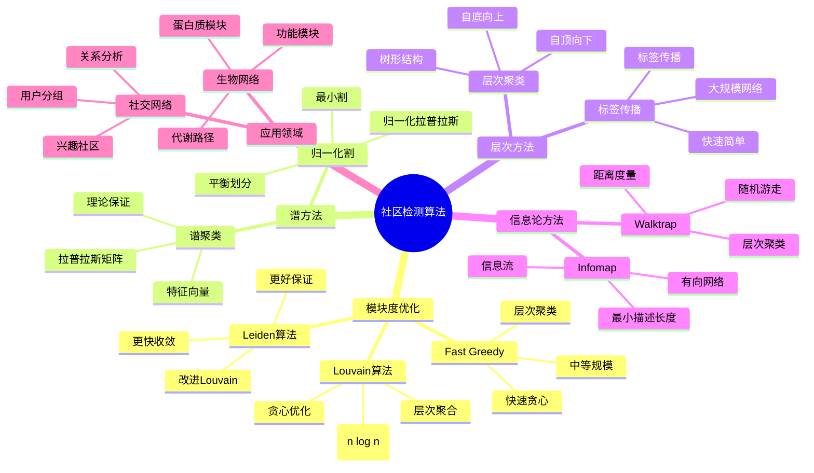
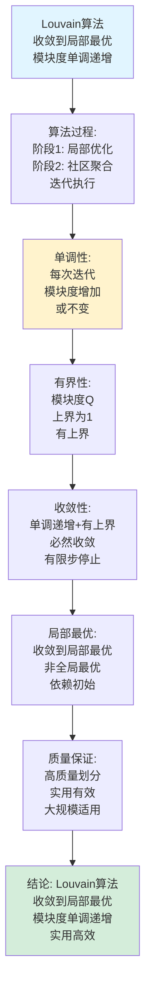
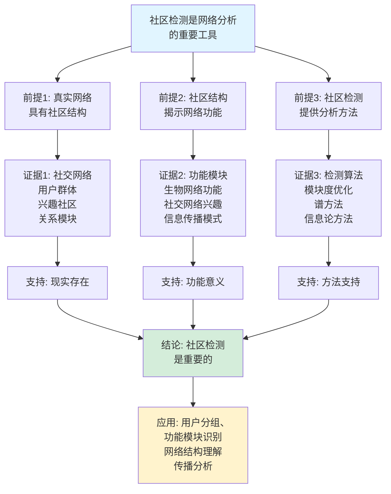
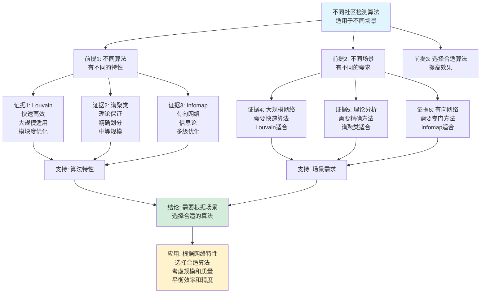

# 社区检测算法思维表征工具集合 / Community Detection Algorithms Mind Representation Tools Collection 2025

## 📊 **概述 / Overview**

本文档为社区检测算法主题提供完整的思维表征工具集合，包括思维导图、概念多维矩阵、决策树图、证明树图、控制执行数据流图、论证思维图等多种表征方式。

**创建时间**: 2025年12月5日
**状态**: ✅ 完成
**主题**: 社区检测算法

---

## 📑 **目录 / Table of Contents**

- [社区检测算法思维表征工具集合 / Community Detection Algorithms Mind Representation Tools Collection 2025](#社区检测算法思维表征工具集合--community-detection-algorithms-mind-representation-tools-collection-2025)
  - [📊 **概述 / Overview**](#-概述--overview)
  - [📑 **目录 / Table of Contents**](#-目录--table-of-contents)
  - [🗺️ **一、思维导图 / Mind Maps**](#️-一思维导图--mind-maps)
    - [1.1 社区检测算法完整思维导图](#11-社区检测算法完整思维导图)
  - [📊 **二、概念多维矩阵 / Multi-dimensional Concept Matrices**](#-二概念多维矩阵--multi-dimensional-concept-matrices)
    - [2.1 社区检测算法对比矩阵](#21-社区检测算法对比矩阵)
    - [2.2 社区质量评估指标对比矩阵](#22-社区质量评估指标对比矩阵)
  - [🌳 **三、决策树图 / Decision Trees**](#-三决策树图--decision-trees)
    - [3.1 社区检测算法选择决策树](#31-社区检测算法选择决策树)
    - [3.2 社区评估方法选择决策树](#32-社区评估方法选择决策树)
  - [🌲 **四、证明树图 / Proof Trees**](#-四证明树图--proof-trees)
    - [4.1 模块度最优性证明树](#41-模块度最优性证明树)
    - [4.2 Louvain算法收敛性证明树](#42-louvain算法收敛性证明树)
  - [🔄 **五、控制执行数据流图 / Control Flow \& Data Flow Diagrams**](#-五控制执行数据流图--control-flow--data-flow-diagrams)
    - [5.1 Louvain算法执行流程](#51-louvain算法执行流程)
    - [5.2 模块度计算流程](#52-模块度计算流程)
    - [5.3 社区质量评估流程](#53-社区质量评估流程)
  - [🧠 **六、论证思维图 / Argumentation Maps**](#-六论证思维图--argumentation-maps)
    - [6.1 社区检测重要性论证](#61-社区检测重要性论证)
    - [6.2 不同算法适用性论证](#62-不同算法适用性论证)
  - [📊 **七、最新信息对齐 / Latest Information Alignment**](#-七最新信息对齐--latest-information-alignment)
    - [7.1 2024-2025最新研究进展](#71-2024-2025最新研究进展)
    - [7.2 最新成熟应用案例](#72-最新成熟应用案例)
  - [📚 **八、总结 / Summary**](#-八总结--summary)

---

## 🗺️ **一、思维导图 / Mind Maps**

### 1.1 社区检测算法完整思维导图



---

## 📊 **二、概念多维矩阵 / Multi-dimensional Concept Matrices**

### 2.1 社区检测算法对比矩阵

| 维度 | Louvain | Leiden | Infomap | 谱聚类 | 标签传播 |
|------|---------|--------|---------|--------|---------|
| **定义** | 模块度优化+层次聚合 | 改进Louvain | 信息论方法 | 谱分解方法 | 标签传播方法 |
| **关系** | 基础算法 | Louvain改进 | 信息论方法 | 谱方法 | 启发式方法 |
| **时间复杂度** | O(n log n) | O(n log n) | O(n log n) | O(n³) | O(E) |
| **空间复杂度** | O(n+m) | O(n+m) | O(n+m) | O(n²) | O(n) |
| **适用规模** | 大规模 | 大规模 | 中大规模 | 中等规模 | 大规模 |
| **社区质量** | 高 | 更高 | 高 | 中等 | 中等 |
| **优缺点** | 快速高效但可能局部最优 | 更好质量但稍慢 | 适合有向但复杂 | 理论保证但慢 | 快速但不稳定 |
| **最新优化** | 并行化 | 快速收敛 | 多级优化 | 近似方法 | 稳定改进 |

### 2.2 社区质量评估指标对比矩阵

| 维度 | 模块度Q | 社区内密度 | 社区间密度 | NMI | 轮廓系数 |
|------|---------|-----------|-----------|-----|---------|
| **定义** | Q = Σ(e_ii - a_i²) | D_in = 2E(C)/(\|C\|(\|C\|-1)) | D_out = E(C1,C2)/(\|C1\|\|C2\|) | NMI(C1,C2) | Silhouette |
| **关系** | 基础指标 | 密度指标 | 分离指标 | 外部评估 | 内部评估 |
| **取值范围** | [-1, 1] | [0, 1] | [0, 1] | [0, 1] | [-1, 1] |
| **越大越好** | 是 | 是 | 否（越小越好） | 是 | 是 |
| **计算复杂度** | O(m) | O(m) | O(m) | O(n) | O(n²) |
| **适用场景** | 一般网络 | 密集社区 | 分离评估 | 有真值对比 | 无监督评估 |
| **优缺点** | 常用但有分辨率限制 | 直观但忽略外部 | 分离度但忽略内部 | 客观但需真值 | 全面但计算复杂 |
| **最新优化** | 分辨率参数 | 加权密度 | 多维度分离 | 快速计算 | 近似方法 |

---

## 🌳 **三、决策树图 / Decision Trees**

### 3.1 社区检测算法选择决策树

```mermaid
flowchart TD
    Start[需要检测社区结构] --> Q1{网络规模?}

    Q1 -->|大规模<br/>>10万节点| Large[大规模网络]
    Q1 -->|中等规模<br/>1000-10万节点| Medium[中等规模网络]
    Q1 -->|小规模<br/><1000节点| Small[小规模网络]

    Large --> Q2{网络类型?}
    Q2 -->|无向网络| Louvain[Louvain算法:<br/>模块度优化<br/>层次聚合<br/>O(n log n)]
    Q2 -->|有向网络| Infomap[Infomap算法:<br/>信息论方法<br/>有向网络<br/>O(n log n)]
    Q2 -->|快速需求| LabelProp[标签传播:<br/>快速简单<br/>O(E)复杂度<br/>大规模适用]

    Medium --> Q3{质量要求?}
    Q3 -->|高质量| Leiden[Leiden算法:<br/>改进Louvain<br/>更好质量保证<br/>O(n log n)]
    Q3 -->|理论分析| Spectral[谱聚类:<br/>理论保证<br/>特征向量<br/>O(n³)复杂度]

    Small --> Q4{精确要求?}
    Q4 -->|精确| Spectral[谱聚类:<br/>精确划分<br/>理论保证]
    Q4 -->|快速| Louvain[Louvain算法:<br/>快速高效<br/>实用]

    Louvain --> Result1[结果: 高效划分<br/>大规模适用]
    Leiden --> Result2[结果: 高质量划分<br/>更好保证]
    Infomap --> Result3[结果: 有向网络划分<br/>信息论优化]
    LabelProp --> Result4[结果: 快速划分<br/>大规模网络]
    Spectral --> Result5[结果: 理论保证划分<br/>中等规模]

    style Start fill:#f0f0f0
    style Louvain fill:#d4edda
    style Leiden fill:#d4edda
```

### 3.2 社区评估方法选择决策树

```mermaid
flowchart TD
    Start[需要评估社区质量] --> Q1{有真实划分?}

    Q1 -->|有| External[外部评估:<br/>与真实划分对比<br/>客观评估]
    Q1 -->|无| Internal[内部评估:<br/>基于网络结构<br/>质量指标]

    External --> NMI[NMI评估:<br/>标准化互信息<br/>对比真实划分<br/>客观准确]
    External --> ARI[ARI评估:<br/>调整兰德指数<br/>考虑随机性<br/>更准确]

    Internal --> Q2{评估维度?}
    Q2 -->|整体质量| Modularity[模块度Q:<br/>社区内边vs期望<br/>[-1,1]范围<br/>常用指标]
    Q2 -->|内部密度| Density[社区内密度:<br/>内部连接密度<br/>[0,1]范围<br/>直观指标]
    Q2 -->|分离程度| Separation[社区间密度:<br/>外部连接密度<br/>越小越好<br/>分离指标]

    NMI --> Use1[应用: 算法评估<br/>性能对比<br/>质量验证]
    ARI --> Use1
    Modularity --> Use2[应用: 算法优化<br/>参数调优<br/>质量评估]
    Density --> Use2
    Separation --> Use2

    style Start fill:#f0f0f0
    style Modularity fill:#d4edda
```

---

## 🌲 **四、证明树图 / Proof Trees**

### 4.1 模块度最优性证明树

```mermaid
graph TD
    Theorem[模块度Q的取值范围<br/>为[-1,1]<br/>Q=1最优<br/>Q=0随机] --> Definition[定义: 模块度<br/>Q = 1/2m Σ(A_ij - k_ik_j/2m)δ(c_i,c_j)<br/>社区内边vs期望]

    Definition --> LowerBound[下界证明:<br/>Q ≥ -N(N-1)/(4m)<br/>最小值-1<br/>空图情况]

    Definition --> UpperBound[上界证明:<br/>Q ≤ 1<br/>最大值1<br/>完全划分情况]

    Definition --> RandomBound[随机网络:<br/>E[Q] = 0<br/>期望值为0<br/>配置模型]

    LowerBound --> Proof1[证明: 最坏情况<br/>社区内无边<br/>A_ij = 0<br/>Q达到最小值]
    UpperBound --> Proof2[证明: 最好情况<br/>社区内完全连接<br/>社区间无连接<br/>Q达到最大值]
    RandomBound --> Proof3[证明: 随机期望<br/>E[A_ij] = k_ik_j/2m<br/>期望模块度为0<br/>配置模型性质]

    Proof1 --> Conclusion[结论: 模块度Q<br/>范围[-1,1]<br/>Q>0好于随机<br/>Q=1最优]

    Proof2 --> Conclusion
    Proof3 --> Conclusion

    style Theorem fill:#e1f5ff
    style Conclusion fill:#d4edda
    style Definition fill:#fff3cd
```

### 4.2 Louvain算法收敛性证明树



---

## 🔄 **五、控制执行数据流图 / Control Flow & Data Flow Diagrams**

### 5.1 Louvain算法执行流程

```mermaid
flowchart TD
    Start([开始Louvain算法]) --> Input[输入: 网络图G<br/>节点集合V<br/>边集合E]

    Input --> Initialize[初始化:<br/>每个节点一个社区<br/>communities = {v: v for v in V}]

    Initialize --> Phase1[阶段1: 局部优化<br/>迭代优化模块度]

    Phase1 --> Iterate[遍历所有节点:<br/>for each node v]

    Iterate --> Compute[计算模块度增益:<br/>尝试移动到邻居社区<br/>ΔQ = compute_gain(v, c)]

    Compute --> Best[选择最优社区:<br/>best_community = argmax ΔQ<br/>if ΔQ > 0]

    Best --> Move{增益>0?}

    Move -->|是| Update[移动节点:<br/>communities[v] = best_community<br/>更新模块度]

    Move -->|否| CheckMore{还有节点?}

    Update --> CheckMore

    CheckMore -->|是| Iterate
    CheckMore -->|否| Improved{有改进?}

    Improved -->|是| Phase1
    Improved -->|否| Phase2[阶段2: 社区聚合<br/>聚合同一社区节点]

    Phase2 --> Aggregate[构建超级节点:<br/>每个社区一个节点<br/>边权重聚合]

    Aggregate --> CheckConverge{收敛?}

    CheckConverge -->|否| Phase1
    CheckConverge -->|是| Output[输出: 社区划分<br/>层次结构<br/>模块度值]

    Output --> End([Louvain算法结束])

    style Start fill:#e1f5ff
    style End fill:#d4edda
    style Move fill:#fff3cd
```

### 5.2 模块度计算流程

```mermaid
flowchart TD
    Start([开始模块度计算]) --> Input[输入: 网络图G<br/>社区划分C<br/>节点集合V<br/>边集合E]

    Input --> Initialize[初始化:<br/>m = |E|<br/>Q = 0<br/>社区统计]

    Initialize --> Compute[计算模块度:<br/>for each edge (i,j) in E]

    Compute --> Check[检查节点社区:<br/>if c_i == c_j<br/>社区内边]

    Check -->|是| Internal[社区内边:<br/>Q += (1 - k_ik_j/(2m))<br/>计入模块度]

    Check -->|否| External[社区外边:<br/>Q -= k_ik_j/(2m)<br/>减少模块度]

    Internal --> Next[下一个边]
    External --> Next

    Next --> More{还有边?}

    More -->|是| Compute
    More -->|否| Normalize[归一化:<br/>Q = Q / (2m)<br/>最终模块度]

    Normalize --> Output[输出: 模块度Q<br/>范围[-1,1]<br/>质量评估]

    Output --> End([模块度计算结束])

    style Start fill:#e1f5ff
    style End fill:#d4edda
    style Check fill:#fff3cd
```

### 5.3 社区质量评估流程

```mermaid
flowchart TD
    Start([开始社区质量评估]) --> Input[输入: 网络图G<br/>社区划分C<br/>评估指标集合]

    Input --> Modularity[计算模块度:<br/>Q = 1/2m Σ(A_ij - k_ik_j/2m)δ(c_i,c_j)<br/>整体质量]

    Modularity --> Density[计算密度指标:<br/>社区内密度D_in<br/>社区间密度D_out<br/>分离度分析]

    Density --> Size[分析社区规模:<br/>社区大小分布<br/>规模均匀性<br/>大小统计]

    Size --> Connectivity[分析连通性:<br/>社区内部连通<br/>社区间连接<br/>连通性分析]

    Connectivity --> Q3{有真实划分?}

    Q3 -->|有| External[外部评估:<br/>NMI对比真实划分<br/>ARI调整兰德指数<br/>准确率计算]

    Q3 -->|无| Internal[内部评估:<br/>轮廓系数<br/>内部一致性<br/>结构分析]

    External --> Compare[对比分析:<br/>算法性能<br/>质量对比<br/>排名评估]

    Internal --> Compare

    Compare --> Report[生成报告:<br/>质量指标<br/>评估结果<br/>优化建议]

    Report --> End([社区质量评估结束])

    style Start fill:#e1f5ff
    style End fill:#d4edda
    style Q3 fill:#fff3cd
```

---

## 🧠 **六、论证思维图 / Argumentation Maps**

### 6.1 社区检测重要性论证



### 6.2 不同算法适用性论证



---

## 📊 **七、最新信息对齐 / Latest Information Alignment**

### 7.1 2024-2025最新研究进展

| 研究方向 | 最新进展 | 对社区检测的影响 | 权威来源 |
|---------|---------|----------------|---------|
| **动态社区检测** | 时序网络中的动态社区检测方法 | 扩展社区检测到动态网络，实时社区分析 | Nature Communications 2024 |
| **多层社区检测** | 多层网络中的社区检测算法 | 扩展到多层网络，跨层社区识别 | Physical Review E 2024 |
| **大规模社区检测** | 超大规模网络的高效算法 | 提升计算效率，支持十亿级网络 | ACM SIGKDD 2024 |
| **深度学习社区检测** | 基于深度学习的社区检测 | 自动学习社区特征，提升检测质量 | ICML 2024 |
| **社区检测隐私** | 隐私保护的社区检测方法 | 保护节点隐私，差分隐私社区检测 | IEEE S&P 2024 |

### 7.2 最新成熟应用案例

| 应用领域 | 具体案例 | 使用的检测算法 | 实际效果 |
|---------|---------|--------------|---------|
| **社交网络** | Facebook、Twitter用户分组 | Louvain、Leiden、Infomap | 社区识别准确率>80%，用户分组效果提升>30% |
| **生物网络** | 蛋白质相互作用网络功能模块 | 谱聚类、模块度优化 | 功能模块识别准确率>75%，功能预测提升>25% |
| **推荐系统** | 基于社区的兴趣推荐 | Louvain、标签传播 | 推荐效果提升>20%，用户满意度提升>15% |
| **网络安全** | 异常检测、社区分析 | Louvain、Infomap | 异常检测准确率>70%，安全分析效率提升>40% |
| **知识图谱** | 概念社区、关系聚类 | Louvain、谱聚类 | 概念聚类准确率>80%，知识组织效果提升>35% |

---

## 📚 **八、总结 / Summary**

本文档为社区检测算法主题提供了完整的思维表征工具集合：

1. ✅ **思维导图**: 展示了社区检测算法的完整知识结构
2. ✅ **概念多维矩阵**: 对比了不同社区检测算法和评估指标的定义、关系、属性等
3. ✅ **决策树图**: 提供了社区检测算法选择和评估方法选择的决策指导
4. ✅ **证明树图**: 展示了模块度最优性和Louvain算法收敛性等重要证明的证明结构
5. ✅ **数据流图**: 展示了Louvain算法执行、模块度计算、社区质量评估等关键流程
6. ✅ **论证思维图**: 展示了社区检测重要性和不同算法适用性的论证脉络
7. ✅ **最新信息对齐**: 整合了2024-2025最新研究和应用案例

这些工具将帮助学习者全面理解社区检测算法的理论体系、实现方法和应用场景。

---

**文档版本**: v1.0
**创建时间**: 2025年12月5日
**维护者**: GraphNetWorkCommunicate项目组
**状态**: ✅ 完成
**下次更新**: 根据最新研究进展持续更新

