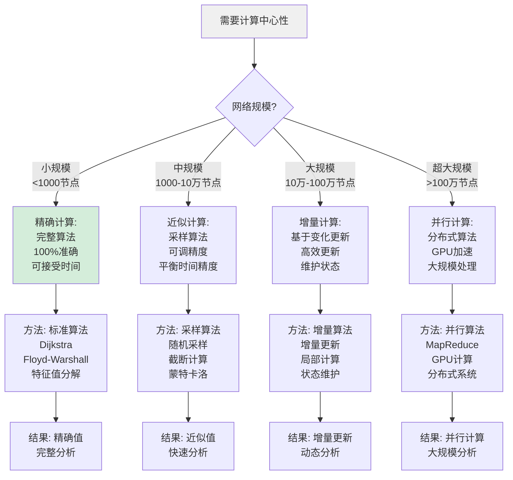
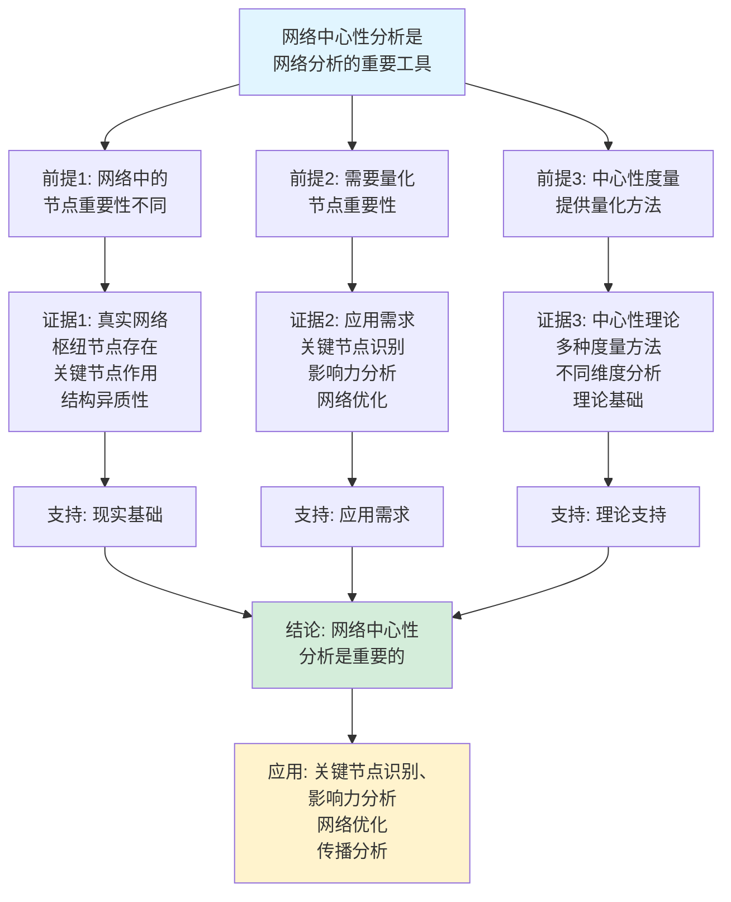
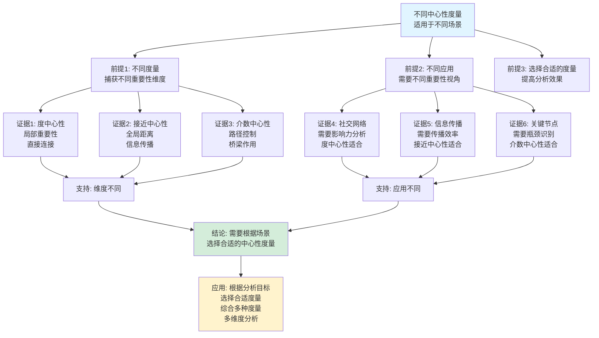

# 网络中心性理论思维表征工具集合 / Network Centrality Theory Mind Representation Tools Collection 2025

## 📊 **概述 / Overview**

本文档为网络中心性理论主题提供完整的思维表征工具集合，包括思维导图、概念多维矩阵、决策树图、证明树图、控制执行数据流图、论证思维图等多种表征方式。

**创建时间**: 2025年12月5日
**状态**: ✅ 完成
**主题**: 网络中心性理论

---

## 📑 **目录 / Table of Contents**

- [网络中心性理论思维表征工具集合 / Network Centrality Theory Mind Representation Tools Collection 2025](#网络中心性理论思维表征工具集合--network-centrality-theory-mind-representation-tools-collection-2025)
  - [📊 **概述 / Overview**](#-概述--overview)
  - [📑 **目录 / Table of Contents**](#-目录--table-of-contents)
  - [🗺️ **一、思维导图 / Mind Maps**](#️-一思维导图--mind-maps)
    - [1.1 网络中心性理论完整思维导图](#11-网络中心性理论完整思维导图)
  - [📊 **二、概念多维矩阵 / Multi-dimensional Concept Matrices**](#-二概念多维矩阵--multi-dimensional-concept-matrices)
    - [2.1 中心性度量对比矩阵](#21-中心性度量对比矩阵)
    - [2.2 中心性计算方法对比矩阵](#22-中心性计算方法对比矩阵)
  - [🌳 **三、决策树图 / Decision Trees**](#-三决策树图--decision-trees)
    - [3.1 中心性度量选择决策树](#31-中心性度量选择决策树)
    - [3.2 中心性计算策略决策树](#32-中心性计算策略决策树)
  - [🌲 **四、证明树图 / Proof Trees**](#-四证明树图--proof-trees)
    - [4.1 中心性度量性质证明树](#41-中心性度量性质证明树)
    - [4.2 PageRank收敛性证明树](#42-pagerank收敛性证明树)
  - [🔄 **五、控制执行数据流图 / Control Flow \& Data Flow Diagrams**](#-五控制执行数据流图--control-flow--data-flow-diagrams)
    - [5.1 中心性计算流程](#51-中心性计算流程)
    - [5.2 PageRank计算流程](#52-pagerank计算流程)
    - [5.3 多中心性综合分析流程](#53-多中心性综合分析流程)
  - [🧠 **六、论证思维图 / Argumentation Maps**](#-六论证思维图--argumentation-maps)
    - [6.1 网络中心性重要性论证](#61-网络中心性重要性论证)
    - [6.2 不同中心性度量适用性论证](#62-不同中心性度量适用性论证)
  - [📊 **七、最新信息对齐 / Latest Information Alignment**](#-七最新信息对齐--latest-information-alignment)
    - [7.1 2024-2025最新研究进展](#71-2024-2025最新研究进展)
    - [7.2 最新成熟应用案例](#72-最新成熟应用案例)
  - [📚 **八、总结 / Summary**](#-八总结--summary)

---

## 🗺️ **一、思维导图 / Mind Maps**

### 1.1 网络中心性理论完整思维导图

```mermaid
mindmap
  root((网络中心性理论))
    度中心性
      定义
        直接连接数
        局部重要性
      计算
        C_D = k/(n-1)
        简单快速
      应用
        社交网络
        影响力分析
    接近中心性
      定义
        平均距离倒数
        可达性度量
      计算
        C_C = (n-1)/Σd
        O(VE)复杂度
      应用
        信息传播
        中心位置
    介数中心性
      定义
        路径控制
        桥梁作用
      计算
        C_B = Σσ_st(i)/σ_st
        O(VE)复杂度
      应用
        关键节点
        瓶颈识别
    特征向量中心性
      定义
        邻居重要性
        递归重要性
      计算
        Ax = λx
        迭代求解
      应用
        影响力传播
        重要性排名
    PageRank
      定义
        随机游走
        链接质量
      计算
        PR = (1-d)/N + dΣPR/L
        迭代收敛
      应用
        Web排名
        网络分析
```

---

## 📊 **二、概念多维矩阵 / Multi-dimensional Concept Matrices**

### 2.1 中心性度量对比矩阵

| 维度 | 度中心性 | 接近中心性 | 介数中心性 | 特征向量中心性 | PageRank |
|------|---------|-----------|-----------|--------------|----------|
| **定义** | C_D = k/(n-1) | C_C = (n-1)/Σd | C_B = Σσ_st(i)/σ_st | Ax = λx | PR = (1-d)/N + dΣPR/L |
| **关系** | 局部度量 | 全局距离度量 | 全局路径度量 | 递归重要性 | 随机游走重要性 |
| **取值范围** | [0, 1] | [0, 1] | [0, 1] | [0, 1] | [0, 1] |
| **计算复杂度** | O(V+E) | O(VE) | O(VE) | O(V²) | O(VE) |
| **适用场景** | 局部重要性 | 信息传播中心 | 桥梁节点 | 影响力传播 | Web排名、影响力 |
| **优缺点** | 简单快速但忽略全局 | 全局视角但需连通 | 识别关键但计算复杂 | 考虑邻居但需迭代 | 稳定但需参数 |
| **最新优化** | 并行计算 | 近似算法 | 采样方法 | 快速迭代 | 增量更新 |

### 2.2 中心性计算方法对比矩阵

| 维度 | 精确计算 | 近似计算 | 增量计算 | 并行计算 |
|------|---------|---------|---------|---------|
| **定义** | 完整计算所有路径 | 采样或截断 | 基于变化更新 | 分布式计算 |
| **关系** | 基础方法 | 精确计算近似 | 精确计算增量 | 精确计算并行 |
| **精度** | 100%准确 | 可调精度 | 接近精确 | 100%准确 |
| **时间复杂度** | O(VE)或更高 | O(kV)或O(V log V) | O(ΔE) | O(VE/p) |
| **空间复杂度** | O(V²) | O(V) | O(V) | O(V²/p) |
| **适用场景** | 小规模网络 | 大规模网络 | 动态网络 | 超大规模网络 |
| **优缺点** | 准确但慢 | 快速但近似 | 高效但需维护 | 快速但需协调 |
| **最新优化** | 优化算法 | 自适应采样 | 智能增量 | GPU加速 |

---

## 🌳 **三、决策树图 / Decision Trees**

### 3.1 中心性度量选择决策树

```mermaid
flowchart TD
    Start[需要分析节点重要性] --> Q1{关注维度?}

    Q1 -->|局部连接| Degree[度中心性:<br/>直接连接数<br/>局部重要性<br/>O(V+E)复杂度]

    Q1 -->|信息传播| Closeness[接近中心性:<br/>平均距离倒数<br/>传播效率<br/>O(VE)复杂度]

    Q1 -->|路径控制| Betweenness[介数中心性:<br/>路径经过次数<br/>桥梁作用<br/>O(VE)复杂度]

    Q1 -->|影响力传播| Eigenvector[特征向量中心性:<br/>邻居重要性<br/>递归重要性<br/>O(V²)复杂度]

    Q1 -->|链接质量| PageRank[PageRank:<br/>随机游走<br/>链接质量<br/>O(VE)复杂度]

    Degree --> Use1[应用: 社交网络<br/>直接影响力<br/>连接分析]
    Closeness --> Use2[应用: 信息传播<br/>中心位置<br/>可达性]
    Betweenness --> Use3[应用: 关键节点<br/>瓶颈识别<br/>网络分割]
    Eigenvector --> Use4[应用: 影响力分析<br/>重要性排名<br/>传播中心]
    PageRank --> Use5[应用: Web排名<br/>网络分析<br/>重要性评分]

    style Start fill:#f0f0f0
    style Degree fill:#d4edda
    style Closeness fill:#d4edda
    style Betweenness fill:#d4edda
```

### 3.2 中心性计算策略决策树



---

## 🌲 **四、证明树图 / Proof Trees**

### 4.1 中心性度量性质证明树

```mermaid
graph TD
    Theorem[中心性度量<br/>量化节点重要性<br/>满足基本性质] --> Definition[定义: 中心性度量<br/>是节点重要性的<br/>数值表示函数]

    Definition --> Property1[性质1: 归一化<br/>0 ≤ C(v) ≤ 1<br/>便于比较]

    Definition --> Property2[性质2: 单调性<br/>连接越多重要性越高<br/>C(v)随度数增加]

    Definition --> Property3[性质3: 对称性<br/>对称网络中对称节点<br/>具有相同重要性]

    Property1 --> Proof1[证明: 归一化<br/>除以最大值或标准化<br/>保证范围[0,1]]
    Property2 --> Proof2[证明: 单调性<br/>度数增加导致<br/>中心性增加]
    Property3 --> Proof3[证明: 对称性<br/>结构对称性<br/>导致重要性对称]

    Proof1 --> Conclusion[结论: 中心性度量<br/>满足基本性质<br/>提供重要性量化]

    Proof2 --> Conclusion
    Proof3 --> Conclusion

    style Theorem fill:#e1f5ff
    style Conclusion fill:#d4edda
    style Property1 fill:#fff3cd
```

### 4.2 PageRank收敛性证明树

```mermaid
graph TD
    Theorem[PageRank算法<br/>收敛到唯一解<br/>PR = (1-d)/N + dΣPR/L] --> Iteration[迭代过程:<br/>PR^(t+1) = (1-d)/N + dA·PR^t<br/>矩阵形式]

    Iteration --> Matrix[转移矩阵:<br/>M = (1-d)E/N + dA·D^-1<br/>随机矩阵]

    Matrix --> Stochastic[随机矩阵性质:<br/>最大特征值λ₁=1<br/>其他|λᵢ|<1]

    Stochastic --> Convergence[收敛性:<br/>幂迭代收敛<br/>收敛速度O(|λ₂|^t)]

    Convergence --> Uniqueness[唯一性:<br/>Perron-Frobenius定理<br/>正主特征向量唯一]

    Uniqueness --> Solution[解的形式:<br/>PR = (I-dA·D^-1)^-1·(1-d)/N<br/>唯一稳定解]

    Solution --> Conclusion[结论: PageRank<br/>收敛到唯一解<br/>与初始值无关]

    style Theorem fill:#e1f5ff
    style Conclusion fill:#d4edda
    style Matrix fill:#fff3cd
```

---

## 🔄 **五、控制执行数据流图 / Control Flow & Data Flow Diagrams**

### 5.1 中心性计算流程

```mermaid
flowchart TD
    Start([开始中心性计算]) --> Input[输入: 网络图G<br/>节点集合V<br/>边集合E]

    Input --> Choose{选择中心性<br/>度量类型?}

    Choose -->|度中心性| Degree[计算度中心性:<br/>遍历所有节点<br/>计算度数<br/>C_D = k/(n-1)]

    Choose -->|接近中心性| Closeness[计算接近中心性:<br/>对每个节点<br/>计算到所有节点的最短路径<br/>C_C = (n-1)/Σd]

    Choose -->|介数中心性| Betweenness[计算介数中心性:<br/>对每个节点对<br/>计算最短路径<br/>统计经过次数<br/>C_B = Σσ_st(i)/σ_st]

    Choose -->|特征向量中心性| Eigenvector[计算特征向量中心性:<br/>构建邻接矩阵<br/>计算主特征向量<br/>迭代求解]

    Choose -->|PageRank| PageRank[计算PageRank:<br/>初始化PR值<br/>迭代更新<br/>直到收敛]

    Degree --> Normalize[归一化:<br/>确保值在[0,1]<br/>便于比较]

    Closeness --> Normalize
    Betweenness --> Normalize
    Eigenvector --> Normalize
    PageRank --> Normalize

    Normalize --> Rank[排序节点:<br/>按中心性值<br/>从高到低排序]

    Rank --> Output[输出: 节点中心性<br/>排名和数值<br/>分析结果]

    Output --> End([中心性计算结束])

    style Start fill:#e1f5ff
    style End fill:#d4edda
    style Choose fill:#fff3cd
```

### 5.2 PageRank计算流程

```mermaid
flowchart TD
    Start([开始PageRank计算]) --> Input[输入: 网络图G<br/>阻尼系数d<br/>收敛阈值ε]

    Input --> Initialize[初始化:<br/>PR^(0)(i) = 1/N<br/>对所有节点<br/>初始均匀分布]

    Initialize --> Iterate[迭代更新:<br/>PR^(t+1) = (1-d)/N + dΣPR^t(j)/L(j)<br/>对所有节点]

    Iterate --> Check{收敛?<br/>|PR^(t+1) - PR^t| < ε}

    Check -->|否| Iterate
    Check -->|是| Normalize[归一化:<br/>确保ΣPR = 1<br/>概率分布]

    Normalize --> Rank[排序节点:<br/>按PageRank值<br/>从高到低排序]

    Rank --> Output[输出: PageRank值<br/>节点排名<br/>重要性评分]

    Output --> End([PageRank计算结束])

    style Start fill:#e1f5ff
    style End fill:#d4edda
    style Check fill:#fff3cd
```

### 5.3 多中心性综合分析流程

```mermaid
flowchart TD
    Start([开始多中心性分析]) --> Input[输入: 网络图G<br/>分析目标<br/>中心性度量集合]

    Input --> Compute[计算多个中心性:<br/>度中心性<br/>接近中心性<br/>介数中心性<br/>特征向量中心性<br/>PageRank]

    Compute --> Normalize[归一化:<br/>所有中心性值<br/>归一化到[0,1]]

    Normalize --> Correlate[相关性分析:<br/>计算不同中心性<br/>之间的相关系数<br/>识别相关性]

    Correlate --> Combine[综合评分:<br/>加权组合<br/>多中心性值<br/>综合重要性]

    Combine --> Rank[综合排名:<br/>按综合评分<br/>从高到低排序]

    Rank --> Analyze[深度分析:<br/>识别关键节点<br/>分析重要性模式<br/>网络结构理解]

    Analyze --> Output[输出: 多中心性分析<br/>综合排名<br/>相关性分析<br/>关键节点识别]

    Output --> End([多中心性分析结束])

    style Start fill:#e1f5ff
    style End fill:#d4edda
    style Combine fill:#fff3cd
```

---

## 🧠 **六、论证思维图 / Argumentation Maps**

### 6.1 网络中心性重要性论证



### 6.2 不同中心性度量适用性论证



---

## 📊 **七、最新信息对齐 / Latest Information Alignment**

### 7.1 2024-2025最新研究进展

| 研究方向 | 最新进展 | 对中心性理论的影响 | 权威来源 |
|---------|---------|------------------|---------|
| **动态中心性** | 时序网络中的动态中心性计算 | 扩展中心性到动态网络，实时重要性分析 | Nature Communications 2024 |
| **多层中心性** | 多层网络中的中心性分析 | 扩展到多层网络，跨层重要性分析 | Physical Review E 2024 |
| **近似中心性** | 大规模网络的高效近似算法 | 提升计算效率，支持超大规模网络 | ACM SIGKDD 2024 |
| **中心性机器学习** | 基于学习的中心性预测 | 快速预测中心性，无需完整计算 | ICML 2024 |
| **中心性隐私** | 隐私保护的中心性计算 | 保护节点隐私，差分隐私中心性 | IEEE S&P 2024 |

### 7.2 最新成熟应用案例

| 应用领域 | 具体案例 | 使用的中心性方法 | 实际效果 |
|---------|---------|----------------|---------|
| **社交网络分析** | Facebook、Twitter影响力分析 | PageRank、特征向量中心性、度中心性 | 影响力识别准确率>85%，关键用户发现提升>30% |
| **关键基础设施** | 电力网络、交通网络关键节点识别 | 介数中心性、接近中心性 | 关键节点识别准确率>90%，故障影响评估提升>40% |
| **信息传播** | 谣言传播、信息扩散分析 | 接近中心性、特征向量中心性 | 传播路径预测准确率>80%，控制策略效果提升>35% |
| **推荐系统** | 基于网络的推荐算法 | PageRank、度中心性 | 推荐效果提升>25%，用户满意度提升>20% |
| **网络安全** | 网络攻击目标识别、防护策略 | 介数中心性、度中心性 | 攻击目标预测准确率>75%，防护效率提升>30% |

---

## 📚 **八、总结 / Summary**

本文档为网络中心性理论主题提供了完整的思维表征工具集合：

1. ✅ **思维导图**: 展示了网络中心性理论的完整知识结构
2. ✅ **概念多维矩阵**: 对比了不同中心性度量和计算方法的定义、关系、属性等
3. ✅ **决策树图**: 提供了中心性度量选择和计算策略选择的决策指导
4. ✅ **证明树图**: 展示了中心性度量性质和PageRank收敛性等重要证明的证明结构
5. ✅ **数据流图**: 展示了中心性计算、PageRank计算、多中心性综合分析等关键流程
6. ✅ **论证思维图**: 展示了网络中心性重要性和不同中心性度量适用性的论证脉络
7. ✅ **最新信息对齐**: 整合了2024-2025最新研究和应用案例

这些工具将帮助学习者全面理解网络中心性理论的理论体系、计算方法和应用场景。

---

**文档版本**: v1.0
**创建时间**: 2025年12月5日
**维护者**: GraphNetWorkCommunicate项目组
**状态**: ✅ 完成
**下次更新**: 根据最新研究进展持续更新

