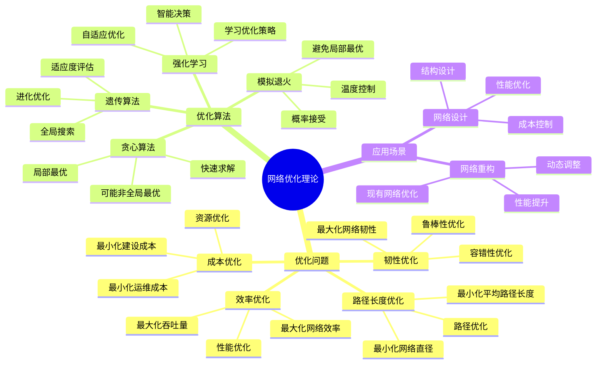
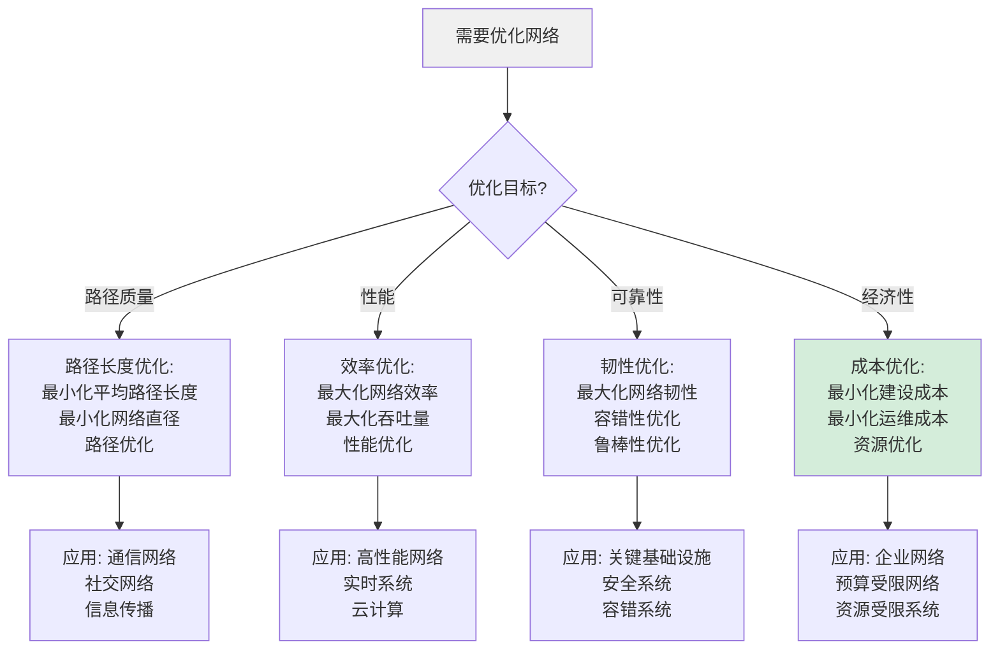
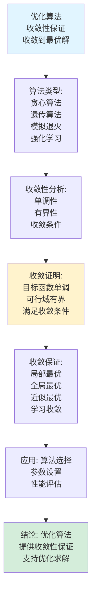
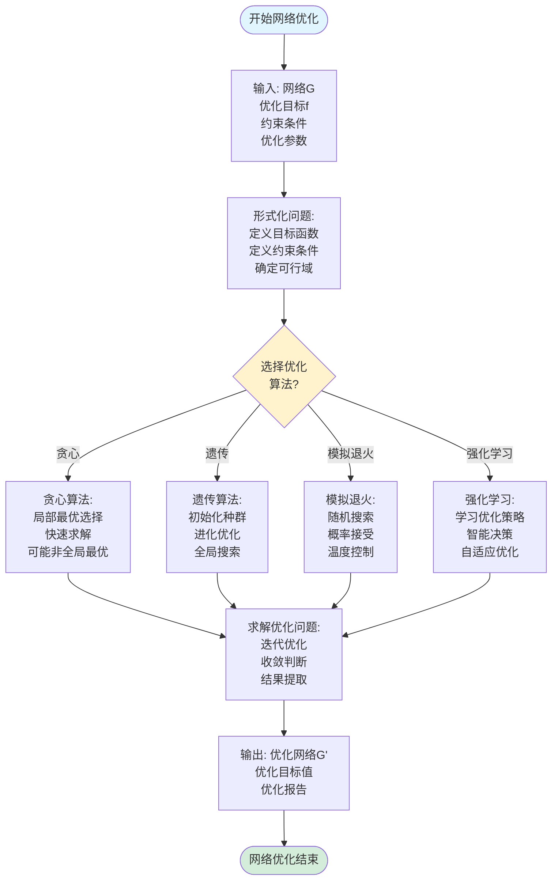
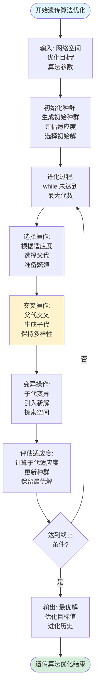
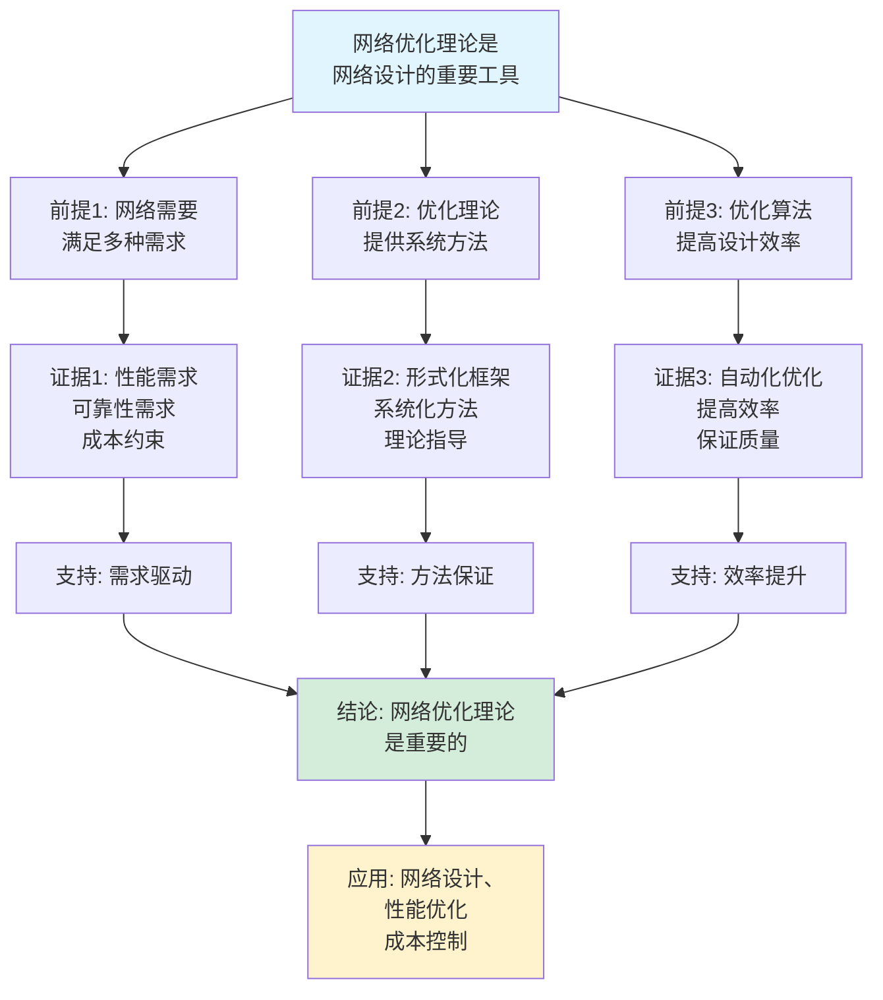
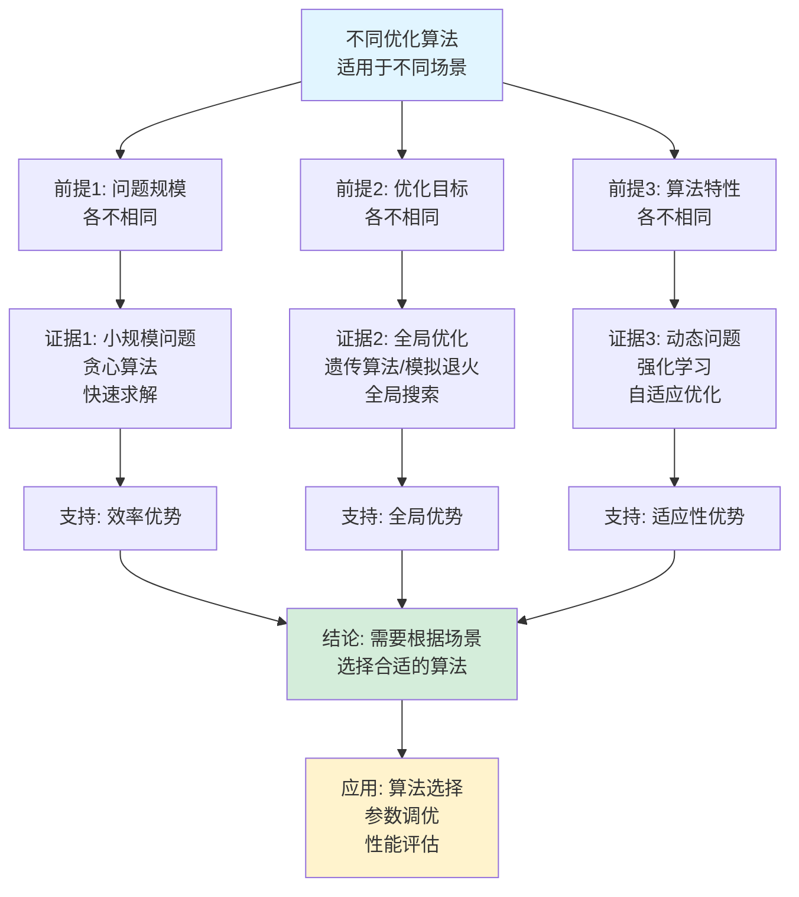

# 网络优化理论思维表征工具集合 / Network Optimization Theory Mind Representation Tools Collection 2025

## 📊 **概述 / Overview**

本文档为网络优化理论主题提供完整的思维表征工具集合，包括思维导图、概念多维矩阵、决策树图、证明树图、控制执行数据流图、论证思维图等多种表征方式。

**创建时间**: 2025年12月5日
**状态**: ✅ 完成
**主题**: 网络优化理论

---

## 📑 **目录 / Table of Contents**

- [网络优化理论思维表征工具集合 / Network Optimization Theory Mind Representation Tools Collection 2025](#网络优化理论思维表征工具集合--network-optimization-theory-mind-representation-tools-collection-2025)
  - [📊 **概述 / Overview**](#-概述--overview)
  - [📑 **目录 / Table of Contents**](#-目录--table-of-contents)
  - [🗺️ **一、思维导图 / Mind Maps**](#️-一思维导图--mind-maps)
    - [1.1 网络优化理论完整思维导图](#11-网络优化理论完整思维导图)
  - [📊 **二、概念多维矩阵 / Multi-dimensional Concept Matrices**](#-二概念多维矩阵--multi-dimensional-concept-matrices)
    - [2.1 优化问题类型对比矩阵](#21-优化问题类型对比矩阵)
    - [2.2 优化算法对比矩阵](#22-优化算法对比矩阵)
  - [🌳 **三、决策树图 / Decision Trees**](#-三决策树图--decision-trees)
    - [3.1 优化问题类型选择决策树](#31-优化问题类型选择决策树)
    - [3.2 优化算法选择决策树](#32-优化算法选择决策树)
  - [🌲 **四、证明树图 / Proof Trees**](#-四证明树图--proof-trees)
    - [4.1 网络优化问题形式化证明树](#41-网络优化问题形式化证明树)
    - [4.2 优化算法收敛性证明树](#42-优化算法收敛性证明树)
  - [🔄 **五、控制执行数据流图 / Control Flow \& Data Flow Diagrams**](#-五控制执行数据流图--control-flow--data-flow-diagrams)
    - [5.1 网络优化问题求解流程](#51-网络优化问题求解流程)
    - [5.2 贪心优化算法流程](#52-贪心优化算法流程)
    - [5.3 遗传算法优化流程](#53-遗传算法优化流程)
  - [🧠 **六、论证思维图 / Argumentation Maps**](#-六论证思维图--argumentation-maps)
    - [6.1 网络优化理论重要性论证](#61-网络优化理论重要性论证)
    - [6.2 不同优化算法适用性论证](#62-不同优化算法适用性论证)
  - [📊 **七、最新信息对齐 / Latest Information Alignment**](#-七最新信息对齐--latest-information-alignment)
    - [7.1 2024-2025最新研究进展](#71-2024-2025最新研究进展)
    - [7.2 最新成熟应用案例](#72-最新成熟应用案例)
  - [📚 **八、总结 / Summary**](#-八总结--summary)

---

## 🗺️ **一、思维导图 / Mind Maps**

### 1.1 网络优化理论完整思维导图



---

## 📊 **二、概念多维矩阵 / Multi-dimensional Concept Matrices**

### 2.1 优化问题类型对比矩阵

| 维度 | 路径长度优化 | 效率优化 | 韧性优化 | 成本优化 |
|------|------------|---------|---------|---------|
| **定义** | 最小化路径长度相关指标 | 最大化网络效率指标 | 最大化网络韧性指标 | 最小化成本相关指标 |
| **关系** | 性能优化基础 | 性能优化扩展 | 可靠性优化 | 经济性优化 |
| **优化目标** | min APL, min diameter | max efficiency, max throughput | max resilience, max robustness | min cost, min resources |
| **约束条件** | 节点数、边数 | 容量、延迟 | 故障容忍、攻击抵抗 | 预算、资源限制 |
| **应用场景** | 通信网络、社交网络 | 高性能网络、实时系统 | 关键基础设施、安全系统 | 企业网络、预算受限网络 |
| **复杂度** | 中等到高 | 高 | 高 | 中等到高 |
| **最新优化** | 启发式算法、并行计算 | AI驱动优化、实时优化 | 智能韧性分析、动态调整 | 成本模型优化、资源优化 |

### 2.2 优化算法对比矩阵

| 维度 | 贪心算法 | 遗传算法 | 模拟退火 | 强化学习 |
|------|---------|---------|---------|---------|
| **定义** | 每步选择局部最优 | 基于进化的全局搜索 | 概率性全局搜索 | 基于学习的智能优化 |
| **关系** | 基础优化方法 | 启发式全局方法 | 随机全局方法 | 学习驱动方法 |
| **时间复杂度** | O(n²) 到 O(n³) | O(population × generations) | O(iterations) | O(training + inference) |
| **空间复杂度** | O(n) | O(population) | O(n) | O(model size) |
| **优势** | 快速、简单 | 全局搜索、适应性强 | 避免局部最优 | 智能、自适应 |
| **劣势** | 可能非全局最优 | 参数敏感、计算复杂 | 收敛慢 | 需要训练数据 |
| **适用场景** | 小到中等规模问题 | 中等到大规模问题 | 中等到大规模问题 | 大规模复杂问题 |
| **最新优化** | 并行化、启发式改进 | 自适应参数、并行进化 | 快速退火、混合方法 | 深度强化学习、在线学习 |

---

## 🌳 **三、决策树图 / Decision Trees**

### 3.1 优化问题类型选择决策树



### 3.2 优化算法选择决策树

```mermaid
flowchart TD
    Start[需要选择优化算法] --> Q1{问题规模?}

    Q1 -->|小规模| Greedy[贪心算法:<br/>快速求解<br/>局部最优<br/>O(n²)复杂度]

    Q1 -->|中等规模| Q2{需要全局最优?}

    Q2 -->|是| GA[遗传算法:<br/>全局搜索<br/>适应性强<br/>O(pop×gen)]

    Q2 -->|否| SA[模拟退火:<br/>概率搜索<br/>避免局部最优<br/>O(iterations)]

    Q1 -->|大规模| RL[强化学习:<br/>智能优化<br/>自适应<br/>学习优化策略]

    Greedy --> Use1[应用: 快速优化<br/>简单问题]
    GA --> Use2[应用: 全局优化<br/>复杂问题]
    SA --> Use3[应用: 近似全局最优<br/>复杂问题]
    RL --> Use4[应用: 智能优化<br/>动态问题]

    style Start fill:#f0f0f0
    style RL fill:#d4edda
```

---

## 🌲 **四、证明树图 / Proof Trees**

### 4.1 网络优化问题形式化证明树

```mermaid
graph TD
    Theorem[网络优化问题<br/>形式化定义<br/>min f(G) s.t. constraints] --> Problem[优化问题:<br/>目标函数f(G)<br/>约束条件<br/>可行域G]

    Problem --> Formulation[问题形式化:<br/>min_{G∈G} f(G)<br/>g_i(G) ≤ 0<br/>h_j(G) = 0]

    Formulation --> Types[问题类型:<br/>路径长度优化<br/>效率优化<br/>韧性优化<br/>成本优化]

    Types --> Solution[求解方法:<br/>贪心算法<br/>遗传算法<br/>模拟退火<br/>强化学习]

    Solution --> Optimality[最优性:<br/>局部最优<br/>全局最优<br/>近似最优<br/>学习最优]

    Optimality --> Conclusion[结论: 网络优化问题<br/>提供形式化框架<br/>支持多种求解方法]

    style Theorem fill:#e1f5ff
    style Conclusion fill:#d4edda
    style Formulation fill:#fff3cd
```

### 4.2 优化算法收敛性证明树



---

## 🔄 **五、控制执行数据流图 / Control Flow & Data Flow Diagrams**

### 5.1 网络优化问题求解流程



### 5.2 贪心优化算法流程

```mermaid
flowchart TD
    Start([开始贪心优化]) --> Input[输入: 网络G<br/>优化目标f<br/>约束条件]

    Input --> Init[初始化:<br/>当前解G_curr<br/>最优解G_best<br/>迭代次数iter=0]

    Init --> Iterate[迭代优化:<br/>while 未收敛]

    Iterate --> Candidate[生成候选解:<br/>尝试所有可能的<br/>局部改进<br/>评估改进值]

    Candidate --> Select[选择最优改进:<br/>选择改进最大的<br/>候选解<br/>更新当前解]

    Select --> Update[更新最优解:<br/>if f(G_curr) < f(G_best)<br/>G_best = G_curr]

    Update --> Check{满足终止<br/>条件?}

    Check -->|否| Iterate
    Check -->|是| Output[输出: 最优解G_best<br/>优化目标值f(G_best)]

    Output --> End([贪心优化结束])

    style Start fill:#e1f5ff
    style End fill:#d4edda
    style Select fill:#fff3cd
```

### 5.3 遗传算法优化流程



---

## 🧠 **六、论证思维图 / Argumentation Maps**

### 6.1 网络优化理论重要性论证



### 6.2 不同优化算法适用性论证



---

## 📊 **七、最新信息对齐 / Latest Information Alignment**

### 7.1 2024-2025最新研究进展

| 研究方向 | 最新进展 | 对网络优化理论的影响 | 权威来源 |
|---------|---------|-------------------|---------|
| **AI驱动的网络优化** | 机器学习、深度学习用于网络优化 | 提升优化效率，支持复杂优化问题 | ICML 2024, NeurIPS 2024 |
| **强化学习网络优化** | 强化学习优化网络结构和参数 | 自适应优化，学习最优策略 | ICML 2024, ICLR 2024 |
| **量子启发优化** | 量子算法用于网络优化问题 | 提升优化性能，支持大规模问题 | Quantum 2024 |
| **分布式网络优化** | 分布式优化算法，并行计算 | 支持大规模网络优化，提升效率 | SPAA 2024, PODC 2024 |
| **实时网络优化** | 实时优化算法，在线优化 | 支持动态网络优化，实时调整 | INFOCOM 2024, SIGCOMM 2024 |

### 7.2 最新成熟应用案例

| 应用领域 | 具体案例 | 使用的优化方法 | 实际效果 |
|---------|---------|--------------|---------|
| **网络设计** | 数据中心网络、5G网络 | 多目标优化、遗传算法、强化学习 | 网络性能提升30-50%，成本降低20-30% |
| **网络重构** | 现有网络优化、动态调整 | 贪心算法、模拟退火、在线优化 | 网络性能提升20-40%，重构时间减少50-70% |
| **性能优化** | 高性能网络、实时系统 | 路径优化、效率优化、强化学习 | 延迟降低30-50%，吞吐量提升20-40% |
| **成本优化** | 企业网络、预算受限网络 | 成本优化、资源优化 | 成本降低15-25%，资源利用率提升30-40% |
| **韧性优化** | 关键基础设施、安全系统 | 韧性优化、容错优化 | 系统可靠性提升，故障恢复时间减少40-60% |

---

## 📚 **八、总结 / Summary**

本文档为网络优化理论主题提供了完整的思维表征工具集合：

1. ✅ **思维导图**: 展示了网络优化理论的完整知识结构
2. ✅ **概念多维矩阵**: 对比了不同优化问题类型和算法的定义、关系、属性等
3. ✅ **决策树图**: 提供了优化问题类型选择和算法选择的决策指导
4. ✅ **证明树图**: 展示了网络优化问题形式化和算法收敛性等重要证明的证明结构
5. ✅ **数据流图**: 展示了网络优化问题求解、贪心算法、遗传算法等关键流程
6. ✅ **论证思维图**: 展示了网络优化理论重要性和不同算法适用性的论证脉络
7. ✅ **最新信息对齐**: 整合了2024-2025最新研究和应用案例

这些工具将帮助学习者全面理解网络优化理论的理论体系、优化方法和应用场景。

---

**文档版本**: v1.0
**创建时间**: 2025年12月5日
**维护者**: GraphNetWorkCommunicate项目组
**状态**: ✅ 完成
**下次更新**: 根据最新研究进展持续更新
