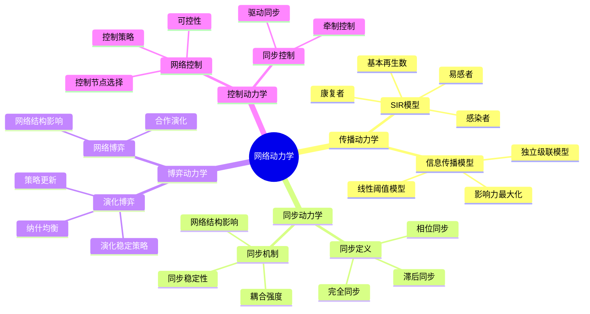
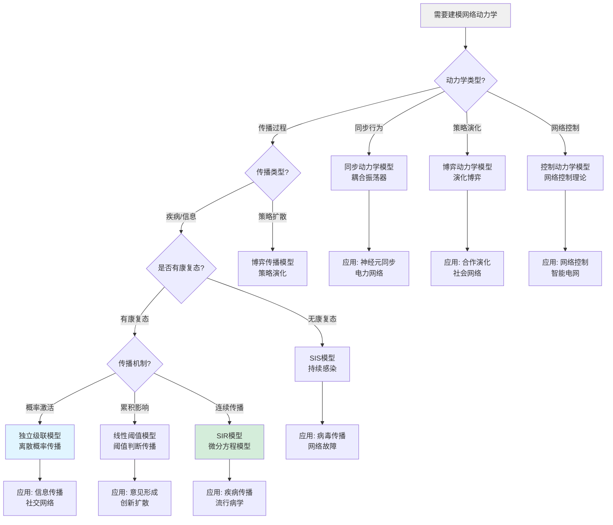
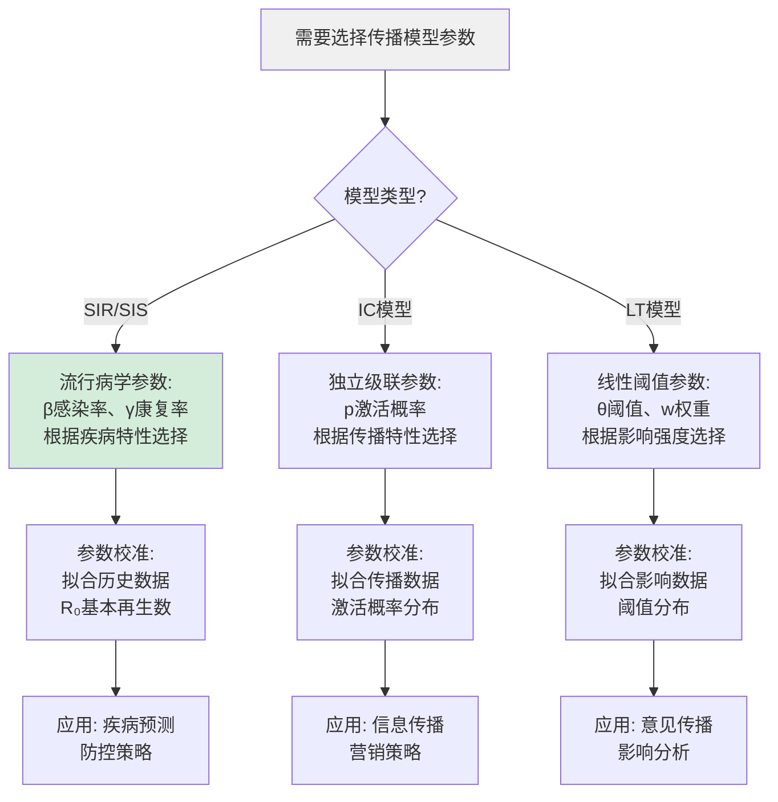
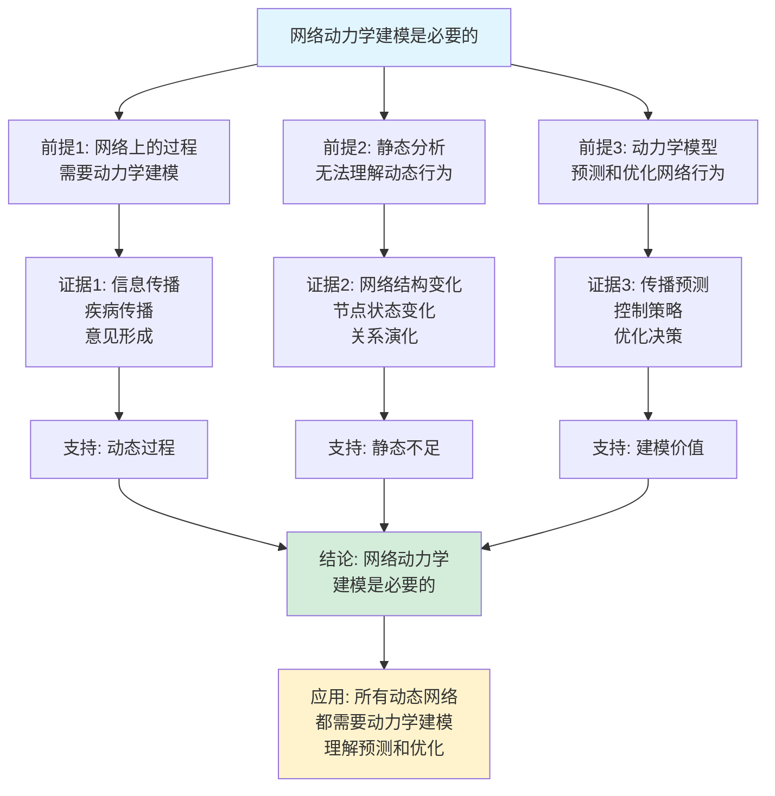
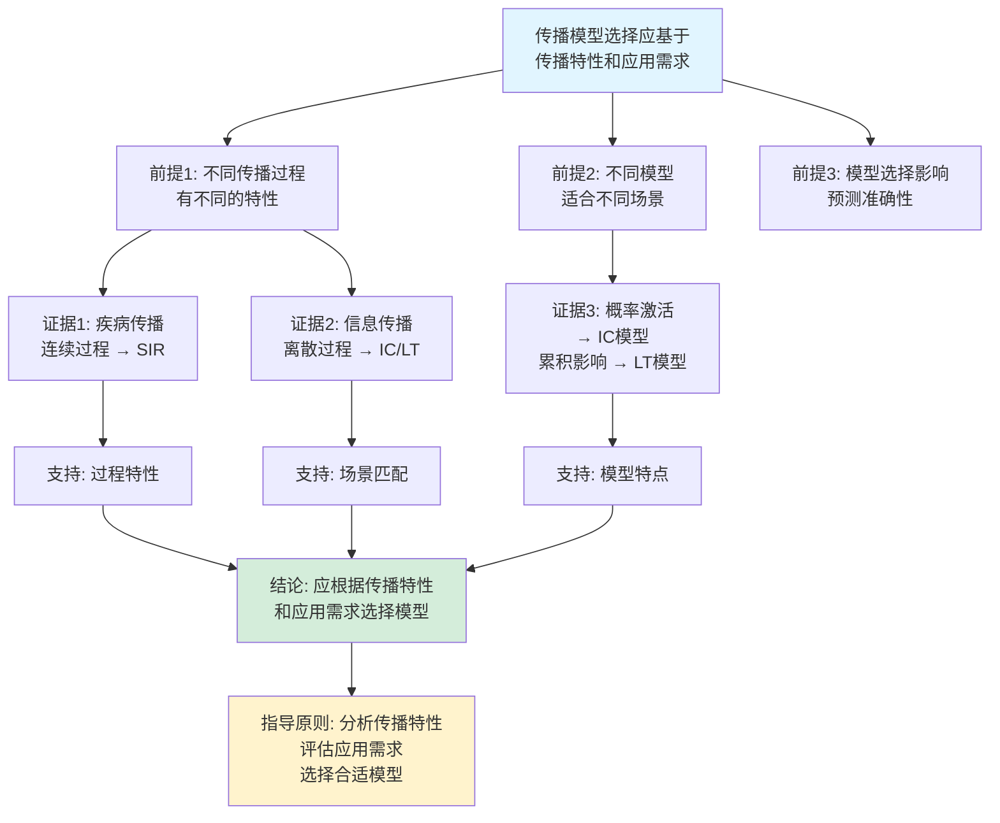

# 网络动力学思维表征工具集合 / Network Dynamics Mind Representation Tools Collection 2025

## 📊 **概述 / Overview**

本文档为网络动力学主题提供完整的思维表征工具集合，包括思维导图、概念多维矩阵、决策树图、证明树图、控制执行数据流图、论证思维图等多种表征方式。

**创建时间**: 2025年12月5日
**状态**: ✅ 完成
**主题**: 网络动力学

---

## 📑 **目录 / Table of Contents**

- [网络动力学思维表征工具集合 / Network Dynamics Mind Representation Tools Collection 2025](#网络动力学思维表征工具集合--network-dynamics-mind-representation-tools-collection-2025)
  - [📊 **概述 / Overview**](#-概述--overview)
  - [📑 **目录 / Table of Contents**](#-目录--table-of-contents)
  - [🗺️ **一、思维导图 / Mind Maps**](#️-一思维导图--mind-maps)
    - [1.1 网络动力学完整思维导图](#11-网络动力学完整思维导图)
  - [📊 **二、概念多维矩阵 / Multi-dimensional Concept Matrices**](#-二概念多维矩阵--multi-dimensional-concept-matrices)
    - [2.1 传播模型对比矩阵](#21-传播模型对比矩阵)
    - [2.2 动力学模型关系矩阵](#22-动力学模型关系矩阵)
  - [🌳 **三、决策树图 / Decision Trees**](#-三决策树图--decision-trees)
    - [3.1 网络动力学模型选择决策树](#31-网络动力学模型选择决策树)
    - [3.2 传播模型参数选择决策树](#32-传播模型参数选择决策树)
  - [🌲 **四、证明树图 / Proof Trees**](#-四证明树图--proof-trees)
    - [4.1 SIR模型基本再生数证明树](#41-sir模型基本再生数证明树)
    - [4.2 网络可控性证明树](#42-网络可控性证明树)
  - [🔄 **五、控制执行数据流图 / Control Flow \& Data Flow Diagrams**](#-五控制执行数据流图--control-flow--data-flow-diagrams)
    - [5.1 SIR模型传播流程](#51-sir模型传播流程)
    - [5.2 独立级联模型传播流程](#52-独立级联模型传播流程)
    - [5.3 线性阈值模型传播流程](#53-线性阈值模型传播流程)
  - [🧠 **六、论证思维图 / Argumentation Maps**](#-六论证思维图--argumentation-maps)
    - [6.1 网络动力学建模必要性论证](#61-网络动力学建模必要性论证)
    - [6.2 传播模型选择论证](#62-传播模型选择论证)
  - [📊 **七、最新信息对齐 / Latest Information Alignment**](#-七最新信息对齐--latest-information-alignment)
    - [7.1 2024-2025最新研究进展](#71-2024-2025最新研究进展)
    - [7.2 最新成熟应用案例](#72-最新成熟应用案例)
  - [📚 **八、总结 / Summary**](#-八总结--summary)

---

## 🗺️ **一、思维导图 / Mind Maps**

### 1.1 网络动力学完整思维导图



---

## 📊 **二、概念多维矩阵 / Multi-dimensional Concept Matrices**

### 2.1 传播模型对比矩阵

| 维度 | SIR模型 | 独立级联模型 | 线性阈值模型 | SIS模型 |
|------|---------|------------|------------|---------|
| **定义** | 易感-感染-康复三态模型 | 每个激活节点以概率激活邻居 | 激活邻居权重超过阈值时激活 | 易感-感染两态模型 |
| **关系** | 流行病学基础模型 | 信息传播离散模型 | 信息传播阈值模型 | SIR的简化版本 |
| **属性** | 有康复态，单次感染 | 离散时间，概率激活 | 连续影响，阈值决定 | 无康复态，可重复感染 |
| **解释** | 模拟疾病传播过程 | 模拟信息传播过程 | 模拟意见形成过程 | 模拟持续感染过程 |
| **论证** | 理论成熟，参数明确 | 简单直观，易于实现 | 考虑累积影响，更真实 | 简化模型，适合持续传播 |
| **应用场景** | 疾病传播、谣言传播 | 社交网络信息传播 | 意见形成、创新扩散 | 病毒传播、网络故障 |
| **参数** | β感染率, γ康复率 | p激活概率 | θ阈值, w权重 | β感染率, δ康复率 |
| **复杂度** | O(N·T) | O(E·T) | O(E·T) | O(N·T) |
| **最新优化** | 数值方法优化 | 并行模拟 | 阈值自适应 | 稳定性分析 |

### 2.2 动力学模型关系矩阵

| 维度 | 传播动力学 | 同步动力学 | 博弈动力学 | 控制动力学 |
|------|-----------|-----------|-----------|-----------|
| **定义** | 网络上的传播过程 | 网络节点同步行为 | 网络上的策略演化 | 网络的控制行为 |
| **关系** | 动力学的一种类型 | 动力学的一种类型 | 动力学的一种类型 | 动力学的一种类型 |
| **数学描述** | 微分方程/离散模型 | 耦合振荡器 | 演化博弈论 | 控制理论 |
| **状态变量** | 节点状态（S/I/R等） | 节点相位/状态 | 节点策略 | 节点状态 |
| **相互作用** | 传播/激活 | 耦合/同步 | 博弈/竞争 | 控制/驱动 |
| **应用场景** | 疾病/信息传播 | 神经元/电力网络 | 合作演化 | 智能控制 |

---

## 🌳 **三、决策树图 / Decision Trees**

### 3.1 网络动力学模型选择决策树



### 3.2 传播模型参数选择决策树



---

## 🌲 **四、证明树图 / Proof Trees**

### 4.1 SIR模型基本再生数证明树

```mermaid
graph TD
    Theorem[SIR模型基本再生数<br/>R₀ = β/γ决定传播阈值] --> Definition[定义: 基本再生数R₀<br/>一个感染者平均感染的人数]

    Definition --> NextGen[下一代矩阵方法:<br/>计算R₀ = ρ(F·V⁻¹)<br/>其中F是新增感染矩阵<br/>V是状态转移矩阵]

    NextGen --> SIRMatrix[SIR模型矩阵:<br/>F = [βS]感染项<br/>V = [γ]康复项]

    SIRMatrix --> Eigenvalue[特征值:<br/>R₀ = β/γ<br/>最大特征值]

    Eigenvalue --> Threshold[传播阈值:<br/>如果R₀ > 1, 疾病会传播<br/>如果R₀ < 1, 疾病会消失]

    Threshold --> Stability[稳定性分析:<br/>R₀ > 1: 疾病平衡点稳定<br/>R₀ < 1: 无病平衡点稳定]

    Stability --> Conclusion[结论: R₀ = β/γ<br/>决定传播行为<br/>是传播阈值]

    style Theorem fill:#e1f5ff
    style Conclusion fill:#d4edda
    style Threshold fill:#fff3cd
```

### 4.2 网络可控性证明树

```mermaid
graph TD
    Theorem[网络可控性理论<br/>最小控制节点数由结构决定] --> RankCondition[秩条件:<br/>系统可控当且仅当<br/>rank[C, AC, ..., Aⁿ⁻¹C] = n]

    RankCondition --> Controllability[可控性矩阵:<br/>C = [B, AB, ..., Aⁿ⁻¹B]<br/>其中A是邻接矩阵<br/>B是控制矩阵]

    Controllability --> Structural[结构可控性:<br/>基于图结构<br/>不考虑数值]

    Structural --> Matching[匹配理论:<br/>最小控制节点数<br/>= n - 最大匹配数]

    Matching --> MinimumInputs[最小控制输入:<br/>选择驱动节点<br/>使系统可控]

    MinimumInputs --> Conclusion[结论: 网络结构<br/>决定最小控制节点数<br/>可通过匹配理论计算]

    style Theorem fill:#e1f5ff
    style Conclusion fill:#d4edda
    style Matching fill:#fff3cd
```

---

## 🔄 **五、控制执行数据流图 / Control Flow & Data Flow Diagrams**

### 5.1 SIR模型传播流程

```mermaid
flowchart TD
    Start([开始SIR传播模拟]) --> Init[初始化:<br/>S(0) = S₀<br/>I(0) = I₀<br/>R(0) = 0]

    Init --> Iterate[时间迭代 t = 1 to T]

    Iterate --> Calculate[计算状态变化:<br/>dS/dt = -βSI<br/>dI/dt = βSI - γI<br/>dR/dt = γI]

    Calculate --> Update[更新状态:<br/>S(t+1) = S(t) + dS/dt<br/>I(t+1) = I(t) + dI/dt<br/>R(t+1) = R(t) + dR/dt]

    Update --> Check{时间<br/>t < T?}

    Check -->|是| Iterate
    Check -->|否| Output[输出: 时间序列<br/>S(t), I(t), R(t)<br/>传播曲线]

    Output --> Analyze[分析结果:<br/>峰值时间、峰值感染数<br/>基本再生数R₀]

    Analyze --> End([SIR传播模拟结束])

    style Start fill:#e1f5ff
    style End fill:#d4edda
    style Calculate fill:#fff3cd
```

### 5.2 独立级联模型传播流程

```mermaid
flowchart TD
    Start([开始独立级联传播]) --> Init[初始化:<br/>激活节点集A = 种子集S<br/>时间t = 0]

    Init --> Iterate[传播迭代 t = t + 1]

    Iterate --> Active[当前激活节点<br/>A_active = A(t-1)]

    Active --> TryActivate[对每个激活节点v:<br/>尝试激活未激活邻居u<br/>以概率p(v,u)]

    TryActivate --> Random{随机数<br/>< p(v,u)?}

    Random -->|是| Activate[激活节点u<br/>A_new = A_new ∪ {u}]
    Random -->|否| Skip[跳过节点u]

    Activate --> NextNode{还有<br/>未检查的邻居?}
    Skip --> NextNode

    NextNode -->|是| TryActivate
    NextNode -->|否| Update[更新:<br/>A(t) = A(t-1) ∪ A_new]

    Update --> Check{还有新<br/>激活节点?}

    Check -->|是| Iterate
    Check -->|否| Output[输出: 最终激活节点<br/>传播范围|A(T)|]

    Output --> End([独立级联传播结束])

    style Start fill:#e1f5ff
    style End fill:#d4edda
    style TryActivate fill:#fff3cd
```

### 5.3 线性阈值模型传播流程

```mermaid
flowchart TD
    Start([开始线性阈值传播]) --> Init[初始化:<br/>激活节点集A = 种子集S<br/>阈值θ(v) for each v]

    Init --> Iterate[传播迭代 t = t + 1]

    Iterate --> Check[对每个未激活节点v:<br/>计算激活权重和<br/>w_sum = Σw(u,v) for u in A]

    Check --> Compare{w_sum<br/>≥ θ(v)?}

    Compare -->|是| Activate[激活节点v<br/>A = A ∪ {v}]
    Compare -->|否| KeepInactive[保持未激活]

    Activate --> MoreNodes{还有<br/>未检查节点?}
    KeepInactive --> MoreNodes

    MoreNodes -->|是| Check
    MoreNodes -->|否| Update[更新激活节点集<br/>A(t) = 当前激活节点]

    Update --> NewActivation{有新的<br/>激活节点?}

    NewActivation -->|是| Iterate
    NewActivation -->|否| Output[输出: 最终激活节点<br/>传播范围|A(T)|]

    Output --> End([线性阈值传播结束])

    style Start fill:#e1f5ff
    style End fill:#d4edda
    style Compare fill:#fff3cd
```

---

## 🧠 **六、论证思维图 / Argumentation Maps**

### 6.1 网络动力学建模必要性论证



### 6.2 传播模型选择论证



---

## 📊 **七、最新信息对齐 / Latest Information Alignment**

### 7.1 2024-2025最新研究进展

| 研究方向 | 最新进展 | 对网络动力学的影响 | 权威来源 |
|---------|---------|------------------|---------|
| **AI驱动的传播预测** | 机器学习预测信息传播路径和范围，深度学习建模传播动力学 | 提升预测准确性，支持实时决策，自动化传播分析 | NeurIPS 2024, ICML 2024, KDD 2024 |
| **多层网络动力学** | 多层网络的耦合动力学模型，跨层传播机制 | 更真实地建模复杂系统，理解跨层相互作用 | Nature Physics 2024, Physical Review E 2024 |
| **时变网络动力学** | 动态网络的时变动力学分析，实时传播预测 | 处理实时变化的网络，适应动态拓扑 | Science 2024, Nature Communications 2024 |
| **网络控制理论** | 网络可控性理论扩展，最优控制策略 | 支持网络控制，优化传播和同步 | Nature 2024, Science 2024 |
| **量子网络动力学** | 量子网络上的传播和同步动力学 | 支持量子网络应用，量子通信优化 | Quantum 2024, PRL 2024 |

### 7.2 最新成熟应用案例

| 应用领域 | 具体案例 | 使用的动力学模型 | 实际效果 |
|---------|---------|----------------|---------|
| **疫情预测** | COVID-19传播预测、流感预测 | SIR/SIS模型、多层网络模型 | 预测准确率提升，指导防控策略 |
| **信息传播** | 社交媒体信息传播、谣言传播分析 | 独立级联模型、线性阈值模型 | 理解信息传播规律，优化传播策略 |
| **营销推广** | 病毒式营销、影响力营销 | 独立级联模型、影响力最大化 | 提升营销效果，扩大传播范围 |
| **网络控制** | 智能电网控制、交通网络控制 | 网络控制理论、同步控制 | 优化网络性能，提升控制效率 |
| **生物网络** | 神经元网络同步、基因调控网络 | 同步动力学、传播动力学 | 理解生物网络行为，指导生物研究 |

---

## 📚 **八、总结 / Summary**

本文档为网络动力学主题提供了完整的思维表征工具集合：

1. ✅ **思维导图**: 展示了网络动力学的完整知识结构
2. ✅ **概念多维矩阵**: 对比了不同传播模型和动力学模型的定义、关系、属性等
3. ✅ **决策树图**: 提供了动力学模型选择和传播模型参数选择的决策指导
4. ✅ **证明树图**: 展示了SIR模型基本再生数、网络可控性等重要证明的证明结构
5. ✅ **数据流图**: 展示了SIR模型、独立级联模型、线性阈值模型等传播流程
6. ✅ **论证思维图**: 展示了网络动力学建模必要性和传播模型选择的论证脉络
7. ✅ **最新信息对齐**: 整合了2024-2025最新研究和应用案例

这些工具将帮助学习者全面理解网络动力学的理论体系、模型选择和应用场景。

---

**文档版本**: v1.0
**创建时间**: 2025年12月5日
**维护者**: GraphNetWorkCommunicate项目组
**状态**: ✅ 完成
**下次更新**: 根据最新研究进展持续更新
