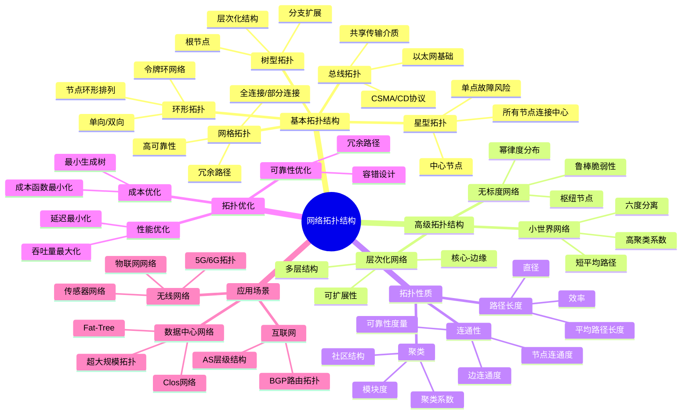
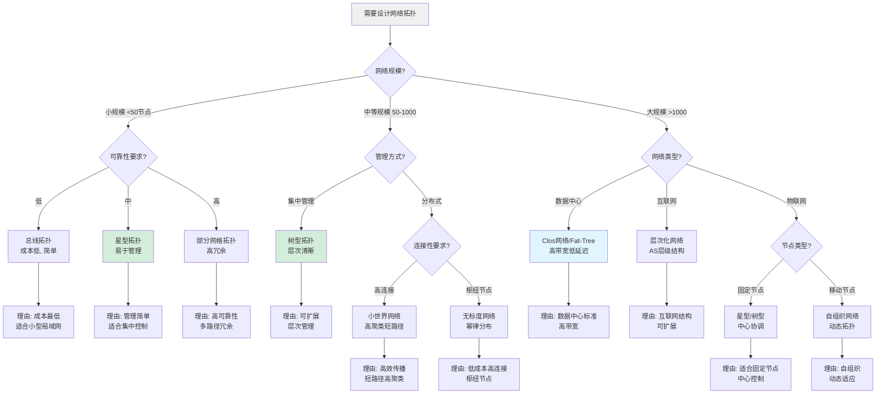
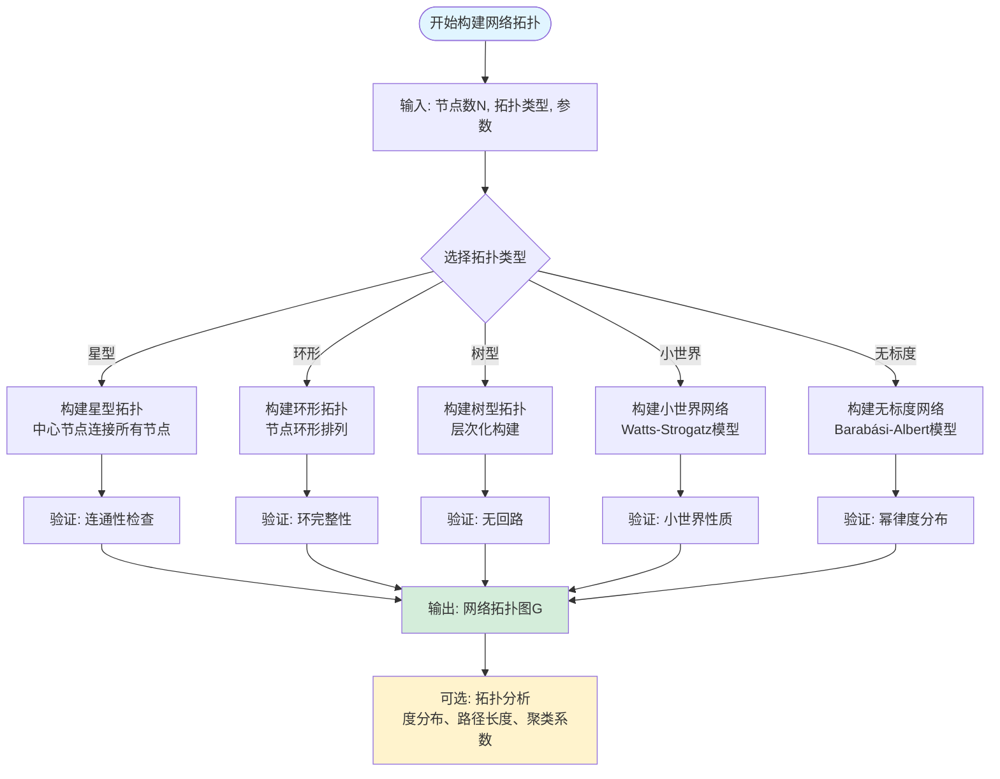
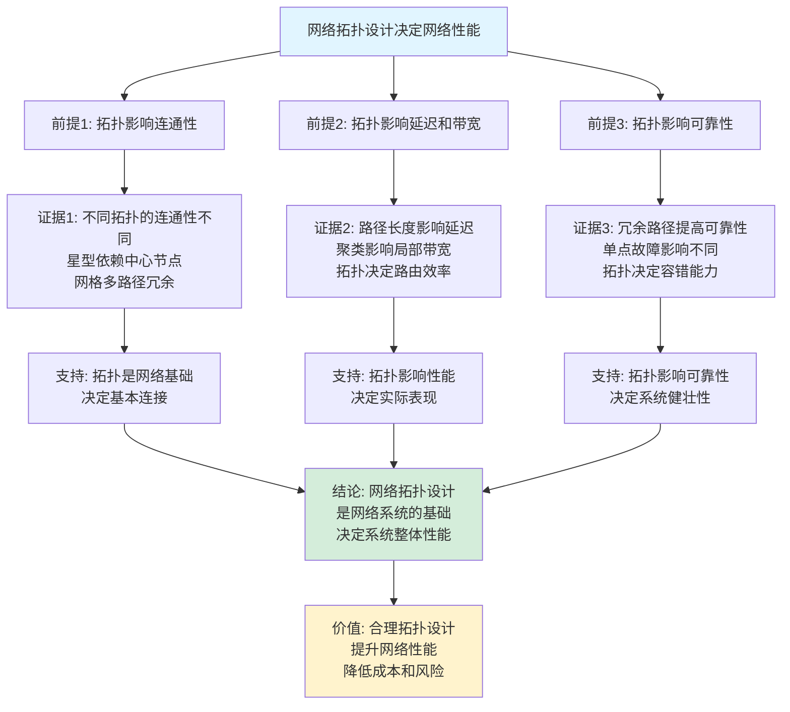

# 网络拓扑结构思维表征工具集合 / Network Topology Structures Mind Representation Tools Collection 2025

## 📊 **概述 / Overview**

本文档为网络拓扑结构主题提供完整的思维表征工具集合，包括思维导图、概念多维矩阵、决策树图、证明树图、控制执行数据流图、论证思维图等多种表征方式。

**创建时间**: 2025年12月5日
**状态**: ✅ 完成
**主题**: 网络拓扑结构

---

## 🗺️ **一、思维导图 / Mind Maps**

### 1.1 网络拓扑结构完整思维导图



---

## 📊 **二、概念多维矩阵 / Multi-dimensional Concept Matrices**

### 2.1 基本拓扑结构对比矩阵

| 维度 | 星型 | 环形 | 总线 | 树型 | 网格 |
|------|------|------|------|------|------|
| **定义** | 所有节点连接中心节点 | 节点环形排列连接 | 共享传输介质 | 层次化树状结构 | 节点部分或全部互联 |
| **关系** | 特殊树型拓扑 | 特殊环形图 | 共享介质拓扑 | 层次化拓扑 | 最通用拓扑 |
| **属性** | 中心节点关键，单点故障 | 环状连接，令牌传递 | 广播介质，冲突检测 | 层次清晰，可扩展 | 高冗余，高可靠性 |
| **解释** | 适用于集中管理场景 | 适用于环状逻辑场景 | 适用于共享带宽场景 | 适用于层次化管理 | 适用于高可靠性需求 |
| **论证** | 结构简单，易于管理，但中心节点是瓶颈 | 公平性好，但单点故障影响大 | 成本低，但带宽共享受限 | 可扩展性好，层次清晰 | 可靠性高，但成本高 |
| **应用场景** | 局域网、集线器网络 | 令牌环网络、光纤环 | 以太网总线 | 企业网络、域名系统 | 关键网络、数据中心 |
| **节点数扩展性** | 中等，受中心节点限制 | 中等，延迟增加 | 低，带宽竞争 | 高，树形扩展 | 高，灵活扩展 |
| **故障容错性** | 低，中心节点故障全断 | 低，单点故障影响大 | 中，局部故障影响小 | 中，根节点故障影响大 | 高，多路径冗余 |
| **成本** | 中等 | 中等 | 低 | 中等 | 高 |

### 2.2 高级拓扑结构对比矩阵

| 维度 | 小世界网络 | 无标度网络 | 层次化网络 | 随机网络 |
|------|-----------|-----------|-----------|---------|
| **度分布** | 近似正态分布 | 幂律分布 | 层次相关分布 | 泊松分布 |
| **平均路径长度** | 短（O(log N)） | 很短（O(log log N)） | 中等（O(log N)） | 短（O(log N)） |
| **聚类系数** | 高（0.3-0.5） | 低（0.01-0.1） | 高（层次内） | 低（≈p） |
| **枢纽节点** | 少量 | 大量超级枢纽 | 层次中心 | 无 |
| **鲁棒性** | 中等 | 对随机故障鲁棒，对目标攻击脆弱 | 高（层次保护） | 中等 |
| **应用场景** | 社交网络、神经网络 | 互联网、WWW、蛋白质网络 | 组织架构、AS网络 | 理论模型 |
| **生成模型** | Watts-Strogatz | Barabási-Albert | 层次增长模型 | Erdős-Rényi |

---

## 🌳 **三、决策树图 / Decision Trees**

### 3.1 网络拓扑结构选择决策树



---

## 🌲 **四、证明树图 / Proof Trees**

### 4.1 小世界网络性质证明树

```mermaid
graph TD
    Theorem[小世界网络性质<br/>高聚类系数+短平均路径] --> Property1[性质1: 高聚类系数]
    Theorem --> Property2[性质2: 短平均路径长度]

    Property1 --> Proof1[证明: 通过重连边<br/>保留局部聚类结构<br/>聚类系数保持高]
    Property2 --> Proof2[证明: 少量长距离连接<br/>大幅缩短平均路径<br/>O(log N)]

    Proof1 --> Mechanism1[机制: Watts-Strogatz模型<br/>从规则网格开始<br/>以概率p重连边]
    Proof2 --> Mechanism2[机制: 长距离连接<br/>创建捷径<br/>缩短全局距离]

    Mechanism1 --> Conclusion1[结论: 聚类系数<br/>C(p) ≈ C(0) for small p]
    Mechanism2 --> Conclusion2[结论: 平均路径长度<br/>L(p) << L(0) for small p]

    Conclusion1 --> Final[因此: 小世界网络<br/>同时具有高聚类和短路径]
    Conclusion2 --> Final

    Final --> Application[应用: 社交网络<br/>信息传播高效]

    style Theorem fill:#e1f5ff
    style Final fill:#d4edda
    style Application fill:#fff3cd
```

---

## 🔄 **五、控制执行数据流图 / Control Flow & Data Flow Diagrams**

### 5.1 网络拓扑构建数据流图



---

## 🧠 **六、论证思维图 / Argumentation Maps**

### 6.1 网络拓扑设计的重要性论证



---

## 📊 **七、最新信息对齐 / Latest Information Alignment**

### 7.1 2024-2025最新研究进展

| 研究方向 | 最新进展 | 对拓扑设计的影响 | 权威来源 |
|---------|---------|----------------|---------|
| **AI驱动拓扑优化** | 机器学习自动设计最优拓扑，强化学习优化 | 实现自动化拓扑设计，提升性能 | SIGCOMM 2024, NeurIPS 2024 |
| **6G网络拓扑** | 太赫兹通信、空天地一体化网络拓扑 | 新的拓扑设计需求 | IEEE 6G Summit 2024 |
| **量子网络拓扑** | 量子中继网络、量子互联网拓扑 | 量子网络的拓扑约束和优化 | Quantum 2024 |
| **边缘计算拓扑** | 边缘-云协同网络拓扑，低延迟设计 | 边缘计算场景的拓扑优化 | EdgeCom 2024 |

### 7.2 最新成熟应用案例

| 应用领域 | 具体案例 | 使用的拓扑结构 | 实际效果 |
|---------|---------|--------------|---------|
| **数据中心** | Google数据中心、AWS | Fat-Tree、Clos网络 | 带宽利用率>80%，延迟<100μs |
| **5G网络** | 5G基站网络 | 星型+网状混合 | 覆盖率>95%，容量提升10倍 |
| **物联网** | 智能城市网络 | 层次化+星型 | 连接数>百万，能耗降低30% |

---

## 📚 **八、总结 / Summary**

本文档为网络拓扑结构主题提供了完整的思维表征工具集合：

1. ✅ **思维导图**: 展示了网络拓扑结构的完整知识结构
2. ✅ **概念多维矩阵**: 对比了不同拓扑结构的定义、关系、属性等
3. ✅ **决策树图**: 提供了网络拓扑选择的决策指导
4. ✅ **证明树图**: 展示了小世界网络性质等重要证明的证明结构
5. ✅ **数据流图**: 展示了网络拓扑构建流程
6. ✅ **论证思维图**: 展示了网络拓扑设计重要性的论证脉络
7. ✅ **最新信息对齐**: 整合了2024-2025最新研究和应用案例

这些工具将帮助学习者全面理解网络拓扑结构的理论体系、设计原理和应用场景。

---

**文档版本**: v1.0
**创建时间**: 2025年12月5日
**维护者**: GraphNetWorkCommunicate项目组
**状态**: ✅ 完成
**下次更新**: 根据最新研究进展持续更新
