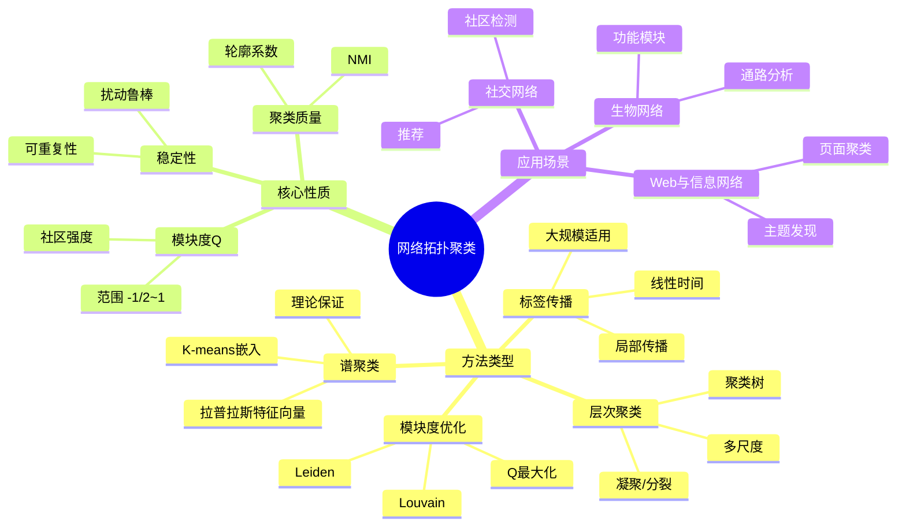
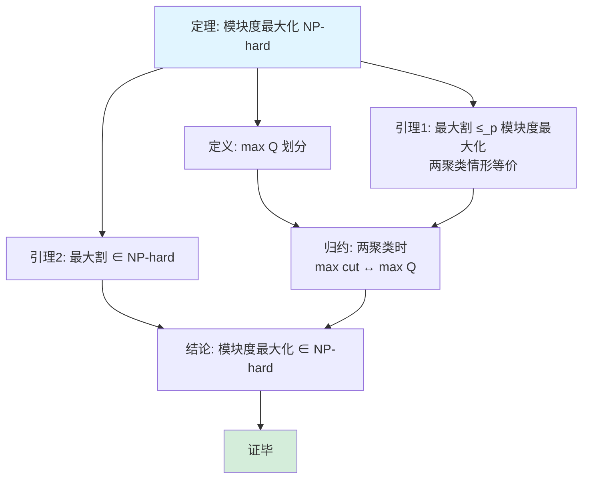
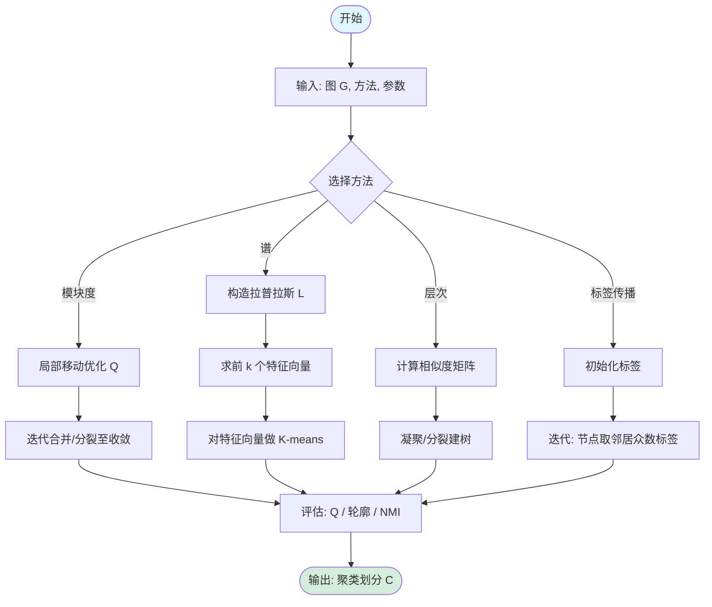
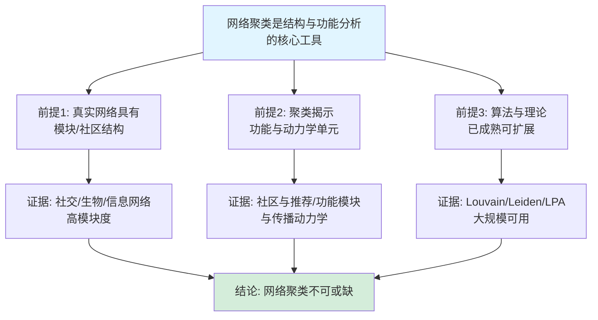

# 网络拓扑聚类思维表征工具集合 / Network Topology Clustering Mind Representation Tools Collection 2025

## 📊 **概述 / Overview**

本文档为网络拓扑聚类主题提供完整的思维表征工具集合，包括思维导图、概念多维矩阵、决策树图、证明树图、控制执行数据流图、论证思维图等多种表征方式。

**创建时间**: 2025年2月
**状态**: ✅ 完成
**主题**: 网络拓扑聚类

---

## 📑 **目录 / Table of Contents**

- [网络拓扑聚类思维表征工具集合 / Network Topology Clustering Mind Representation Tools Collection 2025](#网络拓扑聚类思维表征工具集合--network-topology-clustering-mind-representation-tools-collection-2025)
  - [📊 **概述 / Overview**](#-概述--overview)
  - [📑 **目录 / Table of Contents**](#-目录--table-of-contents)
  - [🗺️ **一、思维导图 / Mind Maps**](#️-一思维导图--mind-maps)
    - [1.1 网络拓扑聚类完整思维导图](#11-网络拓扑聚类完整思维导图)
  - [📊 **二、概念多维矩阵 / Multi-dimensional Concept Matrices**](#-二概念多维矩阵--multi-dimensional-concept-matrices)
    - [2.1 聚类方法对比矩阵](#21-聚类方法对比矩阵)
    - [2.2 聚类性质对比矩阵](#22-聚类性质对比矩阵)
  - [🌳 **三、决策树图 / Decision Trees**](#-三决策树图--decision-trees)
    - [3.1 网络聚类方法选择决策树](#31-网络聚类方法选择决策树)
  - [🌲 **四、证明树图 / Proof Trees**](#-四证明树图--proof-trees)
    - [4.1 模块度优化NP难度证明树](#41-模块度优化np难度证明树)
  - [🔄 **五、控制执行数据流图 / Control Flow \& Data Flow Diagrams**](#-五控制执行数据流图--control-flow--data-flow-diagrams)
    - [5.1 网络聚类流程](#51-网络聚类流程)
  - [🧠 **六、论证思维图 / Argumentation Maps**](#-六论证思维图--argumentation-maps)
    - [6.1 网络聚类重要性论证](#61-网络聚类重要性论证)
  - [📊 **七、最新信息对齐 / Latest Information Alignment**](#-七最新信息对齐--latest-information-alignment)
    - [7.1 2024-2025最新研究进展](#71-2024-2025最新研究进展)
  - [📚 **八、总结 / Summary**](#-八总结--summary)

---

## 🗺️ **一、思维导图 / Mind Maps**

### 1.1 网络拓扑聚类完整思维导图



---

## 📊 **二、概念多维矩阵 / Multi-dimensional Concept Matrices**

### 2.1 聚类方法对比矩阵

| 维度 | 模块度优化 | 谱聚类 | 层次聚类 | 标签传播 |
|------|-----------|--------|---------|---------|
| **定义** | 最大化 Q | 拉普拉斯特征向量+K-means | 层次合并/分裂 | 邻居标签传播 |
| **关系** | 社区检测主流 | 图割视角 | 多尺度视角 | 局部传播视角 |
| **复杂度** | O(n log n) 近似 | O(n²)~O(n³) | O(n²)~O(n³) | O(n+m) |
| **聚类数** | 自动/启发式 | 需指定 k | 树切割决定 | 自动 |
| **适用规模** | 大 | 小-中 | 中 | 大 |
| **质量指标** | Q | 割/谱隙 | 树高/割 | 收敛标签 |

### 2.2 聚类性质对比矩阵

| 维度 | 模块度范围 | 聚类质量 | 稳定性 | 可扩展性 |
|------|-----------|---------|--------|---------|
| **定义** | Q∈[-1/2,1] | 模块度/轮廓/NMI | 对扰动不敏感 | 大规模可行 |
| **关系** | 目标函数性质 | 评估指标 | 鲁棒性 | 工程约束 |
| **模块度优化** | 直接优化 Q | 高 Q | 中 | 高 |
| **谱聚类** | 间接 | 中-高 | 高 | 低 |
| **标签传播** | 无直接 Q | 中 | 中 | 高 |

---

## 🌳 **三、决策树图 / Decision Trees**

### 3.1 网络聚类方法选择决策树

```mermaid
flowchart TD
    Start[需要网络聚类] --> Q1{规模?}
    Q1 -->|大规模 n>10^6| Q2{是否需要层次?}
    Q1 -->|小-中规模| Q3{是否需要谱理论保证?}
    Q2 -->|否| LPA[标签传播<br/>O(n+m)]
    Q2 -->|是| Louvain[Louvain/Leiden<br/>模块度优化]
    Q3 -->|是| Spectral[谱聚类<br/>拉普拉斯+K-means]
    Q3 -->|否| Hier[层次聚类<br/>凝聚/分裂]
    LPA --> Use1[应用: 大规模社区<br/>快速划分]
    Louvain --> Use2[应用: 社区检测<br/>高质量Q]
    Spectral --> Use3[应用: 小图<br/>理论分析]
    Hier --> Use4[应用: 多尺度<br/>层次结构]
    style Start fill:#f0f0f0
    style LPA fill:#d4edda
    style Louvain fill:#e1f5ff
```

---

## 🌲 **四、证明树图 / Proof Trees**

### 4.1 模块度优化NP难度证明树



---

## 🔄 **五、控制执行数据流图 / Control Flow & Data Flow Diagrams**

### 5.1 网络聚类流程



---

## 🧠 **六、论证思维图 / Argumentation Maps**

### 6.1 网络聚类重要性论证



---

## 📊 **七、最新信息对齐 / Latest Information Alignment**

### 7.1 2024-2025最新研究进展

| 研究方向 | 最新进展 | 对聚类的影响 | 权威来源 |
|---------|---------|-------------|---------|
| **图神经网络聚类** | GNN 嵌入+聚类、端到端社区检测 | 结合结构与属性、可学习划分 | NeurIPS 2024, ICLR 2024 |
| **动态与时序社区** | 时序一致性、演化社区、事件检测 | 动态图与流图上的聚类 | KDD 2024, WWW 2024 |
| **超图与高阶聚类** | 超图割、高阶模块度、超图谱方法 | 超越成对关系的聚类 | ICML 2024, SDM 2024 |
| **可解释与公平聚类** | 约束聚类、公平性、可解释划分 | 满足约束与可解释性 | FAccT 2024, AIES 2024 |

---

## 📚 **八、总结 / Summary**

本文档为网络拓扑聚类主题提供了完整的思维表征工具集合：

1. ✅ **思维导图**: 展示聚类方法类型、核心性质与应用场景
2. ✅ **概念多维矩阵**: 对比模块度、谱、层次、标签传播等方法及性质
3. ✅ **决策树图**: 按规模与需求选择聚类方法的决策指导
4. ✅ **证明树图**: 展示模块度最大化 NP 难度等证明结构
5. ✅ **数据流图**: 展示通用网络聚类流程
6. ✅ **论证思维图**: 展示网络聚类重要性的论证脉络
7. ✅ **最新信息对齐**: 整合 2024-2025 GNN 聚类、动态社区、超图、可解释与公平性等进展

理论依据与深度内容见 [网络拓扑聚类-深度改进版-2025](05-高级理论/网络拓扑聚类-深度改进版-2025.md)。与社区检测的关系见 [思维表征工具集合-社区检测算法-完整版-2025](思维表征工具集合-社区检测算法-完整版-2025.md)。
