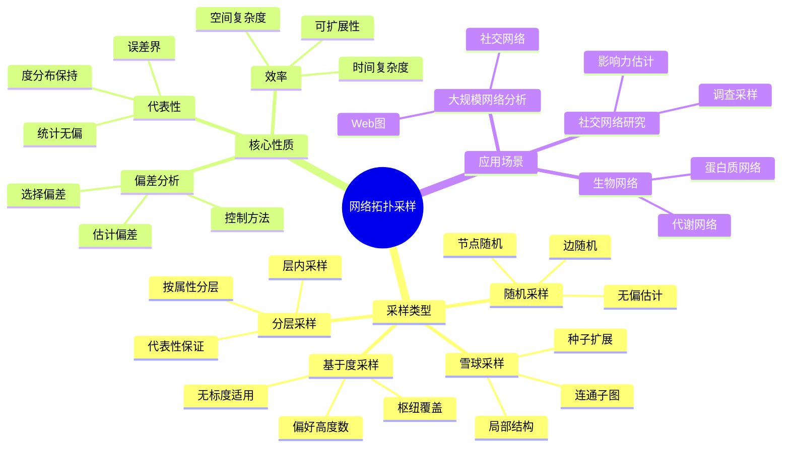
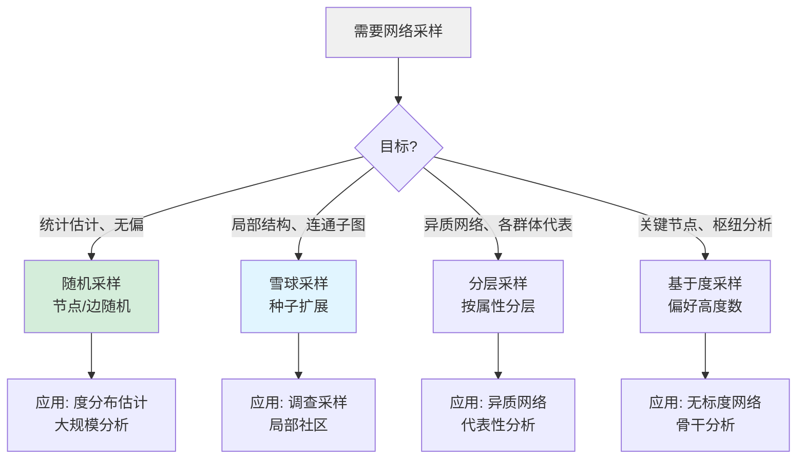
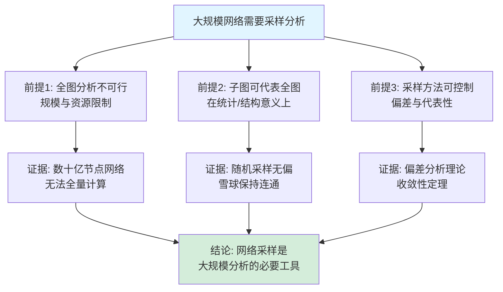

# 网络拓扑采样思维表征工具集合 / Network Topology Sampling Mind Representation Tools Collection 2025

## 📊 **概述 / Overview**

本文档为网络拓扑采样主题提供完整的思维表征工具集合，包括思维导图、概念多维矩阵、决策树图、证明树图、控制执行数据流图、论证思维图等多种表征方式。

**创建时间**: 2025年2月
**状态**: ✅ 完成
**主题**: 网络拓扑采样

---

## 📑 **目录 / Table of Contents**

- [网络拓扑采样思维表征工具集合 / Network Topology Sampling Mind Representation Tools Collection 2025](#网络拓扑采样思维表征工具集合--network-topology-sampling-mind-representation-tools-collection-2025)
  - [📊 **概述 / Overview**](#-概述--overview)
  - [📑 **目录 / Table of Contents**](#-目录--table-of-contents)
  - [🗺️ **一、思维导图 / Mind Maps**](#️-一思维导图--mind-maps)
    - [1.1 网络拓扑采样完整思维导图](#11-网络拓扑采样完整思维导图)
  - [📊 **二、概念多维矩阵 / Multi-dimensional Concept Matrices**](#-二概念多维矩阵--multi-dimensional-concept-matrices)
    - [2.1 采样方法对比矩阵](#21-采样方法对比矩阵)
    - [2.2 采样性质对比矩阵](#22-采样性质对比矩阵)
  - [🌳 **三、决策树图 / Decision Trees**](#-三决策树图--decision-trees)
    - [3.1 网络采样方法选择决策树](#31-网络采样方法选择决策树)
  - [🌲 **四、证明树图 / Proof Trees**](#-四证明树图--proof-trees)
    - [4.1 随机采样无偏性证明树](#41-随机采样无偏性证明树)
  - [🔄 **五、控制执行数据流图 / Control Flow \& Data Flow Diagrams**](#-五控制执行数据流图--control-flow--data-flow-diagrams)
    - [5.1 网络采样流程](#51-网络采样流程)
  - [🧠 **六、论证思维图 / Argumentation Maps**](#-六论证思维图--argumentation-maps)
    - [6.1 网络采样必要性论证](#61-网络采样必要性论证)
  - [📊 **七、最新信息对齐 / Latest Information Alignment**](#-七最新信息对齐--latest-information-alignment)
    - [7.1 2024-2025最新研究进展](#71-2024-2025最新研究进展)
  - [📚 **八、总结 / Summary**](#-八总结--summary)

---

## 🗺️ **一、思维导图 / Mind Maps**

### 1.1 网络拓扑采样完整思维导图



---

## 📊 **二、概念多维矩阵 / Multi-dimensional Concept Matrices**

### 2.1 采样方法对比矩阵

| 维度 | 随机采样 | 雪球采样 | 分层采样 | 基于度采样 |
|------|---------|---------|---------|-----------|
| **定义** | 随机选择节点/边 | 从种子扩展邻居 | 按属性分层后层内采样 | 按度数偏好采样 |
| **关系** | 基础方法 | 局部扩展方法 | 代表性方法 | 重要性方法 |
| **代表性** | 无偏（度分布等） | 有偏、连通 | 各层有代表 | 高度数过采样 |
| **适用规模** | 任意 | 中大规模 | 异质网络 | 无标度网络 |
| **时间复杂度** | O(n) | O(边界×深度) | O(n+k) | O(n) |
| **应用场景** | 统计估计 | 局部结构、调查 | 异质网络分析 | 枢纽节点分析 |

### 2.2 采样性质对比矩阵

| 维度 | 代表性 | 偏差 | 效率 | 连通性 |
|------|--------|------|------|--------|
| **定义** | 子网性质与原网一致 | 估计与真值之差 | 时间/空间开销 | 子网是否连通 |
| **关系** | 核心质量指标 | 需控制 | 工程约束 | 部分方法保证 |
| **随机采样** | 无偏（统计量） | 可分析 | 高 | 不保证 |
| **雪球采样** | 有偏 | 边界偏差 | 中 | 保证 |
| **分层采样** | 层内无偏 | 层间偏差 | 高 | 不保证 |

---

## 🌳 **三、决策树图 / Decision Trees**

### 3.1 网络采样方法选择决策树



---

## 🌲 **四、证明树图 / Proof Trees**

### 4.1 随机采样无偏性证明树

```mermaid
graph TD
    Theorem[定理: 随机节点采样对度分布无偏] --> Def[定义: 每节点以概率p被采样]
    Theorem --> Lemma1[引理1: 被采样且度为k的节点<br/>期望比例为 P(k)]
    Theorem --> Lemma2[引理2: 采样网络度分布期望<br/>等于原网络度分布]
    Def --> Proof1[证明: 期望度分布计算]
    Lemma1 --> Proof2[证明: 期望比例 = n·p·P(k)/(n·p) = P(k)]
    Lemma2 --> Conclusion[结论: E[P̂_s(k)] = P(k)]
    Proof1 --> Conclusion
    Proof2 --> Conclusion
    Conclusion --> QED[证毕]
    style Theorem fill:#e1f5ff
    style QED fill:#d4edda
```

---

## 🔄 **五、控制执行数据流图 / Control Flow & Data Flow Diagrams**

### 5.1 网络采样流程

```mermaid
flowchart TD
    Start([开始]) --> Input[输入: 原图G, 采样方法, 参数]
    Input --> Choose{选择方法}
    Choose -->|随机| R1[以概率p采样节点]
    Choose -->|雪球| S1[选种子集 S0]
    Choose -->|分层| T1[按属性分层 L1..Lk]
    R1 --> R2[导出子图 Gs = G[Vs]]
    S1 --> S2[迭代: S_{i+1}=S_i∪N(S_i)]
    T1 --> T2[每层采样 n_i 个节点]
    S2 --> S3[至深度k或规模上限]
    T2 --> T3[合并得 Vs, 导出 Gs]
    R2 --> Eval[评估: 代表性/偏差/效率]
    S3 --> Eval
    T3 --> Eval
    Eval --> Output([输出: 采样网络 Gs])
    style Start fill:#e1f5ff
    style Output fill:#d4edda
```

---

## 🧠 **六、论证思维图 / Argumentation Maps**

### 6.1 网络采样必要性论证



---

## 📊 **七、最新信息对齐 / Latest Information Alignment**

### 7.1 2024-2025最新研究进展

| 研究方向 | 最新进展 | 对采样的影响 | 权威来源 |
|---------|---------|-------------|---------|
| **图机器学习采样** | GNN 子图采样、邻居采样、层级采样 | 兼顾代表性与计算效率 | NeurIPS 2024, ICLR 2024 |
| **流图与动态图采样** | 滑动窗口、时序采样、边流采样 | 适应动态与流式场景 | KDD 2024, WWW 2024 |
| **隐私保护采样** | 差分隐私、本地化采样、匿名化子图 | 满足隐私约束的采样 | PETS 2024, USENIX 2024 |
| **超大图采样** | 分布式采样、草图与近似、图摘要 | 支撑 PB 级图分析 | SIGMOD 2024, VLDB 2024 |

---

## 📚 **八、总结 / Summary**

本文档为网络拓扑采样主题提供了完整的思维表征工具集合：

1. ✅ **思维导图**: 展示采样类型、核心性质与应用场景
2. ✅ **概念多维矩阵**: 对比不同采样方法及代表性、偏差、效率等性质
3. ✅ **决策树图**: 提供按目标选择采样方法的决策指导
4. ✅ **证明树图**: 展示随机采样无偏性等证明结构
5. ✅ **数据流图**: 展示通用网络采样流程
6. ✅ **论证思维图**: 展示大规模网络采样必要性的论证脉络
7. ✅ **最新信息对齐**: 整合 2024-2025 图学习、流图、隐私、超大图等相关进展

理论依据与深度内容见 [网络拓扑采样-深度改进版-2025](05-高级理论/网络拓扑采样-深度改进版-2025.md)。
