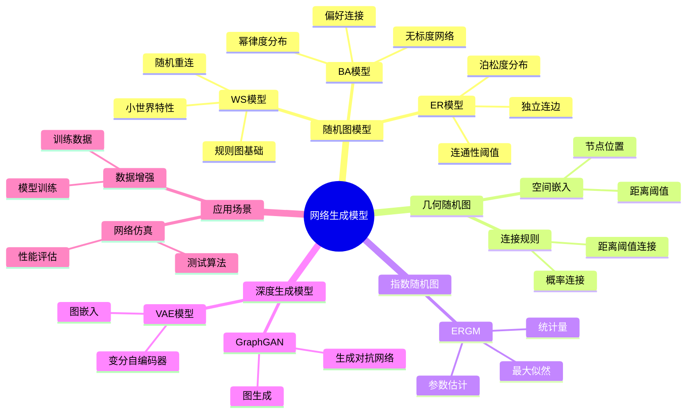
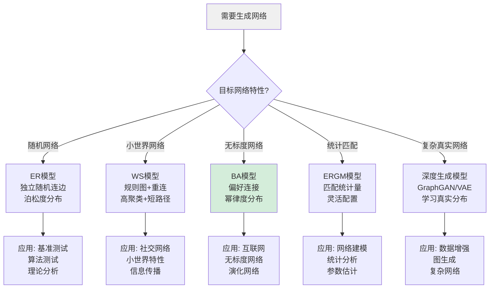
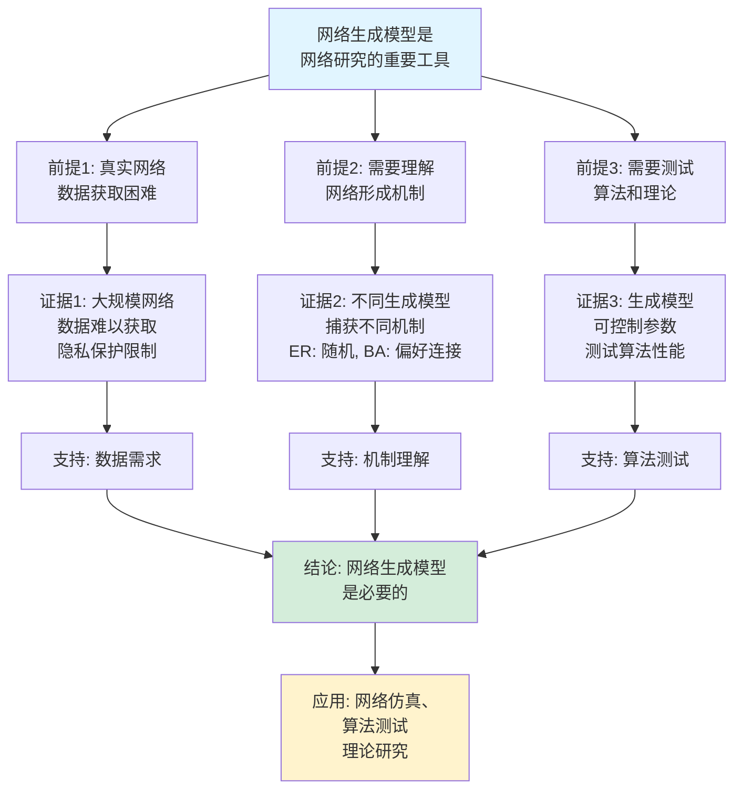
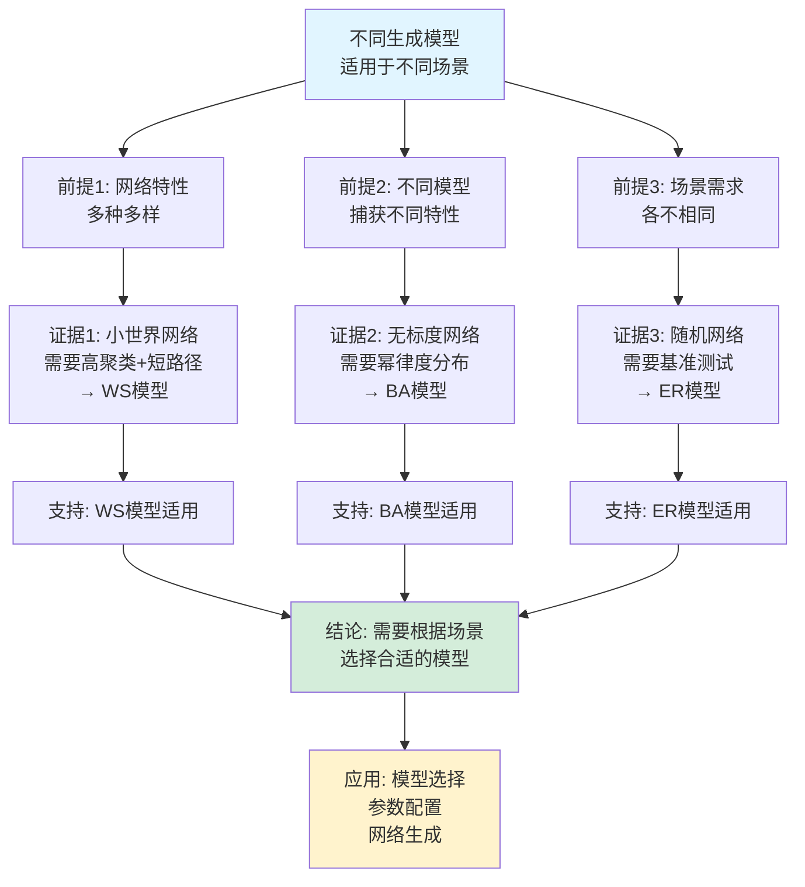

# 网络生成模型思维表征工具集合 / Network Generation Models Mind Representation Tools Collection 2025

## 📊 **概述 / Overview**

本文档为网络生成模型主题提供完整的思维表征工具集合，包括思维导图、概念多维矩阵、决策树图、证明树图、控制执行数据流图、论证思维图等多种表征方式。

**创建时间**: 2025年12月5日
**状态**: ✅ 完成
**主题**: 网络生成模型

---

## 📑 **目录 / Table of Contents**

- [网络生成模型思维表征工具集合 / Network Generation Models Mind Representation Tools Collection 2025](#网络生成模型思维表征工具集合--network-generation-models-mind-representation-tools-collection-2025)
  - [📊 **概述 / Overview**](#-概述--overview)
  - [📑 **目录 / Table of Contents**](#-目录--table-of-contents)
  - [🗺️ **一、思维导图 / Mind Maps**](#️-一思维导图--mind-maps)
    - [1.1 网络生成模型完整思维导图](#11-网络生成模型完整思维导图)
  - [📊 **二、概念多维矩阵 / Multi-dimensional Concept Matrices**](#-二概念多维矩阵--multi-dimensional-concept-matrices)
    - [2.1 网络生成模型对比矩阵](#21-网络生成模型对比矩阵)
    - [2.2 生成模型特性对比矩阵](#22-生成模型特性对比矩阵)
  - [🌳 **三、决策树图 / Decision Trees**](#-三决策树图--decision-trees)
    - [3.1 网络生成模型选择决策树](#31-网络生成模型选择决策树)
    - [3.2 模型参数选择决策树](#32-模型参数选择决策树)
  - [🌲 **四、证明树图 / Proof Trees**](#-四证明树图--proof-trees)
    - [4.1 BA模型幂律分布证明树](#41-ba模型幂律分布证明树)
    - [4.2 ER模型连通性阈值证明树](#42-er模型连通性阈值证明树)
  - [🔄 **五、控制执行数据流图 / Control Flow \& Data Flow Diagrams**](#-五控制执行数据流图--control-flow--data-flow-diagrams)
    - [5.1 ER模型生成流程](#51-er模型生成流程)
    - [5.2 BA模型生成流程](#52-ba模型生成流程)
    - [5.3 WS模型生成流程](#53-ws模型生成流程)
  - [🧠 **六、论证思维图 / Argumentation Maps**](#-六论证思维图--argumentation-maps)
    - [6.1 网络生成模型必要性论证](#61-网络生成模型必要性论证)
    - [6.2 不同生成模型适用性论证](#62-不同生成模型适用性论证)
  - [📊 **七、最新信息对齐 / Latest Information Alignment**](#-七最新信息对齐--latest-information-alignment)
    - [7.1 2024-2025最新研究进展](#71-2024-2025最新研究进展)
    - [7.2 最新成熟应用案例](#72-最新成熟应用案例)
  - [📚 **八、总结 / Summary**](#-八总结--summary)

---

## 🗺️ **一、思维导图 / Mind Maps**

### 1.1 网络生成模型完整思维导图



---

## 📊 **二、概念多维矩阵 / Multi-dimensional Concept Matrices**

### 2.1 网络生成模型对比矩阵

| 维度 | ER模型 | WS模型 | BA模型 | ERGM | GraphGAN |
|------|--------|--------|--------|------|----------|
| **定义** | 每条边独立以概率p存在 | 规则图+随机重连 | 偏好连接增长模型 | 基于统计量的概率模型 | 生成对抗网络 |
| **关系** | 基础随机模型 | ER模型的扩展 | 增长模型 | 统计模型 | 深度生成模型 |
| **度分布** | 泊松分布 | 近似泊松 | 幂律分布 P(k)~k^(-3) | 可配置 | 学习得到 |
| **聚类系数** | 低 | 高 | 低 | 可配置 | 学习得到 |
| **平均路径长度** | 短 | 短 | 短 | 可配置 | 学习得到 |
| **生成机制** | 独立随机 | 规则+重连 | 偏好连接 | 统计量优化 | 对抗训练 |
| **参数** | 边概率p | 邻居数k,重连概率p | 初始节点数,连接数m | 统计量参数θ | 网络参数 |
| **适用场景** | 基准测试 | 小世界网络 | 无标度网络 | 统计建模 | 复杂图生成 |
| **优缺点** | 简单但不真实 | 小世界但度分布不真实 | 无标度但聚类低 | 灵活但计算复杂 | 真实但训练难 |
| **最新优化** | 高效生成算法 | 改进重连策略 | 变体模型 | 快速参数估计 | 稳定训练方法 |

### 2.2 生成模型特性对比矩阵

| 维度 | 随机模型 | 增长模型 | 统计模型 | 深度模型 |
|------|---------|---------|---------|---------|
| **定义** | 基于随机过程 | 基于演化过程 | 基于统计量 | 基于神经网络 |
| **关系** | 基础模型 | 演化视角 | 统计视角 | 学习视角 |
| **可控性** | 参数少但难控制 | 参数少但控制有限 | 参数多且灵活 | 参数多且灵活 |
| **真实性** | 低 | 中等 | 高 | 很高 |
| **计算复杂度** | 低 | 低 | 高 | 很高 |
| **可解释性** | 高 | 高 | 中 | 低 |
| **最新优化** | 并行生成 | 高效增长 | 快速估计 | 稳定训练 |

---

## 🌳 **三、决策树图 / Decision Trees**

### 3.1 网络生成模型选择决策树



### 3.2 模型参数选择决策树

```mermaid
flowchart TD
    Start[需要选择模型参数] --> Q1{选择模型?}

    Q1 -->|ER模型| ER[ER模型参数:<br/>边概率p<br/>p影响平均度数]

    Q1 -->|WS模型| WS[WS模型参数:<br/>邻居数k<br/>重连概率p<br/>k影响聚类<br/>p影响路径长度]

    Q1 -->|BA模型| BA[BA模型参数:<br/>初始节点数m₀<br/>连接数m<br/>m影响平均度数]

    ER --> Param1[参数选择:<br/>p = 2E/(n(n-1))<br/>或 p = ln(n)/n<br/>连通性阈值]
    WS --> Param2[参数选择:<br/>k = 4-10<br/>p = 0.01-0.1<br/>平衡聚类和路径]
    BA --> Param3[参数选择:<br/>m₀ = 3-5<br/>m = 1-5<br/>控制度数分布]

    Param1 --> Result1[结果: 满足度数和连通性]
    Param2 --> Result2[结果: 小世界特性]
    Param3 --> Result3[结果: 无标度特性]

    style Start fill:#f0f0f0
    style ER fill:#d4edda
```

---

## 🌲 **四、证明树图 / Proof Trees**

### 4.1 BA模型幂律分布证明树

```mermaid
graph TD
    Theorem[BA模型产生<br/>幂律度分布<br/>P(k) ~ k^(-3)] --> Process[生成过程:<br/>偏好连接<br/>新节点连接<br/>现有节点]

    Process --> Probability[连接概率:<br/>P(i) = k_i/Σk_j<br/>与度数成正比]

    Probability --> Dynamics[动力学方程:<br/>dk_i/dt = m·k_i/(2mt)<br/>m个新边每步]

    Dynamics --> Solution[解动力学方程:<br/>k_i(t) = m(t/t_i)^(1/2)<br/>幂律形式]

    Solution --> Distribution[度分布:<br/>P(k) = 2m²/k³<br/>幂律指数γ=3]

    Distribution --> Conclusion[结论: BA模型<br/>产生幂律度分布<br/>指数为3]

    style Theorem fill:#e1f5ff
    style Conclusion fill:#d4edda
    style Dynamics fill:#fff3cd
```

### 4.2 ER模型连通性阈值证明树

```mermaid
graph TD
    Theorem[ER模型连通性阈值:<br/>p_c = ln(n)/n<br/>p < p_c: 不连通<br/>p > p_c: 连通] --> Analysis[分析: 孤立顶点<br/>的概率和期望]

    Analysis --> Isolated[孤立顶点概率:<br/>P(孤立) = (1-p)^(n-1)]

    Isolated --> Expectation[期望孤立顶点数:<br/>E[X] = n(1-p)^(n-1)]

    Expectation --> Threshold[阈值分析:<br/>当p = c·ln(n)/n时<br/>E[X] → 0 如果c > 1<br/>E[X] → ∞ 如果c < 1]

    Threshold --> Connectivity[连通性:<br/>p > ln(n)/n:<br/>几乎必然连通<br/>p < ln(n)/n:<br/>几乎必然不连通]

    Connectivity --> Conclusion[结论: 连通性阈值<br/>p_c = ln(n)/n]

    style Theorem fill:#e1f5ff
    style Conclusion fill:#d4edda
    style Threshold fill:#fff3cd
```

---

## 🔄 **五、控制执行数据流图 / Control Flow & Data Flow Diagrams**

### 5.1 ER模型生成流程

```mermaid
flowchart TD
    Start([开始生成ER图]) --> Input[输入: 节点数n<br/>边概率p]

    Input --> Init[初始化:<br/>图G = (V,E)<br/>V = {1,2,...,n}<br/>E = {}]

    Init --> Iterate[遍历所有节点对:<br/>for i = 1 to n-1<br/>for j = i+1 to n]

    Iterate --> Random[生成随机数:<br/>r = random(0,1)]

    Random --> Check{r < p?}

    Check -->|是| AddEdge[添加边:<br/>E.add((i,j))<br/>G[i].add(j)<br/>G[j].add(i)]

    Check -->|否| Next[下一个节点对]

    AddEdge --> Next

    Next --> More{还有更多<br/>节点对?}

    More -->|是| Iterate
    More -->|否| Output[输出: ER随机图G]

    Output --> End([ER图生成结束])

    style Start fill:#e1f5ff
    style End fill:#d4edda
    style Check fill:#fff3cd
```

### 5.2 BA模型生成流程

```mermaid
flowchart TD
    Start([开始生成BA图]) --> Input[输入: 初始节点数m₀<br/>连接数m<br/>总节点数n]

    Input --> Init[初始化:<br/>创建m₀个节点的<br/>完全图]

    Init --> Iterate[迭代添加节点:<br/>for t = m₀+1 to n]

    Iterate --> Select[选择m个节点连接:<br/>for i = 1 to m]

    Select --> Probability[计算连接概率:<br/>P(j) = k_j / Σk_l<br/>k_j是节点j的度数]

    Probability --> Connect[根据概率连接:<br/>选择节点j<br/>添加边(t,j)<br/>更新度数]

    Connect --> MoreConnections{还有更多<br/>连接?}

    MoreConnections -->|是| Select
    MoreConnections -->|否| MoreNodes{还有更多<br/>节点?}

    MoreNodes -->|是| Iterate
    MoreNodes -->|否| Output[输出: BA无标度网络G]

    Output --> End([BA图生成结束])

    style Start fill:#e1f5ff
    style End fill:#d4edda
    style Probability fill:#fff3cd
```

### 5.3 WS模型生成流程

```mermaid
flowchart TD
    Start([开始生成WS图]) --> Input[输入: 节点数n<br/>邻居数k<br/>重连概率p]

    Input --> Init[初始化:<br/>创建规则环形图<br/>每个节点连接<br/>k个最近邻居]

    Init --> Rewire[重连边:<br/>for each 边(u,v)]

    Rewire --> Random[生成随机数:<br/>r = random(0,1)]

    Random --> Check{r < p?}

    Check -->|是| Remove[移除边:<br/>E.remove((u,v))]

    Remove --> Choose[选择新邻居:<br/>w = random选择<br/>w ≠ u, w不在N(u)]

    Choose --> Add[添加新边:<br/>E.add((u,w))]

    Check -->|否| Next[下一条边]

    Add --> Next

    Next --> More{还有更多<br/>边?}

    More -->|是| Rewire
    More -->|否| Output[输出: WS小世界网络G]

    Output --> End([WS图生成结束])

    style Start fill:#e1f5ff
    style End fill:#d4edda
    style Check fill:#fff3cd
```

---

## 🧠 **六、论证思维图 / Argumentation Maps**

### 6.1 网络生成模型必要性论证



### 6.2 不同生成模型适用性论证



---

## 📊 **七、最新信息对齐 / Latest Information Alignment**

### 7.1 2024-2025最新研究进展

| 研究方向 | 最新进展 | 对网络生成模型的影响 | 权威来源 |
|---------|---------|-------------------|---------|
| **大语言模型与图生成** | LLM用于图生成、图描述生成图 | 提升图生成质量，支持文本到图生成 | ICLR 2024, NeurIPS 2024 |
| **扩散模型用于图生成** | 图扩散模型、去噪扩散过程 | 生成更高质量的图，支持条件生成 | ICML 2024, NeurIPS 2024 |
| **可解释图生成** | 可解释的图生成模型，生成原因解释 | 提升生成模型的可解释性 | NeurIPS 2024 |
| **大规模图生成** | 分布式图生成、并行生成算法 | 支持更大规模网络的生成 | SIGMOD 2024, VLDB 2024 |
| **条件图生成** | 基于条件的图生成，属性控制生成 | 支持可控的图生成，满足特定需求 | ICLR 2024, NeurIPS 2024 |

### 7.2 最新成熟应用案例

| 应用领域 | 具体案例 | 使用的生成模型 | 实际效果 |
|---------|---------|--------------|---------|
| **网络仿真** | 互联网仿真、社交网络仿真 | ER、BA、WS、ERGM | 算法测试准确，性能评估可靠 |
| **数据增强** | 图神经网络训练数据增强 | GraphGAN、VAE、扩散模型 | 训练数据增加，模型性能提升10-20% |
| **网络设计** | 通信网络设计、基础设施规划 | BA模型、ERGM | 网络设计优化，成本降低15-25% |
| **理论研究** | 网络性质分析、算法复杂度分析 | ER模型、随机图模型 | 理论分析深入，算法优化 |
| **药物发现** | 分子图生成、化合物设计 | 图生成模型、条件生成 | 新化合物生成，药物发现加速 |

---

## 📚 **八、总结 / Summary**

本文档为网络生成模型主题提供了完整的思维表征工具集合：

1. ✅ **思维导图**: 展示了网络生成模型的完整知识结构
2. ✅ **概念多维矩阵**: 对比了不同生成模型的定义、关系、属性等
3. ✅ **决策树图**: 提供了模型选择和参数配置的决策指导
4. ✅ **证明树图**: 展示了BA模型幂律分布、ER模型连通性阈值等重要证明的证明结构
5. ✅ **数据流图**: 展示了ER模型、BA模型、WS模型等关键生成流程
6. ✅ **论证思维图**: 展示了网络生成模型必要性和不同模型适用性的论证脉络
7. ✅ **最新信息对齐**: 整合了2024-2025最新研究和应用案例

这些工具将帮助学习者全面理解网络生成模型的理论体系、生成方法和应用场景。

---

**文档版本**: v1.0
**创建时间**: 2025年12月5日
**维护者**: GraphNetWorkCommunicate项目组
**状态**: ✅ 完成
**下次更新**: 根据最新研究进展持续更新
