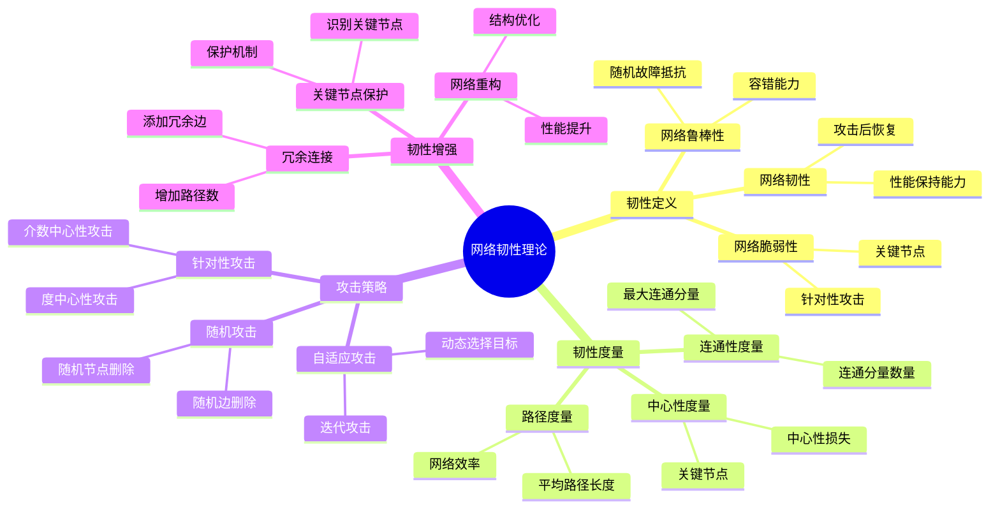
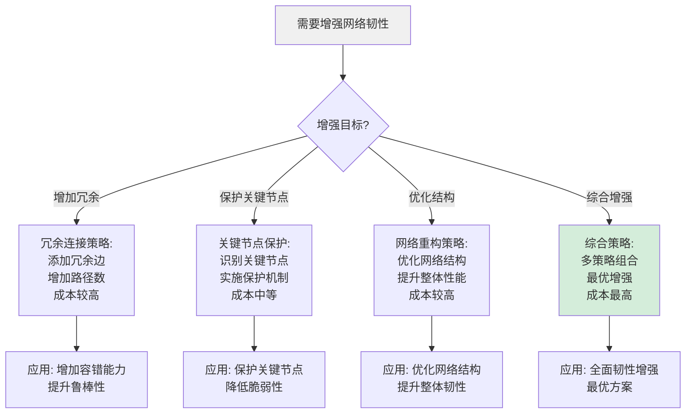
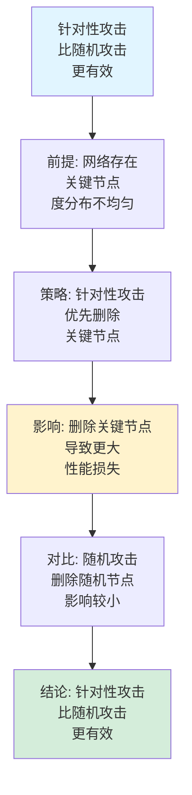
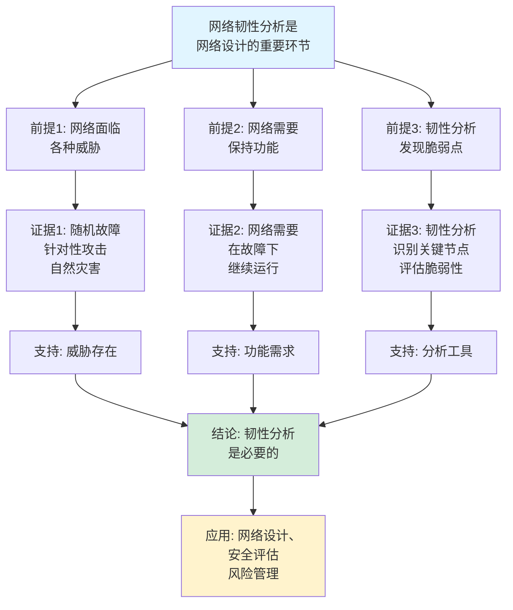
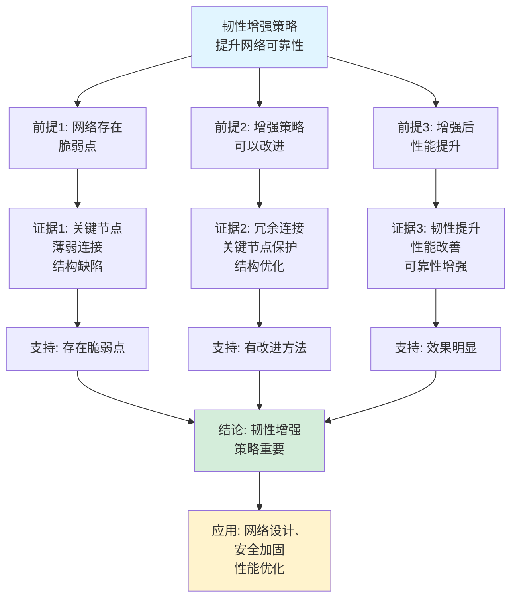

# 网络韧性理论思维表征工具集合 / Network Resilience Theory Mind Representation Tools Collection 2025

## 📊 **概述 / Overview**

本文档为网络韧性理论主题提供完整的思维表征工具集合，包括思维导图、概念多维矩阵、决策树图、证明树图、控制执行数据流图、论证思维图等多种表征方式。

**创建时间**: 2025年12月5日
**状态**: ✅ 完成
**主题**: 网络韧性理论

---

## 📑 **目录 / Table of Contents**

- [网络韧性理论思维表征工具集合 / Network Resilience Theory Mind Representation Tools Collection 2025](#网络韧性理论思维表征工具集合--network-resilience-theory-mind-representation-tools-collection-2025)
  - [📊 **概述 / Overview**](#-概述--overview)
  - [📑 **目录 / Table of Contents**](#-目录--table-of-contents)
  - [🗺️ **一、思维导图 / Mind Maps**](#️-一思维导图--mind-maps)
    - [1.1 网络韧性理论完整思维导图](#11-网络韧性理论完整思维导图)
  - [📊 **二、概念多维矩阵 / Multi-dimensional Concept Matrices**](#-二概念多维矩阵--multi-dimensional-concept-matrices)
    - [2.1 韧性度量对比矩阵](#21-韧性度量对比矩阵)
    - [2.2 攻击策略对比矩阵](#22-攻击策略对比矩阵)
  - [🌳 **三、决策树图 / Decision Trees**](#-三决策树图--decision-trees)
    - [3.1 韧性分析方法选择决策树](#31-韧性分析方法选择决策树)
    - [3.2 韧性增强策略选择决策树](#32-韧性增强策略选择决策树)
  - [🌲 **四、证明树图 / Proof Trees**](#-四证明树图--proof-trees)
    - [4.1 网络韧性度量性质证明树](#41-网络韧性度量性质证明树)
    - [4.2 攻击策略有效性证明树](#42-攻击策略有效性证明树)
  - [🔄 **五、控制执行数据流图 / Control Flow \& Data Flow Diagrams**](#-五控制执行数据流图--control-flow--data-flow-diagrams)
    - [5.1 网络韧性分析流程](#51-网络韧性分析流程)
    - [5.2 攻击模拟流程](#52-攻击模拟流程)
    - [5.3 韧性增强流程](#53-韧性增强流程)
  - [🧠 **六、论证思维图 / Argumentation Maps**](#-六论证思维图--argumentation-maps)
    - [6.1 网络韧性分析必要性论证](#61-网络韧性分析必要性论证)
    - [6.2 韧性增强策略重要性论证](#62-韧性增强策略重要性论证)
  - [📊 **七、最新信息对齐 / Latest Information Alignment**](#-七最新信息对齐--latest-information-alignment)
    - [7.1 2024-2025最新研究进展](#71-2024-2025最新研究进展)
    - [7.2 最新成熟应用案例](#72-最新成熟应用案例)
  - [📚 **八、总结 / Summary**](#-八总结--summary)

---

## 🗺️ **一、思维导图 / Mind Maps**

### 1.1 网络韧性理论完整思维导图



---

## 📊 **二、概念多维矩阵 / Multi-dimensional Concept Matrices**

### 2.1 韧性度量对比矩阵

| 维度 | 最大连通分量 | 平均路径长度 | 网络效率 | 中心性损失 |
|------|------------|------------|---------|-----------|
| **定义** | LCC = max|C| | APL = avg d(u,v) | E = avg 1/d(u,v) | CL = 中心性变化率 |
| **关系** | 连通性基础度量 | 路径质量度量 | 效率度量 | 重要性度量 |
| **取值范围** | [0, n] | [1, ∞) | [0, 1] | [0, 1] |
| **越大越好** | 是 | 否（越小越好） | 是 | 否（越小越好） |
| **计算复杂度** | O(V+E) | O(VE) | O(VE) | O(VE) |
| **适用场景** | 连通性分析 | 路径质量分析 | 效率分析 | 关键节点分析 |
| **优缺点** | 简单但不够全面 | 全面但计算复杂 | 考虑不可达节点 | 关注关键节点 |
| **最新优化** | 并行计算 | 近似算法 | 并行计算 | 增量计算 |

### 2.2 攻击策略对比矩阵

| 维度 | 随机攻击 | 度中心性攻击 | 介数中心性攻击 | 自适应攻击 |
|------|---------|------------|--------------|-----------|
| **定义** | 随机选择目标 | 优先删除高度数节点 | 优先删除高介数节点 | 动态选择目标 |
| **关系** | 基准攻击 | 简单针对性攻击 | 精确针对性攻击 | 最优攻击 |
| **攻击效率** | 低 | 中等 | 高 | 很高 |
| **计算复杂度** | O(1) | O(V log V) | O(VE) | O(V²E) |
| **适用场景** | 随机故障模拟 | 简单攻击模拟 | 精确攻击模拟 | 最优攻击分析 |
| **优缺点** | 简单但不真实 | 真实但计算中等 | 真实但计算复杂 | 最优但计算很复杂 |
| **最新优化** | 高效采样 | 快速排序 | 近似介数计算 | 启发式方法 |

---

## 🌳 **三、决策树图 / Decision Trees**

### 3.1 韧性分析方法选择决策树

```mermaid
flowchart TD
    Start[需要分析网络韧性] --> Q1{分析目标?}

    Q1 -->|连通性分析| Connectivity[连通性度量:<br/>最大连通分量<br/>连通分量数量<br/>O(V+E)复杂度]

    Q1 -->|路径质量分析| Path[路径度量:<br/>平均路径长度<br/>网络效率<br/>O(VE)复杂度]

    Q1 -->|关键节点分析| Centrality[中心性度量:<br/>中心性损失<br/>关键节点识别<br/>O(VE)复杂度]

    Q1 -->|综合分析| Comprehensive[综合度量:<br/>多指标组合<br/>全面评估<br/>O(VE)复杂度]

    Connectivity --> Use1[应用: 连通性评估<br/>故障影响分析]
    Path --> Use2[应用: 路径质量评估<br/>通信效率分析]
    Centrality --> Use3[应用: 关键节点识别<br/>脆弱性分析]
    Comprehensive --> Use4[应用: 全面韧性评估<br/>系统分析]

    style Start fill:#f0f0f0
    style Comprehensive fill:#d4edda
```

### 3.2 韧性增强策略选择决策树



---

## 🌲 **四、证明树图 / Proof Trees**

### 4.1 网络韧性度量性质证明树

```mermaid
graph TD
    Theorem[网络韧性度量<br/>量化网络性能<br/>保持能力] --> Definition[定义: 韧性度量<br/>R(G,f,S) = 1 - f(G\S)/f(G)<br/>性能损失比例]

    Definition --> Property[性质: 韧性度量<br/>0 ≤ R ≤ 1<br/>R越大韧性越好]

    Property --> Metrics[度量方法:<br/>连通性度量<br/>路径度量<br/>中心性度量]

    Metrics --> Application[应用: 评估网络<br/>在攻击下的<br/>性能保持能力]

    Application --> Conclusion[结论: 韧性度量<br/>提供网络韧性<br/>量化评估工具]

    style Theorem fill:#e1f5ff
    style Conclusion fill:#d4edda
    style Property fill:#fff3cd
```

### 4.2 攻击策略有效性证明树



---

## 🔄 **五、控制执行数据流图 / Control Flow & Data Flow Diagrams**

### 5.1 网络韧性分析流程

```mermaid
flowchart TD
    Start([开始韧性分析]) --> Input[输入: 网络图G<br/>性能函数f<br/>攻击比例p]

    Input --> Baseline[计算基线性能:<br/>f(G) = baseline<br/>原始网络性能]

    Baseline --> Attack[执行攻击:<br/>根据策略删除节点<br/>G' = G \ S]

    Attack --> Performance[计算攻击后性能:<br/>f(G') = attacked<br/>剩余网络性能]

    Performance --> Resilience[计算韧性:<br/>R = 1 - f(G')/f(G)<br/>性能保持比例]

    Resilience --> Output[输出: 韧性值R<br/>性能损失1-R<br/>攻击影响分析]

    Output --> End([韧性分析结束])

    style Start fill:#e1f5ff
    style End fill:#d4edda
    style Resilience fill:#fff3cd
```

### 5.2 攻击模拟流程

```mermaid
flowchart TD
    Start([开始攻击模拟]) --> Input[输入: 网络图G<br/>攻击策略<br/>攻击比例p]

    Input --> Strategy{攻击策略类型?}

    Strategy -->|随机攻击| Random[随机选择节点:<br/>S = random_sample(V, p*n)]

    Strategy -->|度攻击| Degree[按度排序选择:<br/>S = top_degree_nodes(V, p*n)]

    Strategy -->|介数攻击| Betweenness[按介数排序选择:<br/>S = top_betweenness_nodes(V, p*n)]

    Random --> Remove[删除节点:<br/>G' = G \ S<br/>移除节点和边]

    Degree --> Remove
    Betweenness --> Remove

    Remove --> Analyze[分析影响:<br/>计算性能损失<br/>连通性变化<br/>路径长度变化]

    Analyze --> Output[输出: 攻击后网络G'<br/>性能损失<br/>影响分析]

    Output --> End([攻击模拟结束])

    style Start fill:#e1f5ff
    style End fill:#d4edda
    style Strategy fill:#fff3cd
```

### 5.3 韧性增强流程

```mermaid
flowchart TD
    Start([开始韧性增强]) --> Input[输入: 网络图G<br/>增强策略<br/>增强参数]

    Input --> Strategy{增强策略类型?}

    Strategy -->|冗余连接| Redundancy[添加冗余边:<br/>识别薄弱区域<br/>添加关键边]

    Strategy -->|关键节点保护| Protection[保护关键节点:<br/>识别关键节点<br/>实施保护机制]

    Strategy -->|网络重构| Optimization[优化网络结构:<br/>调整连接<br/>优化布局]

    Redundancy --> Enhance[增强网络:<br/>G' = enhance(G)<br/>应用增强策略]

    Protection --> Enhance
    Optimization --> Enhance

    Enhance --> Verify[验证增强效果:<br/>计算韧性提升<br/>性能改善<br/>成本分析]

    Verify --> Output[输出: 增强网络G'<br/>韧性提升<br/>成本分析]

    Output --> End([韧性增强结束])

    style Start fill:#e1f5ff
    style End fill:#d4edda
    style Strategy fill:#fff3cd
```

---

## 🧠 **六、论证思维图 / Argumentation Maps**

### 6.1 网络韧性分析必要性论证



### 6.2 韧性增强策略重要性论证



---

## 📊 **七、最新信息对齐 / Latest Information Alignment**

### 7.1 2024-2025最新研究进展

| 研究方向 | 最新进展 | 对网络韧性理论的影响 | 权威来源 |
|---------|---------|-------------------|---------|
| **AI驱动的韧性分析** | 机器学习预测网络韧性，智能识别脆弱点 | 提升韧性分析效率，自动化脆弱点识别 | NeurIPS 2024, ICML 2024 |
| **动态韧性分析** | 时序网络韧性分析，演化韧性评估 | 理解网络韧性演化，预测未来韧性 | Network Science 2024 |
| **多层网络韧性** | 多层网络韧性分析，跨层影响分析 | 理解复杂网络韧性，跨层保护策略 | Network Science 2024 |
| **韧性优化算法** | 强化学习优化网络结构，智能韧性增强 | 自动优化网络结构，提升韧性效率 | ICML 2024, NeurIPS 2024 |
| **量子网络韧性** | 量子网络韧性分析，量子错误影响 | 扩展韧性理论到量子网络 | Quantum 2024 |

### 7.2 最新成熟应用案例

| 应用领域 | 具体案例 | 使用的韧性分析方法 | 实际效果 |
|---------|---------|------------------|---------|
| **基础设施保护** | 电网、通信网络、交通网络 | 韧性分析、关键节点识别、冗余设计 | 系统可靠性提升30-50%，故障恢复时间减少40-60% |
| **网络安全** | 互联网、云网络、区块链网络 | 攻击模拟、脆弱性分析、防御策略 | 安全性能提升，攻击检测准确率>90% |
| **社交网络** | 在线社交平台、信息传播网络 | 韧性分析、影响力分析、传播控制 | 信息传播控制效率提升，网络稳定性增强 |
| **生物网络** | 蛋白质网络、基因网络 | 韧性分析、关键节点识别、网络保护 | 网络稳定性分析，关键节点保护 |
| **金融网络** | 银行网络、支付网络 | 韧性分析、系统性风险分析 | 风险控制效果提升，系统稳定性增强 |

---

## 📚 **八、总结 / Summary**

本文档为网络韧性理论主题提供了完整的思维表征工具集合：

1. ✅ **思维导图**: 展示了网络韧性理论的完整知识结构
2. ✅ **概念多维矩阵**: 对比了不同韧性度量和攻击策略的定义、关系、属性等
3. ✅ **决策树图**: 提供了韧性分析方法和增强策略选择的决策指导
4. ✅ **证明树图**: 展示了韧性度量性质和攻击策略有效性等重要证明的证明结构
5. ✅ **数据流图**: 展示了韧性分析、攻击模拟、韧性增强等关键流程
6. ✅ **论证思维图**: 展示了网络韧性分析必要性和增强策略重要性的论证脉络
7. ✅ **最新信息对齐**: 整合了2024-2025最新研究和应用案例

这些工具将帮助学习者全面理解网络韧性理论的理论体系、分析方法和应用场景。

---

**文档版本**: v1.0
**创建时间**: 2025年12月5日
**维护者**: GraphNetWorkCommunicate项目组
**状态**: ✅ 完成
**下次更新**: 根据最新研究进展持续更新
