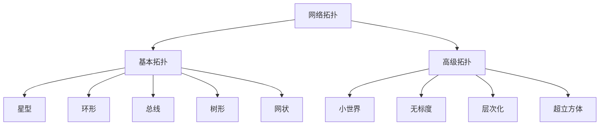
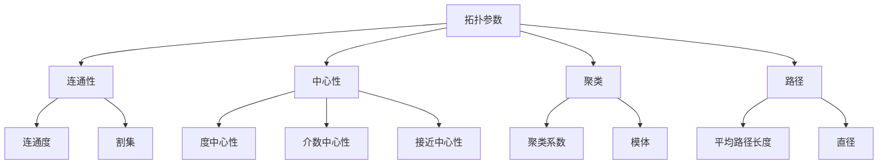
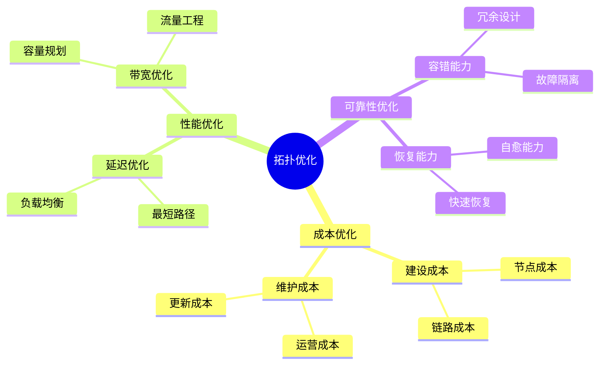
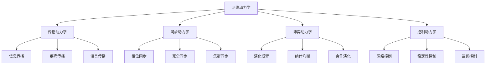
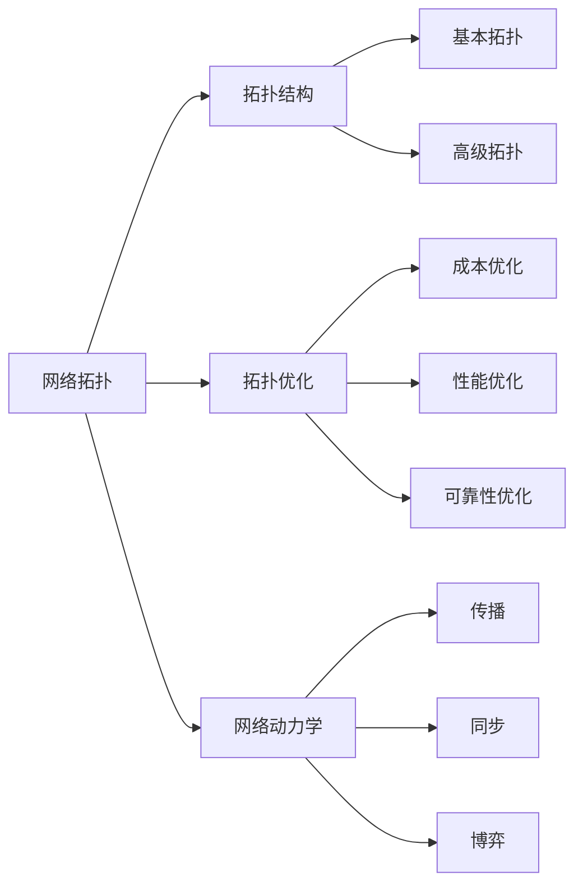
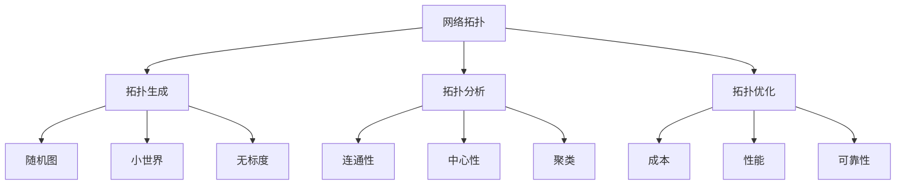
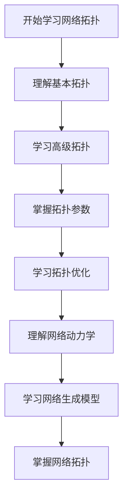
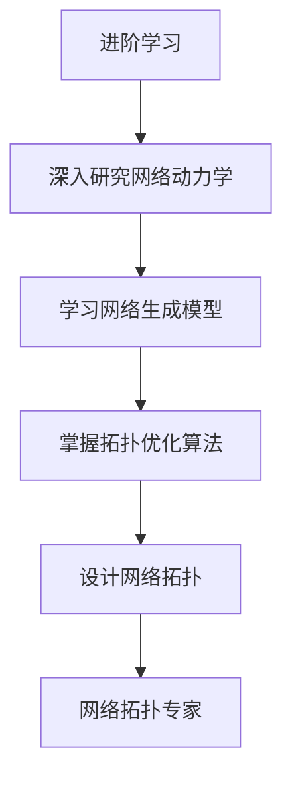

# 网络拓扑模块知识结构思维导图 / Network Topology Module Knowledge Structure Mind Map

## 📚 **概述 / Overview**

本文档提供网络拓扑模块的完整知识结构思维导图，帮助理解网络拓扑知识的层次结构和相互关系。

**创建时间**: 2025年1月
**模块**: 网络拓扑
**状态**: 🚀 持续更新中

---

## 🗺️ **一、整体知识结构 / Overall Knowledge Structure**

```mermaid
mindmap
  root((网络拓扑))
    基本拓扑
      星型拓扑
        中心节点
        单点故障
      环形拓扑
        令牌传递
        故障隔离
      总线拓扑
        共享介质
        冲突检测
      树形拓扑
        层次结构
        可扩展性
      网状拓扑
        全互联
        部分互联
    高级拓扑
      小世界网络
        高聚类
        短路径
        Watts-Strogatz
      无标度网络
        幂律分布
        优先连接
        Barabási-Albert
      层次化网络
        多层结构
        模块化
      超立方体网络
        高维结构
        容错性
    拓扑优化
      成本优化
        建设成本
        维护成本
      性能优化
        延迟优化
        带宽优化
      可靠性优化
        容错能力
        恢复能力
    网络动力学
      传播动力学
        信息传播
        疾病传播
      同步动力学
        相位同步
        完全同步
      博弈动力学
        演化博弈
        纳什均衡
      控制动力学
        网络控制
        稳定性控制
    网络生成模型
      随机图模型
        ER模型
        G(n,p)模型
      几何随机图
        空间嵌入
        距离阈值
      指数随机图
        ERGM
        统计推断
      GraphGAN
        生成对抗
        图生成
    网络拓扑采样
      随机采样
        无偏估计
      雪球采样
        连通子图
      分层采样
        代表性
    网络拓扑聚类
      模块度优化
        Louvain/Leiden
      谱聚类
        拉普拉斯
      标签传播
        大规模
```

---

## 📊 **二、核心概念层次结构 / Core Concept Hierarchy**

### 2.1 拓扑类型层次



### 2.2 拓扑参数层次



---

## 🔬 **三、拓扑优化方法结构 / Topology Optimization Method Structure**

### 3.1 优化目标分类



### 3.2 优化方法对比

| 优化方法 | 优化目标 | 复杂度 | 适用场景 |
|---------|---------|--------|---------|
| **贪心算法** | 单目标 | $O(n^2)$ | 初始设计 |
| **遗传算法** | 多目标 | $O(pop \times gen \times n^2)$ | 复杂优化 |
| **模拟退火** | 单/多目标 | $O(iter \times n^2)$ | 中等规模 |
| **强化学习** | 多目标 | 训练：高 | 动态网络 |

---

## 📐 **四、网络动力学结构 / Network Dynamics Structure**

### 4.1 动力学类型



### 4.2 动力学模型

| 动力学类型 | 模型 | 应用领域 |
|-----------|------|---------|
| **传播动力学** | SIR模型 | 信息传播、疾病传播 |
| **同步动力学** | Kuramoto模型 | 神经网络、电力网络 |
| **博弈动力学** | 演化博弈 | 社会网络、生物网络 |
| **控制动力学** | 网络控制理论 | 智能电网、交通网络 |

---

## 🔗 **五、知识关联网络 / Knowledge Association Network**

### 5.1 概念关联图



### 5.2 拓扑关联图



---

## 📚 **六、学习路径 / Learning Path**

### 6.1 基础学习路径



### 6.2 进阶学习路径



---

## 🎯 **七、应用领域映射 / Application Domain Mapping**

### 7.1 应用领域

| 网络拓扑概念 | 应用领域 | 具体应用 |
|------------|---------|---------|
| **基本拓扑** | 局域网设计 | 星型、树形拓扑 |
| **小世界网络** | 社交网络 | 高聚类、短路径 |
| **无标度网络** | 互联网 | 幂律度分布 |
| **拓扑优化** | 数据中心 | 成本、性能、可靠性优化 |

---

## 📋 **八、知识检查清单 / Knowledge Checklist**

### 8.1 基础概念

- [ ] 理解基本拓扑类型（星型、环形、总线、树形、网状）
- [ ] 掌握高级拓扑类型（小世界、无标度、层次化）
- [ ] 理解拓扑参数（连通性、中心性、聚类、路径）
- [ ] 掌握拓扑表示方法

### 8.2 拓扑优化

- [ ] 理解优化目标（成本、性能、可靠性）
- [ ] 掌握优化方法（贪心、遗传、模拟退火）
- [ ] 了解优化算法复杂度
- [ ] 理解优化结果评估

### 8.3 网络动力学

- [ ] 理解传播动力学模型
- [ ] 掌握同步动力学理论
- [ ] 了解博弈动力学
- [ ] 理解控制动力学

### 8.4 网络生成模型

- [ ] 理解随机图模型
- [ ] 掌握小世界网络生成
- [ ] 了解无标度网络生成
- [ ] 理解网络生成模型应用

---

## 🔗 **相关链接 / Related Links**

- [网络拓扑README](README.md)
- [拓扑结构](01-拓扑结构.md)
- [拓扑优化](02-拓扑优化.md)
- [小世界网络](03-小世界网络.md)
- [思维表征工具](思维表征工具-网络拓扑.md)

---

**文档版本**: v1.0
**创建时间**: 2025年1月
**最后更新**: 2025年1月
**维护者**: GraphNetWorkCommunicate项目组
