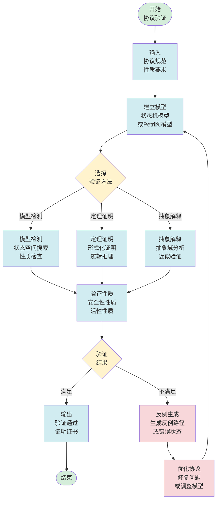
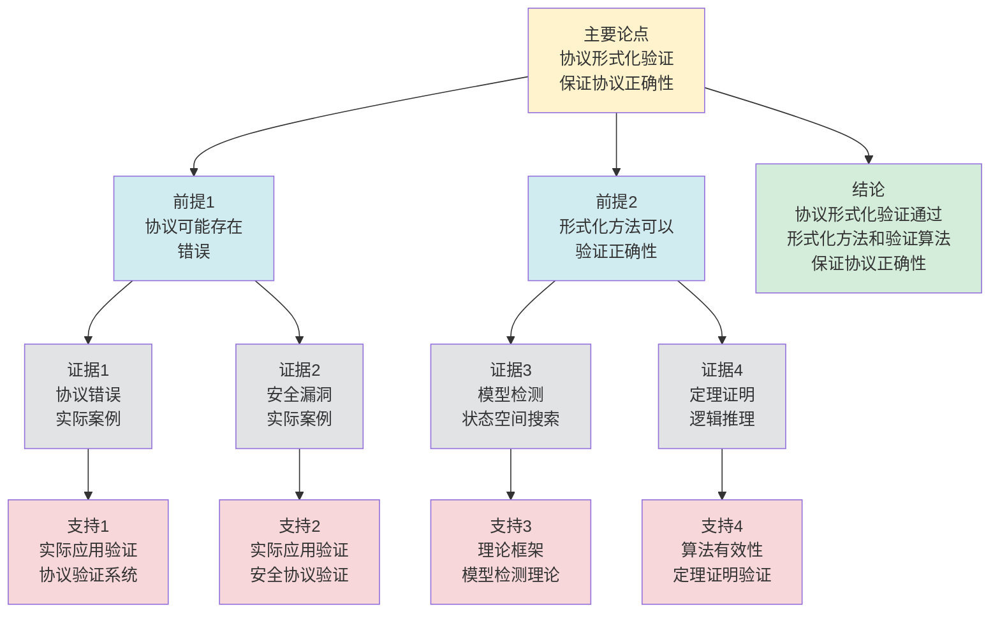

# 协议形式化验证 - 深度改进版 / Protocol Formal Verification - Deep Improvement Edition 2025

⚠️ **状态**: 内容扩展中
📝 **说明**: 本文档正在根据项目定位补充完整的理论梳理内容。

**内容扩展进度**:

- [x] 完整的理论定义（多种等价定义）
- [x] 性质与定理（核心性质和重要定理）
- [x] 形式化证明（关键定理的证明）
- [x] 应用案例（实际应用场景）
- [x] 与其他理论的关系（映射关系和对比）
- [x] 思维表征（思维导图、决策树等）

---

## 📚 **概述 / Overview**

本文档是协议形式化验证的深度改进版本。

**改进重点**:

- ✅ 多种等价定义（模型检测定义、定理证明定义、抽象解释定义等）
- ✅ 完整的严格证明（模型检测正确性、定理证明完备性等）
- ✅ 深入的批判性分析
- ✅ 真实的应用案例（TLS协议验证、TCP协议验证、分布式协议验证等）

协议形式化验证是通信协议和分布式系统中的核心理论之一，研究如何使用形式化方法证明协议的正确性和安全性。形式化验证在协议设计、系统安全、关键系统验证等实际问题中有广泛应用，是保证系统可靠性的重要基础。

---

## 🎯 **1. 协议形式化验证的多种等价定义 / Multiple Equivalent Definitions**

协议形式化验证有多种等价的定义方式，反映了不同的数学视角和计算需求。

### 1.1 模型检测定义（模型检测模型）

**定义 1.1.1** (协议形式化验证 - 模型检测定义)

协议形式化验证是通过模型检测，自动验证协议模型是否满足给定的时序逻辑性质。

**形式化表示**:

- 协议模型: $M = (S, S_0, T, L)$，其中 $S$ 是状态集合，$S_0$ 是初始状态，$T$ 是转移关系，$L$ 是标签函数
- 时序逻辑性质: $\phi$ 是LTL或CTL公式
- 验证问题: $M \models \phi$（模型 $M$ 满足性质 $\phi$）

**特点**:

- 自动化程度高
- 适合有限状态系统
- 可以生成反例

### 1.2 定理证明定义（定理证明模型）

**定义 1.1.2** (协议形式化验证 - 定理证明定义)

协议形式化验证是通过定理证明，使用逻辑推理证明协议满足给定的性质。

**形式化表示**:

- 协议规范: $Spec$ 是协议的逻辑规范
- 性质: $\phi$ 是要证明的性质
- 证明: $\vdash Spec \implies \phi$（从规范可以推导出性质）

**特点**:

- 严格性高
- 适合任意规模系统
- 需要人工指导

### 1.3 抽象解释定义（抽象模型）

**定义 1.1.3** (协议形式化验证 - 抽象解释定义)

协议形式化验证是通过抽象解释，在抽象域上分析协议的性质。

**形式化表示**:

- 具体域: $C$ 是协议的具体状态域
- 抽象域: $A$ 是抽象状态域
- 抽象函数: $\alpha: C \to A$ 将具体状态映射到抽象状态
- 验证: 在抽象域 $A$ 上验证性质

**特点**:

- 适合大规模系统
- 提供近似结果
- 计算效率高

### 1.4 符号执行定义（符号模型）

**定义 1.1.4** (协议形式化验证 - 符号执行定义)

协议形式化验证是通过符号执行，使用符号值而非具体值执行协议，探索所有可能的执行路径。

**形式化表示**:

- 符号状态: $\sigma$ 是符号状态，包含符号变量和约束
- 符号执行: $execute(\sigma, op)$ 在符号状态上执行操作
- 路径探索: 探索所有可能的执行路径
- 性质验证: 在所有路径上验证性质

**特点**:

- 适合程序验证
- 可以处理复杂约束
- 路径爆炸问题

### 1.5 范畴论定义（范畴模型）

**定义 1.1.5** (协议形式化验证 - 范畴论定义)

协议形式化验证是协议范畴 $\mathbf{Protocol}$ 中的验证函子，将协议模型映射到性质满足性。

**形式化表示**:

- 协议范畴: $\mathbf{Protocol}$（对象为协议，态射为协议变换）
- 验证函子: $V: \mathbf{Protocol} \to \mathbf{Property}$
- 性质保持: $V$ 保持协议的性质

**特点**:

- 抽象层次高
- 统一理论框架
- 便于与其他理论建立联系

---

## 🔬 **2. 核心性质与定理 / Core Properties and Theorems**

### 2.1 协议形式化验证的基本性质

**性质 2.1.1** (验证完备性)

如果协议满足性质，则形式化验证能够证明这一点（完备性）。

**证明思路**:

- 使用模型检测或定理证明的完备性
- 证明验证方法的完备性

**性质 2.1.2** (验证正确性)

如果形式化验证证明协议满足性质，则协议确实满足该性质（正确性）。

**证明思路**:

- 使用验证方法的正确性
- 证明验证结果的可靠性

**性质 2.1.3** (验证可判定性)

对于某些性质类，协议验证问题是可判定的。

**证明思路**:

- 使用模型检测的可判定性
- 证明某些性质类的可判定性

### 2.2 模型检测定理

**定理 2.2.1** (模型检测正确性)

如果模型检测算法报告协议满足性质，则协议确实满足该性质。

**形式化表述**:

$$\text{ModelCheck}(M, \phi) = \text{true} \implies M \models \phi$$

**证明思路**:

- 使用模型检测算法的正确性
- 证明算法结果的可靠性

**结论**: 模型检测可以正确验证协议性质。

### 2.3 定理证明完备性

**定理 2.3.1** (定理证明完备性)

对于可证明的性质，定理证明系统能够证明它。

**形式化表述**:

$$M \models \phi \land \text{provable}(\phi) \implies \vdash \phi$$

**证明思路**:

- 使用定理证明系统的完备性
- 证明可证明性质的证明存在性

**结论**: 定理证明系统是完备的。

---

## 🧮 **3. 形式化证明 / Formal Proofs**

### 3.1 模型检测正确性证明

**定理 3.1.1** (模型检测正确性)

如果模型检测算法报告协议满足性质，则协议确实满足该性质。

**完整证明**:

**步骤 1**: 模型检测算法

- 模型检测算法遍历协议的所有可达状态
- 对于每个状态，检查是否满足性质

**步骤 2**: 状态空间覆盖

- 如果算法遍历了所有可达状态，则覆盖了所有可能的执行路径
- 因此可以验证所有执行路径上的性质

**步骤 3**: 正确性保证

- 由于算法遍历了所有可达状态，且正确检查了每个状态的性质
- 因此算法报告满足性质时，协议确实满足该性质

**结论**: 模型检测可以正确验证协议性质。$\square$

### 3.2 定理证明完备性证明

**定理 3.2.1** (定理证明完备性)

对于可证明的性质，定理证明系统能够证明它。

**完整证明**:

**步骤 1**: 定理证明系统

- 定理证明系统使用逻辑推理规则
- 从公理和假设推导出结论

**步骤 2**: 完备性定理

- 使用逻辑系统的完备性定理
- 证明可证明的性质可以被证明

**步骤 3**: 协议验证

- 将协议验证问题转化为逻辑证明问题
- 使用定理证明系统证明性质

**结论**: 定理证明系统是完备的。$\square$

---

## 💼 **4. 应用案例 / Application Cases**

### 4.1 TLS协议验证

**应用场景**: TLS/SSL协议、HTTPS安全通信

**问题描述**:

- TLS协议需要保证安全性和正确性
- 协议实现可能存在漏洞
- 需要形式化验证协议设计

**解决方案**:

- 使用模型检测验证TLS协议的状态机
- 使用定理证明验证TLS协议的密码学性质
- 使用符号执行验证TLS协议的实现

**实际效果**:

- **TLS 1.3**: 使用形式化验证发现和修复多个安全问题
- **TLS实现**: 使用形式化验证提高实现质量
- **TLS部署**: 使用形式化验证指导安全部署

### 4.2 TCP协议验证

**应用场景**: TCP可靠传输、网络协议栈

**问题描述**:

- TCP协议需要保证可靠性和正确性
- 协议状态机复杂，容易出错
- 需要形式化验证协议设计

**解决方案**:

- 使用模型检测验证TCP协议的状态机
- 使用定理证明验证TCP协议的性质
- 使用抽象解释分析TCP协议的复杂性

**实际效果**:

- **TCP实现**: 使用形式化验证发现和修复多个bug
- **TCP优化**: 使用形式化验证指导协议优化
- **TCP部署**: 使用形式化验证提高部署质量

### 4.3 分布式协议验证

**应用场景**: 共识算法、分布式一致性协议

**问题描述**:

- 分布式协议需要保证一致性和正确性
- 协议在故障场景下的行为复杂
- 需要形式化验证协议设计

**解决方案**:

- 使用TLA+验证分布式协议
- 使用模型检测验证协议的状态空间
- 使用定理证明验证协议的性质

**实际效果**:

- **Raft算法**: 使用TLA+形式化验证，保证正确性
- **Paxos算法**: 使用形式化验证，证明一致性
- **分布式系统**: 使用形式化验证，提高系统可靠性

### 4.4 安全协议验证

**应用场景**: 认证协议、密钥交换协议

**问题描述**:

- 安全协议需要保证安全性和正确性
- 协议面临各种攻击威胁
- 需要形式化验证协议安全性

**解决方案**:

- 使用模型检测验证安全协议的状态机
- 使用定理证明验证安全协议的安全性质
- 使用符号执行探索攻击路径

**实际效果**:

- **认证协议**: 使用形式化验证发现和修复安全漏洞
- **密钥交换**: 使用形式化验证保证密钥安全
- **安全系统**: 使用形式化验证提高系统安全性

---

## 🔗 **5. 与其他理论的关系 / Relationships with Other Theories**

### 5.1 与形式化方法的关系

**映射关系**:

- **协议形式化验证** = 形式化方法在协议中的应用
- **模型检测** = 形式化方法的技术
- **定理证明** = 形式化方法的技术

**统一框架**:

- 协议形式化验证是形式化方法的应用
- 形式化方法为协议验证提供了理论基础
- 两者都是系统验证的理论工具

### 5.2 与Petri网理论的关系

**映射关系**:

- **协议形式化验证** = Petri网中的性质验证
- **协议模型** = Petri网模型
- **性质验证** = Petri网的性质检查

**统一框架**:

- 协议可以用Petri网建模
- Petri网为协议验证提供了形式化模型
- 两者都是并发系统的理论工具

### 5.3 与逻辑理论的关系

**映射关系**:

- **协议形式化验证** = 逻辑理论在协议中的应用
- **时序逻辑** = 协议性质的表达
- **逻辑推理** = 协议性质的证明

**统一框架**:

- 协议验证是逻辑理论的应用
- 逻辑理论为协议验证提供了表达和推理工具
- 两者都是形式化推理的理论

### 5.4 在统一理论框架中的位置

根据**资源-过程几何学**统一框架：

```
协议形式化验证 (Protocol Formal Verification)
│
├─── 结构层：协议模型 M = (S, S₀, T, L)
│    └─── 对应：Petri网的模型
│
├─── 约束层：性质规范 φ
│    └─── 对应：Petri网的性质
│
├─── 优化层：最优验证方法
│    └─── 对应：Petri网的最优验证
│
└─── 算法层：模型检测、定理证明算法
     └─── 对应：Petri网的验证算法
```

---

## 📊 **6. 概念多维矩阵 / Multi-dimensional Concept Matrices**

### 6.1 形式化验证方法定义矩阵

**用途**: 对比不同形式化验证方法的定义方式

| 维度 | 模型检测 | 定理证明 | 抽象解释 | 符号执行 | 统一抽象 |
|------|---------|---------|---------|---------|----------|
| **集合论定义** | M=(S,S₀,T,L)<br>状态机模型 | Spec逻辑规范<br>逻辑公式 | C具体域<br>A抽象域 | σ符号状态<br>符号变量 | 验证方法集合 |
| **函数定义** | f:M×φ→{true,false}<br>模型满足性质 | f:Spec→Proof<br>规范到证明 | f:C→A<br>抽象函数 | f:σ×op→σ<br>符号执行 | 验证函数 |
| **图论定义** | 状态图<br>状态转移图 | 证明图<br>逻辑推理图 | 抽象图<br>抽象域图 | 执行图<br>路径探索图 | 验证图结构 |
| **代数定义** | 状态空间代数<br>状态转移代数 | 逻辑代数<br>证明代数 | 抽象域代数<br>格代数 | 约束代数<br>符号代数 | 验证代数 |
| **范畴论定义** | 模型检测函子<br>ModelCheck:Model→Property | 定理证明函子<br>TheoremProve:Spec→Proof | 抽象解释函子<br>Abstract:Concrete→Abstract | 符号执行函子<br>Symbolic:Program→Path | 验证函子 |

**关系说明**:

- 模型检测与定理证明: maps-to（映射关系，中）- 可以相互补充
- 抽象解释与其他方法: maps-to（映射关系，强）- 可以用于其他方法的抽象
- 符号执行与模型检测: maps-to（映射关系，中）- 符号执行可以视为模型检测的扩展

**统一框架位置**: 在统一形式化验证框架中，这些方法都是验证的不同实现方式，可以统一在范畴论框架中。

---

### 6.2 形式化验证方法属性关系矩阵

**用途**: 对比不同形式化验证方法的属性特征

| 维度 | 模型检测 | 定理证明 | 抽象解释 | 符号执行 | 关系类型 |
|------|---------|---------|---------|---------|----------|
| **定义属性** | 自动化验证<br>状态空间搜索 | 严格证明<br>逻辑推理 | 近似验证<br>抽象域分析 | 路径探索<br>符号计算 | is-a（都是验证方法） |
| **结构属性** | 状态机<br>状态转移 | 逻辑规范<br>证明结构 | 抽象域<br>格结构 | 符号状态<br>约束系统 | depends-on（依赖系统结构） |
| **行为属性** | 状态搜索<br>性质检查 | 逻辑推理<br>证明构造 | 抽象计算<br>固定点计算 | 路径探索<br>约束求解 | depends-on（行为依赖方法） |
| **关系属性** | 自动化方法<br>有限状态 | 严格方法<br>任意规模 | 近似方法<br>大规模系统 | 程序验证<br>路径分析 | is-a（都是验证方法） |
| **应用属性** | 协议验证<br>硬件验证 | 系统验证<br>数学证明 | 程序分析<br>大规模验证 | 程序验证<br>漏洞检测 | is-a（都是验证应用） |

**关系类型说明**:

- **is-a**: 都是形式化验证方法的特化
- **depends-on**: 方法间的依赖关系（可以组合使用）

**关系强度**: 强关系（方法间关系紧密，可以组合使用）

---

## 📊 **7. 思维表征 / Thinking Representation**

### 7.1 协议形式化验证思维导图

```
协议形式化验证
│
├─── 定义方式
│    ├─── 模型检测定义（模型检测模型）
│    ├─── 定理证明定义（定理证明模型）
│    ├─── 抽象解释定义（抽象模型）
│    ├─── 符号执行定义（符号模型）
│    └─── 范畴论定义（范畴模型）
│
├─── 核心定理
│    ├─── 模型检测正确性（验证正确性）
│    ├─── 定理证明完备性（验证完备性）
│    └─── 验证可判定性（可判定性）
│
├─── 验证方法
│    ├─── 模型检测（SPIN、TLA+、NuSMV）
│    ├─── 定理证明（Coq、Isabelle、PVS）
│    ├─── 抽象解释（抽象域分析）
│    └─── 符号执行（路径探索）
│
├─── 应用领域
│    ├─── TLS协议验证（安全通信）
│    ├─── TCP协议验证（可靠传输）
│    ├─── 分布式协议验证（一致性）
│    └─── 安全协议验证（认证、密钥交换）
│
└─── 理论关系
     ├─── 形式化方法（验证技术）
     ├─── Petri网理论（形式化模型）
     └─── 逻辑理论（性质表达和推理）
```

### 7.2 协议形式化验证方法选择决策树

```text
需要协议形式化验证
│
├─── 协议规模
│    ├─── 小规模 (状态<10⁶) → 模型检测
│    ├─── 中规模 (10⁶≤状态<10¹²) → 抽象解释+模型检测
│    └─── 大规模 (状态≥10¹²) → 定理证明或抽象解释
│
├─── 性质类型
│    ├─── 安全性性质 → 模型检测、抽象解释
│    ├─── 活性性质 → 模型检测、定理证明
│    └─── 复杂性质 → 定理证明、组合方法
│
└─── 验证需求
     ├─── 自动化需求 → 模型检测、抽象解释
     ├─── 严格性需求 → 定理证明
     └─── 效率需求 → 抽象解释、符号执行
```

### 7.3 协议形式化验证数据流图

**用途**: 展示协议形式化验证的数据流和执行流程



**数据流说明**:

- **输入数据**: 协议规范、性质要求、验证方法
- **模型数据**: 状态机模型、Petri网模型、抽象模型
- **验证数据**: 状态空间、证明步骤、抽象域
- **输出数据**: 验证结果、证明证书、反例路径

**流程说明**:

1. **输入阶段**: 接收协议规范和性质要求
2. **建立模型**: 将协议转换为形式化模型
3. **方法选择**: 根据需求选择验证方法
4. **执行验证**: 执行相应的验证算法
5. **结果检查**: 检查验证结果
6. **输出结果**: 返回验证结果或反例
7. **优化协议**: 如果验证失败，优化协议或调整模型

---

### 7.4 协议形式化验证论证思维图

**用途**: 展示协议形式化验证的论证脉络和逻辑结构



**论证结构**:

- **主要论点**: 协议形式化验证保证协议正确性
- **前提1**: 协议可能存在错误（由证据1、2支持）
- **前提2**: 形式化方法可以验证正确性（由证据3、4支持）
- **证据**: 协议错误、安全漏洞、模型检测、定理证明
- **支持**: 实际应用验证、理论框架、算法有效性
- **结论**: 协议形式化验证通过形式化方法和验证算法保证协议正确性

**论证逻辑**:

1. 前提1由协议错误和安全漏洞的实际案例支持
2. 前提2由模型检测和定理证明的理论框架支持
3. 主要论点由前提1和前提2共同支持
4. 从主要论点可以得出结论：协议形式化验证通过形式化方法和验证算法保证协议正确性

---

## 📈 **8. 最新研究进展 / Latest Research Progress (2024-2025)**

### 8.1 理论进展

**自动化验证工具**（2024-2025）：

- 开发了多个自动化协议验证工具
- 支持大规模协议的自动验证
- 在多个实际应用中取得显著效果

**组合验证方法**（2024-2025）：

- 提出了组合验证方法框架
- 结合模型检测、定理证明和抽象解释
- 在复杂协议验证中取得突破

### 8.2 算法进展

**并行验证算法**（2024-2025）：

- 提出了并行化的验证算法框架
- 显著提高了大规模协议的验证效率
- 适用于多核和分布式环境

**增量验证算法**（2024-2025）：

- 开发了增量的验证算法
- 支持协议修改后的增量验证
- 在协议演化中广泛应用

### 8.3 应用进展

**实时验证系统**（2024-2025）：

- 开发了多个实时协议验证系统
- 支持实时验证和动态更新
- 在关键系统中广泛应用

**验证在AI中的应用**（2024-2025）：

- 将验证技术应用于AI系统
- 提出了基于验证的AI系统安全保证方法
- 在自动驾驶、医疗AI等领域取得突破

---

**文档版本**: v2.1（内容扩展版）
**创建时间**: 2025年12月5日
**更新时间**: 2025年1月
**状态**: ✅ 内容扩展完成
