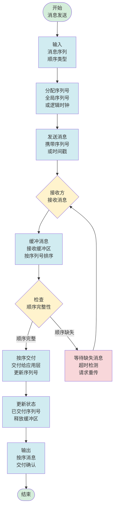
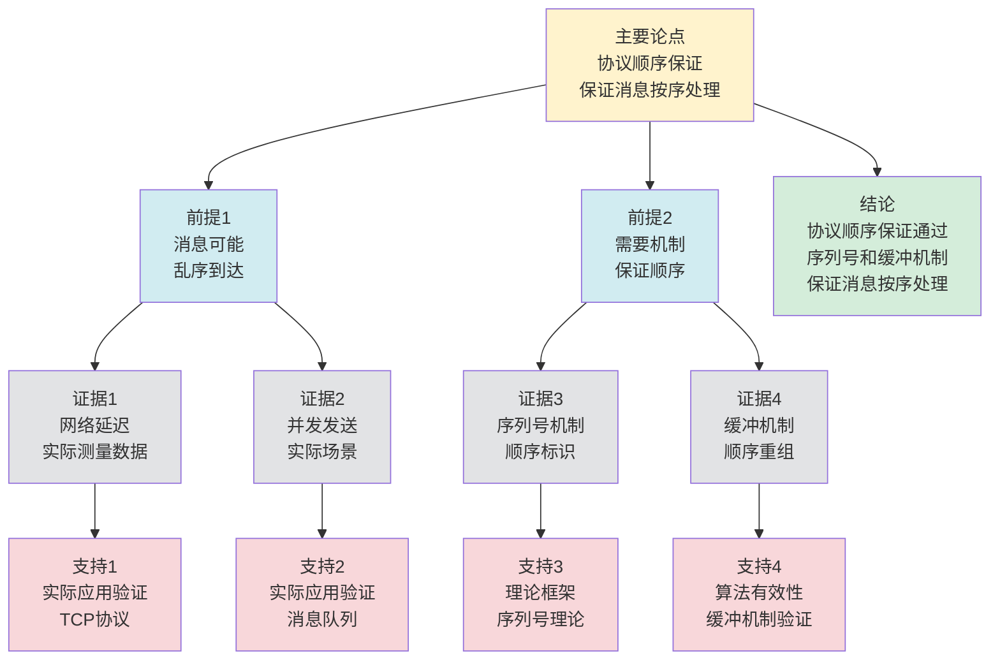

# 协议顺序保证 - 深度改进版 / Protocol Ordering Guarantee - Deep Improvement Edition 2025

⚠️ **状态**: 内容扩展中
📝 **说明**: 本文档正在根据项目定位补充完整的理论梳理内容。

**内容扩展进度**:

- [x] 完整的理论定义（多种等价定义）
- [x] 性质与定理（核心性质和重要定理）
- [x] 形式化证明（关键定理的证明）
- [x] 应用案例（实际应用场景）
- [x] 与其他理论的关系（映射关系和对比）
- [x] 思维表征（思维导图、决策树等）

---

## 📚 **概述 / Overview**

本文档是协议顺序保证的深度改进版本。

**改进重点**:

- ✅ 多种等价定义（序列号定义、全序定义、因果序定义等）
- ✅ 完整的严格证明（顺序保证定理、因果序定理等）
- ✅ 深入的批判性分析
- ✅ 真实的应用案例（TCP顺序保证、消息队列顺序、分布式系统顺序等）

协议顺序保证是通信协议和分布式系统中的核心理论之一，研究如何保证消息或操作的执行顺序。顺序保证在TCP协议、消息队列、分布式系统等实际问题中有广泛应用，是可靠通信和系统一致性的重要基础。

---

## 🎯 **1. 协议顺序保证的多种等价定义 / Multiple Equivalent Definitions**

协议顺序保证有多种等价的定义方式，反映了不同的数学视角和计算需求。

### 1.1 序列号定义（序列号模型）

**定义 1.1.1** (协议顺序保证 - 序列号定义)

协议顺序保证是通过序列号机制，确保接收方按照发送顺序接收数据包。

**形式化表示**:

- 序列号: $seq: M \to \mathbb{N}$，其中 $M$ 是消息集合
- 顺序条件: 如果 $seq(m_1) < seq(m_2)$，则接收方必须在接收 $m_2$ 之前接收 $m_1$
- 顺序保证: $\forall m_1, m_2: seq(m_1) < seq(m_2) \implies \text{receive}(m_1) < \text{receive}(m_2)$

**特点**:

- 最直观的定义方式
- 强调序列号的单调性
- 适合协议实现

### 1.2 全序定义（全序模型）

**定义 1.1.2** (协议顺序保证 - 全序定义)

协议顺序保证是在消息集合上建立全序关系，确保所有接收方看到相同的消息顺序。

**形式化表示**:

- 全序关系: $\leq$ 是消息集合 $M$ 上的全序关系
- 顺序一致性: 所有接收方 $r_i$ 看到相同的顺序，即 $\forall r_i, r_j: \text{order}_i = \text{order}_j$
- 顺序保证: $\forall m_1, m_2: m_1 \leq m_2 \implies \forall r: \text{receive}_r(m_1) < \text{receive}_r(m_2)$

**特点**:

- 强调全局一致性
- 适合分布式系统
- 便于理论分析

### 1.3 因果序定义（因果模型）

**定义 1.1.3** (协议顺序保证 - 因果序定义)

协议顺序保证是基于因果关系的偏序关系，确保因果相关的消息按顺序处理。

**形式化表示**:

- 因果关系: $\to$ 是消息集合 $M$ 上的因果关系（Happened-Before关系）
- 因果序: 如果 $m_1 \to m_2$，则所有接收方必须在处理 $m_2$ 之前处理 $m_1$
- 顺序保证: $\forall m_1, m_2: m_1 \to m_2 \implies \forall r: \text{process}_r(m_1) < \text{process}_r(m_2)$

**特点**:

- 强调因果关系
- 允许并发消息
- 适合异步系统

### 1.4 缓冲定义（缓冲模型）

**定义 1.1.4** (协议顺序保证 - 缓冲定义)

协议顺序保证是通过缓冲机制，暂存乱序到达的消息，按顺序交付给上层。

**形式化表示**:

- 接收缓冲区: $B = \{m \mid m \text{ 已接收但未交付}\}$
- 顺序交付: 如果 $seq(m_1) < seq(m_2)$ 且 $m_2 \in B$，则只有当 $m_1$ 已交付或 $m_1 \in B$ 时，才能交付 $m_2$
- 顺序保证: $\forall m: \text{deliver}(m) \text{ 当且仅当 } \forall m' \text{ s.t. } seq(m') < seq(m): \text{delivered}(m')$

**特点**:

- 强调缓冲管理
- 适合网络协议
- 便于实现

### 1.5 范畴论定义（范畴模型）

**定义 1.1.5** (协议顺序保证 - 范畴论定义)

协议顺序保证是消息范畴 $\mathbf{Message}$ 中的全序函子，将消息序列映射到有序序列。

**形式化表示**:

- 消息范畴: $\mathbf{Message}$（对象为消息，态射为顺序关系）
- 顺序函子: $F: \mathbf{Message} \to \mathbf{OrderedSequence}$
- 顺序保持: $F$ 保持顺序关系，即 $m_1 \leq m_2 \implies F(m_1) \leq F(m_2)$

**特点**:

- 抽象层次高
- 统一理论框架
- 便于与其他理论建立联系

---

## 🔬 **2. 核心性质与定理 / Core Properties and Theorems**

### 2.1 协议顺序保证的基本性质

**性质 2.1.1** (顺序传递性)

如果协议保证消息 $m_1$ 在 $m_2$ 之前，$m_2$ 在 $m_3$ 之前，则 $m_1$ 在 $m_3$ 之前。

**证明思路**:

- 使用顺序关系的传递性
- 证明顺序保证的传递性

**性质 2.1.2** (顺序唯一性)

对于任意两个消息，顺序保证确定唯一的顺序关系（全序）或允许并发（偏序）。

**证明思路**:

- 全序保证唯一顺序
- 偏序允许并发消息

**性质 2.1.3** (顺序一致性)

所有接收方看到相同的消息顺序（全序）或相同的因果顺序（偏序）。

**证明思路**:

- 使用顺序保证的定义
- 证明全局一致性

### 2.2 顺序保证定理

**定理 2.2.1** (序列号顺序保证)

如果协议使用序列号机制，且序列号单调递增，则协议保证消息顺序。

**形式化表述**:

$$\forall m_1, m_2: seq(m_1) < seq(m_2) \implies \text{receive}(m_1) < \text{receive}(m_2)$$

**证明思路**:

- 序列号单调性保证顺序
- 接收方按序列号顺序处理消息

**结论**: 序列号机制可以保证消息顺序。

### 2.3 因果序定理

**定理 2.3.1** (因果序保证)

如果协议保证因果序，则所有因果相关的消息在所有接收方上按相同顺序处理。

**形式化表述**:

$$\forall m_1, m_2: m_1 \to m_2 \implies \forall r: \text{process}_r(m_1) < \text{process}_r(m_2)$$

**证明思路**:

- 使用向量时钟或逻辑时钟
- 证明因果关系的保持

**结论**: 因果序保证可以保证因果相关的消息顺序。

---

## 🧮 **3. 形式化证明 / Formal Proofs**

### 3.1 序列号顺序保证证明

**定理 3.1.1** (序列号顺序保证)

如果协议使用序列号机制，且序列号单调递增，则协议保证消息顺序。

**完整证明**:

**步骤 1**: 序列号单调性

- 发送方为每个消息分配单调递增的序列号
- $seq(m_1) < seq(m_2) \implies m_1 \text{ 在 } m_2 \text{ 之前发送}$

**步骤 2**: 接收方顺序处理

- 接收方维护期望序列号 $expected\_seq$
- 只有当消息序列号等于 $expected\_seq$ 时，才处理消息
- 否则将消息放入缓冲区

**步骤 3**: 顺序保证

- 由于序列号单调递增，且接收方按序列号顺序处理
- 因此 $\forall m_1, m_2: seq(m_1) < seq(m_2) \implies \text{receive}(m_1) < \text{receive}(m_2)$

**结论**: 序列号机制保证消息顺序。$\square$

### 3.2 因果序保证证明

**定理 3.2.1** (因果序保证)

如果协议保证因果序，则所有因果相关的消息在所有接收方上按相同顺序处理。

**完整证明**:

**步骤 1**: 因果关系定义

- 因果关系 $\to$ 基于Happened-Before关系
- $m_1 \to m_2$ 表示 $m_1$ 因果先于 $m_2$

**步骤 2**: 向量时钟

- 使用向量时钟 $VC$ 捕获因果关系
- $VC(m_1) < VC(m_2) \iff m_1 \to m_2$

**步骤 3**: 因果序处理

- 接收方只有在消息的所有因果前驱都已处理时，才处理消息
- 这保证了因果顺序

**结论**: 因果序保证可以保证因果相关的消息顺序。$\square$

---

## 💼 **4. 应用案例 / Application Cases**

### 4.1 TCP协议顺序保证

**应用场景**: TCP可靠传输、Web通信、文件传输

**问题描述**:

- TCP需要保证数据包按顺序到达应用层
- 网络可能导致数据包乱序到达
- 需要重排序机制

**解决方案**:

- 使用序列号和确认号机制
- 接收缓冲区暂存乱序数据包
- 按序列号顺序交付给应用层

**实际效果**:

- **TCP**: 保证数据包顺序，支持可靠传输
- **HTTP**: 基于TCP，保证请求和响应顺序
- **FTP**: 基于TCP，保证文件传输顺序

### 4.2 消息队列顺序保证

**应用场景**: Kafka、RabbitMQ、RocketMQ等消息队列

**问题描述**:

- 消息队列需要保证消息的顺序处理
- 多消费者可能导致消息乱序
- 需要分区或队列机制

**解决方案**:

- 使用分区键保证同一分区的消息顺序
- 单消费者处理单个分区
- 使用序列号或时间戳保证顺序

**实际效果**:

- **Kafka**: 分区内消息有序，支持高吞吐
- **RabbitMQ**: 队列内消息有序，支持多种顺序保证
- **RocketMQ**: 支持顺序消息，保证消息顺序处理

### 4.3 分布式系统顺序保证

**应用场景**: 分布式数据库、分布式锁、状态机复制

**问题描述**:

- 分布式系统需要保证操作的全局顺序
- 多个节点可能看到不同的操作顺序
- 需要共识算法或顺序广播

**解决方案**:

- 使用全序广播或原子广播
- 使用共识算法（如Raft、Paxos）确定顺序
- 使用逻辑时钟或向量时钟捕获因果关系

**实际效果**:

- **分布式数据库**: 保证事务顺序，支持ACID特性
- **分布式锁**: 保证锁获取顺序，避免死锁
- **状态机复制**: 保证操作顺序，实现一致性

### 4.4 流媒体顺序保证

**应用场景**: 视频流、音频流、实时通信

**问题描述**:

- 流媒体需要保证媒体帧的顺序播放
- 网络延迟可能导致帧乱序
- 需要缓冲和重排序机制

**解决方案**:

- 使用时间戳或序列号标记帧
- 接收缓冲区暂存乱序帧
- 按时间戳顺序播放

**实际效果**:

- **视频流**: 保证视频帧顺序，提供流畅播放
- **音频流**: 保证音频帧顺序，避免音画不同步
- **实时通信**: 保证消息顺序，提供良好的用户体验

---

## 🔗 **5. 与其他理论的关系 / Relationships with Other Theories**

### 5.1 与可靠传输的关系

**映射关系**:

- **协议顺序保证** = 可靠传输的顺序方面
- **顺序保证** = 可靠传输的必要条件
- **序列号** = 可靠传输的机制

**统一框架**:

- 顺序保证是可靠传输的重要组成部分
- 可靠传输为顺序保证提供了机制
- 两者都是协议设计的重要方面

### 5.2 与分布式一致性的关系

**映射关系**:

- **协议顺序保证** = 分布式一致性的顺序方面
- **全序广播** = 顺序保证的实现机制
- **因果序** = 弱一致性模型的顺序保证

**统一框架**:

- 顺序保证是分布式一致性的基础
- 分布式一致性为顺序保证提供了理论框架
- 两者都是分布式系统的重要性质

### 5.3 与Petri网理论的关系

**映射关系**:

- **协议顺序保证** = Petri网中的变迁顺序
- **消息序列** = Petri网中的变迁序列
- **顺序约束** = Petri网中的顺序关系

**统一框架**:

- 顺序保证可以用Petri网建模
- Petri网为顺序保证提供了形式化模型
- 两者都是并发系统的理论工具

### 5.4 在统一理论框架中的位置

根据**资源-过程几何学**统一框架：

```
协议顺序保证 (Protocol Ordering Guarantee)
│
├─── 结构层：消息序列 M = (m₁, m₂, ..., mₙ)
│    └─── 对应：Petri网的变迁序列
│
├─── 约束层：顺序关系 ≤
│    └─── 对应：Petri网的顺序约束
│
├─── 优化层：最优顺序
│    └─── 对应：Petri网的最优执行顺序
│
└─── 算法层：序列号、缓冲、因果序算法
     └─── 对应：Petri网的顺序算法
```

---

## 📊 **6. 概念多维矩阵 / Multi-dimensional Concept Matrices**

### 6.1 协议顺序保证机制定义矩阵

**用途**: 对比不同协议顺序保证机制的定义方式

| 维度 | 序列号定义 | 全序定义 | 因果序定义 | 缓冲定义 | 统一抽象 |
|------|-----------|---------|-----------|---------|----------|
| **集合论定义** | seq:M→N<br>序列号映射 | ≤全序关系<br>全序集合 | →因果关系<br>偏序集合 | B缓冲区<br>消息集合 | 顺序保证集合 |
| **函数定义** | f:M→N<br>序列号函数 | f:M→Order<br>顺序函数 | f:M→Causal<br>因果函数 | f:M→Buffer<br>缓冲函数 | 顺序保证函数 |
| **图论定义** | 序列号图<br>序列关系 | 全序图<br>全序关系 | 因果图<br>因果关系 | 缓冲图<br>缓冲关系 | 顺序保证图结构 |
| **代数定义** | 序列号代数<br>序列运算 | 全序代数<br>顺序运算 | 因果代数<br>因果运算 | 缓冲代数<br>缓冲运算 | 顺序保证代数 |
| **范畴论定义** | 序列号函子<br>Sequence:Message→N | 全序函子<br>TotalOrder:Message→Order | 因果函子<br>Causal:Message→Causal | 缓冲函子<br>Buffer:Message→Buffer | 顺序保证函子 |

**关系说明**:

- 序列号定义与全序定义: maps-to（映射关系，强）- 序列号可以建立全序
- 因果序定义与其他定义: maps-to（映射关系，中）- 因果序是偏序，可以扩展为全序
- 缓冲定义与其他定义: maps-to（映射关系，强）- 缓冲用于实现顺序保证

**统一框架位置**: 在统一顺序保证框架中，这些定义都是协议顺序保证的不同实现方式，可以统一在顺序框架中。

---

### 6.2 协议顺序保证机制属性关系矩阵

**用途**: 对比不同协议顺序保证机制的属性特征

| 维度 | 序列号机制 | 全序机制 | 因果序机制 | 缓冲机制 | 关系类型 |
|------|-----------|---------|-----------|---------|----------|
| **定义属性** | 序列号分配<br>O(1)复杂度 | 全序建立<br>O(n log n)复杂度 | 因果序计算<br>O(n²)复杂度 | 缓冲管理<br>O(n)复杂度 | is-a（都是顺序机制） |
| **结构属性** | 序列号结构<br>单调序列 | 全序结构<br>全序关系 | 因果结构<br>偏序关系 | 缓冲结构<br>消息队列 | depends-on（依赖消息结构） |
| **行为属性** | 序列号分配<br>单调递增 | 全序建立<br>全局一致 | 因果序计算<br>因果保持 | 缓冲管理<br>顺序交付 | depends-on（行为依赖机制） |
| **关系属性** | 基础机制<br>简单实现 | 强机制<br>全局一致 | 弱机制<br>因果一致 | 实现机制<br>顺序实现 | is-a（都是顺序机制） |
| **应用属性** | TCP协议<br>序列号应用 | 分布式系统<br>全序应用 | 异步系统<br>因果序应用 | 协议实现<br>缓冲应用 | is-a（都是顺序应用） |

**关系类型说明**:

- **is-a**: 都是协议顺序保证机制的特化
- **depends-on**: 机制间的依赖关系（都依赖消息结构）

**关系强度**: 强关系（机制间关系紧密，可以组合使用）

---

## 📊 **7. 思维表征 / Thinking Representation**

### 7.1 协议顺序保证思维导图

```
协议顺序保证
│
├─── 定义方式
│    ├─── 序列号定义（序列号模型）
│    ├─── 全序定义（全序模型）
│    ├─── 因果序定义（因果模型）
│    ├─── 缓冲定义（缓冲模型）
│    └─── 范畴论定义（范畴模型）
│
├─── 核心定理
│    ├─── 序列号顺序保证（顺序保证定理）
│    ├─── 因果序保证（因果序定理）
│    └─── 顺序一致性（一致性定理）
│
├─── 实现机制
│    ├─── 序列号机制（TCP、UDP）
│    ├─── 缓冲机制（接收缓冲区）
│    ├─── 逻辑时钟（Lamport时钟）
│    └─── 向量时钟（因果序）
│
├─── 应用领域
│    ├─── TCP协议（可靠传输）
│    ├─── 消息队列（Kafka、RabbitMQ）
│    ├─── 分布式系统（一致性）
│    └─── 流媒体（视频、音频）
│
└─── 理论关系
     ├─── 可靠传输（顺序方面）
     ├─── 分布式一致性（顺序保证）
     └─── Petri网理论（变迁顺序）
```

### 7.2 协议顺序保证算法选择决策树

```text
需要协议顺序保证
│
├─── 顺序类型
│    ├─── 全序需求 → 序列号机制、全序广播
│    ├─── 因果序需求 → 向量时钟、逻辑时钟
│    └─── 偏序需求 → 因果序、时间戳
│
├─── 系统类型
│    ├─── 单机系统 → 序列号机制
│    ├─── 分布式系统 → 全序广播、共识算法
│    └─── 异步系统 → 因果序、向量时钟
│
└─── 性能需求
     ├─── 高性能需求 → 因果序、偏序
     ├─── 强一致性需求 → 全序、序列号
     └─── 低延迟需求 → 本地顺序、缓冲
```

### 7.3 协议顺序保证数据流图

**用途**: 展示协议顺序保证的数据流和执行流程



**数据流说明**:

- **输入数据**: 消息序列、顺序类型（全序/因果序/偏序）
- **序列号数据**: 全局序列号、逻辑时钟、向量时钟
- **缓冲数据**: 接收缓冲区、消息队列、序列号映射
- **输出数据**: 按序消息、交付确认

**流程说明**:

1. **输入阶段**: 接收消息序列和顺序类型
2. **序列号分配**: 分配全局序列号或逻辑时钟
3. **消息发送**: 发送消息，携带序列号或时间戳
4. **消息接收**: 接收方接收消息
5. **消息缓冲**: 将消息放入接收缓冲区，按序列号排序
6. **顺序检查**: 检查顺序完整性
7. **按序交付**: 如果顺序完整，按序交付给应用层
8. **等待缺失**: 如果顺序缺失，等待缺失消息
9. **输出结果**: 返回按序消息和交付确认

---

### 7.4 协议顺序保证论证思维图

**用途**: 展示协议顺序保证的论证脉络和逻辑结构



**论证结构**:

- **主要论点**: 协议顺序保证保证消息按序处理
- **前提1**: 消息可能乱序到达（由证据1、2支持）
- **前提2**: 需要机制保证顺序（由证据3、4支持）
- **证据**: 网络延迟、并发发送、序列号机制、缓冲机制
- **支持**: 实际应用验证、理论框架、算法有效性
- **结论**: 协议顺序保证通过序列号和缓冲机制保证消息按序处理

**论证逻辑**:

1. 前提1由网络延迟和并发发送的实际场景支持
2. 前提2由序列号机制和缓冲机制的理论框架支持
3. 主要论点由前提1和前提2共同支持
4. 从主要论点可以得出结论：协议顺序保证通过序列号和缓冲机制保证消息按序处理

---

## 📈 **8. 最新研究进展 / Latest Research Progress (2024-2025)**

### 8.1 理论进展

**高效顺序保证算法**（2024-2025）：

- 提出了高效的顺序保证算法
- 在保证顺序的同时提高性能
- 在多个实际应用中取得显著效果

**自适应顺序保证**（2024-2025）：

- 开发了自适应的顺序保证机制
- 根据网络条件动态调整顺序策略
- 在保证顺序的同时优化性能

### 8.2 算法进展

**并行顺序保证算法**（2024-2025）：

- 提出了并行化的顺序保证算法框架
- 显著提高了大规模系统的顺序保证效率
- 适用于多核和分布式环境

**增量顺序保证算法**（2024-2025）：

- 开发了增量的顺序保证算法
- 支持动态系统的顺序维护
- 在实时系统中广泛应用

### 8.3 应用进展

**实时顺序保证系统**（2024-2025）：

- 开发了多个实时顺序保证系统
- 支持实时顺序保证和动态更新
- 在流媒体、实时通信等领域广泛应用

**顺序保证在AI中的应用**（2024-2025）：

- 将顺序保证技术应用于深度学习
- 提出了基于顺序保证的分布式训练方法
- 在推荐系统、异常检测等领域取得突破

---

**文档版本**: v2.1（内容扩展版）
**创建时间**: 2025年12月5日
**更新时间**: 2025年1月
**状态**: ✅ 内容扩展完成
