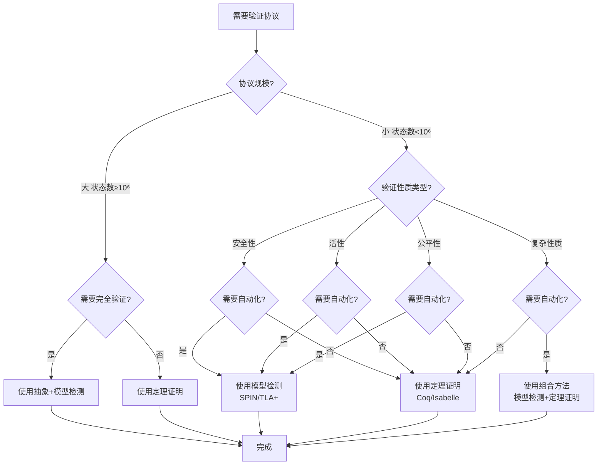
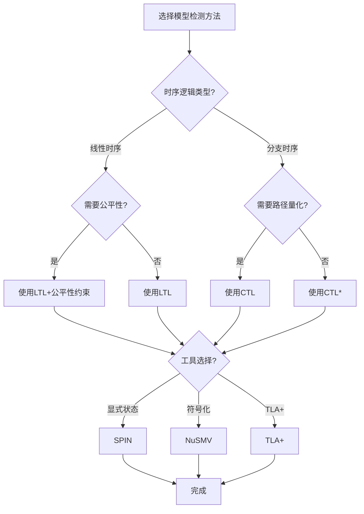
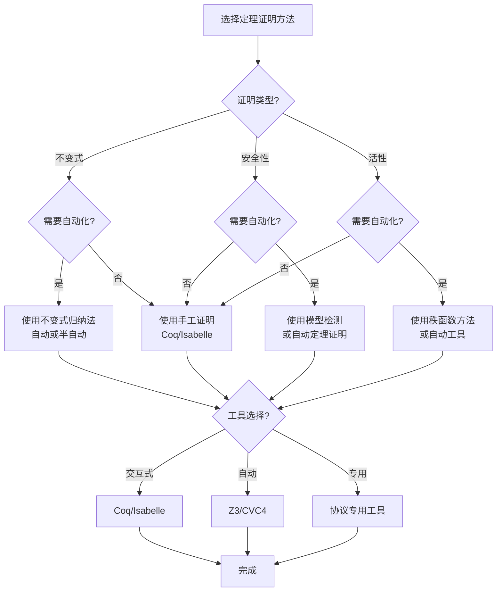
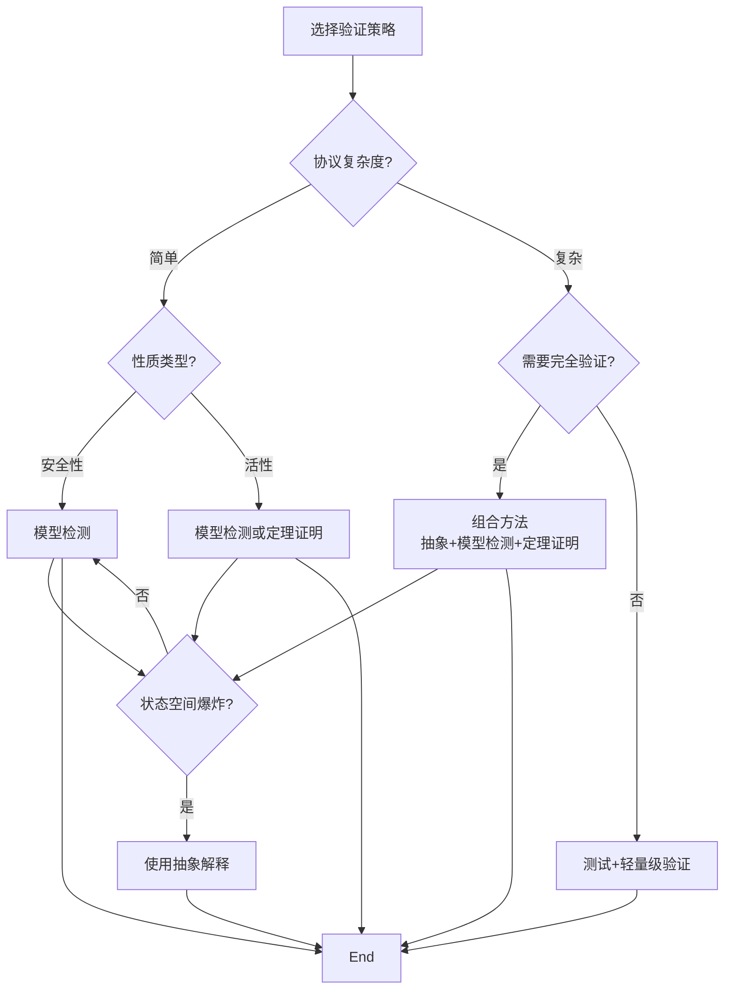

# 协议验证方法选择决策树 / Protocol Verification Method Selection Decision Tree

## 📚 **概述 / Overview**

本文档提供协议验证方法选择的完整决策树，帮助根据协议特性和验证需求选择最合适的验证方法。

**创建时间**: 2025年1月
**模块**: 协议形式化验证
**状态**: 🚀 持续更新中

---

## 🌳 **一、协议验证方法选择决策树 / Protocol Verification Method Selection Decision Tree**

### 1.1 完整决策树

### 1.2 决策规则说明 / Decision Rules

#### 规则1: 协议规模判断
- **小规模协议** (状态数 < 10⁶): 可以使用模型检测
- **大规模协议** (状态数 ≥ 10⁶): 需要使用抽象或定理证明

#### 规则2: 验证性质类型判断
- **安全性**: 不可达性、不变式（适合模型检测）
- **活性**: 可达性、公平性（适合模型检测或定理证明）
- **公平性**: 公平调度（适合模型检测）
- **复杂性质**: 需要组合方法

#### 规则3: 自动化需求判断
- **需要自动化**: 模型检测（自动生成反例）
- **不需要自动化**: 定理证明（需要人工指导）

### 1.3 验证方法特性对比

| 方法 | 自动化程度 | 适用规模 | 性质类型 | 工具 | 特点 |
|------|-----------|---------|---------|------|------|
| **模型检测** | 高 | 小-中 | 安全性、活性 | SPIN, TLA+, NuSMV | 自动、反例生成 |
| **定理证明** | 中-低 | 任意 | 所有性质 | Coq, Isabelle, PVS | 严格、可扩展 |
| **抽象解释** | 高 | 大 | 安全性 | 抽象域 | 近似、快速 |
| **组合方法** | 中 | 任意 | 复杂性质 | 多种工具 | 灵活、全面 |

---

## 🌳 **二、模型检测方法选择决策树 / Model Checking Method Selection Decision Tree**

### 2.1 完整决策树

### 2.2 决策规则说明 / Decision Rules

#### 规则1: 时序逻辑类型判断
- **线性时序逻辑（LTL）**: 适合线性性质
- **分支时序逻辑（CTL）**: 适合路径量化性质
- **CTL***: 最强大的时序逻辑

#### 规则2: 工具选择判断
- **显式状态模型检测**: SPIN（适合小规模）
- **符号化模型检测**: NuSMV（适合中等规模）
- **TLA+**: 适合系统级验证

### 2.3 模型检测工具对比

| 工具 | 时序逻辑 | 状态表示 | 适用规模 | 特点 |
|------|---------|---------|---------|------|
| **SPIN** | LTL | 显式 | 小 | 高效、反例生成 |
| **NuSMV** | CTL, LTL | 符号化 | 中 | BDD/基于SAT |
| **TLA+** | TLA | 显式/符号化 | 中-大 | 系统级、数学基础 |
| **UPPAAL** | TCTL | 时间自动机 | 中 | 实时系统 |

---

## 🌳 **三、定理证明方法选择决策树 / Theorem Proving Method Selection Decision Tree**

### 3.1 完整决策树

### 3.2 决策规则说明 / Decision Rules

#### 规则1: 证明类型判断
- **不变式**: 使用不变式归纳法
- **安全性**: 可以转换为不变式
- **活性**: 需要秩函数或公平性证明

#### 规则2: 自动化需求判断
- **需要自动化**: 使用自动定理证明器（Z3, CVC4）
- **不需要自动化**: 使用交互式证明助手（Coq, Isabelle）

### 3.3 定理证明工具对比

| 工具 | 自动化程度 | 证明类型 | 学习曲线 | 特点 |
|------|-----------|---------|---------|------|
| **Coq** | 低 | 所有 | 陡峭 | 严格、依赖类型 |
| **Isabelle** | 中 | 所有 | 中等 | 自动化、Isar语言 |
| **PVS** | 中 | 所有 | 中等 | 高效、丰富库 |
| **Z3** | 高 | SMT | 平缓 | 自动、SMT求解 |
| **CVC4** | 高 | SMT | 平缓 | 自动、理论支持 |

---

## 🌳 **四、验证策略选择决策树 / Verification Strategy Selection Decision Tree**

### 4.1 完整决策树

### 4.2 决策规则说明 / Decision Rules

#### 规则1: 协议复杂度判断
- **简单协议**: 可以直接使用模型检测
- **复杂协议**: 需要组合方法或抽象

#### 规则2: 状态空间爆炸处理
- **存在状态空间爆炸**: 使用抽象解释
- **不存在**: 直接使用模型检测

---

## 📊 **五、决策树使用指南 / Decision Tree Usage Guide**

### 5.1 使用步骤

1. **分析协议特性**: 评估协议规模、复杂度
2. **确定验证目标**: 明确需要验证的性质
3. **遵循决策树**: 按照决策树逐步选择
4. **验证选择**: 确认选择的验证方法适合问题

### 5.2 注意事项

- **状态空间爆炸**: 大规模协议需要考虑抽象
- **自动化程度**: 平衡自动化和验证严格性
- **工具学习曲线**: 考虑团队技能水平
- **验证成本**: 平衡验证时间和资源

### 5.3 常见场景示例

#### 场景1: 小型协议安全性验证
- **选择**: 模型检测（SPIN）
- **理由**: 自动化程度高，反例生成

#### 场景2: 大型协议不变式验证
- **选择**: 定理证明（Coq/Isabelle）
- **理由**: 可扩展，严格证明

#### 场景3: 复杂协议全面验证
- **选择**: 组合方法（抽象+模型检测+定理证明）
- **理由**: 全面覆盖，灵活应对

---

## 🔗 **相关链接 / Related Links**

- [协议的形式化建模方法](01-协议的形式化建模方法.md)
- [模型检测在协议验证中的应用](02-模型检测在协议验证中的应用.md)
- [定理证明在协议验证中的应用](03-定理证明在协议验证中的应用.md)
- [协议正确性的形式化规范](04-协议正确性的形式化规范.md)
- [协议形式化验证目录](README.md)

---

**文档版本**: v1.0
**创建时间**: 2025年1月
**最后更新**: 2025年1月
**维护者**: GraphNetWorkCommunicate项目组
