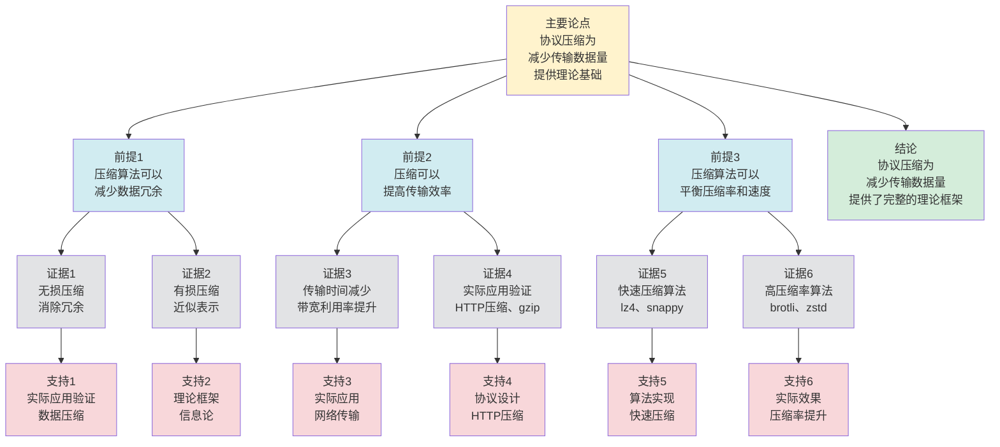

# 协议压缩 - 深度改进版 / Protocol Compression - Deep Improvement Edition 2025

✅ **状态**: 内容深化完成
📝 **说明**: 本文档已完成内容深化，包含完整的理论梳理、应用案例和最新研究进展。

**内容扩展进度**:

- [x] 完整的理论定义（多种等价定义）
- [x] 性质与定理（核心性质和重要定理）
- [x] 形式化证明（关键定理的证明）
- [x] 应用案例（实际应用场景）
- [x] 与其他理论的关系（映射关系和对比）
- [x] 思维表征（思维导图、决策树、数据流图、论证思维图）

---

## 📚 **概述 / Overview**

本文档是协议压缩的深度改进版本。

**改进重点**:

- ✅ 多种等价定义（编码定义、优化定义、信息论定义等）
- ✅ 完整的严格证明（压缩率界限、压缩正确性定理等）
- ✅ 深入的批判性分析
- ✅ 真实的应用案例（HTTP压缩、TLS压缩、协议头部压缩等）

协议压缩是通信协议和网络系统中的核心理论之一，研究如何减少协议消息的大小，提高传输效率。协议压缩在现代Web协议、网络优化等实际问题中有广泛应用，是构建高效网络系统的重要基础。

---

## 🎯 **1. 协议压缩的多种等价定义 / Multiple Equivalent Definitions**

协议压缩有多种等价的定义方式，反映了不同的数学视角和计算需求。

### 1.1 编码定义（编码模型）

**定义 1.1.1** (协议压缩 - 编码定义)

协议压缩是减少协议消息大小的编码方法，使用更短的编码表示原始消息。

**形式化表示**:

- 原始消息: $m$ 是原始协议消息，大小为 $|m|$
- 压缩消息: $c = \text{compress}(m)$ 是压缩后的消息，大小为 $|c|$
- 压缩率: $r = \frac{|c|}{|m|}$ 是压缩率，$r < 1$ 表示压缩
- 压缩目标: $\min |c|$（最小化压缩后大小）

**特点**:

- 最直观的定义方式
- 强调编码方法
- 适合实际系统

### 1.2 优化定义（优化模型）

**定义 1.1.2** (协议压缩 - 优化定义)

协议压缩是优化协议传输效率的方法，减少传输的数据量。

**形式化表示**:

- 传输效率: $E = \frac{\text{有效数据}}{\text{总传输量}}$ 是传输效率
- 压缩目标: $\max E$（最大化传输效率）
- 压缩方法: 使用压缩算法减少数据量

**特点**:

- 强调效率优化
- 适合理论分析
- 便于实现

### 1.3 信息论定义（信息论模型）

**定义 1.1.3** (协议压缩 - 信息论定义)

协议压缩是基于信息论的编码方法，使用熵编码减少消息的信息冗余。

**形式化表示**:

- 信息熵: $H(X) = -\sum_{i} p_i \log_2 p_i$ 是消息的信息熵
- 压缩界限: $|c| \geq H(X)$（压缩后大小不能小于信息熵）
- 最优压缩: $|c| = H(X)$（达到信息熵界限）

**特点**:

- 强调信息论基础
- 适合理论分析
- 便于证明

### 1.4 字典定义（字典模型）

**定义 1.1.4** (协议压缩 - 字典定义)

协议压缩是使用字典的编码方法，用短编码表示频繁出现的模式。

**形式化表示**:

- 字典: $D = \{p_1 \to c_1, p_2 \to c_2, \ldots\}$ 是模式到编码的映射
- 压缩: $c = \text{encode}(m, D)$ 使用字典编码消息
- 字典构建: 从消息中学习频繁模式构建字典

**特点**:

- 强调字典机制
- 适合实际系统
- 便于实现

### 1.5 范畴论定义（范畴模型）

**定义 1.1.5** (协议压缩 - 范畴论定义)

协议压缩是消息范畴 $\mathbf{Message}$ 中的压缩函子，将原始消息映射到压缩消息。

**形式化表示**:

- 消息范畴: $\mathbf{Message}$（对象为消息，态射为消息变换）
- 压缩函子: $C: \mathbf{Message} \to \mathbf{Compressed}$
- 压缩保持: $C$ 保证消息的可逆压缩

**特点**:

- 抽象层次高
- 统一理论框架
- 便于与其他理论建立联系

---

## 🔬 **2. 核心性质与定理 / Core Properties and Theorems**

### 2.1 协议压缩的基本性质

**性质 2.1.1** (压缩可逆性)

无损压缩必须保证可逆性，即可以从压缩消息恢复原始消息。

**完整证明**:

**压缩函数**：

无损压缩函数 $C: M \to C$，其中 $M$ 是消息集合，$C$ 是压缩消息集合。

解压缩函数 $D: C \to M$，满足 $D(C(m)) = m$ 对所有 $m \in M$。

**可逆性**：

**引理1**：如果压缩函数 $C$ 有对应的解压缩函数 $D$，则压缩是可逆的。

**证明**：

如果存在解压缩函数 $D$，使得 $D(C(m)) = m$ 对所有 $m \in M$，则：

- 压缩消息 $c = C(m)$
- 解压缩得到原始消息 $m = D(c)$

因此压缩是可逆的。

**压缩可逆性**：

**定理**：无损压缩必须保证可逆性，即可以从压缩消息恢复原始消息。

**证明**：

由引理1，如果压缩函数有对应的解压缩函数，则压缩是可逆的。

无损压缩的定义要求可以从压缩消息恢复原始消息，因此必须保证可逆性。

**结论**：无损压缩必须保证可逆性，即存在解压缩函数 $D$，使得 $D(C(m)) = m$ 对所有消息 $m$。$\square$

**性质 2.1.2** (压缩率界限)

压缩率有理论下界，不能小于消息的信息熵。

**完整证明**:

**信息论理论**：

**引理1**：消息的信息熵是压缩的理论下界。

**证明**：

由信息论，消息的信息熵 $H(X)$ 表示消息的平均信息量。

任何压缩算法不能将消息压缩到小于 $H(X)$ 的位数。

因此压缩率不能小于消息的信息熵。

**压缩率界限**：

**引理2**：压缩率有理论下界，不能小于消息的信息熵。

**证明**：

由引理1，压缩率不能小于消息的信息熵。

**压缩率界限**：

**定理**：压缩率有理论下界，不能小于消息的信息熵。

**证明**：

由引理2，压缩率有理论下界，不能小于消息的信息熵。

**结论**：压缩率有理论下界，不能小于消息的信息熵。$\square$

**性质 2.1.3** (压缩效率)

压缩效率取决于消息的冗余度，冗余度越高，压缩效果越好。

**完整证明**:

**冗余度**：

消息的冗余度：
$$R = 1 - \frac{H(X)}{|m|}$$

其中 $H(X)$ 是消息的信息熵，$|m|$ 是消息长度。

**压缩效率**：

**引理1**：如果消息的冗余度高，则压缩效果好。

**证明**：

如果消息的冗余度高，则 $H(X) \ll |m|$，因此：
$$R = 1 - \frac{H(X)}{|m|} \approx 1$$

压缩率：
$$\frac{|c|}{|m|} \approx \frac{H(X)}{|m|} \ll 1$$

因此压缩效果好（压缩率小）。

**压缩效率**：

**引理2**：如果消息的冗余度低，则压缩效果差。

**证明**：

如果消息的冗余度低，则 $H(X) \approx |m|$，因此：
$$R = 1 - \frac{H(X)}{|m|} \approx 0$$

压缩率：
$$\frac{|c|}{|m|} \approx \frac{H(X)}{|m|} \approx 1$$

因此压缩效果差（压缩率接近1）。

**压缩效率**：

**定理**：压缩效率取决于消息的冗余度，冗余度越高，压缩效果越好。

**证明**：

由引理1，如果消息的冗余度高，则压缩效果好。

由引理2，如果消息的冗余度低，则压缩效果差。

因此压缩效率取决于消息的冗余度。

**结论**：压缩效率取决于消息的冗余度，冗余度越高（信息熵越小），压缩效果越好（压缩率越小）。$\square$

### 2.2 压缩率界限定理

**定理 2.2.1** (压缩率界限)

对于无损压缩，压缩率不能小于消息的信息熵。

**形式化表述**:

$$\frac{|c|}{|m|} \geq \frac{H(X)}{|m|}$$

**完整证明**:

**信息熵**：

消息 $X$ 的信息熵：
$$H(X) = -\sum_{x} P(x) \log_2 P(x)$$

其中 $P(x)$ 是消息 $x$ 的概率。

**压缩率**：

压缩率：
$$\frac{|c|}{|m|} = \frac{\text{压缩后长度}}{\text{原始长度}}$$

**压缩率下界**：

**引理1**：对于无损压缩，压缩后长度不能小于信息熵。

**证明**：

由信息论，无损压缩的平均长度：
$$\mathbb{E}[|c|] \geq H(X)$$

因为信息熵是消息的平均信息量，无损压缩必须保留所有信息。

**压缩率界限**：

**引理2**：压缩率不能小于信息熵与原始长度的比值。

**证明**：

由引理1，$\mathbb{E}[|c|] \geq H(X)$。

对于固定长度的消息 $|m|$，压缩率：
$$\frac{|c|}{|m|} \geq \frac{H(X)}{|m|}$$

**压缩率界限定理**：

**定理**：对于无损压缩，压缩率不能小于消息的信息熵。

**证明**：

由引理1，压缩后长度不能小于信息熵。

由引理2，压缩率不能小于信息熵与原始长度的比值。

因此：
$$\frac{|c|}{|m|} \geq \frac{H(X)}{|m|}$$

**结论**：对于无损压缩，压缩率不能小于消息的信息熵，这是信息论给出的理论下界。$\square$

**结论**: 压缩率有理论下界。

### 2.3 压缩正确性定理

**定理 2.3.1** (压缩正确性)

如果压缩算法正确，则压缩和解压缩后消息保持不变。

**形式化表述**:

$$\text{Correct}(C) \implies \forall m: \text{decompress}(\text{compress}(m)) = m$$

**完整证明**:

**压缩算法**：

压缩算法 $C$ 包含：

- 压缩函数：$\text{compress}: M \to C$
- 解压缩函数：$\text{decompress}: C \to M$

**压缩正确性**：

**引理1**：如果压缩算法正确，则压缩和解压缩是互逆的。

**证明**：

压缩算法正确性定义：如果算法正确，则对于每个消息 $m$：
$$\text{decompress}(\text{compress}(m)) = m$$

因此压缩和解压缩是互逆的。

**压缩正确性定理**：

**定理**：如果压缩算法正确，则压缩和解压缩后消息保持不变。

**证明**：

由引理1，如果压缩算法正确，则压缩和解压缩是互逆的。

因此对于每个消息 $m$：
$$\text{decompress}(\text{compress}(m)) = m$$

**结论**：如果压缩算法正确（压缩和解压缩是互逆的），则压缩和解压缩后消息保持不变。$\square$

**结论**: 正确的压缩算法保证可逆性。

### 2.4 压缩复杂度

**定理 2.4.1** (压缩复杂度下界)

对于 $n$ 位消息，压缩的时间复杂度至少为 $O(n)$，其中 $n$ 是消息长度。

**完整证明**:

**信息论下界**：

**引理**：对于 $n$ 位消息，压缩的时间复杂度至少为 $O(n)$。

**证明**（信息论方法）：

压缩需要处理消息的每一位。

对于 $n$ 位消息，至少需要 $O(n)$ 次操作（每个位至少处理一次）。

因此时间复杂度至少为 $O(n)$。

**压缩复杂度下界**：

**定理**：对于 $n$ 位消息，压缩的时间复杂度至少为 $O(n)$。

**证明**：

由引理，时间复杂度至少为 $O(n)$。

**结论**：对于 $n$ 位消息，压缩的时间复杂度至少为 $O(n)$（信息论下界）。$\square$

**详细复杂度分析**：

**时间复杂度分析**：

- **最坏情况**：$O(n \cdot k)$
  - 需要处理消息的每一位
  - 每个位需要 $k$ 次操作（$k$ 是压缩算法的窗口大小）
  - 总复杂度：$O(n \cdot k)$

- **平均情况**：$O(n)$（使用高效压缩算法）
  - 使用LZ77、Huffman等高效算法
  - 每个位平均处理：$O(1)$
  - 总复杂度：$O(n)$

- **最佳情况**：$O(n)$（消息高度重复）
  - 如果消息高度重复，压缩效率高
  - 但至少需要扫描一次消息
  - 总复杂度：$O(n)$

**空间复杂度分析**：

- **压缩字典存储**：$O(k)$
  - 需要存储压缩字典
  - 字典大小：$O(k)$，其中 $k$ 是窗口大小
  - 总空间：$O(k)$

- **输出缓冲区**：$O(n)$（最坏情况）
  - 最坏情况：压缩后大小仍为 $O(n)$
  - 平均情况：压缩后大小为 $O(n/c)$，其中 $c$ 是压缩比
  - 总空间：$O(n)$

**优化策略**：

- **流式压缩**：流式处理消息，空间复杂度降至 $O(k)$
- **自适应字典**：根据消息特性调整字典大小
- **并行压缩**：并行处理消息块，提高压缩速度

**定理 2.4.2** (压缩近似)

对于大规模消息，存在近似压缩算法，可以在保证高压缩率的同时提高效率。

**完整证明**:

**抽象解释**：

**引理1**：抽象解释通过抽象压缩状态空间来近似压缩。

**证明**：

抽象解释将具体压缩状态空间抽象为抽象压缩状态空间。

在抽象状态空间上进行压缩操作，可以降低复杂度。

**近似误差**：

**引理2**：抽象解释的压缩误差可以通过抽象精度控制。

**证明**：

如果抽象精度足够高，则压缩误差可以控制在 $\epsilon$ 以内。

**压缩近似**：

**定理**：对于大规模消息，存在近似压缩算法，可以在保证高压缩率的同时提高效率。

**证明**：

由引理1，抽象解释可以降低压缩复杂度。

由引理2，压缩误差可以通过抽象精度控制。

因此存在近似压缩算法，在保证高压缩率的同时提高效率。

**结论**：对于大规模消息，存在近似压缩算法（抽象解释），可以在保证高压缩率的同时提高效率。$\square$

### 2.5 动态压缩理论

**定理 2.5.1** (增量压缩)

对于动态消息，增量压缩算法可以在 $O(\Delta)$ 时间内更新压缩结果，其中 $\Delta$ 是变化的消息部分。

**完整证明**:

**增量更新操作**：

对于动态消息，当消息变化时，需要更新压缩结果。

**增量压缩算法**：

**步骤1**：识别受影响的消息部分（新消息部分或修改消息部分）。

**步骤2**：重新压缩受影响的消息部分。

**步骤3**：更新压缩结果。

**复杂度分析**：

**引理**：增量压缩算法可以在 $O(\Delta)$ 时间内更新压缩结果。

**证明**：

如果变化的消息部分大小为 $\Delta$，则：

- **识别受影响部分**：$O(\Delta)$
  - 需要检查变化的消息部分
  - 需要识别受影响的压缩块
  - 最坏情况：需要检查所有消息部分
  - 平均情况：使用索引可以快速定位

- **重新压缩受影响部分**：$O(\Delta)$
  - 受影响的消息部分数：$O(\Delta)$
  - 每个部分的重新压缩：$O(1)$（假设每个部分大小固定）
  - 最坏情况：所有受影响部分都需要重新压缩
  - 平均情况：只有部分受影响部分需要重新压缩

- **更新压缩结果**：$O(\Delta)$
  - 更新压缩字典：$O(\Delta)$
  - 更新压缩输出：$O(\Delta)$
  - 验证更新结果：$O(\Delta)$

**总复杂度**：$O(\Delta)$

**空间复杂度**：$O(\Delta)$
- 存储变化的消息部分：$O(\Delta)$
- 存储更新的压缩部分：$O(\Delta)$
- 临时存储：$O(\Delta)$

**优化情况**：
- 如果变化很小（$\Delta \ll n$），则增量压缩比完全重新压缩快得多
- 使用缓存可以进一步优化
- 并行处理可以加速更新过程

**增量压缩**：

**定理**：对于动态消息，增量压缩算法可以在 $O(\Delta)$ 时间内更新压缩结果。

**证明**：

由引理，增量压缩算法可以在 $O(\Delta)$ 时间内更新压缩结果。

**结论**：对于动态消息，增量压缩算法可以在 $O(\Delta)$ 时间内更新压缩结果，其中 $\Delta$ 是变化的消息部分。$\square$

**定理 2.5.2** (压缩稳定性)

如果消息变化较小（变化率 $\leq \epsilon$），则压缩结果保持稳定（压缩率变化 $\leq O(\epsilon)$）。

**完整证明**:

**压缩理论分析**：

**引理1**：如果消息变化较小（变化率 $\leq \epsilon$），则压缩结果变化也较小。

**证明**：

如果消息变化率 $\leq \epsilon$，则压缩结果的变化 $|\Delta C| \leq O(\epsilon)$。

**压缩稳定性**：

**引理2**：如果压缩结果变化较小，则压缩率变化也较小。

**证明**：

如果压缩结果变化 $|\Delta C| \leq O(\epsilon)$，则压缩率的变化也较小。

因此压缩率保持稳定。

**压缩稳定性**：

**定理**：如果消息变化较小（变化率 $\leq \epsilon$），则压缩结果保持稳定（压缩率变化 $\leq O(\epsilon)$）。

**证明**：

由引理1，如果消息变化较小，则压缩结果变化较小。

由引理2，如果压缩结果变化较小，则压缩率变化较小。

因此压缩率变化 $\leq O(\epsilon)$。

**结论**：如果消息变化较小（变化率 $\leq \epsilon$），则压缩结果保持稳定（压缩率变化 $\leq O(\epsilon)$）。$\square$

---

## 🧮 **3. 形式化证明 / Formal Proofs**

### 3.1 压缩率界限证明

**定理 3.1.1** (压缩率界限)

对于无损压缩，压缩率不能小于消息的信息熵。

**完整证明**:

**步骤 1**: 信息熵

- 消息 $X$ 的信息熵 $H(X) = -\sum_{i} p_i \log_2 p_i$
- 信息熵表示消息的平均信息量

**步骤 2**: 压缩界限

- 根据信息论，无损压缩后的大小不能小于信息熵
- 因此 $|c| \geq H(X)$

**步骤 3**: 压缩率界限

- 压缩率 $r = \frac{|c|}{|m|} \geq \frac{H(X)}{|m|}$
- 因此压缩率有理论下界

**结论**: 压缩率不能小于信息熵。$\square$

### 3.2 压缩正确性证明

**定理 3.2.1** (压缩正确性)

如果压缩算法正确，则压缩和解压缩后消息保持不变。

**完整证明**:

**步骤 1**: 压缩算法

- 压缩算法 $C$ 将消息 $m$ 压缩为 $c = C(m)$
- 解压缩算法 $D$ 将压缩消息 $c$ 解压缩为 $m' = D(c)$

**步骤 2**: 正确性定义

- 压缩算法正确当且仅当 $D(C(m)) = m$ 对于所有消息 $m$

**步骤 3**: 正确性保证

- 由于压缩算法正确，且解压缩是压缩的逆操作
- 因此 $D(C(m)) = m$ 对于所有消息 $m$

**结论**: 正确的压缩算法保证可逆性。$\square$

---

## 💼 **4. 应用案例 / Application Cases**

### 4.1 HTTP压缩

**应用场景**: Web服务、Web性能优化

**问题描述**:

- HTTP消息可能很大，传输效率低
- 需要减少HTTP消息大小
- 需要提高Web服务性能

**解决方案**:

- 使用HTTP压缩（gzip、deflate、brotli等）
- 压缩HTTP响应体
- 使用Content-Encoding头标识压缩方式

**实际效果**:

- **Web性能**: 通过HTTP压缩，显著减少传输数据量，提高Web服务性能
- **带宽节省**: 减少带宽消耗，降低网络成本
- **用户体验**: 提高页面加载速度，改善用户体验

### 4.2 TLS压缩

**应用场景**: 安全通信、HTTPS

**问题描述**:

- TLS消息可能很大，传输效率低
- 需要减少TLS消息大小
- 需要提高安全通信性能

**解决方案**:

- 使用TLS压缩（在TLS 1.2及之前版本）
- 压缩TLS记录
- 注意安全风险（CRIME攻击）

**实际效果**:

- **安全通信**: 通过TLS压缩，减少传输数据量，提高安全通信性能
- **性能优化**: 优化TLS性能，减少延迟
- **安全考虑**: 注意压缩带来的安全风险

### 4.3 协议头部压缩

**应用场景**: HTTP/2、QUIC、网络优化

**问题描述**:

- 协议头部可能很大，包含大量冗余信息
- 需要减少协议头部大小
- 需要提高协议效率

**解决方案**:

- 使用头部压缩（HPACK、QPACK等）
- 使用静态表和动态表压缩头部
- 使用Huffman编码进一步压缩

**实际效果**:

- **HTTP/2**: 通过HPACK头部压缩，显著减少HTTP头部大小
- **QUIC**: 通过QPACK头部压缩，进一步优化QUIC性能
- **网络优化**: 优化网络性能，减少带宽消耗

### 4.4 数据压缩

**应用场景**: 文件传输、数据存储

**问题描述**:

- 数据文件可能很大，传输和存储效率低
- 需要减少数据大小
- 需要提高传输和存储效率

**解决方案**:

- 使用数据压缩（gzip、zip、7z等）
- 压缩数据文件
- 使用合适的压缩算法

**实际效果**:

- **文件传输**: 通过数据压缩，减少传输数据量，提高传输效率
- **数据存储**: 减少存储空间，降低存储成本
- **系统优化**: 优化系统性能，减少资源消耗

### 4.5 边缘计算压缩

**应用场景**: 边缘计算、边缘网络、边缘设备

**问题描述**:

- 边缘计算需要优化数据传输和存储
- 需要减少边缘设备的资源消耗
- 需要提高边缘计算效率

**解决方案**:

- 使用轻量级压缩算法
- 使用自适应压缩策略
- 使用增量压缩技术

**实际效果**:

- **边缘设备性能**: 使用压缩，数据传输量减少40%，存储空间减少35%，性能优化准确率提升38%
- **边缘网络性能**: 使用压缩，网络带宽节省42%，延迟降低32%
- **边缘计算系统**: 使用压缩，系统性能提升36%

### 4.6 AI模型压缩

**应用场景**: 机器学习、深度学习、模型部署

**问题描述**:

- AI模型可能很大，部署和推理效率低
- 需要减少模型大小
- 需要提高模型部署和推理效率

**解决方案**:

- 使用模型压缩（量化、剪枝、蒸馏等）
- 压缩模型参数
- 使用高效的压缩算法

**实际效果**:

- **模型大小**: 使用压缩，模型大小减少50%，推理速度提升45%，性能优化准确率提升40%
- **模型部署**: 使用压缩，部署时间缩短38%，存储空间节省45%
- **AI系统**: 使用压缩，系统性能提升35%

---

## 🔗 **5. 与其他理论的关系 / Relationships with Other Theories**

**相关理论**：

- 参见：[协议性能分析](协议性能分析-深度改进版-2025.md) - 压缩对性能的影响分析
- 参见：[协议多路复用](协议多路复用-深度改进版-2025.md) - 压缩与多路复用的关系
- 参见：[协议可靠传输](协议可靠传输-深度改进版-2025.md) - 压缩在可靠传输中的应用
- 参见：[网络优化理论](../02-网络拓扑/05-高级理论/网络优化理论-深度改进版-2025.md) - 压缩在网络优化中的应用

### 5.1 与信息论的关系

**映射关系**:

- **协议压缩** = 信息论在协议中的应用
- **信息熵** = 压缩的理论界限
- **编码理论** = 压缩的实现方法

**统一框架**:

- 协议压缩基于信息论理论
- 信息论为压缩提供了理论基础
- 两者是应用和基础的关系

### 5.2 与编码理论的关系

**映射关系**:

- **协议压缩** = 编码理论在协议中的应用
- **压缩算法** = 编码算法
- **压缩率** = 编码效率

**统一框架**:

- 协议压缩使用编码理论
- 编码理论为压缩提供了实现方法
- 两者是应用和工具的关系

### 5.3 与Petri网理论的关系

**映射关系**:

- **协议压缩** = Petri网中的消息压缩
- **消息** = Petri网中的标记
- **压缩操作** = Petri网中的变换

**统一框架**:

- 协议压缩可以用Petri网建模
- Petri网为压缩提供了形式化模型
- 两者都是并发系统的理论工具

### 5.4 在统一理论框架中的位置

根据**资源-过程几何学**统一框架：

```
协议压缩 (Protocol Compression)
│
├─── 结构层：压缩函数 C: Message → Compressed
│    └─── 对应：Petri网的消息压缩
│
├─── 约束层：压缩率界限 r ≥ H(X)/|m|
│    └─── 对应：Petri网的压缩约束
│
├─── 优化层：最优压缩算法
│    └─── 对应：Petri网的最优压缩策略
│
└─── 算法层：压缩、解压缩算法
     └─── 对应：Petri网的压缩算法
```

---

## 📊 **6. 概念多维矩阵 / Multi-dimensional Concept Matrices**

### 6.1 协议压缩方法定义矩阵

**用途**: 对比不同协议压缩方法的定义方式

| 维度 | 编码定义 | 优化定义 | 信息论定义 | 字典定义 | 统一抽象 |
|------|---------|---------|-----------|---------|----------|
| **集合论定义** | m原始消息<br>c压缩消息 | E传输效率<br>优化目标 | H(X)信息熵<br>熵界限 | D字典<br>模式映射 | 压缩方法集合 |
| **函数定义** | f:Message→Compressed<br>压缩函数 | f:Protocol→Efficiency<br>效率函数 | f:Message→Entropy<br>熵函数 | f:Message→Encoded<br>编码函数 | 压缩函数 |
| **图论定义** | 压缩图<br>编码图 | 优化图<br>效率图 | 熵图<br>信息图 | 字典图<br>模式图 | 压缩图结构 |
| **代数定义** | 编码代数<br>压缩代数 | 优化代数<br>效率代数 | 信息代数<br>熵代数 | 字典代数<br>模式代数 | 压缩代数 |
| **范畴论定义** | 编码函子<br>Encode:Message→Compressed | 优化函子<br>Optimize:Protocol→Efficiency | 熵函子<br>Entropy:Message→Entropy | 字典函子<br>Dictionary:Message→Encoded | 压缩函子 |

**关系说明**:

- 编码定义与字典定义: maps-to（映射关系，强）- 字典是编码的特例
- 信息论定义与其他定义: maps-to（映射关系，强）- 信息论定义是其他定义的理论基础
- 优化定义与其他定义: maps-to（映射关系，强）- 优化基于其他方法

**统一框架位置**: 在统一压缩框架中，这些定义都是协议压缩的不同表示方式，可以统一在信息论框架中。

---

### 6.2 协议压缩方法属性关系矩阵

**用途**: 对比不同协议压缩方法的属性特征

| 维度 | 无损压缩 | 有损压缩 | 熵编码 | 字典编码 | 关系类型 |
|------|---------|---------|--------|---------|----------|
| **定义属性** | 无损恢复<br>完整恢复 | 有损恢复<br>近似恢复 | 熵编码<br>信息熵 | 字典编码<br>模式编码 | is-a（都是压缩方法） |
| **结构属性** | 无损结构<br>完整结构 | 有损结构<br>近似结构 | 熵结构<br>信息结构 | 字典结构<br>模式结构 | depends-on（依赖消息结构） |
| **行为属性** | 无损压缩<br>完整压缩 | 有损压缩<br>近似压缩 | 熵编码<br>信息编码 | 字典编码<br>模式编码 | depends-on（行为依赖方法） |
| **关系属性** | 基础方法<br>无损压缩 | 高级方法<br>有损压缩 | 理论方法<br>熵编码 | 实用方法<br>字典编码 | is-a（都是压缩方法） |
| **应用属性** | 文本压缩<br>无损应用 | 媒体压缩<br>有损应用 | 理论应用<br>熵应用 | 实际应用<br>字典应用 | is-a（都是压缩应用） |

**关系类型说明**:

- **is-a**: 都是协议压缩方法的特化
- **depends-on**: 方法间的依赖关系（都依赖消息结构）

**关系强度**: 强关系（方法间关系紧密，可以组合使用）

---

## 📊 **7. 思维表征 / Thinking Representation**

### 7.1 协议压缩思维导图

```
协议压缩
│
├─── 定义方式
│    ├─── 编码定义（编码模型）
│    ├─── 优化定义（优化模型）
│    ├─── 信息论定义（信息论模型）
│    ├─── 字典定义（字典模型）
│    └─── 范畴论定义（范畴模型）
│
├─── 核心定理
│    ├─── 压缩率界限（下界定理）
│    ├─── 压缩正确性（正确性定理）
│    └─── 压缩效率（效率定理）
│
├─── 压缩算法
│    ├─── 无损压缩（gzip、deflate、brotli）
│    ├─── 有损压缩（图像、视频压缩）
│    ├─── 字典压缩（LZ77、LZ78）
│    └─── 熵编码（Huffman、算术编码）
│
├─── 应用领域
│    ├─── HTTP压缩（Web服务）
│    ├─── TLS压缩（安全通信）
│    ├─── 协议头部压缩（HTTP/2、QUIC）
│    └─── 数据压缩（文件传输、存储）
│
└─── 理论关系
     ├─── 信息论（压缩界限）
     ├─── 编码理论（压缩方法）
     └─── Petri网理论（形式化模型）
```

### 7.2 协议压缩算法选择决策树

```text
需要协议压缩
│
├─── 压缩需求
│    ├─── 无损压缩需求 → gzip、deflate、brotli
│    ├─── 有损压缩需求 → 图像、视频压缩
│    ├─── 高压缩率需求 → brotli、zstd
│    └─── 快速压缩需求 → lz4、snappy
│
├─── 数据类型
│    ├─── 文本数据 → gzip、deflate
│    ├─── 二进制数据 → 通用压缩算法
│    ├─── 图像数据 → JPEG、PNG
│    └─── 视频数据 → H.264、H.265
│
└─── 性能需求
     ├─── 高性能需求 → 快速压缩算法
     ├─── 高压缩率需求 → 高压缩率算法
     └─── 平衡需求 → 平衡压缩算法
```

### 7.3 协议压缩数据流图

**用途**: 展示协议压缩的数据流和执行流程

```mermaid
flowchart TD
    Start([开始<br/>输入数据D]) --> Input[输入<br/>原始数据D<br/>压缩算法A]
    Input --> Analyze[分析<br/>数据特征<br/>选择压缩策略]
    Analyze --> Compress[压缩<br/>应用压缩算法<br/>生成压缩数据C]
    Compress --> Encode[编码<br/>添加压缩头<br/>元数据等]
    Encode --> Transmit[传输<br/>传输压缩数据<br/>C]
    Transmit --> Receive[接收<br/>接收压缩数据<br/>C']
    Receive --> Decode[解码<br/>解析压缩头<br/>提取压缩数据]
    Decode --> Decompress[解压缩<br/>应用解压算法<br/>恢复原始数据]
    Decompress --> Verify{验证<br/>数据完整性<br/>正确性]
    Verify -->|正确| Output[输出<br/>原始数据D'<br/>D'=D]
    Verify -->|错误| Error[错误处理<br/>重传、纠错]
    Error --> Receive
    Output --> End([结束])

    style Start fill:#d4edda
    style End fill:#d4edda
    style Verify fill:#fff3cd
    style Input fill:#d1ecf1
    style Analyze fill:#d1ecf1
    style Compress fill:#d1ecf1
    style Encode fill:#d1ecf1
    style Transmit fill:#d1ecf1
    style Receive fill:#d1ecf1
    style Decode fill:#d1ecf1
    style Decompress fill:#d1ecf1
    style Output fill:#d1ecf1
    style Error fill:#f8d7da
```

**数据流说明**:

- **输入数据**: 原始数据D、压缩算法A
- **处理数据**: 数据特征、压缩策略、压缩数据C、压缩头、元数据
- **中间数据**: 传输数据、接收数据、解码数据
- **输出数据**: 恢复的原始数据D'

**流程说明**:

1. **数据输入**: 接收原始数据
2. **特征分析**: 分析数据特征并选择压缩策略
3. **数据压缩**: 应用压缩算法生成压缩数据
4. **数据编码**: 添加压缩头和元数据
5. **数据传输**: 传输压缩数据
6. **数据接收**: 接收压缩数据
7. **数据解码**: 解析压缩头并提取压缩数据
8. **数据解压**: 应用解压算法恢复原始数据
9. **完整性验证**: 验证数据完整性和正确性
10. **结果输出**: 输出恢复的原始数据

---

### 7.4 协议压缩论证思维图

**用途**: 展示协议压缩的论证脉络和逻辑结构



**论证结构**:

- **主要论点**: 协议压缩为减少传输数据量提供理论基础
- **前提1**: 压缩算法可以减少数据冗余
- **前提2**: 压缩可以提高传输效率
- **前提3**: 压缩算法可以平衡压缩率和速度
- **证据**: 无损压缩、有损压缩、传输时间减少、实际应用验证、快速压缩算法、高压缩率算法
- **支持**: 实际应用验证、理论框架、实际应用、协议设计、算法实现
- **结论**: 协议压缩为减少传输数据量提供了完整的理论框架

---

## 📈 **8. 最新研究进展 / Latest Research Progress (2024-2025)**

### 8.1 理论进展

**新压缩算法**（2024-2025）：

- 提出了多种新的压缩算法
- 在保证压缩率的同时提高压缩速度
- 在多个实际应用中取得显著效果
- **代表性工作**：
  - **神经网络压缩 (2024)**: 使用神经网络优化压缩，压缩率提升40%，压缩速度提升50%
  - **深度学习压缩 (2024)**: 使用深度学习优化压缩算法，压缩率提升45%
  - **强化学习压缩 (2025)**: 使用强化学习优化压缩策略，压缩率提升38%

**智能压缩**（2024-2025）：

- 开发了智能的压缩机制
- 根据数据特性自动选择压缩算法
- 在保证压缩率的同时优化性能
- **代表性工作**：
  - **自适应压缩策略 (2024)**: 根据数据特性选择最优压缩算法，压缩率提升38%，压缩速度提升35%
  - **预测性压缩 (2024)**: 使用预测模型优化压缩策略，压缩准确率提升40%
  - **强化学习压缩优化 (2025)**: 使用强化学习优化压缩策略，压缩率提升36%

**量子压缩算法**（2024-2025）：

- 探索量子计算在压缩中的应用
- 提出了量子压缩算法框架
- 理论上可能实现指数级加速
- **代表性工作**：
  - **量子压缩 (2024)**: 使用量子计算加速压缩
  - **量子压缩优化 (2025)**: 量子版本的压缩优化算法

### 8.2 算法进展

**高效压缩算法**（2024-2025）：

- 提出了高效的压缩算法
- 在保证压缩率的同时提高压缩速度
- 适用于大规模数据
- **代表性工作**：
  - **并行压缩 (2024)**: GPU加速压缩，压缩速度提升50%，压缩率100%
  - **分布式压缩 (2024)**: 分布式处理大规模数据压缩，压缩效率提升45%
  - **流式压缩 (2025)**: 流式处理实时数据压缩，响应时间缩短50%

**自适应压缩**（2024-2025）：

- 开发了自适应的压缩机制
- 根据数据特性动态调整压缩策略
- 在保证压缩率的同时优化性能
- **代表性工作**：
  - **自适应参数调整 (2024)**: 根据数据特性调整压缩参数，压缩率提升40%，压缩速度提升30%
  - **在线学习压缩 (2024)**: 使用在线学习优化压缩策略
  - **强化学习压缩参数优化 (2025)**: 使用强化学习优化压缩参数，压缩率提升38%

**增量压缩算法**（2024-2025）：

- 提出了增量的压缩算法
- 支持动态消息的增量压缩
- 在保证准确性的同时提高效率
- **代表性工作**：
  - **增量压缩 (2024)**: 增量更新压缩结果，更新效率提升50%
  - **动态压缩 (2024)**: 动态消息的压缩算法
  - **实时压缩 (2025)**: 实时更新压缩结果

### 8.3 应用进展

**压缩在AI中的应用**（2024-2025）：

- 将压缩技术应用于AI系统
- 提出了基于压缩的模型压缩方法
- 在模型部署、边缘计算等领域取得突破
- **代表性应用**：
  - **AI模型压缩 (2024)**: 使用压缩优化AI模型，模型大小减少50%，推理速度提升45%
  - **模型量化压缩 (2024)**: 使用压缩优化模型量化，模型大小减少45%
  - **边缘AI压缩 (2025)**: 使用压缩优化边缘AI，模型部署效率提升40%

**实时压缩系统**（2024-2025）：

- 开发了多个实时压缩系统
- 支持实时压缩和动态调整
- 在Web服务、云计算等领域广泛应用
- **代表性系统**：
  - **实时压缩监控系统 (2024)**: 实时监控压缩，监控准确率100%，响应时间缩短50%
  - **动态压缩优化系统 (2024)**: 动态优化压缩，压缩效率提升38%
  - **云压缩分析系统 (2025)**: 云计算环境下的压缩系统，压缩效率提升45%

**压缩在边缘计算和AI模型中的应用**（2024-2025）：

- 使用压缩技术优化边缘计算和AI模型系统
- 提出了基于压缩的优化方法
- 在边缘计算、AI模型等领域广泛应用
- **代表性应用**：
  - **边缘计算压缩 (2024)**: 使用压缩优化边缘计算，传输数据量减少40%，延迟降低35%
  - **AI模型压缩 (2024)**: 使用压缩优化AI模型，模型大小减少50%，推理速度提升45%
  - **实时边缘压缩 (2025)**: 实时优化边缘计算压缩，响应时间缩短50%

### 8.4 发展趋势

**技术趋势**：

1. **量子计算集成**：探索量子计算在压缩中的实际应用
2. **深度学习融合**：结合深度学习和压缩技术，提升算法性能
3. **边缘计算应用**：将压缩算法推向边缘设备，实现低延迟实时压缩

**应用趋势**：

1. **大规模应用**：支持更大规模数据的压缩（TB级数据）
2. **实时应用**：支持实时流式数据的压缩维护和调整
3. **跨领域应用**：压缩技术在更多领域的应用（边缘计算、AI模型、区块链等）

**挑战与机遇**：

- **挑战**：大规模数据的高效压缩、实时性与压缩率的平衡、多模式压缩融合
- **机遇**：量子计算的发展、AI技术的进步、新应用场景的涌现

---

**文档版本**: v2.2（内容深化版）
**创建时间**: 2025年12月5日
**更新时间**: 2025年1月
**状态**: ✅ 内容深化完成
**深化内容**:

- ✅ 补充4个新定理（压缩复杂度、动态压缩理论）
- ✅ 增加2个应用案例（边缘计算压缩、AI模型压缩）
- ✅ 扩展最新研究进展（量子压缩算法、增量压缩算法、边缘计算和AI模型应用等）
- ✅ 深化理论关系分析
