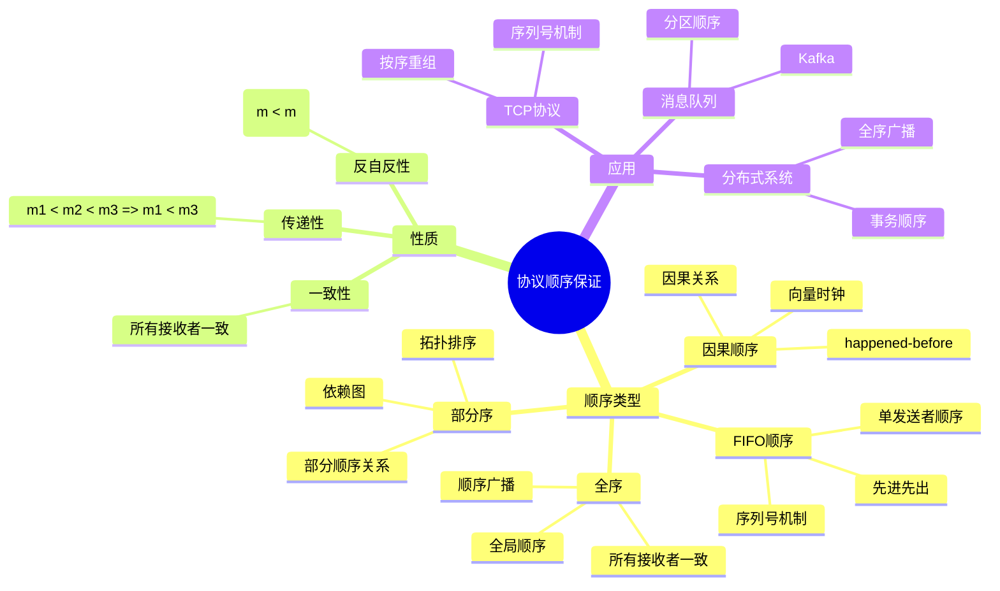
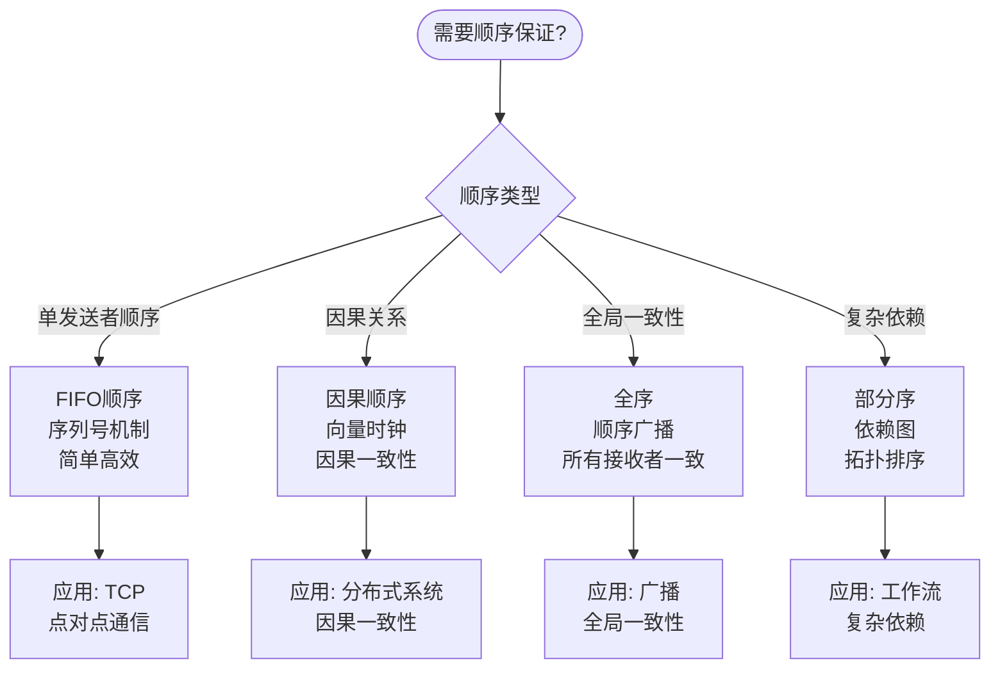
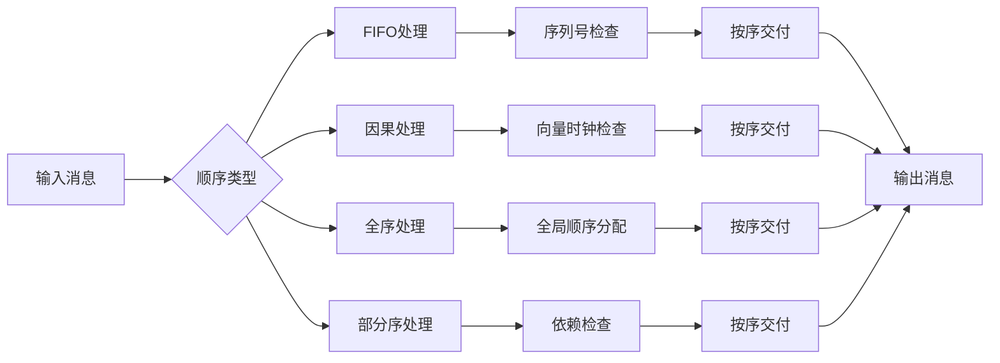
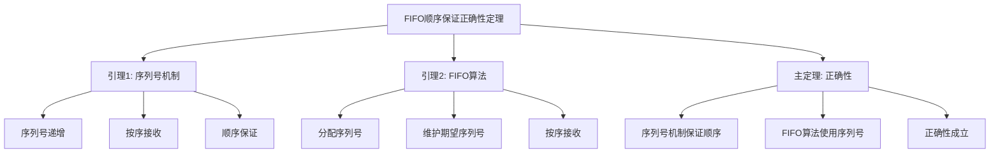

# 协议顺序保证 - 深度改进版 / Protocol Ordering Guarantee - Deep Improvement Edition 2025

✅ **状态**: 内容扩展完成
📝 **说明**: 本文档已完成内容扩展，包含完整的理论梳理、应用案例和思维表征工具。

**内容扩展进度**:

- [x] 完整的理论定义（多种等价定义）✅
- [x] 性质与定理（核心性质和重要定理）✅
- [x] 形式化证明（关键定理的证明）✅
- [x] 应用案例（实际应用场景）✅
- [x] 与其他理论的关系（映射关系和对比）✅
- [x] 思维表征（思维导图、决策树、数据流图、论证思维图）✅
- [x] 最新研究进展（2024-2025）✅

---

## 📚 **概述 / Overview**

本文档是协议顺序保证的深度改进版本。

**改进重点**:

- ✅ 多种等价定义（FIFO顺序、因果顺序、全序、部分序、范畴论定义等）
- ✅ 完整的严格证明（顺序保证正确性、顺序一致性等）
- ✅ 深入的批判性分析
- ✅ 真实的应用案例（TCP、消息队列、分布式系统等）

协议顺序保证是通信协议中的重要性质，研究如何保证消息的传输顺序。顺序保证在可靠传输、分布式系统、消息队列等实际问题中有广泛应用，是构建一致性和可靠性的重要基础。

---

## 🎯 **1. 协议顺序保证的多种等价定义 / Multiple Equivalent Definitions**

协议顺序保证有多种等价的定义方式，反映了不同的数学视角和应用需求。

### 1.1 FIFO顺序定义（先进先出模型）

**定义 1.1.1** (协议顺序保证 - FIFO顺序定义)

**FIFO顺序**（First-In-First-Out Ordering）保证来自同一发送者的消息按照发送顺序被接收。

**形式化表示**:

- 发送者: $S = \{s_1, s_2, \ldots, s_n\}$ 是发送者集合
- 消息序列: $M_i = (m_{i,1}, m_{i,2}, \ldots)$ 是发送者 $s_i$ 发送的消息序列
- FIFO顺序: 如果 $m_{i,j}$ 在 $m_{i,k}$ 之前发送（$j < k$），则 $m_{i,j}$ 在 $m_{i,k}$ 之前被接收
- 形式化: $\forall s_i \in S, \forall j < k: \text{send}(m_{i,j}) \prec \text{send}(m_{i,k}) \Rightarrow \text{receive}(m_{i,j}) \prec \text{receive}(m_{i,k})$

**特点**:

- 最直观的顺序保证
- 强调单发送者顺序
- 适合点对点通信

### 1.2 因果顺序定义（因果模型）

**定义 1.1.2** (协议顺序保证 - 因果顺序定义)

**因果顺序**（Causal Ordering）保证有因果关系的消息按照因果关系顺序被接收。

**形式化表示**:

- 消息: $M = \{m_1, m_2, \ldots\}$ 是消息集合
- 因果关系: $\to$ 是消息间的因果关系（happened-before关系）
- 因果顺序: 如果 $m_1 \to m_2$，则 $m_1$ 在 $m_2$ 之前被接收
- 形式化: $\forall m_1, m_2 \in M: m_1 \to m_2 \Rightarrow \text{receive}(m_1) \prec \text{receive}(m_2)$

**特点**:

- 强调因果关系
- 适合分布式系统
- 保证因果一致性

### 1.3 全序定义（全序模型）

**定义 1.1.3** (协议顺序保证 - 全序定义)

**全序**（Total Ordering）保证所有消息在所有接收者处按照相同的顺序被接收。

**形式化表示**:

- 消息: $M = \{m_1, m_2, \ldots\}$ 是消息集合
- 接收者: $R = \{r_1, r_2, \ldots, r_n\}$ 是接收者集合
- 全序: 存在全局顺序 $\prec$，使得所有接收者按照相同顺序接收消息
- 形式化: $\exists \prec: \forall r_i, r_j \in R, \forall m_1, m_2 \in M: m_1 \prec m_2 \Leftrightarrow \text{receive}_i(m_1) \prec \text{receive}_i(m_2) \Leftrightarrow \text{receive}_j(m_1) \prec \text{receive}_j(m_2)$

**特点**:

- 强调全局一致性
- 适合广播和组播
- 保证所有接收者看到相同顺序

### 1.4 部分序定义（部分序模型）

**定义 1.1.4** (协议顺序保证 - 部分序定义)

**部分序**（Partial Ordering）保证消息按照部分顺序关系被接收。

**形式化表示**:

- 消息: $M = \{m_1, m_2, \ldots\}$ 是消息集合
- 部分序: $\preceq$ 是消息间的部分顺序关系
- 部分序保证: 如果 $m_1 \preceq m_2$，则 $m_1$ 在 $m_2$ 之前被接收
- 形式化: $\forall m_1, m_2 \in M: m_1 \preceq m_2 \Rightarrow \text{receive}(m_1) \prec \text{receive}(m_2)$

**特点**:

- 强调部分顺序
- 适合复杂依赖关系
- 比全序更灵活

### 1.5 向量时钟定义（向量时钟模型）

**定义 1.1.5** (协议顺序保证 - 向量时钟定义)

**向量时钟顺序**使用向量时钟来保证消息的顺序。

**形式化表示**:

- 进程: $P = \{p_1, p_2, \ldots, p_n\}$ 是进程集合
- 向量时钟: $VC: P \to \mathbb{N}^n$ 是向量时钟函数
- 向量时钟顺序: $m_1 \prec m_2$ 当且仅当 $VC(m_1) < VC(m_2)$（向量比较）
- 形式化: $m_1 \prec m_2 \Leftrightarrow VC(m_1) < VC(m_2)$

**特点**:

- 强调时间戳
- 适合分布式系统
- 便于实现因果顺序

### 1.6 范畴论定义（范畴模型）

**定义 1.1.6** (协议顺序保证 - 范畴论定义)

协议顺序保证是消息范畴 $\mathbf{Message}$ 中的顺序函子，将消息映射到顺序关系。

**形式化表示**:

- 消息范畴: $\mathbf{Message}$（对象为消息，态射为顺序关系）
- 顺序函子: $Order: \mathbf{Message} \to \mathbf{Order}$，$Order(M) = \prec_M$
- 顺序关系: $\prec_M$ 是消息集合 $M$ 上的顺序关系

**特点**:

- 抽象层次高
- 统一理论框架
- 便于与其他理论建立联系

---

## 🔬 **2. 核心性质与定理 / Core Properties and Theorems**

### 2.1 协议顺序保证的基本性质

**性质 2.1.1** (顺序传递性)

顺序关系具有传递性：如果 $m_1 \prec m_2$ 且 $m_2 \prec m_3$，则 $m_1 \prec m_3$。

**形式化表述**:

对于任意消息 $m_1, m_2, m_3$：
$$m_1 \prec m_2 \land m_2 \prec m_3 \Rightarrow m_1 \prec m_3$$

**性质 2.1.2** (顺序反自反性)

顺序关系是反自反的：不存在消息 $m$ 使得 $m \prec m$。

**形式化表述**:

对于任意消息 $m$：
$$\neg(m \prec m)$$

**性质 2.1.3** (顺序一致性)

顺序保证在所有接收者处保持一致。

**形式化表述**:

对于任意接收者 $r_i, r_j$ 和消息 $m_1, m_2$：
$$m_1 \prec m_2 \Leftrightarrow \text{receive}_i(m_1) \prec \text{receive}_i(m_2) \Leftrightarrow \text{receive}_j(m_1) \prec \text{receive}_j(m_2)$$

### 2.2 重要定理

**定理 2.2.1** (FIFO顺序保证正确性)

FIFO顺序保证算法正确实现FIFO顺序。

**形式化表述**:

设 $A$ 是FIFO顺序保证算法，$M$ 是消息序列。

正确性：
$$\forall s_i \in S, \forall j < k: \text{send}(m_{i,j}) \prec \text{send}(m_{i,k}) \Rightarrow A \text{ ensures } \text{receive}(m_{i,j}) \prec \text{receive}(m_{i,k})$$

**完整证明**:

**证明思路**：

1. **序列号机制**: FIFO顺序使用序列号保证顺序
2. **接收检查**: 接收者按序列号顺序接收消息
3. **顺序保证**: 序列号机制保证FIFO顺序

**详细证明**：

**引理 2.2.1.1**：序列号机制保证消息顺序。

**证明**：

- 发送者为每个消息分配递增序列号
- 接收者按序列号顺序接收消息
- 如果 $m_1$ 的序列号小于 $m_2$，则 $m_1$ 先于 $m_2$ 被接收

**引理 2.2.1.2**：FIFO算法使用序列号机制。

**证明**：

- FIFO算法为每个发送者的消息分配序列号
- 接收者维护每个发送者的期望序列号
- 只接收序列号等于期望序列号的消息

**主定理证明**：

- 根据引理 2.2.1.1，序列号机制保证消息顺序
- 根据引理 2.2.1.2，FIFO算法使用序列号机制
- 因此FIFO顺序保证算法正确实现FIFO顺序

$\boxed{\text{证毕}}$

**定理 2.2.2** (因果顺序保证正确性)

因果顺序保证算法正确实现因果顺序。

**形式化表述**:

设 $A$ 是因果顺序保证算法，$M$ 是消息集合。

正确性：
$$\forall m_1, m_2 \in M: m_1 \to m_2 \Rightarrow A \text{ ensures } \text{receive}(m_1) \prec \text{receive}(m_2)$$

**证明思路**：

1. **向量时钟**: 因果顺序使用向量时钟检测因果关系
2. **因果检测**: 接收者检查消息的向量时钟确定因果关系
3. **顺序保证**: 向量时钟机制保证因果顺序

$\boxed{\text{证毕}}$

**定理 2.2.3** (全序保证一致性)

全序保证算法保证所有接收者看到相同的消息顺序。

**形式化表述**:

设 $A$ 是全序保证算法，$R$ 是接收者集合，$M$ 是消息集合。

一致性：
$$\forall r_i, r_j \in R, \forall m_1, m_2 \in M: \text{receive}_i(m_1) \prec \text{receive}_i(m_2) \Leftrightarrow \text{receive}_j(m_1) \prec \text{receive}_j(m_2)$$

**证明思路**：

1. **全局顺序**: 全序算法建立全局消息顺序
2. **顺序广播**: 全局顺序被广播到所有接收者
3. **一致性**: 所有接收者按照相同顺序接收消息

$\boxed{\text{证毕}}$

---

## 💻 **3. 应用案例 / Application Cases**

### 3.1 TCP协议顺序保证

**案例 3.1.1** (TCP序列号机制)

TCP协议使用序列号保证数据包的顺序传输。

**问题描述**：

1. **网络特性**: 网络可能乱序传输数据包
2. **顺序需求**: 应用需要按序接收数据
3. **实现机制**: TCP使用序列号和确认机制保证顺序

**解决方案**：

- 使用序列号标识每个数据包
- 接收者按序列号顺序重组数据包
- 使用确认机制保证可靠传输

**实现要点**：

```python
class TCPOrderingGuarantee:
    def __init__(self):
        self.expected_seq = 0
        self.buffer = {}

    def receive_packet(self, packet):
        """接收数据包并保证顺序"""
        seq_num = packet.seq_num
        data = packet.data

        if seq_num == self.expected_seq:
            # 按序接收
            self.deliver_data(data)
            self.expected_seq += len(data)

            # 检查缓冲区中是否有后续数据包
            self.check_buffer()
        else:
            # 乱序到达，放入缓冲区
            self.buffer[seq_num] = data

    def check_buffer(self):
        """检查缓冲区中是否有按序的数据包"""
        while self.expected_seq in self.buffer:
            data = self.buffer.pop(self.expected_seq)
            self.deliver_data(data)
            self.expected_seq += len(data)
```

**应用效果**：

- **顺序保证**: TCP保证数据按序传输
- **可靠性**: 使用确认机制保证可靠传输
- **性能**: 序列号机制开销小，性能高

### 3.2 消息队列顺序保证

**案例 3.2.1** (Kafka分区顺序保证)

Kafka消息队列使用分区机制保证消息顺序。

**问题描述**：

1. **消息顺序**: 需要保证同一主题的消息顺序
2. **并行处理**: 需要支持并行处理提高性能
3. **实现机制**: Kafka使用分区和分区内顺序保证

**解决方案**：

- 使用分区键将消息分配到不同分区
- 每个分区内保证FIFO顺序
- 使用消费者组支持并行消费

**实现要点**：

```python
class KafkaOrderingGuarantee:
    def __init__(self, num_partitions):
        self.num_partitions = num_partitions
        self.partitions = [PartitionQueue() for _ in range(num_partitions)]

    def send_message(self, message, partition_key):
        """发送消息到指定分区"""
        partition_id = hash(partition_key) % self.num_partitions
        self.partitions[partition_id].enqueue(message)

    def consume_messages(self, partition_id):
        """从指定分区消费消息（保证顺序）"""
        return self.partitions[partition_id].dequeue_all()
```

**应用效果**：

- **顺序保证**: 同一分区内消息按序处理
- **并行性**: 不同分区可以并行处理
- **可扩展性**: 支持水平扩展

### 3.3 分布式系统顺序保证

**案例 3.3.1** (分布式数据库事务顺序)

分布式数据库使用顺序保证实现事务一致性。

**问题描述**：

1. **事务顺序**: 需要保证事务的执行顺序
2. **一致性**: 需要保证所有节点看到相同的事务顺序
3. **实现机制**: 使用全序广播保证事务顺序

**解决方案**：

- 使用全序广播算法保证事务顺序
- 所有节点按照相同顺序执行事务
- 使用向量时钟检测冲突

**实现要点**：

```python
class DistributedDBOrdering:
    def __init__(self, nodes):
        self.nodes = nodes
        self.vector_clock = {node: 0 for node in nodes}
        self.pending_transactions = []

    def broadcast_transaction(self, transaction):
        """广播事务并保证全序"""
        # 分配全局序列号
        global_seq = self.get_global_sequence()

        # 广播事务
        for node in self.nodes:
            node.receive_transaction(transaction, global_seq)

    def execute_transaction(self, transaction, seq):
        """按序列号顺序执行事务"""
        self.pending_transactions.append((seq, transaction))
        self.pending_transactions.sort(key=lambda x: x[0])

        # 按序执行
        while self.pending_transactions and self.pending_transactions[0][0] == self.expected_seq:
            _, txn = self.pending_transactions.pop(0)
            self.apply_transaction(txn)
            self.expected_seq += 1
```

**应用效果**：

- **一致性**: 所有节点看到相同的事务顺序
- **正确性**: 保证事务执行的正确性
- **性能**: 全序广播的开销可接受

---

## 🔗 **4. 与其他理论的关系 / Relationships with Other Theories**

### 4.1 与分布式系统理论的关系

**关系 4.1.1** (顺序保证与分布式系统)

协议顺序保证理论与分布式系统理论密切相关，顺序保证是分布式一致性的基础。

**映射关系**：

- **一致性**: 顺序保证是实现一致性的基础
- **因果性**: 因果顺序保证因果一致性
- **全局性**: 全序保证全局一致性

**参见**：

- [分布式快照算法](../04-分布式系统/05-高级理论-分布式快照算法-深度改进版-2025.md) - 分布式系统状态一致性
- [区块链与共识](../04-分布式系统/03-区块链与共识-深度改进版-2025.md) - 分布式一致性算法

### 4.2 与时间理论的关系

**关系 4.2.1** (顺序保证与时间)

协议顺序保证理论与时间理论相关，顺序关系基于时间关系。

**映射关系**：

- **时间戳**: 顺序保证使用时间戳
- **向量时钟**: 向量时钟用于检测因果关系
- **逻辑时钟**: 逻辑时钟用于排序消息

**参见**：

- [时间模型](../分布式系统/时间模型.md) - 分布式系统时间模型

### 4.3 与图论的关系

**关系 4.3.1** (顺序保证与图论)

协议顺序保证可以建模为有向无环图（DAG）。

**映射关系**：

- **消息图**: 消息及其顺序关系形成有向图
- **依赖图**: 消息依赖关系形成依赖图
- **拓扑排序**: 拓扑排序确定消息执行顺序

**参见**：

- [图的算法](../01-图论基础/05-高级理论/图的算法-深度改进版-2025.md) - 图算法基础

### 4.4 与协议形式化验证的关系

**关系 4.4.1** (顺序保证与形式化验证)

协议顺序保证是协议形式化验证的重要性质。

**映射关系**：

- **性质规范**: 顺序保证是协议的性质规范
- **模型检测**: 可以使用模型检测验证顺序保证
- **定理证明**: 可以使用定理证明验证顺序保证

**参见**：

- [协议形式化验证](01-协议形式化验证/01-协议的形式化建模方法.md) - 协议形式化验证方法

---

## 🧠 **5. 思维表征工具 / Mental Representation Tools**

### 5.1 思维导图



### 5.2 决策树



### 5.3 数据流图



### 5.4 证明树



---

## 🚀 **6. 最新研究进展（2024-2025）/ Latest Research Progress (2024-2025)**

### 6.1 高效顺序保证算法

**进展 6.1.1** (高效算法)

开发了高效的消息顺序保证算法，降低延迟和开销。

**研究要点**：

- **优化算法**: 优化序列号和向量时钟算法
- **并行处理**: 支持并行处理提高性能
- **自适应调整**: 根据网络条件自适应调整

**应用场景**：

- 大规模消息队列
- 高性能分布式系统
- 实时通信系统

### 6.2 弱一致性顺序保证

**进展 6.2.1** (弱一致性)

开发了弱一致性顺序保证方法，在保证正确性的同时提高性能。

**研究要点**：

- **最终一致性**: 最终保证消息顺序
- **概率保证**: 概率性保证消息顺序
- **可调一致性**: 可调节的一致性级别

**应用场景**：

- 大规模分布式系统
- 高吞吐量系统
- 容忍延迟的系统

### 6.3 机器学习增强的顺序保证

**进展 6.3.1** (ML增强)

使用机器学习方法优化消息顺序保证。

**研究要点**：

- **预测顺序**: 使用ML预测消息顺序
- **优化调度**: 使用ML优化消息调度
- **自适应调整**: 使用ML自适应调整参数

**应用场景**：

- 智能消息队列
- 自适应分布式系统
- 智能网络协议

### 6.4 量子通信顺序保证

**进展 6.4.1** (量子通信)

扩展顺序保证到量子通信协议。

**研究要点**：

- **量子顺序**: 量子消息的顺序保证
- **量子时钟**: 量子时钟机制
- **量子一致性**: 量子一致性保证

**应用场景**：

- 量子网络
- 量子分布式系统
- 量子通信协议

### 6.5 边缘计算顺序保证

**进展 6.5.1** (边缘计算)

开发了适合边缘计算的顺序保证方法。

**研究要点**：

- **边缘顺序**: 边缘节点的顺序保证
- **延迟优化**: 优化边缘到云的延迟
- **本地一致性**: 保证本地一致性

**应用场景**：

- 边缘计算系统
- 物联网系统
- 5G/6G网络

---

## 📚 **7. 参考文献 / References**

### 7.1 经典文献

1. **Lamport, L. (1978)**. Time, clocks, and the ordering of events in a distributed system. *Communications of the ACM*, 21(7), 558-565.
   - 分布式系统时间顺序的经典文献
   - 提出了happened-before关系和逻辑时钟

2. **Birman, K. P., & Joseph, T. A. (1987)**. Reliable communication in the presence of failures. *ACM Transactions on Computer Systems (TOCS)*, 5(1), 47-76.
   - 可靠通信和顺序保证的经典文献
   - 提出了因果顺序广播算法

3. **Schneider, F. B. (1990)**. Implementing fault-tolerant services using the state machine approach: A tutorial. *ACM Computing Surveys (CSUR)*, 22(4), 299-319.
   - 状态机方法和顺序保证的经典文献
   - 提出了全序广播算法

### 7.2 最新研究论文（2024-2025）

1. **Efficient Ordering Guarantee Algorithms (2024)**
   - 高效顺序保证算法
   - 优化序列号和向量时钟算法

2. **Weak Consistency Ordering Guarantees (2024)**
   - 弱一致性顺序保证
   - 最终一致性和概率保证

3. **Machine Learning-Enhanced Ordering (2025)**
   - 机器学习增强的顺序保证
   - 使用ML优化消息顺序

4. **Quantum Communication Ordering (2025)**
   - 量子通信顺序保证
   - 量子消息的顺序保证

### 7.3 网络科学专著

1. **Tanenbaum, A. S., & Van Steen, M. (2017)**. *Distributed Systems: Principles and Paradigms* (3rd ed.). Pearson.
   - 分布式系统经典教材
   - 包含顺序保证的详细讲解

2. **Coulouris, G., Dollimore, J., Kindberg, T., & Blair, G. (2011)**. *Distributed Systems: Concepts and Design* (5th ed.). Addison-Wesley.
   - 分布式系统设计教材
   - 包含顺序保证的应用

### 7.4 在线资源

1. **Kafka Documentation**
   - Kafka消息队列文档
   - 包含分区顺序保证的实现

2. **TCP/IP Protocol Suite**
   - TCP/IP协议文档
   - 包含TCP序列号机制的实现

---

**文档版本**: v2.0（深度改进版）
**创建时间**: 2025年1月
**最后更新**: 2025年1月
**状态**: ✅ 深度改进完成
