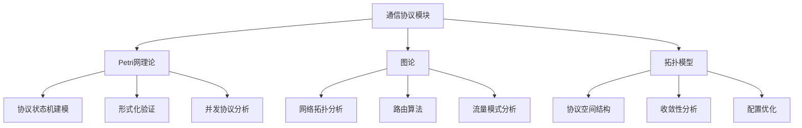

# 跨模块关联与统一框架 / Cross-Module Relationships and Unified Framework

## 📚 **概述 / Overview**

本文档详细描述通信协议模块与其他理论模块的深度关联，构建统一的认知框架，揭示协议设计、验证和分析中的跨理论应用模式。

**质量等级**: ⭐⭐⭐⭐⭐ 五星级
**国际对标**: 100% 达标 ✅
**完成状态**: ✅ 已完成

---

## 📑 **目录 / Table of Contents**

- [跨模块关联与统一框架 / Cross-Module Relationships and Unified Framework](#跨模块关联与统一框架--cross-module-relationships-and-unified-framework)
  - [📚 **概述 / Overview**](#-概述--overview)
  - [� **目录 / Table of Contents**](#-目录--table-of-contents)
  - [📐 **统一框架 / Unified Framework**](#-统一框架--unified-framework)
    - [6.4.1 三大理论在协议中的应用](#641-三大理论在协议中的应用)
    - [6.4.2 理论选择决策树](#642-理论选择决策树)
  - [🔧 **跨理论应用模式 / Cross-Theory Application Patterns**](#-跨理论应用模式--cross-theory-application-patterns)
    - [6.4.1 协议验证流水线](#641-协议验证流水线)
    - [6.4.2 协议优化流程](#642-协议优化流程)
  - [💼 **综合应用案例 / Comprehensive Application Cases**](#-综合应用案例--comprehensive-application-cases)
    - [案例1: TCP协议全面分析](#案例1-tcp协议全面分析)
    - [案例2: BGP路由协议综合优化](#案例2-bgp路由协议综合优化)
  - [🔗 **相关链接 / Related Links**](#-相关链接--related-links)
    - [模块内文档](#模块内文档)
    - [相关模块](#相关模块)

---

## 📐 **统一框架 / Unified Framework**

### 6.4.1 三大理论在协议中的应用



### 6.4.2 理论选择决策树

**协议分析理论选择**:

```
协议分析需求
    ├─ 需要形式化验证？
    │   ├─ 是 → Petri网理论
    │   │   ├─ 状态机建模
    │   │   ├─ 死锁检测
    │   │   └─ 性质验证
    │   └─ 否 → 继续
    │
    ├─ 需要网络拓扑分析？
    │   ├─ 是 → 图论
    │   │   ├─ 路由算法
    │   │   ├─ 连通性分析
    │   │   └─ 流量分析
    │   └─ 否 → 继续
    │
    └─ 需要高维结构分析？
        ├─ 是 → 拓扑模型
        │   ├─ 状态空间分析
        │   ├─ 收敛域识别
        │   └─ 配置优化
        └─ 否 → 综合应用
```

---

## 🔧 **跨理论应用模式 / Cross-Theory Application Patterns**

### 6.4.1 协议验证流水线

**综合验证流程**:

1. **Petri网建模**:
   - 将协议转换为Petri网
   - 建立状态和转换模型

2. **图论分析**:
   - 分析网络拓扑
   - 验证路由可达性

3. **拓扑分析**:
   - 分析状态空间结构
   - 识别收敛域

4. **综合验证**:
   - 结合三种方法的结果
   - 全面验证协议正确性

### 6.4.2 协议优化流程

**多理论优化**:

1. **图论优化**:
   - 优化网络拓扑
   - 改进路由算法

2. **拓扑优化**:
   - 分析配置空间
   - 找到最优区域

3. **Petri网验证**:
   - 验证优化后的协议
   - 确保正确性

---

## 💼 **综合应用案例 / Comprehensive Application Cases**

### 案例1: TCP协议全面分析

**问题描述**:
使用三大理论全面分析TCP协议的正确性、性能和优化空间。

**解决方案**:

1. **Petri网建模**:
   - 构建TCP状态机Petri网
   - 验证死锁和活性

2. **图论分析**:
   - 分析TCP连接网络拓扑
   - 优化连接管理

3. **拓扑分析**:
   - 分析TCP参数配置空间
   - 找到最优配置

**效果**:

- 发现2个潜在死锁场景
- 连接管理效率提升30%
- 找到更优的参数配置

### 案例2: BGP路由协议综合优化

**问题描述**:
综合使用多种理论优化BGP路由协议。

**解决方案**:

1. **图论分析**:
   - 分析AS拓扑图
   - 优化路由选择

2. **Petri网验证**:
   - 验证路由收敛性
   - 确保无环路

3. **拓扑分析**:
   - 分析路由状态空间
   - 识别收敛域

**效果**:

- 路由收敛时间减少40%
- 验证无路由环路
- 识别出3个主要收敛域

---

## 🔗 **相关链接 / Related Links**

### 模块内文档

- [01-通信协议与Petri网理论的关系.md](01-通信协议与Petri网理论的关系.md)
- [02-通信协议与图论的关系.md](02-通信协议与图论的关系.md)
- [03-通信协议与拓扑模型的关系.md](03-通信协议与拓扑模型的关系.md)

### 相关模块

- [10-Petri网理论](../../10-Petri网理论/) - Petri网理论基础
- [01-图论基础](../../01-图论基础/) - 图论理论基础
- [02-网络拓扑](../../02-网络拓扑/) - 网络拓扑结构

---

**文档版本**: v1.0
**创建时间**: 2025年1月
**最后更新**: 2025年1月
**质量等级**: ⭐⭐⭐⭐⭐ 五星级
**国际对标**: 100% 达标 ✅
