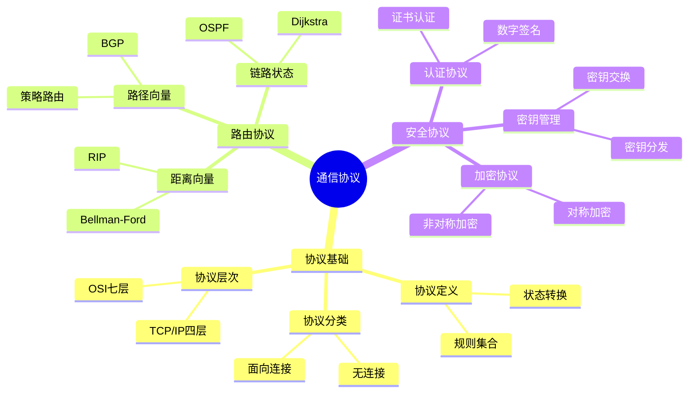
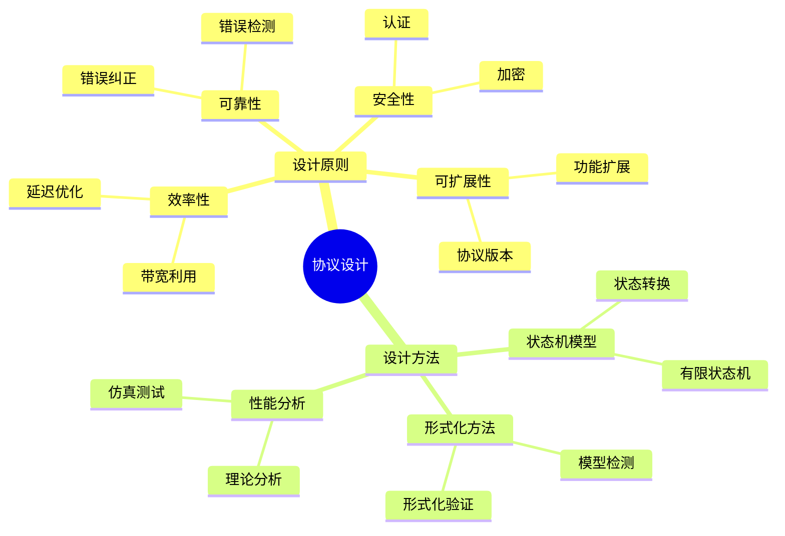
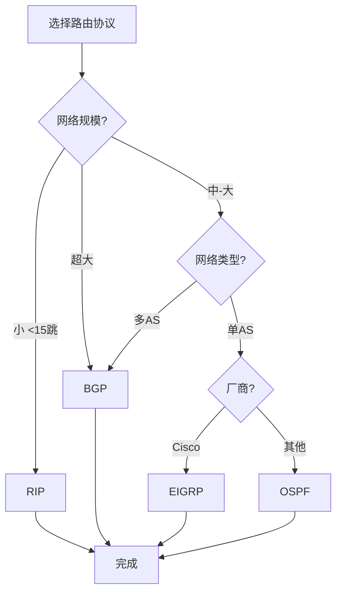
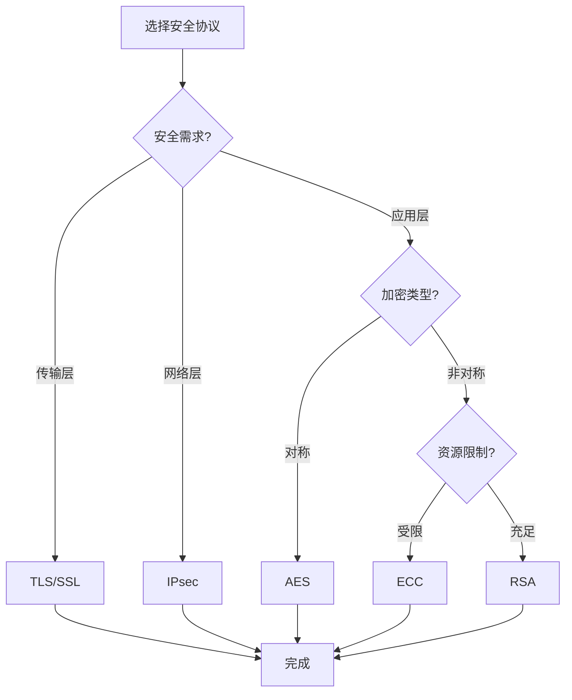
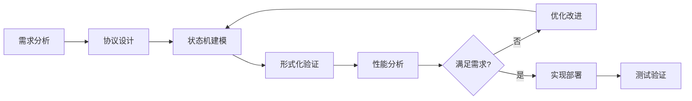
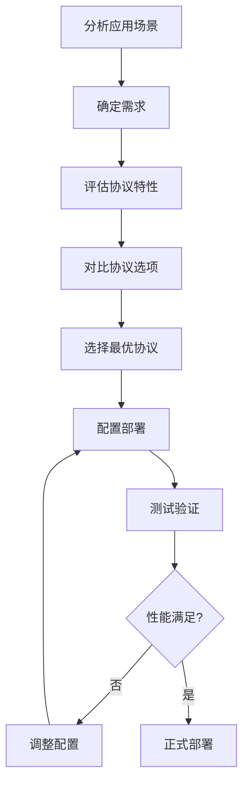
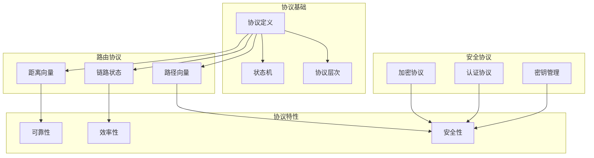

# 通信协议思维表征工具 / Communication Protocol Mental Representation Tools

## 📚 **概述 / Overview**

本文档提供通信协议模块的多种思维表征工具，包括思维导图、对比矩阵、决策树、逻辑路径和概念地图，帮助更好地理解和应用通信协议知识。

**创建时间**: 2025年1月
**模块**: 通信协议
**状态**: 🚀 持续更新中

---

## 🗺️ **一、思维导图 / Mind Maps**

### 1.1 通信协议核心概念思维导图

### 1.2 协议设计思维导图

---

## 📊 **二、对比矩阵 / Comparison Matrices**

### 2.1 路由协议对比矩阵

| 协议 | 类型 | 算法 | 收敛时间 | 适用规模 | 特点 | 应用场景 |
|------|------|------|---------|---------|------|---------|
| **RIP** | 距离向量 | Bellman-Ford | 慢 | 小（<15跳） | 简单、易配置 | 小型网络 |
| **OSPF** | 链路状态 | Dijkstra | 快 | 中-大 | 快速收敛、支持分层 | 企业网、ISP |
| **IS-IS** | 链路状态 | Dijkstra | 快 | 大 | 支持IPv4/IPv6 | 大型ISP |
| **BGP** | 路径向量 | 路径选择 | 慢 | 超大 | 策略路由、AS间 | 互联网核心 |
| **EIGRP** | 混合 | DUAL | 快 | 中 | Cisco专有、快速收敛 | Cisco网络 |

**选择指南**：
- **小型网络**：RIP
- **企业网**：OSPF
- **大型ISP**：IS-IS或BGP
- **互联网核心**：BGP
- **Cisco环境**：EIGRP

### 2.2 安全协议对比矩阵

| 协议 | 类型 | 加密算法 | 密钥长度 | 性能 | 安全性 | 应用场景 |
|------|------|---------|---------|------|--------|---------|
| **AES** | 对称加密 | AES | 128/192/256 | 高 | 高 | 数据加密 |
| **RSA** | 非对称加密 | RSA | 2048/4096 | 低 | 高 | 密钥交换、数字签名 |
| **ECC** | 非对称加密 | 椭圆曲线 | 256/384 | 中 | 高 | 移动设备、IoT |
| **TLS/SSL** | 传输层安全 | 混合 | 可变 | 中 | 高 | Web安全、HTTPS |
| **IPsec** | 网络层安全 | 混合 | 可变 | 中 | 高 | VPN、网络层加密 |

**选择指南**：
- **数据加密**：AES
- **密钥交换**：RSA或ECC
- **Web安全**：TLS/SSL
- **VPN**：IPsec
- **资源受限**：ECC

### 2.3 协议层次结构对比矩阵

| 层次模型 | 层数 | 特点 | 应用 | 优势 | 劣势 |
|---------|------|------|------|------|------|
| **OSI七层** | 7 | 理论模型 | 教学、参考 | 层次清晰、理论完整 | 复杂、不实用 |
| **TCP/IP四层** | 4 | 实际标准 | 互联网 | 简单、实用 | 层次不够细 |
| **五层模型** | 5 | 折中方案 | 教学 | 平衡理论和实践 | 非标准 |

**选择指南**：
- **理论学习**：OSI七层
- **实际应用**：TCP/IP四层
- **教学**：五层模型

---

## 🌳 **三、决策树 / Decision Trees**

### 3.1 路由协议选择决策树

### 3.2 安全协议选择决策树

---

## 🛤️ **四、逻辑路径 / Logical Paths**

### 4.1 协议设计逻辑路径

### 4.2 协议选择逻辑路径

---

## 🗺️ **五、概念地图 / Concept Maps**

### 5.1 通信协议概念关系地图

---

**文档版本**: v1.0
**创建时间**: 2025年1月
**最后更新**: 2025年1月
**维护者**: GraphNetWorkCommunicate项目组
