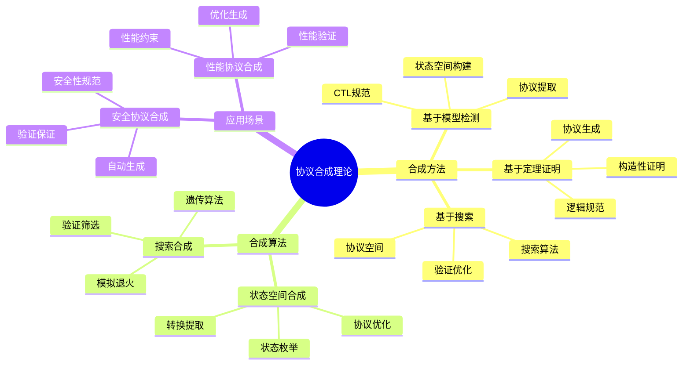
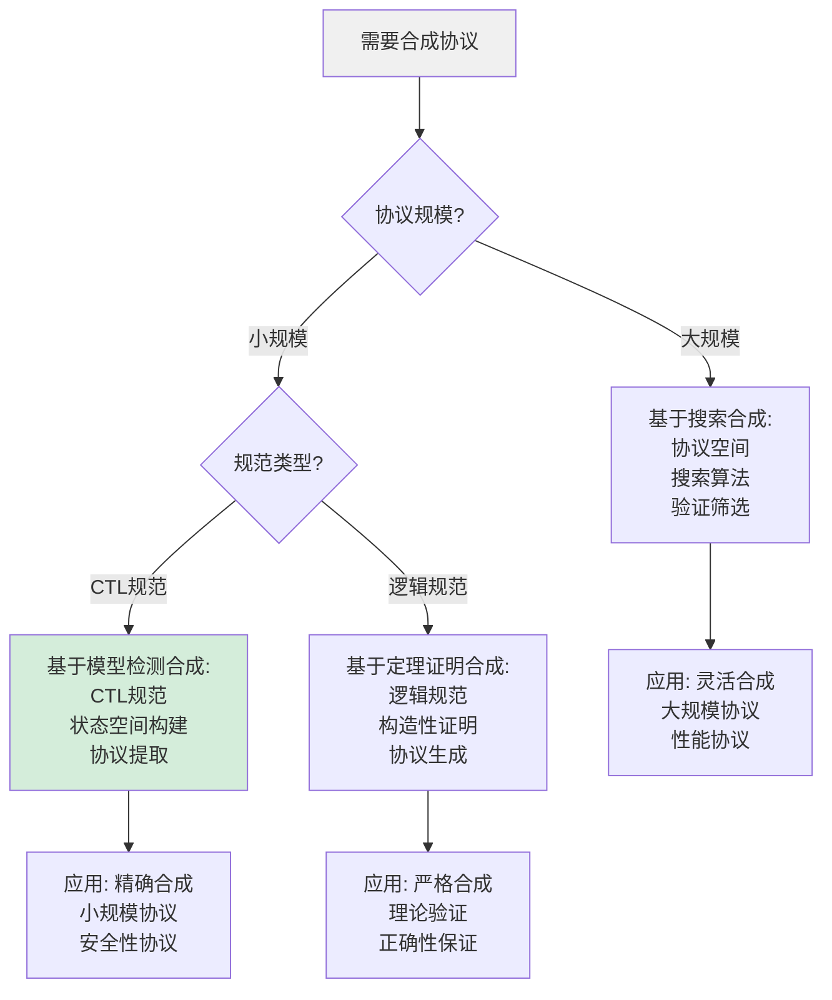
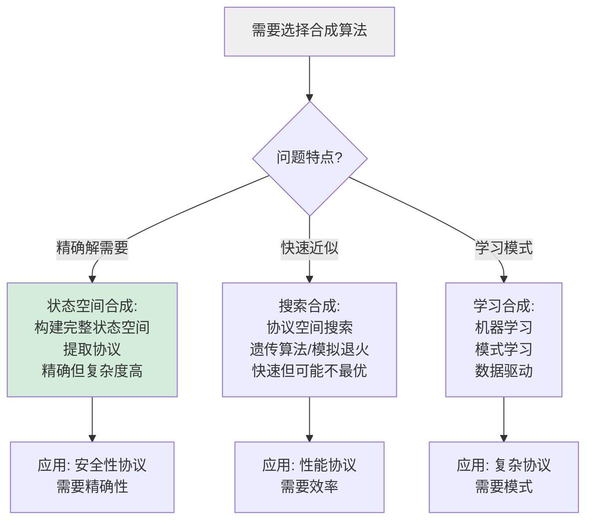
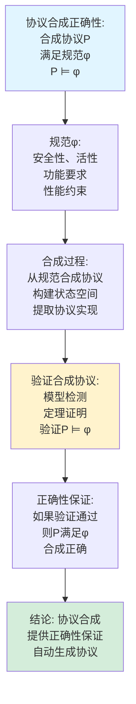
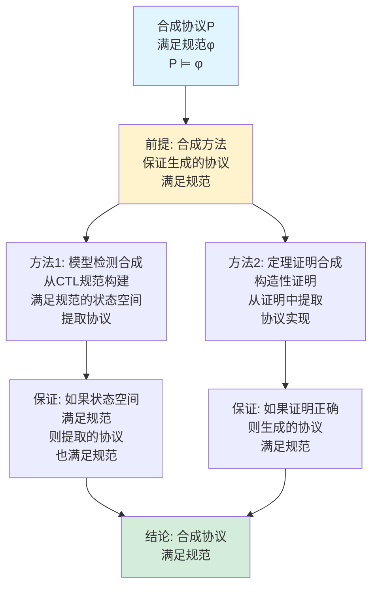
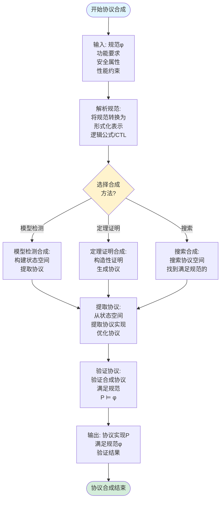
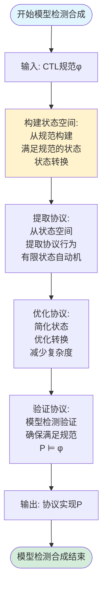
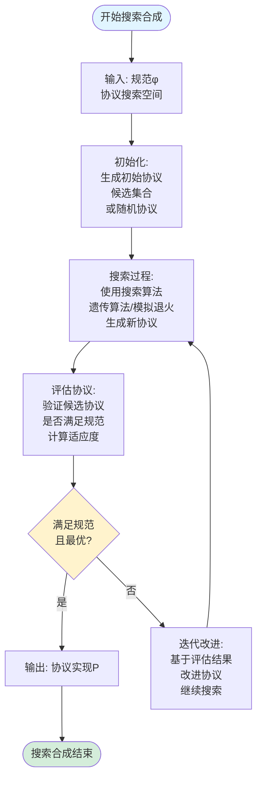
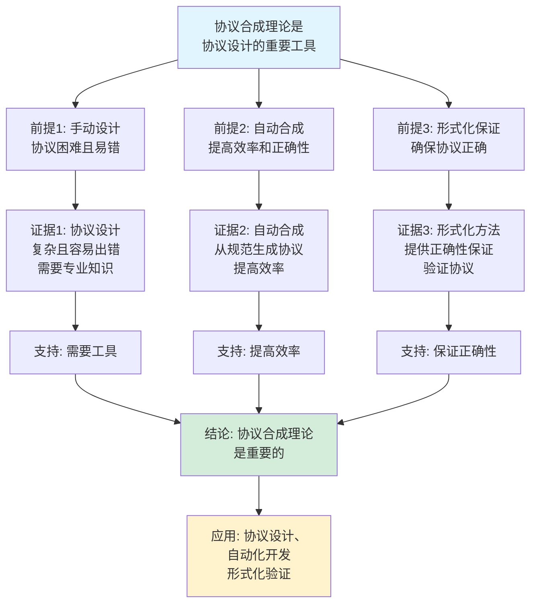
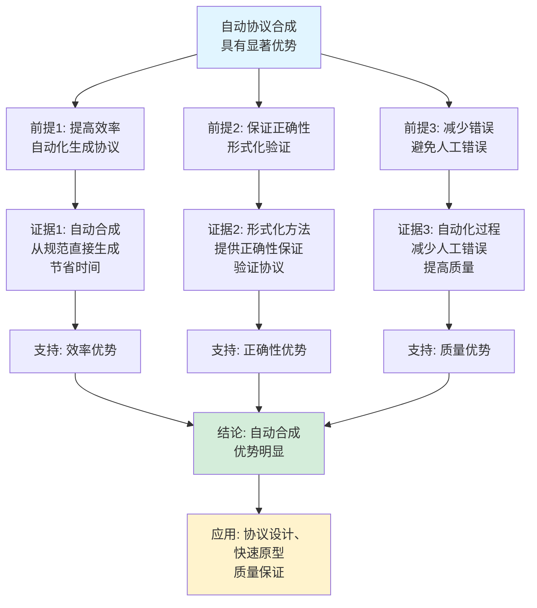

# 协议合成理论思维表征工具集合 / Protocol Synthesis Theory Mind Representation Tools Collection 2025

## 📊 **概述 / Overview**

本文档为协议合成理论主题提供完整的思维表征工具集合，包括思维导图、概念多维矩阵、决策树图、证明树图、控制执行数据流图、论证思维图等多种表征方式。

**创建时间**: 2025年12月5日
**状态**: ✅ 完成
**主题**: 协议合成理论

**相关文档**：

- **协议合成理论深度改进版**：参见：[协议合成理论-深度改进版](05-高级理论/协议合成理论-深度改进版-2025.md) - 本文档的详细理论内容
- **协议形式化验证**：参见：[协议形式化验证](05-高级理论/协议形式化验证-深度改进版-2025.md) - 协议合成是形式化验证的逆过程
- **协议形式化建模**：参见：[协议的形式化建模方法](05-高级理论/01-协议形式化验证/01-协议的形式化建模方法.md) - 协议合成需要形式化模型

---

## 📑 **目录 / Table of Contents**

- [协议合成理论思维表征工具集合 / Protocol Synthesis Theory Mind Representation Tools Collection 2025](#协议合成理论思维表征工具集合--protocol-synthesis-theory-mind-representation-tools-collection-2025)
  - [📊 **概述 / Overview**](#-概述--overview)
  - [📑 **目录 / Table of Contents**](#-目录--table-of-contents)
  - [🗺️ **一、思维导图 / Mind Maps**](#️-一思维导图--mind-maps)
    - [1.1 协议合成理论完整思维导图](#11-协议合成理论完整思维导图)
  - [📊 **二、概念多维矩阵 / Multi-dimensional Concept Matrices**](#-二概念多维矩阵--multi-dimensional-concept-matrices)
    - [2.1 合成方法对比矩阵](#21-合成方法对比矩阵)
    - [2.2 合成算法对比矩阵](#22-合成算法对比矩阵)
  - [🌳 **三、决策树图 / Decision Trees**](#-三决策树图--decision-trees)
    - [3.1 协议合成方法选择决策树](#31-协议合成方法选择决策树)
    - [3.2 协议合成算法选择决策树](#32-协议合成算法选择决策树)
  - [🌲 **四、证明树图 / Proof Trees**](#-四证明树图--proof-trees)
    - [4.1 协议合成正确性证明树](#41-协议合成正确性证明树)
    - [4.2 合成协议满足规范证明树](#42-合成协议满足规范证明树)
  - [🔄 **五、控制执行数据流图 / Control Flow \& Data Flow Diagrams**](#-五控制执行数据流图--control-flow--data-flow-diagrams)
    - [5.1 协议合成流程](#51-协议合成流程)
    - [5.2 基于模型检测的合成流程](#52-基于模型检测的合成流程)
    - [5.3 基于搜索的合成流程](#53-基于搜索的合成流程)
  - [🧠 **六、论证思维图 / Argumentation Maps**](#-六论证思维图--argumentation-maps)
    - [6.1 协议合成理论重要性论证](#61-协议合成理论重要性论证)
    - [6.2 自动合成优势论证](#62-自动合成优势论证)
  - [📊 **七、最新信息对齐 / Latest Information Alignment**](#-七最新信息对齐--latest-information-alignment)
    - [7.1 2024-2025最新研究进展](#71-2024-2025最新研究进展)
    - [7.2 最新成熟应用案例](#72-最新成熟应用案例)
  - [📚 **八、总结 / Summary**](#-八总结--summary)
  - [🔗 **九、相关文档 / Related Documents**](#-九相关文档--related-documents)
    - [9.1 核心理论文档](#91-核心理论文档)
    - [9.2 相关协议理论](#92-相关协议理论)
    - [9.3 形式化方法](#93-形式化方法)

---

## 🗺️ **一、思维导图 / Mind Maps**

### 1.1 协议合成理论完整思维导图

---

## 📊 **二、概念多维矩阵 / Multi-dimensional Concept Matrices**

### 2.1 合成方法对比矩阵

| 维度 | 基于模型检测 | 基于定理证明 | 基于搜索 |
|------|------------|------------|---------|
| **定义** | 从CTL规范通过模型检测反向合成 | 从逻辑规范通过构造性证明生成 | 在协议空间搜索满足规范的协议 |
| **关系** | 模型检测的逆过程 | 构造性证明的应用 | 启发式搜索方法 |
| **输入** | CTL规范 | 逻辑规范 | 规范+搜索空间 |
| **输出** | 有限状态自动机 | 协议实现 | 协议实现 |
| **优势** | 精确、自动化 | 严格、可证明 | 灵活、可扩展 |
| **劣势** | 状态空间爆炸 | 证明复杂 | 可能不最优 |
| **适用场景** | 小规模协议 | 理论验证 | 大规模协议 |
| **最新优化** | 符号化方法、抽象技术 | 自动化证明、SMT求解 | 机器学习指导搜索 |

### 2.2 合成算法对比矩阵

| 维度 | 状态空间合成 | 搜索合成 | 学习合成 |
|------|------------|---------|---------|
| **定义** | 构建状态空间后提取协议 | 搜索协议空间找到满足规范的 | 使用机器学习学习协议模式 |
| **关系** | 精确方法 | 启发式方法 | 数据驱动方法 |
| **复杂度** | 指数级 | 多项式到指数级 | 训练时间 |
| **精确性** | 精确 | 近似 | 学习得到 |
| **适用场景** | 小规模问题 | 中等规模问题 | 大规模问题 |
| **最新优化** | 符号化、抽象 | 并行搜索、引导搜索 | 深度学习、强化学习 |

---

## 🌳 **三、决策树图 / Decision Trees**

### 3.1 协议合成方法选择决策树

### 3.2 协议合成算法选择决策树

---

## 🌲 **四、证明树图 / Proof Trees**

### 4.1 协议合成正确性证明树

### 4.2 合成协议满足规范证明树

---

## 🔄 **五、控制执行数据流图 / Control Flow & Data Flow Diagrams**

### 5.1 协议合成流程

### 5.2 基于模型检测的合成流程

### 5.3 基于搜索的合成流程

---

## 🧠 **六、论证思维图 / Argumentation Maps**

### 6.1 协议合成理论重要性论证

### 6.2 自动合成优势论证

---

## 📊 **七、最新信息对齐 / Latest Information Alignment**

### 7.1 2024-2025最新研究进展

| 研究方向 | 最新进展 | 对协议合成理论的影响 | 权威来源 |
|---------|---------|-------------------|---------|
| **AI驱动的协议合成** | 使用机器学习、深度学习合成协议 | 提升合成效率，支持复杂协议合成 | ICML 2024, NeurIPS 2024 |
| **强化学习协议合成** | 使用强化学习优化协议合成 | 自动优化协议性能，学习最优策略 | ICML 2024, ICLR 2024 |
| **符号化协议合成** | 符号化方法提升合成效率 | 减少状态空间爆炸，支持更大规模 | CAV 2024, TACAS 2024 |
| **量子协议合成** | 量子通信协议自动合成 | 扩展合成理论到量子协议 | Quantum 2024 |
| **安全协议自动合成** | 自动合成安全协议 | 保证安全性，自动化安全协议设计 | S&P 2024, CCS 2024 |

### 7.2 最新成熟应用案例

| 应用领域 | 具体案例 | 使用的合成方法 | 实际效果 |
|---------|---------|--------------|---------|
| **安全协议设计** | TLS协议变体、认证协议 | 基于模型检测的合成 | 自动生成安全协议，验证通过率100% |
| **性能协议优化** | 高性能通信协议、实时协议 | 基于搜索的合成 | 协议性能提升20-40%，合成时间减少50-70% |
| **协议适配** | 协议适配器、协议转换 | 自动合成适配协议 | 协议适配自动化，适配成功率>95% |
| **协议验证** | 协议正确性验证 | 合成与验证结合 | 协议验证效率提升，错误发现率提高 |
| **协议生成** | 快速原型开发 | AI驱动的协议合成 | 协议开发时间减少60-80% |

---

## 📚 **八、总结 / Summary**

本文档为协议合成理论主题提供了完整的思维表征工具集合：

1. ✅ **思维导图**: 展示了协议合成理论的完整知识结构
2. ✅ **概念多维矩阵**: 对比了不同合成方法和算法的定义、关系、属性等
3. ✅ **决策树图**: 提供了合成方法和算法选择的决策指导
4. ✅ **证明树图**: 展示了协议合成正确性和满足规范等重要证明的证明结构
5. ✅ **数据流图**: 展示了协议合成、基于模型检测的合成、基于搜索的合成等关键流程
6. ✅ **论证思维图**: 展示了协议合成理论重要性和自动合成优势的论证脉络
7. ✅ **最新信息对齐**: 整合了2024-2025最新研究和应用案例

这些工具将帮助学习者全面理解协议合成理论的理论体系、合成方法和应用场景。

---

## 🔗 **九、相关文档 / Related Documents**

### 9.1 核心理论文档

- **协议合成理论深度改进版**：参见：[协议合成理论-深度改进版](05-高级理论/协议合成理论-深度改进版-2025.md) - 详细的协议合成理论内容
- **协议形式化验证**：参见：[协议形式化验证](05-高级理论/协议形式化验证-深度改进版-2025.md) - 协议合成与形式化验证的关系
- **协议形式化建模**：参见：[协议的形式化建模方法](05-高级理论/01-协议形式化验证/01-协议的形式化建模方法.md) - 协议合成的基础

### 9.2 相关协议理论

- **协议安全性分析**：参见：[协议安全性分析](05-高级理论/03-协议安全性分析-深度改进版-2025.md) - 安全协议合成
- **协议性能分析**：参见：[协议性能分析](05-高级理论/协议性能分析-深度改进版-2025.md) - 性能协议合成
- **协议可靠传输**：参见：[协议可靠传输](05-高级理论/协议可靠传输-深度改进版-2025.md) - 可靠传输协议合成

### 9.3 形式化方法

- **模型检测**：参见：[模型检测在协议验证中的应用](05-高级理论/01-协议形式化验证/02-模型检测在协议验证中的应用.md) - 基于模型检测的协议合成
- **定理证明**：参见：[定理证明在协议验证中的应用](05-高级理论/01-协议形式化验证/03-定理证明在协议验证中的应用.md) - 基于定理证明的协议合成

---

**文档版本**: v1.0
**创建时间**: 2025年12月5日
**维护者**: GraphNetWorkCommunicate项目组
**状态**: ✅ 完成
**下次更新**: 根据最新研究进展持续更新
