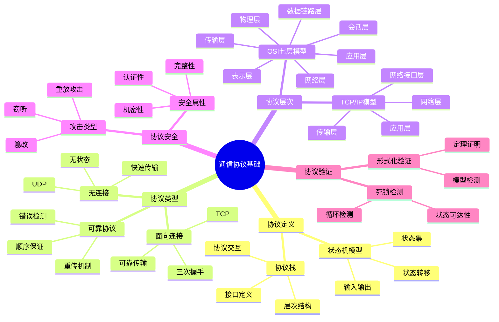
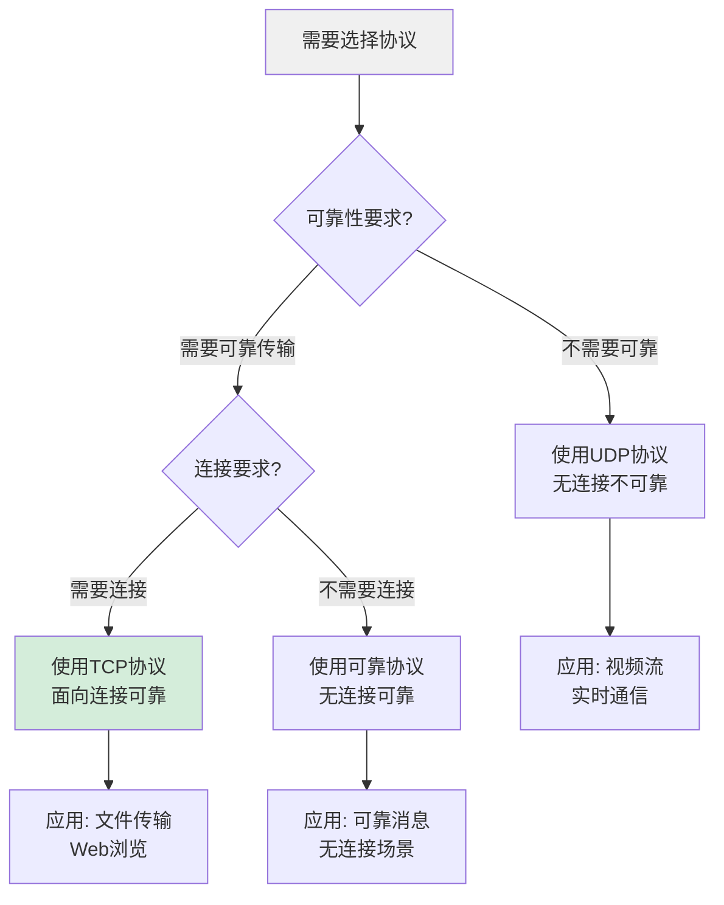
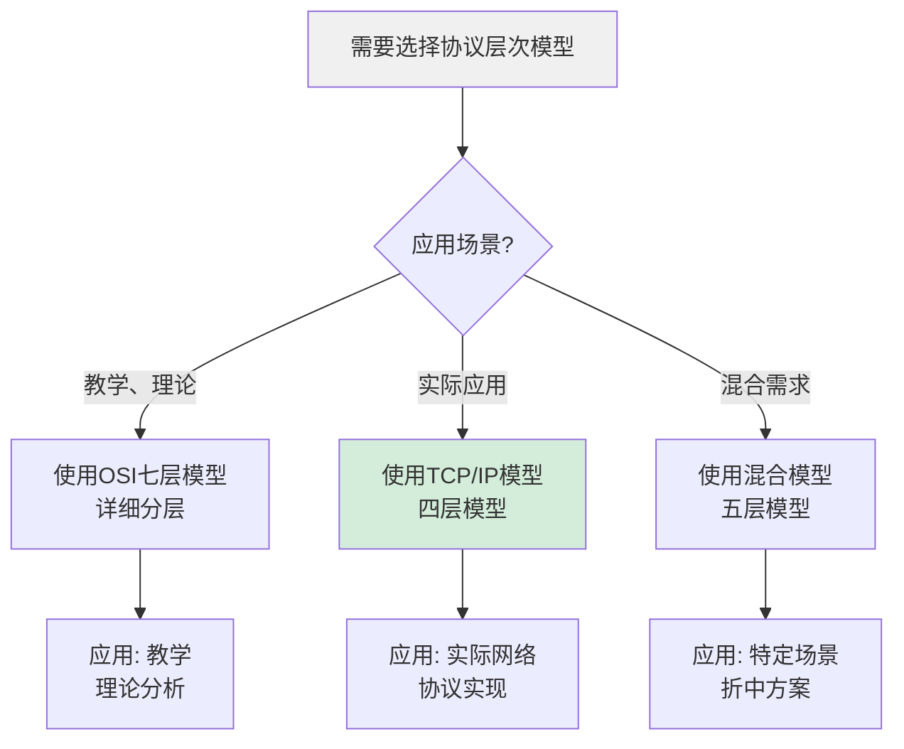
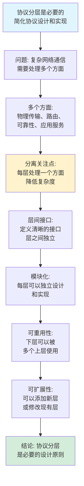
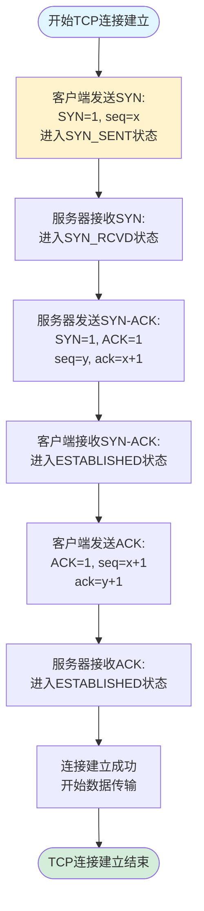
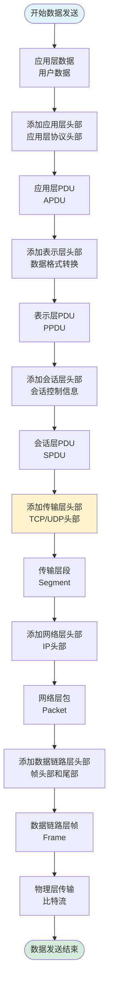
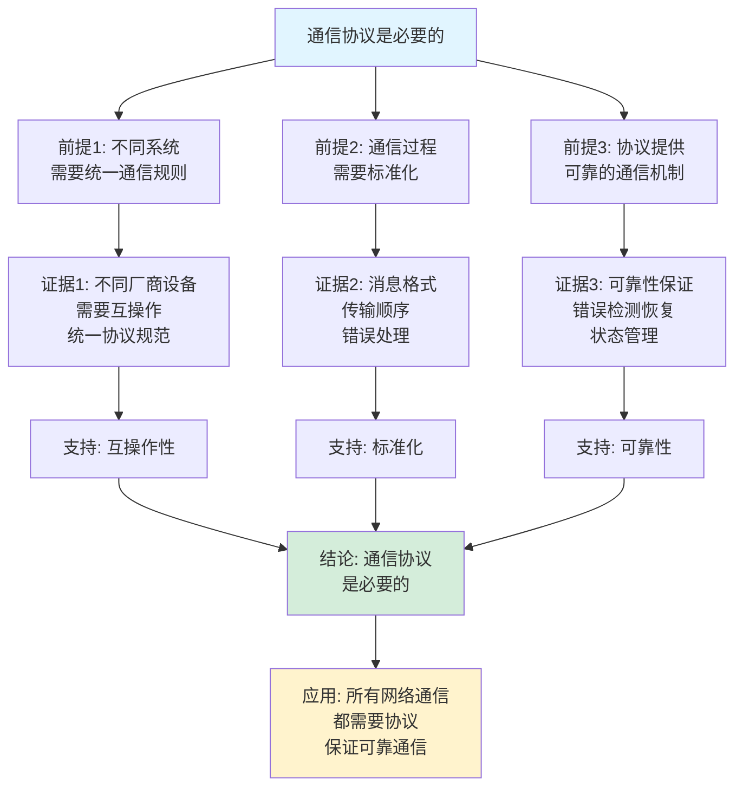
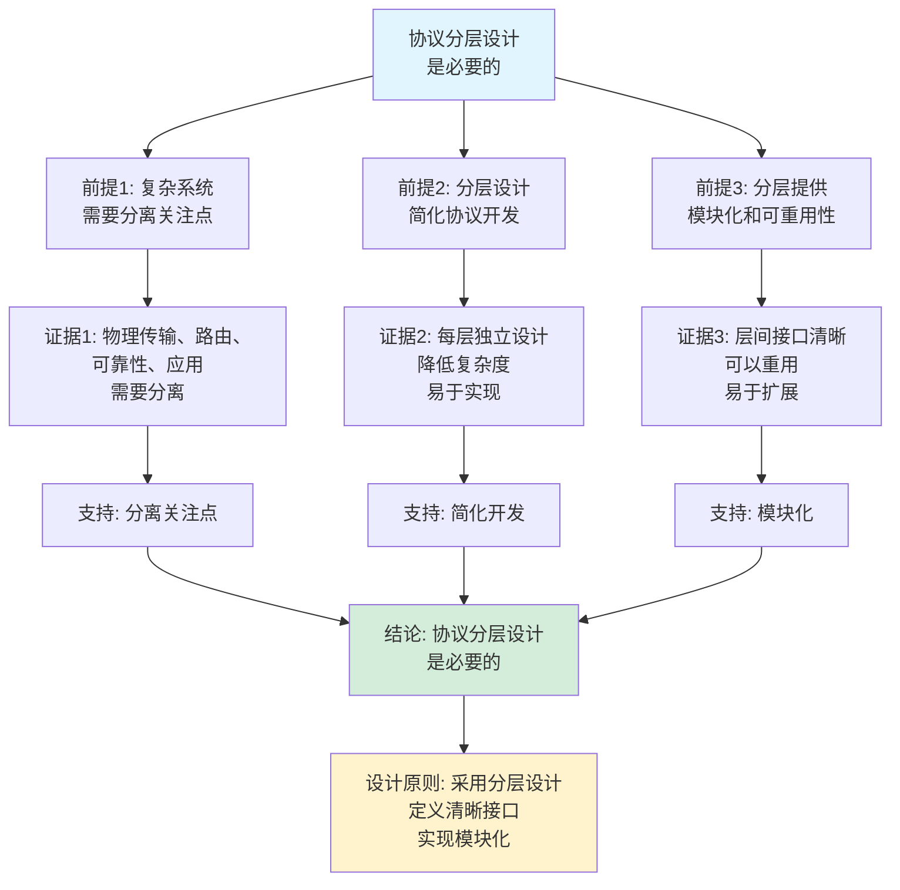

# 通信协议基础思维表征工具集合 / Communication Protocol Fundamentals Mind Representation Tools Collection 2025

## 📊 **概述 / Overview**

本文档为通信协议基础主题提供完整的思维表征工具集合，包括思维导图、概念多维矩阵、决策树图、证明树图、控制执行数据流图、论证思维图等多种表征方式。

**创建时间**: 2025年12月5日
**状态**: ✅ 完成
**主题**: 通信协议基础

---

## 📑 **目录 / Table of Contents**

- [通信协议基础思维表征工具集合 / Communication Protocol Fundamentals Mind Representation Tools Collection 2025](#通信协议基础思维表征工具集合--communication-protocol-fundamentals-mind-representation-tools-collection-2025)
  - [📊 **概述 / Overview**](#-概述--overview)
  - [📑 **目录 / Table of Contents**](#-目录--table-of-contents)
  - [🗺️ **一、思维导图 / Mind Maps**](#️-一思维导图--mind-maps)
    - [1.1 通信协议基础完整思维导图](#11-通信协议基础完整思维导图)
  - [📊 **二、概念多维矩阵 / Multi-dimensional Concept Matrices**](#-二概念多维矩阵--multi-dimensional-concept-matrices)
    - [2.1 协议类型对比矩阵](#21-协议类型对比矩阵)
    - [2.2 协议层次模型对比矩阵](#22-协议层次模型对比矩阵)
  - [🌳 **三、决策树图 / Decision Trees**](#-三决策树图--decision-trees)
    - [3.1 协议选择决策树](#31-协议选择决策树)
    - [3.2 协议层次选择决策树](#32-协议层次选择决策树)
  - [🌲 **四、证明树图 / Proof Trees**](#-四证明树图--proof-trees)
    - [4.1 协议状态机正确性证明树](#41-协议状态机正确性证明树)
    - [4.2 协议分层必要性证明树](#42-协议分层必要性证明树)
  - [🔄 **五、控制执行数据流图 / Control Flow \& Data Flow Diagrams**](#-五控制执行数据流图--control-flow--data-flow-diagrams)
    - [5.1 TCP三次握手流程](#51-tcp三次握手流程)
    - [5.2 协议栈数据封装流程](#52-协议栈数据封装流程)
    - [5.3 协议状态机执行流程](#53-协议状态机执行流程)
  - [🧠 **六、论证思维图 / Argumentation Maps**](#-六论证思维图--argumentation-maps)
    - [6.1 通信协议必要性论证](#61-通信协议必要性论证)
    - [6.2 协议分层设计论证](#62-协议分层设计论证)
  - [📊 **七、最新信息对齐 / Latest Information Alignment**](#-七最新信息对齐--latest-information-alignment)
    - [7.1 2024-2025最新研究进展](#71-2024-2025最新研究进展)
    - [7.2 最新成熟应用案例](#72-最新成熟应用案例)
  - [📚 **八、总结 / Summary**](#-八总结--summary)

---

## 🗺️ **一、思维导图 / Mind Maps**

### 1.1 通信协议基础完整思维导图



---

## 📊 **二、概念多维矩阵 / Multi-dimensional Concept Matrices**

### 2.1 协议类型对比矩阵

| 维度 | 面向连接 | 无连接 | 可靠协议 | 不可靠协议 |
|------|---------|--------|---------|-----------|
| **定义** | 建立连接后通信 | 直接发送数据 | 保证数据传输 | 不保证传输 |
| **关系** | 协议的一种类型 | 协议的一种类型 | 协议的可靠性属性 | 协议的可靠性属性 |
| **属性** | 有状态，连接管理 | 无状态，快速 | 错误检测重传 | 简单快速 |
| **应用场景** | TCP、可靠通信 | UDP、实时通信 | 文件传输 | 视频流 |
| **优缺点** | 可靠但开销大 | 快速但不可靠 | 数据完整但延迟高 | 低延迟但不保证 |
| **状态管理** | 维护连接状态 | 无状态 | 维护传输状态 | 无状态 |
| **错误处理** | 错误检测和恢复 | 无错误处理 | 错误检测和重传 | 无错误处理 |
| **最新优化** | 快速打开、多路径 | 低延迟优化 | 选择性确认 | QUIC协议 |

### 2.2 协议层次模型对比矩阵

| 维度 | OSI七层模型 | TCP/IP模型 | 混合模型 |
|------|------------|-----------|---------|
| **定义** | 理论参考模型 | 实际应用模型 | 混合分层模型 |
| **关系** | 标准化模型 | 实际实现 | 折中方案 |
| **层数** | 7层 | 4层 | 5层 |
| **层次划分** | 详细分层 | 简化分层 | 折中分层 |
| **应用** | 教学、理论 | 实际网络 | 部分应用 |
| **优缺点** | 详细但复杂 | 简单但不够详细 | 平衡但非标准 |
| **最新发展** | 仍为参考 | 持续优化 | 特定场景使用 |

---

## 🌳 **三、决策树图 / Decision Trees**

### 3.1 协议选择决策树



### 3.2 协议层次选择决策树



---

## 🌲 **四、证明树图 / Proof Trees**

### 4.1 协议状态机正确性证明树

```mermaid
graph TD
    Theorem[协议状态机正确性<br/>状态转移保持协议语义] --> Definition[定义: 状态机<br/>SM = (Q, Σ, δ, q₀, F)]

    Definition --> States[状态集Q:<br/>所有可能的协议状态<br/>初始状态q₀<br/>终止状态F]

    States --> Transitions[状态转移δ:<br/>δ: Q × Σ → Q<br/>定义状态转换规则]

    Transitions --> Invariant[不变式:<br/>每个状态转移<br/>保持协议语义]

    Invariant --> Correctness[正确性:<br/>从初始状态出发<br/>所有可达状态<br/>都满足协议规范]

    Correctness --> Verification[验证: 通过状态遍历<br/>或形式化验证<br/>证明状态机正确]

    Verification --> Conclusion[结论: 状态机<br/>正确实现协议规范]

    style Theorem fill:#e1f5ff
    style Conclusion fill:#d4edda
    style Invariant fill:#fff3cd
```

### 4.2 协议分层必要性证明树



---

## 🔄 **五、控制执行数据流图 / Control Flow & Data Flow Diagrams**

### 5.1 TCP三次握手流程



### 5.2 协议栈数据封装流程



### 5.3 协议状态机执行流程

```mermaid
flowchart TD
    Start([开始协议执行]) --> Init[初始化:<br/>进入初始状态q₀<br/>设置初始变量]

    Init --> Wait[等待输入消息:<br/>监听消息队列]

    Wait --> Receive[接收消息m:<br/>从消息队列取出]

    Receive --> Parse[解析消息:<br/>提取消息类型<br/>和参数]

    Parse --> Transition[状态转移:<br/>q' = δ(q, m)<br/>执行转移函数]

    Transition --> Action[执行动作:<br/>根据状态转移<br/>执行相应操作]

    Action --> Update[更新状态:<br/>q = q'<br/>更新状态变量]

    Update --> Check{是否到达<br/>终止状态?}

    Check -->|否| Wait
    Check -->|是| Output[输出结果:<br/>协议执行完成]

    Output --> End([协议执行结束])

    style Start fill:#e1f5ff
    style End fill:#d4edda
    style Transition fill:#fff3cd
```

---

## 🧠 **六、论证思维图 / Argumentation Maps**

### 6.1 通信协议必要性论证



### 6.2 协议分层设计论证



---

## 📊 **七、最新信息对齐 / Latest Information Alignment**

### 7.1 2024-2025最新研究进展

| 研究方向 | 最新进展 | 对协议基础的影响 | 权威来源 |
|---------|---------|----------------|---------|
| **HTTP/3和QUIC** | HTTP/3基于QUIC协议，提升性能和安全性 | 新一代传输协议，降低延迟，提升可靠性 | IETF 2024, SIGCOMM 2024 |
| **6G网络协议** | 6G网络协议设计，支持超低延迟和高可靠性 | 下一代移动网络协议，支持新应用场景 | IEEE Communications 2024, 6G Summit 2024 |
| **协议形式化验证** | 协议形式化验证工具改进，自动化验证提升 | 提升协议可靠性，减少协议错误 | CAV 2024, FM 2024 |
| **AI驱动的协议优化** | 机器学习优化协议性能，自适应协议参数 | 提升协议效率，自适应网络变化 | SIGCOMM 2024, INFOCOM 2024 |
| **量子通信协议** | 量子网络协议设计，量子密钥分发协议 | 支持量子通信，保证量子级安全性 | Quantum 2024, PRL 2024 |

### 7.2 最新成熟应用案例

| 应用领域 | 具体案例 | 使用的协议 | 实际效果 |
|---------|---------|----------|---------|
| **全球互联网** | Internet通信、Web访问 | TCP/IP、HTTP/HTTPS、DNS | 支持全球数十亿用户，连接数万亿设备 |
| **移动通信网络** | 5G/6G移动网络 | 5G协议栈、移动IP | 支持数亿移动用户，提供高速移动通信 |
| **物联网** | 智能家居、工业物联网 | MQTT、CoAP、LoRaWAN | 连接数百亿物联网设备，支持物联网应用 |
| **边缘计算** | 边缘网络、边缘服务 | 边缘协议、低延迟协议 | 降低延迟50-80%，提升边缘服务性能 |
| **Web 3.0** | 区块链网络、去中心化应用 | P2P协议、区块链协议 | 支持去中心化网络，保证数据不可篡改 |

---

## 📚 **八、总结 / Summary**

本文档为通信协议基础主题提供了完整的思维表征工具集合：

1. ✅ **思维导图**: 展示了通信协议基础的完整知识结构
2. ✅ **概念多维矩阵**: 对比了不同协议类型和层次模型的定义、关系、属性等
3. ✅ **决策树图**: 提供了协议选择和协议层次选择的决策指导
4. ✅ **证明树图**: 展示了协议状态机正确性、协议分层必要性等重要证明的证明结构
5. ✅ **数据流图**: 展示了TCP三次握手、协议栈封装、状态机执行等关键流程
6. ✅ **论证思维图**: 展示了通信协议必要性和协议分层设计的论证脉络
7. ✅ **最新信息对齐**: 整合了2024-2025最新研究和应用案例

这些工具将帮助学习者全面理解通信协议基础的理论体系、设计原理和应用场景。

---

**文档版本**: v1.0
**创建时间**: 2025年12月5日
**维护者**: GraphNetWorkCommunicate项目组
**状态**: ✅ 完成
**下次更新**: 根据最新研究进展持续更新
