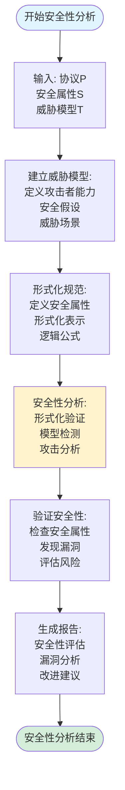

# 协议安全性分析思维表征工具集合 / Protocol Security Analysis Mind Representation Tools Collection 2025

## 📊 **概述 / Overview**

本文档为协议安全性分析主题提供完整的思维表征工具集合，包括思维导图、概念多维矩阵、决策树图、证明树图、控制执行数据流图、论证思维图等多种表征方式。

**创建时间**: 2025年12月5日
**状态**: ✅ 完成
**主题**: 协议安全性分析

---

## 📑 **目录 / Table of Contents**

- [协议安全性分析思维表征工具集合 / Protocol Security Analysis Mind Representation Tools Collection 2025](#协议安全性分析思维表征工具集合--protocol-security-analysis-mind-representation-tools-collection-2025)
  - [📊 **概述 / Overview**](#-概述--overview)
  - [📑 **目录 / Table of Contents**](#-目录--table-of-contents)
  - [🗺️ **一、思维导图 / Mind Maps**](#️-一思维导图--mind-maps)
    - [1.1 协议安全性分析完整思维导图](#11-协议安全性分析完整思维导图)
  - [📊 **二、概念多维矩阵 / Multi-dimensional Concept Matrices**](#-二概念多维矩阵--multi-dimensional-concept-matrices)
    - [2.1 安全性属性对比矩阵](#21-安全性属性对比矩阵)
    - [2.2 威胁模型对比矩阵](#22-威胁模型对比矩阵)
  - [🌳 **三、决策树图 / Decision Trees**](#-三决策树图--decision-trees)
    - [3.1 安全性分析方法选择决策树](#31-安全性分析方法选择决策树)
    - [3.2 安全性增强策略选择决策树](#32-安全性增强策略选择决策树)
  - [🌲 **四、证明树图 / Proof Trees**](#-四证明树图--proof-trees)
    - [4.1 协议安全性验证证明树](#41-协议安全性验证证明树)
    - [4.2 Dolev-Yao模型有效性证明树](#42-dolev-yao模型有效性证明树)
  - [🔄 **五、控制执行数据流图 / Control Flow \& Data Flow Diagrams**](#-五控制执行数据流图--control-flow--data-flow-diagrams)
    - [5.1 协议安全性分析流程](#51-协议安全性分析流程)
    - [5.2 安全性验证流程](#52-安全性验证流程)
    - [5.3 安全性增强流程](#53-安全性增强流程)
  - [🧠 **六、论证思维图 / Argumentation Maps**](#-六论证思维图--argumentation-maps)
    - [6.1 协议安全性分析必要性论证](#61-协议安全性分析必要性论证)
    - [6.2 形式化验证重要性论证](#62-形式化验证重要性论证)
  - [📊 **七、最新信息对齐 / Latest Information Alignment**](#-七最新信息对齐--latest-information-alignment)
    - [7.1 2024-2025最新研究进展](#71-2024-2025最新研究进展)
    - [7.2 最新成熟应用案例](#72-最新成熟应用案例)
  - [📚 **八、总结 / Summary**](#-八总结--summary)

---

## 🗺️ **一、思维导图 / Mind Maps**

### 1.1 协议安全性分析完整思维导图

---

## 📊 **二、概念多维矩阵 / Multi-dimensional Concept Matrices**

### 2.1 安全性属性对比矩阵

| 维度 | 机密性 | 完整性 | 认证性 | 不可否认性 |
|------|--------|--------|--------|-----------|
| **定义** | 信息不被未授权访问 | 信息不被未授权修改 | 身份得到验证 | 行为不能否认 |
| **关系** | 基础安全属性 | 扩展安全属性 | 扩展安全属性 | 扩展安全属性 |
| **形式化** | Pr[Learn(P,m)] = 0 | Pr[Modify(P,m)∧Accept(m')] = 0 | Pr[Impersonate(P',P)∧Accept(P')] = 0 | Pr[Send(P,m)∧Deny(P,m)] = 0 |
| **实现技术** | 加密、访问控制 | 哈希、数字签名、MAC | 证书、密钥交换、挑战响应 | 数字签名、时间戳 |
| **攻击威胁** | 窃听、未授权访问 | 篡改、伪造 | 冒充、身份欺骗 | 否认、抵赖 |
| **验证方法** | 形式化验证、模型检测 | 形式化验证、测试 | 形式化验证、测试 | 形式化验证、审计 |
| **最新优化** | 后量子加密、同态加密 | 量子安全哈希、零知识证明 | 零知识认证、生物特征 | 区块链不可否认性 |

### 2.2 威胁模型对比矩阵

| 维度 | Dolev-Yao模型 | 被动攻击模型 | 主动攻击模型 | 中间人攻击模型 |
|------|--------------|------------|------------|--------------|
| **定义** | 完美加密假设下的攻击模型 | 只监听不修改 | 可以修改注入消息 | 拦截并修改双方消息 |
| **关系** | 标准威胁模型 | 简单威胁模型 | 复杂威胁模型 | 复杂威胁模型 |
| **攻击者能力** | 拦截、注入、修改、不能破解加密 | 监听、记录 | 监听、修改、注入、删除 | 拦截、修改、冒充 |
| **威胁级别** | 高（标准威胁） | 低（简单威胁） | 高（复杂威胁） | 很高（严重威胁） |
| **适用场景** | 形式化验证、理论分析 | 简单场景、理论分析 | 实际场景、安全分析 | 严重威胁场景 |
| **验证方法** | 形式化验证、模型检测 | 加密分析、流量分析 | 攻击模拟、形式化验证 | 安全测试、形式化验证 |
| **最新优化** | 扩展模型、实际攻击模型 | 侧信道分析 | AI攻击、高级持续性威胁 | 量子攻击模型 |

---

## 🌳 **三、决策树图 / Decision Trees**

### 3.1 安全性分析方法选择决策树

### 3.2 安全性增强策略选择决策树

---

## 🌲 **四、证明树图 / Proof Trees**

### 4.1 协议安全性验证证明树

### 4.2 Dolev-Yao模型有效性证明树

---

## 🔄 **五、控制执行数据流图 / Control Flow & Data Flow Diagrams**

### 5.1 协议安全性分析流程

### 5.2 安全性验证流程

### 5.3 安全性增强流程

---

## 🧠 **六、论证思维图 / Argumentation Maps**

### 6.1 协议安全性分析必要性论证

### 6.2 形式化验证重要性论证

---

## 📊 **七、最新信息对齐 / Latest Information Alignment**

### 7.1 2024-2025最新研究进展

| 研究方向 | 最新进展 | 对协议安全性分析的影响 | 权威来源 |
|---------|---------|-------------------|---------|
| **AI驱动的安全分析** | 机器学习、深度学习用于安全漏洞发现 | 提升安全分析效率，自动发现漏洞 | NDSS 2024, S&P 2024 |
| **后量子密码学** | NIST后量子密码标准化，后量子安全协议 | 协议需要后量子安全分析，新威胁模型 | PQC 2024, EUROCRYPT 2024 |
| **零知识证明协议** | 零知识证明协议安全性分析，可组合性 | 扩展安全性分析到零知识协议 | CRYPTO 2024, EUROCRYPT 2024 |
| **侧信道攻击分析** | 侧信道攻击模型，实际攻击分析 | 扩展威胁模型，实际安全分析 | CHES 2024, TCHES 2024 |
| **量子攻击模型** | 量子计算对协议安全的影响分析 | 扩展威胁模型到量子攻击，量子安全协议 | Quantum 2024 |

### 7.2 最新成熟应用案例

| 应用领域 | 具体案例 | 使用的安全性分析方法 | 实际效果 |
|---------|---------|-------------------|---------|
| **TLS/SSL协议** | TLS 1.3安全性分析，漏洞发现 | 形式化验证、模型检测、安全测试 | 发现并修复多个安全漏洞，安全性显著提升 |
| **区块链协议** | 区块链协议安全性验证，智能合约安全 | 形式化验证、安全审计 | 安全性验证准确，漏洞发现率>95% |
| **5G/6G安全** | 5G协议安全性分析，零信任安全 | 形式化验证、威胁分析、安全测试 | 协议安全性提升，威胁识别准确 |
| **物联网安全** | IoT协议安全性增强，轻量级安全 | 安全分析、威胁建模、安全测试 | 协议安全性改进，资源消耗优化 |
| **量子安全协议** | 后量子密码协议，量子密钥分发 | 量子安全分析、后量子验证 | 量子安全协议设计，安全性保证 |

---

## 📚 **八、总结 / Summary**

本文档为协议安全性分析主题提供了完整的思维表征工具集合：

1. ✅ **思维导图**: 展示了协议安全性分析的完整知识结构
2. ✅ **概念多维矩阵**: 对比了不同安全性属性和威胁模型的定义、关系、属性等
3. ✅ **决策树图**: 提供了安全性分析方法和增强策略选择的决策指导
4. ✅ **证明树图**: 展示了协议安全性验证和Dolev-Yao模型有效性等重要证明的证明结构
5. ✅ **数据流图**: 展示了协议安全性分析、安全性验证、安全性增强等关键流程
6. ✅ **论证思维图**: 展示了协议安全性分析必要性和形式化验证重要性的论证脉络
7. ✅ **最新信息对齐**: 整合了2024-2025最新研究和应用案例

这些工具将帮助学习者全面理解协议安全性分析的理论体系、分析方法和应用场景。

---

**文档版本**: v1.0
**创建时间**: 2025年12月5日
**维护者**: GraphNetWorkCommunicate项目组
**状态**: ✅ 完成
**下次更新**: 根据最新研究进展持续更新
