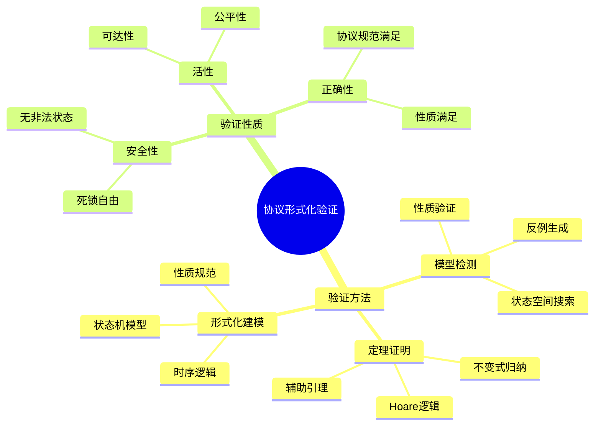
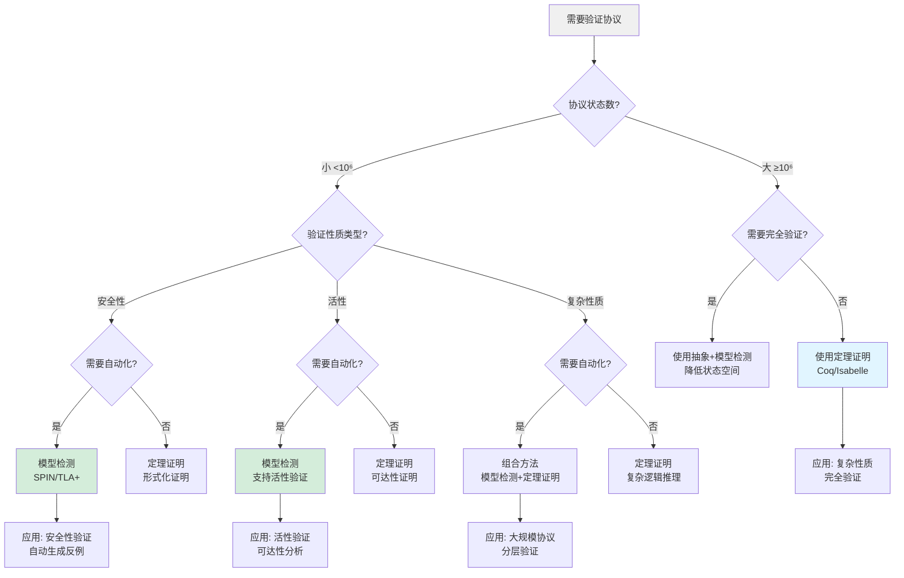
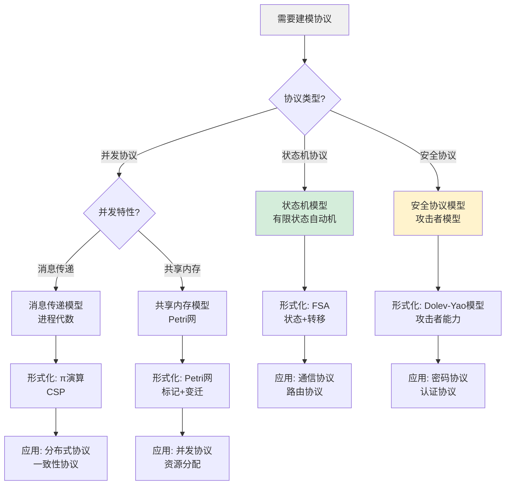
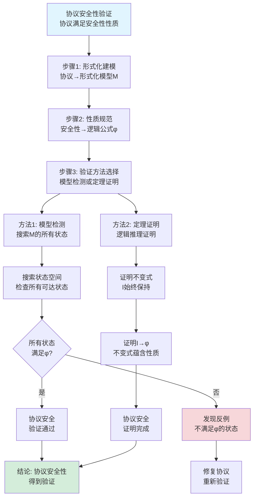
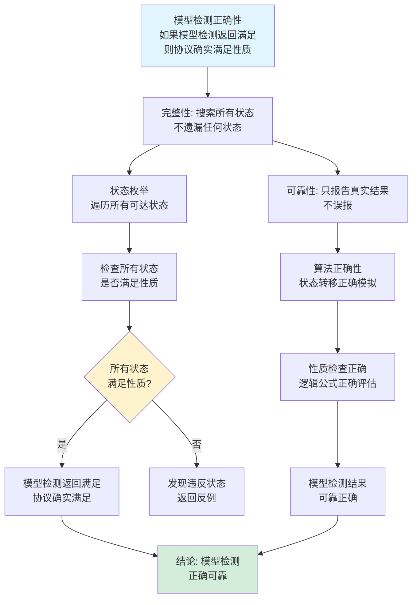
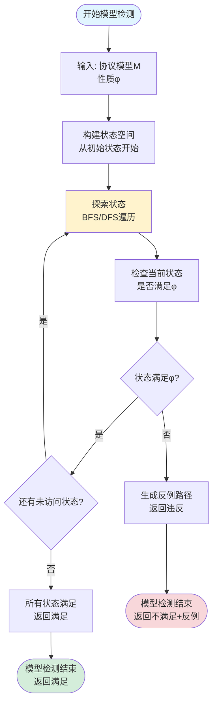
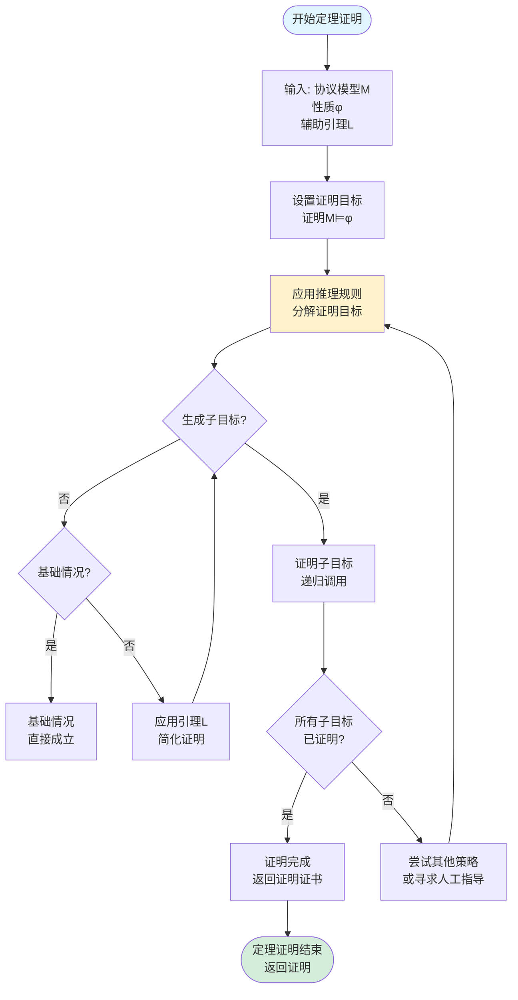
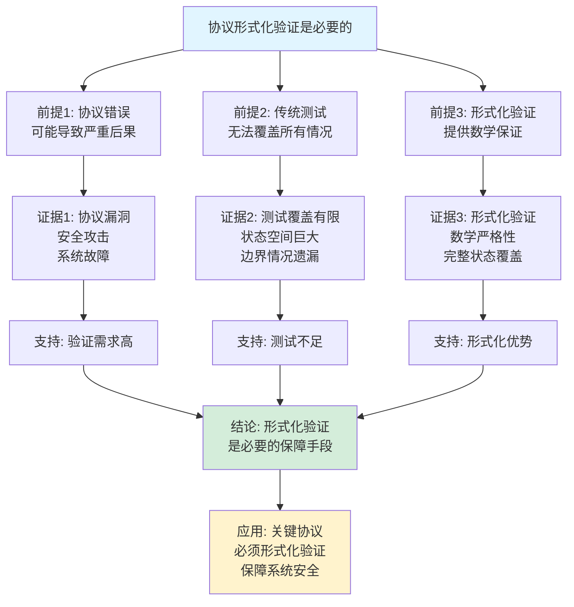
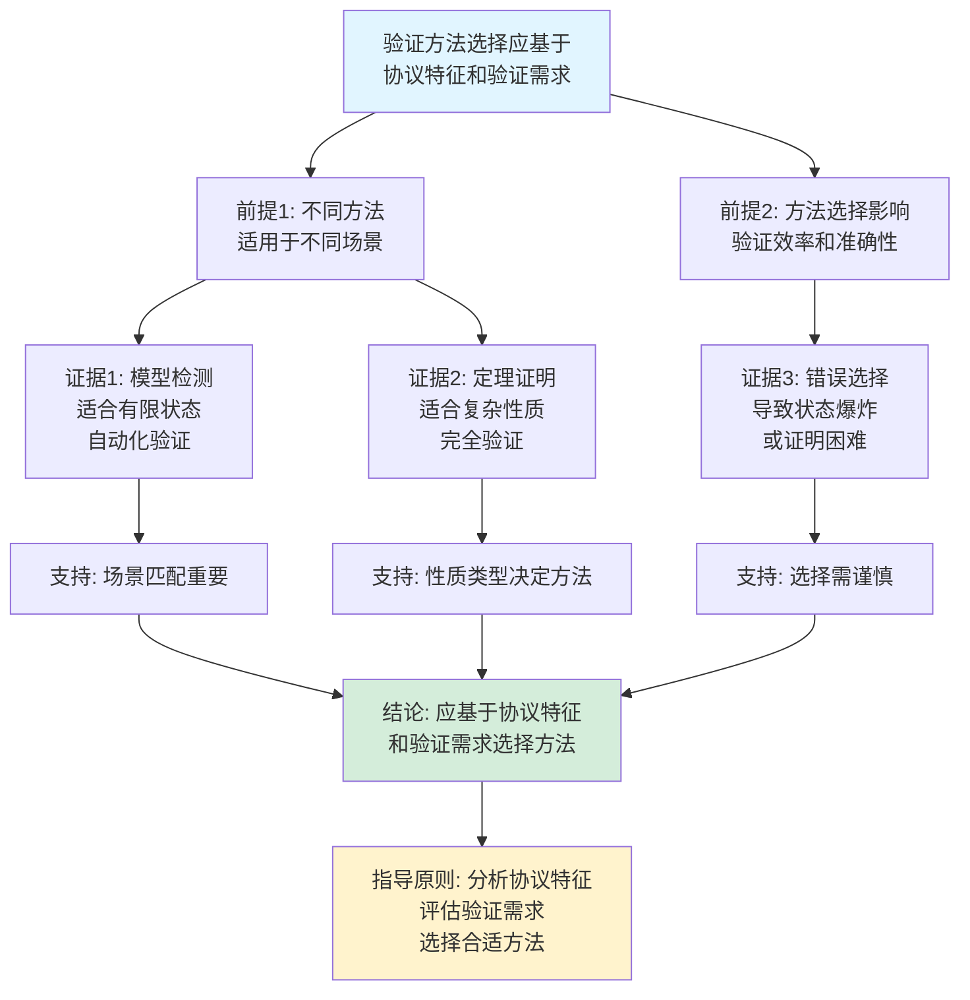

# 协议形式化验证思维表征工具集合 / Protocol Formal Verification Mind Representation Tools Collection 2025

## 📊 **概述 / Overview**

本文档为协议形式化验证主题提供完整的思维表征工具集合，包括思维导图、概念多维矩阵、决策树图、证明树图、控制执行数据流图、论证思维图等多种表征方式。

**创建时间**: 2025年12月5日
**状态**: ✅ 完成
**主题**: 协议形式化验证

---

## 📑 **目录 / Table of Contents**

- [协议形式化验证思维表征工具集合 / Protocol Formal Verification Mind Representation Tools Collection 2025](#协议形式化验证思维表征工具集合--protocol-formal-verification-mind-representation-tools-collection-2025)
  - [📊 **概述 / Overview**](#-概述--overview)
  - [📑 **目录 / Table of Contents**](#-目录--table-of-contents)
  - [🗺️ **一、思维导图 / Mind Maps**](#️-一思维导图--mind-maps)
    - [1.1 协议形式化验证完整思维导图](#11-协议形式化验证完整思维导图)
  - [📊 **二、概念多维矩阵 / Multi-dimensional Concept Matrices**](#-二概念多维矩阵--multi-dimensional-concept-matrices)
    - [2.1 验证方法对比矩阵](#21-验证方法对比矩阵)
    - [2.2 协议验证概念关系矩阵](#22-协议验证概念关系矩阵)
  - [🌳 **三、决策树图 / Decision Trees**](#-三决策树图--decision-trees)
    - [3.1 协议验证方法选择决策树](#31-协议验证方法选择决策树)
    - [3.2 协议建模方法选择决策树](#32-协议建模方法选择决策树)
  - [🌲 **四、证明树图 / Proof Trees**](#-四证明树图--proof-trees)
    - [4.1 协议安全性验证证明树](#41-协议安全性验证证明树)
    - [4.2 模型检测正确性证明树](#42-模型检测正确性证明树)
  - [🔄 **五、控制执行数据流图 / Control Flow \& Data Flow Diagrams**](#-五控制执行数据流图--control-flow--data-flow-diagrams)
    - [5.1 模型检测执行流程](#51-模型检测执行流程)
    - [5.2 定理证明执行流程](#52-定理证明执行流程)
  - [🧠 **六、论证思维图 / Argumentation Maps**](#-六论证思维图--argumentation-maps)
    - [6.1 协议形式化验证必要性论证](#61-协议形式化验证必要性论证)
    - [6.2 验证方法选择论证](#62-验证方法选择论证)
  - [📊 **七、最新信息对齐 / Latest Information Alignment**](#-七最新信息对齐--latest-information-alignment)
    - [7.1 2024-2025最新研究进展](#71-2024-2025最新研究进展)
    - [7.2 最新成熟应用案例](#72-最新成熟应用案例)
  - [📚 **八、总结 / Summary**](#-八总结--summary)

---

## 🗺️ **一、思维导图 / Mind Maps**

### 1.1 协议形式化验证完整思维导图

---

## 📊 **二、概念多维矩阵 / Multi-dimensional Concept Matrices**

### 2.1 验证方法对比矩阵

| 维度 | 模型检测 | 定理证明 | 静态分析 |
|------|---------|---------|---------|
| **定义** | 状态空间搜索验证性质 | 逻辑推理证明性质 | 代码分析验证性质 |
| **关系** | 自动化验证 | 交互式证明 | 程序分析 |
| **适用场景** | 有限状态系统 | 无限状态系统 | 程序代码 |
| **优缺点** | 自动化但状态爆炸 | 通用但需要人工 | 快速但可能漏检 |
| **时间复杂度** | O(状态数×性质复杂度) | 不可判定 | O(代码规模) |
| **空间复杂度** | O(状态数) | O(证明长度) | O(代码规模) |
| **最新优化** | 符号模型检测、抽象 | LLM辅助证明 | 静态分析工具链 |

### 2.2 协议验证概念关系矩阵

| 维度 | 形式化建模 | 模型检测 | 定理证明 | 性质规范 |
|------|-----------|---------|---------|---------|
| **定义** | 将协议抽象为数学模型 | 自动搜索状态空间验证性质 | 逻辑推理证明性质 | 用逻辑公式描述期望性质 |
| **关系** | 验证的基础 | 建模的自动化验证 | 建模的交互式验证 | 验证的目标 |
| **输入** | 协议描述 | 形式化模型+性质 | 形式化模型+性质+辅助引理 | 自然语言描述 |
| **输出** | 形式化模型 | 验证结果+反例 | 证明证书 | 逻辑公式 |
| **自动化程度** | 部分自动化 | 完全自动化 | 半自动化 | 人工定义 |
| **适用场景** | 所有协议 | 有限状态协议 | 复杂性质协议 | 所有协议 |

---

## 🌳 **三、决策树图 / Decision Trees**

### 3.1 协议验证方法选择决策树

### 3.2 协议建模方法选择决策树

---

## 🌲 **四、证明树图 / Proof Trees**

### 4.1 协议安全性验证证明树

### 4.2 模型检测正确性证明树

---

## 🔄 **五、控制执行数据流图 / Control Flow & Data Flow Diagrams**

### 5.1 模型检测执行流程

### 5.2 定理证明执行流程

---

## 🧠 **六、论证思维图 / Argumentation Maps**

### 6.1 协议形式化验证必要性论证

### 6.2 验证方法选择论证

---

## 📊 **七、最新信息对齐 / Latest Information Alignment**

### 7.1 2024-2025最新研究进展

| 研究方向 | 最新进展 | 对协议验证的影响 | 权威来源 |
|---------|---------|----------------|---------|
| **LLM辅助证明** | 使用大语言模型生成证明策略、辅助定理证明 | 提升定理证明效率，降低人工负担 | CAV 2024, FM 2024 |
| **符号模型检测优化** | 改进符号状态空间表示，提升大规模协议验证能力 | 支持更大规模协议的形式化验证 | TACAS 2024, CAV 2024 |
| **概率协议验证** | 概率模型检测用于随机协议和网络安全协议 | 支持概率性质验证，适应不确定环境 | QEST 2024 |
| **组合验证方法** | 结合模型检测和定理证明，分层验证复杂协议 | 提升验证效率和准确性，支持大规模协议 | FM 2024, CAV 2024 |
| **实时协议验证** | 实时模型检测和时序逻辑扩展 | 支持实时性质验证，适应实时系统需求 | RTSS 2024 |

### 7.2 最新成熟应用案例

| 应用领域 | 具体案例 | 使用的验证方法 | 实际效果 |
|---------|---------|--------------|---------|
| **区块链协议** | 以太坊2.0共识协议、智能合约验证 | 形式化建模+模型检测+定理证明 | 发现并修复多个关键漏洞，提升安全性 |
| **网络安全协议** | TLS 1.3、QUIC协议验证 | 模型检测+安全性质验证 | 验证协议安全性，保障通信安全 |
| **分布式系统** | Raft共识算法、Paxos协议验证 | 形式化建模+定理证明 | 证明协议正确性，确保系统一致性 |
| **物联网协议** | MQTT、CoAP协议验证 | 模型检测+资源约束验证 | 验证协议在资源受限环境下的正确性 |
| **5G/6G协议** | 网络切片协议、移动性管理协议 | 实时模型检测+性能验证 | 验证协议实时性和性能要求 |

---

## 📚 **八、总结 / Summary**

本文档为协议形式化验证主题提供了完整的思维表征工具集合：

1. ✅ **思维导图**: 展示了协议形式化验证的完整知识结构
2. ✅ **概念多维矩阵**: 对比了不同验证方法的定义、关系、复杂度等，以及协议验证核心概念的关系
3. ✅ **决策树图**: 提供了验证方法选择和协议建模方法选择的决策指导
4. ✅ **证明树图**: 展示了协议安全性验证、模型检测正确性等重要证明的证明结构
5. ✅ **数据流图**: 展示了模型检测、定理证明等方法的执行流程
6. ✅ **论证思维图**: 展示了协议形式化验证必要性和验证方法选择的论证脉络
7. ✅ **最新信息对齐**: 整合了2024-2025最新研究和应用案例

这些工具将帮助学习者全面理解协议形式化验证的理论体系、方法选择和应用场景。

---

**文档版本**: v1.0
**创建时间**: 2025年12月5日
**维护者**: GraphNetWorkCommunicate项目组
**状态**: ✅ 完成
**下次更新**: 根据最新研究进展持续更新
