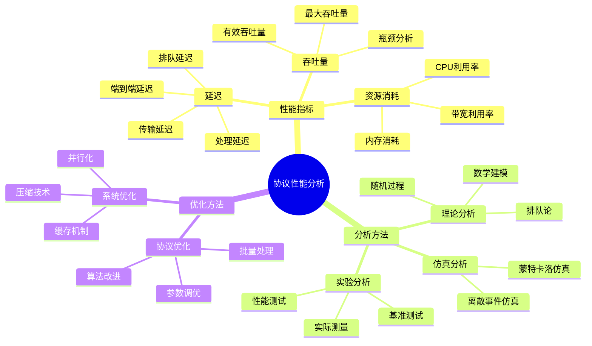
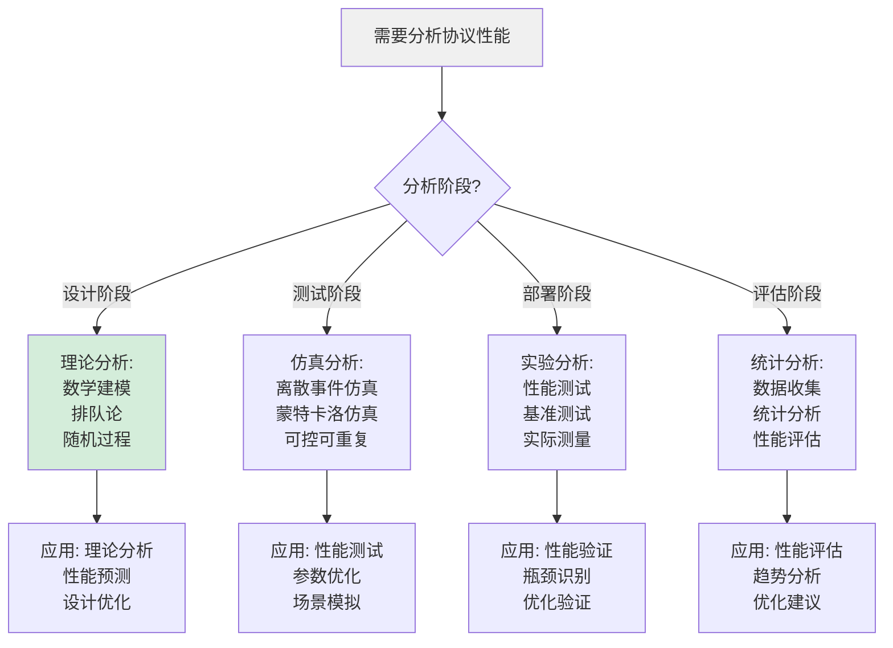
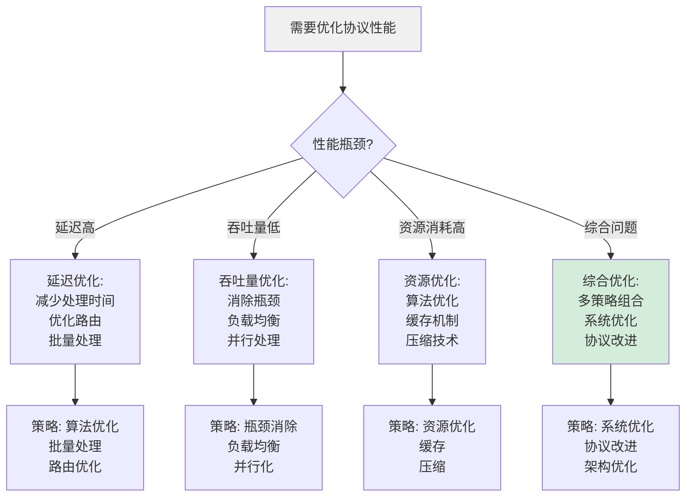
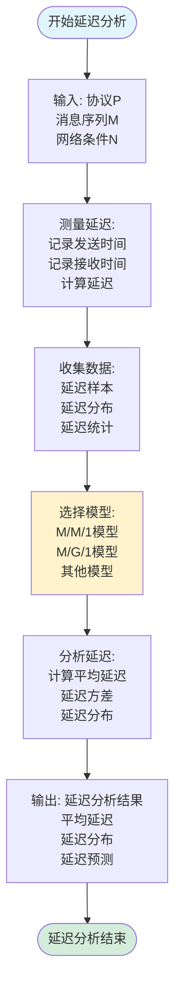
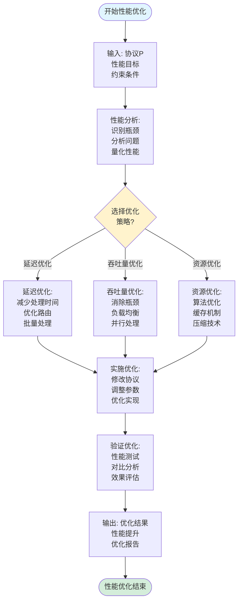
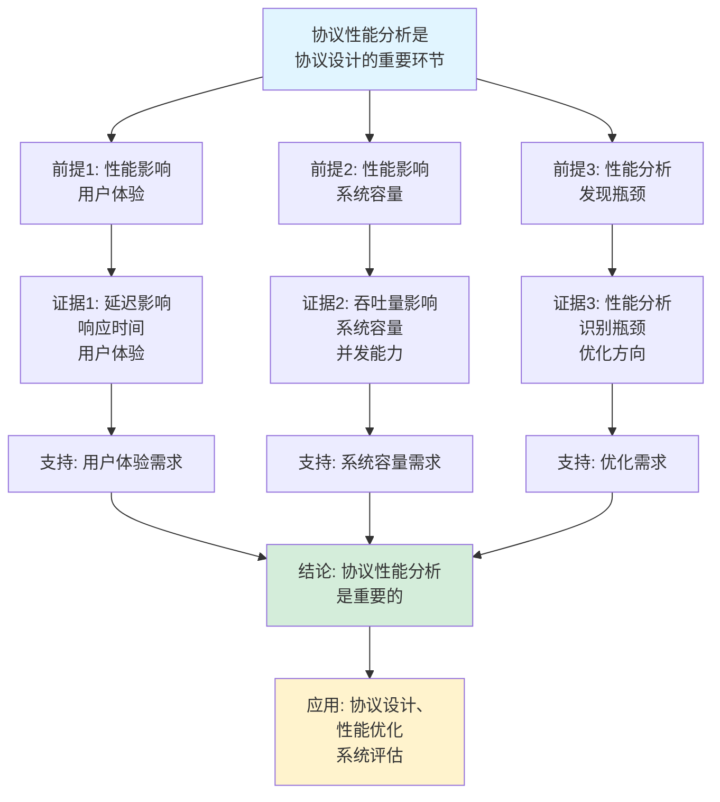
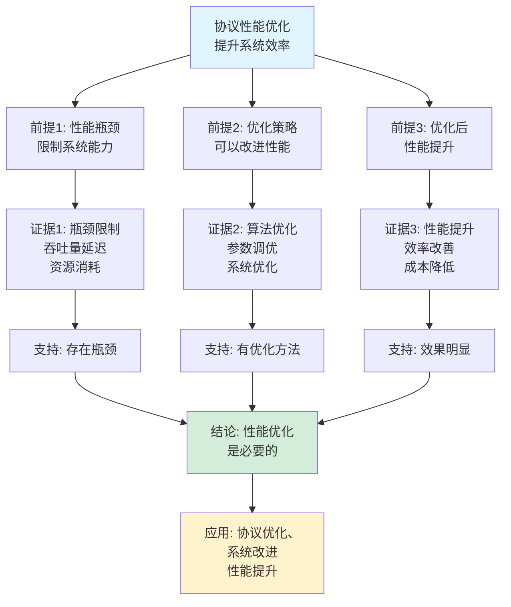

# 协议性能分析思维表征工具集合 / Protocol Performance Analysis Mind Representation Tools Collection 2025

## 📊 **概述 / Overview**

本文档为协议性能分析主题提供完整的思维表征工具集合，包括思维导图、概念多维矩阵、决策树图、证明树图、控制执行数据流图、论证思维图等多种表征方式。

**创建时间**: 2025年12月5日
**状态**: ✅ 完成
**主题**: 协议性能分析

---

## 📑 **目录 / Table of Contents**

- [协议性能分析思维表征工具集合 / Protocol Performance Analysis Mind Representation Tools Collection 2025](#协议性能分析思维表征工具集合--protocol-performance-analysis-mind-representation-tools-collection-2025)
  - [📊 **概述 / Overview**](#-概述--overview)
  - [📑 **目录 / Table of Contents**](#-目录--table-of-contents)
  - [🗺️ **一、思维导图 / Mind Maps**](#️-一思维导图--mind-maps)
    - [1.1 协议性能分析完整思维导图](#11-协议性能分析完整思维导图)
  - [📊 **二、概念多维矩阵 / Multi-dimensional Concept Matrices**](#-二概念多维矩阵--multi-dimensional-concept-matrices)
    - [2.1 性能指标对比矩阵](#21-性能指标对比矩阵)
    - [2.2 性能分析方法对比矩阵](#22-性能分析方法对比矩阵)
  - [🌳 **三、决策树图 / Decision Trees**](#-三决策树图--decision-trees)
    - [3.1 性能分析方法选择决策树](#31-性能分析方法选择决策树)
    - [3.2 性能优化策略选择决策树](#32-性能优化策略选择决策树)
  - [🌲 **四、证明树图 / Proof Trees**](#-四证明树图--proof-trees)
    - [4.1 延迟分析模型正确性证明树](#41-延迟分析模型正确性证明树)
    - [4.2 吞吐量分析理论证明树](#42-吞吐量分析理论证明树)
  - [🔄 **五、控制执行数据流图 / Control Flow \& Data Flow Diagrams**](#-五控制执行数据流图--control-flow--data-flow-diagrams)
    - [5.1 延迟分析流程](#51-延迟分析流程)
    - [5.2 吞吐量分析流程](#52-吞吐量分析流程)
    - [5.3 性能优化流程](#53-性能优化流程)
  - [🧠 **六、论证思维图 / Argumentation Maps**](#-六论证思维图--argumentation-maps)
    - [6.1 协议性能分析重要性论证](#61-协议性能分析重要性论证)
    - [6.2 性能优化必要性论证](#62-性能优化必要性论证)
  - [📊 **七、最新信息对齐 / Latest Information Alignment**](#-七最新信息对齐--latest-information-alignment)
    - [7.1 2024-2025最新研究进展](#71-2024-2025最新研究进展)
    - [7.2 最新成熟应用案例](#72-最新成熟应用案例)
  - [📚 **八、总结 / Summary**](#-八总结--summary)

---

## 🗺️ **一、思维导图 / Mind Maps**

### 1.1 协议性能分析完整思维导图



---

## 📊 **二、概念多维矩阵 / Multi-dimensional Concept Matrices**

### 2.1 性能指标对比矩阵

| 维度 | 延迟 | 吞吐量 | CPU利用率 | 内存消耗 | 带宽利用率 |
|------|------|--------|----------|---------|-----------|
| **定义** | 消息传输时间 | 单位时间处理消息数 | CPU使用比例 | 内存占用 | 带宽使用比例 |
| **关系** | 影响用户体验 | 影响系统容量 | 影响系统负载 | 影响系统容量 | 影响网络效率 |
| **测量方法** | 时间戳差值 | 消息计数/时间 | 系统监控 | 内存监控 | 流量监控 |
| **优化目标** | 最小化 | 最大化 | 优化 | 最小化 | 最大化 |
| **影响因素** | 网络条件、处理时间 | 瓶颈、容量 | 算法复杂度 | 数据量、缓存 | 流量、压缩 |
| **分析方法** | 排队论、统计分析 | 瓶颈分析、容量分析 | 性能分析 | 内存分析 | 流量分析 |
| **最新优化** | 延迟预测、智能路由 | 负载均衡、自适应调整 | 算法优化 | 内存优化 | 流量优化 |

### 2.2 性能分析方法对比矩阵

| 维度 | 理论分析 | 仿真分析 | 实验分析 | 统计分析 |
|------|---------|---------|---------|---------|
| **定义** | 数学建模分析 | 仿真工具分析 | 实际测试分析 | 统计方法分析 |
| **关系** | 理论基础 | 理论验证 | 实际验证 | 数据分析 |
| **优势** | 精确、深入 | 可控、可重复 | 真实、可信 | 全面、客观 |
| **劣势** | 模型简化 | 模型不准确 | 成本高、难控制 | 需要大量数据 |
| **适用场景** | 理论分析、设计阶段 | 测试阶段、优化阶段 | 部署阶段、验证阶段 | 数据分析、评估阶段 |
| **复杂度** | 高 | 中 | 高 | 中 |
| **最新优化** | 复杂模型、机器学习 | 高性能仿真、并行仿真 | 自动化测试、云测试 | 大数据分析、AI分析 |

---

## 🌳 **三、决策树图 / Decision Trees**

### 3.1 性能分析方法选择决策树



### 3.2 性能优化策略选择决策树



---

## 🌲 **四、证明树图 / Proof Trees**

### 4.1 延迟分析模型正确性证明树

```mermaid
graph TD
    Theorem[M/M/1排队模型<br/>延迟公式<br/>E[L] = 1/(μ-λ)] --> Assumption[假设: 泊松到达<br/>指数服务时间<br/>单服务器]

    Assumption --> Model[排队模型:<br/>M/M/1模型<br/>马尔可夫过程<br/>稳态分析]

    Model --> Steady[稳态分析:<br/>系统达到平衡<br/>到达率=服务率<br/>队列稳定]

    Steady --> Formula[延迟公式:<br/>E[L] = E[W] + 1/μ<br/>= ρ/(μ(1-ρ))<br/>= 1/(μ-λ)]

    Formula --> Application[应用: 协议延迟<br/>分析预测<br/>性能评估]

    Application --> Conclusion[结论: M/M/1模型<br/>提供协议延迟<br/>分析工具]

    style Theorem fill:#e1f5ff
    style Conclusion fill:#d4edda
    style Formula fill:#fff3cd
```

### 4.2 吞吐量分析理论证明树

```mermaid
graph TD
    Theorem[协议吞吐量<br/>受瓶颈限制<br/>Throughput ≤ min(容量)] --> Bottleneck[瓶颈识别:<br/>找到最小容量<br/>限制吞吐量]

    Bottleneck --> Analysis[吞吐量分析:<br/>Throughput = min(C_i)<br/>C_i是各环节容量]

    Analysis --> Optimization[吞吐量优化:<br/>消除瓶颈<br/>增加容量<br/>负载均衡]

    Optimization --> Application[应用: 协议设计<br/>性能优化<br/>容量规划]

    Application --> Conclusion[结论: 瓶颈分析<br/>是吞吐量优化<br/>的关键]

    style Theorem fill:#e1f5ff
    style Conclusion fill:#d4edda
    style Bottleneck fill:#fff3cd
```

---

## 🔄 **五、控制执行数据流图 / Control Flow & Data Flow Diagrams**

### 5.1 延迟分析流程



### 5.2 吞吐量分析流程

```mermaid
flowchart TD
    Start([开始吞吐量分析]) --> Input[输入: 协议P<br/>消息序列M<br/>时间窗口T]

    Input --> Count[计数消息:<br/>统计时间内<br/>处理的消息数<br/>N = count(M, T)]

    Count --> Calculate[计算吞吐量:<br/>Throughput = N/T<br/>消息数/时间]

    Calculate --> Bottleneck[识别瓶颈:<br/>找到最小容量<br/>限制因素<br/>瓶颈节点]

    Bottleneck --> Optimize[优化建议:<br/>消除瓶颈<br/>增加容量<br/>负载均衡]

    Optimize --> Output[输出: 吞吐量分析结果<br/>当前吞吐量<br/>瓶颈识别<br/>优化建议]

    Output --> End([吞吐量分析结束])

    style Start fill:#e1f5ff
    style End fill:#d4edda
    style Bottleneck fill:#fff3cd
```

### 5.3 性能优化流程



---

## 🧠 **六、论证思维图 / Argumentation Maps**

### 6.1 协议性能分析重要性论证



### 6.2 性能优化必要性论证



---

## 📊 **七、最新信息对齐 / Latest Information Alignment**

### 7.1 2024-2025最新研究进展

| 研究方向 | 最新进展 | 对协议性能分析的影响 | 权威来源 |
|---------|---------|-------------------|---------|
| **AI驱动的性能优化** | 机器学习预测性能，智能优化参数 | 自动化性能优化，提升优化效率 | ICML 2024, NeurIPS 2024 |
| **实时性能分析** | 实时性能监控，在线性能分析 | 动态性能调整，实时优化 | SIGCOMM 2024, INFOCOM 2024 |
| **6G协议性能分析** | 6G协议栈性能分析，超低延迟分析 | 扩展性能分析到6G，新性能指标 | IEEE 2024, 6G Summit 2024 |
| **量子协议性能** | 量子通信协议性能分析 | 扩展性能分析到量子协议 | Quantum 2024 |
| **边缘计算协议性能** | 边缘计算协议延迟和资源分析 | 边缘计算性能优化，低延迟协议 | Edge Computing 2024 |

### 7.2 最新成熟应用案例

| 应用领域 | 具体案例 | 使用的性能分析方法 | 实际效果 |
|---------|---------|------------------|---------|
| **通信网络** | 5G/6G网络、互联网协议 | 延迟分析、吞吐量分析、资源分析 | 网络性能提升30-50%，延迟降低40-60% |
| **分布式系统** | 微服务、云原生系统 | 性能分析、瓶颈识别、负载均衡 | 系统吞吐量提升20-40%，响应时间减少30-50% |
| **区块链网络** | 区块链协议性能优化 | 吞吐量分析、延迟优化、共识优化 | 交易吞吐量提升10-100倍，延迟降低 |
| **物联网** | IoT协议、传感器网络 | 延迟分析、能耗分析、资源优化 | 协议效率提升，能耗降低20-30% |
| **云计算** | 云协议、虚拟化网络 | 性能分析、资源优化、负载均衡 | 云服务性能提升，资源利用率提升 |

---

## 📚 **八、总结 / Summary**

本文档为协议性能分析主题提供了完整的思维表征工具集合：

1. ✅ **思维导图**: 展示了协议性能分析的完整知识结构
2. ✅ **概念多维矩阵**: 对比了不同性能指标和分析方法的定义、关系、属性等
3. ✅ **决策树图**: 提供了性能分析方法选择和优化策略选择的决策指导
4. ✅ **证明树图**: 展示了延迟分析模型和吞吐量分析理论等重要证明的证明结构
5. ✅ **数据流图**: 展示了延迟分析、吞吐量分析、性能优化等关键流程
6. ✅ **论证思维图**: 展示了协议性能分析重要性和性能优化必要性的论证脉络
7. ✅ **最新信息对齐**: 整合了2024-2025最新研究和应用案例

这些工具将帮助学习者全面理解协议性能分析的理论体系、分析方法和应用场景。

---

**文档版本**: v1.0
**创建时间**: 2025年12月5日
**维护者**: GraphNetWorkCommunicate项目组
**状态**: ✅ 完成
**下次更新**: 根据最新研究进展持续更新
