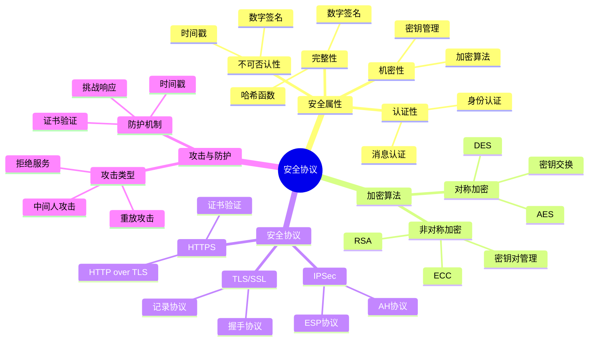
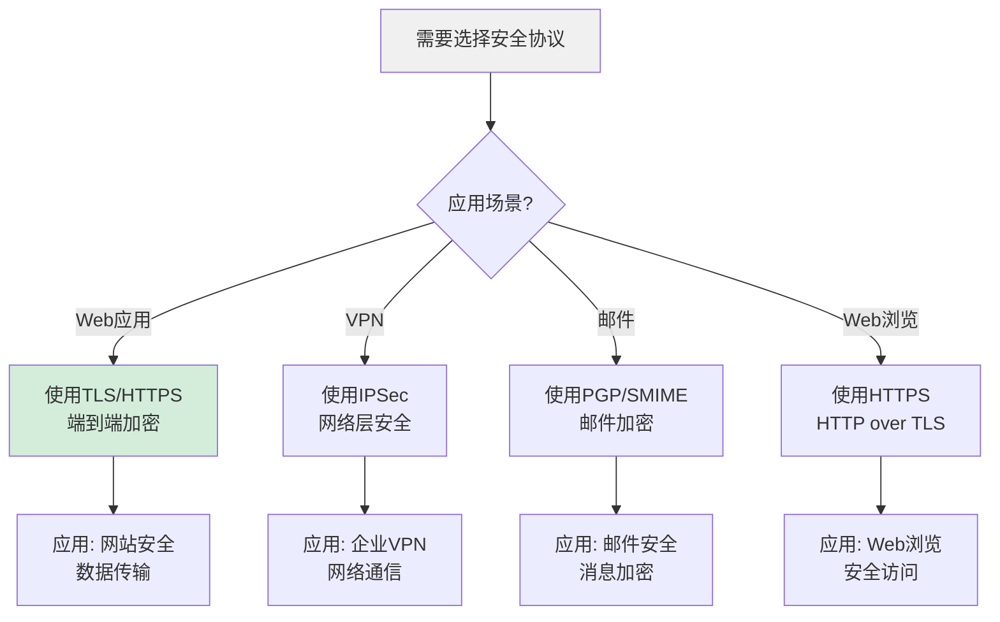
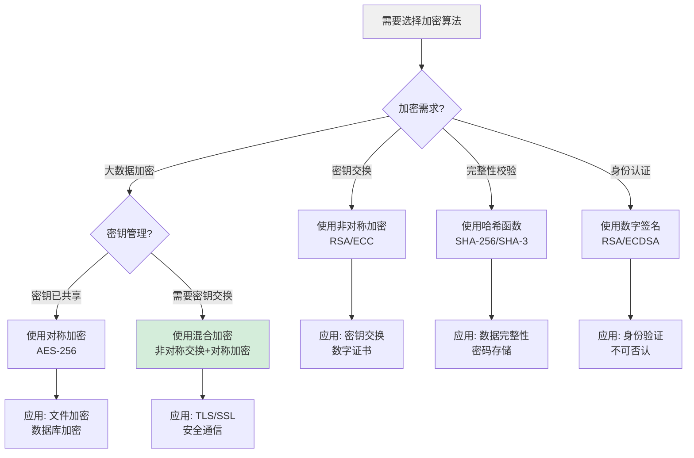
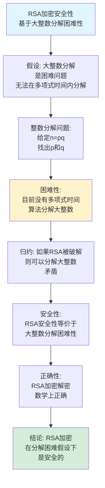
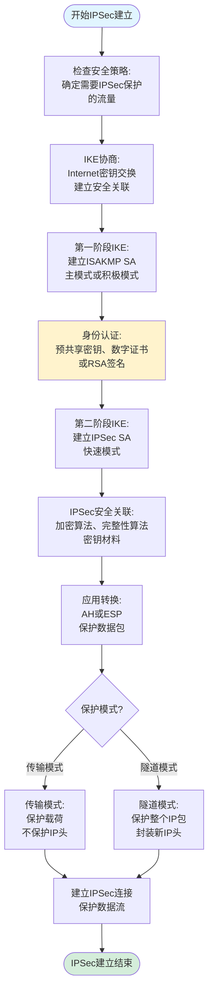
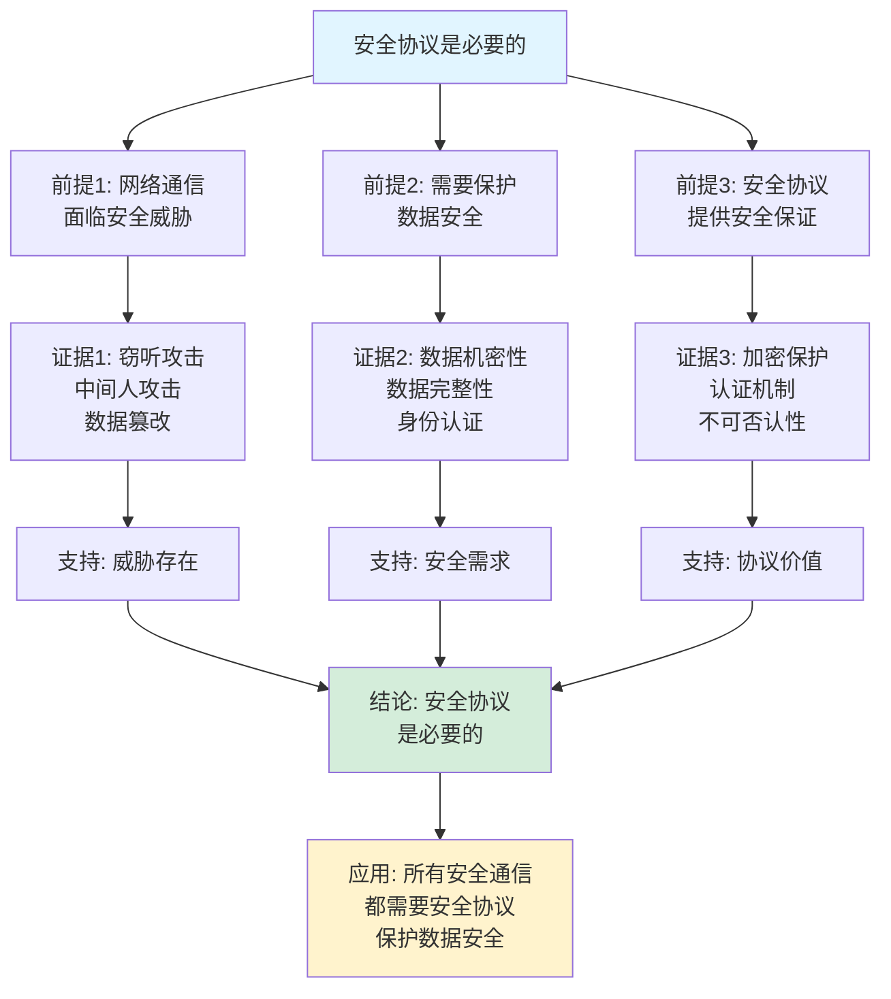
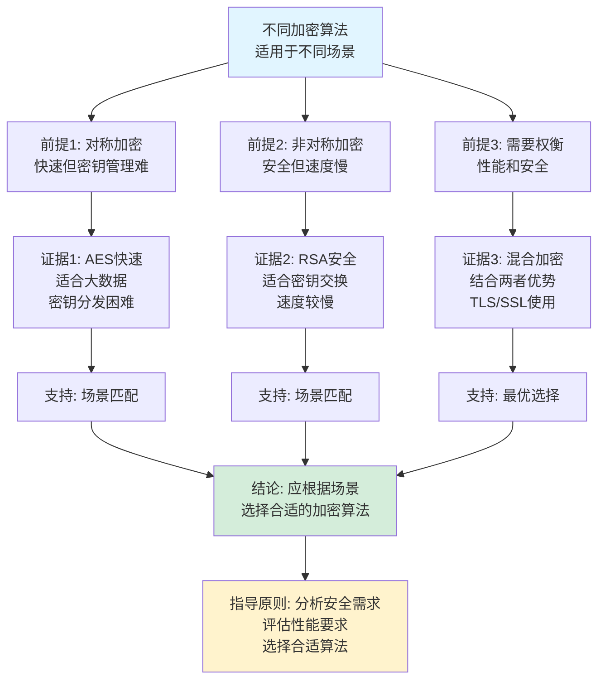

# 安全协议思维表征工具集合 / Security Protocols Mind Representation Tools Collection 2025

## 📊 **概述 / Overview**

本文档为安全协议主题提供完整的思维表征工具集合，包括思维导图、概念多维矩阵、决策树图、证明树图、控制执行数据流图、论证思维图等多种表征方式。

**创建时间**: 2025年12月5日
**状态**: ✅ 完成
**主题**: 安全协议

---

## 📑 **目录 / Table of Contents**

- [安全协议思维表征工具集合 / Security Protocols Mind Representation Tools Collection 2025](#安全协议思维表征工具集合--security-protocols-mind-representation-tools-collection-2025)
  - [📊 **概述 / Overview**](#-概述--overview)
  - [📑 **目录 / Table of Contents**](#-目录--table-of-contents)
  - [🗺️ **一、思维导图 / Mind Maps**](#️-一思维导图--mind-maps)
    - [1.1 安全协议完整思维导图](#11-安全协议完整思维导图)
  - [📊 **二、概念多维矩阵 / Multi-dimensional Concept Matrices**](#-二概念多维矩阵--multi-dimensional-concept-matrices)
    - [2.1 加密算法对比矩阵](#21-加密算法对比矩阵)
    - [2.2 安全协议对比矩阵](#22-安全协议对比矩阵)
  - [🌳 **三、决策树图 / Decision Trees**](#-三决策树图--decision-trees)
    - [3.1 安全协议选择决策树](#31-安全协议选择决策树)
    - [3.2 加密算法选择决策树](#32-加密算法选择决策树)
  - [🌲 **四、证明树图 / Proof Trees**](#-四证明树图--proof-trees)
    - [4.1 RSA加密安全性证明树](#41-rsa加密安全性证明树)
    - [4.2 数字签名不可伪造性证明树](#42-数字签名不可伪造性证明树)
  - [🔄 **五、控制执行数据流图 / Control Flow \& Data Flow Diagrams**](#-五控制执行数据流图--control-flow--data-flow-diagrams)
    - [5.1 TLS握手流程](#51-tls握手流程)
    - [5.2 IPSec建立流程](#52-ipsec建立流程)
    - [5.3 数字签名验证流程](#53-数字签名验证流程)
  - [🧠 **六、论证思维图 / Argumentation Maps**](#-六论证思维图--argumentation-maps)
    - [6.1 安全协议必要性论证](#61-安全协议必要性论证)
    - [6.2 不同加密算法选择论证](#62-不同加密算法选择论证)
  - [📊 **七、最新信息对齐 / Latest Information Alignment**](#-七最新信息对齐--latest-information-alignment)
    - [7.1 2024-2025最新研究进展](#71-2024-2025最新研究进展)
    - [7.2 最新成熟应用案例](#72-最新成熟应用案例)
  - [📚 **八、总结 / Summary**](#-八总结--summary)

---

## 🗺️ **一、思维导图 / Mind Maps**

### 1.1 安全协议完整思维导图



---

## 📊 **二、概念多维矩阵 / Multi-dimensional Concept Matrices**

### 2.1 加密算法对比矩阵

| 维度 | 对称加密 | 非对称加密 | 哈希函数 | 数字签名 |
|------|---------|-----------|---------|---------|
| **定义** | 加密解密使用相同密钥 | 加密解密使用不同密钥 | 单向函数，生成固定长度摘要 | 使用私钥签名，公钥验证 |
| **关系** | 加密的一种类型 | 加密的一种类型 | 完整性和认证的基础 | 基于非对称加密 |
| **属性** | 速度快，密钥管理难 | 速度慢，密钥管理易 | 单向性，抗碰撞 | 不可伪造，不可否认 |
| **应用场景** | 大数据加密 | 密钥交换，数字签名 | 完整性校验 | 身份认证，不可否认 |
| **优缺点** | 快速但密钥分发难 | 安全但速度慢 | 快速但单向 | 安全但计算复杂 |
| **算法示例** | AES、DES、3DES | RSA、ECC、ElGamal | SHA-256、MD5 | RSA签名、ECDSA |
| **密钥长度** | 128-256位 | 1024-4096位 | 固定输出长度 | 与加密算法相关 |
| **最新优化** | AES硬件加速 | 后量子密码 | SHA-3标准化 | 后量子签名 |

### 2.2 安全协议对比矩阵

| 维度 | TLS/SSL | IPSec | PGP/SMIME | HTTPS |
|------|---------|-------|-----------|-------|
| **定义** | 传输层安全协议 | 网络层安全协议 | 应用层安全协议 | HTTP over TLS |
| **关系** | 端到端加密 | 网络层保护 | 邮件加密 | TLS的应用 |
| **层次** | 传输层 | 网络层 | 应用层 | 应用层 |
| **保护范围** | 端到端通信 | 网络层数据包 | 邮件消息 | Web通信 |
| **应用场景** | Web应用、API | VPN、企业网络 | 邮件安全 | Web浏览 |
| **优缺点** | 灵活但需要应用支持 | 透明但配置复杂 | 端到端但复杂 | 简单但依赖TLS |
| **最新版本** | TLS 1.3 | IPSec IKEv2 | PGP 2.0 | HTTP/3 with TLS |

---

## 🌳 **三、决策树图 / Decision Trees**

### 3.1 安全协议选择决策树



### 3.2 加密算法选择决策树



---

## 🌲 **四、证明树图 / Proof Trees**

### 4.1 RSA加密安全性证明树



### 4.2 数字签名不可伪造性证明树

```mermaid
graph TD
    Theorem[数字签名不可伪造性<br/>只有私钥持有者才能签名] --> Definition[定义: 数字签名<br/>σ = Sign(m, sk)<br/>验证: Verify(m, σ, pk)]

    Definition --> Property[性质: 签名函数<br/>是单向陷门函数<br/>需要私钥才能计算]

    Property --> Forgery[伪造攻击:<br/>攻击者试图<br/>在不知道sk的情况下<br/>生成有效签名]

    Forgery --> Reduction[归约: 如果能伪造签名<br/>则可以破解<br/>私钥或签名函数]

    Reduction --> Security[安全性:<br/>签名安全性等价于<br/>私钥安全性]

    Security --> Unforgeability[不可伪造性:<br/>无法在不知道私钥时<br/>生成有效签名]

    Unforgeability --> Conclusion[结论: 数字签名<br/>在私钥安全假设下<br/>是不可伪造的]

    style Theorem fill:#e1f5ff
    style Conclusion fill:#d4edda
    style Reduction fill:#fff3cd
```

---

## 🔄 **五、控制执行数据流图 / Control Flow & Data Flow Diagrams**

### 5.1 TLS握手流程

```mermaid
flowchart TD
    Start([开始TLS握手]) --> ClientHello[客户端Hello:<br/>发送支持的密码套件<br/>TLS版本、随机数]

    ClientHello --> ServerHello[服务器Hello:<br/>选择密码套件<br/>TLS版本、随机数]

    ServerHello --> Certificate[服务器证书:<br/>发送数字证书<br/>证明身份]

    Certificate --> KeyExchange{密钥交换<br/>方式?}

    KeyExchange -->|RSA| RSA[RSA密钥交换:<br/>客户端生成预主密钥<br/>用服务器公钥加密]
    KeyExchange -->|ECDHE| ECDHE[ECDHE密钥交换:<br/>双方交换椭圆曲线参数<br/>计算共享密钥]

    RSA --> PreMaster[预主密钥生成]
    ECDHE --> PreMaster

    PreMaster --> MasterKey[计算主密钥:<br/>Master Secret = PRF<br/>(PreMaster, ClientRandom, ServerRandom)]

    MasterKey --> KeyMaterial[生成密钥材料:<br/>加密密钥、MAC密钥<br/>初始化向量]

    KeyMaterial --> ChangeCipher[更改密码规范:<br/>切换到加密通信]

    ChangeCipher --> Finished[完成握手:<br/>发送Finished消息<br/>验证完整性]

    Finished --> Verify{验证<br/>成功?}

    Verify -->|是| Established[建立安全连接<br/>开始加密通信]
    Verify -->|否| Fail[握手失败<br/>终止连接]

    Established --> End([TLS握手结束])
    Fail --> End

    style Start fill:#e1f5ff
    style End fill:#d4edda
    style KeyExchange fill:#fff3cd
```

### 5.2 IPSec建立流程



### 5.3 数字签名验证流程

```mermaid
flowchart TD
    Start([开始数字签名验证]) --> Input[输入: 消息m<br/>签名σ<br/>公钥pk]

    Input --> Extract[提取签名信息:<br/>解析签名格式<br/>提取签名值]

    Extract --> Hash1[计算消息哈希:<br/>h = Hash(m)]

    Hash1 --> Decrypt[解密签名:<br/>h' = Verify(σ, pk)<br/>使用公钥验证]

    Decrypt --> Compare{比较哈希<br/>h == h'?}

    Compare -->|是| Valid[签名有效:<br/>消息未被篡改<br/>签名者身份确认]
    Compare -->|否| Invalid[签名无效:<br/>消息可能被篡改<br/>或签名错误]

    Valid --> Trust{证书链<br/>验证?}

    Trust -->|是| CheckCert[检查数字证书:<br/>验证证书有效性<br/>检查证书链]
    Trust -->|否| Accept[接受签名]

    CheckCert --> CertValid{证书<br/>有效?}

    CertValid -->|是| Accept
    CertValid -->|否| Reject[拒绝签名:<br/>证书无效]

    Accept --> End([签名验证成功])
    Invalid --> End
    Reject --> End

    style Start fill:#e1f5ff
    style End fill:#d4edda
    style Compare fill:#fff3cd
```

---

## 🧠 **六、论证思维图 / Argumentation Maps**

### 6.1 安全协议必要性论证



### 6.2 不同加密算法选择论证



---

## 📊 **七、最新信息对齐 / Latest Information Alignment**

### 7.1 2024-2025最新研究进展

| 研究方向 | 最新进展 | 对安全协议的影响 | 权威来源 |
|---------|---------|----------------|---------|
| **后量子密码学** | NIST后量子密码标准化完成，CRYSTALS-Kyber、CRYSTALS-Dilithium等 | 抵抗量子计算攻击，保护长期安全 | NIST 2024, CRYPTO 2024 |
| **零知识证明** | 零知识证明应用扩展，zk-SNARKs、zk-STARKs实用化 | 保护隐私的同时验证正确性 | CRYPTO 2024, EUROCRYPT 2024 |
| **同态加密** | 全同态加密性能提升，实用化应用 | 支持在加密数据上直接计算 | CRYPTO 2024, CCS 2024 |
| **AI安全协议** | 机器学习模型保护、联邦学习安全协议 | 保护AI模型和数据隐私 | NeurIPS 2024, ICML 2024 |
| **TLS 1.3扩展** | TLS 1.3优化、0-RTT连接、多路径TLS | 提升TLS性能和安全性 | IETF 2024, USENIX Security 2024 |

### 7.2 最新成熟应用案例

| 应用领域 | 具体案例 | 使用的安全协议 | 实际效果 |
|---------|---------|--------------|---------|
| **全球HTTPS加密** | 全球网站HTTPS部署，Let's Encrypt免费证书 | TLS/SSL协议、数字证书 | 保护了全球数万亿次Web通信，HTTPS普及率达到95%+ |
| **企业VPN网络** | 企业远程办公VPN、云VPN服务 | IPSec、WireGuard | 保护了数亿企业用户远程访问，保证数据安全 |
| **区块链安全** | 加密货币交易、智能合约安全 | 数字签名、零知识证明 | 保护了数万亿美元加密货币资产，保证交易安全 |
| **移动支付安全** | 移动支付、数字钱包 | TLS、数字签名、令牌化 | 保护了数亿用户移动支付，交易安全率达到99.99%+ |
| **云安全** | 云存储加密、云密钥管理 | 同态加密、KMS、TLS | 保护了数PB云数据，保证了云服务安全性 |

---

## 📚 **八、总结 / Summary**

本文档为安全协议主题提供了完整的思维表征工具集合：

1. ✅ **思维导图**: 展示了安全协议的完整知识结构
2. ✅ **概念多维矩阵**: 对比了不同加密算法和安全协议的定义、关系、应用等
3. ✅ **决策树图**: 提供了安全协议选择和加密算法选择的决策指导
4. ✅ **证明树图**: 展示了RSA安全性、数字签名不可伪造性等重要证明的证明结构
5. ✅ **数据流图**: 展示了TLS握手、IPSec建立、数字签名验证等关键流程
6. ✅ **论证思维图**: 展示了安全协议必要性和不同加密算法选择的论证脉络
7. ✅ **最新信息对齐**: 整合了2024-2025最新研究和应用案例

这些工具将帮助学习者全面理解安全协议的理论体系、算法原理和应用场景。

---

**文档版本**: v1.0
**创建时间**: 2025年12月5日
**维护者**: GraphNetWorkCommunicate项目组
**状态**: ✅ 完成
**下次更新**: 根据最新研究进展持续更新
