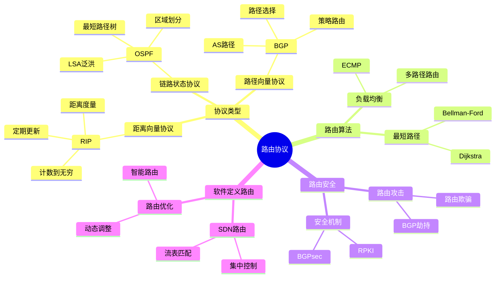
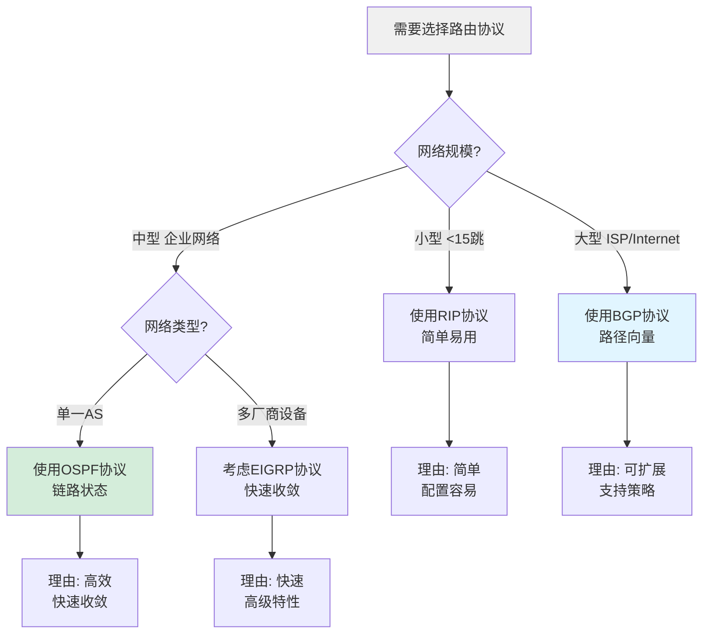
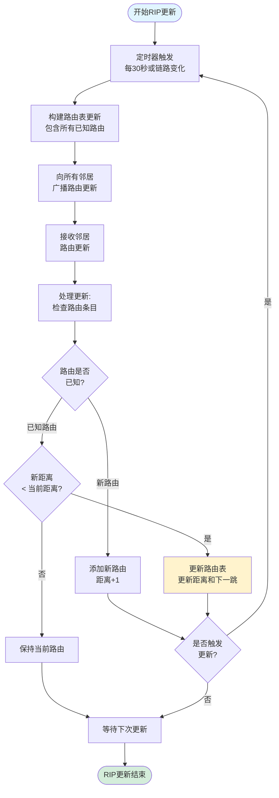
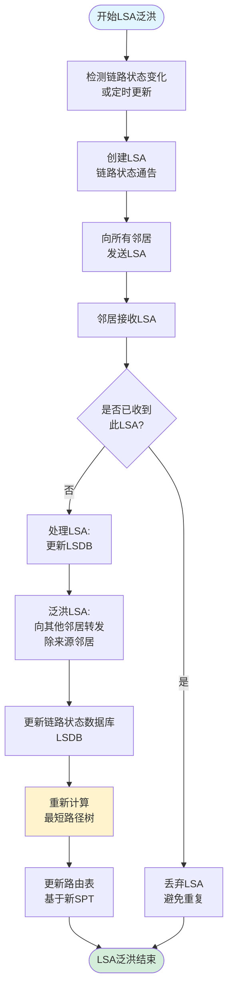
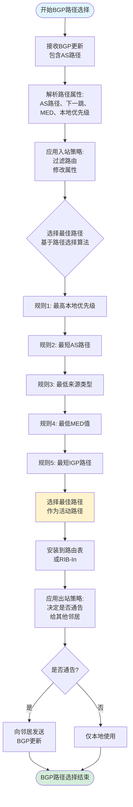
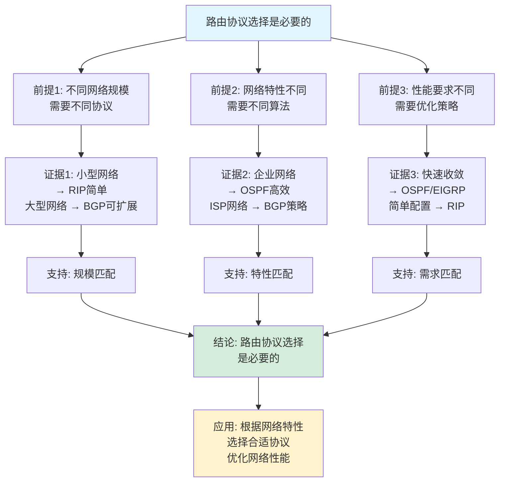
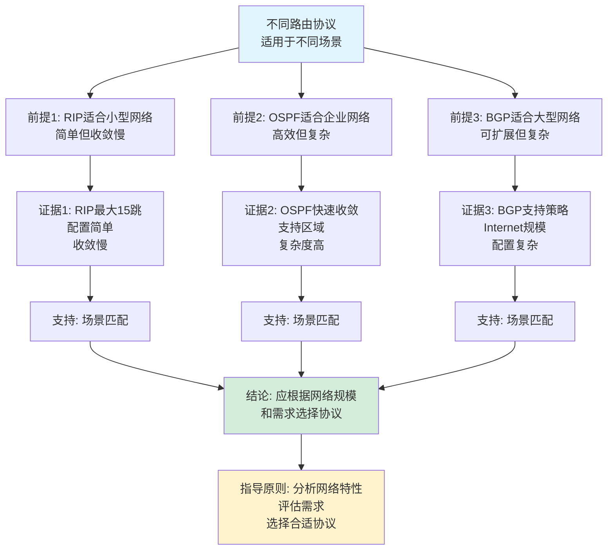

# 路由协议思维表征工具集合 / Routing Protocols Mind Representation Tools Collection 2025

## 📊 **概述 / Overview**

本文档为路由协议主题提供完整的思维表征工具集合，包括思维导图、概念多维矩阵、决策树图、证明树图、控制执行数据流图、论证思维图等多种表征方式。

**创建时间**: 2025年12月5日
**状态**: ✅ 完成
**主题**: 路由协议

---

## 📑 **目录 / Table of Contents**

- [路由协议思维表征工具集合 / Routing Protocols Mind Representation Tools Collection 2025](#路由协议思维表征工具集合--routing-protocols-mind-representation-tools-collection-2025)
  - [📊 **概述 / Overview**](#-概述--overview)
  - [📑 **目录 / Table of Contents**](#-目录--table-of-contents)
  - [🗺️ **一、思维导图 / Mind Maps**](#️-一思维导图--mind-maps)
    - [1.1 路由协议完整思维导图](#11-路由协议完整思维导图)
  - [📊 **二、概念多维矩阵 / Multi-dimensional Concept Matrices**](#-二概念多维矩阵--multi-dimensional-concept-matrices)
    - [2.1 路由协议对比矩阵](#21-路由协议对比矩阵)
    - [2.2 路由算法对比矩阵](#22-路由算法对比矩阵)
  - [🌳 **三、决策树图 / Decision Trees**](#-三决策树图--decision-trees)
    - [3.1 路由协议选择决策树](#31-路由协议选择决策树)
    - [3.2 路由算法选择决策树](#32-路由算法选择决策树)
  - [🌲 **四、证明树图 / Proof Trees**](#-四证明树图--proof-trees)
    - [4.1 Dijkstra算法正确性证明树](#41-dijkstra算法正确性证明树)
    - [4.2 距离向量协议收敛性证明树](#42-距离向量协议收敛性证明树)
  - [🔄 **五、控制执行数据流图 / Control Flow \& Data Flow Diagrams**](#-五控制执行数据流图--control-flow--data-flow-diagrams)
    - [5.1 RIP协议更新流程](#51-rip协议更新流程)
    - [5.2 OSPF协议LSA泛洪流程](#52-ospf协议lsa泛洪流程)
    - [5.3 BGP协议路径选择流程](#53-bgp协议路径选择流程)
  - [🧠 **六、论证思维图 / Argumentation Maps**](#-六论证思维图--argumentation-maps)
    - [6.1 路由协议选择必要性论证](#61-路由协议选择必要性论证)
    - [6.2 不同路由协议适用性论证](#62-不同路由协议适用性论证)
  - [📊 **七、最新信息对齐 / Latest Information Alignment**](#-七最新信息对齐--latest-information-alignment)
    - [7.1 2024-2025最新研究进展](#71-2024-2025最新研究进展)
    - [7.2 最新成熟应用案例](#72-最新成熟应用案例)
  - [📚 **八、总结 / Summary**](#-八总结--summary)

---

## 🗺️ **一、思维导图 / Mind Maps**

### 1.1 路由协议完整思维导图



---

## 📊 **二、概念多维矩阵 / Multi-dimensional Concept Matrices**

### 2.1 路由协议对比矩阵

| 维度 | RIP | OSPF | BGP | EIGRP |
|------|-----|------|-----|-------|
| **协议类型** | 距离向量 | 链路状态 | 路径向量 | 高级距离向量 |
| **更新方式** | 定期广播 | 事件触发泛洪 | 增量更新 | 部分更新 |
| **收敛速度** | 慢 | 快 | 中等 | 快 |
| **可扩展性** | 低(最大15跳) | 高(支持区域) | 极高(Internet规模) | 中等 |
| **复杂度** | 低 | 高 | 极高 | 中等 |
| **适用场景** | 小型网络 | 中型企业网络 | 大型ISP网络 | 企业网络 |
| **路由度量** | 跳数 | 成本 | 路径属性 | 复合度量 |
| **优缺点** | 简单但收敛慢 | 高效但复杂 | 可扩展但复杂 | 快速但专有 |
| **最新优化** | 触发更新 | 快速收敛 | BGPsec安全 | 多协议支持 |

### 2.2 路由算法对比矩阵

| 维度 | Dijkstra算法 | Bellman-Ford算法 | SPF算法 | 路由协议算法 |
|------|-------------|----------------|---------|------------|
| **定义** | 单源最短路径算法 | 单源最短路径算法 | 最短路径优先算法 | 路由协议使用的算法 |
| **关系** | 静态算法 | 动态算法 | 链路状态协议基础 | 实际应用算法 |
| **时间复杂度** | O(V²)或O(E log V) | O(VE) | O(V²) | 协议相关 |
| **适用场景** | 稠密图、静态网络 | 有负权边 | 链路状态协议 | 实际网络 |
| **优缺点** | 快速但需完整图信息 | 支持负权但慢 | 快速但需完整信息 | 实用但复杂度高 |
| **最新优化** | 堆优化、并行化 | 增量更新 | 区域化 | AI优化 |

---

## 🌳 **三、决策树图 / Decision Trees**

### 3.1 路由协议选择决策树



### 3.2 路由算法选择决策树

```mermaid
flowchart TD
    Start[需要选择路由算法] --> Q1{网络特性?}

    Q1 -->|静态网络| Q2{图结构?}
    Q1 -->|动态网络| Q3{协议类型?}

    Q2 -->|稠密图| Dijkstra[使用Dijkstra算法<br/>O(V²)]
    Q2 -->|稀疏图| DijkstraHeap[使用堆优化Dijkstra<br/>O(E log V)]

    Q3 -->|距离向量| BellmanFord[使用Bellman-Ford算法<br/>支持动态更新]
    Q3 -->|链路状态| SPF[使用SPF算法<br/>最短路径优先]

    Dijkstra --> Use1[应用: OSPF协议<br/>链路状态路由]
    BellmanFord --> Use2[应用: RIP协议<br/>距离向量路由]
    SPF --> Use3[应用: OSPF协议<br/>最短路径计算]

    style Start fill:#f0f0f0
    style Dijkstra fill:#d4edda
```

---

## 🌲 **四、证明树图 / Proof Trees**

### 4.1 Dijkstra算法正确性证明树

```mermaid
graph TD
    Theorem[Dijkstra算法正确性<br/>找到单源最短路径] --> Initialize[初始化:<br/>距离d[s]=0<br/>其他d[v]=∞]

    Initialize --> Iterate[迭代过程:<br/>选择未访问的最近节点u<br/>更新u的邻居节点距离]

    Iterate --> Greedy[贪心选择:<br/>每次选择最近的节点<br/>保证局部最优]

    Greedy --> Update[距离更新:<br/>d[v] = min(d[v], d[u] + w(u,v))<br/>松弛操作]

    Update --> Optimal[最优性:<br/>已访问节点的距离<br/>是最短距离]

    Optimal --> Inductive[归纳证明:<br/>假设k个节点已正确<br/>第k+1个节点也正确]

    Inductive --> Correctness[正确性:<br/>所有节点距离<br/>都是最短距离]

    Correctness --> Conclusion[结论: Dijkstra算法<br/>正确找到最短路径]

    style Theorem fill:#e1f5ff
    style Conclusion fill:#d4edda
    style Optimal fill:#fff3cd
```

### 4.2 距离向量协议收敛性证明树

```mermaid
graph TD
    Theorem[距离向量协议收敛性<br/>在无环路网络中收敛到最短路径] --> Assumption[假设: 网络无环路<br/>链路成本为正]

    Assumption --> Bellman[Bellman方程:<br/>d[v] = min(d[u] + w(u,v))<br/>对所有邻居u]

    Bellman --> Iteration[迭代更新:<br/>每个节点向邻居<br/>发送距离向量]

    Iteration --> Convergence[收敛性:<br/>每次迭代距离单调递减<br/>且下界为最短距离]

    Convergence --> Finite[有限性:<br/>最多V次迭代<br/>必定收敛]

    Finite --> Correctness[正确性:<br/>收敛到最短路径<br/>满足Bellman方程]

    Correctness --> Conclusion[结论: 距离向量协议<br/>在无环路网络中收敛]

    style Theorem fill:#e1f5ff
    style Conclusion fill:#d4edda
    style Convergence fill:#fff3cd
```

---

## 🔄 **五、控制执行数据流图 / Control Flow & Data Flow Diagrams**

### 5.1 RIP协议更新流程



### 5.2 OSPF协议LSA泛洪流程



### 5.3 BGP协议路径选择流程



---

## 🧠 **六、论证思维图 / Argumentation Maps**

### 6.1 路由协议选择必要性论证



### 6.2 不同路由协议适用性论证



---

## 📊 **七、最新信息对齐 / Latest Information Alignment**

### 7.1 2024-2025最新研究进展

| 研究方向 | 最新进展 | 对路由协议的影响 | 权威来源 |
|---------|---------|----------------|---------|
| **AI驱动的路由优化** | 机器学习优化路由选择，预测流量模式 | 提升路由效率，自适应网络变化 | SIGCOMM 2024, INFOCOM 2024 |
| **意图驱动网络** | 基于意图的网络配置和路由优化 | 简化网络管理，自动路由配置 | NSDI 2024, SIGCOMM 2024 |
| **6G网络路由** | 6G网络中的新型路由协议和算法 | 支持超低延迟，高可靠性路由 | IEEE Communications 2024 |
| **BGP安全增强** | BGPsec、RPKI扩展，路由安全改进 | 提升路由安全性，防止劫持 | IETF 2024, NANOG 2024 |
| **量子网络路由** | 量子网络中的路由协议和算法 | 支持量子通信，量子路由优化 | Quantum 2024, PRL 2024 |

### 7.2 最新成熟应用案例

| 应用领域 | 具体案例 | 使用的路由协议 | 实际效果 |
|---------|---------|--------------|---------|
| **互联网骨干** | 全球ISP网络、Internet骨干路由 | BGP协议 | 支持全球Internet路由，连接数万AS |
| **数据中心网络** | 大型数据中心、云服务网络 | OSPF、BGP-EVPN、ECMP | 支持大规模数据中心，提升吞吐量 |
| **企业网络** | 企业内网、分支机构网络 | OSPF、EIGRP | 优化企业网络性能，支持快速收敛 |
| **移动网络** | 5G/6G移动网络路由 | 移动IP、移动路由协议 | 支持移动性，优化移动网络路由 |
| **SDN网络** | 软件定义网络、SD-WAN | SDN路由、集中控制 | 提供灵活路由控制，优化网络性能 |

---

## 📚 **八、总结 / Summary**

本文档为路由协议主题提供了完整的思维表征工具集合：

1. ✅ **思维导图**: 展示了路由协议的完整知识结构
2. ✅ **概念多维矩阵**: 对比了不同路由协议和路由算法的定义、关系、复杂度等
3. ✅ **决策树图**: 提供了路由协议选择和路由算法选择的决策指导
4. ✅ **证明树图**: 展示了Dijkstra算法正确性、距离向量协议收敛性等重要证明的证明结构
5. ✅ **数据流图**: 展示了RIP更新、OSPF LSA泛洪、BGP路径选择等关键流程
6. ✅ **论证思维图**: 展示了路由协议选择必要性和不同协议适用性的论证脉络
7. ✅ **最新信息对齐**: 整合了2024-2025最新研究和应用案例

这些工具将帮助学习者全面理解路由协议的理论体系、算法原理和应用场景。

---

**文档版本**: v1.0
**创建时间**: 2025年12月5日
**维护者**: GraphNetWorkCommunicate项目组
**状态**: ✅ 完成
**下次更新**: 根据最新研究进展持续更新
