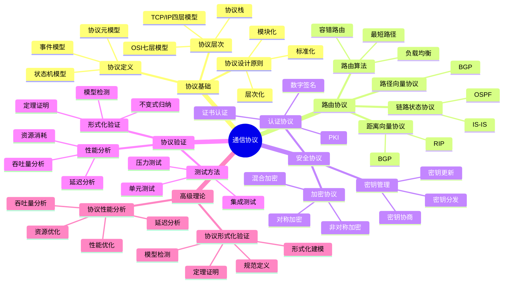
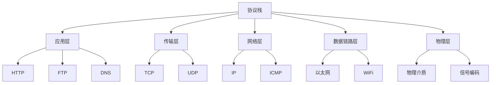
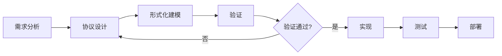
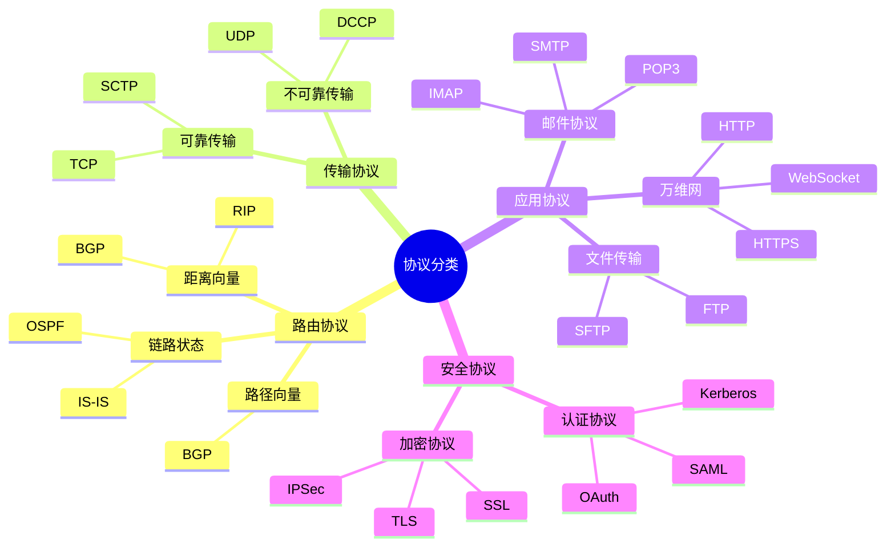
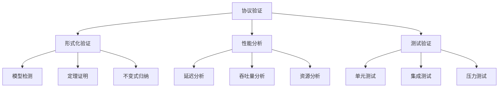
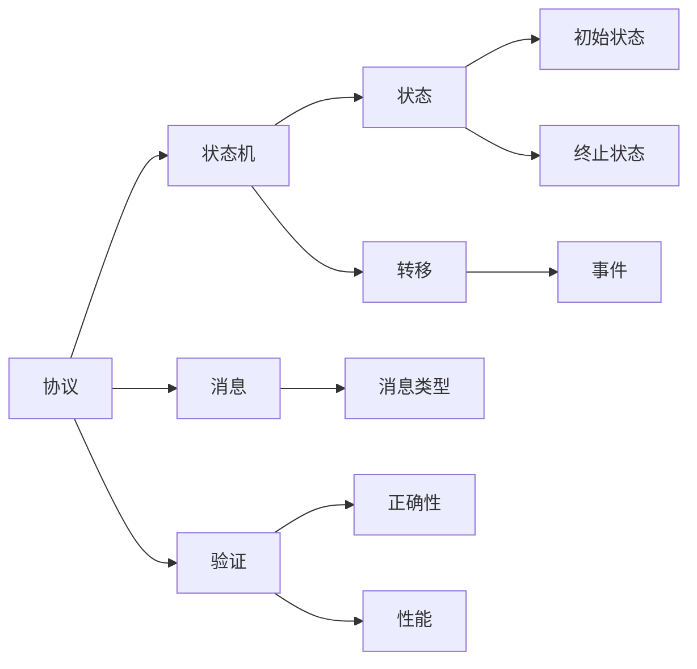
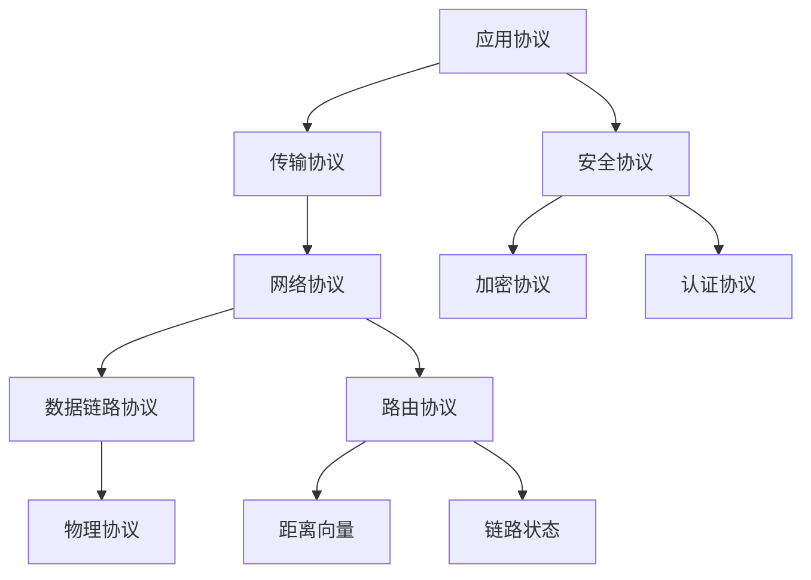
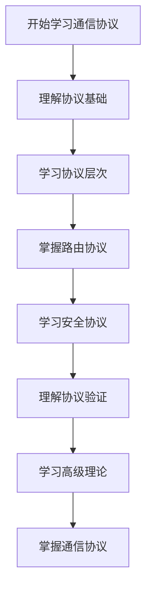
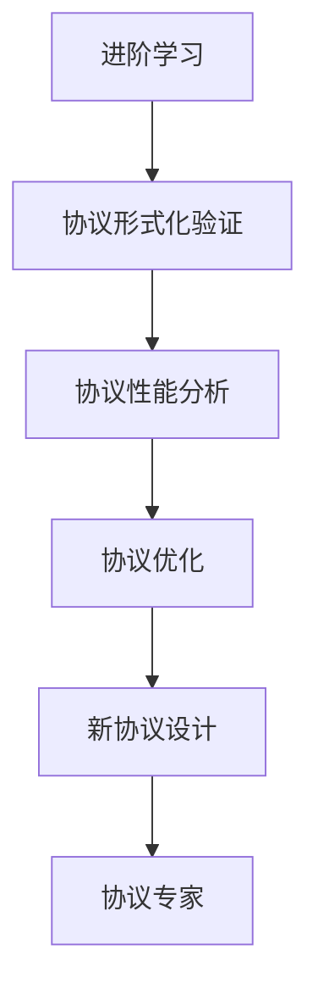

# 通信协议模块知识结构思维导图 / Communication Protocols Module Knowledge Structure Mind Map

## 📚 **概述 / Overview**

本文档提供通信协议模块的完整知识结构思维导图，帮助理解通信协议知识的层次结构和相互关系。

**创建时间**: 2025年1月
**模块**: 通信协议
**状态**: 🚀 持续更新中

---

## 🗺️ **一、整体知识结构 / Overall Knowledge Structure**

---

## 📊 **二、核心概念层次结构 / Core Concept Hierarchy**

### 2.1 协议层次结构

### 2.2 协议设计流程

---

## 🔬 **三、协议分类结构 / Protocol Classification Structure**

### 3.1 按功能分类

### 3.2 按层次分类

| 层次 | 协议 | 功能 | 特点 |
|------|------|------|------|
| **应用层** | HTTP, FTP, SMTP | 应用服务 | 面向用户 |
| **传输层** | TCP, UDP | 端到端通信 | 可靠性保证 |
| **网络层** | IP, ICMP | 路由转发 | 无连接 |
| **数据链路层** | Ethernet, WiFi | 帧传输 | 错误检测 |
| **物理层** | 物理介质 | 比特传输 | 信号编码 |

---

## 📐 **四、协议验证方法结构 / Protocol Verification Method Structure**

### 4.1 验证方法分类

### 4.2 验证工具对比

| 验证方法 | 工具 | 适用场景 | 优点 | 缺点 |
|---------|------|---------|------|------|
| **模型检测** | SPIN, TLA+ | 有限状态系统 | 自动化、完整 | 状态爆炸 |
| **定理证明** | Coq, Isabelle | 无限状态系统 | 严格、完整 | 需要人工 |
| **不变式归纳** | 自定义 | 不变式验证 | 高效 | 需要不变式 |

---

## 🔗 **五、知识关联网络 / Knowledge Association Network**

### 5.1 概念关联图

### 5.2 协议关联图

---

## 📚 **六、学习路径 / Learning Path**

### 6.1 基础学习路径

### 6.2 进阶学习路径

---

## 🎯 **七、应用领域映射 / Application Domain Mapping**

### 7.1 应用领域

| 协议类型 | 应用领域 | 具体应用 |
|---------|---------|---------|
| **路由协议** | 互联网 | BGP, OSPF, RIP |
| **传输协议** | 网络通信 | TCP, UDP |
| **应用协议** | Web服务 | HTTP, HTTPS |
| **安全协议** | 网络安全 | TLS, IPSec |
| **移动协议** | 移动通信 | 5G, 6G协议栈 |

---

## 📋 **八、知识检查清单 / Knowledge Checklist**

### 8.1 基础概念

- [ ] 理解协议的定义和元模型
- [ ] 掌握协议状态机模型
- [ ] 理解协议层次结构（OSI、TCP/IP）
- [ ] 掌握协议设计原则

### 8.2 路由协议

- [ ] 理解距离向量协议（RIP）
- [ ] 掌握链路状态协议（OSPF）
- [ ] 了解路径向量协议（BGP）
- [ ] 理解路由算法原理

### 8.3 安全协议

- [ ] 理解加密协议（对称、非对称）
- [ ] 掌握认证协议（数字签名、证书）
- [ ] 了解密钥管理机制
- [ ] 理解安全协议设计原则

### 8.4 协议验证

- [ ] 理解形式化验证方法
- [ ] 掌握模型检测技术
- [ ] 了解定理证明方法
- [ ] 理解性能分析方法

---

## 🔗 **相关链接 / Related Links**

- [通信协议README](README.md)
- [协议基础](01-协议基础.md)
- [路由协议](02-路由协议.md)
- [安全协议](03-安全协议.md)
- [思维表征工具](思维表征工具-通信协议.md)

---

**文档版本**: v1.0
**创建时间**: 2025年1月
**最后更新**: 2025年1月
**维护者**: GraphNetWorkCommunicate项目组
