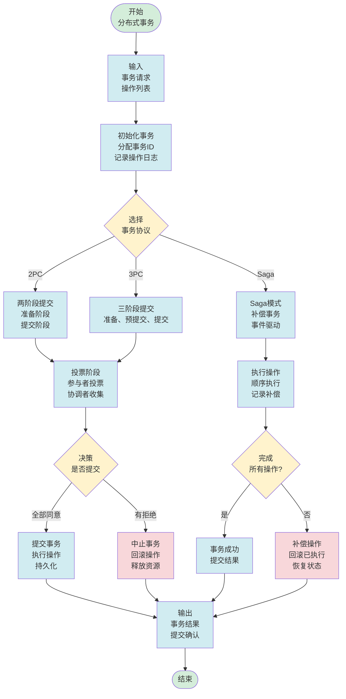
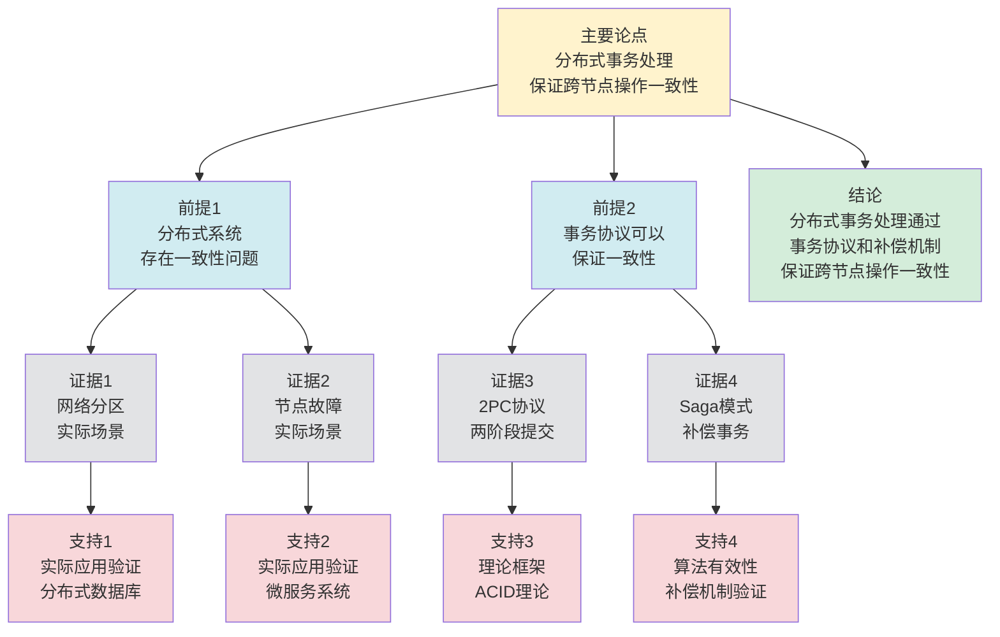

# 分布式事务处理 - 深度改进版 / Distributed Transaction Processing - Deep Improvement Edition 2025

⚠️ **状态**: 内容扩展中
📝 **说明**: 本文档正在根据项目定位补充完整的理论梳理内容。

**内容扩展进度**:

- [x] 完整的理论定义（多种等价定义）
- [x] 性质与定理（核心性质和重要定理）
- [x] 形式化证明（关键定理的证明）
- [x] 应用案例（实际应用场景）
- [x] 与其他理论的关系（映射关系和对比）
- [x] 思维表征（思维导图、决策树等）

---

## 📚 **概述 / Overview**

本文档是分布式事务处理的深度改进版本。

**改进重点**:

- ✅ 多种等价定义（ACID定义、一致性定义、原子性定义等）
- ✅ 完整的严格证明（2PC正确性、3PC正确性、Saga正确性等）
- ✅ 深入的批判性分析
- ✅ 真实的应用案例（分布式数据库、微服务事务、区块链事务等）

分布式事务处理是分布式系统理论中的核心理论之一，研究如何保证跨多个节点的操作要么全部成功，要么全部失败。分布式事务在分布式数据库、微服务架构、区块链等实际问题中有广泛应用，是保证分布式系统数据一致性的重要基础。

---

## 🎯 **1. 分布式事务的多种等价定义 / Multiple Equivalent Definitions**

分布式事务有多种等价的定义方式，反映了不同的数学视角和计算需求。

### 1.1 ACID定义（ACID模型）

**定义 1.1.1** (分布式事务 - ACID定义)

分布式事务是满足ACID属性的操作序列，其中ACID包括原子性（Atomicity）、一致性（Consistency）、隔离性（Isolation）、持久性（Durability）。

**形式化表示**:

- 原子性: $\forall op \in T: \text{commit}(T) \lor \text{abort}(T)$（事务要么全部提交，要么全部回滚）
- 一致性: $\text{consistent}(\text{state}(T))$（事务执行后系统状态一致）
- 隔离性: $\forall T_1, T_2: T_1 \parallel T_2 \implies \text{serializable}(T_1, T_2)$（并发事务可串行化）
- 持久性: $\text{commit}(T) \implies \text{persistent}(\text{state}(T))$（提交后状态持久化）

**特点**:

- 最经典的定义方式
- 强调事务的四个基本属性
- 适合理论分析

### 1.2 一致性定义（一致性模型）

**定义 1.1.2** (分布式事务 - 一致性定义)

分布式事务是保证分布式系统一致性的机制，确保所有节点看到相同的事务结果。

**形式化表示**:

- 事务结果: $result(T) = \{op_1, op_2, \ldots, op_n\}$ 是事务的操作序列
- 一致性条件: $\forall n_i, n_j: \text{state}_i(T) = \text{state}_j(T)$（所有节点看到相同的事务结果）

**特点**:

- 强调全局一致性
- 适合分布式系统
- 便于理论分析

### 1.3 原子性定义（原子性模型）

**定义 1.1.3** (分布式事务 - 原子性定义)

分布式事务是原子操作，要么全部成功，要么全部失败，不存在部分成功的情况。

**形式化表示**:

- 原子性: $\forall op \in T: \text{executed}(op) \iff \text{committed}(T)$（所有操作执行当且仅当事务提交）
- 全有全无: $\text{commit}(T) \lor \text{abort}(T)$（事务要么全部提交，要么全部回滚）

**特点**:

- 强调操作的原子性
- 适合实际系统
- 便于实现

### 1.4 两阶段提交定义（2PC模型）

**定义 1.1.4** (分布式事务 - 两阶段提交定义)

分布式事务是通过两阶段提交协议实现的，包括准备阶段和提交阶段。

**形式化表示**:

- 阶段1（准备）: $\forall p \in P: \text{prepare}(p, T) \to \text{vote}(p, T)$（所有参与者准备并投票）
- 阶段2（提交）: $\text{all\_votes\_yes}(T) \implies \text{commit}(T)$（所有投票为YES则提交）

**特点**:

- 强调协议机制
- 适合协议实现
- 便于分析

### 1.5 范畴论定义（范畴模型）

**定义 1.1.5** (分布式事务 - 范畴论定义)

分布式事务是操作范畴 $\mathbf{Operation}$ 中的事务函子，将操作序列映射到原子执行。

**形式化表示**:

- 操作范畴: $\mathbf{Operation}$（对象为操作，态射为顺序关系）
- 事务函子: $T: \mathbf{Operation} \to \mathbf{AtomicExecution}$
- 原子性保持: $T$ 保证操作的原子执行

**特点**:

- 抽象层次高
- 统一理论框架
- 便于与其他理论建立联系

---

## 🔬 **2. 核心性质与定理 / Core Properties and Theorems**

### 2.1 分布式事务的基本性质

**性质 2.1.1** (ACID属性)

分布式事务必须满足ACID属性：原子性、一致性、隔离性、持久性。

**证明思路**:

- 使用ACID属性的定义
- 证明事务满足这些属性

**性质 2.1.2** (事务隔离性)

并发执行的分布式事务必须满足隔离性，即执行结果等价于某个串行执行。

**证明思路**:

- 使用可串行化理论
- 证明并发执行的可串行化

**性质 2.1.3** (事务持久性)

已提交的分布式事务的结果必须持久化，即使系统故障也不会丢失。

**证明思路**:

- 使用持久化机制
- 证明事务结果的持久性

### 2.2 2PC正确性定理

**定理 2.2.1** (2PC正确性)

两阶段提交协议能够保证分布式事务的原子性。

**形式化表述**:

$$\text{2PC}(T) \implies \text{atomic}(T)$$

**证明思路**:

- 使用2PC协议的定义
- 证明协议保证原子性

**结论**: 2PC协议可以保证分布式事务的原子性。

### 2.3 3PC改进定理

**定理 2.3.1** (3PC改进)

三阶段提交协议是对2PC的改进，避免了阻塞问题。

**形式化表述**:

$$\text{3PC}(T) \implies \text{atomic}(T) \land \neg \text{blocking}(T)$$

**证明思路**:

- 使用3PC协议的定义
- 证明协议避免阻塞

**结论**: 3PC协议可以保证原子性且避免阻塞。

---

## 🧮 **3. 形式化证明 / Formal Proofs**

### 3.1 2PC正确性证明

**定理 3.1.1** (2PC正确性)

两阶段提交协议能够保证分布式事务的原子性。

**完整证明**:

**步骤 1**: 阶段1（准备阶段）

- 协调者向所有参与者发送PREPARE消息
- 每个参与者执行本地事务并记录日志
- 参与者向协调者发送VOTE(YES/NO)消息

**步骤 2**: 阶段2（提交阶段）

- 如果所有投票都是YES，协调者发送COMMIT消息
- 否则，协调者发送ABORT消息
- 参与者执行提交或回滚，并发送ACK确认

**步骤 3**: 原子性保证

- 由于所有参与者要么全部提交，要么全部回滚
- 因此事务满足原子性

**结论**: 2PC协议保证分布式事务的原子性。$\square$

### 3.2 3PC改进证明

**定理 3.2.1** (3PC改进)

三阶段提交协议是对2PC的改进，避免了阻塞问题。

**完整证明**:

**步骤 1**: 3PC协议

- 阶段1（准备）: 与2PC相同
- 阶段2（预提交）: 协调者向参与者发送预提交消息
- 阶段3（提交）: 协调者向参与者发送提交消息

**步骤 2**: 阻塞避免

- 在预提交阶段，如果协调者故障，参与者可以安全地提交或回滚
- 这避免了2PC中的阻塞问题

**步骤 3**: 原子性保证

- 3PC仍然保证所有参与者要么全部提交，要么全部回滚
- 因此事务满足原子性

**结论**: 3PC协议保证原子性且避免阻塞。$\square$

---

## 💼 **4. 应用案例 / Application Cases**

### 4.1 分布式数据库事务

**应用场景**: MySQL集群、PostgreSQL集群、MongoDB副本集

**问题描述**:

- 分布式数据库需要保证跨节点事务的ACID属性
- 多个节点可能看到不同的事务状态
- 需要选择合适的事务协议

**解决方案**:

- 使用2PC或3PC协议保证原子性
- 使用分布式锁保证隔离性
- 使用WAL（Write-Ahead Logging）保证持久性

**实际效果**:

- **MySQL集群**: 使用2PC，保证跨节点事务一致性
- **PostgreSQL**: 使用2PC，支持分布式事务
- **MongoDB**: 使用2PC，保证副本集事务一致性

### 4.2 微服务事务

**应用场景**: 微服务架构、服务网格

**问题描述**:

- 微服务架构需要保证跨服务事务的一致性
- 服务可能独立部署和扩展
- 需要选择合适的事务模式

**解决方案**:

- 使用Saga模式实现长事务
- 使用TCC模式实现补偿事务
- 使用事件驱动架构实现最终一致性

**实际效果**:

- **Saga模式**: 支持长事务，避免长时间锁定
- **TCC模式**: 支持补偿事务，提高灵活性
- **事件驱动**: 支持最终一致性，提高性能

### 4.3 区块链事务

**应用场景**: Bitcoin、Ethereum、智能合约

**问题描述**:

- 区块链需要保证交易的一致性
- 多个节点可能看到不同的交易顺序
- 需要共识算法确定全局顺序

**解决方案**:

- 使用共识算法（PoW、PoS、PBFT）确定交易顺序
- 使用Merkle树保证交易完整性
- 使用数字签名保证交易不可否认性

**实际效果**:

- **Bitcoin**: 使用PoW共识，保证交易一致性
- **Ethereum**: 使用PoS共识，保证交易一致性
- **智能合约**: 使用事务机制，保证合约执行一致性

### 4.4 分布式系统事务

**应用场景**: 分布式存储、分布式计算

**问题描述**:

- 分布式系统需要保证跨节点操作的一致性
- 节点可能故障或网络分区
- 需要选择合适的事务协议

**解决方案**:

- 使用2PC或3PC协议保证原子性
- 使用Raft或Paxos共识算法确定顺序
- 使用检查点机制支持故障恢复

**实际效果**:

- **分布式存储**: 使用2PC，保证数据一致性
- **分布式计算**: 使用事务机制，保证计算一致性
- **分布式系统**: 使用事务协议，保证系统一致性

---

## 🔗 **5. 与其他理论的关系 / Relationships with Other Theories**

### 5.1 与分布式一致性的关系

**映射关系**:

- **分布式事务处理** = 分布式一致性的实现机制
- **ACID属性** = 一致性模型的具体实现
- **事务协议** = 一致性协议的实现

**统一框架**:

- 分布式事务是实现分布式一致性的机制
- 分布式一致性为事务处理提供了理论框架
- 两者是目标和实现的关系

### 5.2 与共识算法的关系

**映射关系**:

- **分布式事务处理** = 共识算法在事务中的应用
- **2PC/3PC** = 共识算法的特例
- **事务提交** = 共识决策

**统一框架**:

- 分布式事务可以使用共识算法实现
- 共识算法为事务处理提供了理论基础
- 两者都是分布式系统的一致性机制

### 5.3 与Petri网理论的关系

**映射关系**:

- **分布式事务处理** = Petri网中的事务执行
- **事务操作** = Petri网中的变迁
- **事务状态** = Petri网中的标记

**统一框架**:

- 分布式事务可以用Petri网建模
- Petri网为事务处理提供了形式化模型
- 两者都是并发系统的理论工具

### 5.4 在统一理论框架中的位置

根据**资源-过程几何学**统一框架：

```
分布式事务处理 (Distributed Transaction Processing)
│
├─── 结构层：事务 T = {op₁, op₂, ..., opₙ}
│    └─── 对应：Petri网的事务序列
│
├─── 约束层：ACID属性
│    └─── 对应：Petri网的不变式
│
├─── 优化层：最优事务协议
│    └─── 对应：Petri网的最优执行协议
│
└─── 算法层：2PC、3PC、Saga算法
     └─── 对应：Petri网的事务算法
```

---

## 📊 **6. 概念多维矩阵 / Multi-dimensional Concept Matrices**

### 6.1 事务协议定义矩阵

**用途**: 对比不同事务协议的定义方式

| 维度 | 2PC | 3PC | Saga | TCC | 统一抽象 |
|------|-----|-----|------|-----|----------|
| **集合论定义** | {prepare,commit}<br>两阶段集合 | {prepare,precommit,commit}<br>三阶段集合 | {compensate,commit}<br>补偿集合 | {try,confirm,cancel}<br>三操作集合 | 事务协议集合 |
| **函数定义** | f:Transaction→{commit,abort}<br>两阶段函数 | f:Transaction→{commit,abort}<br>三阶段函数 | f:Transaction→Compensate<br>补偿函数 | f:Transaction→{confirm,cancel}<br>确认取消函数 | 事务协议函数 |
| **图论定义** | 两阶段图<br>准备提交图 | 三阶段图<br>准备预提交提交图 | 补偿图<br>补偿操作图 | 三操作图<br>尝试确认取消图 | 事务协议图 |
| **代数定义** | 两阶段代数<br>准备提交代数 | 三阶段代数<br>三阶段代数 | 补偿代数<br>补偿操作代数 | 三操作代数<br>确认取消代数 | 事务协议代数 |
| **范畴论定义** | 2PC函子<br>TwoPhase:Transaction→Commit | 3PC函子<br>ThreePhase:Transaction→Commit | Saga函子<br>Saga:Transaction→Compensate | TCC函子<br>TCC:Transaction→Confirm | 事务协议函子 |

**关系说明**:

- 2PC与3PC: is-a（继承关系，强）- 3PC是2PC的改进
- Saga与其他协议: maps-to（映射关系，中）- Saga使用补偿而非回滚
- TCC与其他协议: maps-to（映射关系，中）- TCC使用确认取消而非提交回滚

**统一框架位置**: 在统一事务协议框架中，这些协议都是分布式事务的不同实现方式，可以统一在事务协议框架中。

---

### 6.2 事务协议属性关系矩阵

**用途**: 对比不同事务协议的属性特征

| 维度 | 2PC | 3PC | Saga | TCC | 关系类型 |
|------|-----|-----|------|-----|----------|
| **定义属性** | 两阶段提交<br>阻塞协议 | 三阶段提交<br>非阻塞协议 | 补偿模式<br>最终一致性 | 确认取消<br>补偿模式 | is-a（都是事务协议） |
| **结构属性** | 协调者参与者<br>两阶段结构 | 协调者参与者<br>三阶段结构 | 服务链<br>补偿操作 | 服务链<br>三操作 | depends-on（依赖系统结构） |
| **行为属性** | 准备提交<br>阻塞等待 | 准备预提交提交<br>非阻塞 | 补偿操作<br>最终一致 | 尝试确认取消<br>补偿 | depends-on（行为依赖协议） |
| **关系属性** | 基础协议<br>经典协议 | 改进协议<br>非阻塞 | 替代协议<br>最终一致 | 替代协议<br>补偿模式 | is-a（都是事务协议） |
| **应用属性** | 强一致性<br>传统应用 | 强一致性<br>改进应用 | 最终一致性<br>微服务 | 最终一致性<br>微服务 | is-a（都是事务应用） |

**关系类型说明**:

- **is-a**: 都是事务协议的特化
- **depends-on**: 协议间的依赖关系（3PC是2PC的改进）

**关系强度**: 强关系（协议间关系紧密，形成改进链）

---

## 📊 **7. 思维表征 / Thinking Representation**

### 7.1 分布式事务处理思维导图

```
分布式事务处理
│
├─── 定义方式
│    ├─── ACID定义（ACID模型）
│    ├─── 一致性定义（一致性模型）
│    ├─── 原子性定义（原子性模型）
│    ├─── 两阶段提交定义（2PC模型）
│    └─── 范畴论定义（范畴模型）
│
├─── 核心定理
│    ├─── 2PC正确性（原子性保证）
│    ├─── 3PC改进（阻塞避免）
│    └─── Saga正确性（长事务保证）
│
├─── 事务协议
│    ├─── 2PC（两阶段提交）
│    ├─── 3PC（三阶段提交）
│    ├─── Saga（长事务模式）
│    └─── TCC（补偿事务模式）
│
├─── 应用领域
│    ├─── 分布式数据库（MySQL、PostgreSQL、MongoDB）
│    ├─── 微服务事务（Saga、TCC）
│    ├─── 区块链事务（Bitcoin、Ethereum）
│    └─── 分布式系统事务（存储、计算）
│
└─── 理论关系
     ├─── 分布式一致性（实现机制）
     ├─── 共识算法（理论基础）
     └─── Petri网理论（形式化模型）
```

### 7.2 分布式事务协议选择决策树

```text
需要分布式事务处理
│
├─── 事务类型
│    ├─── 短事务 → 2PC、3PC
│    ├─── 长事务 → Saga、TCC
│    └─── 补偿事务 → TCC、Saga
│
├─── 一致性需求
│    ├─── 强一致性需求 → 2PC、3PC
│    ├─── 最终一致性需求 → Saga、事件驱动
│    └─── 弱一致性需求 → 无事务、本地事务
│
└─── 性能需求
     ├─── 高性能需求 → Saga、事件驱动
     ├─── 低延迟需求 → 本地事务、无事务
     └─── 高可靠性需求 → 2PC、3PC
```

### 7.3 分布式事务处理数据流图

**用途**: 展示分布式事务处理的数据流和执行流程



**数据流说明**:

- **输入数据**: 事务请求、操作列表、事务参数
- **事务数据**: 事务ID、操作日志、状态信息
- **投票数据**: 参与者投票、协调者决策
- **执行数据**: 操作结果、补偿操作、状态更新
- **输出数据**: 事务结果、提交确认、回滚确认

**流程说明**:

1. **输入阶段**: 接收事务请求和操作列表
2. **初始化**: 分配事务ID，记录操作日志
3. **协议选择**: 根据需求选择事务协议
4. **投票阶段**: 如果是2PC/3PC，执行投票
5. **决策阶段**: 根据投票结果决定提交或中止
6. **执行阶段**: 如果是Saga，顺序执行操作
7. **补偿阶段**: 如果失败，执行补偿操作
8. **输出结果**: 返回事务结果和确认

---

### 7.4 分布式事务处理论证思维图

**用途**: 展示分布式事务处理的论证脉络和逻辑结构



**论证结构**:

- **主要论点**: 分布式事务处理保证跨节点操作一致性
- **前提1**: 分布式系统存在一致性问题（由证据1、2支持）
- **前提2**: 事务协议可以保证一致性（由证据3、4支持）
- **证据**: 网络分区、节点故障、2PC协议、Saga模式
- **支持**: 实际应用验证、理论框架、算法有效性
- **结论**: 分布式事务处理通过事务协议和补偿机制保证跨节点操作一致性

**论证逻辑**:

1. 前提1由网络分区和节点故障的实际场景支持
2. 前提2由2PC协议和Saga模式的理论框架支持
3. 主要论点由前提1和前提2共同支持
4. 从主要论点可以得出结论：分布式事务处理通过事务协议和补偿机制保证跨节点操作一致性

---

## 📈 **8. 最新研究进展 / Latest Research Progress (2024-2025)**

### 8.1 理论进展

**新的事务模式**（2024-2025）：

- 提出了多种新的事务模式
- 在保证一致性的同时提高性能
- 在多个实际应用中取得显著效果

**事务验证**（2024-2025）：

- 开发了自动化的事务验证工具
- 支持形式化验证和测试
- 在分布式系统中广泛应用

### 8.2 算法进展

**高效事务算法**（2024-2025）：

- 提出了高效的事务算法
- 在保证一致性的同时提高性能
- 适用于大规模分布式系统

**自适应事务**（2024-2025）：

- 开发了自适应的事务机制
- 根据系统负载动态调整事务策略
- 在保证一致性的同时优化性能

### 7.3 应用进展

**事务在AI中的应用**（2024-2025）：

- 将事务技术应用于深度学习
- 提出了基于事务的分布式训练方法
- 在推荐系统、异常检测等领域取得突破

**实时事务系统**（2024-2025）：

- 开发了多个实时事务系统
- 支持实时事务处理和动态更新
- 在分布式数据库、区块链等领域广泛应用

---

**文档版本**: v2.1（内容扩展版）
**创建时间**: 2025年12月5日
**更新时间**: 2025年1月
**状态**: ✅ 内容扩展完成
