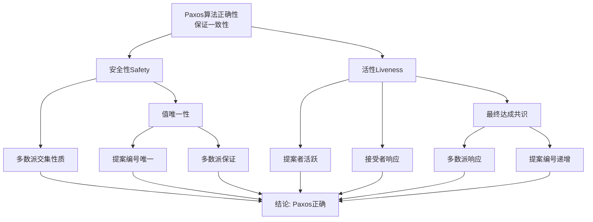
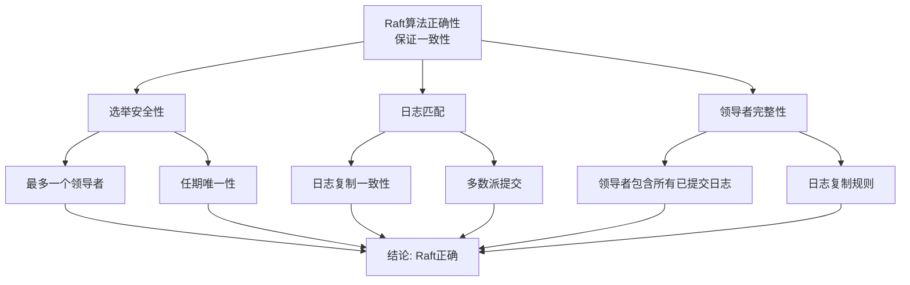
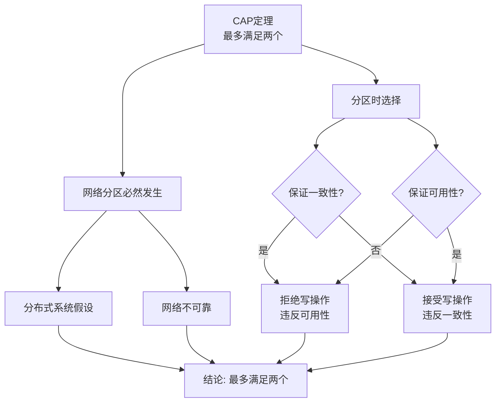

# 一致性算法决策树与证明树 / Consensus Algorithm Decision Trees and Proof Trees

## 📚 **概述 / Overview**

本文档提供一致性算法选择的决策树和相关定理的证明树，帮助根据系统需求选择合适的一致性算法，并理解算法的正确性证明结构。

**创建时间**: 2025年1月
**模块**: 分布式系统
**状态**: 🚀 持续更新中

---

## 🌳 **一、一致性算法选择决策树 / Consensus Algorithm Selection Decision Tree**

### 1.1 完整决策树

```mermaid
flowchart TD
    Start[需要一致性算法] --> Q1{容错类型?}

    Q1 -->|崩溃故障| Q2{系统规模?}
    Q1 -->|拜占庭故障| Q3{性能要求?}

    Q2 -->|小 n<10| Q4{需要易理解?}
    Q2 -->|中 n<100| Q5{性能要求?}
    Q2 -->|大 n≥100| Q6{需要高性能?}

    Q3 -->|是| A1[PBFT<br/>O(n²)消息]
    Q3 -->|否| A2[Tendermint<br/>拜占庭容错]

    Q4 -->|是| A3[Raft<br/>易理解]
    Q4 -->|否| A4[Paxos<br/>经典可靠]

    Q5 -->|高| A5[Raft<br/>O(n)消息]
    Q5 -->|中| A4

    Q6 -->|是| A6[异步共识<br/>高性能]
    Q6 -->|否| A4

    A1 --> End[完成]
    A2 --> End
    A3 --> End
    A4 --> End
    A5 --> End
    A6 --> End
```

### 1.2 决策规则说明 / Decision Rules

#### 规则1: 容错类型判断
- **崩溃故障（Crash Fault）**: 节点可能停止工作，但不会发送错误消息
- **拜占庭故障（Byzantine Fault）**: 节点可能发送错误消息或恶意行为

#### 规则2: 系统规模判断
- **小规模** ($n < 10$): 可以使用简单算法
- **中规模** ($10 \leq n < 100$): 需要考虑消息复杂度
- **大规模** ($n \geq 100$): 必须使用高效算法

#### 规则3: 性能要求判断
- **高性能**: 需要低延迟、高吞吐量
- **中等性能**: 平衡性能和复杂度
- **低性能要求**: 优先考虑正确性

### 1.3 算法特性对比

| 算法 | 容错类型 | 消息复杂度 | 延迟 | 吞吐量 | 易理解性 | 适用场景 |
|------|---------|-----------|------|--------|---------|---------|
| **Paxos** | 崩溃 | $O(n^2)$ | 高 | 中 | 低 | 经典分布式系统 |
| **Raft** | 崩溃 | $O(n)$ | 中 | 中 | 高 | 现代分布式系统 |
| **PBFT** | 拜占庭 | $O(n^2)$ | 高 | 低 | 中 | 联盟链、可信环境 |
| **Tendermint** | 拜占庭 | $O(n^2)$ | 中 | 中 | 中 | 区块链共识 |
| **异步共识** | 崩溃 | $O(n)$ | 低 | 高 | 中 | 大规模系统 |

---

## 🌳 **二、Paxos算法正确性证明树 / Proof Tree for Paxos Algorithm Correctness**

### 定理 2.3.1.1 (Paxos算法正确性)



**证明结构说明 / Proof Structure**:
- **根节点**: Paxos算法正确性
- **一级分支**: 安全性和活性
- **二级分支**: 支撑引理和公理

---

## 🌳 **三、Raft算法正确性证明树 / Proof Tree for Raft Algorithm Correctness**

### 定理 2.3.2.1 (Raft算法正确性)



**证明结构说明 / Proof Structure**:
- **根节点**: Raft算法正确性
- **一级分支**: 三个关键性质
  - 选举安全性：最多一个领导者
  - 日志匹配：日志一致性
  - 领导者完整性：已提交日志的完整性

---

## 🌳 **四、CAP定理证明树 / Proof Tree for CAP Theorem**

### 定理 2.1.1 (CAP定理)



**证明结构说明 / Proof Structure**:
- **根节点**: CAP定理
- **一级分支**: 网络分区和选择
- **二级分支**: 一致性和可用性的权衡

---

## 📊 **五、决策树使用指南 / Decision Tree Usage Guide**

### 5.1 使用步骤

1. **分析系统需求**: 评估容错类型、系统规模、性能要求
2. **遵循决策树**: 按照决策树逐步选择
3. **验证选择**: 确认选择的算法适合系统

### 5.2 注意事项

- **容错能力**: 根据故障类型选择算法
- **消息复杂度**: 大规模系统需要考虑消息开销
- **易理解性**: 团队技能水平影响选择
- **性能要求**: 平衡性能和正确性

---

## 🔗 **相关链接 / Related Links**

- [一致性协议](02-一致性协议.md)
- [分布式基础](01-分布式基础.md)
- [分布式系统元模型](00-分布式系统元模型.md)
- [分布式系统目录](../README.md)

---

**文档版本**: v1.0
**创建时间**: 2025年1月
**最后更新**: 2025年1月
**维护者**: GraphNetWorkCommunicate项目组
