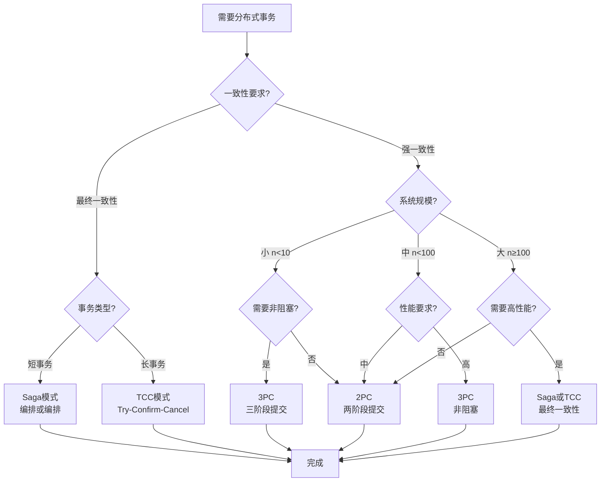
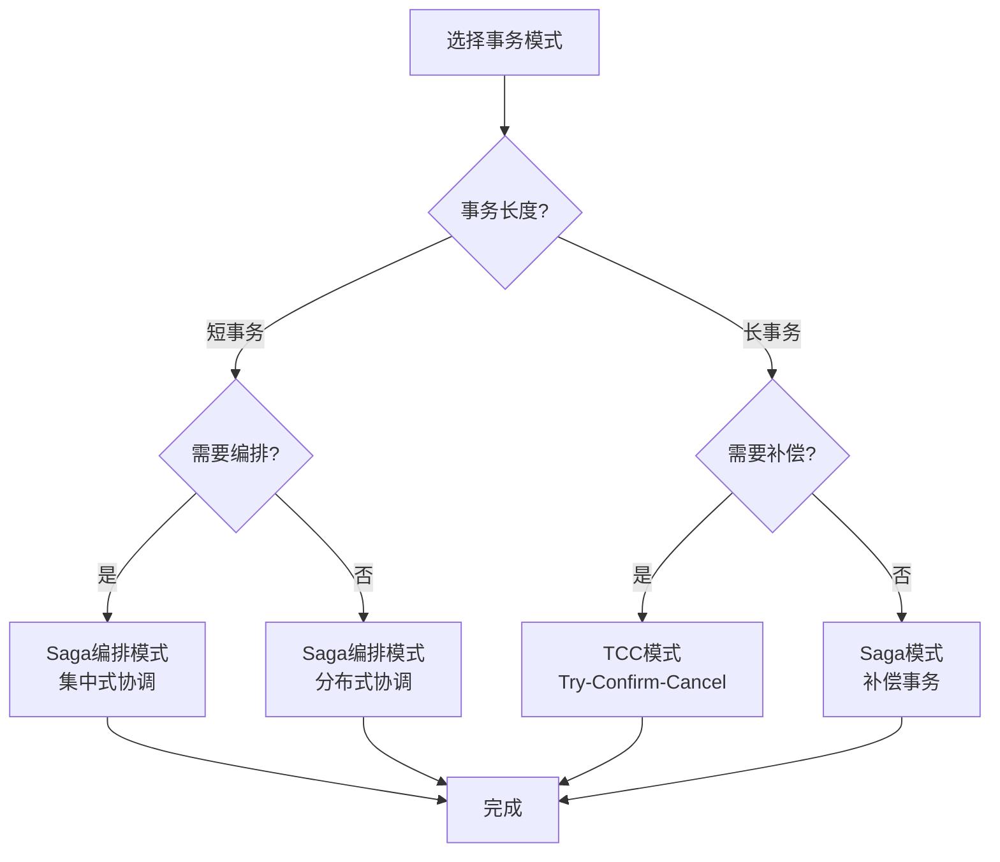

# 分布式事务算法决策树 / Distributed Transaction Algorithm Decision Tree

## 📚 **概述 / Overview**

本文档提供分布式事务算法选择的决策树，帮助根据系统需求选择合适的事务处理算法。

**创建时间**: 2025年1月
**模块**: 分布式系统
**状态**: 🚀 持续更新中

---

## 🌳 **一、分布式事务算法选择决策树 / Distributed Transaction Algorithm Selection Decision Tree**

### 1.1 完整决策树

### 1.2 决策规则说明 / Decision Rules

#### 规则1: 一致性要求判断
- **强一致性**: 需要ACID特性，所有节点同时看到相同数据
- **最终一致性**: 允许短暂不一致，最终达到一致状态

#### 规则2: 系统规模判断
- **小规模** ($n < 10$): 可以使用简单算法（2PC/3PC）
- **中规模** ($10 \leq n < 100$): 需要考虑性能和复杂度
- **大规模** ($n \geq 100$): 必须使用高效算法（Saga/TCC）

#### 规则3: 事务类型判断
- **短事务**: 执行时间短，适合Saga模式
- **长事务**: 执行时间长，适合TCC模式

### 1.3 算法特性对比

| 算法 | 一致性 | 阻塞性 | 复杂度 | 性能 | 适用场景 |
|------|--------|--------|--------|------|---------|
| **2PC** | 强一致 | 阻塞 | 低 | 中 | 小规模、强一致 |
| **3PC** | 强一致 | 非阻塞 | 中 | 中 | 中等规模、高可用 |
| **Saga** | 最终一致 | 非阻塞 | 中 | 高 | 长事务、微服务 |
| **TCC** | 最终一致 | 非阻塞 | 高 | 高 | 复杂业务、补偿事务 |

---

## 🌳 **二、事务模式选择决策树 / Transaction Pattern Selection Decision Tree**

### 2.1 完整决策树

### 2.2 决策规则说明

#### 规则1: 事务长度判断
- **短事务**: 执行时间<1秒，适合Saga模式
- **长事务**: 执行时间≥1秒，适合TCC模式

#### 规则2: 编排需求判断
- **需要编排**: 集中式协调，易于管理
- **不需要编排**: 分布式协调，更灵活

#### 规则3: 补偿需求判断
- **需要补偿**: 需要撤销操作，使用TCC
- **不需要补偿**: 可以接受最终一致，使用Saga

---

## 📊 **三、算法选择指南 / Algorithm Selection Guide**

### 3.1 选择矩阵

| 场景 | 一致性要求 | 系统规模 | 性能要求 | 推荐算法 |
|------|-----------|---------|---------|---------|
| **小规模强一致** | 强一致 | 小 | 中 | 2PC |
| **中等规模高可用** | 强一致 | 中 | 中 | 3PC |
| **大规模微服务** | 最终一致 | 大 | 高 | Saga |
| **复杂业务逻辑** | 最终一致 | 大 | 高 | TCC |

### 3.2 使用建议

- **强一致性需求**: 优先考虑2PC或3PC
- **高可用性需求**: 优先考虑3PC、Saga或TCC
- **高性能需求**: 优先考虑Saga或TCC
- **简单场景**: 使用2PC
- **复杂场景**: 使用Saga或TCC

---

## 🔗 **相关链接 / Related Links**

- [一致性协议](02-一致性协议.md)
- [分布式基础](01-分布式基础.md)
- [分布式系统目录](../README.md)

---

**文档版本**: v1.0
**创建时间**: 2025年1月
**最后更新**: 2025年1月
**维护者**: GraphNetWorkCommunicate项目组
