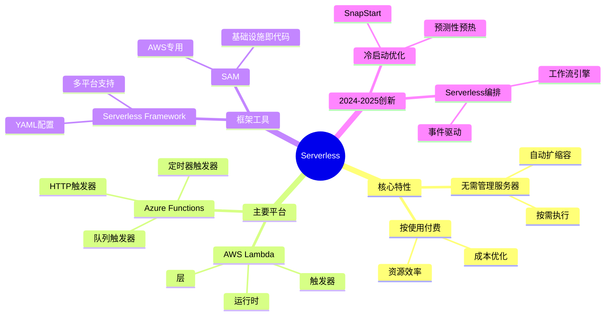
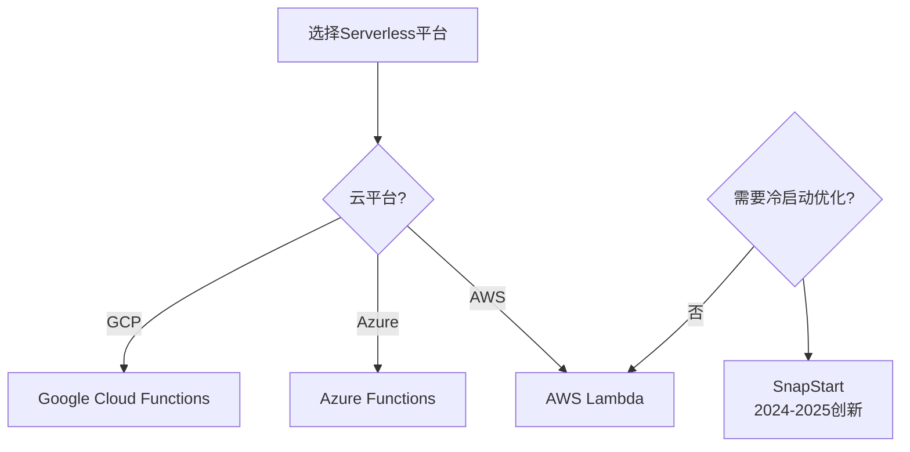
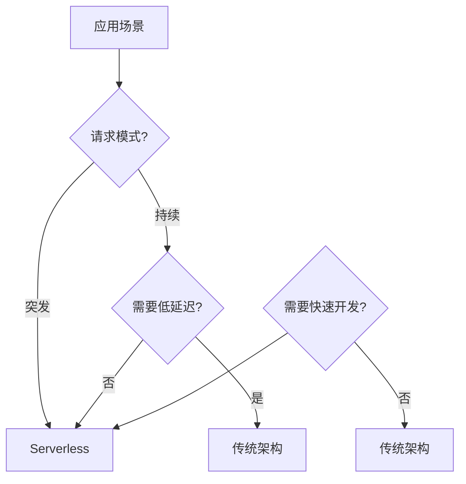
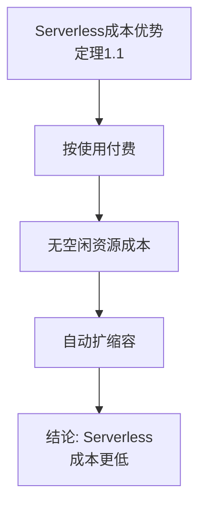
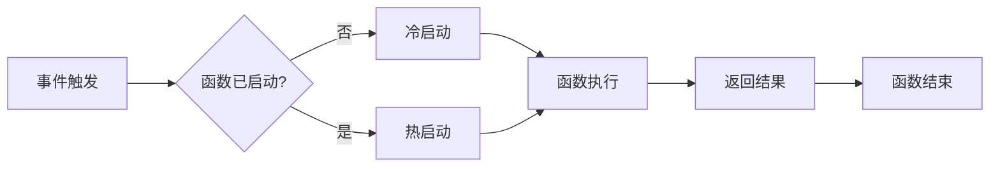
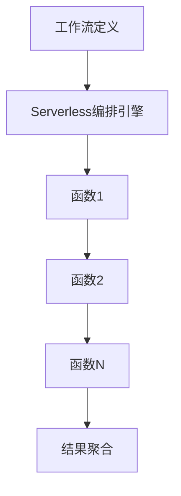
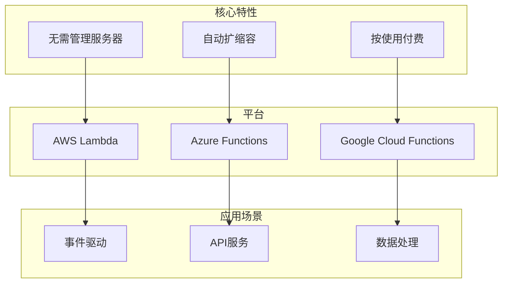
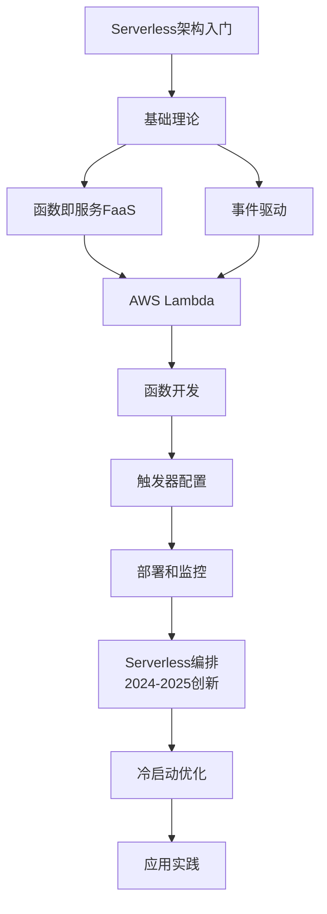

# Serverless架构专题思维表征工具 / Serverless Architecture Special Topic Mental Representation Tools 2024-2025

## 📚 **概述 / Overview**

本文档为Serverless架构专题提供完整的思维表征工具集合。

**创建时间**: 2025年1月
**状态**: ✅ 完成
**专题**: Serverless架构（2024-2025最新研究）
**相关文档**: [Serverless架构专题-2024-2025.md](Serverless架构专题-2024-2025.md)

---

## 🗺️ **一、思维导图 / Mind Maps**

### 1.1 Serverless架构完整思维导图

---

## 📊 **二、对比矩阵 / Comparison Matrices**

### 2.1 Serverless平台对比矩阵

| 平台 | 触发器类型 | 运行时支持 | 成本 | 适用场景 | 2024-2025创新 |
|------|-----------|-----------|------|---------|--------------|
| **AWS Lambda** | 丰富 | 多语言 | 低 | AWS生态 | SnapStart优化 |
| **Azure Functions** | 丰富 | 多语言 | 低 | Azure生态 | 冷启动优化 |
| **Google Cloud Functions** | 中等 | 多语言 | 低 | GCP生态 | 性能优化 |

### 2.2 Serverless vs 传统架构对比矩阵

| 特性 | 传统架构 | Serverless | 优势方 |
|------|---------|-----------|--------|
| **服务器管理** | 需要 | 不需要 | Serverless |
| **自动扩缩容** | 需要配置 | 自动 | Serverless |
| **成本** | 固定 | 按使用 | Serverless |
| **冷启动** | 无 | 有 | 传统架构 |
| **调试** | 容易 | 困难 | 传统架构 |

---

## 🌳 **三、决策树 / Decision Trees**

### 3.1 Serverless平台选择决策树

### 3.2 Serverless应用场景决策树

---

## 🔬 **四、证明树 / Proof Trees**

### 4.1 Serverless成本优势证明树

---

## 🔄 **五、数据流图 / Data Flow Diagrams**

### 5.1 Serverless函数执行数据流

### 5.2 Serverless编排数据流

---

## 🗺️ **六、概念地图 / Concept Maps**

### 6.1 Serverless架构核心概念关系地图

---

## 📈 **七、学习路径图 / Learning Path Diagrams**

### 7.1 Serverless架构学习路径

---

## 📝 **八、总结 / Summary**

### 8.1 思维表征工具使用指南

1. **思维导图**: 快速理解Serverless架构的知识结构
2. **对比矩阵**: 比较不同平台、架构的优缺点
3. **决策树**: 选择合适平台、应用场景
4. **证明树**: 理解理论证明过程（成本优势）
5. **数据流图**: 理解函数执行、编排的流程
6. **概念地图**: 理解概念间的关系
7. **学习路径图**: 规划学习路径

### 8.2 工具更新说明

本文档将随着Serverless架构领域的发展持续更新，确保包含最新的研究进展和方法。

---

**文档版本**: v1.0
**创建时间**: 2025年1月
**最后更新**: 2025年1月
**维护者**: GraphNetWorkCommunicate项目组
**状态**: ✅ 完成
